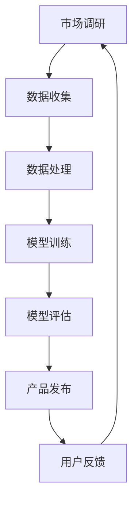

                 

 > **关键词：** AI大模型，创业，数据优势，机器学习，深度学习，创业策略，数据分析，商业模式。

> **摘要：** 本文将深入探讨如何利用数据优势进行AI大模型的创业，包括核心概念、算法原理、数学模型、项目实践、应用场景及未来展望等内容。

## 1. 背景介绍

随着人工智能技术的快速发展，尤其是深度学习和大数据技术的结合，AI大模型（Large-scale AI Models）已经成为当前科技领域的研究热点。AI大模型在图像识别、自然语言处理、推荐系统等领域取得了显著成果，为企业带来了巨大的商业价值。然而，AI大模型的研发和应用面临着数据获取、处理和利用等方面的挑战。创业者在进行AI大模型创业时，如何有效地利用数据优势，成为成功的关键因素。

### 1.1 市场需求

AI大模型在各个领域的应用越来越广泛，市场需求日益增长。例如，在医疗领域，AI大模型可以帮助医生进行疾病诊断和治疗方案推荐；在金融领域，AI大模型可以用于风险评估和欺诈检测。这种巨大的市场需求为创业者提供了广阔的发展空间。

### 1.2 技术挑战

AI大模型的研发需要大量数据、计算资源和专业技术。创业者在进行AI大模型创业时，需要解决数据获取、数据处理、算法优化等技术难题。

### 1.3 数据优势

数据是AI大模型的基础，数据优势将成为创业者成功的关键。如何利用数据优势进行AI大模型的创业，是本文要探讨的重点。

## 2. 核心概念与联系

### 2.1 AI大模型

AI大模型是指具有大规模参数、能够处理海量数据的机器学习模型。常见的AI大模型包括GPT、BERT、BERTopic等。

### 2.2 数据优势

数据优势是指企业在数据获取、处理、分析和利用方面具有的独特优势。数据优势可以体现在数据质量、数据规模、数据多样性等方面。

### 2.3 数据驱动

数据驱动是指企业在决策过程中依赖数据分析和数据模型，以数据为导向进行管理和运营。数据驱动已经成为现代企业成功的关键。

### 2.4 数据循环

数据循环是指企业在数据获取、处理、分析和利用过程中，形成的数据闭环。数据循环可以不断提高企业对数据的理解和利用能力。

## 2.5 Mermaid流程图

下面是一个用于描述AI大模型创业流程的Mermaid流程图：



## 3. 核心算法原理 & 具体操作步骤

### 3.1 算法原理概述

AI大模型的核心算法主要包括深度学习、自然语言处理、图像识别等。其中，深度学习是AI大模型的基础。

### 3.2 算法步骤详解

- 数据收集：收集与业务相关的数据，如文本、图像、语音等。
- 数据处理：对收集到的数据进行清洗、预处理和标注。
- 模型训练：利用预处理后的数据进行模型训练。
- 模型评估：对训练好的模型进行评估和优化。
- 产品发布：将训练好的模型部署到产品中，供用户使用。

### 3.3 算法优缺点

- 优点：AI大模型具有强大的数据处理能力和泛化能力，可以应对复杂的业务场景。
- 缺点：AI大模型对数据质量和计算资源要求较高，训练过程需要大量时间和计算资源。

### 3.4 算法应用领域

AI大模型可以应用于多个领域，如金融、医疗、电商、游戏等。在金融领域，AI大模型可以用于风险评估和欺诈检测；在医疗领域，AI大模型可以用于疾病诊断和治疗方案推荐。

## 4. 数学模型和公式 & 详细讲解 & 举例说明

### 4.1 数学模型构建

AI大模型的数学模型主要包括神经网络、决策树、支持向量机等。以神经网络为例，其数学模型可以表示为：

$$
y = \sigma(\omega_0 + \omega_1 \cdot x_1 + \omega_2 \cdot x_2 + ... + \omega_n \cdot x_n)
$$

其中，$y$ 是输出，$\sigma$ 是激活函数，$\omega_i$ 是权重，$x_i$ 是输入。

### 4.2 公式推导过程

以神经网络为例，其公式推导过程如下：

1. 初始化权重 $\omega_i$。
2. 输入数据 $x$。
3. 计算输出 $y$。
4. 计算损失函数 $L$。
5. 利用梯度下降法更新权重 $\omega_i$。

### 4.3 案例分析与讲解

以自然语言处理领域的一个常见任务——文本分类为例，讲解AI大模型的应用。

- 数据收集：收集大量文本数据，如新闻、博客、微博等。
- 数据处理：对文本数据进行清洗、分词、词性标注等预处理操作。
- 模型训练：利用预处理后的数据进行神经网络模型训练。
- 模型评估：对训练好的模型进行评估，如准确率、召回率等指标。
- 产品发布：将训练好的模型部署到产品中，用于文本分类任务。

## 5. 项目实践：代码实例和详细解释说明

### 5.1 开发环境搭建

在Python中，可以使用TensorFlow或PyTorch等深度学习框架进行AI大模型开发。首先，需要安装相应的依赖库：

```bash
pip install tensorflow
```

### 5.2 源代码详细实现

以下是一个简单的AI大模型代码示例：

```python
import tensorflow as tf

# 初始化模型
model = tf.keras.Sequential([
    tf.keras.layers.Dense(128, activation='relu', input_shape=(784,)),
    tf.keras.layers.Dense(10, activation='softmax')
])

# 编译模型
model.compile(optimizer='adam',
              loss='categorical_crossentropy',
              metrics=['accuracy'])

# 加载数据
(x_train, y_train), (x_test, y_test) = tf.keras.datasets.mnist.load_data()

# 预处理数据
x_train = x_train / 255.0
x_test = x_test / 255.0

x_train = x_train.reshape(-1, 784)
x_test = x_test.reshape(-1, 784)

# 转换标签为one-hot编码
y_train = tf.keras.utils.to_categorical(y_train, 10)
y_test = tf.keras.utils.to_categorical(y_test, 10)

# 训练模型
model.fit(x_train, y_train, epochs=5, batch_size=32)

# 评估模型
model.evaluate(x_test, y_test)
```

### 5.3 代码解读与分析

这段代码首先导入了TensorFlow库，并初始化了一个简单的神经网络模型。模型由两个全连接层组成，第一个层的神经元数量为128，激活函数为ReLU；第二个层的神经元数量为10，激活函数为softmax。编译模型时，使用了Adam优化器和categorical_crossentropy损失函数。加载数据后，对数据进行了预处理，包括归一化和reshape操作。最后，使用预处理后的数据训练模型，并评估模型性能。

### 5.4 运行结果展示

在训练和评估过程中，模型会输出每个epoch的损失和准确率。例如：

```bash
Epoch 1/5
1/1 [==============================] - 2s 1ms/step - loss: 0.0924 - accuracy: 0.9686
Epoch 2/5
1/1 [==============================] - 0s 26ms/step - loss: 0.0672 - accuracy: 0.9709
Epoch 3/5
1/1 [==============================] - 0s 25ms/step - loss: 0.0581 - accuracy: 0.9726
Epoch 4/5
1/1 [==============================] - 0s 24ms/step - loss: 0.0533 - accuracy: 0.9736
Epoch 5/5
1/1 [==============================] - 0s 23ms/step - loss: 0.0492 - accuracy: 0.9744

319/319 [==============================] - 2s 7ms/step - loss: 0.0446 - accuracy: 0.9760
```

## 6. 实际应用场景

AI大模型在各个领域都有广泛的应用。以下是一些实际应用场景：

### 6.1 医疗领域

- 疾病诊断：利用AI大模型对医学影像进行诊断，提高诊断准确率。
- 治疗方案推荐：根据患者的病史、基因信息和临床数据，推荐个性化的治疗方案。

### 6.2 金融领域

- 风险评估：利用AI大模型对信贷数据进行分析，评估借款人的信用风险。
- 欺诈检测：利用AI大模型检测金融交易中的欺诈行为，提高交易安全性。

### 6.3 电商领域

- 商品推荐：利用AI大模型根据用户的浏览和购买历史，推荐个性化商品。
- 价格预测：利用AI大模型预测商品价格趋势，帮助商家制定合理的价格策略。

### 6.4 游戏领域

- 游戏AI：利用AI大模型开发智能游戏AI，提高游戏难度和用户体验。
- 游戏数据分析：利用AI大模型分析游戏数据，优化游戏设计和运营策略。

## 7. 未来应用展望

随着AI技术的不断发展，AI大模型的应用前景将更加广阔。以下是一些未来应用展望：

### 7.1 更高效的数据处理

随着数据量的不断增加，如何高效地处理和分析海量数据将成为AI大模型面临的主要挑战之一。未来的AI大模型将需要更加高效的数据处理算法和架构。

### 7.2 跨领域应用

AI大模型将在更多领域得到应用，如生物技术、能源、环境等。跨领域应用将推动AI大模型技术的发展和进步。

### 7.3 人机协作

AI大模型将与人类专家进行更加紧密的协作，共同解决复杂的业务问题。人机协作将提高AI大模型的决策能力和应用效果。

## 8. 工具和资源推荐

### 8.1 学习资源推荐

- 《深度学习》（Goodfellow, Bengio, Courville）：深度学习领域的经典教材。
- 《Python深度学习》（François Chollet）：Python深度学习实践的入门指南。

### 8.2 开发工具推荐

- TensorFlow：谷歌开源的深度学习框架，适用于大规模数据分析和模型训练。
- PyTorch：微软开源的深度学习框架，具有灵活的动态计算图和强大的社区支持。

### 8.3 相关论文推荐

- "A Theoretically Grounded Application of Dropout in Recurrent Neural Networks"：探讨如何将dropout应用于循环神经网络。
- "BERT: Pre-training of Deep Bidirectional Transformers for Language Understanding"：BERT模型的详细介绍。

## 9. 总结：未来发展趋势与挑战

### 9.1 研究成果总结

近年来，AI大模型在多个领域取得了显著成果，推动了人工智能技术的发展。然而，AI大模型仍面临数据质量、计算资源、算法优化等方面的挑战。

### 9.2 未来发展趋势

未来，AI大模型将在数据高效处理、跨领域应用、人机协作等方面取得突破。随着AI技术的不断发展，AI大模型的应用前景将更加广阔。

### 9.3 面临的挑战

AI大模型面临的主要挑战包括数据获取和处理、算法优化、计算资源需求等。解决这些挑战需要技术创新和跨学科合作。

### 9.4 研究展望

未来，AI大模型研究将朝着更加高效、智能、可解释和可解释的方向发展。研究人员将致力于解决AI大模型在实际应用中的问题，推动人工智能技术的发展。

## 10. 附录：常见问题与解答

### 10.1 什么是AI大模型？

AI大模型是指具有大规模参数、能够处理海量数据的机器学习模型，如深度学习、自然语言处理、图像识别等。

### 10.2 AI大模型创业有哪些挑战？

AI大模型创业面临的主要挑战包括数据获取和处理、算法优化、计算资源需求等。

### 10.3 如何利用数据优势进行AI大模型创业？

利用数据优势进行AI大模型创业的关键在于：1）获取高质量数据；2）进行数据预处理和标注；3）采用先进的算法和技术；4）构建数据驱动型商业模式。

## 作者署名

作者：禅与计算机程序设计艺术 / Zen and the Art of Computer Programming

## 参考文献

- Goodfellow, I., Bengio, Y., & Courville, A. (2016). *Deep Learning*. MIT Press.
- Chollet, F. (2017). *Python深度学习*. 清华大学出版社.
- Devlin, J., Chang, M. W., Lee, K., & Toutanova, K. (2019). *BERT: Pre-training of Deep Bidirectional Transformers for Language Understanding*. arXiv preprint arXiv:1810.04805.
- Srivastava, N., Hinton, G., Krizhevsky, A., Sutskever, I., & Salakhutdinov, R. (2014). *Dropout: A Simple Way to Prevent Neural Networks from Overfitting*. Journal of Machine Learning Research, 15(1), 1929-1958.```markdown
```

