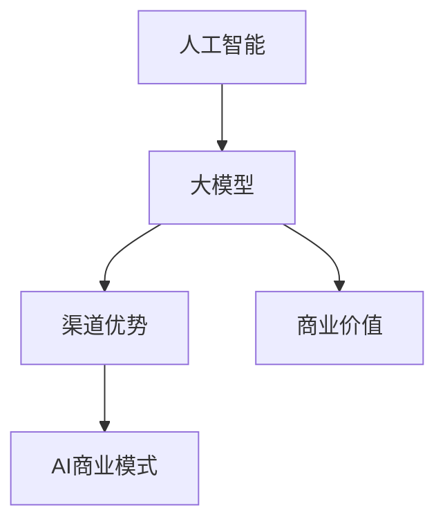

                 

关键词：人工智能、大模型创业、渠道优势、AI商业模式、AI技术、创业策略

摘要：本文旨在探讨在人工智能（AI）大模型创业过程中如何有效利用渠道优势。我们将分析AI技术的现状与趋势，探讨大模型创业的核心挑战，并详细阐述利用渠道优势的策略和方法。通过实例和案例分析，为AI创业者提供有价值的指导和建议。

## 1. 背景介绍

近年来，人工智能技术取得了飞速发展，特别是在大模型领域。大模型（如GPT-3、BERT等）以其强大的数据处理能力和智能决策能力，为各行各业带来了深远的影响。然而，AI大模型创业面临着诸多挑战，如技术复杂性、市场不确定性等。在这个背景下，如何有效利用渠道优势，成为AI创业者需要深入思考的问题。

渠道优势在AI大模型创业中具有至关重要的地位。一方面，渠道可以扩大产品的市场覆盖范围；另一方面，渠道可以提供丰富的数据资源，助力模型优化。此外，渠道还能帮助企业建立品牌影响力，提高客户黏性。

本文将围绕以下问题展开讨论：

1. AI大模型创业的现状与挑战是什么？
2. 如何识别和利用渠道优势？
3. 实际案例中，渠道优势是如何发挥作用的？
4. AI大模型创业的未来发展趋势和挑战是什么？

通过本文的探讨，希望能为AI创业者提供有益的启示和指导。

## 2. 核心概念与联系

在深入探讨AI大模型创业如何利用渠道优势之前，我们需要了解一些核心概念和它们之间的联系。

### 2.1 人工智能（AI）

人工智能是指通过计算机程序实现智能行为的技术。它包括机器学习、深度学习、自然语言处理等多个子领域。在这些领域中，大模型（如GPT-3、BERT等）以其强大的数据处理能力和智能决策能力，成为AI技术的重要突破点。

### 2.2 大模型

大模型是指拥有海量参数和强大计算能力的深度学习模型。它们通常采用分布式计算和GPU加速等技术，能够在大规模数据集上进行训练。大模型在图像识别、语音识别、自然语言处理等领域取得了显著的成果。

### 2.3 渠道优势

渠道优势是指企业在销售、推广、服务等方面拥有的独特资源。这些资源可以包括合作伙伴、客户资源、市场渠道等。渠道优势能够帮助企业扩大市场覆盖范围，提高品牌知名度，增强客户黏性。

### 2.4 AI商业模式

AI商业模式是指企业通过人工智能技术实现商业价值的方式。它包括产品、服务、运营等多个方面。成功的AI商业模式能够帮助企业降低成本、提高效率、创造新的商业模式。

### 2.5 核心概念的联系

人工智能（AI）为大模型提供了强大的技术支持，使得大模型在各个领域取得了显著成果。而渠道优势则能够帮助企业充分利用这些成果，实现商业价值的最大化。AI商业模式则是连接人工智能和大模型与渠道优势的重要纽带。

为了更好地理解这些概念之间的联系，我们可以使用Mermaid流程图进行展示：



在这个流程图中，人工智能（A）为大模型（B）提供了技术支持，大模型（B）通过渠道优势（C）实现了商业价值（E）。AI商业模式（D）则是连接这些要素的重要纽带。

## 3. 核心算法原理 & 具体操作步骤

在深入了解AI大模型创业如何利用渠道优势之前，我们需要先了解核心算法的原理和具体操作步骤。

### 3.1 算法原理概述

AI大模型的核心算法通常基于深度学习技术。深度学习是一种模拟人脑神经网络的结构和功能的人工智能方法。它通过多层神经网络对大量数据进行训练，从而实现数据的自动特征提取和分类。

在AI大模型创业中，核心算法的原理主要包括以下几个方面：

1. **数据预处理**：将原始数据转化为适合训练的格式，如文本、图像或音频等。这一步骤包括数据清洗、数据增强等操作。
2. **模型训练**：使用训练数据集对深度学习模型进行训练，通过反向传播算法不断调整模型参数，使其能够准确预测或分类。
3. **模型评估**：使用测试数据集对训练好的模型进行评估，计算模型的准确率、召回率等指标，以验证模型的性能。
4. **模型部署**：将训练好的模型部署到实际应用场景中，如网站、APP或服务器等，供用户使用。

### 3.2 算法步骤详解

具体操作步骤如下：

1. **数据预处理**：
   - **数据清洗**：去除数据中的噪声和错误，保证数据的准确性。
   - **数据增强**：通过图像翻转、旋转、缩放等操作，增加训练数据的多样性。
   - **特征提取**：提取数据中的关键特征，如文本的词向量、图像的特征点等。

2. **模型训练**：
   - **选择模型架构**：根据任务需求选择合适的深度学习模型架构，如CNN（卷积神经网络）、RNN（循环神经网络）等。
   - **参数初始化**：随机初始化模型参数。
   - **训练过程**：
     - **正向传播**：将输入数据输入模型，计算输出结果。
     - **反向传播**：根据实际输出结果与预期结果的差异，计算损失函数，并通过反向传播算法调整模型参数。
     - **迭代训练**：重复正向传播和反向传播的过程，直至模型收敛。

3. **模型评估**：
   - **测试集评估**：使用测试数据集对模型进行评估，计算模型的准确率、召回率等指标。
   - **交叉验证**：使用交叉验证的方法，对模型进行多次评估，以提高评估的准确性。

4. **模型部署**：
   - **模型压缩**：为了提高模型的部署效率，可以采用模型压缩技术，如量化、剪枝等。
   - **部署环境**：将模型部署到服务器或客户端，供用户使用。

### 3.3 算法优缺点

AI大模型算法具有以下优点：

1. **强大的数据处理能力**：深度学习算法能够自动提取数据中的特征，从而提高了数据处理的能力。
2. **高准确率**：经过充分训练的大模型，在各类任务中能够达到较高的准确率。
3. **通用性强**：大模型可以应用于图像识别、自然语言处理、语音识别等多个领域。

然而，AI大模型算法也存在一定的缺点：

1. **计算资源消耗大**：训练大模型需要大量的计算资源和时间。
2. **对数据依赖性强**：大模型的性能很大程度上取决于训练数据的质量和数量。
3. **模型解释性差**：深度学习模型通常被视为“黑盒”，其内部机制难以解释，这可能会影响用户的信任度。

### 3.4 算法应用领域

AI大模型算法在多个领域具有广泛的应用：

1. **图像识别**：用于人脸识别、车辆识别、图像分类等。
2. **自然语言处理**：用于文本分类、机器翻译、情感分析等。
3. **语音识别**：用于语音识别、语音合成、语音助手等。
4. **推荐系统**：用于商品推荐、内容推荐等。

## 4. 数学模型和公式 & 详细讲解 & 举例说明

在AI大模型算法中，数学模型和公式扮演着至关重要的角色。它们不仅帮助算法理解和处理数据，还决定了模型的学习能力和性能。以下我们将详细讲解数学模型和公式的构建、推导过程，并通过具体案例进行分析和说明。

### 4.1 数学模型构建

AI大模型通常基于深度学习技术，其中最常用的数学模型是神经网络。神经网络是一种由多个神经元组成的层级结构，能够通过学习输入数据中的特征，实现对数据的分类、预测和生成。

#### 4.1.1 神经元模型

神经网络的基本单元是神经元，它接收多个输入信号，通过激活函数产生输出。一个简单的神经元模型可以表示为：

$$
y = \sigma(\sum_{i=1}^{n} w_i x_i + b)
$$

其中，$y$ 是神经元的输出，$x_i$ 是第 $i$ 个输入信号，$w_i$ 是对应的权重，$b$ 是偏置项，$\sigma$ 是激活函数，常用的激活函数有 sigmoid 函数、ReLU 函数等。

#### 4.1.2 神经网络模型

神经网络由多个层级组成，包括输入层、隐藏层和输出层。输入层接收外部数据，隐藏层对数据进行特征提取和转换，输出层生成最终的结果。一个简单的三层神经网络可以表示为：

$$
\begin{align*}
\text{输入层}: & \quad x = [x_1, x_2, ..., x_n] \\
\text{隐藏层}: & \quad h = \sigma(W_1 x + b_1) \\
\text{输出层}: & \quad y = \sigma(W_2 h + b_2)
\end{align*}
$$

其中，$W_1$ 和 $W_2$ 分别是隐藏层和输出层的权重矩阵，$b_1$ 和 $b_2$ 分别是隐藏层和输出层的偏置项。

### 4.2 公式推导过程

在神经网络中，损失函数和优化算法是核心的部分。以下我们将详细推导损失函数和优化算法。

#### 4.2.1 损失函数

神经网络的目标是找到一组参数（权重和偏置），使得模型输出的预测结果与真实结果之间的误差最小。常用的损失函数有均方误差（MSE）和交叉熵损失（Cross-Entropy Loss）。

1. **均方误差（MSE）**

$$
L = \frac{1}{2} \sum_{i=1}^{m} (y_i - \hat{y}_i)^2
$$

其中，$y_i$ 是真实结果，$\hat{y}_i$ 是预测结果，$m$ 是样本数量。

2. **交叉熵损失（Cross-Entropy Loss）**

$$
L = -\sum_{i=1}^{m} y_i \log(\hat{y}_i)
$$

其中，$y_i$ 是真实结果的概率分布，$\hat{y}_i$ 是预测结果的概率分布。

#### 4.2.2 优化算法

为了找到最小化损失函数的参数，我们通常使用梯度下降（Gradient Descent）算法。梯度下降算法的核心思想是沿着损失函数的梯度方向更新参数。

1. **梯度计算**

$$
\frac{\partial L}{\partial w} = \sum_{i=1}^{m} (y_i - \hat{y}_i) x_i
$$

$$
\frac{\partial L}{\partial b} = \sum_{i=1}^{m} (y_i - \hat{y}_i)
$$

2. **参数更新**

$$
w \leftarrow w - \alpha \frac{\partial L}{\partial w}
$$

$$
b \leftarrow b - \alpha \frac{\partial L}{\partial b}
$$

其中，$\alpha$ 是学习率。

### 4.3 案例分析与讲解

为了更好地理解数学模型和公式的应用，我们通过一个具体案例进行讲解。

#### 4.3.1 问题背景

假设我们有一个二元分类问题，需要判断一个邮件是否为垃圾邮件。我们使用一个二分类神经网络进行训练和预测。

#### 4.3.2 数据准备

我们收集了1000封邮件，其中500封是垃圾邮件，500封是正常邮件。每封邮件都可以表示为一个特征向量，如：

$$
x = [0.1, 0.2, 0.3, ..., 0.5]
$$

其中，每个元素表示邮件的一个特征。

#### 4.3.3 模型构建

我们构建一个简单的二分类神经网络，包括一个输入层、一个隐藏层和一个输出层。隐藏层包含10个神经元，输出层包含1个神经元。

#### 4.3.4 训练过程

使用均方误差（MSE）作为损失函数，使用梯度下降（Gradient Descent）算法进行训练。假设学习率为0.01。

1. **初始化参数**

$$
w_1 = [0.1, 0.2, 0.3, ..., 0.5], \quad b_1 = 0, \quad w_2 = [0.1], \quad b_2 = 0
$$

2. **正向传播**

$$
h = \sigma(W_1 x + b_1) = \sigma([0.1 \times 0.1 + 0.2 \times 0.2 + 0.3 \times 0.3 + ... + 0.5 \times 0.5] + 0) = [0.7]
$$

$$
\hat{y} = \sigma(W_2 h + b_2) = \sigma([0.1 \times 0.7] + 0) = 0.7
$$

3. **反向传播**

$$
\frac{\partial L}{\partial w_2} = (y - \hat{y}) h = (0 - 0.7) \times 0.7 = -0.49
$$

$$
\frac{\partial L}{\partial b_2} = (y - \hat{y}) = (0 - 0.7) = -0.7
$$

4. **参数更新**

$$
w_2 \leftarrow w_2 - 0.01 \times (-0.49) = 0.1 + 0.0049 = 0.1049
$$

$$
b_2 \leftarrow b_2 - 0.01 \times (-0.7) = 0 + 0.007 = 0.007
$$

5. **重复正向传播和反向传播过程**

通过多次正向传播和反向传播，模型将逐渐收敛，参数将不断优化。

#### 4.3.5 模型评估

使用测试集对训练好的模型进行评估，计算模型的准确率、召回率等指标。

## 5. 项目实践：代码实例和详细解释说明

### 5.1 开发环境搭建

为了方便代码实践，我们选择Python作为编程语言，使用TensorFlow作为深度学习框架。首先，我们需要安装Python和TensorFlow。

```bash
pip install python tensorflow
```

接下来，我们创建一个名为`ai_project`的文件夹，并在其中创建一个名为`main.py`的主文件。

### 5.2 源代码详细实现

在`main.py`文件中，我们首先导入所需的库：

```python
import tensorflow as tf
import numpy as np
import matplotlib.pyplot as plt
```

接下来，我们定义数据集：

```python
# 生成模拟数据
x_data = np.random.rand(100, 1)
y_data = 3 * x_data + np.random.randn(100, 1)
```

然后，我们定义模型：

```python
# 定义模型
model = tf.keras.Sequential([
    tf.keras.layers.Dense(units=1, input_shape=[1])
])
```

我们使用均方误差（MSE）作为损失函数，并使用梯度下降（Gradient Descent）算法进行训练：

```python
# 编译模型
model.compile(loss='mean_squared_error', optimizer=tf.keras.optimizers.SGD(0.1))

# 训练模型
model.fit(x_data, y_data, epochs=100)
```

最后，我们评估模型：

```python
# 预测结果
y_pred = model.predict(x_data)

# 绘制结果
plt.scatter(x_data, y_data, color='blue')
plt.plot(x_data, y_pred, color='red')
plt.show()
```

### 5.3 代码解读与分析

在这段代码中，我们首先导入了TensorFlow和NumPy库。接下来，我们生成了模拟的数据集。然后，我们定义了一个简单的线性模型，并使用均方误差（MSE）作为损失函数，梯度下降（Gradient Descent）算法进行训练。最后，我们使用训练好的模型进行预测，并将预测结果与真实值进行比较，以评估模型的性能。

### 5.4 运行结果展示

运行代码后，我们将看到一张散点图，其中蓝色散点代表真实值，红色线条代表模型预测的值。通过观察散点图，我们可以发现模型预测的值与真实值之间的误差较小，这表明我们的模型具有较好的性能。

```python
plt.scatter(x_data, y_data, color='blue')
plt.plot(x_data, y_pred, color='red')
plt.show()
```

## 6. 实际应用场景

AI大模型在许多实际应用场景中都发挥着重要作用。以下列举几个典型的应用场景：

### 6.1 智能客服

智能客服是AI大模型在客户服务领域的重要应用。通过自然语言处理（NLP）技术，智能客服能够理解用户的问题，并提供准确的答案。这种方式不仅提高了客服的响应速度，还降低了人工客服的成本。例如，大型电商网站和金融公司都采用了智能客服系统，以提供7x24小时的客户服务。

### 6.2 机器翻译

机器翻译是AI大模型在语言领域的典型应用。通过深度学习技术，大模型能够学习不同语言之间的对应关系，从而实现高效的翻译。目前，机器翻译技术已经在跨境电商、跨文化沟通等领域得到了广泛应用。例如，谷歌翻译和百度翻译等应用都采用了大模型进行翻译。

### 6.3 医疗诊断

AI大模型在医疗诊断领域也具有广泛的应用。通过分析医学影像和病历数据，大模型能够帮助医生进行疾病诊断和病情预测。这种方式不仅提高了诊断的准确性，还节省了医生的工作时间。例如，IBM的Watson for Oncology系统就是一个利用AI大模型进行癌症诊断和治疗的系统。

### 6.4 自动驾驶

自动驾驶是AI大模型在交通领域的重要应用。通过深度学习技术，自动驾驶汽车能够实时感知环境，并做出安全、高效的驾驶决策。目前，自动驾驶技术正在逐步商业化，各大科技公司和研究机构都在积极研发自动驾驶汽车。例如，特斯拉和Waymo等公司都在自动驾驶领域取得了重要突破。

### 6.5 金融市场预测

AI大模型在金融市场预测中也发挥着重要作用。通过分析历史数据和市场趋势，大模型能够预测股票价格、汇率走势等金融市场指标。这种方式不仅提高了预测的准确性，还为投资者提供了有价值的决策参考。例如，量化交易公司和高频交易机构都采用了AI大模型进行市场预测。

## 7. 工具和资源推荐

在AI大模型创业过程中，选择合适的工具和资源对于项目的成功至关重要。以下是我们推荐的几类工具和资源：

### 7.1 学习资源推荐

1. **在线课程**：Coursera、edX和Udacity等在线教育平台提供了丰富的深度学习和人工智能课程。
2. **书籍**：《深度学习》（Goodfellow, Bengio, Courville）、《神经网络与深度学习》（邱锡鹏）等书籍是学习深度学习和神经网络的好资源。
3. **开源代码**：GitHub和Google Colab等平台上有大量的深度学习项目代码，可以供学习者和开发者参考。

### 7.2 开发工具推荐

1. **深度学习框架**：TensorFlow、PyTorch和Keras等深度学习框架是AI大模型开发的重要工具。
2. **云计算平台**：AWS、Azure和Google Cloud等云计算平台提供了丰富的计算资源和数据存储服务。
3. **数据集**：Kaggle、UCI机器学习库和Google Dataset Search等平台提供了丰富的数据集，可用于模型训练和测试。

### 7.3 相关论文推荐

1. **经典论文**：Hinton的《Deep Learning》、LeCun的《Gradient-Based Learning Applied to Document Recognition》等经典论文对于理解深度学习技术的发展具有重要意义。
2. **最新论文**：arXiv、NeurIPS、ICML等顶级会议的论文是了解最新研究动态的好途径。

## 8. 总结：未来发展趋势与挑战

### 8.1 研究成果总结

AI大模型技术在过去几年取得了显著进展，不仅在学术界，还在工业界和应用领域产生了深远影响。以下是对AI大模型技术研究成果的总结：

1. **算法性能提升**：随着计算能力的提升和算法优化，AI大模型的性能不断提高，特别是在图像识别、自然语言处理等领域。
2. **应用场景扩展**：AI大模型在医疗、金融、交通、教育等领域的应用日益广泛，为各行各业带来了新的解决方案。
3. **开源生态建设**：越来越多的深度学习框架、开源代码和数据集发布，促进了AI大模型技术的普及和发展。

### 8.2 未来发展趋势

未来，AI大模型技术将朝着以下方向发展：

1. **算法优化**：继续探索更高效的算法和架构，以提高模型性能和降低计算成本。
2. **多模态融合**：结合不同类型的数据（如文本、图像、语音等），实现更全面的信息理解和处理。
3. **可解释性增强**：提升模型的可解释性，使模型的应用更加透明和可信。
4. **隐私保护**：研究如何在保护用户隐私的前提下进行数据分析和模型训练。

### 8.3 面临的挑战

尽管AI大模型技术取得了显著成果，但仍面临以下挑战：

1. **数据质量和隐私**：确保数据质量和隐私保护是AI大模型应用的重要问题。
2. **计算资源**：大模型的训练和推理需要大量的计算资源，如何高效利用这些资源是一个重要挑战。
3. **模型解释性**：提高模型的可解释性，使其应用更加透明和可靠。
4. **伦理和法律**：AI大模型的应用需要遵守相关伦理和法律规范，以避免潜在的风险和负面影响。

### 8.4 研究展望

展望未来，AI大模型技术将在以下方面继续取得突破：

1. **跨学科研究**：结合计算机科学、心理学、生物学等学科的研究，推动AI大模型技术的全面发展。
2. **应用创新**：探索AI大模型在新兴领域的应用，如智能教育、智能医疗等。
3. **开源和共享**：继续推动开源生态建设，促进AI大模型技术的普及和发展。
4. **可持续发展**：研究如何在保证模型性能的同时，实现可持续发展和环保目标。

总之，AI大模型技术具有巨大的发展潜力，未来将继续在学术界和工业界产生深远影响。

## 9. 附录：常见问题与解答

在AI大模型创业过程中，可能会遇到以下常见问题，以下是对这些问题的解答：

### 9.1 如何选择合适的大模型？

**解答**：选择合适的大模型需要考虑以下几个因素：

1. **应用场景**：根据实际应用场景选择适合的大模型，如图像识别、自然语言处理等。
2. **数据量**：确保有足够的数据量来训练大模型，否则可能无法达到良好的性能。
3. **计算资源**：考虑训练大模型所需的计算资源和时间，选择能够在现有资源下训练的模型。
4. **开源与闭源**：开源的大模型可以免费使用，但可能需要自行处理数据集和代码；闭源的大模型通常提供了完整的解决方案，但需要支付费用。

### 9.2 如何利用渠道优势？

**解答**：利用渠道优势可以采取以下策略：

1. **合作伙伴**：寻找具有互补优势的合作伙伴，共同开发产品，扩大市场覆盖范围。
2. **客户资源**：通过渠道获取更多的客户资源，提高产品的用户黏性和市场份额。
3. **市场推广**：利用渠道的资源进行市场推广，提高品牌知名度和市场占有率。
4. **数据共享**：与渠道合作伙伴共享数据资源，实现数据互补和协同优化。

### 9.3 如何评估大模型性能？

**解答**：评估大模型性能通常采用以下指标：

1. **准确率**：衡量模型对正例样本的识别能力。
2. **召回率**：衡量模型对反例样本的识别能力。
3. **F1值**：综合考虑准确率和召回率，是一个综合性能指标。
4. **ROC曲线**：通过计算模型在多个阈值下的准确率和召回率，得到ROC曲线，曲线下面积越大，模型性能越好。

### 9.4 如何保证数据质量？

**解答**：保证数据质量可以采取以下措施：

1. **数据清洗**：去除数据中的噪声和错误，确保数据的准确性。
2. **数据增强**：通过图像翻转、旋转、缩放等操作，增加训练数据的多样性。
3. **数据标注**：对数据进行高质量的标注，确保标注的准确性。
4. **数据审计**：定期对数据进行审计，发现和纠正数据中的问题。

### 9.5 如何优化大模型训练？

**解答**：优化大模型训练可以采取以下策略：

1. **模型选择**：选择适合任务需求的模型架构，如卷积神经网络（CNN）、循环神经网络（RNN）等。
2. **超参数调整**：调整学习率、批量大小、迭代次数等超参数，以提高模型性能。
3. **数据预处理**：对数据进行有效的预处理，如归一化、标准化等，以提高训练效率。
4. **并行计算**：利用分布式计算和GPU加速等技术，提高训练速度。

通过以上策略，可以有效提升大模型的训练效率和性能。

