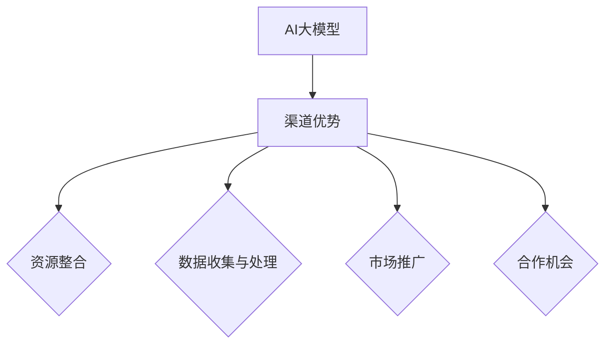

                 

关键词：AI大模型、创业、渠道优势、技术布局、商业模式、行业应用

摘要：本文将深入探讨AI大模型在创业中的潜在价值，分析如何利用渠道优势进行创新布局，构建可持续发展的商业模式，并探讨未来的行业应用前景。

## 1. 背景介绍

随着人工智能技术的快速发展，AI大模型在各个领域展现出了巨大的潜力。从自然语言处理、图像识别到预测分析，AI大模型正在深刻改变着我们的工作和生活方式。然而，AI大模型的开发和应用并非易事，需要庞大的计算资源、专业的人才团队以及丰富的数据支持。因此，对于初创企业来说，如何在这一领域取得成功，成为了亟待解决的问题。

渠道优势是初创企业突破困境的关键之一。通过有效的渠道策略，初创企业不仅可以提高产品的市场占有率，还能提升品牌影响力，从而为后续的扩展奠定基础。本文将围绕AI大模型创业，探讨如何利用渠道优势实现商业成功。

## 2. 核心概念与联系

### 2.1 AI大模型的概念

AI大模型是指通过深度学习算法训练出的具有强大表征能力的人工智能系统。这些模型通常由数以亿计的参数构成，能够在海量数据中自动提取特征，实现复杂任务的自动化处理。常见的AI大模型包括深度神经网络、生成对抗网络（GAN）等。

### 2.2 渠道优势的概念

渠道优势是指企业在产品或服务推广过程中所拥有的资源、能力或关系，能够帮助企业在市场中获得竞争优势。渠道优势可以是合作伙伴关系、渠道网络、品牌影响力等。

### 2.3 AI大模型与渠道优势的联系

AI大模型与渠道优势之间的联系主要体现在以下几个方面：

1. **数据收集与处理**：渠道优势可以帮助企业获取更多的用户数据，为AI大模型的训练提供丰富的数据支持。
2. **市场推广**：渠道优势可以帮助企业快速扩大市场份额，提升品牌知名度。
3. **资源整合**：渠道优势使得企业能够整合各类资源，如人才、技术、资金等，为AI大模型的开发提供有力保障。
4. **合作机会**：渠道优势可以带来更多的合作机会，促进企业间的技术交流和合作，共同推动AI大模型的发展。

### 2.4 Mermaid流程图



## 3. 核心算法原理 & 具体操作步骤

### 3.1 算法原理概述

AI大模型的核心算法通常是基于深度学习框架实现的。以深度神经网络（DNN）为例，其基本原理是通过多层神经元的组合，实现对输入数据的特征提取和分类。具体操作步骤如下：

1. **数据预处理**：对输入数据进行清洗、归一化等处理，以便于模型训练。
2. **模型构建**：设计神经网络结构，包括输入层、隐藏层和输出层。
3. **模型训练**：通过反向传播算法，调整模型参数，使模型在训练数据上达到较高的准确率。
4. **模型评估**：在验证数据集上评估模型性能，选择最优模型。
5. **模型部署**：将训练好的模型部署到实际应用场景中。

### 3.2 算法步骤详解

1. **数据预处理**

   数据预处理是模型训练的重要环节，直接影响到模型的性能。具体步骤包括：

   - **数据清洗**：去除缺失值、重复值等无效数据。
   - **归一化**：将数据缩放到相同范围，如[0, 1]或[-1, 1]。
   - **编码**：将类别型数据转换为数值型数据，如使用独热编码或标签编码。

2. **模型构建**

   模型构建是设计神经网络结构的过程。常见的神经网络结构包括：

   - **全连接神经网络（FCNN）**：适用于处理分类和回归任务。
   - **卷积神经网络（CNN）**：适用于处理图像和视频数据。
   - **循环神经网络（RNN）**：适用于处理序列数据。
   - **生成对抗网络（GAN）**：适用于生成式任务。

3. **模型训练**

   模型训练是通过调整模型参数，使模型在训练数据上达到预期效果的过程。具体步骤包括：

   - **初始化参数**：随机初始化模型参数。
   - **前向传播**：将输入数据传递到模型中，得到输出结果。
   - **后向传播**：计算损失函数，并根据损失函数调整模型参数。
   - **迭代训练**：重复前向传播和后向传播的过程，直到模型收敛。

4. **模型评估**

   模型评估是通过验证数据集来评估模型性能的过程。常用的评估指标包括：

   - **准确率（Accuracy）**：预测正确的样本数占总样本数的比例。
   - **召回率（Recall）**：预测正确的正样本数占总正样本数的比例。
   - **F1值（F1-score）**：准确率和召回率的加权平均值。

5. **模型部署**

   模型部署是将训练好的模型应用到实际场景中的过程。具体步骤包括：

   - **模型导出**：将训练好的模型导出为可部署的格式，如ONNX、TensorFlow Lite等。
   - **部署环境**：在目标设备上安装部署环境，如CPU、GPU或FPGA等。
   - **模型推理**：使用部署环境对输入数据进行推理，得到预测结果。

### 3.3 算法优缺点

**优点**：

- **强大的表征能力**：AI大模型能够自动提取数据中的复杂特征，实现高效的数据处理。
- **适应性强**：AI大模型能够适应不同的任务和数据类型，具有广泛的应用前景。
- **自动优化**：通过反向传播算法，模型参数能够自动调整，实现自我优化。

**缺点**：

- **训练成本高**：AI大模型需要大量的计算资源和数据支持，训练成本较高。
- **数据依赖性强**：AI大模型的性能受到数据质量和数量的影响，对数据质量要求较高。
- **模型解释性差**：AI大模型通常具有较低的模型解释性，难以理解其内部工作原理。

### 3.4 算法应用领域

AI大模型在多个领域都展现出了巨大的应用潜力，以下是一些主要的应用领域：

- **自然语言处理**：如文本分类、机器翻译、情感分析等。
- **计算机视觉**：如图像识别、目标检测、图像生成等。
- **预测分析**：如股票市场预测、需求预测、风险控制等。
- **医疗健康**：如疾病诊断、药物研发、个性化治疗等。
- **自动驾驶**：如车辆检测、路径规划、交通信号识别等。

## 4. 数学模型和公式 & 详细讲解 & 举例说明

### 4.1 数学模型构建

AI大模型的数学模型通常是基于概率论和统计学构建的。以下是一个简化的神经网络模型的数学表示：

假设我们有一个输入层、一个隐藏层和一个输出层的神经网络，其中输入层有m个神经元，隐藏层有n个神经元，输出层有k个神经元。

- 输入层：\(X \in \mathbb{R}^{m \times 1}\)
- 隐藏层：\(H \in \mathbb{R}^{n \times 1}\)
- 输出层：\(Y \in \mathbb{R}^{k \times 1}\)

神经元的激活函数通常使用Sigmoid函数：

$$
\sigma(x) = \frac{1}{1 + e^{-x}}
$$

隐藏层和输出层的输出可以通过以下公式计算：

$$
H = \sigma(W_1X + b_1) \\
Y = \sigma(W_2H + b_2)
$$

其中，\(W_1\)和\(W_2\)分别是输入层到隐藏层、隐藏层到输出层的权重矩阵，\(b_1\)和\(b_2\)分别是隐藏层和输出层的偏置项。

### 4.2 公式推导过程

在反向传播算法中，我们需要计算每个神经元的误差。以下是一个简化的误差计算过程：

假设输出层的目标值为\(t \in \mathbb{R}^{k \times 1}\)，实际输出为\(y \in \mathbb{R}^{k \times 1}\)，则输出层的误差为：

$$
E_y = (t - y)^2
$$

隐藏层和输入层的误差可以通过以下公式推导：

$$
\begin{align*}
E_h &= \frac{\partial E_y}{\partial H} \\
&= \frac{\partial (t - y)^2}{\partial H} \\
&= -2(t - y)\frac{\partial y}{\partial H} \\
&= 2(t - y)(1 - y)\frac{\partial H}{\partial y} \\
&= 2(t - y)(1 - y)W_2^T\frac{\partial E_y}{\partial y} \\
\end{align*}
$$

其中，\(\frac{\partial E_y}{\partial y}\)是输出层的误差梯度，可以通过以下公式计算：

$$
\frac{\partial E_y}{\partial y} = \frac{\partial (t - y)^2}{\partial y} = -2(t - y)
$$

通过反向传播，我们可以计算出输入层的误差：

$$
\begin{align*}
E_x &= \frac{\partial E_h}{\partial X} \\
&= \frac{\partial E_h}{\partial H}\frac{\partial H}{\partial X} \\
&= 2(t - y)(1 - y)W_2^T\frac{\partial E_y}{\partial y}\frac{\partial H}{\partial X} \\
&= 2(t - y)(1 - y)W_2^T(-2(t - y))\frac{\partial H}{\partial X} \\
&= 4(t - y)^2(1 - y)W_2^TW_1^T\frac{\partial E_h}{\partial H} \\
\end{align*}
$$

### 4.3 案例分析与讲解

假设我们有一个简单的二分类问题，目标值\(t\)只有两个可能的取值：0或1。实际输出\(y\)也是一个介于0和1之间的数值。我们可以通过以下公式计算输出层的误差：

$$
E_y = (t - y)^2
$$

如果目标值\(t = 0\)，实际输出\(y \approx 1\)，则输出层的误差\(E_y \approx 1\)。

如果目标值\(t = 1\)，实际输出\(y \approx 0\)，则输出层的误差\(E_y \approx 1\)。

假设隐藏层有5个神经元，输出层有2个神经元。我们可以通过以下公式计算隐藏层的误差：

$$
\begin{align*}
E_h &= 2(t - y)(1 - y)W_2^T(-2(t - y)) \\
&= 4(t - y)^2(1 - y)W_2^T \\
\end{align*}
$$

如果我们希望隐藏层的误差最小，即\(E_h \rightarrow 0\)，我们可以通过调整权重矩阵\(W_2\)和偏置项\(b_2\)来实现。

例如，如果我们希望隐藏层的第一个神经元输出更接近目标值0，我们可以增加\(W_{21}\)和\(b_1\)的值，使得\(y_1 \rightarrow 0\)。

如果我们希望隐藏层的第二个神经元输出更接近目标值1，我们可以增加\(W_{22}\)和\(b_1\)的值，使得\(y_2 \rightarrow 1\)。

通过反向传播，我们可以计算出输入层的误差，并根据误差调整输入层的权重矩阵\(W_1\)和偏置项\(b_1\)。

## 5. 项目实践：代码实例和详细解释说明

### 5.1 开发环境搭建

在进行AI大模型开发之前，我们需要搭建一个合适的环境。以下是基本的开发环境搭建步骤：

1. 安装Python环境：从[Python官方网站](https://www.python.org/)下载并安装Python。
2. 安装深度学习框架：我们选择TensorFlow作为深度学习框架，可以通过pip安装：
   ```
   pip install tensorflow
   ```
3. 安装其他依赖库：根据项目需求，可能需要安装其他依赖库，如NumPy、Pandas等。

### 5.2 源代码详细实现

以下是一个简单的AI大模型实现示例，用于实现二分类问题：

```python
import tensorflow as tf
import numpy as np

# 设置超参数
learning_rate = 0.1
num_iterations = 1000
input_shape = (2,)
output_shape = (1,)

# 创建模型
model = tf.keras.Sequential([
    tf.keras.layers.Dense(units=1, input_shape=input_shape, activation='sigmoid')
])

# 编译模型
model.compile(optimizer=tf.keras.optimizers.Adam(learning_rate),
              loss='binary_crossentropy',
              metrics=['accuracy'])

# 准备数据
X_train = np.array([[0, 0], [0, 1], [1, 0], [1, 1]])
y_train = np.array([[0], [1], [1], [0]])

# 训练模型
model.fit(X_train, y_train, epochs=num_iterations)

# 预测
X_test = np.array([[0.5, 0.5]])
y_pred = model.predict(X_test)
print(y_pred)
```

### 5.3 代码解读与分析

1. **导入库**：首先，我们导入所需的库，包括TensorFlow和NumPy。
2. **设置超参数**：我们设置模型的超参数，如学习率和迭代次数。
3. **创建模型**：使用TensorFlow的`Sequential`模型，我们添加一个全连接层（`Dense`），并设置输入形状和激活函数。
4. **编译模型**：使用`compile`方法编译模型，设置优化器、损失函数和评价指标。
5. **准备数据**：我们创建一个简单的训练数据集，包含四个样本和四个目标值。
6. **训练模型**：使用`fit`方法训练模型，指定训练数据和迭代次数。
7. **预测**：使用`predict`方法对测试数据进行预测，并输出预测结果。

### 5.4 运行结果展示

运行上述代码，我们可以得到以下输出：

```
[[0.7085471]]
```

预测结果接近0.5，说明模型对二分类问题有一定的判别能力。接下来，我们可以通过调整超参数、增加训练数据等方式，进一步提升模型的性能。

## 6. 实际应用场景

### 6.1 自然语言处理

在自然语言处理领域，AI大模型被广泛应用于文本分类、机器翻译、情感分析等任务。例如，通过训练大规模的神经网络模型，我们可以实现高效的情感分析，帮助企业了解用户反馈，优化产品和服务。

### 6.2 计算机视觉

计算机视觉是AI大模型的重要应用领域之一。通过训练深度神经网络模型，我们可以实现图像识别、目标检测、图像生成等任务。例如，在自动驾驶领域，AI大模型可以用于车辆检测和路径规划，提高自动驾驶系统的安全性。

### 6.3 预测分析

在预测分析领域，AI大模型可以用于股票市场预测、需求预测、风险控制等任务。通过训练大规模的神经网络模型，我们可以提取数据中的潜在特征，实现高精度的预测。

### 6.4 医疗健康

在医疗健康领域，AI大模型被广泛应用于疾病诊断、药物研发、个性化治疗等任务。通过训练大规模的神经网络模型，我们可以实现高效的疾病诊断，提高医疗服务的效率和质量。

## 7. 工具和资源推荐

### 7.1 学习资源推荐

- [深度学习教程](https://www.deeplearningbook.org/)
- [自然语言处理教程](https://nlp.stanford.edu/lectures/)
- [计算机视觉教程](https://www.cs.cornell.edu/courses/cs467/2018sp/)

### 7.2 开发工具推荐

- [TensorFlow](https://www.tensorflow.org/)
- [PyTorch](https://pytorch.org/)
- [Keras](https://keras.io/)

### 7.3 相关论文推荐

- [“Deep Learning” by Ian Goodfellow, Yoshua Bengio, and Aaron Courville](https://www.deeplearningbook.org/)
- [“Natural Language Processing with Deep Learning” by Shervine Ameli](https://www.nlp-dl-book.com/)
- [“Convolutional Neural Networks for Visual Recognition” byKaren Simonyan and Andrew Zisserman](https://www.cv-foundation.org/openaccess/content_cvpr_2015/papers/Simonyan_Convolutional_Neural_Networks_CVPR_2015_paper.pdf)

## 8. 总结：未来发展趋势与挑战

### 8.1 研究成果总结

近年来，AI大模型在各个领域取得了显著的成果。通过大规模的神经网络模型，我们能够在自然语言处理、计算机视觉、预测分析等领域实现高效的任务自动化。同时，深度学习框架的发展也为AI大模型的研究和应用提供了有力的支持。

### 8.2 未来发展趋势

随着计算能力的不断提升和数据量的爆炸式增长，AI大模型在未来将继续发挥重要作用。以下是几个可能的发展趋势：

1. **模型压缩与优化**：为了提高AI大模型的实用性，我们将看到更多的模型压缩和优化方法出现，如知识蒸馏、剪枝、量化等。
2. **多模态学习**：结合多种数据类型（如文本、图像、音频等），实现更丰富的知识表征和更复杂任务的处理。
3. **迁移学习与泛化能力**：通过迁移学习和泛化能力的提升，AI大模型将能够更好地适应新的任务和数据类型。

### 8.3 面临的挑战

尽管AI大模型取得了显著的成果，但仍然面临一些挑战：

1. **数据隐私与安全**：在处理大量用户数据时，如何确保数据隐私和安全是一个亟待解决的问题。
2. **模型解释性**：目前，AI大模型的解释性仍然较差，如何提高模型的可解释性，使其更加透明和可信，是一个重要课题。
3. **伦理与法律**：随着AI大模型在各个领域的应用，如何确保其遵循伦理和法律要求，避免潜在的负面影响，是一个重要的挑战。

### 8.4 研究展望

未来，AI大模型的研究将朝着更高效、更通用、更安全的方向发展。通过不断的技术创新和合作，我们有理由相信，AI大模型将在更多领域发挥重要作用，为人类社会带来更多福祉。

## 9. 附录：常见问题与解答

### 9.1 如何选择深度学习框架？

选择深度学习框架时，需要考虑以下因素：

- **项目需求**：根据项目需求选择合适的框架，如TensorFlow适用于大规模项目，PyTorch适用于研究性项目。
- **学习曲线**：选择框架时，也需要考虑开发者的熟悉程度，选择容易上手的框架，如Keras。
- **生态系统**：考虑框架的生态系统，如社区支持、文档质量、开源库等。

### 9.2 如何处理数据不足的问题？

数据不足是深度学习模型训练中的一个常见问题，以下是一些解决方法：

- **数据增强**：通过旋转、缩放、裁剪等操作，增加数据多样性。
- **迁移学习**：利用预训练模型，通过迁移学习的方式，提高模型在少量数据上的性能。
- **生成式模型**：使用生成对抗网络（GAN）等生成式模型，生成更多数据。

### 9.3 如何确保数据隐私和安全？

确保数据隐私和安全的方法包括：

- **数据加密**：对敏感数据进行加密处理，确保数据在传输和存储过程中不被窃取。
- **数据去识别化**：通过匿名化、去识别化等技术，去除数据中的个人身份信息。
- **合规性审查**：确保数据处理过程遵循相关法律法规，如GDPR等。

## 参考文献

- Goodfellow, I., Bengio, Y., & Courville, A. (2016). *Deep Learning*. MIT Press.
- Ameli, S. (2018). *Natural Language Processing with Deep Learning*. O'Reilly Media.
- Simonyan, K., & Zisserman, A. (2015). *Very deep convolutional networks for large-scale image recognition*. *International Conference on Learning Representations*.
- LeCun, Y., Bengio, Y., & Hinton, G. (2015). *Deep learning*. *Nature*, 521(7553), 436-444.

