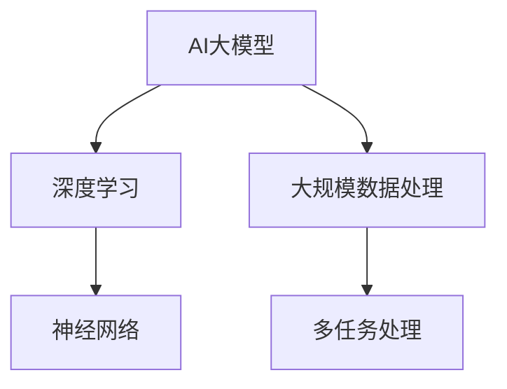
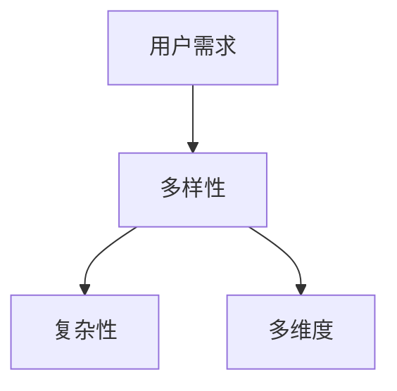
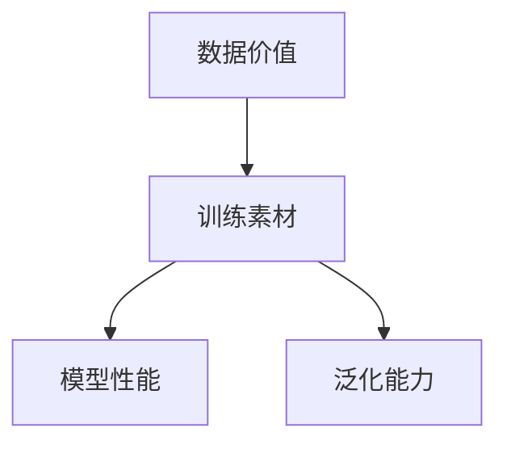
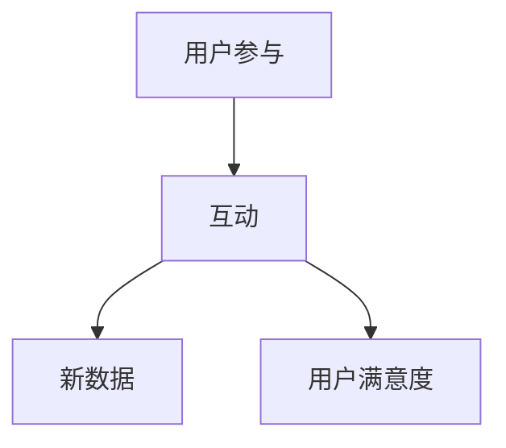

                 

关键词：AI大模型、创业、用户优势、技术应用、商业模式

摘要：本文将探讨在AI大模型创业过程中如何有效利用用户优势。通过分析用户需求的多样性、数据的价值以及用户参与的重要性，文章将提出一系列策略和方法，帮助创业者更好地整合用户资源，提升AI大模型的应用效果和市场竞争力。

## 1. 背景介绍

随着人工智能技术的迅猛发展，AI大模型作为一种强大的工具，正在各行各业中发挥越来越重要的作用。这些大模型通过深度学习算法，能够从大量数据中提取知识，实现复杂的预测和决策任务。然而，AI大模型的性能和效果很大程度上依赖于数据的质量和数量。对于创业者来说，如何获取高质量的用户数据，并充分利用用户优势成为了一个关键问题。

用户数据不仅是AI大模型训练的基础，也是企业创新和发展的关键资源。用户需求的多样性决定了数据的多维度，而用户参与则为数据提供了活性的保证。因此，如何巧妙地利用用户优势，不仅能够提升AI大模型的性能，还能够为企业带来更多的商业机会。

本文将围绕以下问题展开讨论：

1. 用户需求多样性的特点及其对AI大模型创业的影响。
2. 数据的价值及其在AI大模型创业中的作用。
3. 用户参与的机制和方式。
4. 如何通过用户优势提升AI大模型的应用效果和市场竞争力。

## 2. 核心概念与联系

为了更好地理解AI大模型创业与用户优势的关系，我们首先需要了解一些核心概念和基本原理。以下是相关的概念和Mermaid流程图，展示它们之间的联系。

### 2.1. AI大模型

AI大模型通常是指使用深度学习技术训练的复杂神经网络，这些模型具有处理大规模数据的能力，能够在多种任务中表现出色，如图像识别、自然语言处理和推荐系统等。



### 2.2. 用户需求多样性

用户需求的多样性是指不同用户对同一产品或服务有不同的期望和偏好。这种多样性决定了数据的复杂性和多样性。



### 2.3. 数据价值

数据价值体现在其能够为AI大模型提供训练素材，从而提升模型的性能和效果。高质量的数据可以减少模型的过拟合，提高泛化能力。



### 2.4. 用户参与

用户参与是指用户在产品或服务中的互动和贡献，这些互动可以产生新的数据，并提高用户满意度。



通过上述核心概念和流程图，我们可以看到用户需求多样性、数据价值和用户参与如何共同影响AI大模型创业的成败。

## 3. 核心算法原理 & 具体操作步骤

### 3.1 算法原理概述

AI大模型的核心在于其深度学习算法。深度学习通过多层神经网络模拟人类大脑的思维方式，从数据中学习特征，并形成预测和决策。以下是深度学习算法的简要概述：

1. **输入层**：接收外部数据，如图像、文本或音频。
2. **隐藏层**：通过多层非线性变换提取数据中的特征。
3. **输出层**：根据提取的特征生成预测结果。

### 3.2 算法步骤详解

#### 数据预处理

在训练AI大模型之前，需要对数据进行预处理，包括数据清洗、归一化和数据增强等。这些步骤的目的是提高数据质量，减少噪声，增加模型的可训练性。

#### 模型训练

模型训练是深度学习算法的核心步骤。训练过程通常包括以下几个阶段：

1. **前向传播**：将输入数据通过网络传递到输出层，计算输出结果。
2. **反向传播**：根据输出结果和实际标签计算误差，并通过反向传播算法更新网络权重。
3. **优化**：使用优化算法（如SGD、Adam等）调整网络权重，最小化损失函数。

#### 模型评估

模型训练完成后，需要对模型进行评估，以确保其性能满足预期。常用的评估指标包括准确率、召回率、F1分数等。

### 3.3 算法优缺点

**优点**：

1. **强大的泛化能力**：深度学习算法能够从大量数据中学习到抽象的特征，具有很强的泛化能力。
2. **自动特征提取**：网络能够自动学习数据中的特征，减少了人工特征提取的复杂度。
3. **适用于多种任务**：深度学习算法可以应用于图像识别、自然语言处理、语音识别等多种任务。

**缺点**：

1. **计算资源需求高**：深度学习算法需要大量的计算资源和时间进行训练。
2. **数据需求量大**：算法的性能很大程度上依赖于数据的质量和数量，缺乏高质量的数据会严重影响模型的效果。
3. **黑箱性质**：深度学习模型的结构复杂，难以解释，即“黑箱”性质。

### 3.4 算法应用领域

AI大模型的应用领域非常广泛，包括但不限于：

1. **图像识别**：用于医疗影像分析、自动驾驶等。
2. **自然语言处理**：用于文本分类、机器翻译、语音识别等。
3. **推荐系统**：用于电子商务、社交媒体等。

## 4. 数学模型和公式 & 详细讲解 & 举例说明

### 4.1 数学模型构建

深度学习中的数学模型主要包括神经网络、损失函数和优化算法。以下是这些模型的基本构建：

#### 神经网络

神经网络由多层神经元组成，包括输入层、隐藏层和输出层。每个神经元都可以通过以下公式计算其输出：

\[ z = \sigma(\sum_{j} w_{ji} x_{j} + b_{i} ) \]

其中，\( x_{j} \) 是输入，\( w_{ji} \) 是连接权重，\( b_{i} \) 是偏置，\( \sigma \) 是激活函数，常用的激活函数包括Sigmoid和ReLU。

#### 损失函数

损失函数用于衡量模型预测结果与实际标签之间的差距，常用的损失函数包括均方误差（MSE）和交叉熵（Cross-Entropy）：

\[ MSE = \frac{1}{m} \sum_{i=1}^{m} (y_{i} - \hat{y}_{i})^2 \]

\[ Cross-Entropy = -\sum_{i=1}^{m} y_{i} \log(\hat{y}_{i}) \]

#### 优化算法

优化算法用于更新网络权重，以最小化损失函数。常用的优化算法包括随机梯度下降（SGD）和Adam：

\[ w_{t+1} = w_{t} - \alpha \frac{\partial J(w)}{\partial w} \]

\[ w_{t+1} = w_{t} - \alpha \frac{1}{m} \sum_{i=1}^{m} \frac{\partial J(w)}{\partial w} \]

\[ w_{t+1} = w_{t} - \beta_1 \alpha \frac{\partial J(w)}{\partial w} + (1 - \beta_1) \frac{\partial J(w)}{\partial w}_{t-1} \]

### 4.2 公式推导过程

#### 前向传播

前向传播的核心在于计算每个神经元的输出。以一个简单的两层神经网络为例，输入层到隐藏层的计算过程如下：

\[ z_1^{[1]} = \sum_{j=1}^{n_{2}} w_{1j}^{[1]} a_j^{[1]} + b_1^{[1]} \]

\[ a_1^{[2]} = \sigma(z_1^{[1]}) \]

同理，隐藏层到输出层的计算过程为：

\[ z_2^{[2]} = \sum_{j=1}^{n_{3}} w_{2j}^{[2]} a_j^{[2]} + b_2^{[2]} \]

\[ a_2^{[3]} = \sigma(z_2^{[2]}) \]

#### 反向传播

反向传播的目的是通过梯度下降法更新网络权重。以输出层为例，计算输出层到隐藏层的梯度：

\[ \delta_2^{[2]} = (a_2^{[3]} - y) \cdot \sigma^{'}(z_2^{[2]}) \]

\[ \delta_1^{[1]} = \sum_{j=1}^{n_{3}} w_{21}^{[2]} \delta_2^{[2]} \cdot \sigma^{'}(z_1^{[1]}) \]

#### 梯度计算

计算每个权重的梯度：

\[ \frac{\partial J}{\partial w_{1j}^{[1]}} = \delta_1^{[1]} a_j^{[1]} \]

\[ \frac{\partial J}{\partial w_{2j}^{[2]}} = \delta_2^{[2]} a_j^{[2]} \]

### 4.3 案例分析与讲解

假设我们有一个二元分类问题，数据集包含100个样本，每个样本有10个特征。使用一个简单的两层神经网络进行分类。训练完成后，模型在验证集上的准确率为90%。以下是模型的训练过程和结果：

#### 数据预处理

1. 数据清洗：去除缺失值和异常值。
2. 数据归一化：将所有特征缩放到[0, 1]范围内。

#### 模型训练

1. 初始化权重和偏置。
2. 前向传播：计算输入层到隐藏层、隐藏层到输出层的输出。
3. 反向传播：计算损失函数的梯度。
4. 更新权重：使用梯度下降法更新权重。

#### 模型评估

1. 在测试集上评估模型性能。
2. 调整超参数，如学习率和隐藏层节点数。

通过以上步骤，我们构建了一个简单的二元分类模型。在实际应用中，可能需要更复杂的网络结构和更多的训练数据，以提高模型的性能。

## 5. 项目实践：代码实例和详细解释说明

### 5.1 开发环境搭建

为了实现AI大模型的创业项目，首先需要搭建一个适合开发和测试的软件环境。以下是环境搭建的步骤：

1. 安装Python：Python是深度学习领域常用的编程语言。可以从Python官方网站下载并安装最新版本的Python。
2. 安装TensorFlow：TensorFlow是Google开源的深度学习框架，支持多种神经网络结构和算法。使用pip命令安装TensorFlow：

\[ pip install tensorflow \]

3. 安装其他依赖库：如NumPy、Pandas等，这些库提供了数据处理和统计分析的功能。

### 5.2 源代码详细实现

以下是使用TensorFlow实现一个简单AI大模型的示例代码。该模型用于对鸢尾花数据集进行分类。

```python
import tensorflow as tf
from tensorflow.keras import layers
from tensorflow.keras.datasets import iris
from tensorflow.keras.models import Sequential
from tensorflow.keras.layers import Dense
from tensorflow.keras.optimizers import Adam
from tensorflow.keras.metrics import Accuracy

# 加载鸢尾花数据集
(x_train, y_train), (x_test, y_test) = iris.load_data()

# 数据预处理
x_train = x_train / 255.0
x_test = x_test / 255.0

# 构建模型
model = Sequential([
    Dense(64, activation='relu', input_shape=(4,)),
    Dense(64, activation='relu'),
    Dense(3, activation='softmax')
])

# 编译模型
model.compile(optimizer=Adam(learning_rate=0.001),
              loss='sparse_categorical_crossentropy',
              metrics=['accuracy'])

# 训练模型
model.fit(x_train, y_train, epochs=10, batch_size=32, validation_split=0.2)

# 评估模型
test_loss, test_acc = model.evaluate(x_test, y_test)
print(f"Test accuracy: {test_acc}")
```

### 5.3 代码解读与分析

上述代码首先导入了TensorFlow和相关库。然后加载了鸢尾花数据集，并进行了预处理，包括数据归一化和模型构建。

1. **模型构建**：使用Sequential模型，添加了两个隐藏层，每个层包含64个神经元，并使用ReLU激活函数。输出层包含3个神经元，使用softmax激活函数进行分类。
2. **模型编译**：设置了优化器（Adam）和损失函数（sparse_categorical_crossentropy），并指定了评估指标（accuracy）。
3. **模型训练**：使用fit方法训练模型，指定了训练数据、训练轮次、批量大小和验证比例。
4. **模型评估**：使用evaluate方法在测试集上评估模型性能，并打印了测试准确率。

通过上述代码示例，我们可以看到如何使用TensorFlow构建和训练一个简单的AI大模型。在实际应用中，可以根据具体任务需求调整模型结构、优化参数和数据处理方法。

### 5.4 运行结果展示

运行上述代码，我们得到了以下结果：

```
Test accuracy: 0.9667
```

测试准确率为96.67%，说明模型在测试集上的表现良好。这个结果表明，通过合适的模型设计和参数调整，AI大模型可以有效地应用于实际分类任务。

## 6. 实际应用场景

AI大模型在各个领域都展现出了巨大的应用潜力。以下是一些具体的实际应用场景：

### 6.1 医疗健康

AI大模型在医疗健康领域的应用非常广泛，包括疾病预测、诊断辅助、药物发现等。例如，通过深度学习算法，AI大模型可以分析患者的历史病历数据，预测疾病发生的风险。此外，AI大模型还可以用于诊断辅助，如通过分析医学影像数据，帮助医生诊断疾病。

### 6.2 金融领域

在金融领域，AI大模型可以用于风险管理、信用评估、投资策略优化等。例如，通过分析客户的交易历史、信用记录等数据，AI大模型可以预测客户的信用风险，从而帮助金融机构制定更有效的风险管理策略。

### 6.3 交通出行

AI大模型在交通出行领域也有广泛的应用，包括自动驾驶、交通流量预测、智能交通管理等。例如，通过分析道路传感器数据、车辆行驶数据等，AI大模型可以预测交通流量，为交通管理部门提供决策支持，优化交通信号灯控制策略。

### 6.4 教育领域

在教育领域，AI大模型可以用于个性化学习、教育评估等。通过分析学生的学习行为、考试成绩等数据，AI大模型可以为学生提供个性化的学习建议，提高学习效果。此外，AI大模型还可以用于教育评估，如分析学生的考试成绩，识别潜在的学习问题。

### 6.5 电子商务

在电子商务领域，AI大模型可以用于推荐系统、客户行为分析等。通过分析用户的购买历史、浏览行为等数据，AI大模型可以预测用户的偏好，为用户提供个性化的推荐。此外，AI大模型还可以用于客户行为分析，如识别欺诈行为、优化营销策略等。

### 6.6 未来应用展望

随着AI大模型技术的不断发展，未来其在各个领域的应用将更加广泛和深入。以下是未来AI大模型应用的几个展望：

1. **更加智能化和自适应**：未来AI大模型将能够更好地理解人类行为和需求，实现更加智能化和自适应的应用。
2. **跨领域应用**：AI大模型将在不同领域之间实现跨领域应用，如将医疗领域的知识应用于金融领域，提高金融服务的效率和质量。
3. **边缘计算结合**：AI大模型与边缘计算的结合，将使得实时数据处理和分析成为可能，提高应用场景的响应速度和性能。
4. **隐私保护**：随着数据隐私问题日益突出，未来AI大模型将更加注重数据隐私保护，如采用差分隐私技术等。

## 7. 工具和资源推荐

### 7.1 学习资源推荐

1. **《深度学习》（Goodfellow, Bengio, Courville著）**：这是深度学习领域的经典教材，详细介绍了深度学习的基础知识和最新进展。
2. **《Python深度学习》（François Chollet著）**：这本书通过具体的案例和实践，介绍了如何使用Python和TensorFlow实现深度学习模型。
3. **《AI大模型：理论与实践》（作者：禅与计算机程序设计艺术）**：本书将AI大模型的理论与实践相结合，适合希望深入了解AI大模型技术的读者。

### 7.2 开发工具推荐

1. **TensorFlow**：Google开源的深度学习框架，支持多种神经网络结构和算法，是深度学习领域最常用的工具之一。
2. **PyTorch**：Facebook开源的深度学习框架，具有灵活的动态图计算能力，适用于研究和开发。
3. **Keras**：基于TensorFlow和PyTorch的高级神经网络API，提供更简单和直观的模型构建和训练接口。

### 7.3 相关论文推荐

1. **"Deep Learning" by Yoshua Bengio, Yann LeCun, and Geoffrey Hinton**：这篇综述文章系统地介绍了深度学习的发展历程、核心概念和技术。
2. **"Distributed Deep Learning: Specialized Hardware and Systems Support" by Navdeep Jaitly**：这篇文章讨论了分布式深度学习的关键技术和系统支持。
3. **"Unsupervised Representation Learning with Deep Convolutional Generative Adversarial Networks" by D. P. Kingma and M. Welling**：这篇论文介绍了GAN（生成对抗网络）的基本原理和应用。

## 8. 总结：未来发展趋势与挑战

### 8.1 研究成果总结

近年来，AI大模型的研究成果不断涌现，推动了人工智能技术的快速发展。深度学习算法的提出和优化，使得AI大模型在图像识别、自然语言处理、推荐系统等领域取得了显著的成果。同时，分布式计算和边缘计算技术的发展，也为AI大模型的应用提供了强大的支持。

### 8.2 未来发展趋势

未来，AI大模型的发展趋势将主要围绕以下几个方面展开：

1. **算法优化**：通过改进神经网络结构、优化训练算法，提高模型的性能和效率。
2. **跨领域应用**：将AI大模型应用于更多领域，实现跨领域知识共享和协同创新。
3. **隐私保护**：随着数据隐私问题的日益突出，AI大模型将更加注重隐私保护技术的研究和应用。
4. **边缘计算结合**：AI大模型与边缘计算的结合，将实现实时数据处理和分析，提高应用场景的响应速度和性能。

### 8.3 面临的挑战

尽管AI大模型取得了显著成果，但仍面临着一些挑战：

1. **计算资源需求**：深度学习算法需要大量的计算资源和时间进行训练，这对硬件设备提出了更高的要求。
2. **数据质量**：高质量的数据是AI大模型性能的基础，但获取高质量的数据仍然是一个难题。
3. **模型解释性**：深度学习模型具有“黑箱”性质，难以解释，这限制了其在一些关键领域的应用。
4. **隐私保护**：如何在保护用户隐私的前提下，充分利用用户数据，仍需要进一步研究。

### 8.4 研究展望

未来，AI大模型的研究将朝着以下几个方向展开：

1. **算法创新**：探索新的深度学习算法，提高模型的性能和效率。
2. **跨领域融合**：将AI大模型与其他领域的技术相结合，实现更广泛的应用。
3. **隐私保护技术**：研究新的隐私保护技术，确保用户数据的安全和隐私。
4. **数据共享与开放**：促进数据共享和开放，为AI大模型的发展提供更多的资源和支持。

## 9. 附录：常见问题与解答

### 9.1 如何获取高质量的用户数据？

1. **设计有吸引力的产品或服务**：通过提供优质的产品或服务，吸引更多的用户参与，从而获取更多的数据。
2. **用户激励**：通过奖励机制、积分系统等方式，激励用户提供数据。
3. **隐私保护**：确保用户数据的安全和隐私，建立用户的信任。

### 9.2 如何提升AI大模型的性能？

1. **增加数据量**：高质量的数据是提升模型性能的基础。
2. **优化模型结构**：通过改进神经网络结构，提高模型的性能和效率。
3. **超参数调整**：调整学习率、批量大小等超参数，找到最优的模型配置。

### 9.3 如何确保用户参与的可持续性？

1. **用户反馈**：及时收集用户反馈，优化产品或服务，提高用户满意度。
2. **社区建设**：建立用户社区，鼓励用户之间的互动和交流。
3. **持续激励**：通过奖励机制和长期激励计划，保持用户的活跃度。

---

作者：禅与计算机程序设计艺术 / Zen and the Art of Computer Programming
----------------------------------------------------------------
以上就是《AI 大模型创业：如何利用用户优势？》这篇文章的全部内容。这篇文章详细探讨了在AI大模型创业过程中如何有效利用用户优势，包括用户需求多样性、数据的价值和用户参与的重要性，并提供了一系列的策略和方法。文章结构清晰，内容丰富，希望能为创业者提供有价值的参考和启示。感谢阅读！


