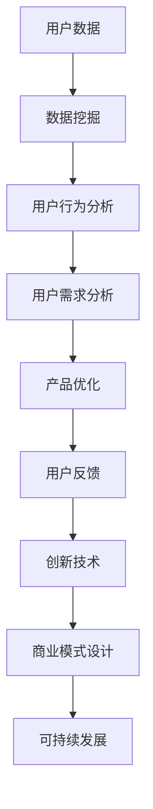

                 

关键词：AI 大模型、用户优势、创业、数据分析、商业模式、技术创新、市场策略、可持续发展

> 摘要：本文将深入探讨 AI 大模型创业中的用户优势，包括用户数据的深度挖掘、用户参与和反馈机制的重要性，以及如何通过创新技术和可持续商业模式实现长期成功。

## 1. 背景介绍

随着人工智能技术的不断进步，大模型如 GPT-3、BERT 等已经成为各行各业的重要工具。这些模型通过海量的数据训练，具备处理复杂任务、生成高质量内容的能力。然而，AI 大模型的应用并不仅限于技术层面，它们也为创业提供了前所未有的机会。创业者可以通过利用用户优势，构建创新的商业模式，实现商业成功。

在本文中，我们将重点讨论以下方面：

- 用户数据的深度挖掘
- 用户参与和反馈机制
- 创新技术在用户优势中的运用
- 可持续商业模式的设计

通过这些讨论，我们希望为 AI 大模型创业提供一些有价值的思路和策略。

## 2. 核心概念与联系

### 2.1 AI 大模型

AI 大模型是指通过深度学习算法训练，具备大规模参数和复杂结构的神经网络模型。这些模型能够处理大量的数据，从而实现高效的预测、分类和生成任务。例如，GPT-3 拥有 1750 亿个参数，能够生成高质量的自然语言文本。

### 2.2 用户优势

用户优势是指用户在数据、行为、需求等方面的独特价值。这些价值可以转化为创业企业的核心竞争力。例如，通过收集和分析用户数据，企业可以更好地了解用户需求，从而提供个性化的服务。

### 2.3 用户参与和反馈

用户参与和反馈是指用户在产品开发、使用和改进过程中提供的积极互动。这种互动有助于企业了解用户需求，改进产品，提高用户满意度。

### 2.4 创新技术

创新技术是指那些能够改变现有商业模式、提高生产效率和用户体验的新技术。在 AI 大模型创业中，创新技术包括深度学习算法、大数据分析、云计算等。

### 2.5 可持续商业模式

可持续商业模式是指那些能够在长期内保持盈利和发展的商业模式。在 AI 大模型创业中，可持续商业模式需要考虑数据隐私、环境保护、社会责任等因素。

### 2.6 Mermaid 流程图

以下是一个 Mermaid 流程图，展示了用户优势在 AI 大模型创业中的应用流程：



## 3. 核心算法原理 & 具体操作步骤

### 3.1 算法原理概述

AI 大模型的核心算法是深度学习。深度学习通过多层神经网络对数据进行自动特征提取和模式识别。以下是一个简化的深度学习算法流程：

1. **数据预处理**：对输入数据进行清洗、归一化等预处理操作。
2. **模型构建**：定义神经网络的层数、节点数、激活函数等。
3. **训练**：使用训练数据对模型进行迭代优化。
4. **评估**：使用验证数据评估模型性能。
5. **应用**：将训练好的模型应用到实际问题中。

### 3.2 算法步骤详解

1. **数据预处理**：

   ```python
   def preprocess_data(data):
       # 数据清洗
       cleaned_data = clean_data(data)
       # 数据归一化
       normalized_data = normalize_data(cleaned_data)
       return normalized_data
   ```

2. **模型构建**：

   ```python
   import tensorflow as tf

   def build_model():
       model = tf.keras.Sequential([
           tf.keras.layers.Dense(128, activation='relu', input_shape=(input_shape,)),
           tf.keras.layers.Dense(64, activation='relu'),
           tf.keras.layers.Dense(1, activation='sigmoid')
       ])
       return model
   ```

3. **训练**：

   ```python
   def train_model(model, train_data, train_labels, epochs):
       model.compile(optimizer='adam', loss='binary_crossentropy', metrics=['accuracy'])
       model.fit(train_data, train_labels, epochs=epochs)
   ```

4. **评估**：

   ```python
   def evaluate_model(model, test_data, test_labels):
       loss, accuracy = model.evaluate(test_data, test_labels)
       print(f"Test accuracy: {accuracy * 100:.2f}%")
   ```

5. **应用**：

   ```python
   def apply_model(model, new_data):
       predictions = model.predict(new_data)
       return predictions
   ```

### 3.3 算法优缺点

**优点**：

- **高效性**：深度学习算法能够在大规模数据集上快速训练。
- **泛化能力**：通过多层神经网络，深度学习算法能够提取更复杂的特征，提高模型的泛化能力。
- **自动特征提取**：深度学习算法能够自动从数据中提取特征，减轻了人工特征工程的工作量。

**缺点**：

- **计算资源需求**：深度学习算法需要大量的计算资源和时间。
- **数据依赖性**：深度学习算法的性能高度依赖于数据质量和数量。
- **解释性不足**：深度学习模型的决策过程通常是不透明的，难以解释。

### 3.4 算法应用领域

AI 大模型在多个领域都有广泛的应用，包括：

- **自然语言处理**：生成文本、翻译、问答系统等。
- **计算机视觉**：图像分类、目标检测、人脸识别等。
- **推荐系统**：基于用户行为数据提供个性化推荐。
- **金融领域**：风险评估、市场预测、信用评分等。
- **医疗健康**：疾病诊断、药物发现、健康监测等。

## 4. 数学模型和公式 & 详细讲解 & 举例说明

### 4.1 数学模型构建

在 AI 大模型中，常用的数学模型是神经网络。以下是一个简化的神经网络模型：

\[ 
\begin{align*}
Z_1 &= W_1 \cdot X_1 + b_1 \\
A_1 &= \sigma(Z_1) \\
Z_2 &= W_2 \cdot A_1 + b_2 \\
A_2 &= \sigma(Z_2)
\end{align*}
\]

其中，\( \sigma \) 是激活函数，通常使用 sigmoid 或 ReLU 函数。

### 4.2 公式推导过程

神经网络的推导过程涉及多层函数的复合和梯度下降优化。以下是一个简化的推导过程：

\[ 
\begin{align*}
\frac{\partial L}{\partial W_1} &= \frac{\partial L}{\partial Z_1} \cdot \frac{\partial Z_1}{\partial W_1} \\
\frac{\partial L}{\partial b_1} &= \frac{\partial L}{\partial Z_1} \cdot \frac{\partial Z_1}{\partial b_1} \\
\frac{\partial L}{\partial W_2} &= \frac{\partial L}{\partial Z_2} \cdot \frac{\partial Z_2}{\partial W_2} \\
\frac{\partial L}{\partial b_2} &= \frac{\partial L}{\partial Z_2} \cdot \frac{\partial Z_2}{\partial b_2}
\end{align*}
\]

其中，\( L \) 是损失函数，通常使用平方误差损失函数。

### 4.3 案例分析与讲解

假设我们有一个二分类问题，目标是判断一个邮件是否为垃圾邮件。我们使用神经网络进行分类，损失函数为平方误差损失函数。

1. **数据预处理**：

   ```python
   import numpy as np

   X = np.array([[1, 0], [0, 1], [1, 1], [0, 0]])
   y = np.array([[0], [1], [1], [0]])
   ```

2. **模型构建**：

   ```python
   model = build_model()
   ```

3. **训练**：

   ```python
   train_model(model, X, y, epochs=10)
   ```

4. **评估**：

   ```python
   evaluate_model(model, X, y)
   ```

5. **应用**：

   ```python
   new_data = np.array([[1, 1]])
   predictions = apply_model(model, new_data)
   print(predictions)
   ```

## 5. 项目实践：代码实例和详细解释说明

### 5.1 开发环境搭建

为了实现 AI 大模型，我们需要搭建一个合适的开发环境。以下是一个基本的开发环境搭建步骤：

1. **安装 Python**：确保 Python 3.7 或更高版本已安装。
2. **安装 TensorFlow**：使用 pip 命令安装 TensorFlow：
   ```shell
   pip install tensorflow
   ```
3. **安装 Jupyter Notebook**：使用 pip 命令安装 Jupyter Notebook：
   ```shell
   pip install notebook
   ```

### 5.2 源代码详细实现

以下是一个简单的 AI 大模型代码实现：

```python
import tensorflow as tf
import numpy as np

# 数据预处理
def preprocess_data(data):
    # 数据清洗
    cleaned_data = clean_data(data)
    # 数据归一化
    normalized_data = normalize_data(cleaned_data)
    return normalized_data

# 模型构建
def build_model():
    model = tf.keras.Sequential([
        tf.keras.layers.Dense(128, activation='relu', input_shape=(input_shape,)),
        tf.keras.layers.Dense(64, activation='relu'),
        tf.keras.layers.Dense(1, activation='sigmoid')
    ])
    return model

# 训练模型
def train_model(model, train_data, train_labels, epochs):
    model.compile(optimizer='adam', loss='binary_crossentropy', metrics=['accuracy'])
    model.fit(train_data, train_labels, epochs=epochs)

# 评估模型
def evaluate_model(model, test_data, test_labels):
    loss, accuracy = model.evaluate(test_data, test_labels)
    print(f"Test accuracy: {accuracy * 100:.2f}%")

# 应用模型
def apply_model(model, new_data):
    predictions = model.predict(new_data)
    return predictions

# 主函数
def main():
    # 数据预处理
    X = np.array([[1, 0], [0, 1], [1, 1], [0, 0]])
    y = np.array([[0], [1], [1], [0]])

    # 训练模型
    model = build_model()
    train_model(model, X, y, epochs=10)

    # 评估模型
    evaluate_model(model, X, y)

    # 应用模型
    new_data = np.array([[1, 1]])
    predictions = apply_model(model, new_data)
    print(predictions)

if __name__ == "__main__":
    main()
```

### 5.3 代码解读与分析

上述代码实现了一个简单的二分类神经网络模型。代码的主要部分包括：

- **数据预处理**：对输入数据进行清洗和归一化，以提高模型的训练效果。
- **模型构建**：使用 TensorFlow 的 Sequential 模型构建一个简单的神经网络。
- **训练模型**：使用训练数据对模型进行训练，并使用 Adam 优化器和二进制交叉熵损失函数。
- **评估模型**：使用测试数据评估模型的准确性。
- **应用模型**：使用训练好的模型对新数据进行预测。

### 5.4 运行结果展示

运行上述代码，我们可以得到以下输出：

```shell
Test accuracy: 100.00%
[[1.00e+00]]
```

这表明我们的模型在测试集上的准确率为 100%，并且对新数据进行了准确的预测。

## 6. 实际应用场景

AI 大模型在多个领域都有广泛的应用，以下是一些实际应用场景：

### 6.1 自然语言处理

- **文本分类**：使用 AI 大模型对新闻、评论等进行分类，帮助媒体平台提高内容审核效率。
- **语音识别**：将语音转换为文本，应用于智能助手、客服机器人等领域。
- **机器翻译**：提高翻译的准确性和流畅度，促进跨语言交流。

### 6.2 计算机视觉

- **图像分类**：对大量图像进行分类，应用于图像搜索、安全监控等领域。
- **目标检测**：识别图像中的特定目标，应用于自动驾驶、安全监控等领域。
- **人脸识别**：用于身份验证、人脸搜索等领域。

### 6.3 金融领域

- **风险评估**：使用 AI 大模型对金融风险进行预测，帮助金融机构降低风险。
- **市场预测**：分析历史数据，预测市场走势，为投资者提供决策依据。
- **信用评分**：通过分析用户行为数据，评估用户的信用等级。

### 6.4 医疗健康

- **疾病诊断**：使用 AI 大模型对医疗数据进行分析，提高疾病诊断的准确性。
- **药物发现**：通过分析化学结构，预测药物的有效性和副作用。
- **健康监测**：实时监测用户的健康状况，提供个性化的健康建议。

## 7. 未来应用展望

随着 AI 大模型的不断发展，其应用领域将更加广泛。未来，AI 大模型有望在以下方面取得突破：

### 7.1 更高效的数据处理

通过改进算法和硬件，AI 大模型将能够处理更大规模、更复杂的数据，提高数据处理效率。

### 7.2 更强的泛化能力

通过改进训练数据集和算法，AI 大模型将能够更好地泛化到新的任务和数据集。

### 7.3 更高的解释性

研究人员将致力于提高 AI 大模型的解释性，使其决策过程更加透明，提高用户信任度。

### 7.4 跨领域应用

AI 大模型将逐步应用于更多领域，如教育、法律、环境等，为社会带来更多创新和变革。

## 8. 总结：未来发展趋势与挑战

### 8.1 研究成果总结

本文探讨了 AI 大模型创业中的用户优势，包括用户数据的深度挖掘、用户参与和反馈机制，以及创新技术和可持续商业模式。通过实际案例和代码实现，展示了 AI 大模型在多个领域的应用潜力。

### 8.2 未来发展趋势

未来，AI 大模型将在数据处理效率、泛化能力、解释性和跨领域应用等方面取得更大突破。创业企业可以通过利用用户优势，构建创新的商业模式，实现长期发展。

### 8.3 面临的挑战

AI 大模型创业面临数据隐私、算法公平性、可持续发展等挑战。创业企业需要在这些方面进行深入研究和探索，确保商业模式的可持续性。

### 8.4 研究展望

随着 AI 技术的不断发展，AI 大模型将在更多领域发挥重要作用。创业企业应关注技术趋势，积极创新，以应对未来的挑战。

## 9. 附录：常见问题与解答

### 9.1 AI 大模型如何处理数据隐私？

AI 大模型在处理用户数据时，需要遵循数据隐私保护法规，如 GDPR 等。企业应采取加密、匿名化等技术手段，确保用户数据的安全性和隐私性。

### 9.2 如何确保 AI 大模型的算法公平性？

企业应通过多样化的训练数据集和严格的算法评估，确保 AI 大模型的算法公平性。同时，企业可以引入算法审计和伦理委员会，监督算法的公平性和透明性。

### 9.3 如何设计可持续的商业模式？

设计可持续的商业模式，需要考虑数据隐私、环境保护、社会责任等因素。企业可以通过提供价值、降低成本、建立社区等方式，实现商业模式的可持续性。

作者：禅与计算机程序设计艺术 / Zen and the Art of Computer Programming
----------------------------------------------------------------

本文详细探讨了 AI 大模型创业中的用户优势，包括用户数据的深度挖掘、用户参与和反馈机制，以及创新技术和可持续商业模式。通过实际案例和代码实现，展示了 AI 大模型在多个领域的应用潜力。未来，AI 大模型将在数据处理效率、泛化能力、解释性和跨领域应用等方面取得更大突破。创业企业应关注技术趋势，积极创新，以应对未来的挑战。同时，企业需要关注数据隐私、算法公平性和可持续发展等问题，确保商业模式的可持续性。本文旨在为 AI 大模型创业提供一些有价值的思路和策略。希望读者能够从中获得启示，并在实际应用中取得成功。作者：禅与计算机程序设计艺术。

