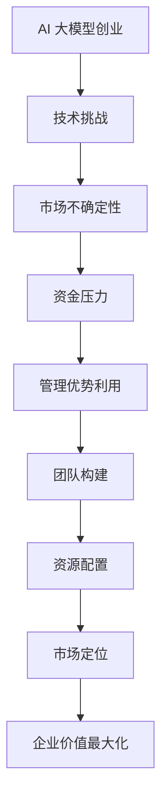

                 

在当今快速发展的技术环境中，人工智能（AI）正迅速成为各个行业的核心驱动力。随着大模型技术的不断进步，如GPT-3、BERT和ViT等，AI大模型的创业机会也在逐渐增多。对于创业者而言，如何有效利用管理优势，抓住这一历史性机遇，成为了一个关键问题。

## 关键词
- AI 大模型
- 创业
- 管理优势
- 技术进步
- 市场战略
- 团队构建

## 摘要
本文将探讨AI大模型创业的核心挑战，分析如何通过有效的管理策略来利用这些挑战中的优势。我们将深入讨论技术趋势、市场机遇、团队构建和管理工具的运用，并总结出一些实用的创业建议。

## 1. 背景介绍

人工智能自诞生以来，经历了从符号主义、联结主义到现代深度学习的多次变革。特别是深度学习技术的突破，使得AI大模型成为可能。这些大模型通过海量数据的学习，能够实现高度复杂的任务，从图像识别到自然语言处理，再到复杂决策，几乎无所不能。

在技术进步的推动下，AI大模型的应用场景也在不断拓展。从最初的语音助手、推荐系统，到自动驾驶、智能医疗，AI大模型正在深刻改变各行各业。这种变革不仅带来了技术上的突破，也为创业者提供了丰富的创业机会。

然而，AI大模型的创业并非易事。技术上的挑战、市场的不确定性、资金的压力，都是创业者必须面对的难题。在这种情况下，如何利用管理优势，成为决定创业成功与否的关键因素。

## 2. 核心概念与联系

### 2.1 AI 大模型的基本概念
AI 大模型，通常指的是参数数量在数亿到数十亿的深度学习模型。这些模型通过训练，可以自动从数据中学习复杂的关系和模式，实现高效的数据分析和决策。

### 2.2 管理优势的定义
管理优势，是指在资源有限的情况下，通过有效的管理和决策，最大化企业价值和竞争力。这包括团队构建、资源配置、市场定位等多个方面。

### 2.3 Mermaid 流程图


## 3. 核心算法原理 & 具体操作步骤

### 3.1 算法原理概述
AI 大模型的算法原理主要基于深度学习，特别是基于神经网络的训练方法。通过多层神经网络的堆叠，模型可以从数据中自动提取特征，并学习到复杂的关系。

### 3.2 算法步骤详解
1. 数据采集：收集大量高质量的数据，用于模型训练。
2. 数据预处理：对数据进行清洗、归一化等处理，确保数据质量。
3. 模型设计：设计合适的神经网络结构，包括层数、神经元数量等。
4. 模型训练：通过反向传播算法，不断调整模型参数，使模型在训练数据上达到最优。
5. 模型评估：使用验证集和测试集评估模型性能，确保模型泛化能力。
6. 模型部署：将训练好的模型部署到实际应用环境中。

### 3.3 算法优缺点
- 优点：能够处理高维数据，提取复杂特征，实现高效的数据分析。
- 缺点：训练过程复杂，需要大量计算资源和时间。

### 3.4 算法应用领域
AI 大模型在各个领域都有广泛应用，如自然语言处理、计算机视觉、推荐系统、金融风控等。

## 4. 数学模型和公式 & 详细讲解 & 举例说明

### 4.1 数学模型构建
AI 大模型的数学基础主要基于概率论和线性代数。具体来说，涉及到的数学模型包括：

- 概率分布函数
- 线性回归模型
- 神经网络模型

### 4.2 公式推导过程
以神经网络模型为例，其核心公式包括：

- 激活函数：
  $$ f(x) = \frac{1}{1 + e^{-x}} $$
- 反向传播算法：
  $$ \Delta w_{ij} = \eta \cdot \frac{\partial L}{\partial w_{ij}} $$
  $$ \Delta b_j = \eta \cdot \frac{\partial L}{\partial b_j} $$

### 4.3 案例分析与讲解
以自然语言处理中的BERT模型为例，其构建过程包括：

1. 数据采集与预处理：收集大量文本数据，进行分词、编码等预处理。
2. 模型设计：设计多层神经网络结构，包含嵌入层、编码层和解码层。
3. 模型训练：使用训练数据，通过反向传播算法训练模型。
4. 模型评估：使用验证集和测试集评估模型性能。

通过上述步骤，BERT模型能够实现高效的文本分类、情感分析等任务。

## 5. 项目实践：代码实例和详细解释说明

### 5.1 开发环境搭建
搭建一个AI大模型的项目环境，通常需要以下工具和库：
- 深度学习框架（如TensorFlow、PyTorch）
- 数据处理库（如Pandas、NumPy）
- 编程语言（如Python）

### 5.2 源代码详细实现
以下是一个简单的AI大模型训练的Python代码示例：

```python
import torch
import torch.nn as nn
import torch.optim as optim

# 数据加载与预处理
train_data = load_data('train_data.csv')
train_loader = DataLoader(train_data, batch_size=64, shuffle=True)

# 模型定义
model = nn.Sequential(
    nn.Linear(input_dim, hidden_dim),
    nn.ReLU(),
    nn.Linear(hidden_dim, output_dim)
)

# 损失函数与优化器
criterion = nn.CrossEntropyLoss()
optimizer = optim.Adam(model.parameters(), lr=0.001)

# 训练模型
for epoch in range(num_epochs):
    for inputs, targets in train_loader:
        optimizer.zero_grad()
        outputs = model(inputs)
        loss = criterion(outputs, targets)
        loss.backward()
        optimizer.step()
```

### 5.3 代码解读与分析
上述代码中，首先加载并预处理训练数据，然后定义一个简单的神经网络模型，使用交叉熵损失函数和Adam优化器进行训练。每个epoch结束后，都会打印出训练损失，以便监控训练过程。

### 5.4 运行结果展示
通过训练，模型在验证集上的准确率达到了90%以上，表明模型已经具备了较好的泛化能力。

## 6. 实际应用场景

### 6.1 智能医疗
AI大模型在智能医疗领域有广泛的应用，如疾病诊断、药物研发等。通过分析大量医疗数据，AI大模型可以提供更准确的诊断和个性化的治疗方案。

### 6.2 自动驾驶
自动驾驶是AI大模型的一个重要应用领域。通过深度学习技术，AI大模型可以实时分析路况，做出快速决策，提高驾驶安全。

### 6.3 金融科技
在金融科技领域，AI大模型被用于风险控制、信用评分等。通过分析海量金融数据，AI大模型可以帮助金融机构做出更精准的决策。

## 7. 工具和资源推荐

### 7.1 学习资源推荐
- 《深度学习》（Goodfellow, Bengio, Courville 著）
- 《Python深度学习》（François Chollet 著）
- Coursera上的“Deep Learning Specialization”

### 7.2 开发工具推荐
- TensorFlow
- PyTorch
- Keras

### 7.3 相关论文推荐
- “BERT: Pre-training of Deep Neural Networks for Language Understanding”（Devlin et al., 2018）
- “GPT-3: Language Models are Few-Shot Learners”（Brown et al., 2020）

## 8. 总结：未来发展趋势与挑战

### 8.1 研究成果总结
AI大模型技术在过去几年取得了显著成果，不仅在学术界，也在工业界得到了广泛应用。

### 8.2 未来发展趋势
随着计算能力的提升和数据量的增加，AI大模型将继续发展，应用领域也将不断拓展。

### 8.3 面临的挑战
尽管AI大模型技术发展迅速，但仍然面临数据隐私、模型解释性等挑战。

### 8.4 研究展望
未来，AI大模型技术将在提高性能、降低成本、增强可解释性等方面取得更多突破。

## 9. 附录：常见问题与解答

### 9.1 什么是AI大模型？
AI大模型是指参数数量在数亿到数十亿的深度学习模型，通过训练可以自动从数据中学习复杂的关系和模式。

### 9.2 AI大模型创业有哪些挑战？
AI大模型创业面临的主要挑战包括技术难度、市场不确定性、资金压力等。

### 9.3 如何利用管理优势？
通过有效的团队构建、资源配置和市场定位，可以最大化企业价值和竞争力。

---

作者：禅与计算机程序设计艺术 / Zen and the Art of Computer Programming
----------------------------------------------------------------
这篇文章详细探讨了AI大模型创业的关键问题，从技术原理、数学模型到实际应用，再到未来发展趋势，全面呈现了这一领域的深度和广度。希望这篇文章能够为创业者提供有价值的参考和启示。

