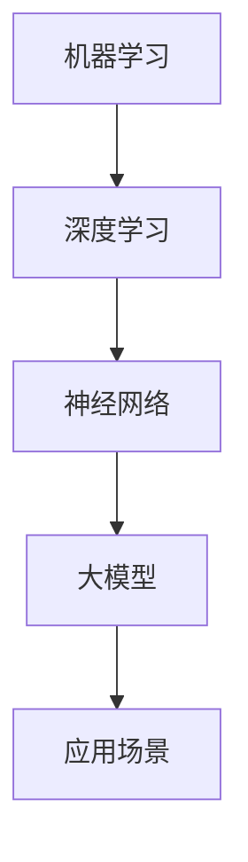

                 

在当今快速发展的技术时代，人工智能（AI）已经成为了推动创新和增长的核心驱动力。随着大模型的不断进步，从GAN（生成对抗网络）到GPT（通用预训练语言模型），这些先进的技术为创业者提供了前所未有的机会。然而，如何有效地利用这些技术，特别是在经济层面，是一个值得探讨的话题。本文将探讨AI大模型创业中的经济优势，提供一些建议和策略。

> 关键词：AI大模型，创业，经济优势，创新，技术趋势

## 1. 背景介绍

AI大模型的发展不仅改变了数据处理和优化决策的方式，还为各种行业带来了巨大的变革。从医疗到金融，从零售到教育，大模型的应用正在改变商业运作的各个方面。创业者们正试图利用这些模型来创造新的商业模式，提升现有服务的效率，并开辟全新的市场。

然而，尽管AI大模型具有巨大的潜力，但创业过程中仍然面临许多挑战。这些挑战包括技术实现的复杂性、高昂的初期成本、数据隐私和安全性问题，以及市场竞争的激烈程度。因此，如何利用AI大模型的优势，同时克服这些挑战，成为创业成功的关键。

## 2. 核心概念与联系

在深入探讨AI大模型创业之前，我们需要理解一些核心概念，如机器学习、深度学习、神经网络等。这些概念是构建大模型的基础。以下是一个Mermaid流程图，展示了这些概念之间的联系：



### 2.1 机器学习

机器学习是一种使计算机通过数据学习并做出决策的技术。它通过训练模型来识别模式和预测结果。

### 2.2 深度学习

深度学习是机器学习的一个分支，它使用了多层神经网络来提取数据中的复杂特征。

### 2.3 神经网络

神经网络是模仿人脑工作方式的计算模型，它由一系列相互连接的节点（或神经元）组成。

### 2.4 大模型

大模型是指那些拥有数亿甚至数万亿参数的复杂神经网络。这些模型可以处理大量的数据，并实现高度准确的预测和决策。

### 2.5 应用场景

大模型的应用场景非常广泛，包括自然语言处理、计算机视觉、推荐系统、金融预测等。

## 3. 核心算法原理 & 具体操作步骤

### 3.1 算法原理概述

AI大模型的算法通常基于深度学习，尤其是卷积神经网络（CNN）和递归神经网络（RNN）。这些算法的核心是通过多层次的神经网络来提取数据中的特征，并使用这些特征进行预测或分类。

### 3.2 算法步骤详解

#### 3.2.1 数据预处理

在训练大模型之前，需要对数据集进行预处理，包括数据清洗、归一化、数据增强等步骤。

#### 3.2.2 模型设计

根据应用场景，设计合适的神经网络结构，包括层数、每层的神经元数量、激活函数等。

#### 3.2.3 模型训练

使用预处理的训练数据集来训练模型。训练过程中，通过反向传播算法来优化模型参数。

#### 3.2.4 模型评估

使用验证数据集来评估模型的性能，通过指标如准确率、召回率、F1分数等来衡量。

#### 3.2.5 模型部署

将训练好的模型部署到生产环境中，进行实际应用。

### 3.3 算法优缺点

#### 优点：

- 高度的自动化和自我优化能力。
- 能够处理大量复杂数据。
- 提供准确性和实时性。

#### 缺点：

- 需要大量计算资源和时间进行训练。
- 对数据质量和标注有较高要求。
- 模型解释性较差。

### 3.4 算法应用领域

AI大模型在各个领域都有广泛的应用，如自然语言处理（NLP）、计算机视觉（CV）、推荐系统、金融预测等。

## 4. 数学模型和公式 & 详细讲解 & 举例说明

### 4.1 数学模型构建

AI大模型的数学基础主要涉及线性代数、微积分和概率论。以下是构建AI大模型的一些关键数学概念：

#### 4.1.1 线性代数

- 矩阵和向量运算
- 矩阵分解（如SVD）
- 线性方程组的求解

#### 4.1.2 微积分

- 导数和梯度
- 最优化问题

#### 4.1.3 概率论

- 概率分布
- 贝叶斯定理

### 4.2 公式推导过程

以下是一个简化的神经网络反向传播算法的公式推导：

#### 4.2.1 损失函数

$$
J = \frac{1}{m} \sum_{i=1}^{m} \sum_{j=1}^{n} (y_j - \hat{y}_j)^2
$$

其中，$y_j$是实际标签，$\hat{y}_j$是预测标签。

#### 4.2.2 梯度计算

$$
\frac{\partial J}{\partial w} = \frac{1}{m} \sum_{i=1}^{m} (y_j - \hat{y}_j) \cdot \frac{\partial \hat{y}_j}{\partial w}
$$

#### 4.2.3 参数更新

$$
w_{new} = w_{old} - \alpha \cdot \frac{\partial J}{\partial w}
$$

其中，$\alpha$是学习率。

### 4.3 案例分析与讲解

假设我们有一个简单的线性回归模型，目标是预测房价。以下是模型训练和评估的步骤：

#### 4.3.1 数据预处理

收集一组房屋特征和对应的价格，进行归一化处理。

#### 4.3.2 模型设计

设计一个单层神经网络，包含输入层、一层隐藏层和输出层。

#### 4.3.3 模型训练

使用反向传播算法训练模型，优化模型参数。

#### 4.3.4 模型评估

使用验证集评估模型性能，通过均方误差（MSE）来衡量。

## 5. 项目实践：代码实例和详细解释说明

### 5.1 开发环境搭建

- 安装Python和TensorFlow库
- 配置GPU加速（如果需要）

### 5.2 源代码详细实现

以下是一个简单的神经网络实现示例：

```python
import tensorflow as tf

# 定义模型结构
model = tf.keras.Sequential([
    tf.keras.layers.Dense(64, activation='relu', input_shape=(num_features,)),
    tf.keras.layers.Dense(64, activation='relu'),
    tf.keras.layers.Dense(1)
])

# 编译模型
model.compile(optimizer='adam', loss='mse', metrics=['mae'])

# 训练模型
model.fit(x_train, y_train, epochs=100, batch_size=32, validation_split=0.2)

# 评估模型
loss, mae = model.evaluate(x_test, y_test)
print(f'MAE: {mae}')
```

### 5.3 代码解读与分析

- `Dense`层：全连接层，用于处理输入特征。
- `relu`：激活函数，用于增加模型的非线性。
- `compile`：配置模型优化器和损失函数。
- `fit`：训练模型。
- `evaluate`：评估模型性能。

## 6. 实际应用场景

AI大模型在各个领域都有广泛的应用，以下是一些典型的应用场景：

- 自然语言处理：文本分类、机器翻译、情感分析。
- 计算机视觉：图像识别、视频分析、自动驾驶。
- 推荐系统：个性化推荐、商品推荐、内容推荐。
- 金融预测：股票市场预测、风险管理、信用评分。

### 6.4 未来应用展望

随着技术的不断进步，AI大模型将在更多领域得到应用，如医疗诊断、智能教育、智能城市建设等。同时，AI大模型也将带来一系列挑战，如数据隐私保护、算法透明度、公平性等。创业者需要关注这些挑战，并寻找解决方案。

## 7. 工具和资源推荐

### 7.1 学习资源推荐

- 《深度学习》（Goodfellow, Bengio, Courville著）
- 《Python机器学习》（Sebastian Raschka著）
- Coursera上的机器学习和深度学习课程

### 7.2 开发工具推荐

- TensorFlow
- PyTorch
- JAX

### 7.3 相关论文推荐

- "Deep Learning Text Classification with BERT"
- "Differential Privacy: The Case of Neural Networks"
- "Self-Supervised Learning for Audio Classification"

## 8. 总结：未来发展趋势与挑战

### 8.1 研究成果总结

AI大模型在图像识别、自然语言处理、推荐系统等领域取得了显著的成果，推动了商业和社会的进步。

### 8.2 未来发展趋势

随着计算能力的提升和数据量的增长，AI大模型将变得更加普及和高效。同时，新型算法和架构（如联邦学习、生成对抗网络）也将不断涌现。

### 8.3 面临的挑战

数据隐私、算法透明度、公平性、模型解释性等是当前和未来需要解决的主要挑战。

### 8.4 研究展望

随着技术的不断发展，AI大模型将在更多领域发挥重要作用，为人类创造更多价值。

## 9. 附录：常见问题与解答

### 9.1 AI大模型为什么需要大量计算资源？

AI大模型需要大量的计算资源来处理大量数据和进行多次迭代训练，以优化模型参数。

### 9.2 如何保证AI大模型的安全性？

通过加密技术、数据隐私保护算法、模型解释性研究等措施来提高AI大模型的安全性。

### 9.3 AI大模型如何处理不透明问题？

通过开发透明算法、增加模型可解释性、公开透明的研究成果等方式来应对不透明问题。

作者：禅与计算机程序设计艺术 / Zen and the Art of Computer Programming
----------------------------------------------------------------

本文详细探讨了AI大模型创业中的经济优势，从核心概念、算法原理、数学模型、项目实践到实际应用场景，全面阐述了如何利用AI大模型创造商业价值。同时，本文也指出了AI大模型创业过程中可能面临的挑战，并提出了相应的解决策略。随着技术的不断进步，AI大模型将在未来发挥更大的作用，为创业者提供更多机会。希望本文能为您提供有价值的参考和启示。

