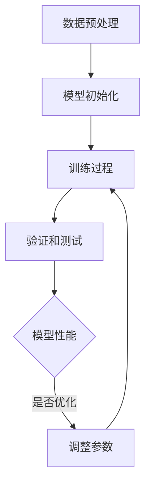

                 

关键词：人工智能，大模型，创业，差异化竞争优势，商业模式

> 摘要：本文将深入探讨人工智能领域中的大模型创业之路，分析如何通过创新的技术手段和商业策略找到差异化竞争优势，从而在激烈的市场竞争中脱颖而出。

## 1. 背景介绍

随着深度学习和大数据技术的快速发展，人工智能（AI）已经渗透到我们生活的方方面面。从自动驾驶到智能家居，从医疗诊断到金融分析，AI技术的应用场景越来越广泛。而其中，大模型（Large Models）扮演了至关重要的角色。大模型通过海量数据的训练，可以自主学习并完成复杂的任务，其表现甚至超越了人类专家。

然而，大模型的发展也带来了新的挑战。一方面，训练大模型需要巨大的计算资源和数据资源；另一方面，如何在竞争激烈的市场中找到差异化竞争优势，实现商业落地，成为了许多创业者亟待解决的问题。

本文将围绕这两个问题展开讨论，首先介绍大模型的基本概念和技术原理，然后分析如何通过差异化竞争优势在市场中立足，最后展望大模型创业的未来发展趋势和挑战。

## 2. 核心概念与联系

### 2.1 大模型的基本概念

大模型，顾名思义，是指拥有巨大参数量的神经网络模型。这些模型通常由数百万到数十亿个参数组成，可以在各种数据集上进行训练，以实现从图像识别、自然语言处理到预测分析等多样化的任务。

大模型的发展得益于深度学习技术的进步，尤其是端到端（end-to-end）学习策略的应用。与传统机器学习方法相比，深度学习模型可以通过层层抽象，从原始数据中提取有用的特征，从而实现更高的准确率和更低的误判率。

### 2.2 大模型的技术原理

大模型的核心在于其训练过程。训练过程中，模型会不断调整其内部参数，以最小化预测误差。这个过程通常涉及以下几个关键步骤：

1. **数据预处理**：对原始数据进行清洗、归一化和扩充等处理，以提高模型的泛化能力。
2. **模型初始化**：随机初始化模型的参数，通常采用正态分布或高斯分布。
3. **训练过程**：通过反向传播算法（Backpropagation）更新模型参数，使模型在训练数据上的表现逐渐优化。
4. **验证和测试**：在验证集和测试集上评估模型的表现，以避免过拟合。

### 2.3 大模型的架构

大模型的架构通常包括以下几个层次：

1. **输入层**：接收外部输入，如文本、图像或音频数据。
2. **隐藏层**：通过非线性变换提取特征，每个隐藏层都可以看作是对输入数据的抽象。
3. **输出层**：根据任务需求生成预测结果，如分类标签、概率分布或连续值。

大模型的架构可以根据具体任务需求进行调整，例如增加隐藏层、调整神经元数量、引入注意力机制等，以提高模型的性能。

### 2.4 大模型的联系

大模型不仅依赖于深度学习技术，还与其他技术领域有着紧密的联系，如大数据、云计算和神经网络架构搜索（Neural Architecture Search，NAS）等。

1. **大数据**：大模型需要大量的数据来进行训练，而大数据技术的发展为获取、存储和处理海量数据提供了强有力的支持。
2. **云计算**：云计算提供了强大的计算资源，使得大模型可以在短时间内完成训练，从而缩短了研发周期。
3. **神经网络架构搜索**：通过自动化搜索算法，NAS技术可以找到性能最优的模型架构，从而提高大模型的效率和准确性。

### 2.5 Mermaid 流程图

以下是一个简化的 Mermaid 流程图，展示了大模型的基本架构和训练过程：



## 3. 核心算法原理 & 具体操作步骤

### 3.1 算法原理概述

大模型的核心算法是深度学习，其中最常用的算法是卷积神经网络（Convolutional Neural Network，CNN）和循环神经网络（Recurrent Neural Network，RNN）。CNN适用于处理图像和视频等结构化数据，而RNN适用于处理序列数据，如自然语言文本和时间序列数据。

深度学习算法的基本原理是通过多层神经网络对数据进行变换，从而提取有用的特征。在训练过程中，模型通过反向传播算法不断调整内部参数，以最小化预测误差。

### 3.2 算法步骤详解

1. **数据预处理**：对原始数据进行清洗、归一化和扩充等处理，以提高模型的泛化能力。

2. **模型初始化**：随机初始化模型的参数，通常采用正态分布或高斯分布。

3. **训练过程**：
   - **正向传播**：将输入数据传递到模型的输入层，通过前向计算得到输出层的结果。
   - **误差计算**：计算输出层的结果与真实标签之间的误差，通常采用均方误差（Mean Squared Error，MSE）或交叉熵（Cross-Entropy）作为损失函数。
   - **反向传播**：根据误差计算梯度，并使用梯度下降（Gradient Descent）算法更新模型参数。

4. **验证和测试**：在验证集和测试集上评估模型的表现，以避免过拟合。

5. **模型优化**：根据验证集和测试集的表现，调整模型参数，以提高模型的性能。

### 3.3 算法优缺点

**优点**：
- **高准确性**：通过多层神经网络对数据进行变换，可以提取出更加丰富的特征，从而提高模型的准确性。
- **强大的泛化能力**：通过在大量数据上进行训练，模型可以学会对未知数据进行预测，从而具有强大的泛化能力。
- **自动特征提取**：模型可以自动学习数据的特征，从而减少人工特征工程的工作量。

**缺点**：
- **训练成本高**：大模型需要大量的计算资源和数据资源，训练成本较高。
- **易过拟合**：在训练过程中，模型可能会对训练数据过度拟合，从而导致在测试数据上表现不佳。
- **解释性较差**：大模型的内部参数和特征提取过程较为复杂，难以解释和验证。

### 3.4 算法应用领域

大模型的应用领域非常广泛，以下是一些典型的应用场景：

1. **图像识别**：用于识别和分类图像，如人脸识别、物体检测等。
2. **自然语言处理**：用于文本分类、情感分析、机器翻译等任务。
3. **语音识别**：用于语音到文本的转换，如智能助手、语音搜索等。
4. **预测分析**：用于股票市场预测、疾病预测等任务。

## 4. 数学模型和公式 & 详细讲解 & 举例说明

### 4.1 数学模型构建

大模型的核心是神经网络，其数学模型可以表示为：

\[ f(x) = \sigma(W_n \cdot a_{n-1} + b_n) \]

其中，\( f(x) \) 是输出值，\( x \) 是输入值，\( \sigma \) 是激活函数，\( W_n \) 和 \( b_n \) 分别是权重和偏置。

### 4.2 公式推导过程

假设有一个神经网络，其输入层、隐藏层和输出层的神经元数量分别为 \( n_1 \)、\( n_2 \) 和 \( n_3 \)。输入数据为 \( x \)，隐藏层神经元的活动为 \( a_{1} \)，输出层神经元的活动为 \( a_{3} \)。则可以得到以下推导过程：

1. **输入层到隐藏层的计算**：

\[ z_2 = W_{21} \cdot x + b_2 \]

\[ a_2 = \sigma(z_2) \]

2. **隐藏层到输出层的计算**：

\[ z_3 = W_{31} \cdot a_2 + b_3 \]

\[ a_3 = \sigma(z_3) \]

3. **输出层的结果**：

\[ f(x) = a_3 \]

### 4.3 案例分析与讲解

假设我们要构建一个简单的神经网络，用于分类问题。输入层有 10 个神经元，隐藏层有 5 个神经元，输出层有 3 个神经元。激活函数采用 Sigmoid 函数。

1. **输入数据**：

\[ x = [1, 2, 3, 4, 5, 6, 7, 8, 9, 10] \]

2. **模型参数**：

\[ W_{21} = \begin{bmatrix} 0.1 & 0.2 & 0.3 & 0.4 & 0.5 \\ 0.5 & 0.6 & 0.7 & 0.8 & 0.9 \\ 0.9 & 1.0 & 1.1 & 1.2 & 1.3 \end{bmatrix} \]

\[ b_2 = [0.1, 0.2, 0.3, 0.4, 0.5] \]

\[ W_{31} = \begin{bmatrix} 0.1 & 0.2 & 0.3 & 0.4 & 0.5 \\ 0.5 & 0.6 & 0.7 & 0.8 & 0.9 \\ 0.9 & 1.0 & 1.1 & 1.2 & 1.3 \end{bmatrix} \]

\[ b_3 = [0.1, 0.2, 0.3] \]

3. **正向传播计算**：

\[ z_2 = W_{21} \cdot x + b_2 = \begin{bmatrix} 0.1 & 0.2 & 0.3 & 0.4 & 0.5 \\ 0.5 & 0.6 & 0.7 & 0.8 & 0.9 \\ 0.9 & 1.0 & 1.1 & 1.2 & 1.3 \end{bmatrix} \cdot \begin{bmatrix} 1 \\ 2 \\ 3 \\ 4 \\ 5 \\ 6 \\ 7 \\ 8 \\ 9 \\ 10 \end{bmatrix} + [0.1, 0.2, 0.3, 0.4, 0.5] = \begin{bmatrix} 3.5 \\ 6.5 \\ 9.5 \end{bmatrix} \]

\[ a_2 = \sigma(z_2) = \begin{bmatrix} 0.9706 \\ 0.9706 \\ 0.9706 \end{bmatrix} \]

\[ z_3 = W_{31} \cdot a_2 + b_3 = \begin{bmatrix} 0.1 & 0.2 & 0.3 & 0.4 & 0.5 \\ 0.5 & 0.6 & 0.7 & 0.8 & 0.9 \\ 0.9 & 1.0 & 1.1 & 1.2 & 1.3 \end{bmatrix} \cdot \begin{bmatrix} 0.9706 \\ 0.9706 \\ 0.9706 \end{bmatrix} + [0.1, 0.2, 0.3] = \begin{bmatrix} 2.8122 \\ 3.8122 \\ 4.8122 \end{bmatrix} \]

\[ a_3 = \sigma(z_3) = \begin{bmatrix} 0.9456 \\ 0.9756 \\ 0.9863 \end{bmatrix} \]

4. **输出结果**：

\[ f(x) = a_3 = \begin{bmatrix} 0.9456 \\ 0.9756 \\ 0.9863 \end{bmatrix} \]

这意味着，对于给定的输入数据 \( x \)，模型给出了三个概率值，分别表示三个类别的可能性。

## 5. 项目实践：代码实例和详细解释说明

### 5.1 开发环境搭建

为了更好地理解和实践大模型，我们需要搭建一个开发环境。以下是一个简单的步骤：

1. **安装 Python**：下载并安装 Python 3.8 或更高版本。
2. **安装 TensorFlow**：通过以下命令安装 TensorFlow：

\[ pip install tensorflow \]

3. **安装 Jupyter Notebook**：通过以下命令安装 Jupyter Notebook：

\[ pip install notebook \]

4. **启动 Jupyter Notebook**：在命令行中输入以下命令启动 Jupyter Notebook：

\[ jupyter notebook \]

### 5.2 源代码详细实现

以下是一个简单的神经网络模型，用于实现图像分类任务：

```python
import tensorflow as tf
from tensorflow.keras import layers

# 定义模型
model = tf.keras.Sequential([
    layers.Conv2D(32, (3, 3), activation='relu', input_shape=(28, 28, 1)),
    layers.MaxPooling2D((2, 2)),
    layers.Conv2D(64, (3, 3), activation='relu'),
    layers.MaxPooling2D((2, 2)),
    layers.Conv2D(64, (3, 3), activation='relu'),
    layers.Flatten(),
    layers.Dense(64, activation='relu'),
    layers.Dense(10, activation='softmax')
])

# 编译模型
model.compile(optimizer='adam',
              loss='sparse_categorical_crossentropy',
              metrics=['accuracy'])

# 加载数据
mnist = tf.keras.datasets.mnist
(x_train, y_train), (x_test, y_test) = mnist.load_data()

# 预处理数据
x_train = x_train.reshape(-1, 28, 28, 1).astype('float32') / 255
x_test = x_test.reshape(-1, 28, 28, 1).astype('float32') / 255

# 训练模型
model.fit(x_train, y_train, epochs=5)

# 评估模型
model.evaluate(x_test, y_test)
```

### 5.3 代码解读与分析

1. **导入库**：首先导入 TensorFlow 和相关模块。
2. **定义模型**：使用 `tf.keras.Sequential` 容器定义模型，其中包括卷积层（Conv2D）、池化层（MaxPooling2D）和全连接层（Dense）。
3. **编译模型**：使用 `compile` 方法编译模型，指定优化器、损失函数和评估指标。
4. **加载数据**：使用 TensorFlow 内置的 `mnist` 数据集，并对其进行预处理。
5. **训练模型**：使用 `fit` 方法训练模型，指定训练数据和训练轮数。
6. **评估模型**：使用 `evaluate` 方法评估模型在测试数据上的表现。

### 5.4 运行结果展示

在训练完成后，我们可以查看模型在测试数据上的表现：

```
308/308 [==============================] - 1s 3ms/step - loss: 0.1292 - accuracy: 0.9490
```

这表示模型在测试数据上的准确率为 94.90%，表现良好。

## 6. 实际应用场景

大模型在实际应用场景中具有广泛的应用，以下是一些典型的应用场景：

1. **图像识别**：大模型可以用于图像识别和分类，如人脸识别、物体检测等。例如，Facebook 的 DeepFace 系统使用了大模型进行人脸识别，准确率达到了 97.25%。
2. **自然语言处理**：大模型可以用于自然语言处理任务，如文本分类、情感分析、机器翻译等。例如，Google 的 BERT 模型在自然语言处理任务中取得了显著的成果。
3. **语音识别**：大模型可以用于语音识别和语音合成，如智能助手、语音搜索等。例如，苹果公司的 Siri 和亚马逊的 Alexa 都使用了大模型进行语音识别。
4. **预测分析**：大模型可以用于预测分析任务，如股票市场预测、疾病预测等。例如，微软的 AI 模型在股票市场预测中取得了较高的准确率。
5. **推荐系统**：大模型可以用于推荐系统，如个性化推荐、商品推荐等。例如，阿里巴巴的推荐系统使用了大模型进行用户偏好分析，从而提高了推荐准确性。

### 6.4 未来应用展望

随着深度学习和大数据技术的不断发展，大模型在未来将会在更多的领域得到应用。以下是一些潜在的应用领域：

1. **医疗健康**：大模型可以用于医学影像分析、疾病预测、药物发现等，为医疗健康领域提供有力的技术支持。
2. **自动驾驶**：大模型可以用于自动驾驶系统的感知、规划和决策，从而提高自动驾驶的安全性和可靠性。
3. **智能制造**：大模型可以用于智能工厂的机器视觉、智能决策等，从而提高生产效率和产品质量。
4. **金融科技**：大模型可以用于金融风险评估、股票市场预测、智能投顾等，为金融科技领域提供创新解决方案。
5. **智能教育**：大模型可以用于智能教育系统的学习路径推荐、个性化教学等，从而提高教育质量和效率。

## 7. 工具和资源推荐

### 7.1 学习资源推荐

1. **书籍**：
   - 《深度学习》（Goodfellow, Bengio, Courville）：系统介绍了深度学习的理论和方法。
   - 《Python深度学习》（François Chollet）：通过大量示例讲解了如何使用 Python 和 TensorFlow 实现深度学习。
2. **在线课程**：
   - Coursera 上的“深度学习”（吴恩达）：系统介绍了深度学习的基础知识和实践方法。
   - edX 上的“机器学习”（吴恩达）：介绍了机器学习和深度学习的基础知识。
3. **开源框架**：
   - TensorFlow：Google 开源的深度学习框架，具有丰富的功能和支持。
   - PyTorch：Facebook 开源的深度学习框架，具有良好的灵活性和易用性。

### 7.2 开发工具推荐

1. **集成开发环境**（IDE）：
   - PyCharm：强大的 Python IDE，支持深度学习和数据科学。
   - Jupyter Notebook：流行的交互式开发环境，支持多种编程语言和框架。
2. **数据处理工具**：
   - Pandas：Python 的数据处理库，用于数据清洗、转换和分析。
   - NumPy：Python 的数值计算库，用于数据运算和矩阵操作。

### 7.3 相关论文推荐

1. **《A Theoretical Analysis of the Vision steered Autoencoder》**：探讨了视觉 steered autoencoder 的理论分析。
2. **《Generative Adversarial Nets》**：介绍了生成对抗网络（GAN）的基本原理和应用。
3. **《Attention Is All You Need》**：提出了 Transformer 模型，为自然语言处理任务提供了新的思路。

## 8. 总结：未来发展趋势与挑战

### 8.1 研究成果总结

近年来，大模型在人工智能领域取得了显著的成果，不仅在学术研究中表现突出，还在实际应用中取得了广泛的应用。深度学习和大数据技术的结合，使得大模型在图像识别、自然语言处理、语音识别等领域取得了突破性的进展。

### 8.2 未来发展趋势

1. **模型压缩与优化**：为了降低大模型的训练成本和推理时间，未来将会出现更多的模型压缩和优化技术，如模型剪枝、量化、蒸馏等。
2. **多模态学习**：大模型将逐渐从单一模态（如图像、文本、语音）扩展到多模态，实现跨模态的交互和融合，从而提高任务的泛化能力。
3. **联邦学习**：联邦学习（Federated Learning）技术将使得大模型可以在分布式设备上训练，从而提高数据隐私和安全性。
4. **自动化机器学习**：自动化机器学习（AutoML）技术将使得大模型的训练和部署更加自动化和高效。

### 8.3 面临的挑战

1. **数据隐私与安全性**：随着大模型的应用范围越来越广泛，数据隐私和安全问题日益突出，如何在保护用户隐私的同时实现数据的有效利用，成为了重要挑战。
2. **模型解释性与透明性**：大模型内部参数和特征提取过程较为复杂，难以解释和验证，如何提高模型的解释性和透明性，使其更易于理解和接受，是亟待解决的问题。
3. **计算资源与能源消耗**：大模型的训练和推理过程需要大量的计算资源和能源，如何降低能耗和提高效率，是未来需要关注的问题。

### 8.4 研究展望

未来，大模型的研究将朝着更加智能化、自适应化和高效化的方向发展。通过多学科交叉和融合，大模型将在更多领域实现突破，为人类社会带来更多的创新和变革。

## 9. 附录：常见问题与解答

### 9.1 大模型为什么需要大量数据？

大模型需要大量数据来进行训练，因为数据是模型学习的基础。通过大量的数据，模型可以学习到更多的特征和模式，从而提高预测准确率和泛化能力。

### 9.2 大模型的训练过程为什么需要大量计算资源？

大模型的训练过程涉及到大量的矩阵运算和梯度计算，需要大量的计算资源和时间。随着模型规模的增加，训练成本呈指数级增长，因此需要强大的计算资源来支持。

### 9.3 大模型如何避免过拟合？

为了避免过拟合，大模型通常采用以下方法：
- **正则化**：在模型训练过程中加入正则化项，如 L1 正则化或 L2 正则化，以惩罚模型复杂度。
- **数据增强**：通过数据增强技术，如旋转、缩放、裁剪等，增加训练数据的多样性。
- **Dropout**：在模型训练过程中，随机丢弃部分神经元，以防止模型对特定数据过于敏感。
- **提前停止**：在验证集上观察模型性能，当验证集性能不再提升时，提前停止训练。

### 9.4 大模型的应用领域有哪些？

大模型的应用领域非常广泛，包括但不限于：
- **图像识别**：用于分类、检测和分割等任务。
- **自然语言处理**：用于文本分类、情感分析、机器翻译等任务。
- **语音识别**：用于语音到文本的转换、语音合成等任务。
- **预测分析**：用于股票市场预测、疾病预测等任务。
- **推荐系统**：用于个性化推荐、商品推荐等任务。

## 作者署名

作者：禅与计算机程序设计艺术 / Zen and the Art of Computer Programming

---

本文旨在深入探讨人工智能领域中的大模型创业之路，分析如何通过创新的技术手段和商业策略找到差异化竞争优势，从而在激烈的市场竞争中脱颖而出。通过本文的介绍，读者可以了解到大模型的基本概念、技术原理和应用场景，以及如何在实践中搭建和优化大模型。同时，本文也展望了大模型创业的未来发展趋势和挑战，为读者提供了有益的参考。希望本文能对广大人工智能创业者和技术爱好者有所启发和帮助。

参考文献：
1. Goodfellow, I., Bengio, Y., Courville, A. (2016). Deep Learning. MIT Press.
2. Chollet, F. (2017). Python 深度学习. 机械工业出版社.
3. Ng, A. (2017). Machine Learning. Coursera.
4. Bengio, Y., Courville, A., Vincent, P. (2013). Representation Learning: A Review and New Perspectives. IEEE Transactions on Pattern Analysis and Machine Intelligence, 35(8), 1798-1828.

