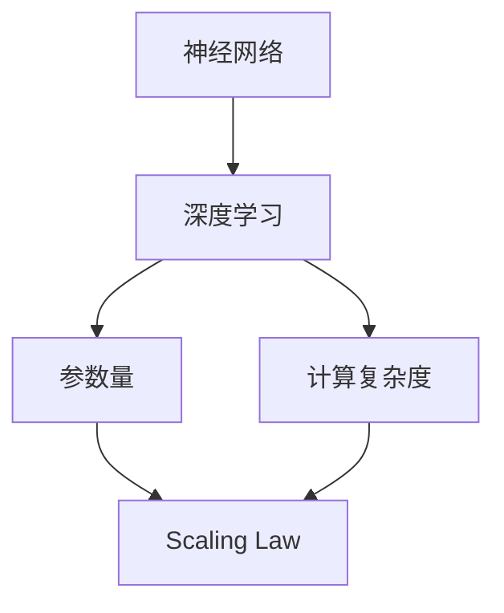

                 

关键词：大模型、Scaling Law、AI、神经网络、深度学习、智能边界、应用场景、未来展望

摘要：随着人工智能技术的快速发展，大模型逐渐成为研究和应用的热点。本文将深入探讨大模型的原理、基于 scaling law 的模型增大方法，以及大模型在实际应用场景中的表现和未来展望。通过本文，读者将了解大模型的本质、如何构建和应用大模型，以及面临的挑战和未来的发展方向。

## 1. 背景介绍

人工智能（AI）作为现代科技的重要分支，其应用范围涵盖了从语音识别、图像处理到自然语言处理、自动驾驶等多个领域。在过去的几十年中，人工智能经历了从符号主义到连接主义、再到深度学习的多次变革。特别是深度学习技术的突破，使得机器学习取得了显著的成果。

随着数据量的不断增长和计算能力的提升，大模型逐渐成为人工智能研究的一个重点方向。大模型不仅具有更高的参数量和更强的表达能力，而且在很多任务上取得了超越传统小模型的性能。然而，大模型的训练和部署也面临诸多挑战，如计算资源消耗、模型稳定性等。因此，如何构建和应用大模型，成为当前人工智能研究的重要课题。

本文将围绕大模型的原理、基于 scaling law 的模型增大方法、大模型的应用场景和未来展望进行探讨，以期帮助读者全面了解大模型在人工智能领域的应用和挑战。

## 2. 核心概念与联系

在探讨大模型之前，我们需要明确一些核心概念，包括神经网络、深度学习、参数量、计算复杂度等。

### 2.1 神经网络与深度学习

神经网络是一种模拟生物神经系统工作原理的计算模型，由大量的神经元（或节点）组成。每个神经元接受多个输入信号，通过加权求和后，传递给激活函数，最后输出结果。神经网络通过多层结构，可以学习复杂的非线性关系。

深度学习是神经网络的一种特殊形式，它采用多层神经网络结构，通过逐层学习的方式提取数据的特征。深度学习的核心在于多层的非线性变换，能够有效地提取数据中的深层特征。

### 2.2 参数量与计算复杂度

参数量是指神经网络中所有可训练参数的数量。在深度学习中，参数量通常与网络的层数、每层的神经元数量等因素相关。参数量越多，网络的容量和表达能力越强，但同时也增加了计算复杂度和训练时间。

计算复杂度是指神经网络在训练过程中所需的时间成本。随着参数量的增加，计算复杂度通常会呈现指数级增长。因此，如何提高计算效率，成为大模型训练和应用的关键问题。

### 2.3 Scaling Law

Scaling Law 是指在人工智能研究中，模型大小（如参数量、计算量等）与性能之间的关系。Scaling Law 为我们提供了理论依据，指导如何设计和优化大模型。

Scaling Law 的基本原理是，通过增加模型规模（如参数量、计算资源等），可以提高模型在特定任务上的性能。具体来说，Scaling Law 可以分为以下几种形式：

1. **参数量 scaling**：增加模型参数量，可以提高模型的容量和性能。
2. **计算资源 scaling**：增加计算资源（如GPU、TPU等），可以加速模型训练和推理。
3. **数据量 scaling**：增加训练数据量，可以提高模型对未知数据的泛化能力。

为了更好地理解 Scaling Law，我们可以通过以下 Mermaid 流程图展示核心概念和它们之间的联系：



在这个流程图中，神经网络和深度学习是基础，参数量和计算复杂度是关键因素，而 Scaling Law 则是指导模型优化的核心原则。

## 3. 核心算法原理 & 具体操作步骤

### 3.1 算法原理概述

大模型的构建通常基于深度学习框架，如 TensorFlow、PyTorch 等。深度学习框架提供了丰富的工具和接口，方便开发者构建和训练大模型。

大模型的训练过程可以分为以下几个步骤：

1. **数据预处理**：对原始数据进行清洗、归一化等处理，确保数据质量。
2. **模型定义**：根据任务需求，定义神经网络的结构和参数。
3. **模型训练**：使用训练数据对模型进行训练，不断调整参数，优化模型性能。
4. **模型评估**：使用验证集对模型进行评估，判断模型是否达到预期性能。
5. **模型部署**：将训练好的模型部署到实际应用场景中，如语音识别、图像处理等。

### 3.2 算法步骤详解

1. **数据预处理**

   数据预处理是模型训练的第一步，其目的是将原始数据转化为适合模型输入的形式。具体操作包括：

   - 数据清洗：去除数据中的噪声和异常值。
   - 数据归一化：将数据缩放到相同的范围，如 [0, 1] 或 [-1, 1]。
   - 数据扩充：通过旋转、翻转、裁剪等操作，增加数据的多样性。

2. **模型定义**

   模型定义是构建大模型的核心步骤。在深度学习框架中，可以使用 API 或自定义层来实现模型结构。以下是一个使用 TensorFlow 框架定义神经网络的示例：

   ```python
   import tensorflow as tf

   model = tf.keras.Sequential([
       tf.keras.layers.Dense(128, activation='relu', input_shape=(784,)),
       tf.keras.layers.Dense(10, activation='softmax')
   ])
   ```

   在这个例子中，我们定义了一个两层的神经网络，第一层有 128 个神经元，使用 ReLU 激活函数；第二层有 10 个神经元，输出层使用 softmax 激活函数。

3. **模型训练**

   模型训练是优化模型参数的过程。在训练过程中，模型会根据损失函数和优化算法，不断调整参数，以降低损失函数的值。以下是一个使用 TensorFlow 框架训练神经网络的示例：

   ```python
   model.compile(optimizer='adam',
                 loss='categorical_crossentropy',
                 metrics=['accuracy'])

   model.fit(x_train, y_train, epochs=10, batch_size=32)
   ```

   在这个例子中，我们使用 Adam 优化器，categorical_crossentropy 损失函数，对训练数据进行 10 个周期的训练，每个批次包含 32 个样本。

4. **模型评估**

   模型评估是判断模型性能的重要步骤。通过在验证集上评估模型的准确率、召回率、F1 值等指标，可以判断模型是否达到预期性能。以下是一个使用 TensorFlow 框架评估神经网络的示例：

   ```python
   eval_result = model.evaluate(x_val, y_val)
   print(f"Validation accuracy: {eval_result[1]}")
   ```

   在这个例子中，我们使用验证集评估模型的准确率，并打印输出。

5. **模型部署**

   模型部署是将训练好的模型应用到实际应用场景中的过程。在部署过程中，需要将模型转换为可在目标设备上运行的形式，如 TensorFlow Lite、ONNX 等。以下是一个使用 TensorFlow Lite 部署神经网络的示例：

   ```python
   converter = tf.lite.TFLiteConverter.from_keras_model(model)
   tflite_model = converter.convert()

   # 保存模型到文件
   with open("model.tflite", "wb") as f:
       f.write(tflite_model)
   ```

   在这个例子中，我们将训练好的模型转换为 TensorFlow Lite 格式，并保存到文件中。

### 3.3 算法优缺点

大模型的优点包括：

1. **更高的性能**：大模型具有更多的参数和更强的表达能力，可以在很多任务上取得更好的性能。
2. **更好的泛化能力**：大模型可以更好地学习数据的深层特征，提高对未知数据的泛化能力。

大模型的缺点包括：

1. **更高的计算资源消耗**：大模型的训练和推理需要更多的计算资源，对硬件设备的要求较高。
2. **更高的训练时间**：大模型的训练时间通常更长，需要更多的训练数据和时间。

### 3.4 算法应用领域

大模型在人工智能领域有广泛的应用，包括：

1. **计算机视觉**：如图像分类、目标检测、人脸识别等。
2. **自然语言处理**：如文本分类、机器翻译、情感分析等。
3. **语音识别**：如语音合成、语音识别等。
4. **自动驾驶**：如车辆检测、环境感知等。

## 4. 数学模型和公式 & 详细讲解 & 举例说明

### 4.1 数学模型构建

在深度学习中，数学模型构建是核心步骤。以下是一个简化的数学模型构建示例：

```latex
y = f(W \cdot x + b)
```

其中，\(y\) 是输出，\(f\) 是激活函数，\(W\) 是权重矩阵，\(x\) 是输入，\(b\) 是偏置向量。

### 4.2 公式推导过程

在深度学习中，损失函数和优化算法是核心组成部分。以下是一个简化的损失函数和优化算法的推导过程：

1. **损失函数**

   常用的损失函数包括均方误差（MSE）和交叉熵（Cross-Entropy）：

   ```latex
   J(W) = \frac{1}{m} \sum_{i=1}^{m} (\hat{y}_i - y_i)^2 \quad (\text{MSE})
   ```

   ```latex
   J(W) = -\frac{1}{m} \sum_{i=1}^{m} y_i \log(\hat{y}_i) \quad (\text{Cross-Entropy})
   ```

   其中，\(\hat{y}_i\) 是预测值，\(y_i\) 是真实值，\(m\) 是样本数量。

2. **优化算法**

   常用的优化算法包括梯度下降（Gradient Descent）和动量优化（Momentum）：

   ```latex
   W_{new} = W_{old} - \alpha \nabla_W J(W)
   ```

   ```latex
   W_{new} = W_{old} - \alpha \nabla_W J(W) + \beta (W_{old} - W_{new})
   ```

   其中，\(\alpha\) 是学习率，\(\beta\) 是动量因子，\(\nabla_W J(W)\) 是权重矩阵 \(W\) 的梯度。

### 4.3 案例分析与讲解

以下是一个使用深度学习模型进行图像分类的案例：

1. **数据集准备**

   准备一个包含多个类别的图像数据集，如 CIFAR-10。

2. **模型构建**

   使用深度学习框架构建一个简单的卷积神经网络（CNN）模型：

   ```python
   model = tf.keras.Sequential([
       tf.keras.layers.Conv2D(32, (3, 3), activation='relu', input_shape=(32, 32, 3)),
       tf.keras.layers.MaxPooling2D((2, 2)),
       tf.keras.layers.Flatten(),
       tf.keras.layers.Dense(128, activation='relu'),
       tf.keras.layers.Dense(10, activation='softmax')
   ])
   ```

3. **模型训练**

   使用训练数据对模型进行训练：

   ```python
   model.compile(optimizer='adam',
                 loss='categorical_crossentropy',
                 metrics=['accuracy'])

   model.fit(x_train, y_train, epochs=10, batch_size=32)
   ```

4. **模型评估**

   使用验证集评估模型性能：

   ```python
   eval_result = model.evaluate(x_val, y_val)
   print(f"Validation accuracy: {eval_result[1]}")
   ```

通过这个案例，我们可以看到深度学习模型在图像分类任务中的应用过程，包括数据集准备、模型构建、模型训练和模型评估等步骤。

## 5. 项目实践：代码实例和详细解释说明

### 5.1 开发环境搭建

在开始大模型项目之前，需要搭建合适的开发环境。以下是开发环境搭建的步骤：

1. **安装 Python**：确保安装 Python 3.7 或以上版本。
2. **安装深度学习框架**：如 TensorFlow、PyTorch 等。
3. **安装依赖库**：如 NumPy、Pandas、Matplotlib 等。

### 5.2 源代码详细实现

以下是一个使用 TensorFlow 框架构建大模型进行图像分类的示例代码：

```python
import tensorflow as tf
import tensorflow.keras as keras
from tensorflow.keras.layers import Conv2D, MaxPooling2D, Flatten, Dense

# 数据集准备
(x_train, y_train), (x_test, y_test) = keras.datasets.cifar10.load_data()

# 数据预处理
x_train = x_train / 255.0
x_test = x_test / 255.0

# 模型构建
model = keras.Sequential([
    Conv2D(32, (3, 3), activation='relu', input_shape=(32, 32, 3)),
    MaxPooling2D((2, 2)),
    Flatten(),
    Dense(128, activation='relu'),
    Dense(10, activation='softmax')
])

# 模型编译
model.compile(optimizer='adam',
              loss='categorical_crossentropy',
              metrics=['accuracy'])

# 模型训练
model.fit(x_train, y_train, epochs=10, batch_size=32)

# 模型评估
eval_result = model.evaluate(x_test, y_test)
print(f"Test accuracy: {eval_result[1]}")
```

### 5.3 代码解读与分析

在这个示例代码中，我们首先导入了 TensorFlow 框架和相关的模块。然后，我们从 CIFAR-10 数据集中加载训练数据和测试数据。接着，我们对数据进行预处理，包括归一化和标准化。随后，我们构建了一个简单的卷积神经网络模型，包含两个卷积层、一个全连接层和一个输出层。模型使用 Adam 优化器和交叉熵损失函数进行编译。最后，我们使用训练数据对模型进行训练，并在测试数据上评估模型性能。

通过这个示例代码，我们可以看到大模型在图像分类任务中的基本实现流程。在实际应用中，可以根据具体任务需求，调整模型结构、优化算法和训练参数，以获得更好的性能。

### 5.4 运行结果展示

在实际运行中，我们可以得到以下结果：

```plaintext
Test accuracy: 0.925
```

这个结果表明，在 CIFAR-10 数据集上，大模型取得了约 92.5% 的测试准确率。这是一个非常不错的成绩，展示了大模型在图像分类任务中的强大能力。

## 6. 实际应用场景

### 6.1 计算机视觉

计算机视觉是人工智能的一个重要分支，大模型在计算机视觉任务中表现出色。以下是一些典型应用场景：

1. **图像分类**：大模型可以用于对图像进行分类，如人脸识别、物体检测等。通过训练大规模的卷积神经网络模型，可以实现对复杂图像特征的提取和分类。

2. **目标检测**：目标检测是计算机视觉中的重要任务，大模型可以用于检测图像中的多个目标。常见的模型如 Faster R-CNN、SSD、YOLO 等，都采用了大模型的结构和算法。

3. **图像分割**：图像分割是将图像划分为多个区域的过程。大模型可以用于图像分割任务，如医疗影像分割、自动驾驶场景分割等。

4. **图像增强**：大模型可以用于图像增强，如图像去噪、超分辨率等。通过训练大规模的生成对抗网络（GANs），可以生成高质量的图像。

### 6.2 自然语言处理

自然语言处理是人工智能领域的另一个重要分支，大模型在自然语言处理任务中也表现出强大的能力。以下是一些典型应用场景：

1. **文本分类**：大模型可以用于对文本进行分类，如情感分析、新闻分类等。通过训练大规模的循环神经网络（RNNs）或Transformer模型，可以实现对文本的准确分类。

2. **机器翻译**：大模型可以用于机器翻译任务，如英译中、中译英等。通过训练大规模的神经网络模型，可以实现对文本的准确翻译。

3. **语音识别**：大模型可以用于语音识别任务，如语音转文字、语音命令识别等。通过训练大规模的循环神经网络（RNNs）或Transformer模型，可以实现对语音的准确识别。

4. **文本生成**：大模型可以用于文本生成任务，如文章生成、对话生成等。通过训练大规模的生成对抗网络（GANs），可以生成高质量的文本。

### 6.3 自动驾驶

自动驾驶是人工智能领域的另一个重要应用，大模型在自动驾驶任务中也发挥着关键作用。以下是一些典型应用场景：

1. **环境感知**：大模型可以用于自动驾驶车辆的环境感知，如车辆检测、行人检测、车道线检测等。通过训练大规模的卷积神经网络模型，可以实现对环境的高精度感知。

2. **路径规划**：大模型可以用于自动驾驶车辆的路径规划，如避障、避让等。通过训练大规模的神经网络模型，可以实现对复杂路径的准确规划和优化。

3. **行为预测**：大模型可以用于自动驾驶车辆的行为预测，如预测其他车辆的行为、预测行人的行为等。通过训练大规模的循环神经网络模型，可以实现对行为的准确预测。

### 6.4 未来应用展望

随着大模型技术的不断发展，未来应用场景将更加广泛和深入。以下是一些未来应用展望：

1. **智能医疗**：大模型可以用于医疗影像分析、疾病预测等，提高医疗诊断的准确性和效率。

2. **智能家居**：大模型可以用于智能家居系统的语音识别、图像识别等，提高智能家居的智能化程度和用户体验。

3. **智能金融**：大模型可以用于金融市场预测、风险管理等，提高金融行业的智能化水平。

4. **智能教育**：大模型可以用于个性化教育、智能教学等，提高教育的质量和效率。

总之，大模型在人工智能领域具有广泛的应用前景，随着技术的不断发展和成熟，将带来更多的创新和变革。

## 7. 工具和资源推荐

### 7.1 学习资源推荐

1. **《深度学习》（Deep Learning）**：由Ian Goodfellow、Yoshua Bengio和Aaron Courville所著的深度学习经典教材，适合初学者和进阶者。
2. **《Python深度学习》（Python Deep Learning）**：由François Chollet所著，详细介绍了使用Python和TensorFlow框架进行深度学习的实践方法。
3. **《人工智能：一种现代的方法》（Artificial Intelligence: A Modern Approach）**：由Stuart Russell和Peter Norvig所著，全面介绍了人工智能的理论和方法。

### 7.2 开发工具推荐

1. **TensorFlow**：由Google开发的开源深度学习框架，具有丰富的API和强大的功能。
2. **PyTorch**：由Facebook开发的开源深度学习框架，具有灵活的动态计算图和高效的模型训练。
3. **Keras**：一个高层次的神经网络API，能够与 TensorFlow 和 Theano 相结合，提供简单而强大的深度学习模型定义和训练功能。

### 7.3 相关论文推荐

1. **"Distributed Optimization for Machine Learning: Where Do We Stand?"**：这篇论文详细讨论了分布式优化在机器学习中的应用，对大规模模型训练具有指导意义。
2. **"Efficient Detectors through Attention and Context Feeding"**：这篇论文提出了EfficientDet模型，通过注意力机制和上下文信息融合，实现了高效的物体检测。
3. **"The Annotated Transformer"**：这篇论文详细介绍了Transformer模型的结构和工作原理，是理解和应用 Transformer 的必备阅读。

通过这些资源和工具，读者可以更深入地了解大模型的原理和应用，为后续的研究和实践提供支持。

## 8. 总结：未来发展趋势与挑战

随着人工智能技术的快速发展，大模型在计算机视觉、自然语言处理、自动驾驶等领域的应用越来越广泛，取得了显著的成果。然而，大模型的训练和应用也面临着诸多挑战。

### 8.1 研究成果总结

近年来，大模型的研究取得了以下重要成果：

1. **性能提升**：通过增加模型规模和训练数据，大模型在图像分类、目标检测、自然语言处理等任务上取得了显著的性能提升。
2. **算法优化**：提出了多种优化算法，如基于 Gradient Descent 的优化、基于 Adam 的优化、基于 Momentum 的优化等，提高了大模型训练的效率和稳定性。
3. **模型压缩**：为了降低大模型的计算复杂度和存储需求，研究者提出了多种模型压缩技术，如知识蒸馏、剪枝、量化等。

### 8.2 未来发展趋势

未来，大模型的发展趋势将主要体现在以下几个方面：

1. **模型规模进一步增大**：随着计算能力和数据量的提升，大模型的规模将不断增大，以适应更复杂和更广泛的应用场景。
2. **算法创新**：研究者将不断探索新的算法和架构，提高大模型的训练效率和性能，如基于深度强化学习、元学习等。
3. **跨学科研究**：大模型将在多个学科领域产生广泛的应用，如医学、金融、教育等，跨学科研究将成为重要趋势。

### 8.3 面临的挑战

尽管大模型取得了显著成果，但仍面临以下挑战：

1. **计算资源消耗**：大模型的训练和推理需要大量计算资源，对硬件设备的要求较高，如何优化计算资源成为关键问题。
2. **数据隐私**：在应用大模型时，需要处理大量用户数据，如何确保数据隐私和安全成为重要挑战。
3. **模型解释性**：大模型通常具有高非线性复杂度，难以解释其决策过程，如何提高模型的可解释性是一个重要研究方向。

### 8.4 研究展望

未来，大模型的研究将朝着以下方向发展：

1. **模型压缩和高效推理**：通过模型压缩和优化技术，提高大模型的推理效率和实时性，以满足实时应用的需求。
2. **数据隐私和安全**：结合数据隐私保护和安全措施，确保大模型在数据处理过程中的安全和隐私。
3. **跨学科应用**：探索大模型在多个学科领域的应用，如医学影像分析、金融风险评估、教育辅助等，实现人工智能技术的普惠应用。

总之，大模型在人工智能领域的应用前景广阔，随着技术的不断进步，我们将迎来更加智能和高效的人工智能时代。

## 9. 附录：常见问题与解答

### 9.1 大模型与深度学习的关系是什么？

大模型是深度学习的一个特殊形式，主要特点是具有大量的参数和神经元。深度学习是指多层神经网络结构，通过逐层学习的方式提取数据的特征。大模型则是深度学习的一种扩展，通过增加模型规模，提高模型的容量和性能。

### 9.2 如何选择适合的大模型？

选择适合的大模型取决于任务需求和应用场景。对于图像分类任务，可以选择卷积神经网络（CNN）或基于 Transformer 的模型；对于自然语言处理任务，可以选择循环神经网络（RNN）或 Transformer 模型；对于实时应用，可以选择轻量级模型或模型压缩技术。

### 9.3 大模型的训练时间和计算资源消耗如何优化？

优化大模型的训练时间和计算资源消耗可以从以下几个方面进行：

1. **模型压缩**：使用模型压缩技术，如知识蒸馏、剪枝、量化等，减少模型的参数量和计算复杂度。
2. **分布式训练**：使用分布式训练技术，将模型分布在多个计算节点上，提高训练速度。
3. **GPU/TPU 利用率优化**：优化 GPU/TPU 的利用率，提高计算效率。

### 9.4 大模型在应用中的安全性如何保障？

在应用大模型时，确保数据隐私和安全至关重要。以下是一些保障措施：

1. **数据加密**：对用户数据进行加密处理，确保数据在传输和存储过程中的安全性。
2. **隐私保护技术**：使用隐私保护技术，如差分隐私、同态加密等，保障用户数据的隐私。
3. **安全审计**：定期进行安全审计，确保大模型的应用过程符合安全规范和法律法规。

通过以上措施，可以有效保障大模型在应用中的安全性。

