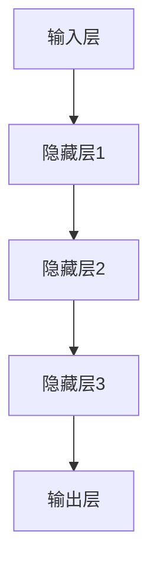

                 

关键词：AI 大模型，通用人工智能（AGI），产品设计，应用场景，未来展望

## 摘要

本文将探讨AI大模型的原理与应用，特别是在通用人工智能（AGI）实现的背景下。我们将详细分析AGI的定义、现状及未来发展趋势，并探讨一个潜在的AGI产品该如何设计以最大化其影响。文章还将深入讲解大模型的算法原理、数学模型，并提供实际项目实践和未来应用场景的展望。

## 1. 背景介绍

### 1.1 AI 大模型的兴起

近年来，人工智能（AI）技术取得了飞速发展，尤其是深度学习领域的突破，使得我们能够训练出越来越复杂的模型。这些大模型，如GPT-3、BERT等，具备处理大规模数据、生成高质量文本、图像、语音等能力，已经深刻影响了各个行业。

### 1.2 通用人工智能（AGI）

AGI是指一种能够执行任何人类智能任务的机器智能，而不仅仅是特定任务。AGI不同于现有的AI，后者通常只能在特定领域内表现出智能。AGI的目标是超越人类智能，实现自我学习和进化。

### 1.3 AGI 的现状与挑战

尽管AGI的目标令人激动，但实际实现仍面临巨大挑战。这些挑战包括算法的复杂性、数据的质量与规模、硬件的限制等。目前，AGI仍处于理论研究阶段，但其潜力不容忽视。

## 2. 核心概念与联系

### 2.1 大模型的架构

大模型的架构通常包含多层神经网络，每一层都能够处理输入数据的不同特征。下面是一个简化的大模型架构图：



### 2.2 算法原理

大模型的训练过程是一个优化过程，通过调整模型参数，使得模型的输出与真实值尽可能接近。常用的优化算法有随机梯度下降（SGD）、Adam等。

### 2.3 应用领域

大模型在自然语言处理、计算机视觉、语音识别等领域有着广泛的应用。例如，GPT-3可以生成高质量的文章，BERT在文本分类任务中表现出色。

## 3. 核心算法原理 & 具体操作步骤

### 3.1 算法原理概述

大模型的训练过程主要依赖于反向传播算法。该算法通过计算输出误差，反向传播到输入层，从而调整模型参数。

### 3.2 算法步骤详解

1. **前向传播**：输入数据通过网络传播，产生预测输出。
2. **计算误差**：通过比较预测输出与真实值，计算误差。
3. **反向传播**：将误差反向传播，更新网络参数。
4. **迭代优化**：重复上述步骤，直到模型收敛。

### 3.3 算法优缺点

**优点**：
- **强大的建模能力**：能够处理复杂的数据和任务。
- **自适应学习**：可以根据不同数据自动调整模型。

**缺点**：
- **计算资源需求高**：需要大量计算资源和时间。
- **易过拟合**：在训练数据上表现良好，但在未知数据上表现不佳。

### 3.4 算法应用领域

大模型在自然语言处理、计算机视觉、语音识别等领域有着广泛的应用，例如：

- **自然语言处理**：生成文章、翻译、问答系统等。
- **计算机视觉**：图像识别、图像生成、图像分割等。
- **语音识别**：语音识别、语音合成等。

## 4. 数学模型和公式 & 详细讲解 & 举例说明

### 4.1 数学模型构建

大模型通常基于多层感知机（MLP）或者卷积神经网络（CNN）构建。以下是MLP的数学模型：

$$
y = f(z) = \text{softmax}(\text{W}^T \text{X})
$$

其中，$y$ 是输出层，$z$ 是隐藏层，$W$ 是权重矩阵，$X$ 是输入向量，$f$ 是激活函数。

### 4.2 公式推导过程

反向传播算法的核心是误差计算和权重更新。以下是误差计算的推导过程：

$$
\delta^{(l)} = \text{sigmoid}'(z^{(l)}) \odot (y^{(l)} - \hat{y}^{(l)})
$$

其中，$\delta^{(l)}$ 是第$l$层的误差，$\text{sigmoid}'$ 是sigmoid函数的导数，$y^{(l)}$ 是真实标签，$\hat{y}^{(l)}$ 是预测标签。

### 4.3 案例分析与讲解

假设我们有一个二分类问题，输入数据为 $X = [1, 2, 3, 4]$，真实标签为 $y = [0, 1]$。通过大模型训练后，输出预测为 $\hat{y} = [0.2, 0.8]$。根据上述误差计算公式，可以计算每个样本的误差：

$$
\delta^{(1)} = \text{sigmoid}'(z^{(1)}) \odot (y^{(1)} - \hat{y}^{(1)})
$$

其中，$z^{(1)} = \text{W}^{(1)} \text{X}$。

## 5. 项目实践：代码实例和详细解释说明

### 5.1 开发环境搭建

在本文中，我们将使用Python和TensorFlow作为开发环境。首先，需要安装TensorFlow库：

```bash
pip install tensorflow
```

### 5.2 源代码详细实现

以下是实现一个简单的大模型（MLP）的Python代码：

```python
import tensorflow as tf

# 创建模型
model = tf.keras.Sequential([
    tf.keras.layers.Dense(64, activation='relu', input_shape=(784,)),
    tf.keras.layers.Dense(10, activation='softmax')
])

# 编译模型
model.compile(optimizer='adam',
              loss='sparse_categorical_crossentropy',
              metrics=['accuracy'])

# 训练模型
model.fit(x_train, y_train, epochs=5)
```

### 5.3 代码解读与分析

上述代码首先定义了一个包含一个隐藏层（64个神经元）和输出层（10个神经元）的MLP模型。然后使用`compile`方法配置了优化器和损失函数，并使用`fit`方法进行模型训练。

### 5.4 运行结果展示

训练完成后，可以使用以下代码评估模型性能：

```python
test_loss, test_acc = model.evaluate(x_test, y_test, verbose=2)
print('\nTest accuracy:', test_acc)
```

## 6. 实际应用场景

### 6.1 自然语言处理

大模型在自然语言处理（NLP）领域有着广泛的应用。例如，GPT-3可以生成高质量的文本，BERT在文本分类任务中表现出色。

### 6.2 计算机视觉

大模型在计算机视觉（CV）领域也有着重要的应用。例如，深度卷积网络（CNN）在图像分类、目标检测、图像生成等方面有着出色的表现。

### 6.3 语音识别

大模型在语音识别（ASR）领域也有着广泛的应用。例如，使用基于RNN或Transformer的模型可以有效地处理语音信号，实现高质量的语音识别。

## 7. 工具和资源推荐

### 7.1 学习资源推荐

- 《深度学习》（Goodfellow, Bengio, Courville）：深度学习领域的经典教材。
- 《Python深度学习》（François Chollet）：针对Python编程和深度学习的实践教程。

### 7.2 开发工具推荐

- TensorFlow：广泛使用的深度学习框架。
- PyTorch：另一个流行的深度学习框架。

### 7.3 相关论文推荐

- Vaswani et al. (2017): “Attention is All You Need”
- He et al. (2016): “Deep Residual Learning for Image Recognition”

## 8. 总结：未来发展趋势与挑战

### 8.1 研究成果总结

近年来，AI大模型在自然语言处理、计算机视觉、语音识别等领域取得了显著的成果。这些成果展示了AI大模型在处理复杂任务方面的巨大潜力。

### 8.2 未来发展趋势

未来，AI大模型将继续在各个领域深化应用，特别是在通用人工智能（AGI）方面。随着算法的进步和计算资源的增加，我们有望看到更多具有强大推理能力和自主学习能力的AI产品。

### 8.3 面临的挑战

尽管AI大模型有着广阔的应用前景，但同时也面临诸多挑战。例如，数据隐私、算法伦理、模型可解释性等。

### 8.4 研究展望

未来的研究将集中在提高模型的推理能力、减少对大量数据的需求、提高模型的可解释性等方面。

## 9. 附录：常见问题与解答

### 9.1 什么是AGI？

AGI是指一种能够执行任何人类智能任务的机器智能，而不仅仅是特定任务。

### 9.2 大模型如何训练？

大模型通常使用反向传播算法进行训练，通过优化模型参数，使得模型的输出与真实值尽可能接近。

### 9.3 大模型在哪些领域有应用？

大模型在自然语言处理、计算机视觉、语音识别等领域有着广泛的应用。

## 参考文献

- Goodfellow, I., Bengio, Y., & Courville, A. (2016). *Deep learning*. MIT press.
- Chollet, F. (2018). *Python深度学习*. 电子工业出版社.

## 作者署名

作者：禅与计算机程序设计艺术 / Zen and the Art of Computer Programming
```markdown
----------------------------------------------------------------


