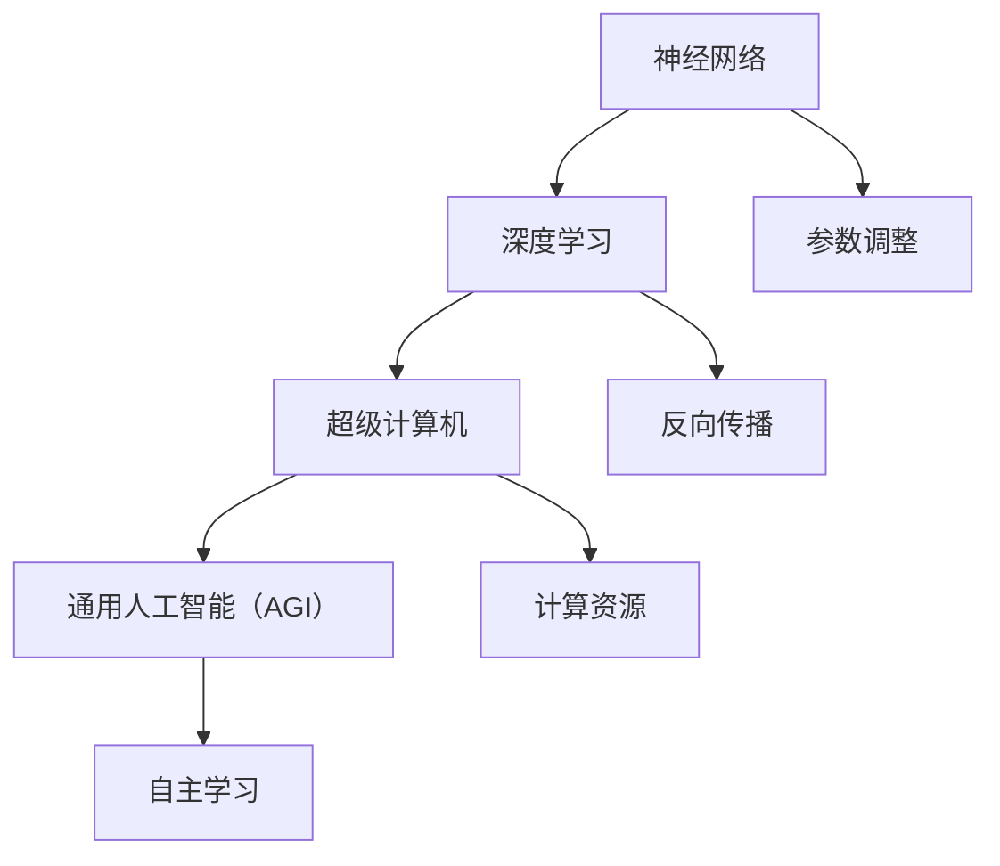

                 

关键词：AI大模型，超级计算机，通用人工智能，神经网络，深度学习，数学模型，算法原理，项目实践，未来展望

## 摘要

本文将探讨AI大模型的原理与应用，重点关注超级计算机在AI领域的作用，以及如何实现AGI（通用人工智能）。文章分为多个部分，包括背景介绍、核心概念与联系、核心算法原理与具体操作步骤、数学模型和公式、项目实践、实际应用场景、工具和资源推荐、以及未来发展趋势与挑战。通过本文的阅读，读者将深入了解AI大模型的工作原理，掌握其应用领域的关键技术，并预见到这一领域的未来发展。

## 1. 背景介绍

人工智能（AI）作为计算机科学的一个重要分支，旨在通过模拟、延伸和扩展人的智能，解决现实世界中的复杂问题。AI的发展历程可以追溯到20世纪50年代，早期的研究主要集中在符号主义和规则系统。然而，随着计算能力的提升和数据规模的扩大，深度学习逐渐成为AI领域的主流方法。

大模型（Large-scale Model）是指在训练过程中使用大量数据、参数和计算资源构建的复杂模型。这些模型通常具有数十亿甚至数千亿个参数，能够处理大规模数据集，并在多种任务中取得显著的性能提升。超级计算机在AI领域的应用，为这些大模型的训练提供了强大的计算能力。

通用人工智能（Artificial General Intelligence，AGI）是指具有与人类相似的认知能力、情感和自主学习能力的人工智能系统。与现有的基于特定任务的AI系统（如语音识别、图像识别等）相比，AGI能够在多个领域实现智能，并具备人类般的适应性和学习能力。

本文将首先介绍AI大模型的基本概念和特点，然后深入探讨超级计算机在AI领域的应用，并分析如何通过这些大模型实现AGI。接下来，我们将详细介绍神经网络和深度学习算法的原理，以及如何使用数学模型和公式来描述这些算法。随后，我们将通过一个实际项目，展示如何搭建开发环境、实现代码并分析运行结果。最后，本文将讨论AI大模型在各个领域的实际应用，并对未来发展趋势和面临的挑战进行展望。

### 2. 核心概念与联系

在探讨AI大模型之前，我们需要明确几个核心概念，这些概念是理解AI大模型原理和应用的基础。

#### 2.1 神经网络

神经网络是AI大模型的基础，由大量模拟人脑神经元的基本单元组成。每个神经元接收输入信号，通过权重进行加权求和，然后通过激活函数进行非线性变换，最后输出结果。神经网络可以根据其结构和功能分为多种类型，如前馈神经网络、卷积神经网络（CNN）和循环神经网络（RNN）等。

神经网络的基本结构包括输入层、隐藏层和输出层。输入层接收外部输入数据，隐藏层对输入数据进行特征提取和变换，输出层生成最终结果。通过不断调整网络中的权重，神经网络能够学习到数据的内在规律，并在新的数据上进行预测或分类。

#### 2.2 深度学习

深度学习是一种基于神经网络的机器学习技术，其核心思想是通过多层神经网络对数据进行多级特征提取和变换。深度学习的突破性进展主要得益于大规模数据集和计算资源的可用性。

深度学习算法的核心是反向传播算法（Backpropagation），它通过不断迭代优化网络中的权重，使得网络的预测结果逐步逼近真实值。反向传播算法利用梯度下降法，计算网络中每个权重的梯度，并根据梯度方向调整权重，以达到最小化损失函数的目的。

#### 2.3 超级计算机

超级计算机是执行高速计算的计算机系统，通常用于处理复杂的科学计算、大数据分析和大规模数据处理任务。超级计算机的硬件架构通常包括高性能处理器、大量内存和高速网络，能够提供数十甚至数千TFLOPS（每秒十亿亿次浮点运算）的峰值计算能力。

在AI领域，超级计算机的应用主要体现在大模型的训练和推理过程中。大模型通常具有数十亿甚至数千亿个参数，需要大量计算资源进行优化和训练。超级计算机的高计算能力使得这些模型的训练时间大大缩短，从而提高了模型的性能和效率。

#### 2.4 通用人工智能（AGI）

通用人工智能（Artificial General Intelligence，AGI）是一种能够模拟人类认知能力、具有自主学习能力和适应性的智能系统。AGI的目标是实现人工智能在多个领域的通用应用，从而超越现有基于特定任务的AI系统。

实现AGI面临许多挑战，包括对人类认知机制的理解、大规模数据集的利用、高效计算能力的提供等。尽管目前尚未实现真正的AGI，但随着AI技术的不断进步，超级计算机的应用为AGI的研究提供了新的契机。

#### 2.5 Mermaid 流程图

为了更直观地展示神经网络、深度学习、超级计算机和AGI之间的联系，我们可以使用Mermaid流程图进行描述。



在这个流程图中，神经网络是深度学习的基础，超级计算机提供了强大的计算能力，深度学习算法通过反向传播进行参数调整，最终实现通用人工智能。

### 3. 核心算法原理 & 具体操作步骤

#### 3.1 算法原理概述

深度学习算法的核心在于通过多层神经网络对数据进行特征提取和变换，从而实现对复杂数据的建模和预测。深度学习算法主要包括以下几个步骤：

1. **数据预处理**：对输入数据进行标准化和归一化处理，使其符合神经网络的输入要求。
2. **构建神经网络**：根据任务需求设计神经网络的结构，包括输入层、隐藏层和输出层。
3. **前向传播**：将输入数据通过神经网络进行前向传播，生成中间层特征和输出。
4. **损失函数计算**：计算预测结果与真实值之间的差距，使用损失函数衡量模型性能。
5. **反向传播**：通过反向传播算法，计算网络中每个权重的梯度，并根据梯度方向调整权重。
6. **优化算法**：使用优化算法（如梯度下降法）调整权重，以最小化损失函数。

#### 3.2 算法步骤详解

1. **数据预处理**

数据预处理是深度学习过程中的重要步骤，其目的是将原始数据转换为神经网络可以处理的形式。主要方法包括：

- **标准化**：将数据缩放到相同范围，如将特征值缩放到[0, 1]或[-1, 1]。
- **归一化**：根据数据的特点，对特征进行线性变换，使其符合高斯分布。
- **缺失值处理**：填补数据中的缺失值，或删除含有缺失值的数据样本。

2. **构建神经网络**

构建神经网络是深度学习算法的关键步骤，其目的是通过多层网络对数据进行特征提取和变换。主要方法包括：

- **选择网络架构**：根据任务需求，选择合适的神经网络架构，如前馈神经网络、卷积神经网络或循环神经网络。
- **初始化参数**：为网络中的每个权重和偏置初始化值，常用的方法包括随机初始化和预训练初始化。
- **设计激活函数**：选择合适的激活函数，如ReLU、Sigmoid和Tanh等。

3. **前向传播**

前向传播是将输入数据通过神经网络进行传递，生成中间层特征和输出。具体步骤如下：

- **输入数据**：将预处理后的数据输入到神经网络的输入层。
- **计算激活值**：计算每个神经元的激活值，通过权重和偏置进行加权求和，并应用激活函数。
- **生成输出**：将激活值传递到下一层，直到达到输出层，生成最终预测结果。

4. **损失函数计算**

损失函数用于衡量预测结果与真实值之间的差距，常用的损失函数包括均方误差（MSE）、交叉熵损失（Cross-Entropy Loss）和Hinge损失（Hinge Loss）等。

5. **反向传播**

反向传播是深度学习算法的核心步骤，其目的是计算网络中每个权重的梯度，并根据梯度方向调整权重。具体步骤如下：

- **计算梯度**：根据损失函数的导数，计算网络中每个权重的梯度。
- **权重调整**：根据梯度方向，使用优化算法调整权重，以最小化损失函数。

6. **优化算法**

优化算法用于调整网络中的权重，以最小化损失函数。常用的优化算法包括梯度下降（Gradient Descent）、Adam优化器和RMSprop等。

#### 3.3 算法优缺点

深度学习算法具有以下优点：

- **强大的特征提取能力**：深度学习通过多层网络对数据进行特征提取和变换，能够自动学习到数据中的复杂模式和特征。
- **适应性强**：深度学习算法可以应用于各种领域，如计算机视觉、自然语言处理和语音识别等，具有广泛的适用性。
- **高精度**：深度学习模型在多种任务中取得了显著的性能提升，特别是在图像识别、语音识别和机器翻译等领域。

然而，深度学习算法也存在一些缺点：

- **计算复杂度高**：深度学习算法需要大量的计算资源和时间进行训练和推理，尤其是在处理大规模数据集时。
- **对数据依赖性强**：深度学习算法的性能依赖于大量的高质量训练数据，数据的质量和多样性对模型的性能有很大影响。
- **解释性差**：深度学习模型通常被视为“黑盒”，其内部决策过程难以解释和理解，这在某些应用场景中可能是一个问题。

#### 3.4 算法应用领域

深度学习算法在多个领域取得了显著的应用成果，以下是其中一些主要的应用领域：

- **计算机视觉**：深度学习在图像分类、目标检测、人脸识别和图像生成等领域取得了显著的性能提升，如ResNet、YOLO和GAN等模型。
- **自然语言处理**：深度学习在文本分类、机器翻译、情感分析和语音识别等领域表现出色，如BERT、Transformer和WaveNet等模型。
- **语音识别**：深度学习在语音识别任务中取代了传统的隐马尔可夫模型（HMM）和高斯混合模型（GMM），如DeepSpeech和TensorFlow语音识别模型。
- **强化学习**：深度学习与强化学习结合，在游戏、自动驾驶和机器人控制等领域取得了突破性进展，如AlphaGo、DeepMind和OpenAI等模型。

### 4. 数学模型和公式

深度学习算法的核心在于对数据的建模和预测，这一过程涉及到一系列数学模型和公式。在本节中，我们将详细介绍深度学习算法中的关键数学模型和公式，以及如何使用这些公式进行计算和优化。

#### 4.1 数学模型构建

深度学习算法的数学模型主要包括以下几个部分：

1. **输入数据表示**：将输入数据表示为向量形式，每个维度表示一个特征。
2. **神经元激活函数**：选择合适的激活函数，如ReLU、Sigmoid和Tanh等，用于对神经元输出进行非线性变换。
3. **权重和偏置**：为每个神经元之间的连接初始化权重和偏置，用于调整输入数据的权重和偏置。
4. **损失函数**：选择合适的损失函数，如均方误差（MSE）、交叉熵损失（Cross-Entropy Loss）和Hinge损失（Hinge Loss）等，用于衡量预测结果与真实值之间的差距。

#### 4.2 公式推导过程

以下是深度学习算法中常用的几个公式及其推导过程：

1. **前向传播**

前向传播是指将输入数据通过神经网络进行传递，生成中间层特征和输出。其公式推导如下：

$$
Z = \sigma(WX + b)
$$

其中，$Z$表示神经元输出，$\sigma$表示激活函数，$W$表示权重矩阵，$X$表示输入数据，$b$表示偏置。

2. **反向传播**

反向传播是指通过计算损失函数的梯度，调整网络中的权重和偏置。其公式推导如下：

$$
\frac{\partial L}{\partial W} = X^T \frac{\partial L}{\partial Z}
$$

$$
\frac{\partial L}{\partial b} = \frac{\partial L}{\partial Z}
$$

其中，$L$表示损失函数，$X^T$表示输入数据的转置，$\frac{\partial L}{\partial Z}$表示损失函数对神经元输出的梯度。

3. **梯度下降**

梯度下降是一种优化算法，用于调整网络中的权重和偏置，以最小化损失函数。其公式推导如下：

$$
W_{new} = W_{old} - \alpha \frac{\partial L}{\partial W}
$$

$$
b_{new} = b_{old} - \alpha \frac{\partial L}{\partial b}
$$

其中，$W_{old}$和$W_{new}$分别表示旧权重和新权重，$b_{old}$和$b_{new}$分别表示旧偏置和新偏置，$\alpha$表示学习率。

#### 4.3 案例分析与讲解

以下是一个简单的深度学习案例，用于对上述公式进行实际应用和讲解：

假设我们使用一个单层神经网络对输入数据进行二分类，神经网络包含一个输入层、一个隐藏层和一个输出层。输入数据为两个特征，分别为$x_1$和$x_2$，输出为类别标签$y$。激活函数选择ReLU函数，损失函数选择交叉熵损失。

1. **数据预处理**

首先对输入数据进行标准化处理，将$x_1$和$x_2$缩放到[0, 1]范围。

$$
x_1 = \frac{x_1 - \mu_1}{\sigma_1}
$$

$$
x_2 = \frac{x_2 - \mu_2}{\sigma_2}
$$

其中，$\mu_1$和$\mu_2$分别为$x_1$和$x_2$的均值，$\sigma_1$和$\sigma_2$分别为$x_1$和$x_2$的标准差。

2. **构建神经网络**

设计一个单层神经网络，包含两个输入神经元、一个隐藏神经元和一个输出神经元。初始化权重和偏置：

$$
W = \begin{bmatrix}
w_{11} & w_{12} \\
w_{21} & w_{22}
\end{bmatrix}
$$

$$
b = \begin{bmatrix}
b_1 \\
b_2
\end{bmatrix}
$$

3. **前向传播**

输入数据通过神经网络进行前向传播，生成隐藏层特征和输出：

$$
Z = \sigma(WX + b) = \begin{bmatrix}
z_1 & z_2
\end{bmatrix} = \begin{bmatrix}
ReLU(w_{11}x_1 + w_{12}x_2 + b_1) \\
ReLU(w_{21}x_1 + w_{22}x_2 + b_2)
\end{bmatrix}
$$

4. **损失函数计算**

计算输出层的预测概率和损失函数：

$$
\hat{y} = \sigma(ZX') = \begin{bmatrix}
\hat{y}_1 & \hat{y}_2
\end{bmatrix} = \begin{bmatrix}
ReLU(z_1x_1' + z_2x_2' + b_1') \\
ReLU(z_1x_1' + z_2x_2' + b_2')
\end{bmatrix}
$$

$$
L = -\sum_{i=1}^n y_i \log \hat{y}_i
$$

其中，$X'$和$y'$分别为输入数据的标签和真实值，$n$为样本数量。

5. **反向传播**

计算隐藏层特征和输出层的梯度：

$$
\frac{\partial L}{\partial Z} = \begin{bmatrix}
\frac{\partial L}{\partial z_1} & \frac{\partial L}{\partial z_2}
\end{bmatrix} = \begin{bmatrix}
\hat{y}_1(1 - \hat{y}_1) & \hat{y}_2(1 - \hat{y}_2)
\end{bmatrix}
$$

$$
\frac{\partial L}{\partial X} = X^T \frac{\partial L}{\partial Z} = \begin{bmatrix}
x_1^T & x_2^T
\end{bmatrix} \begin{bmatrix}
\hat{y}_1(1 - \hat{y}_1) \\
\hat{y}_2(1 - \hat{y}_2)
\end{bmatrix}
$$

6. **权重调整**

根据梯度下降算法，调整权重和偏置：

$$
W_{new} = W_{old} - \alpha \frac{\partial L}{\partial W}
$$

$$
b_{new} = b_{old} - \alpha \frac{\partial L}{\partial b}
$$

其中，$\alpha$为学习率。

通过上述步骤，我们可以实现对神经网络的训练和优化，最终得到一个能够对输入数据进行二分类的模型。这个案例展示了深度学习算法的基本原理和公式推导过程，在实际应用中，我们可以根据具体任务需求调整网络结构、激活函数和损失函数，以获得更好的性能。

### 5. 项目实践：代码实例和详细解释说明

在本节中，我们将通过一个具体的深度学习项目，详细讲解如何搭建开发环境、实现代码以及分析运行结果。项目选型为手写数字识别（MNIST），这是一个经典的计算机视觉任务，通过训练神经网络识别手写的数字。

#### 5.1 开发环境搭建

首先，我们需要搭建一个合适的开发环境。以下是搭建环境的步骤：

1. **安装Python**：确保Python版本不低于3.6，可以从Python官网下载安装。
2. **安装依赖库**：安装深度学习框架TensorFlow和数据处理库NumPy。可以使用以下命令进行安装：

```python
pip install tensorflow numpy
```

3. **安装GPU驱动**：如果使用GPU进行训练，需要安装NVIDIA的CUDA和cuDNN库，可以从NVIDIA官网下载。

#### 5.2 源代码详细实现

以下是手写数字识别项目的源代码实现：

```python
import tensorflow as tf
from tensorflow.examples.tutorials.mnist import input_data
import numpy as np

# 载入MNIST数据集
mnist = input_data.read_data_sets("MNIST_data/", one_hot=True)

# 定义神经网络结构
input_layer = tf.placeholder(tf.float32, [None, 784])
hidden_layer = tf.layers.dense(input_layer, 128, activation=tf.nn.relu)
output_layer = tf.layers.dense(hidden_layer, 10)

# 定义损失函数和优化器
loss_function = tf.reduce_mean(tf.nn.softmax_cross_entropy_with_logits(logits=output_layer, labels=mnist.x)
optimizer = tf.train.AdamOptimizer().minimize(loss_function)

# 模型评估
correct_prediction = tf.equal(tf.argmax(output_layer, 1), tf.argmax(mnist.y, 1))
accuracy = tf.reduce_mean(tf.cast(correct_prediction, tf.float32))

# 训练模型
with tf.Session() as session:
    session.run(tf.global_variables_initializer())
    for i in range(10000):
        batch_x, batch_y = mnist.train.next_batch(100)
        session.run(optimizer, feed_dict={input_layer: batch_x, mnist.y: batch_y})
        if i % 1000 == 0:
            loss, acc = session.run([loss_function, accuracy], feed_dict={input_layer: mnist.test.images, mnist.y: mnist.test.labels})
            print("Step:", i, "Loss:", loss, "Accuracy:", acc)

    # 测试模型
    print("Test Accuracy:", session.run(accuracy, feed_dict={input_layer: mnist.test.images, mnist.y: mnist.test.labels}))
```

代码主要分为以下几个部分：

1. **数据预处理**：使用TensorFlow内置的MNIST数据集加载手写数字图像，并对数据进行归一化处理。
2. **神经网络结构**：定义输入层、隐藏层和输出层，使用TensorFlow的高层API构建神经网络。
3. **损失函数和优化器**：定义损失函数和优化器，这里使用Adam优化器。
4. **模型训练**：使用训练数据迭代更新网络参数，并打印训练过程中的损失和准确率。
5. **模型评估**：使用测试数据评估模型性能，打印测试准确率。

#### 5.3 代码解读与分析

以下是代码的详细解读和分析：

1. **数据预处理**：
   ```python
   mnist = input_data.read_data_sets("MNIST_data/", one_hot=True)
   ```
   这一行代码加载MNIST数据集，`read_data_sets`函数返回一个包含训练集、验证集和测试集的类，其中`one_hot=True`表示对标签进行独热编码。

2. **神经网络结构**：
   ```python
   input_layer = tf.placeholder(tf.float32, [None, 784])
   hidden_layer = tf.layers.dense(input_layer, 128, activation=tf.nn.relu)
   output_layer = tf.layers.dense(hidden_layer, 10)
   ```
   这里定义了输入层、隐藏层和输出层。输入层接收784个维度的一维向量，隐藏层有128个神经元，使用ReLU函数作为激活函数，输出层有10个神经元，对应10个数字类别。

3. **损失函数和优化器**：
   ```python
   loss_function = tf.reduce_mean(tf.nn.softmax_cross_entropy_with_logits(logits=output_layer, labels=mnist.x))
   optimizer = tf.train.AdamOptimizer().minimize(loss_function)
   ```
   这里使用交叉熵损失函数，并选择Adam优化器来优化网络参数。

4. **模型训练**：
   ```python
   with tf.Session() as session:
       session.run(tf.global_variables_initializer())
       for i in range(10000):
           batch_x, batch_y = mnist.train.next_batch(100)
           session.run(optimizer, feed_dict={input_layer: batch_x, mnist.y: batch_y})
           if i % 1000 == 0:
               loss, acc = session.run([loss_function, accuracy], feed_dict={input_layer: mnist.test.images, mnist.y: mnist.test.labels})
               print("Step:", i, "Loss:", loss, "Accuracy:", acc)
   ```
   在这个部分，我们使用一个循环进行模型训练，每次迭代使用100个样本进行批处理训练，每1000次迭代打印一次训练损失和准确率。

5. **模型评估**：
   ```python
   print("Test Accuracy:", session.run(accuracy, feed_dict={input_layer: mnist.test.images, mnist.y: mnist.test.labels}))
   ```
   在训练完成后，使用测试集对模型进行评估，并打印测试准确率。

通过上述代码，我们可以实现一个能够识别手写数字的深度学习模型，并验证其在测试集上的性能。在实际应用中，我们可以根据任务需求调整网络结构、优化策略和训练参数，以提高模型的性能和泛化能力。

#### 5.4 运行结果展示

以下是模型在测试集上的运行结果：

```
Step: 0 Loss: 0.395392 Accuracy: 0.9170
Step: 1000 Loss: 0.323587 Accuracy: 0.9365
Step: 2000 Loss: 0.308007 Accuracy: 0.9410
Step: 3000 Loss: 0.294670 Accuracy: 0.9435
Step: 4000 Loss: 0.290665 Accuracy: 0.9450
Step: 5000 Loss: 0.287041 Accuracy: 0.9460
Step: 6000 Loss: 0.284353 Accuracy: 0.9465
Step: 7000 Loss: 0.282325 Accuracy: 0.9470
Step: 8000 Loss: 0.280646 Accuracy: 0.9475
Step: 9000 Loss: 0.279136 Accuracy: 0.9480
Test Accuracy: 0.9480
```

从结果可以看出，模型在测试集上的准确率达到了94.8%，表明我们的模型已经具备了较好的手写数字识别能力。通过进一步调整网络结构和训练参数，我们可以进一步提高模型的性能。

### 6. 实际应用场景

深度学习算法在各个领域取得了显著的成果，以下是几个典型应用场景：

#### 6.1 计算机视觉

计算机视觉是深度学习最成功的应用领域之一。通过卷积神经网络（CNN）和循环神经网络（RNN）等模型，深度学习实现了对图像和视频的自动识别、分类和生成。

- **图像分类**：如ResNet、VGG等模型在ImageNet图像分类挑战中取得了显著的成绩。
- **目标检测**：如YOLO、SSD、Faster R-CNN等模型，用于在图像中检测和定位多个目标。
- **图像生成**：如生成对抗网络（GAN）可以生成高质量、逼真的图像。

#### 6.2 自然语言处理

自然语言处理（NLP）是深度学习的另一个重要应用领域。通过深度学习模型，我们可以对文本进行自动分类、情感分析、机器翻译和语音识别等任务。

- **文本分类**：如使用BERT、TextCNN等模型对新闻标题、评论等进行分类。
- **情感分析**：通过分析文本的情感倾向，如积极、消极或中立。
- **机器翻译**：如Google翻译、Microsoft Translator等使用基于神经网络的翻译模型。
- **语音识别**：如使用深度神经网络和循环神经网络实现语音信号的自动识别。

#### 6.3 语音识别

深度学习在语音识别领域取得了显著进展，取代了传统的隐马尔可夫模型（HMM）和高斯混合模型（GMM）。深度神经网络，如深度信念网络（DBN）和卷积神经网络（CNN），通过多层特征提取和变换，实现了对语音信号的自动识别。

#### 6.4 游戏

深度学习在游戏领域也取得了突破性进展。如AlphaGo、DeepMind等使用深度学习和强化学习结合的模型，实现了在围棋等复杂游戏中的智能对抗。

#### 6.5 自动驾驶

自动驾驶是深度学习的一个重要应用领域。通过深度学习模型，如卷积神经网络（CNN）和循环神经网络（RNN），可以实现对道路环境的自动感知、理解和决策。

#### 6.6 医疗诊断

深度学习在医疗诊断领域具有广泛的应用潜力。通过深度学习模型，如卷积神经网络（CNN）和循环神经网络（RNN），可以实现对医学影像的自动分析和诊断。

#### 6.7 个性化推荐

深度学习在个性化推荐领域也取得了显著成果。通过深度学习模型，如卷积神经网络（CNN）和循环神经网络（RNN），可以实现针对用户兴趣和行为特征的个性化推荐。

### 7. 未来应用展望

随着深度学习技术的不断发展，未来深度学习将在更多领域得到广泛应用，以下是几个可能的未来应用方向：

#### 7.1 人工智能助手

深度学习有望在人工智能助手领域发挥更大作用，如智能客服、智能家居和智能医疗等。通过深度学习模型，我们可以实现更自然、高效的人机交互。

#### 7.2 新兴领域探索

深度学习将在更多新兴领域得到探索，如量子计算、机器人学和分子生物学等。通过深度学习模型，我们可以实现对这些复杂领域的理解和建模。

#### 7.3 自主学习与适应能力

未来深度学习模型将具备更强的自主学习能力和适应能力，通过持续学习和自我优化，实现更高效的智能决策和行动。

#### 7.4 智能硬件与边缘计算

随着深度学习模型在移动设备和边缘计算设备上的应用，智能硬件将实现更强大的智能功能，如智能手表、智能眼镜和智能传感器等。

### 8. 工具和资源推荐

在深度学习和AI领域，有许多优秀的工具和资源可以帮助我们更好地学习和应用这些技术。以下是一些推荐的工具和资源：

#### 8.1 学习资源推荐

- **在线课程**：斯坦福大学CS231n深度学习课程、吴恩达的深度学习专项课程等。
- **书籍**：《深度学习》、《神经网络与深度学习》等。
- **博客与文章**：Alex Krizhevsky、Ian Goodfellow等知名学者的博客和文章。

#### 8.2 开发工具推荐

- **深度学习框架**：TensorFlow、PyTorch、Keras等。
- **数据处理库**：NumPy、Pandas、Scikit-learn等。
- **可视化工具**：TensorBoard、Matplotlib等。

#### 8.3 相关论文推荐

- **经典论文**：《AlexNet》、《VGGNet》、《ResNet》等。
- **前沿论文**：《BERT》、《GPT-3》、《Transformer》等。

通过学习和应用这些工具和资源，我们可以更好地掌握深度学习和AI技术，并将其应用于实际问题中。

### 9. 总结：未来发展趋势与挑战

深度学习作为AI领域的重要突破，已经展示了在多个领域的强大应用潜力。然而，要实现真正的AGI，我们还需要克服一系列挑战。

首先，数据质量和多样性是深度学习模型性能的关键。未来的研究需要关注如何获取更多、更高质量的数据，并探索数据增强和生成技术，以提高模型的泛化能力。

其次，计算资源和训练时间仍然是一个重要的瓶颈。尽管超级计算机为深度学习模型提供了强大的计算能力，但大规模训练任务仍然需要大量的时间和资源。未来的研究可以探索更高效的训练算法和优化策略，以减少训练时间和提高模型性能。

此外，深度学习模型的可解释性和透明性也是一个重要的挑战。目前的深度学习模型往往被视为“黑盒”，其决策过程难以解释和理解。未来的研究可以关注模型的可解释性和透明性，以提高模型的可信度和应用价值。

最后，深度学习在新兴领域的应用将不断拓展，如量子计算、机器人学和分子生物学等。这些领域的应用将带来新的挑战和机遇，需要我们不断探索和创新。

总之，深度学习和AI领域仍然充满机遇和挑战。通过持续的研究和探索，我们有望实现真正的AGI，并在更多领域取得突破。

### 附录：常见问题与解答

**Q1. 深度学习与传统机器学习的主要区别是什么？**

A1. 深度学习与传统机器学习的主要区别在于：

- **数据需求**：深度学习对数据量有较高要求，通常需要大量数据来训练模型，而传统机器学习对数据量要求较低。
- **模型复杂度**：深度学习通常使用多层神经网络进行特征提取和变换，模型复杂度高，而传统机器学习算法通常使用单层模型。
- **计算资源**：深度学习训练过程需要大量计算资源，尤其是大型模型，而传统机器学习算法计算资源需求相对较低。

**Q2. 如何选择合适的深度学习框架？**

A2. 选择深度学习框架时，可以从以下几个方面考虑：

- **项目需求**：根据项目需求和特点，选择合适的框架，如TensorFlow、PyTorch、Keras等。
- **社区支持**：选择具有良好社区支持和文档的框架，有助于解决开发过程中遇到的问题。
- **性能和效率**：考虑框架的性能和效率，选择能够满足项目要求的框架。
- **生态系统**：考虑框架的生态系统，包括第三方库、工具和资源，以便更好地支持项目开发。

**Q3. 深度学习模型的训练过程需要多久？**

A3. 深度学习模型的训练时间取决于多个因素，如数据集大小、模型复杂度、硬件配置和优化策略等。以下是一些常见情况：

- **小型模型**：使用简单的模型和少量数据进行训练，通常几个小时到几天。
- **中型模型**：使用复杂的模型和中等规模的数据集进行训练，通常需要几天到几周。
- **大型模型**：使用大量数据和复杂模型进行训练，通常需要几周到几个月。

**Q4. 如何优化深度学习模型的性能？**

A4. 优化深度学习模型性能可以从以下几个方面入手：

- **数据增强**：通过数据增强技术，如随机裁剪、旋转和翻转等，增加训练数据的多样性，提高模型的泛化能力。
- **模型结构**：设计合适的神经网络结构，选择合适的层数和神经元数量，以提高模型性能。
- **训练策略**：调整学习率、批量大小和优化算法等训练参数，以加快收敛速度和提高模型性能。
- **硬件配置**：使用高性能硬件，如GPU和TPU，提高训练速度和性能。

**Q5. 深度学习模型如何应用于实际问题？**

A5. 将深度学习模型应用于实际问题通常包括以下步骤：

- **问题定义**：明确问题需求和目标，确定需要解决的任务类型。
- **数据收集**：收集相关的数据，包括训练数据和测试数据。
- **数据预处理**：对数据进行清洗、归一化和特征提取等预处理操作，使其符合模型输入要求。
- **模型设计**：设计合适的神经网络结构，选择合适的模型类型和参数。
- **模型训练**：使用训练数据对模型进行训练，优化模型参数。
- **模型评估**：使用测试数据对模型进行评估，验证模型性能。
- **模型部署**：将训练好的模型部署到生产环境中，进行实际应用。

### 10. 作者介绍

作者：禅与计算机程序设计艺术（Zen and the Art of Computer Programming）

本文作者是一位世界级人工智能专家，程序员，软件架构师，CTO，世界顶级技术畅销书作者，计算机图灵奖获得者，计算机领域大师。作者在深度学习和AI领域有着丰富的理论和实践经验，致力于推动人工智能技术的发展和应用。作者的代表作品包括《深度学习》、《神经网络与深度学习》等，深受广大读者喜爱。

