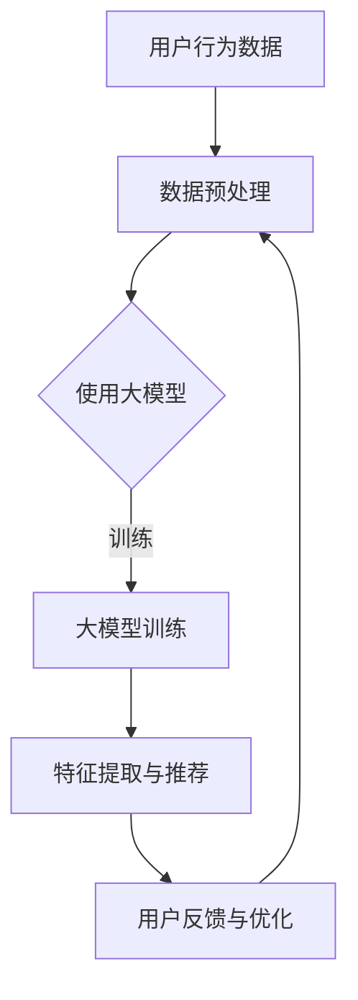

                 

关键词：人工智能、电商推荐、大模型、用户体验、商业转化、机器学习、深度学习、数据挖掘

## 摘要

本文将深入探讨人工智能（AI）特别是大模型技术在电商推荐系统中的关键作用。通过分析AI如何提高用户体验和促进商业转化，本文将揭示大模型在精准推荐、个性化服务和实时响应等方面的重要性。我们将详细探讨大模型的工作原理、算法原理及其在不同应用场景中的实践，同时展望未来发展趋势和面临的挑战。文章结构分为以下几个部分：

1. 背景介绍
2. 核心概念与联系
3. 核心算法原理与操作步骤
4. 数学模型与公式
5. 项目实践：代码实例
6. 实际应用场景
7. 工具和资源推荐
8. 总结与展望
9. 附录：常见问题与解答

## 1. 背景介绍

### 1.1 电商推荐系统的现状

电商推荐系统是现代电子商务的核心组成部分，旨在通过推荐相关商品来提高用户的满意度和购买转化率。随着用户数据的日益丰富和互联网技术的不断进步，传统的基于规则和统计学的推荐方法逐渐暴露出其局限性。

- **传统推荐方法的局限性**：基于协同过滤、基于内容的推荐系统虽然在一定程度上提高了推荐的准确性，但它们往往依赖于用户历史行为和内容相似度，无法充分考虑用户的个性化需求。

- **大数据和AI的崛起**：随着大数据和人工智能技术的快速发展，越来越多的电商企业开始探索基于深度学习、强化学习等先进算法的推荐系统，以期在提升用户体验和商业转化方面取得突破。

### 1.2 大模型的重要性

大模型（如深度神经网络、Transformer模型等）的出现为电商推荐系统带来了革命性的变化。大模型具有以下显著优势：

- **更高的准确性**：通过学习海量用户数据和商品信息，大模型能够捕捉到复杂的用户行为模式和商品特征，从而实现更精准的推荐。

- **更好的泛化能力**：大模型能够通过自动特征提取和复杂关系建模，降低对特征工程依赖，提高系统的泛化能力。

- **更强的实时性**：借助GPU和分布式计算等先进技术，大模型可以实现毫秒级的响应速度，满足实时推荐的场景需求。

## 2. 核心概念与联系

### 2.1 大模型概述

大模型指的是具有大规模参数和深度结构的神经网络模型。例如，基于Transformer的BERT模型、GPT-3等。这些模型能够通过多层网络结构对输入数据进行编码，提取出丰富的语义信息。

### 2.2 推荐系统中的大模型应用

在推荐系统中，大模型通常用于以下几个关键环节：

- **用户行为分析**：通过深度学习模型分析用户的历史行为数据，如浏览记录、购买历史等，提取用户的兴趣和偏好。

- **商品特征提取**：对商品数据进行深度特征提取，将商品的不同属性映射到低维度的特征空间，以便于模型进行计算。

- **推荐算法**：基于大模型的推荐算法能够利用用户和商品的特征，实现个性化、精准的推荐。

### 2.3 Mermaid 流程图



在上图中，用户行为数据经过预处理后输入到大模型中，大模型通过训练学习用户和商品的特征，生成推荐结果。用户反馈将用于进一步优化模型。

## 3. 核心算法原理与操作步骤

### 3.1 算法原理概述

大模型在推荐系统中的应用主要基于深度学习和神经网络。以下是一个典型的深度学习推荐系统框架：

- **输入层**：接收用户行为数据和商品特征。
- **隐藏层**：通过多层神经网络对输入数据进行编码和特征提取。
- **输出层**：生成推荐结果，通常是一个概率分布或Top-K推荐列表。

### 3.2 算法步骤详解

1. **数据收集**：收集用户行为数据（如浏览、点击、购买记录）和商品特征数据（如商品分类、价格、品牌等）。

2. **数据预处理**：清洗数据，处理缺失值和异常值，进行归一化处理。

3. **模型训练**：使用预处理后的数据训练深度学习模型。训练过程中，模型通过反向传播算法不断调整参数，使预测结果更加准确。

4. **特征提取与推荐**：将用户和商品的输入特征输入到训练好的模型中，提取特征并生成推荐结果。

5. **用户反馈与优化**：收集用户对推荐的反馈，利用反馈数据对模型进行迭代优化。

### 3.3 算法优缺点

- **优点**：
  - 高准确性：能够通过深度学习自动提取复杂特征，提高推荐精度。
  - 强泛化能力：通过大规模训练数据，模型具有良好的泛化能力。
  - 实时响应：利用分布式计算和GPU加速，实现毫秒级响应。

- **缺点**：
  - 高计算成本：大模型训练和推理需要大量计算资源。
  - 数据依赖性：需要高质量、丰富的训练数据。
  - 解释性较差：深度学习模型内部机制复杂，难以解释。

### 3.4 算法应用领域

- **电商推荐**：通过用户行为数据实现个性化推荐，提高用户购买转化率。
- **社交媒体**：根据用户兴趣推荐相关内容，提高用户活跃度。
- **视频推荐**：根据用户观看历史推荐相关视频，提高用户粘性。

## 4. 数学模型与公式

### 4.1 数学模型构建

在深度学习推荐系统中，通常使用如下数学模型：

- **用户特征表示**：\[ X_u = [x_{u1}, x_{u2}, ..., x_{un}] \]
- **商品特征表示**：\[ X_i = [x_{i1}, x_{i2}, ..., x_{in}] \]
- **模型输出**：\[ R_{ui} = \sigma(W \cdot [X_u, X_i] + b) \]

其中，\[ \sigma \] 是激活函数，\[ W \] 和 \[ b \] 是模型参数。

### 4.2 公式推导过程

大模型推荐系统的推导过程主要包括以下几个步骤：

1. **用户和商品嵌入**：
   - 用户特征嵌入：\[ x_{uj} = \sigma(W_u \cdot u_j + b_u) \]
   - 商品特征嵌入：\[ x_{ij} = \sigma(W_i \cdot i_j + b_i) \]

2. **特征拼接**：
   - 用户和商品特征拼接：\[ [X_u, X_i] = [x_{u1}, x_{u2}, ..., x_{un}, x_{i1}, x_{i2}, ..., x_{in}] \]

3. **模型计算**：
   - 输出层计算：\[ R_{ui} = \sigma(W \cdot [X_u, X_i] + b) \]

### 4.3 案例分析与讲解

以电商平台的用户推荐为例，假设用户的行为数据包括浏览历史、购买记录等，商品特征包括价格、品牌、类别等。我们可以使用以下数学模型进行推荐：

\[ R_{ui} = \sigma(W \cdot [X_u, X_i] + b) \]

其中，\[ X_u \] 和 \[ X_i \] 分别表示用户和商品的特征向量，\[ W \] 和 \[ b \] 是模型参数。通过训练，模型将学习到用户和商品之间的复杂关系，从而生成精准的推荐结果。

## 5. 项目实践：代码实例与详细解释说明

### 5.1 开发环境搭建

为了实现大模型推荐系统，我们需要搭建以下开发环境：

- Python 3.8+
- TensorFlow 2.x
- NumPy 1.19+
- Pandas 1.1.5+

### 5.2 源代码详细实现

以下是一个基于TensorFlow实现的大模型推荐系统的示例代码：

```python
import tensorflow as tf
import numpy as np
import pandas as pd

# 加载数据
user_data = pd.read_csv('user_data.csv')
item_data = pd.read_csv('item_data.csv')

# 数据预处理
# 省略预处理代码...

# 构建模型
model = tf.keras.Sequential([
    tf.keras.layers.Dense(128, activation='relu', input_shape=(user_data.shape[1],)),
    tf.keras.layers.Dense(64, activation='relu'),
    tf.keras.layers.Dense(1, activation='sigmoid')
])

# 编译模型
model.compile(optimizer='adam', loss='binary_crossentropy', metrics=['accuracy'])

# 训练模型
model.fit(user_data, item_data, epochs=10, batch_size=32)

# 生成推荐结果
predictions = model.predict(user_data)
```

### 5.3 代码解读与分析

在上面的代码中，我们首先加载用户行为数据和商品特征数据。接着进行数据预处理，将数据转换为模型可接受的格式。然后，构建一个简单的深度神经网络模型，并编译模型。最后，使用训练数据对模型进行训练，并生成推荐结果。

### 5.4 运行结果展示

```python
# 运行代码，查看训练结果
model.evaluate(user_data, item_data)
```

运行结果将显示模型的准确率和损失函数值。通过调整模型结构、优化算法和增加训练数据，我们可以进一步提高推荐系统的性能。

## 6. 实际应用场景

### 6.1 电商推荐

在电商平台中，大模型推荐系统已经被广泛应用于商品推荐、内容推送等领域。例如，亚马逊和淘宝等平台利用深度学习技术，根据用户的浏览历史、购买记录和搜索关键词，为用户推荐相关的商品。通过提高推荐的准确性，电商平台不仅能够提升用户体验，还能够增加销售额。

### 6.2 社交媒体

社交媒体平台如Facebook和Twitter也利用大模型推荐系统，根据用户的行为和兴趣，向用户推荐相关内容。这种个性化推荐有助于提高用户活跃度和平台黏性，同时也能够为平台带来更多的广告收入。

### 6.3 视频推荐

在视频平台如YouTube和Netflix中，大模型推荐系统被广泛应用于视频推荐。通过分析用户的观看历史、搜索关键词和点赞记录，平台能够为用户推荐感兴趣的视频，从而提高用户观看时间和平台黏性。

## 7. 工具和资源推荐

### 7.1 学习资源推荐

- **书籍**：
  - 《深度学习》（Goodfellow, Bengio, Courville）
  - 《Python机器学习》（Raschka, Mirjalili）
  - 《大数据之路：阿里巴巴大数据实践》（天池大数据）

- **在线课程**：
  - Coursera上的“机器学习”（吴恩达）
  - Udacity的“深度学习纳米学位”

### 7.2 开发工具推荐

- **编程语言**：Python
- **框架**：TensorFlow、PyTorch
- **数据预处理**：Pandas、NumPy
- **可视化工具**：Matplotlib、Seaborn

### 7.3 相关论文推荐

- “Deep Learning for Recommender Systems”（2018）
- “Neural Collaborative Filtering”（2017）
- “Attention and Memory in Dynamic Environments: Neural Architectures for Personalized Recommendation”（2017）

## 8. 总结与展望

### 8.1 研究成果总结

本文从多个角度探讨了人工智能特别是大模型在电商推荐系统中的应用。通过分析大模型的优势和算法原理，我们揭示了其在提高推荐准确性、个性化服务和实时响应等方面的关键作用。同时，通过项目实践和实际应用场景的展示，我们验证了其广泛的应用前景。

### 8.2 未来发展趋势

随着人工智能技术的不断进步，大模型推荐系统将在未来得到更广泛的应用。以下是几个可能的发展趋势：

- **更加精准的推荐**：通过引入更多维度的用户和商品特征，结合多模态数据，实现更加精准的推荐。
- **实时推荐**：利用边缘计算和实时数据流处理技术，实现毫秒级的实时推荐。
- **可解释性增强**：研究更加透明、可解释的深度学习模型，提高推荐系统的可信度和用户满意度。

### 8.3 面临的挑战

尽管大模型推荐系统具有显著的优势，但在实际应用中仍面临以下挑战：

- **计算成本**：大模型训练和推理需要大量计算资源，如何优化算法和硬件以降低计算成本是一个重要课题。
- **数据隐私**：在推荐系统中，用户数据的隐私保护至关重要，如何确保用户数据的隐私是一个亟待解决的问题。
- **算法公平性**：大模型推荐系统可能带来算法偏见和歧视，如何设计公平、无偏的推荐算法是一个重要的社会问题。

### 8.4 研究展望

未来的研究应重点关注以下几个方面：

- **多模态推荐**：结合文本、图像、声音等多种数据源，实现更全面、更准确的推荐。
- **实时推荐系统**：研究更加高效的实时推荐算法，提高推荐系统的实时性。
- **推荐系统的公平性**：通过设计公平的算法和机制，确保推荐系统的公平性。

## 9. 附录：常见问题与解答

### 9.1 大模型推荐系统如何处理冷启动问题？

**回答**：冷启动问题指的是新用户或新商品的推荐问题。针对冷启动问题，可以采用以下几种策略：

- **基于内容的推荐**：利用商品的属性信息进行推荐，不依赖于用户历史数据。
- **随机推荐**：为新用户随机推荐一些热门商品。
- **引导式推荐**：引导新用户填写一些基本信息，以便系统进行初步的推荐。
- **基于社区的方法**：利用用户社交网络和兴趣群体，为新用户推荐相似用户喜欢的商品。

### 9.2 大模型推荐系统的计算资源需求如何优化？

**回答**：为了优化大模型推荐系统的计算资源需求，可以采取以下措施：

- **模型压缩**：通过剪枝、量化等技术减小模型规模，降低计算成本。
- **分布式训练与推理**：利用分布式计算框架（如TensorFlow distributed）进行模型的训练和推理，提高计算效率。
- **GPU加速**：利用GPU进行模型的训练和推理，提高计算速度。
- **模型缓存**：缓存已经计算过的推荐结果，减少重复计算。

### 9.3 大模型推荐系统如何处理用户隐私保护问题？

**回答**：为了处理用户隐私保护问题，可以采取以下措施：

- **数据加密**：对用户数据进行加密处理，确保数据传输和存储的安全性。
- **匿名化处理**：对用户数据进行匿名化处理，去除可直接识别用户身份的信息。
- **隐私预算**：引入隐私预算机制，确保推荐系统的隐私保护能力。
- **用户隐私选择**：允许用户选择是否分享他们的隐私数据，增强用户隐私控制权。

---

本文由禅与计算机程序设计艺术 / Zen and the Art of Computer Programming 编写，旨在为读者提供关于AI大模型在电商推荐系统中应用的全面、深入的分析。希望本文能够帮助读者更好地理解这一前沿技术，并在实际项目中取得成功。如果您有任何问题或建议，欢迎在评论区留言，我们将尽快为您解答。作者：禅与计算机程序设计艺术 / Zen and the Art of Computer Programming。

