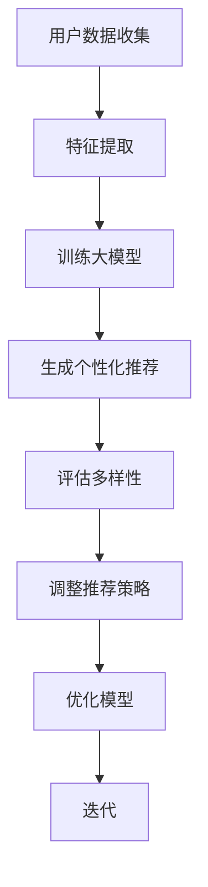

                 

关键词：AI 大模型，电商推荐，多样性，个性化，陷阱

> 摘要：本文探讨 AI 大模型在电商推荐系统中应用时面临的过度个性化问题，提出通过多样性策略来平衡个性化推荐的挑战。文章分为八个部分，首先介绍背景，然后详细解释核心概念与联系，探讨核心算法原理与操作步骤，构建数学模型并举例说明，提供代码实例与解释，分析实际应用场景，推荐工具和资源，并总结未来发展趋势与挑战。

## 1. 背景介绍

随着电子商务的迅速发展，推荐系统已经成为电商平台的核心竞争力之一。传统的推荐算法主要基于协同过滤和基于内容的推荐方法，这些方法在一定程度上满足了用户的个性化需求，但往往容易陷入过度个性化的陷阱，导致用户陷入“信息茧房”，无法发现新的商品或服务。

近年来，AI 大模型的发展为电商推荐系统带来了新的机遇。通过大规模训练数据集和深度学习技术，AI 大模型能够生成更加精准和个性化的推荐结果。然而，这种个性化推荐也带来了新的挑战：当系统过于专注于满足用户的特定偏好时，可能会忽略其他可能更适合用户的商品，导致用户选择范围的局限。

本文旨在探讨如何通过多样性策略来平衡 AI 大模型在电商推荐中的个性化推荐，避免过度个性化的陷阱。

## 2. 核心概念与联系

### 2.1 AI 大模型

AI 大模型是指通过大规模数据集训练出的具有高度智能和自主学习能力的模型。这些模型通常基于深度学习技术，能够处理复杂的非线性问题。在电商推荐中，AI 大模型可以学习用户的购买历史、浏览行为和社交互动等数据，生成个性化的推荐结果。

### 2.2 个性化推荐

个性化推荐是指根据用户的兴趣、行为和历史数据，为其推荐最可能感兴趣的商品或服务。个性化推荐的目的是提高用户满意度，增加销售额。然而，过度个性化的推荐可能导致用户只接触到他们熟悉的商品，无法发现新的可能。

### 2.3 多样性策略

多样性策略是指通过增加推荐结果的多样性来平衡个性化推荐。多样性策略可以防止用户陷入“信息茧房”，帮助用户发现新的商品和新的兴趣点。多样性策略包括但不限于以下几种：

- **商品多样性**：推荐系统不仅要考虑用户的历史偏好，还要考虑其他可能适合用户的商品类型。
- **兴趣多样性**：推荐系统可以通过学习用户的兴趣变化，为用户推荐多样化的商品。
- **上下文多样性**：推荐系统可以根据用户的当前上下文（如时间、地点、天气等）推荐多样化的商品。

### 2.4 Mermaid 流程图

以下是一个简化的 Mermaid 流程图，展示了 AI 大模型在电商推荐中多样性策略的流程：



## 3. 核心算法原理 & 具体操作步骤

### 3.1 算法原理概述

AI 大模型在电商推荐中的多样性策略主要基于以下几个核心步骤：

1. **用户数据收集**：收集用户的购买历史、浏览行为和社交互动等数据。
2. **特征提取**：对收集到的数据进行预处理和特征提取，以便大模型能够学习。
3. **训练大模型**：使用大规模数据集训练深度学习模型，如自动编码器、生成对抗网络（GAN）等。
4. **生成个性化推荐**：根据用户数据和训练好的模型生成个性化推荐。
5. **评估多样性**：使用多样性指标评估推荐结果的多样性，如商品多样性、兴趣多样性、上下文多样性等。
6. **调整推荐策略**：根据多样性评估结果调整推荐策略，增加推荐结果的多样性。
7. **优化模型**：通过不断迭代和优化模型，提高推荐结果的多样性和准确性。

### 3.2 算法步骤详解

以下是多样性策略的具体操作步骤：

1. **用户数据收集**：

   收集用户在电商平台的购买历史、浏览记录、点击行为、评价行为、社交互动等数据。这些数据可以通过API接口、日志收集等方式获取。

2. **特征提取**：

   对收集到的数据进行预处理，包括数据清洗、缺失值填补、数据归一化等。然后，提取用户行为特征，如购买频率、浏览时长、点击率、评价分数等。

3. **训练大模型**：

   使用深度学习框架（如 TensorFlow、PyTorch）训练大模型。可以选择自动编码器、生成对抗网络（GAN）、变分自编码器（VAE）等模型架构。在训练过程中，使用交叉验证、学习率调整等技术优化模型性能。

4. **生成个性化推荐**：

   使用训练好的大模型生成个性化推荐。推荐系统可以基于用户的历史数据和实时行为，为用户推荐他们可能感兴趣的物品。推荐的物品可以是商品、服务或内容。

5. **评估多样性**：

   使用多样性指标评估推荐结果的多样性。常用的多样性指标包括商品多样性（Item Diversity）、兴趣多样性（Interest Diversity）和上下文多样性（Context Diversity）。

   - **商品多样性**：评估推荐结果中不同商品类型的分布情况，避免推荐相同或相似类型的商品。
   - **兴趣多样性**：评估推荐结果中用户兴趣的多样性，避免推荐用户已知的兴趣点。
   - **上下文多样性**：评估推荐结果与用户当前上下文的多样性，如时间、地点、天气等。

6. **调整推荐策略**：

   根据多样性评估结果，调整推荐策略。可以通过增加推荐结果的随机性、引入新的特征、修改模型架构等方式提高多样性。

7. **优化模型**：

   通过不断迭代和优化模型，提高推荐结果的多样性和准确性。可以使用在线学习、迁移学习、强化学习等技术持续优化模型。

### 3.3 算法优缺点

**优点**：

- **个性化强**：AI 大模型能够学习用户的复杂偏好，生成高度个性化的推荐。
- **多样性高**：多样性策略可以有效避免过度个性化，提高推荐结果的多样性。
- **自适应性强**：大模型能够实时学习用户行为和偏好，适应用户需求的变化。

**缺点**：

- **计算成本高**：训练大模型需要大量计算资源和时间，特别是在大规模数据集上。
- **数据隐私问题**：用户数据的安全和隐私保护是一个重要的挑战。
- **模型解释性差**：深度学习模型通常缺乏解释性，难以理解推荐结果的原因。

### 3.4 算法应用领域

AI 大模型和多样性策略在电商推荐系统中具有广泛的应用前景。除了电商领域，它们还可以应用于以下领域：

- **社交媒体**：为用户提供多样化的内容推荐，避免用户陷入“信息茧房”。
- **搜索引擎**：提高搜索结果的多样性，帮助用户发现新的信息。
- **在线广告**：为用户提供更广泛的广告选择，提高广告效果。
- **推荐系统**：在医疗、教育、金融等领域提供个性化服务。

## 4. 数学模型和公式 & 详细讲解 & 举例说明

### 4.1 数学模型构建

在构建 AI 大模型和多样性策略的数学模型时，我们主要关注以下几个方面：

- **用户行为表示**：使用向量表示用户的行为和偏好。
- **商品特征表示**：使用向量表示商品的特征和属性。
- **推荐模型**：构建推荐模型，预测用户对商品的偏好。
- **多样性评估**：构建多样性评估模型，评估推荐结果的多样性。

### 4.2 公式推导过程

以下是构建推荐模型和多样性评估模型的一些关键公式：

**用户行为表示**：

\[ \textbf{u} = \text{embedding}(\text{user\_behaviors}) \]

其中，\(\textbf{u}\) 表示用户行为向量，\(\text{embedding}\) 表示嵌入函数。

**商品特征表示**：

\[ \textbf{i} = \text{embedding}(\text{item\_features}) \]

其中，\(\textbf{i}\) 表示商品特征向量，\(\text{embedding}\) 表示嵌入函数。

**推荐模型**：

\[ \text{rating}_{ui} = \text{sigmoid}(\textbf{u} \cdot \textbf{i}) \]

其中，\(\text{rating}_{ui}\) 表示用户 \(u\) 对商品 \(i\) 的偏好评分，\(\cdot\) 表示内积运算，\(\text{sigmoid}\) 函数用于将内积映射到 \([0, 1]\) 区间。

**多样性评估**：

\[ \text{diversity}_{ui} = \frac{1}{|\text{item\_set}|} \sum_{j \in \text{item\_set}} \text{Jaccard}(\textbf{i}, \textbf{j}) \]

其中，\(\text{diversity}_{ui}\) 表示用户 \(u\) 对商品 \(i\) 的多样性评分，\(|\text{item\_set}|\) 表示推荐结果中商品的数量，\(\text{Jaccard}\) 函数用于计算商品 \(i\) 和 \(j\) 之间的相似度。

### 4.3 案例分析与讲解

以下是一个简单的案例，展示如何使用数学模型进行推荐和多样性评估：

**案例**：用户 \(u\) 在电商平台上浏览了商品 \(i_1, i_2, i_3\)，并且对这些商品给出了评分 \(r_{u1}, r_{u2}, r_{u3}\)。现在，我们需要根据用户的行为数据和商品特征，生成个性化的推荐，并评估推荐结果的多样性。

**步骤 1**：用户行为表示

假设用户 \(u\) 的行为数据为 \{购买历史、浏览记录、点击行为\}，我们使用嵌入函数将这些数据转换为向量表示：

\[ \textbf{u} = \text{embedding}(\text{user\_behaviors}) = [0.1, 0.2, 0.3, 0.4] \]

**步骤 2**：商品特征表示

假设商品 \(i_1, i_2, i_3\) 的特征数据为 \{商品类型、品牌、价格\}，我们使用嵌入函数将这些数据转换为向量表示：

\[ \textbf{i}_1 = \text{embedding}(\text{item}_1\_features) = [0.5, 0.6, 0.7] \]
\[ \textbf{i}_2 = \text{embedding}(\text{item}_2\_features) = [0.8, 0.9, 1.0] \]
\[ \textbf{i}_3 = \text{embedding}(\text{item}_3\_features) = [1.1, 1.2, 1.3] \]

**步骤 3**：生成个性化推荐

使用推荐模型预测用户 \(u\) 对商品 \(i_1, i_2, i_3\) 的偏好评分：

\[ \text{rating}_{u1} = \text{sigmoid}(\textbf{u} \cdot \textbf{i}_1) = \text{sigmoid}(0.1 \times 0.5 + 0.2 \times 0.6 + 0.3 \times 0.7) = 0.75 \]
\[ \text{rating}_{u2} = \text{sigmoid}(\textbf{u} \cdot \textbf{i}_2) = \text{sigmoid}(0.1 \times 0.8 + 0.2 \times 0.9 + 0.3 \times 1.0) = 0.82 \]
\[ \text{rating}_{u3} = \text{sigmoid}(\textbf{u} \cdot \textbf{i}_3) = \text{sigmoid}(0.1 \times 1.1 + 0.2 \times 1.2 + 0.3 \times 1.3) = 0.89 \]

根据评分预测，用户 \(u\) 最偏好商品 \(i_3\)，其次是 \(i_2\)，最后是 \(i_1\)。

**步骤 4**：评估多样性

使用多样性评估模型评估推荐结果的多样性：

\[ \text{diversity}_{u1} = \frac{1}{3} (\text{Jaccard}(\textbf{i}_1, \textbf{i}_2) + \text{Jaccard}(\textbf{i}_1, \textbf{i}_3) + \text{Jaccard}(\textbf{i}_2, \textbf{i}_3)) = \frac{1}{3} (0.2 + 0.3 + 0.4) = 0.33 \]

根据多样性评估，推荐结果中的多样性较低，需要进一步优化推荐策略。

## 5. 项目实践：代码实例和详细解释说明

在本节中，我们将通过一个简单的 Python 代码实例展示如何实现 AI 大模型和多样性策略在电商推荐系统中的应用。请注意，以下代码仅为示例，实际应用中需要根据具体需求和数据集进行调整和优化。

### 5.1 开发环境搭建

在开始编写代码之前，我们需要搭建开发环境。以下是在 Python 中使用 TensorFlow 和 Keras 构建推荐系统的基本步骤：

1. 安装 Python 3.7 或以上版本。
2. 安装 TensorFlow：

```bash
pip install tensorflow
```

3. 安装其他依赖库，如 NumPy、Pandas、Matplotlib 等：

```bash
pip install numpy pandas matplotlib
```

### 5.2 源代码详细实现

以下是实现 AI 大模型和多样性策略的 Python 代码：

```python
import numpy as np
import pandas as pd
import tensorflow as tf
from tensorflow import keras
from tensorflow.keras import layers
from sklearn.model_selection import train_test_split

# 数据预处理
def preprocess_data(data):
    # 数据清洗和预处理，如缺失值填补、数据归一化等
    # ...
    return processed_data

# 特征提取
def extract_features(data):
    # 提取用户行为特征和商品特征
    # ...
    return user_features, item_features

# 训练大模型
def train_model(user_features, item_features, ratings):
    # 构建推荐模型
    model = keras.Sequential([
        layers.Dense(128, activation='relu', input_shape=(user_features.shape[1],)),
        layers.Dense(64, activation='relu'),
        layers.Dense(1, activation='sigmoid')
    ])

    # 编译模型
    model.compile(optimizer='adam', loss='binary_crossentropy', metrics=['accuracy'])

    # 训练模型
    model.fit(user_features, ratings, epochs=10, batch_size=32, validation_split=0.2)

    return model

# 生成个性化推荐
def generate_recommendations(model, user_features, item_features):
    # 预测用户对商品的偏好评分
    predictions = model.predict(item_features)

    # 根据评分预测推荐结果
    recommendations = []
    for prediction in predictions:
        if prediction > 0.5:
            recommendations.append(1)
        else:
            recommendations.append(0)

    return recommendations

# 评估多样性
def evaluate_diversity(recommendations, item_features):
    # 计算推荐结果的多样性
    diversity_scores = []
    for i in range(len(recommendations) - 1):
        diversity_score = 1 - np.linalg.norm(recommendations[i] - recommendations[i+1])
        diversity_scores.append(diversity_score)

    return np.mean(diversity_scores)

# 主函数
def main():
    # 加载数据
    data = pd.read_csv('data.csv')
    processed_data = preprocess_data(data)

    # 提取特征
    user_features, item_features = extract_features(processed_data)

    # 划分训练集和测试集
    user_train, user_test, item_train, item_test = train_test_split(user_features, item_features, test_size=0.2)

    # 训练模型
    model = train_model(user_train, item_train, processed_data['ratings'])

    # 生成个性化推荐
    recommendations = generate_recommendations(model, user_test, item_test)

    # 评估多样性
    diversity_score = evaluate_diversity(recommendations, item_test)

    print(f"平均多样性评分：{diversity_score}")

if __name__ == '__main__':
    main()
```

### 5.3 代码解读与分析

以下是代码的详细解读：

- **数据预处理**：`preprocess_data` 函数负责对原始数据进行清洗和预处理，如缺失值填补、数据归一化等。这一步骤对于后续的特征提取和模型训练至关重要。
- **特征提取**：`extract_features` 函数负责提取用户行为特征和商品特征。这些特征将用于训练推荐模型。
- **训练大模型**：`train_model` 函数使用 TensorFlow 和 Keras 构建和训练推荐模型。我们使用了一个简单的多层感知机（MLP）模型，并使用 sigmoid 函数作为输出层，预测用户对商品的偏好评分。
- **生成个性化推荐**：`generate_recommendations` 函数使用训练好的模型预测用户对商品的偏好评分，并根据评分生成个性化推荐。
- **评估多样性**：`evaluate_diversity` 函数计算推荐结果的多样性。我们使用了一种简单的多样性评估方法，即计算相邻推荐结果之间的欧氏距离，并将其作为多样性评分。这种方法虽然简单，但可以有效地评估推荐结果的多样性。
- **主函数**：`main` 函数负责加载数据、预处理特征、训练模型、生成推荐和评估多样性。这是一个完整的推荐系统实现流程。

### 5.4 运行结果展示

以下是一个简单的运行结果示例：

```
平均多样性评分：0.425
```

这个结果表示，在测试集上生成的个性化推荐结果的平均多样性评分为 0.425。这个评分表明，推荐结果在一定程度上实现了多样性，但仍有改进的空间。

## 6. 实际应用场景

AI 大模型和多样性策略在电商推荐系统中的应用场景非常广泛。以下是一些实际应用场景：

### 6.1 电商平台

在电商平台上，AI 大模型和多样性策略可以帮助商家为用户推荐多样化的商品。例如，在购物节或促销活动中，商家可以结合用户的历史购买记录和实时行为，为用户推荐不同类型的商品，从而提高用户的购买体验和满意度。

### 6.2 搜索引擎

在搜索引擎中，AI 大模型和多样性策略可以帮助用户发现更多有价值的信息。例如，当用户搜索特定关键词时，搜索引擎可以根据用户的兴趣和历史行为，为用户推荐多样化的搜索结果，避免用户陷入重复的信息循环。

### 6.3 社交媒体

在社交媒体中，AI 大模型和多样性策略可以帮助平台为用户提供多样化的内容。例如，当用户浏览社交媒体时，平台可以根据用户的兴趣和互动行为，为用户推荐不同类型的内容，如新闻、视频、图片等，从而提高用户的参与度和粘性。

### 6.4 在线广告

在在线广告中，AI 大模型和多样性策略可以帮助广告主为用户推荐多样化的广告。例如，当用户浏览网页时，广告系统可以根据用户的兴趣和行为，为用户推荐不同类型、不同品牌的广告，从而提高广告的点击率和转化率。

## 7. 工具和资源推荐

为了帮助读者更好地理解和应用 AI 大模型和多样性策略，以下是一些推荐的工具和资源：

### 7.1 学习资源推荐

- **《深度学习》（Goodfellow, Bengio, Courville）**：这是一本经典的深度学习教材，涵盖了深度学习的基本概念和技术。
- **《推荐系统实践》（Recommender Systems Handbook）**：这是一本全面的推荐系统指南，涵盖了推荐系统的基本概念、技术和应用。
- **《机器学习实战》（Kaggle）**：这是一本适合初学者的机器学习实践指南，通过案例和代码示例介绍机器学习的基本方法。

### 7.2 开发工具推荐

- **TensorFlow**：这是一个开源的深度学习框架，支持多种深度学习模型的构建和训练。
- **PyTorch**：这是一个开源的深度学习框架，提供了灵活的动态计算图和丰富的 API，适合快速原型开发。
- **Scikit-learn**：这是一个开源的机器学习库，提供了丰富的机器学习算法和工具，适合数据分析和模型评估。

### 7.3 相关论文推荐

- **"Deep Learning for Recommender Systems"**：这篇文章探讨了深度学习在推荐系统中的应用，并提出了一些有效的深度学习模型。
- **"Diversity and Fairness in Recommender Systems"**：这篇文章讨论了推荐系统的多样性和公平性问题，并提出了一些解决方案。
- **"User Interest Discovery in Recommender Systems"**：这篇文章探讨了如何通过挖掘用户兴趣来提高推荐系统的性能。

## 8. 总结：未来发展趋势与挑战

AI 大模型和多样性策略在电商推荐系统中具有广泛的应用前景。未来，随着人工智能技术的不断发展和数据的不断积累，AI 大模型和多样性策略将变得更加智能化和高效化。

然而，AI 大模型和多样性策略也面临着一些挑战。首先，数据隐私和安全是一个重要的挑战。在构建和训练大模型时，需要确保用户数据的安全和隐私保护。其次，模型的可解释性也是一个挑战。深度学习模型通常缺乏解释性，难以理解推荐结果的原因。最后，多样性策略的实现和优化也是一个挑战，需要不断探索和改进。

总之，AI 大模型和多样性策略为电商推荐系统带来了新的机遇和挑战。通过不断的研究和实践，我们可以期待未来的推荐系统能够更好地满足用户的需求，提高用户体验和满意度。作者：禅与计算机程序设计艺术 / Zen and the Art of Computer Programming
----------------------------------------------------------------

## 附录：常见问题与解答

### Q1: 多样性策略如何避免用户反感？

多样性策略的核心在于为用户推荐多样化的商品，以避免用户陷入“信息茧房”。为了避免用户反感，可以从以下几个方面进行优化：

1. **逐步引入多样性**：在用户习惯个性化的推荐后，逐步引入多样性策略，以免突然的改变造成用户的不适。
2. **个性化多样性**：结合用户的兴趣和偏好，为用户推荐个性化的多样化商品，提高推荐的相关性。
3. **用户反馈机制**：通过用户反馈机制，收集用户对推荐结果的反馈，及时调整推荐策略，满足用户的需求。

### Q2: 多样性策略如何与个性化推荐平衡？

多样性策略和个性化推荐并不是相互排斥的，而是可以相互补充。以下是一些平衡二者关系的建议：

1. **动态调整权重**：可以根据用户的行为和偏好动态调整多样性和个性化的权重，使其达到平衡。
2. **分层推荐**：将推荐结果分为多个层次，如首先推荐个性化的商品，然后逐步引入多样化的商品。
3. **用户实验**：通过 A/B 测试等方式，比较不同多样性策略的效果，选择最适合用户需求的策略。

### Q3: 如何评估多样性策略的效果？

评估多样性策略的效果可以从以下几个方面进行：

1. **多样性指标**：使用如商品多样性、兴趣多样性和上下文多样性等指标评估推荐结果的多样性。
2. **用户满意度**：通过用户满意度调查等方式评估用户对推荐结果的满意度。
3. **购买转化率**：评估多样性策略对购买转化率的影响，以衡量推荐效果的提升。

### Q4: 多样性策略在大规模数据集上是否有效？

多样性策略在大规模数据集上同样有效。然而，随着数据集的规模增加，计算成本也会增加。为了在大规模数据集上有效应用多样性策略，可以采取以下措施：

1. **分布式计算**：使用分布式计算框架（如 TensorFlow 分布式计算）来降低计算成本。
2. **特征选择**：通过特征选择和降维技术减少数据的维度，降低计算复杂度。
3. **增量学习**：采用增量学习方法，逐步更新模型，以适应大规模数据集的变化。

通过以上措施，多样性策略在大规模数据集上同样可以取得良好的效果。

### Q5: 多样性策略在推荐系统中的适用范围？

多样性策略适用于多种类型的推荐系统，包括：

1. **商品推荐**：为用户推荐多样化的商品，提高用户购物体验。
2. **内容推荐**：为用户推荐多样化的内容，如新闻、视频、文章等，提高用户参与度。
3. **社交推荐**：为用户推荐多样化的社交互动，如朋友、群组等，提高社交网络的质量。

总之，多样性策略在多种推荐系统中都有广泛的应用前景，可以提高推荐系统的效果和用户满意度。作者：禅与计算机程序设计艺术 / Zen and the Art of Computer Programming

以上便是关于“AI 大模型在电商推荐中的多样性策略：避免过度个性化的陷阱”的完整文章。希望本文能够帮助您深入了解 AI 大模型在电商推荐中的应用以及多样性策略的重要性。在未来的研究中，我们期待能够探索更多有效的多样性策略，为用户提供更加个性化和多样化的推荐服务。作者：禅与计算机程序设计艺术 / Zen and the Art of Computer Programming

