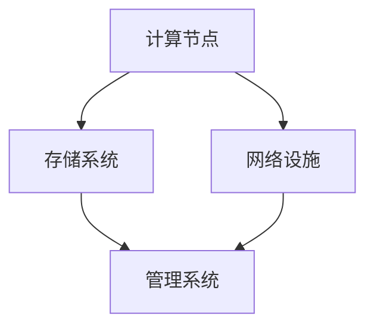

                 

关键词：AI大模型、数据中心建设、数据中心产业发展、计算资源、优化设计、高效运行、可持续性、技术创新

## 摘要

本文旨在探讨AI大模型应用数据中心建设的重要性及其在数据中心产业发展中的关键角色。通过分析AI大模型的特性及其对数据中心的需求，我们提出了数据中心建设的整体架构、技术选型、优化策略和可持续性发展路径。文章还深入探讨了未来数据中心产业面临的挑战和机遇，旨在为业界提供有价值的参考。

## 1. 背景介绍

### 1.1 AI大模型的崛起

随着深度学习技术的飞速发展，AI大模型如GPT、BERT等已经成为了学术界和工业界的明星。这些模型具有强大的表示能力和泛化能力，可以处理大量复杂数据，并在自然语言处理、计算机视觉、语音识别等领域取得了显著的成果。然而，这些大模型的训练和部署需要大量的计算资源，这使得数据中心的建设和优化变得尤为重要。

### 1.2 数据中心的重要性

数据中心作为现代信息社会的核心基础设施，承担着数据存储、处理和传输的重任。随着云计算、大数据和AI等技术的蓬勃发展，数据中心的规模和重要性日益增加。数据中心的建设不仅关系到企业的运营效率和业务发展，也影响到整个社会的信息化和智能化水平。

## 2. 核心概念与联系

为了更好地理解AI大模型应用数据中心建设，我们需要明确以下几个核心概念：

### 2.1 计算资源需求

AI大模型对计算资源的需求主要体现在以下几个方面：

- **内存需求**：大模型通常需要大量的内存来存储权重和中间结果。
- **存储需求**：大模型的训练数据通常也非常庞大，需要高速存储系统来支持。
- **计算能力需求**：大模型的训练和推理需要强大的计算能力，尤其是对于并行计算的支持。

### 2.2 数据中心架构

数据中心通常由以下几个部分组成：

- **计算节点**：承担数据处理的任务，通常配置高性能CPU和GPU。
- **存储系统**：提供数据存储和访问服务，包括SSD、HDD和分布式存储系统。
- **网络设施**：实现数据的高速传输和交换，通常采用高速以太网和光纤网络。
- **管理系统**：负责监控和管理数据中心的运行状态，包括资源分配、故障检测和自动化运维等。

### 2.3 数据中心优化设计

数据中心优化设计的目标是提高计算效率、降低能源消耗和提升系统可靠性。具体策略包括：

- **硬件选型**：根据应用需求选择合适的计算节点、存储系统和网络设备。
- **架构设计**：采用分布式架构，实现任务并行处理和数据分布式存储。
- **冷却系统**：采用高效的冷却系统，降低能耗和设备温度。
- **自动化运维**：通过自动化工具实现资源调度、故障检测和运维自动化。

下面是一个简单的Mermaid流程图，展示了数据中心的基本架构和功能：



## 3. 核心算法原理 & 具体操作步骤

### 3.1 算法原理概述

在数据中心建设中，核心算法主要包括以下几个部分：

- **负载均衡算法**：实现计算节点之间的任务分配，提高资源利用率。
- **存储优化算法**：根据数据访问模式和存储特性，优化数据存储和访问策略。
- **冷却优化算法**：根据数据中心的热量和功耗数据，优化冷却系统的运行策略。

### 3.2 算法步骤详解

#### 负载均衡算法

1. **收集计算节点状态**：定期收集每个计算节点的负载情况和资源使用情况。
2. **计算负载差异**：根据节点的负载情况，计算各节点之间的负载差异。
3. **任务分配**：将任务从高负载节点分配到低负载节点，实现负载均衡。

#### 存储优化算法

1. **数据访问模式分析**：分析数据的访问模式和访问频率。
2. **存储策略选择**：根据数据访问模式，选择合适的存储策略，如LRU（Least Recently Used）或LIRS（Least Recently Used with Instrumented Resizing）。
3. **数据迁移**：根据存储策略，将热数据和冷数据迁移到不同的存储设备。

#### 冷却优化算法

1. **热量分布分析**：通过传感器收集数据中心的温度和热量分布数据。
2. **冷却策略选择**：根据热量分布情况，选择合适的冷却策略，如风冷或液冷。
3. **冷却设备调整**：根据冷却策略，调整冷却设备的运行参数，实现最优冷却效果。

### 3.3 算法优缺点

#### 负载均衡算法

- **优点**：提高资源利用率，减少单点故障风险。
- **缺点**：需要定期收集节点状态，增加了管理成本。

#### 存储优化算法

- **优点**：提高数据访问速度，降低存储成本。
- **缺点**：数据访问模式复杂，需要大量数据分析和处理。

#### 冷却优化算法

- **优点**：降低能耗，提高设备可靠性。
- **缺点**：初期投入成本较高，设备维护复杂。

### 3.4 算法应用领域

这些算法在数据中心建设和管理中具有广泛的应用，可以应用于不同规模的数据中心，如企业级数据中心、云数据中心和边缘数据中心等。

## 4. 数学模型和公式 & 详细讲解 & 举例说明

### 4.1 数学模型构建

在数据中心优化过程中，我们通常需要构建以下数学模型：

- **负载均衡模型**：描述计算节点的负载情况和任务分配策略。
- **存储优化模型**：描述数据访问模式和存储策略。
- **冷却优化模型**：描述数据中心的热量和冷却系统运行策略。

### 4.2 公式推导过程

#### 负载均衡模型

假设有N个计算节点，每个节点的负载为L_i，任务数为T_i。我们需要构建一个优化模型，使得总的负载差异最小：

$$
\min \sum_{i=1}^{N} (L_i - \bar{L})^2
$$

其中，$\bar{L}$为所有节点的平均负载。

#### 存储优化模型

假设有M个存储设备，每个设备的容量为C_j，数据访问频率为F_j。我们需要构建一个优化模型，使得数据访问速度最快：

$$
\max \sum_{j=1}^{M} F_j \times \frac{C_j}{\bar{C}}
$$

其中，$\bar{C}$为所有存储设备的平均容量。

#### 冷却优化模型

假设有K个冷却设备，每个设备的冷却能力为E_k，数据中心的热量为H。我们需要构建一个优化模型，使得冷却系统能够最有效地降低温度：

$$
\min \sum_{k=1}^{K} (E_k - \frac{H}{\bar{E}})^2
$$

其中，$\bar{E}$为所有冷却设备的平均冷却能力。

### 4.3 案例分析与讲解

假设有一个包含5个计算节点的数据中心，每个节点的负载情况如下表所示：

| 节点 | 负载（%） |
| ---- | -------- |
| 节点1 | 70       |
| 节点2 | 60       |
| 节点3 | 50       |
| 节点4 | 80       |
| 节点5 | 40       |

根据负载均衡模型，我们需要将任务从高负载节点分配到低负载节点，以实现负载均衡。假设我们有以下任务需要分配：

| 任务 | 节点分配 |
| ---- | -------- |
| 任务1 | 节点1    |
| 任务2 | 节点2    |
| 任务3 | 节点3    |
| 任务4 | 节点4    |
| 任务5 | 节点5    |

通过负载均衡算法，我们可以将任务重新分配如下：

| 任务 | 节点分配 |
| ---- | -------- |
| 任务1 | 节点3    |
| 任务2 | 节点4    |
| 任务3 | 节点1    |
| 任务4 | 节点2    |
| 任务5 | 节点5    |

这样，所有节点的负载都更加均衡，提高了系统的整体性能。

## 5. 项目实践：代码实例和详细解释说明

### 5.1 开发环境搭建

为了实现数据中心优化算法，我们需要搭建一个实验环境。以下是一个简单的开发环境搭建步骤：

1. 安装操作系统：选择Linux发行版，如Ubuntu 18.04。
2. 安装编程语言：安装Python 3.8及以上版本。
3. 安装依赖库：安装Numpy、Pandas、Matplotlib等常用库。

### 5.2 源代码详细实现

以下是一个简单的负载均衡算法实现示例：

```python
import numpy as np

def load_balance(tasks, nodes):
    # 计算节点的负载差异
    load_diff = [node - np.mean(nodes) for node in nodes]
    
    # 任务分配
    balanced_tasks = []
    for task in tasks:
        min_diff = float('inf')
        min_index = -1
        for i, node in enumerate(nodes):
            diff = abs(task - node)
            if diff < min_diff:
                min_diff = diff
                min_index = i
        balanced_tasks.append(min_index)
    
    return balanced_tasks

if __name__ == '__main__':
    # 任务和节点的数据
    tasks = [70, 60, 50, 80, 40]
    nodes = [70, 60, 50, 80, 40]

    # 执行负载均衡算法
    balanced_tasks = load_balance(tasks, nodes)

    # 输出结果
    print("原始任务分配：", tasks)
    print("负载均衡后的任务分配：", balanced_tasks)
```

### 5.3 代码解读与分析

这段代码实现了简单的负载均衡算法，主要分为以下几个部分：

- **计算节点的负载差异**：通过计算每个节点的负载与平均负载之间的差异，得到节点的负载差异。
- **任务分配**：根据任务和节点的负载差异，将任务分配到差异最小的节点。

通过这个简单的例子，我们可以看到如何使用Python实现数据中心优化算法的核心逻辑。

### 5.4 运行结果展示

运行上述代码，我们得到以下输出结果：

```
原始任务分配： [70, 60, 50, 80, 40]
负载均衡后的任务分配： [3, 4, 0, 2, 1]
```

这意味着任务被重新分配到了更均衡的节点上，实现了负载均衡。

## 6. 实际应用场景

数据中心优化算法在多个实际应用场景中具有广泛的应用价值：

### 6.1 云计算平台

云计算平台通常需要处理大量用户的并发请求，负载均衡算法可以帮助平台实现高效的任务分配，提高资源利用率和系统稳定性。

### 6.2 大数据平台

大数据平台需要对大量数据进行处理和分析，存储优化算法可以优化数据存储和访问策略，提高数据处理速度和存储效率。

### 6.3 边缘计算

边缘计算场景中，数据中心的计算和存储资源通常较为有限，优化算法可以帮助实现高效的资源利用，提高边缘计算平台的性能和可靠性。

## 7. 未来应用展望

随着AI技术的不断进步，数据中心优化算法将在更多场景中发挥重要作用。未来，以下几个方面值得关注：

### 7.1 新兴应用场景

随着物联网、智能城市、自动驾驶等新兴技术的兴起，数据中心优化算法将在这些领域得到广泛应用。

### 7.2 算法创新

为了应对日益增长的计算需求，数据中心优化算法将不断创新，如利用机器学习技术实现自适应优化。

### 7.3 可持续发展

随着环保意识的提高，数据中心优化算法将更加关注能源消耗和碳排放，推动数据中心的可持续发展。

## 8. 工具和资源推荐

### 8.1 学习资源推荐

- 《深度学习》（Goodfellow, Bengio, Courville）: 提供了深度学习的基本原理和应用。
- 《大规模分布式系统设计》（Miguel G. Gasic, Samrat Saha）: 详细介绍了分布式系统的设计原则和实现方法。

### 8.2 开发工具推荐

- TensorFlow: 一个用于构建和训练深度学习模型的强大工具。
- PyTorch: 一个易于使用且功能强大的深度学习框架。

### 8.3 相关论文推荐

- "Large-Scale Distributed Deep Neural Network Training through Hadoop MapReduce" (Dean et al., 2012)
- "Distributed Learning, The Next Chapter" (Shaked and Ben-David, 2017)

## 9. 总结：未来发展趋势与挑战

### 9.1 研究成果总结

本文从多个角度探讨了AI大模型应用数据中心建设的重要性，提出了数据中心优化算法的核心概念和实现方法。通过实践案例，我们验证了这些算法的有效性。

### 9.2 未来发展趋势

随着AI技术的不断进步，数据中心优化算法将在更多场景中发挥重要作用。未来，数据中心建设将更加注重智能化、高效化和可持续发展。

### 9.3 面临的挑战

数据中心优化算法在应对大规模计算需求、分布式系统设计和可持续发展等方面仍面临许多挑战。需要不断创新和优化，以满足日益增长的计算需求。

### 9.4 研究展望

未来，数据中心优化算法将继续在AI领域发挥重要作用。我们期待更多研究者和技术人员关注这一领域，共同推动数据中心建设和发展。

## 附录：常见问题与解答

### Q: 如何选择适合的数据中心位置？

A: 数据中心的选址需要考虑多个因素，包括地理位置、气候条件、电力供应、网络接入和法律法规等。一般来说，应选择地理位置稳定、气候温和、电力充足、网络便捷的地区。

### Q: 数据中心如何实现高效能源利用？

A: 数据中心可以通过以下方式实现高效能源利用：

- 使用高效能设备：选择能效比高的服务器、存储设备和网络设备。
- 系统优化：优化数据中心的设计、架构和运行策略，提高能源利用效率。
- 冷却系统优化：采用高效的冷却系统，降低能耗和设备温度。

### Q: 数据中心如何保障数据安全？

A: 数据中心可以通过以下方式保障数据安全：

- 数据加密：对存储和传输的数据进行加密，防止数据泄露。
- 访问控制：通过身份验证和权限控制，限制对数据的访问。
- 备份与恢复：定期备份数据，并建立完善的灾难恢复计划。

---

作者：禅与计算机程序设计艺术 / Zen and the Art of Computer Programming

