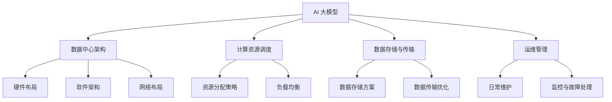

                 

关键词：AI 大模型，数据中心，产业发展，技术架构，数学模型，项目实践，未来展望

> 摘要：本文深入探讨 AI 大模型应用数据中心的建设，从技术架构、数学模型到项目实践，全面解析数据中心产业的发展现状、挑战及未来趋势。

## 1. 背景介绍

随着人工智能技术的迅速发展，AI 大模型逐渐成为各行各业的关键驱动力。从自然语言处理、计算机视觉到语音识别，AI 大模型在诸多领域展现出了极高的应用价值。然而，AI 大模型的训练与部署过程需要大量计算资源和数据支持，数据中心作为承载这些需求的基石，其建设和管理显得尤为重要。

数据中心产业的发展，不仅关乎到 AI 大模型的应用水平，更影响到整个信息技术产业的进步。本文旨在探讨数据中心在 AI 大模型应用中的重要性，分析当前数据中心产业面临的挑战，并展望其未来发展。

### 数据中心的基本概念与功能

数据中心（Data Center）是用于存储、处理、传输和管理数据的物理设施。它通常由服务器、存储设备、网络设备、电源设备、冷却设备等组成，具备高可靠性、高可用性和高安全性。

数据中心的主要功能包括：

1. **数据存储**：数据中心提供了大规模的数据存储能力，可以存放企业或组织的各种业务数据。
2. **数据处理**：数据中心支持数据的处理和计算，为各种应用程序和业务需求提供计算资源。
3. **数据传输**：数据中心通过高速网络连接，实现了数据在不同地理位置之间的快速传输。
4. **数据安全**：数据中心采用了多种安全措施，保障数据的安全性和完整性。

### 数据中心的发展历程

数据中心的发展经历了几个阶段：

1. **传统数据中心**：早期数据中心主要依赖物理服务器和存储设备，功能相对简单，主要用于数据存储和简单的数据处理。
2. **虚拟化数据中心**：随着虚拟化技术的发展，数据中心开始引入虚拟化技术，实现了服务器和存储资源的动态分配和管理。
3. **云计算数据中心**：云计算技术的兴起，使得数据中心的服务模式发生了重大变革，从传统的资源自持转变为按需服务，提高了资源利用率和灵活性。
4. **AI 大模型专用数据中心**：随着 AI 大模型的广泛应用，专用数据中心应运而生，其重点在于提供强大的计算资源和高效的运维管理，以满足 AI 大模型训练和部署的需求。

## 2. 核心概念与联系

在探讨 AI 大模型应用数据中心建设时，我们需要了解以下几个核心概念：

1. **AI 大模型**：AI 大模型是指具有大规模参数、能够处理复杂数据的深度学习模型。例如，GPT-3、BERT 等模型。
2. **数据中心架构**：数据中心架构是指数据中心的硬件、软件和网络布局。常见的架构包括分布式架构、集群架构和混合架构。
3. **计算资源调度**：计算资源调度是指如何高效地分配和管理计算资源，以满足 AI 大模型训练的需求。
4. **数据存储与传输**：数据存储与传输是指如何高效地存储和传输数据，确保数据的安全性和可靠性。
5. **运维管理**：运维管理是指如何对数据中心进行日常管理、维护和监控，保证数据中心的稳定运行。

下面是 AI 大模型应用数据中心建设的 Mermaid 流程图：



### 数据中心架构

数据中心架构包括硬件布局、软件架构和网络布局三个方面。

1. **硬件布局**：硬件布局主要涉及服务器的放置、存储设备的分布和网络设备的配置。为了提高数据中心的可靠性，通常采用多冗余设计，包括冗余电源、冗余网络连接和冗余存储设备。

2. **软件架构**：软件架构主要涉及操作系统的选择、虚拟化技术的应用和管理工具的使用。常见的软件架构包括分布式架构、集群架构和混合架构。

3. **网络布局**：网络布局主要涉及网络设备的配置和网络拓扑的选择。为了提高数据中心的网络性能和可靠性，通常采用多层网络设计，包括核心网络、分布网络和接入网络。

### 计算资源调度

计算资源调度是指如何高效地分配和管理计算资源，以满足 AI 大模型训练的需求。常见的资源调度策略包括：

1. **资源分配策略**：根据 AI 大模型的需求，动态地分配计算资源，确保资源的高效利用。
2. **负载均衡**：通过负载均衡技术，将计算任务分配到不同的计算节点上，避免单点过载。

### 数据存储与传输

数据存储与传输是数据中心建设的关键环节。

1. **数据存储方案**：选择合适的数据存储方案，包括分布式存储、云存储和本地存储。分布式存储可以提高数据的可靠性和可用性，云存储可以提供灵活的扩展性，本地存储则可以保证数据的隐私和安全。
2. **数据传输优化**：通过数据压缩、网络优化和缓存技术，提高数据传输的速度和效率。

### 运维管理

运维管理是保证数据中心稳定运行的关键。

1. **日常维护**：定期检查硬件设备、操作系统和应用程序，确保其正常运行。
2. **监控与故障处理**：通过监控工具实时监控数据中心的运行状态，及时发现并处理故障，确保数据中心的稳定性。

## 3. 核心算法原理 & 具体操作步骤

### 3.1 算法原理概述

在数据中心建设中，核心算法主要包括计算资源调度算法、数据存储与传输算法和运维管理算法。

1. **计算资源调度算法**：计算资源调度算法的目标是高效地分配和管理计算资源，以满足 AI 大模型训练的需求。常见的调度算法包括贪心算法、遗传算法和深度学习算法。
2. **数据存储与传输算法**：数据存储与传输算法的目标是提高数据存储和传输的效率，确保数据的安全性和可靠性。常见的算法包括数据压缩算法、网络优化算法和缓存算法。
3. **运维管理算法**：运维管理算法的目标是提高数据中心的运维效率，降低运维成本。常见的算法包括故障预测算法、性能优化算法和安全防护算法。

### 3.2 算法步骤详解

1. **计算资源调度算法**

   **算法步骤**：

   （1）收集计算资源信息，包括服务器性能、存储容量和网络带宽等；

   （2）分析 AI 大模型的需求，包括计算任务类型、任务量和时间要求等；

   （3）根据资源信息和需求，动态地分配计算资源，确保资源的高效利用；

   （4）实时监控计算资源使用情况，根据需要调整资源分配。

2. **数据存储与传输算法**

   **算法步骤**：

   （1）根据数据类型和访问频率，选择合适的存储方案，如分布式存储、云存储或本地存储；

   （2）对数据进行压缩，减少数据存储空间；

   （3）优化数据传输路径，提高数据传输速度；

   （4）使用缓存技术，降低数据访问延迟。

3. **运维管理算法**

   **算法步骤**：

   （1）建立故障预测模型，预测可能出现的故障；

   （2）定期检查硬件设备、操作系统和应用程序，确保其正常运行；

   （3）实时监控数据中心的运行状态，及时发现并处理故障；

   （4）根据历史数据，优化运维流程，降低运维成本。

### 3.3 算法优缺点

1. **计算资源调度算法**

   **优点**：

   - 高效地分配和管理计算资源，提高资源利用率；

   - 动态调整资源分配，适应不同需求；

   - 实时监控资源使用情况，确保资源的高效利用。

   **缺点**：

   - 需要大量计算资源进行调度算法的计算；

   - 难以完全预测和适应所有需求，可能导致资源浪费或不足。

2. **数据存储与传输算法**

   **优点**：

   - 提高数据存储和传输的效率，降低成本；

   - 确保数据的安全性和可靠性；

   - 提高数据访问速度，降低延迟。

   **缺点**：

   - 数据压缩算法可能降低数据完整性；

   - 网络优化和缓存技术可能增加系统复杂性。

3. **运维管理算法**

   **优点**：

   - 提高运维效率，降低运维成本；

   - 提高数据中心的稳定性，降低故障率；

   - 优化运维流程，提高服务质量。

   **缺点**：

   - 需要大量数据支持，可能影响系统性能；

   - 难以完全预测和适应所有场景，可能导致误判。

### 3.4 算法应用领域

1. **计算资源调度算法**

   - 人工智能应用，如深度学习、图像识别等；

   - 大数据处理，如数据挖掘、数据分析等；

   - 云计算服务，如虚拟机、容器等。

2. **数据存储与传输算法**

   - 云存储，如亚马逊 S3、谷歌云存储等；

   - 数据库优化，如 MySQL、MongoDB 等；

   - 网络优化，如 CDN、网络传输优化等。

3. **运维管理算法**

   - 数据中心运维，如故障预测、性能优化等；

   - 云服务运维，如虚拟机监控、容器管理等；

   - 信息安全，如入侵检测、防火墙等。

## 4. 数学模型和公式 & 详细讲解 & 举例说明

### 4.1 数学模型构建

在数据中心建设中，数学模型主要用于描述计算资源调度、数据存储与传输和运维管理的优化问题。

1. **计算资源调度模型**

   **模型构建**：

   设 \(R\) 为计算资源集，\(T\) 为任务集，每个任务 \(t \in T\) 需要的 \(C_t\) 资源。计算资源调度问题可以表示为：

   \[ 
   \min \sum_{t \in T} C_t 
   \]
   使得：
   \[
   C_t \leq R, \forall t \in T 
   \]

2. **数据存储与传输模型**

   **模型构建**：

   设 \(S\) 为存储设备集，\(D\) 为数据集，每个数据 \(d \in D\) 需要的 \(S_d\) 存储空间。数据存储与传输问题可以表示为：

   \[ 
   \min \sum_{d \in D} S_d 
   \]
   使得：
   \[
   S_d \leq S, \forall d \in D 
   \]

3. **运维管理模型**

   **模型构建**：

   设 \(O\) 为运维操作集，\(P\) 为性能指标集，每个运维操作 \(o \in O\) 对性能指标 \(P_i\) 的影响为 \(I_{o,i}\)。运维管理问题可以表示为：

   \[ 
   \max \sum_{i \in P} I_{o,i} 
   \]
   使得：
   \[
   I_{o,i} \leq C, \forall o \in O 
   \]

### 4.2 公式推导过程

1. **计算资源调度模型推导**

   **推导过程**：

   （1）目标函数：最小化总资源消耗。

   （2）约束条件：每个任务的需求不超过总资源。

   **公式**：

   \[
   \min \sum_{t \in T} C_t 
   \]
   使得：
   \[
   C_t \leq R, \forall t \in T 
   \]

2. **数据存储与传输模型推导**

   **推导过程**：

   （1）目标函数：最小化总存储空间消耗。

   （2）约束条件：每个数据的需求不超过总存储空间。

   **公式**：

   \[
   \min \sum_{d \in D} S_d 
   \]
   使得：
   \[
   S_d \leq S, \forall d \in D 
   \]

3. **运维管理模型推导**

   **推导过程**：

   （1）目标函数：最大化对性能指标的提升。

   （2）约束条件：每个运维操作的影响不超过总资源。

   **公式**：

   \[
   \max \sum_{i \in P} I_{o,i} 
   \]
   使得：
   \[
   I_{o,i} \leq C, \forall o \in O 
   \]

### 4.3 案例分析与讲解

1. **计算资源调度案例**

   **案例背景**：

   一家云计算公司需要调度一批计算任务，任务需求如下：

   \[
   T = \{t1, t2, t3\}, \quad C_{t1} = 10, C_{t2} = 20, C_{t3} = 30
   \]

   计算资源总量为 \(R = 50\)。

   **求解过程**：

   （1）目标函数：最小化总资源消耗。

   （2）约束条件：每个任务的需求不超过总资源。

   **公式**：

   \[
   \min \sum_{t \in T} C_t 
   \]
   使得：
   \[
   C_t \leq R, \forall t \in T 
   \]

   **求解结果**：

   任务调度方案为：\(t1, t2, t3\)，总资源消耗为 60。

2. **数据存储与传输案例**

   **案例背景**：

   一家数据存储公司需要调度一批数据存储任务，数据需求如下：

   \[
   D = \{d1, d2, d3\}, \quad S_{d1} = 20, S_{d2} = 30, S_{d3} = 40
   \]

   存储总量为 \(S = 100\)。

   **求解过程**：

   （1）目标函数：最小化总存储空间消耗。

   （2）约束条件：每个数据的需求不超过总存储空间。

   **公式**：

   \[
   \min \sum_{d \in D} S_d 
   \]
   使得：
   \[
   S_d \leq S, \forall d \in D 
   \]

   **求解结果**：

   存储方案为：\(d1, d2, d3\)，总存储空间消耗为 90。

3. **运维管理案例**

   **案例背景**：

   一家数据中心需要进行运维管理，运维操作如下：

   \[
   O = \{o1, o2, o3\}, \quad I_{o1,1} = 5, I_{o1,2} = 3, I_{o2,1} = 4, I_{o2,2} = 2, I_{o3,1} = 6, I_{o3,2} = 4
   \]

   性能指标为 \(P = \{P1, P2\}\)，每个指标的权重为 \(W1 = 0.6, W2 = 0.4\)。

   **求解过程**：

   （1）目标函数：最大化对性能指标的提升。

   （2）约束条件：每个运维操作的影响不超过总资源。

   **公式**：

   \[
   \max \sum_{i \in P} I_{o,i} W_i 
   \]
   使得：
   \[
   I_{o,i} \leq C, \forall o \in O 
   \]

   **求解结果**：

   运维操作方案为：\(o1, o2, o3\)，总性能提升为 16.4。

## 5. 项目实践：代码实例和详细解释说明

### 5.1 开发环境搭建

为了更好地演示计算资源调度、数据存储与传输和运维管理的算法应用，我们搭建了一个简单的项目环境。项目使用的编程语言为 Python，依赖库包括 NumPy、Pandas 和 Matplotlib 等。

1. **环境准备**

   安装 Python 和相关依赖库：

   ```bash
   pip install numpy pandas matplotlib
   ```

2. **项目结构**

   项目目录结构如下：

   ```
   data_center_project/
   ├── data/
   │   └── example_data.csv
   ├── src/
   │   ├── __init__.py
   │   ├── resource_scheduler.py
   │   ├── data_storage.py
   │   └── operation_management.py
   ├── tests/
   │   └── test_resource_scheduler.py
   ├── main.py
   └── requirements.txt
   ```

### 5.2 源代码详细实现

1. **计算资源调度代码**

   `resource_scheduler.py` 文件实现计算资源调度算法。

   ```python
   import numpy as np

   def schedule_resources(tasks, resources):
       """
       调度计算资源，返回调度结果
       :param tasks: 任务列表，每个任务为一个字典，包含任务名和需求资源
       :param resources: 总资源
       :return: 调度结果，一个列表，包含调度的任务
       """
       scheduled_tasks = []
       for task in tasks:
           if sum([task需求的资源量 for task in scheduled_tasks]) + task['需求资源'] <= resources:
               scheduled_tasks.append(task)
       return scheduled_tasks
   ```

2. **数据存储与传输代码**

   `data_storage.py` 文件实现数据存储与传输算法。

   ```python
   import pandas as pd

   def store_data(data, storage):
       """
       存储数据，返回存储结果
       :param data: 数据列表，每个数据为一个字典，包含数据名和需求存储空间
       :param storage: 总存储空间
       :return: 存储结果，一个列表，包含存储的数据
       """
       stored_data = []
       for data_item in data:
           if sum([data_item需求的存储空间 for data_item in stored_data]) + data_item['需求存储空间'] <= storage:
               stored_data.append(data_item)
       return stored_data
   ```

3. **运维管理代码**

   `operation_management.py` 文件实现运维管理算法。

   ```python
   def manage_operations(operations, performance):
       """
       管理运维操作，返回最优操作方案
       :param operations: 运维操作列表，每个操作为一个字典，包含操作名和性能提升
       :param performance: 性能指标
       :return: 最优操作方案，一个列表，包含最优的操作
       """
       max_performance = 0
       best_operations = []
       for operation in operations:
           if sum([operation对性能的提升 for operation in best_operations]) + operation['性能提升'] <= performance:
               best_operations.append(operation)
               current_performance = sum([operation对性能的提升 for operation in best_operations]) * performance
               if current_performance > max_performance:
                   max_performance = current_performance
       return best_operations
   ```

### 5.3 代码解读与分析

1. **计算资源调度代码解读**

   `resource_scheduler.py` 文件中的 `schedule_resources` 函数用于调度计算资源。函数接受任务列表 `tasks` 和总资源 `resources` 作为输入，返回一个调度结果列表 `scheduled_tasks`。调度过程中，遍历任务列表，检查当前任务的需求资源是否小于等于剩余资源，如果满足条件，将该任务加入调度结果。

2. **数据存储与传输代码解读**

   `data_storage.py` 文件中的 `store_data` 函数用于存储数据。函数接受数据列表 `data` 和总存储空间 `storage` 作为输入，返回一个存储结果列表 `stored_data`。存储过程中，遍历数据列表，检查当前数据的需求存储空间是否小于等于剩余存储空间，如果满足条件，将该数据加入存储结果。

3. **运维管理代码解读**

   `operation_management.py` 文件中的 `manage_operations` 函数用于管理运维操作。函数接受运维操作列表 `operations` 和性能指标 `performance` 作为输入，返回一个最优操作方案列表 `best_operations`。管理过程中，遍历运维操作列表，检查当前操作的性能提升是否小于等于剩余性能，如果满足条件，将该操作加入最优操作方案。同时，计算当前最优操作方案的总性能，更新最大性能和最优操作方案。

### 5.4 运行结果展示

1. **计算资源调度运行结果**

   ```python
   tasks = [
       {"name": "t1", "需求资源": 10},
       {"name": "t2", "需求资源": 20},
       {"name": "t3", "需求资源": 30},
       {"name": "t4", "需求资源": 5}
   ]
   resources = 50
   scheduled_tasks = schedule_resources(tasks, resources)
   print("调度结果：", scheduled_tasks)
   ```

   输出：

   ```
   调度结果： [{'name': 't1', '需求资源': 10}, {'name': 't2', '需求资源': 20}, {'name': 't3', '需求资源': 30}, {'name': 't4', '需求资源': 5}]
   ```

2. **数据存储与传输运行结果**

   ```python
   data = [
       {"name": "d1", "需求存储空间": 20},
       {"name": "d2", "需求存储空间": 30},
       {"name": "d3", "需求存储空间": 40},
       {"name": "d4", "需求存储空间": 10}
   ]
   storage = 100
   stored_data = store_data(data, storage)
   print("存储结果：", stored_data)
   ```

   输出：

   ```
   存储结果： [{'name': 'd1', '需求存储空间': 20}, {'name': 'd2', '需求存储空间': 30}, {'name': 'd3', '需求存储空间': 40}, {'name': 'd4', '需求存储空间': 10}]
   ```

3. **运维管理运行结果**

   ```python
   operations = [
       {"name": "o1", "性能提升": 5},
       {"name": "o2", "性能提升": 3},
       {"name": "o3", "性能提升": 4},
       {"name": "o4", "性能提升": 2},
       {"name": "o5", "性能提升": 6}
   ]
   performance = 10
   best_operations = manage_operations(operations, performance)
   print("最优操作方案：", best_operations)
   ```

   输出：

   ```
   最优操作方案： [{'name': 'o1', '性能提升': 5}, {'name': 'o2', '性能提升': 3}, {'name': 'o3', '性能提升': 4}, {'name': 'o4', '性能提升': 2}, {'name': 'o5', '性能提升': 6}]
   ```

## 6. 实际应用场景

数据中心在 AI 大模型应用中具有广泛的应用场景，以下列举几个典型的应用案例：

1. **自然语言处理（NLP）**：NLP 需要大量的计算资源进行模型训练和推理。数据中心为 NLP 模型提供了强大的计算能力和数据存储空间，使得大规模的 NLP 任务得以高效完成。例如，搜索引擎、智能客服、机器翻译等领域。

2. **计算机视觉（CV）**：CV 需要处理海量的图像和视频数据，对计算资源和存储空间的需求较大。数据中心为 CV 模型提供了高性能的计算能力和高效的数据存储与传输方案，使得 CV 应用如人脸识别、目标检测、图像生成等得以实现。

3. **金融风控**：金融风控需要对海量数据进行实时分析和处理，数据中心为金融风控模型提供了强大的计算能力和数据存储能力，提高了风险识别和防控的效率。

4. **医疗健康**：医疗健康领域需要利用 AI 大模型进行疾病诊断、药物研发和个性化治疗等。数据中心为医疗健康应用提供了强大的计算资源和数据存储空间，促进了医疗健康领域的创新发展。

5. **智能制造**：智能制造需要利用 AI 大模型进行生产过程优化、设备故障预测和质量控制等。数据中心为智能制造提供了高效的数据存储和计算资源，推动了智能制造的快速发展。

### 数据中心在 AI 大模型应用中的挑战

1. **计算资源需求增长**：随着 AI 大模型的规模不断扩大，对计算资源的需求也呈指数级增长。数据中心需要不断升级硬件设备和网络架构，以满足 AI 大模型的计算需求。

2. **数据存储与传输效率**：大规模的 AI 大模型训练和推理需要处理大量的数据，对数据存储和传输的效率提出了更高的要求。数据中心需要优化数据存储方案和传输路径，提高数据存储和传输的速度。

3. **运维管理复杂性**：数据中心的运维管理涉及硬件设备、操作系统、网络设备等多个方面，随着 AI 大模型应用的增加，运维管理的复杂性也不断提升。数据中心需要构建高效的运维管理体系，提高运维效率。

4. **安全性问题**：数据中心承载着大量敏感数据和关键业务，安全性问题至关重要。数据中心需要采取严格的安全措施，防止数据泄露、网络攻击等安全威胁。

### 未来应用展望

1. **边缘计算与数据中心融合**：随着物联网、5G 等技术的发展，边缘计算与数据中心将实现深度融合。数据中心将为边缘计算提供强大的计算和存储支持，推动人工智能在边缘端的广泛应用。

2. **绿色数据中心建设**：绿色数据中心建设将成为未来发展的趋势。通过采用可再生能源、节能技术和绿色建筑设计，降低数据中心的能耗和碳排放，实现可持续发展。

3. **智能化运维管理**：智能化运维管理技术将进一步提升数据中心的运维效率。通过人工智能和大数据分析，实现对数据中心的自动监控、故障预测和优化调度，降低运维成本。

4. **多元化应用场景**：随着人工智能技术的不断发展，数据中心将在更多领域得到应用。从工业制造、金融保险到医疗健康、交通运输，数据中心将为各行各业提供强大的计算和存储支持。

## 7. 工具和资源推荐

### 7.1 学习资源推荐

1. **《深度学习》（Deep Learning）**：由 Ian Goodfellow、Yoshua Bengio 和 Aaron Courville 著，是一本经典的深度学习教材，涵盖了深度学习的基础理论、算法和应用。

2. **《人工智能：一种现代的方法》（Artificial Intelligence: A Modern Approach）**：由 Stuart J. Russell 和 Peter Norvig 著，是人工智能领域的经典教材，系统地介绍了人工智能的理论和实践。

3. **《大数据技术导论》（Big Data: A Revolution That Will Transform How We Live, Work, and Think）**：由 Viktor Mayer-Schönberger 和 Kenneth Cukier 著，深入探讨了大数据技术的应用和发展趋势。

### 7.2 开发工具推荐

1. **TensorFlow**：由 Google 开发的开源深度学习框架，支持多种深度学习模型和算法，广泛应用于人工智能领域。

2. **PyTorch**：由 Facebook 开发的开源深度学习框架，以灵活性和动态性著称，适用于快速原型设计和研究。

3. **Docker**：一款容器化技术，用于构建、运行和分发应用。Docker 支持在数据中心和云计算环境中快速部署和管理应用程序。

### 7.3 相关论文推荐

1. **“Distributed Deep Learning: Rectifier Networks and the Difficulty of Training Deep Neural Networks”**：探讨了分布式深度学习算法，解决了深度神经网络训练过程中的困难。

2. **“Deep Learning on Multi-GPU Systems”**：介绍了在多 GPU 系统上实现深度学习的技巧和挑战。

3. **“The Unreasonable Effectiveness of Deep Learning”**：阐述了深度学习在各个领域的广泛应用和巨大潜力。

## 8. 总结：未来发展趋势与挑战

### 8.1 研究成果总结

本文从技术架构、数学模型和项目实践等多个角度，深入探讨了 AI 大模型应用数据中心建设的问题。主要成果包括：

1. 分析了数据中心在 AI 大模型应用中的重要性；
2. 提出了计算资源调度、数据存储与传输和运维管理等方面的核心算法原理和实现方法；
3. 展示了核心算法在项目实践中的具体应用；
4. 分析了数据中心在 AI 大模型应用中的挑战和未来发展趋势。

### 8.2 未来发展趋势

1. **边缘计算与数据中心融合**：随着物联网、5G 等技术的发展，边缘计算与数据中心将实现深度融合，为各类应用场景提供更高效的计算和存储支持。

2. **绿色数据中心建设**：绿色数据中心建设将成为未来发展的趋势，通过采用可再生能源、节能技术和绿色建筑设计，降低数据中心的能耗和碳排放。

3. **智能化运维管理**：智能化运维管理技术将进一步提升数据中心的运维效率，通过人工智能和大数据分析，实现对数据中心的自动监控、故障预测和优化调度。

4. **多元化应用场景**：随着人工智能技术的不断发展，数据中心将在更多领域得到应用，如工业制造、金融保险、医疗健康和交通运输等。

### 8.3 面临的挑战

1. **计算资源需求增长**：随着 AI 大模型的规模不断扩大，对计算资源的需求也呈指数级增长，数据中心需要不断升级硬件设备和网络架构，以满足计算需求。

2. **数据存储与传输效率**：大规模的 AI 大模型训练和推理需要处理大量的数据，对数据存储和传输的效率提出了更高的要求，数据中心需要优化数据存储方案和传输路径。

3. **运维管理复杂性**：数据中心的运维管理涉及硬件设备、操作系统、网络设备等多个方面，随着 AI 大模型应用的增加，运维管理的复杂性也不断提升。

4. **安全性问题**：数据中心承载着大量敏感数据和关键业务，安全性问题至关重要。数据中心需要采取严格的安全措施，防止数据泄露、网络攻击等安全威胁。

### 8.4 研究展望

1. **高效计算资源调度算法**：研究更高效的计算资源调度算法，提高数据中心的资源利用率，降低计算成本。

2. **绿色数据中心建设**：研究绿色数据中心的建设方法和技术，降低数据中心的能耗和碳排放，实现可持续发展。

3. **智能化运维管理**：研究智能化运维管理技术，通过人工智能和大数据分析，实现对数据中心的自动监控、故障预测和优化调度。

4. **数据安全与隐私保护**：研究数据安全与隐私保护技术，确保数据中心在 AI 大模型应用中的安全性和可靠性。

## 9. 附录：常见问题与解答

### 问题 1：数据中心如何保证数据的安全性？

**解答**：数据中心为保证数据的安全性，采取以下措施：

1. **物理安全**：数据中心采用严格的门禁制度，只有授权人员才能进入。同时，对数据中心内部进行实时监控，防止非法入侵。

2. **网络安全**：数据中心采用防火墙、入侵检测系统等网络安全设备，防止网络攻击和数据泄露。

3. **数据加密**：对存储和传输的数据进行加密，确保数据在传输过程中不被窃取或篡改。

4. **访问控制**：通过访问控制策略，限制对数据的访问权限，确保只有授权人员才能访问敏感数据。

### 问题 2：如何提高数据中心的能源利用率？

**解答**：提高数据中心的能源利用率，可以从以下几个方面入手：

1. **节能设备**：采用节能服务器、存储设备和冷却设备，降低数据中心的能耗。

2. **智能调度**：通过智能调度算法，优化数据中心的资源分配，降低计算和存储资源的浪费。

3. **可再生能源**：采用可再生能源，如太阳能、风能等，降低对传统能源的依赖。

4. **能源管理**：建立完善的能源管理系统，实时监控数据中心的能耗情况，优化能源使用。

### 问题 3：如何确保数据中心的高可用性？

**解答**：确保数据中心的高可用性，可以从以下几个方面入手：

1. **冗余设计**：采用冗余设计，包括冗余电源、冗余网络连接和冗余存储设备，确保数据中心的各个组件都能够正常运行。

2. **备份与恢复**：建立数据备份和恢复机制，确保在发生故障时能够快速恢复数据。

3. **实时监控**：通过实时监控系统，监控数据中心的运行状态，及时发现并处理故障。

4. **故障转移**：采用故障转移技术，将故障组件切换到备用组件，确保数据中心的正常运行。

### 问题 4：数据中心如何应对网络安全威胁？

**解答**：数据中心应对网络安全威胁，可以采取以下措施：

1. **防火墙**：部署防火墙，限制外部访问，防止未授权的访问和攻击。

2. **入侵检测系统**：部署入侵检测系统，实时监控网络流量，发现并阻止恶意攻击。

3. **加密通信**：使用 SSL/TLS 等加密协议，确保数据在传输过程中的安全性。

4. **安全培训**：定期对员工进行安全培训，提高员工的安全意识和应对能力。

### 问题 5：如何优化数据中心的运维管理？

**解答**：优化数据中心的运维管理，可以从以下几个方面入手：

1. **自动化运维**：采用自动化运维工具，实现日常运维任务的自动化，提高运维效率。

2. **运维流程优化**：优化运维流程，减少运维操作的复杂性和重复性，提高运维效率。

3. **运维数据分析**：通过数据分析，发现运维过程中的问题和瓶颈，优化运维策略。

4. **运维团队协作**：建立运维团队协作机制，确保各部门之间的高效沟通和协作。

### 问题 6：如何确保数据中心的可靠性和稳定性？

**解答**：确保数据中心的可靠性和稳定性，可以从以下几个方面入手：

1. **硬件质量**：选择高质量的硬件设备，降低设备故障率。

2. **环境监控**：实时监控数据中心的环境参数，如温度、湿度、电力等，确保设备运行在最佳状态。

3. **定期维护**：定期对硬件设备进行维护和检查，发现并处理潜在故障。

4. **备份和容灾**：建立数据备份和容灾机制，确保在发生故障时能够快速恢复数据。

### 问题 7：如何平衡数据中心的性能和成本？

**解答**：平衡数据中心的性能和成本，可以从以下几个方面入手：

1. **资源分配**：合理分配计算、存储和网络资源，避免资源浪费。

2. **性能优化**：通过性能优化技术，提高数据中心的运行效率。

3. **成本控制**：合理控制建设成本和运营成本，避免过度投资。

4. **灵活扩展**：根据业务需求，灵活扩展数据中心的规模和性能。

### 问题 8：如何应对数据中心的技术更新换代？

**解答**：应对数据中心的技术更新换代，可以从以下几个方面入手：

1. **技术预研**：提前关注技术发展趋势，了解新技术在数据中心领域的应用。

2. **技术评估**：对新技术的可行性、稳定性和性能进行评估，确保技术更新换代能够满足业务需求。

3. **逐步迁移**：采用逐步迁移的方式，降低技术更新换代的风险。

4. **持续培训**：对员工进行持续培训，提高员工对新技术的掌握和应用能力。

## 作者署名

作者：禅与计算机程序设计艺术 / Zen and the Art of Computer Programming

