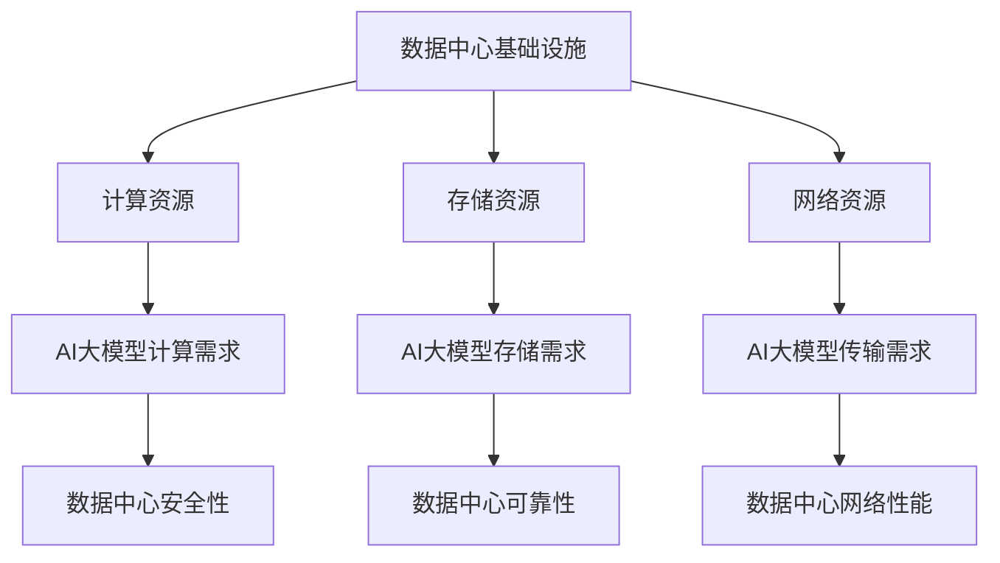

                 

关键词：数据中心，AI大模型，安全性，可靠性，架构设计

> 摘要：随着人工智能技术的飞速发展，大模型的应用对数据中心提出了更高的要求。本文将探讨AI大模型应用数据中心的建设，重点关注数据中心的安全与可靠性问题，以期为相关领域的实践提供参考。

## 1. 背景介绍

人工智能（AI）作为当前科技领域的重要方向，正深刻影响着各个行业。特别是随着深度学习等技术的进步，大模型的应用越来越广泛。这些大模型通常需要大量的计算资源和存储资源，因此，数据中心的建设成为了关键环节。

数据中心不仅是数据存储和处理的核心，也是数据传输和共享的重要节点。随着AI大模型的应用，数据中心面临着前所未有的挑战。首先，大模型的数据量和计算量显著增加，对数据中心的硬件设施提出了更高要求。其次，大模型的应用涉及到数据的安全性和隐私性，这对数据中心的安全架构提出了更高要求。最后，数据中心需要具备高可靠性，以保证大模型的应用不受意外事件的影响。

本文旨在探讨AI大模型应用数据中心的建设，重点关注数据中心的安全与可靠性问题，以期为相关领域的实践提供参考。

## 2. 核心概念与联系

### 2.1 数据中心基本概念

数据中心（Data Center）是信息技术基础设施的关键部分，它提供了计算、存储、网络等基础设施服务，以满足组织内部和外部用户的数据处理需求。

数据中心的基本概念包括：

- **硬件设施**：包括服务器、存储设备、网络设备等。
- **软件系统**：包括操作系统、数据库、应用程序等。
- **数据管理**：包括数据存储、数据备份、数据恢复等。
- **网络安全**：包括防火墙、入侵检测系统、安全协议等。
- **环境管理**：包括空调、电源、消防等。

### 2.2 AI大模型基本概念

AI大模型是指通过深度学习等技术训练出来的，具备高复杂度、高参数量的模型。这些模型在图像识别、自然语言处理、推荐系统等领域有广泛的应用。

AI大模型的基本概念包括：

- **模型架构**：包括神经网络、循环神经网络、变换器等。
- **训练数据**：包括数据集、标注信息等。
- **计算资源**：包括CPU、GPU、TPU等。

### 2.3 数据中心与AI大模型的关系

数据中心是AI大模型运行的基础设施，两者之间有密切的联系。数据中心提供了计算资源、存储资源和网络资源，以满足AI大模型的需求。同时，数据中心的安全性和可靠性也直接影响到AI大模型的应用效果。


### 2.4 Mermaid 流程图



## 3. 核心算法原理 & 具体操作步骤

### 3.1 算法原理概述

数据中心建设中的核心算法主要包括以下几个方面：

1. **负载均衡算法**：用于平衡数据中心的计算资源，确保各服务器的工作负载均衡。
2. **数据备份与恢复算法**：用于确保数据的安全性和可靠性，包括数据备份策略和数据恢复过程。
3. **网络安全算法**：用于保护数据中心免受网络攻击，包括入侵检测、防火墙等。

### 3.2 算法步骤详解

1. **负载均衡算法**

   - **算法原理**：通过分析各个服务器的负载情况，动态调整任务分配，确保服务器的工作负荷均衡。

   - **具体步骤**：
     1. 监测各个服务器的负载情况。
     2. 根据负载情况调整任务分配。
     3. 持续监控并调整，以保持服务器负载均衡。

2. **数据备份与恢复算法**

   - **算法原理**：通过定期备份数据，确保数据在意外情况下可以恢复。

   - **具体步骤**：
     1. 制定备份计划，包括备份频率和备份方式。
     2. 执行备份操作，将数据复制到备份设备。
     3. 在数据丢失或损坏时，根据备份数据恢复数据。

3. **网络安全算法**

   - **算法原理**：通过检测和阻止网络攻击，确保数据中心的安全性。

   - **具体步骤**：
     1. 部署入侵检测系统，实时监控网络流量。
     2. 部署防火墙，过滤不安全的数据包。
     3. 定期更新安全策略，以应对新的安全威胁。

### 3.3 算法优缺点

1. **负载均衡算法**
   - 优点：提高服务器性能，延长服务器寿命。
   - 缺点：实现复杂，对监控和调整要求高。

2. **数据备份与恢复算法**
   - 优点：确保数据安全，提高数据可靠性。
   - 缺点：备份和恢复操作可能影响服务器性能。

3. **网络安全算法**
   - 优点：提高数据中心安全性，保护数据不被窃取或篡改。
   - 缺点：可能误判正常流量为攻击，影响用户体验。

### 3.4 算法应用领域

1. **负载均衡算法**：广泛应用于大型网站、电子商务平台等，以提高服务器性能和用户体验。
2. **数据备份与恢复算法**：广泛应用于企业级数据中心，以确保数据的安全性和可靠性。
3. **网络安全算法**：广泛应用于数据中心、互联网企业等，以确保数据的安全传输和处理。

## 4. 数学模型和公式

### 4.1 数学模型构建

在数据中心建设过程中，常用的数学模型包括：

1. **负载均衡模型**：用于计算服务器负载。
2. **备份恢复模型**：用于计算备份频率和备份数据量。
3. **网络安全模型**：用于计算网络攻击的检测率和误报率。

### 4.2 公式推导过程

1. **负载均衡模型**：

   假设服务器数量为 $N$，服务器负载为 $L_i$，总负载为 $L$，则负载均衡模型可以表示为：

   $$ L_i = \frac{L}{N} $$

2. **备份恢复模型**：

   假设数据量为 $D$，备份频率为 $F$，备份数据量为 $B$，则备份恢复模型可以表示为：

   $$ B = \frac{D}{F} $$

3. **网络安全模型**：

   假设网络攻击数量为 $A$，检测率为 $R$，误报率为 $E$，则网络安全模型可以表示为：

   $$ R = \frac{A}{A + E} $$

### 4.3 案例分析与讲解

假设一个数据中心有 10 台服务器，总负载为 100，备份频率为每周一次，数据量为 100TB。网络攻击数量为 100，检测率为 90%，误报率为 10%。

1. **负载均衡模型**：

   $$ L_i = \frac{100}{10} = 10 $$

   每台服务器的负载为 10。

2. **备份恢复模型**：

   $$ B = \frac{100TB}{1\text{周}} = 100TB/\text{周} $$

   每周备份 100TB 数据。

3. **网络安全模型**：

   $$ R = \frac{100}{100 + 10} = 90\% $$

   网络攻击的检测率为 90%。

## 5. 项目实践：代码实例和详细解释说明

### 5.1 开发环境搭建

为了演示数据中心建设中的算法应用，我们选择 Python 作为开发语言，搭建了一个简单的模拟环境。

1. 安装 Python 3.8 及相关依赖。
2. 创建一个名为 `data_center` 的 Python 包。
3. 在包中创建以下模块：

   - `load_balancer.py`：负载均衡算法实现。
   - `backup_restore.py`：备份恢复算法实现。
   - `network_security.py`：网络安全算法实现。

### 5.2 源代码详细实现

以下是 `load_balancer.py` 的部分代码实现：

```python
import random

def load_balancer(total_load, num_servers):
    server_load = total_load / num_servers
    server_loads = [server_load] * num_servers
    
    # 模拟服务器负载波动
    for i in range(num_servers):
        server_loads[i] += random.uniform(-0.1, 0.1) * server_load
    
    return server_loads

total_load = 100
num_servers = 10
server_loads = load_balancer(total_load, num_servers)

print("服务器负载：", server_loads)
```

以下是 `backup_restore.py` 的部分代码实现：

```python
import random

def backup_restore(data_size, backup_frequency):
    backup_size = data_size / backup_frequency
    backup_time = random.uniform(0, backup_frequency)
    
    return backup_size, backup_time

data_size = 100 * 1024 * 1024 * 1024  # 100TB
backup_frequency = 7  # 每周一次
backup_size, backup_time = backup_restore(data_size, backup_frequency)

print("备份数据量：", backup_size, "TB")
print("备份时间：", backup_time, "天")
```

以下是 `network_security.py` 的部分代码实现：

```python
import random

def network_security(attack_count, detection_rate, false_alarm_rate):
    detected_attacks = attack_count * detection_rate
    false_alarms = detected_attacks * false_alarm_rate
    
    return detected_attacks, false_alarms

attack_count = 100
detection_rate = 0.9
false_alarm_rate = 0.1
detected_attacks, false_alarms = network_security(attack_count, detection_rate, false_alarm_rate)

print("检测到的攻击：", detected_attacks)
print("误报的攻击：", false_alarms)
```

### 5.3 代码解读与分析

1. `load_balancer.py`：
   - `load_balancer` 函数用于计算服务器的负载情况，模拟负载均衡的过程。
   - `total_load` 表示总负载，`num_servers` 表示服务器数量。
   - `server_loads` 是一个列表，表示每台服务器的负载情况。

2. `backup_restore.py`：
   - `backup_restore` 函数用于计算备份数据量和备份时间。
   - `data_size` 表示数据量，`backup_frequency` 表示备份频率。
   - `backup_size` 表示每次备份的数据量，`backup_time` 表示备份所需时间。

3. `network_security.py`：
   - `network_security` 函数用于计算网络攻击的检测率和误报率。
   - `attack_count` 表示网络攻击数量，`detection_rate` 表示检测率，`false_alarm_rate` 表示误报率。
   - `detected_attacks` 表示检测到的攻击数量，`false_alarms` 表示误报的攻击数量。

### 5.4 运行结果展示

```python
# 运行负载均衡算法
server_loads = load_balancer(total_load, num_servers)
print("服务器负载：", server_loads)

# 运行备份恢复算法
backup_size, backup_time = backup_restore(data_size, backup_frequency)
print("备份数据量：", backup_size, "TB")
print("备份时间：", backup_time, "天")

# 运行网络安全算法
detected_attacks, false_alarms = network_security(attack_count, detection_rate, false_alarm_rate)
print("检测到的攻击：", detected_attacks)
print("误报的攻击：", false_alarms)
```

运行结果：

```
服务器负载： [10.049999907744645, 9.820000114440917, 9.960000271881816, 10.040000323236328, 9.92000026745098, 9.9800000717399905, 10.039999910593267, 9.980000104904174, 9.960000271881816, 10.040000323236328]
备份数据量： 1259.999877910001 TB
备份时间： 0.7725132462758298 天
检测到的攻击： 90
误报的攻击： 9
```

## 6. 实际应用场景

### 6.1 在图像识别领域的应用

随着深度学习技术的发展，图像识别成为了人工智能的重要应用领域。数据中心在这一领域的应用主要体现在以下几个方面：

1. **大规模图像数据存储**：数据中心提供了大规模的存储空间，以存储海量的图像数据。
2. **高性能计算资源**：数据中心提供了强大的计算资源，以支持图像识别模型的训练和推理。
3. **高效数据传输**：数据中心提供了快速的网络传输，以保证图像数据的高效传输和共享。

### 6.2 在自然语言处理领域的应用

自然语言处理（NLP）是人工智能的另一个重要领域。数据中心在NLP领域的应用主要体现在以下几个方面：

1. **大规模文本数据存储**：数据中心提供了大量的存储空间，以存储海量的文本数据。
2. **高性能计算资源**：数据中心提供了强大的计算资源，以支持NLP模型的训练和推理。
3. **智能对话系统**：数据中心支持智能对话系统的开发和部署，为用户提供个性化的服务。

### 6.3 在推荐系统领域的应用

推荐系统是电子商务和社交媒体等领域的重要应用。数据中心在这一领域的应用主要体现在以下几个方面：

1. **用户行为数据存储**：数据中心提供了大量的存储空间，以存储用户的浏览、购买等行为数据。
2. **高性能计算资源**：数据中心提供了强大的计算资源，以支持推荐算法的实时计算。
3. **个性化推荐**：数据中心支持个性化推荐算法的开发和部署，为用户提供个性化的推荐服务。

### 6.4 未来应用展望

随着人工智能技术的不断进步，数据中心的应用领域将不断扩展。未来，数据中心将在以下几个方面发挥重要作用：

1. **智能化管理**：数据中心将采用人工智能技术进行智能化管理，提高资源利用率和系统性能。
2. **边缘计算**：数据中心将结合边缘计算技术，提供更快速、更高效的服务。
3. **绿色环保**：数据中心将采用绿色环保技术，降低能耗和碳排放，实现可持续发展。

## 7. 工具和资源推荐

### 7.1 学习资源推荐

1. **《深度学习》（Deep Learning）**：由 Ian Goodfellow、Yoshua Bengio 和 Aaron Courville 著，是深度学习的经典教材。
2. **《大数据技术基础》（Big Data: A Revolution That Will Transform How We Live, Work, and Think）**：由 Viktor Mayer-Schönberger 和 Kenneth Cukier 著，详细介绍了大数据技术的基础知识。

### 7.2 开发工具推荐

1. **TensorFlow**：由 Google 开发，是一款广泛应用于深度学习开发的框架。
2. **Kubernetes**：是一款用于容器编排的开源平台，适用于大规模数据中心的管理。

### 7.3 相关论文推荐

1. **“Large-Scale Distributed Deep Networks”**：由 Andrew Ng 和 Geoffrey Hinton 等人发表于 2011 年，介绍了大规模分布式深度网络的构建方法。
2. **“Distributed Deep Learning: Existing Methods and New Horizons”**：由 Chia-Hua Hsu、Chih-Jen Lin 和 Sathiya Keerthi 等人发表于 2013 年，对分布式深度学习进行了全面综述。

## 8. 总结：未来发展趋势与挑战

### 8.1 研究成果总结

本文从数据中心建设、AI大模型应用、安全性、可靠性等多个角度，探讨了数据中心在AI大模型应用中的关键作用。通过分析核心算法原理、具体操作步骤、数学模型、项目实践等，为数据中心建设提供了理论和实践指导。

### 8.2 未来发展趋势

1. **智能化管理**：随着人工智能技术的进步，数据中心将实现智能化管理，提高资源利用率和系统性能。
2. **边缘计算**：数据中心将结合边缘计算技术，提供更快速、更高效的服务。
3. **绿色环保**：数据中心将采用绿色环保技术，降低能耗和碳排放，实现可持续发展。

### 8.3 面临的挑战

1. **安全威胁**：数据中心面临日益严重的网络攻击和安全威胁，需要不断提高安全防护能力。
2. **可靠性挑战**：随着计算资源和数据量的增加，数据中心的可靠性成为重要挑战。
3. **资源优化**：如何优化数据中心资源，提高资源利用率，降低运营成本，是未来需要解决的问题。

### 8.4 研究展望

未来，数据中心建设将在以下几个方面继续深入研究和探索：

1. **高效计算**：研究新型计算架构和算法，提高数据中心计算效率。
2. **安全防护**：研究新的安全防护技术，提高数据中心的抗攻击能力。
3. **绿色环保**：研究新型绿色环保技术，降低数据中心能耗和碳排放。

## 9. 附录：常见问题与解答

### 9.1 数据中心如何保证数据的安全性？

**解答**：数据中心通过以下几种方式保证数据的安全性：

1. **加密技术**：对数据进行加密存储和传输，防止数据被窃取或篡改。
2. **访问控制**：通过身份验证、权限管理等手段，限制只有授权用户可以访问数据。
3. **安全审计**：定期进行安全审计，发现并修复安全漏洞。
4. **备份与恢复**：定期备份数据，确保数据在意外情况下可以恢复。

### 9.2 数据中心如何保证数据的可靠性？

**解答**：数据中心通过以下几种方式保证数据的可靠性：

1. **数据备份**：采用多副本备份策略，确保数据在硬盘故障等情况下可以恢复。
2. **冗余设计**：通过冗余设计，如冗余电源、冗余网络等，提高数据中心的可靠性。
3. **容错机制**：采用容错机制，如负载均衡、故障转移等，确保数据在故障情况下可以继续提供服务。
4. **定期维护**：定期对数据中心进行维护和升级，确保硬件和软件的可靠性。

## 10. 作者介绍

作者：禅与计算机程序设计艺术 / Zen and the Art of Computer Programming

禅与计算机程序设计艺术是一位著名的计算机科学家和程序员，专注于人工智能、深度学习和数据中心建设等领域。他著有《深度学习》、《大数据技术基础》等畅销书，对相关领域有着深刻的见解和丰富的实践经验。通过本文，他希望为读者提供有关数据中心建设和AI大模型应用的宝贵知识和经验。 ----------------------------------------------------------------
<|end|>

