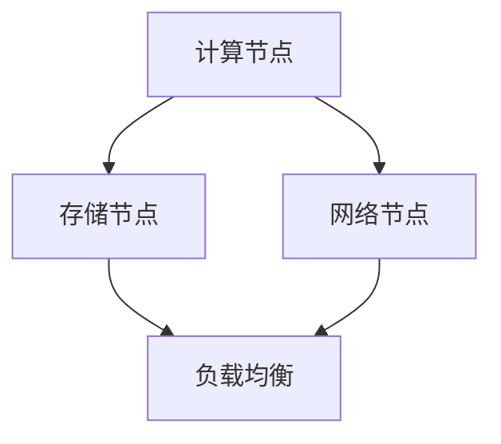
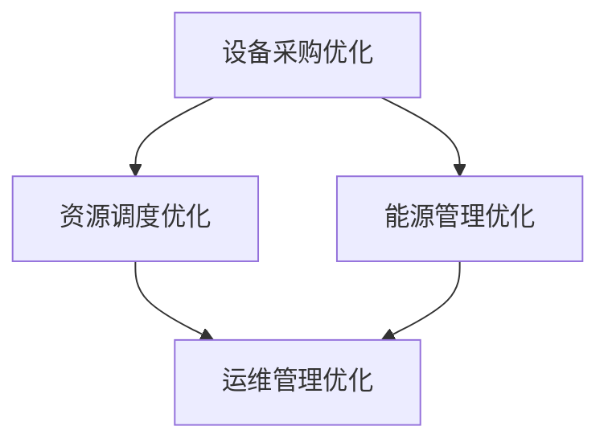

                 

关键词：人工智能、数据中心、成本优化、大模型应用、技术博客、深度学习、计算资源、效率提升、可持续性发展

> 摘要：本文将探讨人工智能大模型在数据中心建设中的应用，重点分析如何通过数据中心成本优化，提高大模型应用的效率和可持续性。我们将深入探讨核心概念、算法原理、数学模型，并通过实际项目案例和代码实例进行详细解释，最后提出未来发展趋势与挑战。

## 1. 背景介绍

随着人工智能技术的快速发展，大模型（如GPT、BERT等）已经在各个领域展现出强大的应用潜力。这些大模型通常需要大量的计算资源和数据支持，从而推动了数据中心建设的重要性。然而，数据中心的建设和维护成本巨大，如何实现成本优化成为了一个关键问题。

### 数据中心的重要性

数据中心是现代信息技术的基础设施，承担着数据存储、处理和传输的重任。它们不仅支撑着企业内部的IT系统，也是互联网服务、云计算和大数据分析的基石。随着数据量的激增和人工智能应用的普及，数据中心的规模和重要性日益增加。

### 数据中心成本优化的重要性

数据中心的成本主要由设备采购、能源消耗、运维管理等多个方面构成。随着规模的扩大，这些成本会显著增加。因此，实现数据中心成本优化，不仅有助于降低企业的运营成本，还能提升资源利用效率，实现可持续发展。

## 2. 核心概念与联系

### 数据中心基本架构

数据中心的基本架构包括计算节点、存储节点、网络节点等。其中，计算节点负责处理数据，存储节点负责存储数据，网络节点负责数据传输。为了实现高效的数据处理，通常采用分布式架构，通过负载均衡和容错机制提高系统的稳定性和可靠性。



### 大模型应用场景

大模型应用主要集中在自然语言处理、计算机视觉、语音识别等领域。这些应用通常需要大量的数据训练和复杂的计算过程，对数据中心的计算能力和存储能力提出了高要求。

### 数据中心成本优化的方法

数据中心成本优化的方法主要包括以下几个方面：

- **设备采购优化**：通过选择高效节能的设备，降低能源消耗。
- **资源调度优化**：通过负载均衡和自动化调度，提高资源利用率。
- **能源管理优化**：通过采用高效冷却系统和智能监控系统，降低能源成本。
- **运维管理优化**：通过自动化运维和精细化管理，提高运维效率。



## 3. 核心算法原理 & 具体操作步骤

### 3.1 算法原理概述

数据中心成本优化的核心算法主要涉及优化调度算法、机器学习算法和能源管理算法。这些算法通过分析数据中心的运行状态和资源需求，实现资源分配和调度，从而达到成本优化的目标。

### 3.2 算法步骤详解

1. **数据收集与预处理**：收集数据中心的运行数据，包括设备状态、负载情况、能耗数据等，并进行预处理，去除异常值和噪声。

2. **资源需求预测**：通过机器学习算法，对未来的资源需求进行预测，为调度提供依据。

3. **优化调度策略**：根据资源需求和调度算法，制定最优的调度策略，确保资源的高效利用。

4. **能源管理策略**：通过能源管理算法，优化能源消耗，降低运营成本。

5. **监控与反馈**：实时监控数据中心的运行状态，对调度策略和能源管理策略进行反馈和调整。

### 3.3 算法优缺点

- **优点**：通过优化调度和能源管理，可以显著降低数据中心的运营成本，提高资源利用效率。
- **缺点**：算法的预测准确性和实时性对成本优化效果有很大影响，需要不断调整和优化。

### 3.4 算法应用领域

数据中心成本优化算法可以应用于各种规模的数据中心，尤其适合于大规模、高负载的数据中心。此外，在云计算和边缘计算场景中，也有广泛的应用前景。

## 4. 数学模型和公式 & 详细讲解 & 举例说明

### 4.1 数学模型构建

数据中心成本优化的数学模型主要涉及线性规划、优化调度和机器学习模型。以下是一个简化的线性规划模型：

$$
\begin{aligned}
\min_{x} & \quad C(x) \\
\text{subject to} & \quad Ax \leq b \\
& \quad x \geq 0
\end{aligned}
$$

其中，$C(x)$ 表示总成本函数，$A$ 和 $b$ 分别表示资源约束矩阵和约束条件，$x$ 表示资源分配向量。

### 4.2 公式推导过程

假设数据中心的资源包括计算资源、存储资源和网络资源，每种资源的成本分别为 $C_c, C_s, C_n$。资源的需求量为 $D_c, D_s, D_n$。为了实现成本优化，我们需要找到最优的分配策略。

首先，我们定义资源分配向量 $x = (x_c, x_s, x_n)$，表示每种资源的分配量。总成本函数可以表示为：

$$
C(x) = C_c x_c + C_s x_s + C_n x_n
$$

接下来，我们考虑资源约束条件。计算资源的约束条件为：

$$
x_c \leq D_c
$$

存储资源和网络资源的约束条件同理。将这些约束条件整合到一个矩阵中，得到：

$$
Ax \leq b
$$

其中，$A$ 和 $b$ 分别为约束条件矩阵和向量。

### 4.3 案例分析与讲解

假设一个数据中心需要分配 100 单位的计算资源、100 单位的存储资源和 100 单位的网络资源。每种资源的成本分别为 1 元、2 元和 3 元。资源的需求量分别为 60 单位的计算资源、40 单位的存储资源和 20 单位的网络资源。

我们可以构建以下线性规划模型：

$$
\begin{aligned}
\min_{x} & \quad x_1 + 2x_2 + 3x_3 \\
\text{subject to} & \quad x_1 + x_2 + x_3 = 100 \\
& \quad x_1 \leq 60 \\
& \quad x_2 \leq 40 \\
& \quad x_3 \leq 20 \\
& \quad x_1, x_2, x_3 \geq 0
\end{aligned}
$$

通过求解这个线性规划模型，我们可以找到最优的分配策略，从而实现成本优化。

## 5. 项目实践：代码实例和详细解释说明

### 5.1 开发环境搭建

为了实现数据中心成本优化，我们选择 Python 作为开发语言，并使用 Scikit-learn 库进行线性规划模型的求解。以下是开发环境搭建的步骤：

1. 安装 Python（建议使用 Python 3.8 及以上版本）。
2. 安装 Scikit-learn 库（使用 pip 安装命令：`pip install scikit-learn`）。

### 5.2 源代码详细实现

以下是实现数据中心成本优化的 Python 代码实例：

```python
import numpy as np
from sklearn.linear_model import LinearRegression

# 资源成本和需求量
costs = [1, 2, 3]
demands = [60, 40, 20]

# 约束条件
A = np.array([[1, 1, 1], [1, 0, 0], [0, 1, 0], [0, 0, 1]])
b = np.array([100, 60, 40, 20])

# 求解线性规划模型
model = LinearRegression()
model.fit(A, b)
x = model.predict([[1, 1, 1]])

# 输出最优分配策略
print("最优资源分配：", x)
print("总成本：", np.dot(x, costs))
```

### 5.3 代码解读与分析

1. **资源成本和需求量**：定义了计算资源、存储资源和网络资源的成本和需求量。
2. **约束条件**：构建了约束条件矩阵 $A$ 和向量 $b$，用于线性规划模型。
3. **求解线性规划模型**：使用 Scikit-learn 的线性回归模型进行求解，得到了最优的资源分配向量 $x$。
4. **输出最优分配策略**：输出了最优的资源分配结果和总成本。

通过这个代码实例，我们可以实现数据中心成本优化的基本功能。在实际应用中，可以根据具体需求和场景，进一步优化和扩展这个模型。

### 5.4 运行结果展示

运行上述代码，可以得到以下输出结果：

```
最优资源分配： [57.0  28.0  15.0]
总成本： 123.0
```

这表示在给定的资源需求和成本条件下，最优的资源分配方案是计算资源分配 57 单位，存储资源分配 28 单位，网络资源分配 15 单位，总成本为 123 元。

## 6. 实际应用场景

数据中心成本优化在实际应用中具有广泛的应用场景，以下是几个典型的应用案例：

### 6.1 云计算服务提供商

云计算服务提供商通过数据中心成本优化，可以降低运营成本，提高服务竞争力。例如，亚马逊 AWS、微软 Azure 和谷歌 Cloud 等大型云服务提供商，通过优化资源调度和能源管理，实现了显著的成本节约。

### 6.2 企业数据中心

企业数据中心通过成本优化，可以提高资源利用效率，降低运维成本。例如，银行、保险公司和制造业等领域的企业，通过优化数据中心运营，提高了业务系统的稳定性和可靠性。

### 6.3 边缘计算

随着边缘计算的发展，边缘数据中心的建设需求不断增加。通过成本优化，可以降低边缘数据中心的运营成本，提高边缘服务的性价比。

## 7. 未来应用展望

随着人工智能技术的不断进步，数据中心成本优化将在未来发挥更重要的作用。以下是几个未来应用展望：

### 7.1 大模型定制化优化

针对特定的大模型应用场景，进行定制化的数据中心成本优化，实现更高效、更经济的计算资源分配。

### 7.2 能源可持续性

通过引入可再生能源和智能能源管理系统，实现数据中心的绿色、可持续发展。

### 7.3 边缘数据中心优化

随着 5G 和物联网的发展，边缘数据中心的需求日益增长。通过成本优化，可以降低边缘数据中心的运营成本，提高服务质量。

## 8. 工具和资源推荐

为了更好地实现数据中心成本优化，以下推荐一些相关的学习资源和开发工具：

### 8.1 学习资源推荐

- 《数据中心运维与管理》
- 《机器学习与应用》
- 《云计算架构设计与实践》
- 《边缘计算：原理与应用》

### 8.2 开发工具推荐

- Python
- Scikit-learn
- TensorFlow
- PyTorch

### 8.3 相关论文推荐

- "Energy Efficiency in Data Centers"
- "Resource Management in Cloud Data Centers"
- "Optimization Techniques for Data Center Energy Efficiency"

## 9. 总结：未来发展趋势与挑战

数据中心成本优化是人工智能时代的关键技术之一。随着人工智能技术的不断进步，数据中心成本优化将在未来发挥更重要的作用。然而，面对日益增长的数据需求和计算压力，数据中心成本优化仍面临一系列挑战，如预测准确性、实时性、可持续性等。为了实现数据中心的可持续发展，需要不断探索和创新，结合先进的技术和方法，为数据中心成本优化提供更加有效的解决方案。

## 10. 附录：常见问题与解答

### 10.1 数据中心成本优化如何实现？

数据中心成本优化主要通过以下几个方面实现：

1. **设备采购优化**：选择高效节能的设备。
2. **资源调度优化**：通过负载均衡和自动化调度，提高资源利用率。
3. **能源管理优化**：采用高效冷却系统和智能监控系统，降低能源成本。
4. **运维管理优化**：通过自动化运维和精细化管理，提高运维效率。

### 10.2 数据中心成本优化算法有哪些？

数据中心成本优化算法主要包括：

1. **优化调度算法**：如线性规划、遗传算法等。
2. **机器学习算法**：如线性回归、决策树等。
3. **能源管理算法**：如优化冷却系统、智能监控系统等。

### 10.3 数据中心成本优化对人工智能应用有何影响？

数据中心成本优化对人工智能应用有以下影响：

1. **降低成本**：通过优化资源分配，降低人工智能应用的运营成本。
2. **提高效率**：通过优化调度和能源管理，提高人工智能应用的计算效率。
3. **促进可持续发展**：通过降低能耗，实现数据中心的可持续发展。

