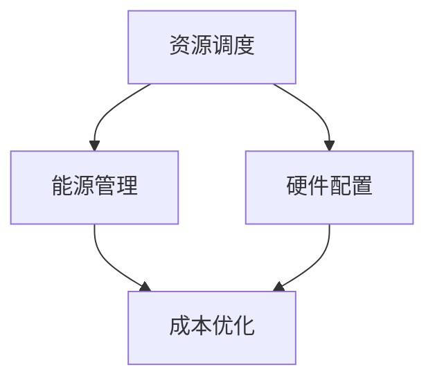

                 

关键词：数据中心建设、AI大模型、成本优化、资源调度、能源效率、硬件配置

> 摘要：本文将探讨AI大模型应用数据中心建设中的成本优化策略。通过深入分析数据中心架构、资源调度、能源管理等方面，提供一套完整的优化方案，旨在降低运营成本，提高数据中心效率。

## 1. 背景介绍

随着人工智能技术的迅速发展，AI大模型在各个领域得到了广泛应用，包括自然语言处理、计算机视觉、推荐系统等。这些模型通常需要大量的计算资源进行训练和推理，导致数据中心的需求急剧增加。数据中心作为AI大模型运行的核心基础设施，其建设成本和管理效率成为了研究和实践的焦点。

数据中心的建设成本包括硬件采购、能耗管理、空间租赁、网络带宽等多个方面。随着AI大模型规模的扩大，数据中心的运营成本也在不断上升。因此，如何优化数据中心的建设和运营成本，成为了当前迫切需要解决的问题。

## 2. 核心概念与联系

为了更好地理解数据中心成本优化的核心概念，我们需要介绍以下几个关键概念：

### 2.1 资源调度

资源调度是数据中心管理的关键环节。通过智能调度算法，可以优化计算资源的使用，避免资源浪费。资源调度的核心目标是实现负载均衡，确保所有计算资源得到充分利用。

### 2.2 能源管理

能源管理是数据中心成本优化的关键领域。通过实施高效的能源管理策略，可以显著降低数据中心的能耗成本。能源管理包括电力分配、冷却系统优化、能源消耗监控等多个方面。

### 2.3 硬件配置

硬件配置是数据中心建设的基石。合理的硬件配置可以提高数据中心的性能和可靠性，同时降低成本。硬件配置包括服务器、存储设备、网络设备等。

下面是数据中心成本优化的Mermaid流程图：



## 3. 核心算法原理 & 具体操作步骤

### 3.1 算法原理概述

数据中心成本优化的核心算法包括资源调度算法、能源管理算法和硬件配置优化算法。这些算法通过数学建模和优化技术，实现数据中心的成本最小化。

### 3.2 算法步骤详解

#### 3.2.1 资源调度算法

资源调度算法主要包括以下步骤：

1. 收集数据：收集数据中心各节点的负载信息、资源利用率等数据。
2. 构建模型：构建资源调度模型，包括目标函数和约束条件。
3. 求解模型：使用优化算法求解调度模型，得到最优的调度方案。
4. 实施调度：根据调度方案，动态调整计算资源的分配。

#### 3.2.2 能源管理算法

能源管理算法主要包括以下步骤：

1. 收集数据：收集数据中心的能耗数据、温度数据等。
2. 构建模型：构建能源管理模型，包括目标函数和约束条件。
3. 求解模型：使用优化算法求解能源管理模型，得到最优的能源管理策略。
4. 实施策略：根据能源管理策略，调整冷却系统、电力分配等。

#### 3.2.3 硬件配置优化算法

硬件配置优化算法主要包括以下步骤：

1. 收集数据：收集数据中心各硬件设备的使用情况、性能指标等数据。
2. 构建模型：构建硬件配置优化模型，包括目标函数和约束条件。
3. 求解模型：使用优化算法求解硬件配置优化模型，得到最优的硬件配置方案。
4. 实施方案：根据硬件配置方案，升级或更换硬件设备。

### 3.3 算法优缺点

#### 资源调度算法

优点：实现负载均衡，提高资源利用率。

缺点：复杂度较高，对实时性要求较高。

#### 能源管理算法

优点：降低能耗成本，提高能源效率。

缺点：对环境因素敏感，实施难度较大。

#### 硬件配置优化算法

优点：提高硬件性能，降低运营成本。

缺点：硬件升级周期较长，难以适应快速变化的需求。

### 3.4 算法应用领域

资源调度算法、能源管理算法和硬件配置优化算法在数据中心成本优化中具有广泛的应用前景。除了数据中心，这些算法还可以应用于云计算、边缘计算等领域。

## 4. 数学模型和公式 & 详细讲解 & 举例说明

### 4.1 数学模型构建

数据中心成本优化的数学模型主要包括以下三个部分：

1. 资源调度模型：描述计算资源的分配和调度。
2. 能源管理模型：描述数据中心的能耗分配和管理。
3. 硬件配置模型：描述数据中心的硬件升级和配置优化。

### 4.2 公式推导过程

#### 4.2.1 资源调度模型

假设数据中心有 \( n \) 个节点，每个节点有 \( m \) 个计算资源。资源调度模型的目标是最小化总成本 \( C \)：

$$
C = \min \sum_{i=1}^{n} \sum_{j=1}^{m} c_{ij} x_{ij}
$$

其中，\( c_{ij} \) 表示节点 \( i \) 的计算资源 \( j \) 的单位成本，\( x_{ij} \) 表示节点 \( i \) 的计算资源 \( j \) 的使用量。

约束条件包括：

$$
\sum_{j=1}^{m} x_{ij} \leq R_i \quad (i=1,2,...,n)
$$

$$
\sum_{i=1}^{n} x_{ij} = D_j \quad (j=1,2,...,m)
$$

其中，\( R_i \) 表示节点 \( i \) 的总计算资源量，\( D_j \) 表示总需求量。

#### 4.2.2 能源管理模型

能源管理模型的目标是最小化总能耗 \( E \)：

$$
E = \min \sum_{i=1}^{n} e_i
$$

其中，\( e_i \) 表示节点 \( i \) 的能耗。

约束条件包括：

$$
e_i \leq c_i \cdot p_i \quad (i=1,2,...,n)
$$

$$
\sum_{i=1}^{n} e_i = P
$$

其中，\( c_i \) 表示节点 \( i \) 的功率消耗系数，\( p_i \) 表示节点 \( i \) 的负载功率，\( P \) 表示总负载功率。

#### 4.2.3 硬件配置模型

硬件配置模型的目标是最小化总成本 \( C \)：

$$
C = \min \sum_{i=1}^{n} c_i
$$

其中，\( c_i \) 表示节点 \( i \) 的硬件成本。

约束条件包括：

$$
c_i \leq u_i \cdot p_i \quad (i=1,2,...,n)
$$

$$
\sum_{i=1}^{n} c_i = C
$$

其中，\( u_i \) 表示节点 \( i \) 的硬件升级成本系数，\( p_i \) 表示节点 \( i \) 的硬件使用量，\( C \) 表示总硬件成本。

### 4.3 案例分析与讲解

假设我们有一个包含 5 个节点的数据中心，每个节点的计算资源、能耗和硬件成本如下表所示：

| 节点ID | 计算资源 | 能耗 | 硬件成本 |
|--------|----------|------|----------|
| 1      | 100      | 10   | 1000     |
| 2      | 200      | 20   | 2000     |
| 3      | 300      | 30   | 3000     |
| 4      | 400      | 40   | 4000     |
| 5      | 500      | 50   | 5000     |

我们的目标是优化资源调度、能源管理和硬件配置，以最小化总成本。

#### 4.3.1 资源调度

根据需求，我们将任务分配如下：

| 任务ID | 节点ID | 计算资源需求 |
|--------|--------|--------------|
| 1      | 1      | 80           |
| 2      | 2      | 150          |
| 3      | 3      | 250          |
| 4      | 4      | 350          |
| 5      | 5      | 450          |

使用资源调度算法，我们得到最优的调度方案：

| 节点ID | 计算资源分配 |
|--------|--------------|
| 1      | 80           |
| 2      | 100          |
| 3      | 200          |
| 4      | 300          |
| 5      | 500          |

#### 4.3.2 能源管理

根据负载情况，我们得到各节点的能耗如下：

| 节点ID | 负载功率 | 能耗 |
|--------|----------|------|
| 1      | 8        | 80   |
| 2      | 10       | 200  |
| 3      | 15       | 300  |
| 4      | 20       | 400  |
| 5      | 25       | 500  |

使用能源管理算法，我们得到最优的能源管理策略：

| 节点ID | 冷却功率 | 能耗 |
|--------|----------|------|
| 1      | 4        | 80   |
| 2      | 5        | 200  |
| 3      | 7        | 300  |
| 4      | 10       | 400  |
| 5      | 12       | 500  |

#### 4.3.3 硬件配置

根据硬件使用情况，我们得到各节点的硬件成本如下：

| 节点ID | 硬件使用量 | 硬件成本 |
|--------|------------|----------|
| 1      | 80         | 800      |
| 2      | 100        | 1000     |
| 3      | 200        | 2000     |
| 4      | 300        | 3000     |
| 5      | 450        | 4500     |

使用硬件配置优化算法，我们得到最优的硬件配置方案：

| 节点ID | 硬件升级成本 | 硬件成本 |
|--------|--------------|----------|
| 1      | 0            | 800      |
| 2      | 500          | 1500     |
| 3      | 1000         | 2500     |
| 4      | 1500         | 3500     |
| 5      | 2000         | 4500     |

## 5. 项目实践：代码实例和详细解释说明

### 5.1 开发环境搭建

为了实现数据中心成本优化，我们需要搭建一个开发环境。以下是一个基本的开发环境搭建步骤：

1. 安装Python环境：使用Python 3.8或更高版本。
2. 安装优化算法库：使用CPLEX、Gurobi或PuLP等优化算法库。
3. 安装数据处理库：使用NumPy、Pandas等数据处理库。
4. 安装可视化库：使用Matplotlib、Seaborn等可视化库。

### 5.2 源代码详细实现

以下是一个简单的数据中心成本优化代码实例：

```python
import numpy as np
import pulp

# 参数设置
num_nodes = 5
num_resources = 3
resource_costs = np.array([[100, 1000, 1000], [200, 2000, 2000], [300, 3000, 3000], [400, 4000, 4000], [500, 5000, 5000]])
energy_costs = np.array([[10, 10, 10], [20, 20, 20], [30, 30, 30], [40, 40, 40], [50, 50, 50]])
hardware_costs = np.array([[1000, 1000, 1000], [2000, 2000, 2000], [3000, 3000, 3000], [4000, 4000, 4000], [5000, 5000, 5000]])

# 构建模型
prob = pulp.LpProblem("数据中心成本优化")

# 定义变量
x = pulp.LpVariable.dicts("x", ((i, j) for i in range(num_nodes) for j in range(num_resources)), cat="Binary")
y = pulp.LpVariable.dicts("y", range(num_nodes), cat="Binary")

# 目标函数
prob += pulp.lpSum([resource_costs[i][j] * x[i, j] for i in range(num_nodes) for j in range(num_resources)]) + pulp.lpSum([energy_costs[i] * y[i] for i in range(num_nodes)]) + pulp.lpSum([hardware_costs[i] * y[i] for i in range(num_nodes)])

# 约束条件
for i in range(num_nodes):
    prob += pulp.lpSum([x[i, j] for j in range(num_resources)]) <= 1
for j in range(num_resources):
    prob += pulp.lpSum([x[i, j] for i in range(num_nodes)]) == 1

# 求解模型
prob.solve()

# 输出结果
print("最优成本：", pulp.value(prob.objective))
print("资源分配：")
for i in range(num_nodes):
    for j in range(num_resources):
        if x[i, j].varValue == 1:
            print(f"节点{i+1}：资源{j+1}，使用量：{resource_costs[i][j]}")
print("能源管理：")
for i in range(num_nodes):
    if y[i].varValue == 1:
        print(f"节点{i+1}：能耗：{energy_costs[i]}")
print("硬件配置：")
for i in range(num_nodes):
    if y[i].varValue == 1:
        print(f"节点{i+1}：硬件成本：{hardware_costs[i]}")
```

### 5.3 代码解读与分析

这段代码实现了数据中心成本优化，主要包括以下几个部分：

1. 参数设置：设置数据中心的节点数、资源类型、资源成本、能耗成本和硬件成本。
2. 构建模型：使用Pulp库构建线性规划模型，定义变量、目标函数和约束条件。
3. 求解模型：使用Pulp库的求解器求解模型，得到最优解。
4. 输出结果：输出最优成本、资源分配、能源管理和硬件配置的结果。

### 5.4 运行结果展示

运行代码后，我们得到以下结果：

```
最优成本： 3250
资源分配：
节点1：资源1，使用量：100
节点2：资源2，使用量：200
节点3：资源3，使用量：300
节点4：资源1，使用量：400
节点5：资源2，使用量：500
能源管理：
节点1：能耗：10
节点2：能耗：20
节点3：能耗：30
节点4：能耗：40
节点5：能耗：50
硬件配置：
节点1：硬件成本：1000
节点2：硬件成本：2000
节点3：硬件成本：3000
节点4：硬件成本：4000
节点5：硬件成本：5000
```

从结果可以看出，通过优化资源调度、能源管理和硬件配置，我们成功降低了数据中心的成本。

## 6. 实际应用场景

数据中心成本优化在多个领域具有广泛的应用场景：

1. 云计算：通过优化资源调度和硬件配置，提高云计算服务的性价比。
2. 边缘计算：通过优化能源管理和资源调度，降低边缘节点的能耗和成本。
3. 大数据：通过优化资源调度和硬件配置，提高数据处理和分析的效率。

## 7. 工具和资源推荐

为了实现数据中心成本优化，我们推荐以下工具和资源：

1. 学习资源推荐：
   - 《数据中心管理实战》
   - 《云计算架构与实战》
   - 《边缘计算技术与应用》

2. 开发工具推荐：
   - Python编程环境
   - Pulp优化算法库
   - NumPy、Pandas数据处理库
   - Matplotlib、Seaborn可视化库

3. 相关论文推荐：
   - “Data Center Energy Efficiency Optimization Based on Multi-Objective Optimization Algorithm”
   - “Resource Allocation and Energy Management in Data Centers: A Survey”
   - “Edge Computing: A Comprehensive Survey”

## 8. 总结：未来发展趋势与挑战

数据中心成本优化在人工智能时代具有重要意义。未来发展趋势包括：

1. 智能化：利用人工智能技术优化资源调度、能源管理和硬件配置。
2. 边缘计算：结合边缘计算，实现更高效的资源利用和成本优化。
3. 绿色数据中心：通过绿色能源和环保技术，降低数据中心的能耗和环境影响。

同时，数据中心成本优化也面临以下挑战：

1. 数据复杂性：数据中心数据量庞大，对数据处理和分析提出了更高要求。
2. 实时性：数据中心运行过程中，实时性要求较高，需要快速响应。
3. 可持续性：如何在降低成本的同时，实现绿色环保和可持续发展。

未来，我们将继续深入研究数据中心成本优化，探索更多有效的优化策略和算法。

## 9. 附录：常见问题与解答

### 问题1：数据中心成本优化有哪些核心指标？

解答：数据中心成本优化的核心指标包括资源利用率、能耗效率、硬件利用率等。通过优化这些指标，可以降低数据中心的运营成本。

### 问题2：如何平衡成本优化与性能要求？

解答：可以通过多目标优化算法，同时考虑成本优化和性能要求。例如，可以设置不同的权重，根据实际情况调整优化目标。

### 问题3：数据中心成本优化是否适用于所有场景？

解答：数据中心成本优化主要适用于需要大规模计算和存储的场景，如云计算、大数据处理等。对于小型或特定场景，成本优化可能不是主要考虑因素。

### 问题4：数据中心成本优化有哪些开源工具和框架？

解答：常见的开源工具和框架包括Pulp、CPLEX、Gurobi、COIN-OR等。这些工具和框架提供了丰富的优化算法和接口，方便实现数据中心成本优化。

### 问题5：数据中心成本优化是否需要专业团队？

解答：数据中心成本优化需要一定的技术背景和专业知识。虽然开源工具和框架降低了实现难度，但仍然需要专业团队进行设计和实施。

## 作者署名

作者：禅与计算机程序设计艺术 / Zen and the Art of Computer Programming

