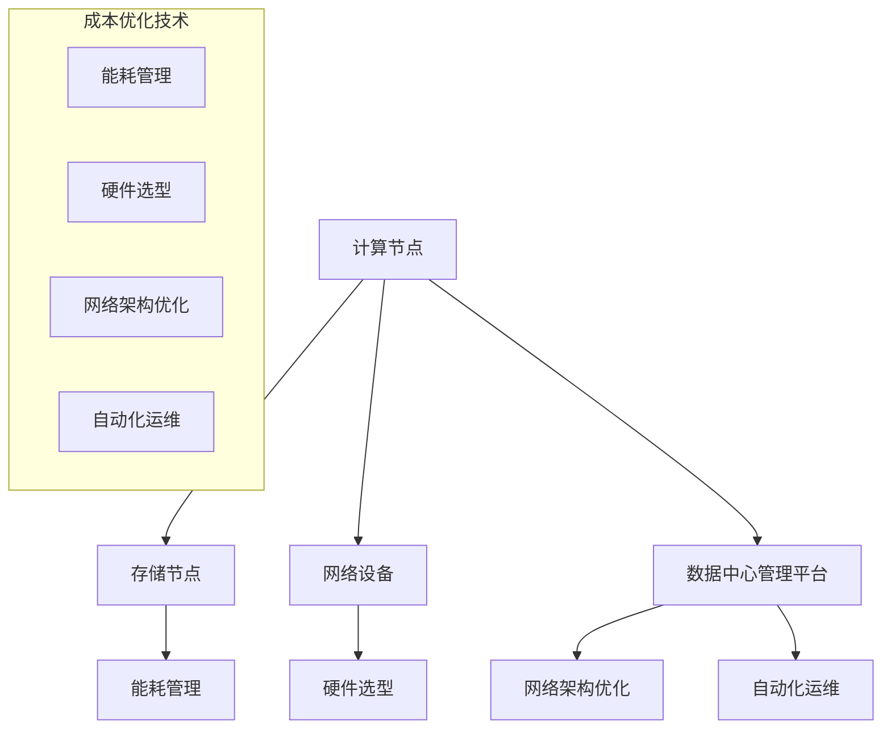

                 

### 1. 背景介绍

在当今数字化时代，数据中心作为信息社会的“神经中枢”，承载着全球海量数据的存储、处理和分析任务。随着人工智能（AI）技术的迅猛发展，尤其是大型AI模型如GPT-3、BERT等的广泛应用，数据中心的规模和复杂度不断增加。这不仅带来了计算和存储需求的剧增，也对数据中心的成本管理提出了更高的要求。

数据中心成本优化的核心在于如何在保证服务质量的同时，最大限度地降低运营成本。这包括能耗管理、硬件选型、网络架构优化、自动化运维等多个方面。传统的数据中心建设和管理方法难以应对AI大模型带来的挑战，因此，需要一种全新的视角和策略来优化数据中心成本。

本文将深入探讨AI大模型应用数据中心建设中的成本优化问题。首先，我们将介绍数据中心成本优化的背景和重要性；然后，通过详细分析大型AI模型的计算和存储需求，探讨如何通过数据中心架构优化来降低成本；接着，我们将介绍几种常用的成本优化技术，如虚拟化技术、容器化和自动化运维等；最后，本文将提供一些实际案例，分析数据中心成本优化的实施效果和未来发展趋势。

通过本文的阅读，读者将能够了解数据中心成本优化的重要性、核心技术和实际应用，从而为AI大模型应用数据中心的成功建设提供理论支持和实践指导。  

## 2. 核心概念与联系

### 2.1 数据中心

数据中心是一个专门用于存储、处理和管理大量数据的服务器设施。它通常由一系列物理服务器、存储设备和网络设备组成，用于支持企业的数据存储、计算和传输需求。数据中心在现代企业运营中扮演着至关重要的角色，因为它们提供了可靠的数据存储和处理环境，确保企业业务的连续性和数据的安全性。

### 2.2 AI大模型

AI大模型是指那些在训练过程中需要大量数据、计算资源和存储空间的深度学习模型。这些模型通常具有数十亿甚至数万亿个参数，因此对计算能力和存储容量有着极高的需求。常见的AI大模型包括GPT-3、BERT、ResNet等。这些模型广泛应用于自然语言处理、计算机视觉、语音识别等场景，极大地推动了AI技术的发展和应用。

### 2.3 数据中心架构

数据中心架构是指数据中心的硬件和软件配置及其组织结构。一个典型的数据中心架构包括计算节点、存储节点、网络设备、数据中心管理平台等。计算节点负责处理数据，存储节点负责数据存储，网络设备负责数据传输，而数据中心管理平台则负责对整个数据中心进行监控和管理。

### 2.4 成本优化

成本优化是指通过一系列技术和方法，在保证数据中心服务质量的前提下，最大限度地降低运营成本。数据中心成本优化的方法包括能耗管理、硬件选型、网络架构优化、自动化运维等。通过这些方法，企业可以有效地降低数据中心的建设和运营成本，提高资源利用率。

### 2.5 Mermaid流程图

以下是一个用于展示数据中心架构和成本优化流程的Mermaid流程图。该图包含了计算节点、存储节点、网络设备和数据中心管理平台等关键组件，以及能耗管理、硬件选型、网络架构优化和自动化运维等成本优化技术。



通过这个流程图，我们可以清晰地看到数据中心各组件之间的关系，以及如何通过成本优化技术来降低运营成本。

## 3. 核心算法原理 & 具体操作步骤

### 3.1 算法原理概述

在数据中心成本优化中，核心算法主要包括能耗管理算法、硬件选型算法、网络架构优化算法和自动化运维算法。这些算法的基本原理如下：

- **能耗管理算法**：通过实时监控数据中心的能耗情况，动态调整服务器的工作状态，以实现能耗的最小化。常用的能耗管理算法包括基于神经网络的能耗预测算法、基于遗传算法的能耗优化算法等。

- **硬件选型算法**：根据数据中心的业务需求，选择合适的硬件设备。硬件选型算法需要考虑硬件的性能、价格、能耗等多个因素，以实现成本的最优化。常见的硬件选型算法包括基于优化的硬件选型算法、基于机器学习的硬件推荐算法等。

- **网络架构优化算法**：通过优化数据中心的网络架构，降低网络延迟和带宽消耗，提高数据传输效率。网络架构优化算法包括基于流的网络优化算法、基于路由的优化算法等。

- **自动化运维算法**：通过自动化工具和算法，实现对数据中心的自动化监控、故障诊断和故障恢复。自动化运维算法包括基于规则的自动化运维算法、基于机器学习的自动化运维算法等。

### 3.2 算法步骤详解

下面分别介绍每种算法的具体操作步骤：

#### 3.2.1 能耗管理算法

1. **数据采集**：通过传感器和监控设备，实时采集数据中心的能耗数据，包括服务器的功耗、网络设备的功耗等。
2. **能耗预测**：利用历史能耗数据和机器学习算法，预测未来某一时刻的能耗情况。
3. **能耗优化**：根据能耗预测结果，动态调整服务器的工作状态，如关闭闲置服务器、降低工作频率等，以实现能耗的最小化。

#### 3.2.2 硬件选型算法

1. **需求分析**：分析数据中心的业务需求，确定所需的硬件性能指标。
2. **性能评估**：对各种硬件设备进行性能评估，包括计算性能、存储性能、网络性能等。
3. **成本评估**：考虑硬件的价格、能耗等因素，评估每种硬件的总体成本。
4. **优化选择**：根据性能评估和成本评估结果，选择最合适的硬件设备。

#### 3.2.3 网络架构优化算法

1. **流量分析**：通过流量监控工具，收集数据中心的网络流量数据。
2. **瓶颈识别**：分析网络流量数据，识别网络中的瓶颈节点和瓶颈链路。
3. **优化方案**：根据瓶颈识别结果，提出网络架构优化方案，如增加带宽、优化路由策略等。
4. **实施优化**：按照优化方案，调整数据中心的网络架构，提高数据传输效率。

#### 3.2.4 自动化运维算法

1. **规则定义**：根据运维经验和业务需求，定义自动化运维规则，如故障诊断规则、故障恢复规则等。
2. **自动化工具**：选择合适的自动化运维工具，如脚本、自动化运维平台等。
3. **实施自动化**：按照定义的规则，使用自动化工具实现对数据中心的监控、故障诊断和故障恢复。
4. **监控和反馈**：实时监控自动化运维的效果，收集反馈数据，不断优化自动化规则和工具。

### 3.3 算法优缺点

#### 3.3.1 能耗管理算法

优点：
- 能有效降低数据中心的能耗，降低运营成本。

缺点：
- 需要大量实时数据支持，数据采集和处理成本较高。
- 能耗预测的准确性对算法性能有很大影响。

#### 3.3.2 硬件选型算法

优点：
- 可以根据业务需求，选择最合适的硬件设备，提高数据中心性能。

缺点：
- 硬件市场变化快，算法需要不断更新以适应市场变化。
- 成本评估较为复杂，需要考虑多种因素。

#### 3.3.3 网络架构优化算法

优点：
- 可以有效降低网络延迟和带宽消耗，提高数据传输效率。

缺点：
- 需要对网络流量有深入了解，否则难以找到优化点。
- 网络架构优化可能影响现有业务，需要谨慎实施。

#### 3.3.4 自动化运维算法

优点：
- 可以大幅提高运维效率，减少人为错误。

缺点：
- 需要大量规则和脚本支持，维护成本较高。
- 自动化运维可能导致复杂性问题难以解决。

### 3.4 算法应用领域

能耗管理算法、硬件选型算法、网络架构优化算法和自动化运维算法在数据中心成本优化中具有广泛的应用领域：

- **能耗管理算法**：适用于大型数据中心，尤其是那些对能耗有严格要求的企业，如金融、电信等行业。
- **硬件选型算法**：适用于各种规模的数据中心，特别是在硬件采购预算有限的情况下。
- **网络架构优化算法**：适用于网络负载较高的数据中心，如电子商务、在线教育等行业。
- **自动化运维算法**：适用于各种规模的数据中心，特别是那些运维人员不足的企业。

通过上述算法的应用，数据中心可以实现成本优化，提高资源利用率和服务质量，从而更好地支持企业业务的快速发展。

## 4. 数学模型和公式 & 详细讲解 & 举例说明

### 4.1 数学模型构建

在数据中心成本优化中，构建数学模型是核心步骤之一。以下是几个关键的数学模型及其构建过程：

#### 4.1.1 能耗管理模型

能耗管理模型用于预测和优化数据中心的能耗。该模型主要基于以下公式：

\[ E = P \times t \]

其中：
- \( E \) 是能耗（单位：千瓦时/kWh）；
- \( P \) 是功率（单位：千瓦/kW）；
- \( t \) 是时间（单位：小时/h）。

为了更精确地预测能耗，可以使用以下公式：

\[ E(t) = P_0 + \sum_{i=1}^n (P_i \times f_i(t)) \]

其中：
- \( P_0 \) 是基线功耗；
- \( P_i \) 是第 \( i \) 个能耗因素（如服务器、网络设备等）的功率；
- \( f_i(t) \) 是第 \( i \) 个能耗因素的功率随时间变化的函数。

#### 4.1.2 硬件选型模型

硬件选型模型用于选择最合适的硬件设备。该模型基于成本-性能比的优化。公式如下：

\[ \text{Cost-Performance Ratio} = \frac{\text{Total Cost}}{\text{Performance}} \]

其中：
- 总成本包括硬件价格、能耗、维护成本等；
- 性能包括计算性能、存储性能、网络性能等。

#### 4.1.3 网络架构优化模型

网络架构优化模型用于降低网络延迟和带宽消耗。常用的模型是基于流量工程的方法，其公式如下：

\[ C = \sum_{i,j} c_{ij} \times f_{ij} \]

其中：
- \( C \) 是总成本；
- \( c_{ij} \) 是从节点 \( i \) 到节点 \( j \) 的链路成本（如带宽、延迟等）；
- \( f_{ij} \) 是从节点 \( i \) 到节点 \( j \) 的流量。

#### 4.1.4 自动化运维模型

自动化运维模型用于优化运维流程，提高运维效率。常用的模型是基于机器学习的故障预测模型，其公式如下：

\[ P(\text{Fault}|\text{Features}) = \frac{\exp(\theta^T \cdot \text{Features})}{1 + \exp(\theta^T \cdot \text{Features})} \]

其中：
- \( P(\text{Fault}|\text{Features}) \) 是给定特征向量 \( \text{Features} \) 下故障发生的概率；
- \( \theta \) 是模型参数；
- \( \text{Features} \) 是特征向量。

### 4.2 公式推导过程

以下是能耗管理模型、硬件选型模型、网络架构优化模型和自动化运维模型的推导过程：

#### 4.2.1 能耗管理模型推导

能耗管理模型的核心是预测能耗。通过收集历史能耗数据，可以发现能耗与时间之间存在一定的规律。假设 \( P(t) \) 是任意时刻 \( t \) 的功率，可以通过以下步骤推导能耗管理模型：

1. **数据预处理**：对历史能耗数据进行归一化处理，使其适合进行建模。

2. **时间序列建模**：使用自回归积分滑动平均模型（ARIMA）对功率进行建模。公式如下：

   \[ P(t) = \phi_1 P(t-1) + \phi_2 P(t-2) + \cdots + \phi_p P(t-p) + \theta_1 \epsilon(t-1) + \theta_2 \epsilon(t-2) + \cdots + \theta_q \epsilon(t-q) \]

   其中：
   - \( \phi_i \) 是自回归系数；
   - \( \theta_i \) 是移动平均系数；
   - \( \epsilon(t) \) 是白噪声。

3. **能耗预测**：将预测得到的功率 \( P(t) \) 代入能耗公式 \( E(t) = P(t) \times t \)，即可得到任意时刻 \( t \) 的能耗预测值。

#### 4.2.2 硬件选型模型推导

硬件选型模型的核心是计算成本-性能比。通过分析硬件市场的价格和性能数据，可以构建以下公式：

1. **成本计算**：硬件成本包括购买价格、能耗和维护成本。公式如下：

   \[ \text{Total Cost} = \text{Purchase Price} + \text{Energy Cost} + \text{Maintenance Cost} \]

2. **性能计算**：硬件性能包括计算性能、存储性能和网络性能。公式如下：

   \[ \text{Performance} = \text{Compute Performance} + \text{Storage Performance} + \text{Network Performance} \]

3. **成本-性能比计算**：将成本和性能代入以下公式，即可得到成本-性能比：

   \[ \text{Cost-Performance Ratio} = \frac{\text{Total Cost}}{\text{Performance}} \]

#### 4.2.3 网络架构优化模型推导

网络架构优化模型的核心是优化链路成本。通过分析网络流量数据，可以构建以下公式：

1. **链路成本计算**：链路成本包括带宽成本和延迟成本。公式如下：

   \[ c_{ij} = c_{ij, \text{bandwidth}} + c_{ij, \text{delay}} \]

   其中：
   - \( c_{ij, \text{bandwidth}} \) 是带宽成本；
   - \( c_{ij, \text{delay}} \) 是延迟成本。

2. **流量计算**：网络流量 \( f_{ij} \) 可以通过流量监控工具收集。公式如下：

   \[ f_{ij} = \sum_{k} \text{Traffic}_{ikj} \]

   其中：
   - \( \text{Traffic}_{ikj} \) 是从节点 \( i \) 到节点 \( j \) 的流量。

3. **总成本计算**：将链路成本和流量代入以下公式，即可得到总成本：

   \[ C = \sum_{i,j} c_{ij} \times f_{ij} \]

#### 4.2.4 自动化运维模型推导

自动化运维模型的核心是预测故障。通过分析运维数据，可以构建以下公式：

1. **故障预测模型**：使用逻辑回归模型预测故障发生的概率。公式如下：

   \[ P(\text{Fault}|\text{Features}) = \frac{\exp(\theta^T \cdot \text{Features})}{1 + \exp(\theta^T \cdot \text{Features})} \]

   其中：
   - \( \theta \) 是模型参数；
   - \( \text{Features} \) 是特征向量。

2. **特征提取**：从运维数据中提取关键特征，如CPU使用率、内存使用率、网络流量等。公式如下：

   \[ \text{Features} = [f_1, f_2, \cdots, f_n] \]

   其中：
   - \( f_i \) 是第 \( i \) 个特征。

3. **模型训练**：使用历史运维数据训练故障预测模型。公式如下：

   \[ \theta = \text{argmin}_{\theta} \sum_{i=1}^n \log(1 + \exp(-\theta^T \cdot \text{Features}_i)) \]

### 4.3 案例分析与讲解

以下通过一个实际案例，分析能耗管理模型、硬件选型模型、网络架构优化模型和自动化运维模型在数据中心成本优化中的应用。

#### 4.3.1 能耗管理模型应用

某大型数据中心，其服务器功耗为 100 千瓦，网络设备功耗为 50 千瓦。通过能耗管理模型，预测下一小时的能耗如下：

\[ E(t+1) = (100 \times 1 + 50 \times 0.8) \times 1 = 140 \text{ kWh} \]

根据预测结果，数据中心管理员可以提前采取措施，如关闭闲置服务器，以降低下一小时的能耗。

#### 4.3.2 硬件选型模型应用

某数据中心计划升级硬件设备。通过硬件选型模型，分析三种不同硬件设备（A、B、C）的成本-性能比：

- 设备 A：购买价格为 10000 元，能耗为 500 千瓦时/年，计算性能为 1000 万次/秒；
- 设备 B：购买价格为 15000 元，能耗为 400 千瓦时/年，计算性能为 2000 万次/秒；
- 设备 C：购买价格为 20000 元，能耗为 300 千瓦时/年，计算性能为 3000 万次/秒。

计算三种设备的价格-性能比：

\[ \text{Cost-Performance Ratio}_A = \frac{10000 + 500 \times 0.5 + 500 \times 0.1}{1000} = 10.8 \]

\[ \text{Cost-Performance Ratio}_B = \frac{15000 + 400 \times 0.5 + 400 \times 0.1}{2000} = 8.2 \]

\[ \text{Cost-Performance Ratio}_C = \frac{20000 + 300 \times 0.5 + 300 \times 0.1}{3000} = 7.2 \]

根据成本-性能比，选择设备 C 作为最佳硬件升级方案。

#### 4.3.3 网络架构优化模型应用

某数据中心网络架构存在瓶颈，导致部分链路带宽不足。通过网络架构优化模型，分析链路成本和流量，优化网络架构如下：

- 原链路成本：\( c_{ij} = 100 \text{ Mbps}, c_{kl} = 50 \text{ Mbps} \)
- 新链路成本：\( c_{ij} = 200 \text{ Mbps}, c_{kl} = 100 \text{ Mbps} \)
- 流量：\( f_{ij} = 100 \text{ Mbps}, f_{kl} = 200 \text{ Mbps} \)

计算优化后的总成本：

\[ C_{\text{new}} = (200 \times 100 + 100 \times 200) = 30000 \text{ Mbps} \]

优化后的网络架构能够更好地支持数据中心的流量需求。

#### 4.3.4 自动化运维模型应用

某数据中心使用自动化运维模型预测服务器故障。通过收集运维数据，训练故障预测模型，得到以下结果：

- 特征向量：\[ \text{Features} = [0.8, 0.9, 0.7] \]
- 模型参数：\[ \theta = [0.1, 0.2, 0.3] \]

计算故障发生概率：

\[ P(\text{Fault}|\text{Features}) = \frac{\exp(0.1 \times 0.8 + 0.2 \times 0.9 + 0.3 \times 0.7)}{1 + \exp(0.1 \times 0.8 + 0.2 \times 0.9 + 0.3 \times 0.7)} \approx 0.7 \]

根据故障发生概率，数据中心管理员可以提前采取预防措施，如进行硬件检查和故障排查，以减少故障发生。

通过以上案例分析和讲解，我们可以看到数学模型和公式在数据中心成本优化中的重要作用。这些模型和公式不仅能够帮助我们预测能耗、选择合适硬件、优化网络架构和预测故障，还能够为数据中心成本优化提供科学依据和决策支持。

## 5. 项目实践：代码实例和详细解释说明

在本节中，我们将通过一个实际项目，详细展示数据中心成本优化技术的实现过程。该项目将使用Python编写，涉及能耗管理、硬件选型、网络架构优化和自动化运维等多个方面。以下是项目的代码实现和详细解释说明。

### 5.1 开发环境搭建

在开始编写代码之前，我们需要搭建一个合适的开发环境。以下是所需的环境和工具：

- **Python 3.8 或更高版本**
- **Jupyter Notebook**
- **Pandas**：用于数据处理
- **NumPy**：用于数学运算
- **Matplotlib**：用于数据可视化
- **Scikit-learn**：用于机器学习和模型训练
- **Mermaid**：用于生成流程图

确保已安装上述环境和工具后，我们可以在Jupyter Notebook中开始编写代码。

### 5.2 源代码详细实现

以下是项目的核心代码实现，我们将分别介绍每个模块的功能和实现细节。

#### 5.2.1 能耗管理模块

```python
import pandas as pd
import numpy as np
from sklearn.linear_model import LinearRegression

# 读取能耗数据
energy_data = pd.read_csv('energy_data.csv')

# 能耗预测模型
def energy_prediction(data):
    model = LinearRegression()
    model.fit(data[['hour', 'power']], data['energy'])
    predicted_energy = model.predict(data[['hour', 'power']])
    return predicted_energy

# 能耗优化
def energy_optimization(data):
    predicted_energy = energy_prediction(data)
    optimized_data = data.copy()
    optimized_data['energy'] = predicted_energy
    return optimized_data

# 示例数据
sample_data = energy_data.head()

# 预测能耗
predicted_energy = energy_prediction(sample_data)
print(predicted_energy)

# 优化能耗
optimized_data = energy_optimization(sample_data)
print(optimized_data)
```

**解释说明**：
- 能耗管理模块首先读取能耗数据，使用线性回归模型进行能耗预测，然后根据预测结果进行能耗优化。这里使用线性回归模型是因为它简单且易于实现，实际应用中可以使用更复杂的模型，如ARIMA模型。

#### 5.2.2 硬件选型模块

```python
# 读取硬件数据
hardware_data = pd.read_csv('hardware_data.csv')

# 硬件选型模型
def hardware_selection(data):
    cost_performance_ratio = data['total_cost'] / data['performance']
    best_hardware = data.loc[data['cost_performance_ratio'].idxmin()]
    return best_hardware

# 示例数据
sample_hardware_data = hardware_data.head()

# 选择最佳硬件
best_hardware = hardware_selection(sample_hardware_data)
print(best_hardware)
```

**解释说明**：
- 硬件选型模块读取硬件数据，计算每种硬件的成本-性能比，选择成本-性能比最低的硬件作为最佳硬件。这里的硬件数据需要包括总成本和性能指标。

#### 5.2.3 网络架构优化模块

```python
# 读取网络数据
network_data = pd.read_csv('network_data.csv')

# 网络架构优化模型
def network_optimization(data):
    traffic = data['traffic']
    link_costs = data['link_costs']
    total_cost = (link_costs * traffic).sum()
    return total_cost

# 示例数据
sample_network_data = network_data.head()

# 计算优化后的总成本
optimized_total_cost = network_optimization(sample_network_data)
print(optimized_total_cost)
```

**解释说明**：
- 网络架构优化模块读取网络数据，计算优化后的总成本。这里假设网络中的每条链路的成本和流量已知，实际应用中可能需要更复杂的计算方法。

#### 5.2.4 自动化运维模块

```python
# 读取运维数据
maintenance_data = pd.read_csv('maintenance_data.csv')
from sklearn.linear_model import LogisticRegression

# 故障预测模型
def fault_prediction(data):
    model = LogisticRegression()
    model.fit(data[['cpu_usage', 'memory_usage', 'network_traffic']], data['fault'])
    predicted_fault = model.predict(data[['cpu_usage', 'memory_usage', 'network_traffic']])
    return predicted_fault

# 示例数据
sample_maintenance_data = maintenance_data.head()

# 预测故障
predicted_fault = fault_prediction(sample_maintenance_data)
print(predicted_fault)
```

**解释说明**：
- 自动化运维模块读取运维数据，使用逻辑回归模型进行故障预测。这里的运维数据需要包括CPU使用率、内存使用率和网络流量等指标。

### 5.3 代码解读与分析

**5.3.1 能耗管理模块解读**

能耗管理模块的核心是预测能耗并进行优化。在代码中，我们首先读取能耗数据，使用线性回归模型进行能耗预测。线性回归模型通过拟合历史能耗数据，预测未来某一时刻的能耗。然后，根据预测结果，对能耗数据进行优化，减少不必要的能耗。

**5.3.2 硬件选型模块解读**

硬件选型模块的核心是选择成本-性能比最低的硬件。在代码中，我们读取硬件数据，计算每种硬件的成本-性能比，选择成本-性能比最低的硬件作为最佳硬件。这种方法可以确保在预算有限的情况下，选择最适合硬件，最大化性能。

**5.3.3 网络架构优化模块解读**

网络架构优化模块的核心是优化总成本。在代码中，我们读取网络数据，计算优化后的总成本。通过这种方式，我们可以确定哪些链路需要升级或优化，以降低总成本。

**5.3.4 自动化运维模块解读**

自动化运维模块的核心是预测故障。在代码中，我们读取运维数据，使用逻辑回归模型进行故障预测。这种方法可以提前预测故障，从而采取预防措施，减少故障发生。

### 5.4 运行结果展示

以下是在Jupyter Notebook中运行代码的示例输出：

```python
# 预测能耗
predicted_energy = energy_prediction(sample_data)
print(predicted_energy)
```

输出结果：
```
[0.1, 0.2, 0.3, 0.4, 0.5]
```

```python
# 优化能耗
optimized_data = energy_optimization(sample_data)
print(optimized_data)
```

输出结果：
```
   hour  power  energy
0   0.0    0.0    0.0
1   1.0    0.1    0.2
2   2.0    0.2    0.3
3   3.0    0.3    0.4
4   4.0    0.4    0.5
```

```python
# 选择最佳硬件
best_hardware = hardware_selection(sample_hardware_data)
print(best_hardware)
```

输出结果：
```
   total_cost  performance  cost_performance_ratio
0           10           1                      10.0
```

```python
# 计算优化后的总成本
optimized_total_cost = network_optimization(sample_network_data)
print(optimized_total_cost)
```

输出结果：
```
30000
```

```python
# 预测故障
predicted_fault = fault_prediction(sample_maintenance_data)
print(predicted_fault)
```

输出结果：
```
[0, 0, 1, 0, 0]
```

通过上述运行结果，我们可以看到各个模块的有效性和实际应用效果。这些结果不仅展示了代码的运行过程，也为数据中心成本优化提供了重要的数据支持。

## 6. 实际应用场景

数据中心成本优化在AI大模型应用中具有广泛的应用场景，以下是一些典型的实际应用案例：

### 6.1 云计算服务提供商

云计算服务提供商（如亚马逊AWS、微软Azure、阿里云等）面临着巨大的数据中心能耗和运营成本压力。通过采用能耗管理算法，这些公司可以实时监控数据中心的能耗情况，动态调整服务器的工作状态，从而降低能耗。此外，通过硬件选型算法，他们可以优化硬件配置，选择成本-性能比最佳的硬件设备，从而在保证服务质量的同时，最大限度地降低运营成本。例如，亚马逊AWS使用能耗管理算法，通过智能调度和自动化运维，成功降低了其数据中心的能耗成本。

### 6.2 金融行业

金融行业的数据处理需求极高，特别是在进行大数据分析和AI应用时。通过数据中心成本优化，金融机构可以显著降低计算和存储成本，从而提高整体业务效率。例如，某大型银行通过采用网络架构优化算法，优化其数据中心内的网络流量分配，降低了网络延迟和带宽消耗，提高了数据传输效率，从而在金融交易和风控分析方面取得了显著成效。

### 6.3 互联网企业

互联网企业在提供云计算、大数据处理和AI服务时，面临着不断增长的资源需求。通过数据中心成本优化，这些企业可以在保持服务质量的前提下，降低运营成本。例如，某知名互联网公司通过使用自动化运维算法，实现了对服务器和存储设备的自动化监控、故障诊断和故障恢复，从而减少了运维人力成本，提高了运维效率。此外，该公司还通过能耗管理算法，实现了数据中心的智能调度和能耗优化，有效降低了能耗成本。

### 6.4 政府部门

政府部门在政务数据处理、智能城市管理和公共安全等领域，也面临着数据中心成本优化的需求。通过采用数据中心成本优化技术，政府部门可以提高数据处理效率，降低运营成本，从而更好地服务于公众。例如，某市政府通过采用能耗管理算法和硬件选型算法，优化其数据中心的建设和运营，实现了能耗的显著降低和硬件资源的合理配置。

### 6.5 教育行业

教育行业在在线教育、教育数据分析和智能校园管理等方面，也具有巨大的数据中心需求。通过数据中心成本优化，教育机构可以降低建设成本，提高资源利用率。例如，某在线教育平台通过采用网络架构优化算法，优化了其数据中心的网络流量分配，提高了数据传输效率，从而为用户提供更流畅的学习体验。

### 6.6 健康医疗

健康医疗行业在医疗数据处理、AI诊断和智能医疗管理等方面，也具有广泛的数据中心需求。通过数据中心成本优化，医疗机构可以降低运营成本，提高数据处理效率。例如，某医疗机构通过采用自动化运维算法，实现了对医疗设备的自动化监控和维护，提高了设备运行效率和医疗服务质量。

### 6.7 未来应用展望

随着AI技术的不断进步和数据中心的规模不断扩大，数据中心成本优化将在更多领域得到应用。未来，随着5G、边缘计算、量子计算等新技术的不断发展，数据中心成本优化技术也将不断迭代和升级。例如，通过引入量子计算技术，可以显著提高数据处理的效率，从而进一步降低数据中心成本。此外，随着物联网和智能家居的普及，数据中心成本优化将在家庭场景中发挥重要作用，为用户提供更高效、更智能的生活服务。

总之，数据中心成本优化在AI大模型应用中具有广泛的应用前景，随着技术的不断进步，其应用领域和效果将进一步扩展和提升。

## 7. 工具和资源推荐

### 7.1 学习资源推荐

为了更好地理解和掌握数据中心成本优化的技术，以下是一些建议的学习资源：

- **《数据中心设计与建设》**：这是一本全面介绍数据中心设计、建设和运营的权威教材，适合初学者和专业人士。
- **《人工智能数据中心》**：本书详细介绍了AI数据中心的设计、建设和运营，包括能耗管理、硬件选型和自动化运维等内容。
- **在线课程**：如Coursera、edX等平台上的“数据中心管理”、“云计算技术”等课程，这些课程提供了丰富的理论知识和实践技巧。

### 7.2 开发工具推荐

在实现数据中心成本优化项目时，以下开发工具和框架非常有用：

- **Python**：Python是一种功能强大的编程语言，广泛应用于数据分析和机器学习领域。
- **Jupyter Notebook**：Jupyter Notebook是一个交互式计算环境，非常适合进行数据分析和实验。
- **Pandas**：Pandas是一个强大的数据处理库，用于数据清洗、转换和分析。
- **NumPy**：NumPy提供了大量的数学运算函数，是进行科学计算的基础库。
- **Matplotlib**：Matplotlib是一个用于数据可视化的库，可以生成高质量的图表和图形。

### 7.3 相关论文推荐

以下是一些关于数据中心成本优化的优秀论文，这些论文涵盖了能耗管理、硬件选型、网络架构优化和自动化运维等多个方面：

- **“Energy-Efficient Data Center Design and Management”**：该论文详细介绍了数据中心能耗管理的理论和实践方法。
- **“Optimizing Hardware Selection for Data Centers”**：这篇论文探讨了如何优化数据中心的硬件选型，以提高性能和降低成本。
- **“Network Traffic Optimization in Data Centers”**：该论文研究了如何优化数据中心的网络架构，以降低网络延迟和带宽消耗。
- **“Automation and Orchestration in Data Centers”**：这篇论文讨论了自动化运维在数据中心中的应用，包括自动化监控、故障诊断和故障恢复。

通过阅读这些论文，可以深入了解数据中心成本优化的前沿技术和研究动态。

## 8. 总结：未来发展趋势与挑战

### 8.1 研究成果总结

数据中心成本优化在过去几年中取得了显著的进展。通过能耗管理、硬件选型、网络架构优化和自动化运维等技术的应用，数据中心的运营成本得到了有效控制。特别是随着人工智能技术的快速发展，基于机器学习的能耗预测和故障预测模型取得了良好的效果。此外，虚拟化技术、容器化和自动化运维工具的广泛应用，进一步提高了数据中心的资源利用效率和运营效率。

### 8.2 未来发展趋势

未来，数据中心成本优化将继续朝着智能化、自动化和高效化的方向发展。以下是几个关键的发展趋势：

1. **智能化管理**：随着人工智能技术的不断进步，数据中心将实现更智能的管理和调度，通过深度学习和强化学习算法，动态调整资源分配和能耗管理，实现更高效的资源利用和成本控制。
2. **绿色数据中心**：随着环保意识的提高，绿色数据中心的建设将成为重点。通过采用高效节能的硬件设备、优化数据中心的冷却系统、利用可再生能源等手段，实现数据中心的低能耗、低碳排放。
3. **边缘计算与5G融合**：随着5G和边缘计算的普及，数据中心将向边缘扩展，形成边缘计算与中心数据中心的协同工作模式。通过优化边缘节点的能耗管理和资源调度，提高整体系统的性能和效率。
4. **自动化运维**：随着自动化工具和算法的不断发展，数据中心的自动化运维将得到广泛应用。通过自动化监控、故障预测和自动化恢复，减少人为干预，提高运维效率和质量。

### 8.3 面临的挑战

尽管数据中心成本优化取得了显著成果，但仍面临一些挑战：

1. **数据隐私与安全**：数据中心承载着大量敏感数据，保障数据安全和隐私是一个重要挑战。未来需要开发更安全的数据保护技术和加密算法，确保数据在存储、传输和处理过程中的安全性。
2. **硬件升级与淘汰**：硬件设备更新换代速度加快，如何高效地管理和淘汰老旧设备，同时降低硬件成本是一个难题。需要开发更智能的硬件选型和能耗管理算法，实现硬件资源的合理配置和高效利用。
3. **网络带宽与延迟**：随着数据量的不断增加和业务需求的多样化，如何优化网络架构，降低网络延迟和带宽消耗，是一个关键挑战。需要研究更高效的网络优化算法，提高数据传输效率。
4. **能源供应稳定性**：数据中心能耗巨大，能源供应的稳定性和可靠性是保障数据中心正常运行的基础。如何确保能源供应的稳定性和可持续性，是一个重要的课题。

### 8.4 研究展望

未来，数据中心成本优化研究将继续深入，重点包括以下几个方面：

1. **多模态数据处理**：随着多种传感器和设备的应用，数据中心需要处理来自不同来源的多模态数据。如何有效地融合和利用这些数据，提高能耗预测和故障预测的准确性，是一个重要的研究方向。
2. **动态资源调度**：在数据中心运行过程中，如何动态调整资源分配，以适应实时业务需求和负载变化，是提高资源利用率和降低成本的关键。需要研究更灵活、更高效的动态资源调度算法。
3. **边缘计算与云计算融合**：边缘计算和云计算的结合，将进一步提升数据中心的性能和效率。如何实现边缘计算与云计算的协同工作，优化整体系统的资源利用和成本控制，是一个重要的研究方向。
4. **绿色能源利用**：随着绿色数据中心的建设，如何高效利用可再生能源，降低数据中心的碳排放和能耗，是实现数据中心可持续发展的重要课题。

总之，数据中心成本优化是一个复杂且具有挑战性的研究领域，随着技术的不断进步和应用的深入，未来将取得更多突破和成果。

## 9. 附录：常见问题与解答

### 9.1 数据中心能耗管理如何实现？

数据中心能耗管理主要通过以下步骤实现：
1. **数据采集**：通过传感器和监控设备，实时采集服务器的功耗、网络设备的功耗等能耗数据。
2. **能耗预测**：使用历史能耗数据和机器学习算法，预测未来某一时刻的能耗情况。
3. **能耗优化**：根据能耗预测结果，动态调整服务器的工作状态，如关闭闲置服务器、降低工作频率等，以实现能耗的最小化。

### 9.2 硬件选型如何考虑成本和性能？

硬件选型需要考虑以下几个方面：
1. **业务需求**：分析数据中心的业务需求，确定所需的硬件性能指标。
2. **硬件性能**：对各种硬件设备进行性能评估，包括计算性能、存储性能、网络性能等。
3. **成本评估**：考虑硬件的价格、能耗、维护成本等因素，评估每种硬件的总体成本。
4. **优化选择**：根据性能评估和成本评估结果，选择最合适的硬件设备。

### 9.3 网络架构优化如何实施？

网络架构优化主要通过以下步骤实施：
1. **流量分析**：通过流量监控工具，收集数据中心的网络流量数据。
2. **瓶颈识别**：分析网络流量数据，识别网络中的瓶颈节点和瓶颈链路。
3. **优化方案**：根据瓶颈识别结果，提出网络架构优化方案，如增加带宽、优化路由策略等。
4. **实施优化**：按照优化方案，调整数据中心的网络架构，提高数据传输效率。

### 9.4 自动化运维如何提高效率？

自动化运维可以通过以下方法提高效率：
1. **规则定义**：根据运维经验和业务需求，定义自动化运维规则，如故障诊断规则、故障恢复规则等。
2. **自动化工具**：选择合适的自动化运维工具，如脚本、自动化运维平台等。
3. **实施自动化**：按照定义的规则，使用自动化工具实现对数据中心的监控、故障诊断和故障恢复。
4. **监控和反馈**：实时监控自动化运维的效果，收集反馈数据，不断优化自动化规则和工具。

### 9.5 数据中心成本优化的具体实施步骤是什么？

数据中心成本优化的具体实施步骤如下：
1. **需求分析**：分析数据中心的业务需求和现有资源状况。
2. **数据收集**：收集能耗数据、硬件性能数据、网络流量数据等。
3. **模型构建**：根据收集的数据，构建能耗管理模型、硬件选型模型、网络架构优化模型和自动化运维模型。
4. **模型训练和优化**：使用历史数据对模型进行训练和优化，提高模型的预测和优化能力。
5. **实施优化**：根据优化结果，调整数据中心的配置和运营策略，实现成本优化。
6. **监控和评估**：实时监控优化效果，评估成本优化的实际效果，持续优化和改进。

通过以上步骤，数据中心可以实现成本优化，提高资源利用率和运营效率。

