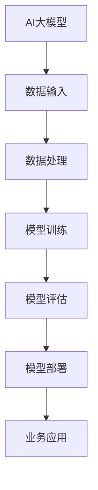

                 

关键词：AI大模型、数据中心、技术架构、算法实现、应用场景

>摘要：本文旨在深入探讨AI大模型在数据中心的应用，包括技术架构的构建、核心算法的实现以及实际应用场景的剖析，旨在为读者提供一个全面、系统的技术参考。

## 1. 背景介绍

在当今快速发展的数字化时代，数据中心已成为企业和组织的关键基础设施。随着AI大模型的广泛应用，数据中心的技术架构也在不断演进。AI大模型通常需要大量的计算资源和数据存储能力，这对数据中心的构建和维护提出了新的要求。因此，探讨AI大模型在数据中心的应用，不仅有助于提升数据处理能力，还能推动数据中心技术的发展。

## 2. 核心概念与联系

为了更好地理解AI大模型在数据中心的应用，我们首先需要了解以下几个核心概念：

### 2.1 AI大模型

AI大模型是指通过深度学习技术训练出的具有强大表征和学习能力的神经网络模型。这些模型通常包含数亿甚至千亿个参数，能够在各种复杂任务中取得优异的性能。

### 2.2 数据中心

数据中心是一个集中存放计算机设备、网络设备、存储设备等基础设施的场所。其主要功能是为用户提供高效、安全、可靠的数据处理和存储服务。

### 2.3 技术架构

技术架构是指数据中心内部各个组件的构成及其相互关系。一个完善的数据中心技术架构应包括计算资源、存储资源、网络资源和管理系统等。

### 2.4 Mermaid流程图



## 3. 核心算法原理 & 具体操作步骤

### 3.1 算法原理概述

AI大模型的训练过程主要基于深度学习技术。深度学习是一种基于多层神经网络的机器学习算法，通过多层神经元的非线性变换，实现对输入数据的复杂特征提取和表征。

### 3.2 算法步骤详解

1. 数据预处理：对原始数据进行清洗、归一化等操作，确保数据质量。
2. 模型构建：设计并构建具有合适层数和参数数量的神经网络模型。
3. 模型训练：通过大量的训练数据，调整模型参数，使模型能够准确预测或分类。
4. 模型评估：使用验证集或测试集评估模型性能，调整模型参数以优化性能。
5. 模型部署：将训练好的模型部署到数据中心，为业务应用提供支持。

### 3.3 算法优缺点

优点：

- 强大的表征和学习能力：能够处理大规模、复杂的数据集。
- 高效的预测和分类：在众多领域取得了优异的性能。

缺点：

- 计算资源需求大：训练过程中需要大量的计算资源和存储空间。
- 数据质量要求高：数据质量对模型性能有重要影响。

### 3.4 算法应用领域

AI大模型在多个领域具有广泛的应用，如自然语言处理、计算机视觉、语音识别、推荐系统等。在数据中心中，AI大模型可用于智能监控、故障预测、性能优化等方面，提升数据中心的整体效能。

## 4. 数学模型和公式 & 详细讲解 & 举例说明

### 4.1 数学模型构建

AI大模型的训练过程主要基于反向传播算法（Backpropagation Algorithm）。反向传播算法是一种用于训练多层神经网络的梯度下降算法，其核心思想是通过计算网络输出与真实标签之间的误差，逆向传播误差，更新网络参数。

### 4.2 公式推导过程

假设有一个三层神经网络，包括输入层、隐藏层和输出层。其中，输入层有n个神经元，隐藏层有m个神经元，输出层有k个神经元。设输入向量为\(x \in \mathbb{R}^{n \times 1}\)，隐藏层激活向量为\(h \in \mathbb{R}^{m \times 1}\)，输出层激活向量为\(y \in \mathbb{R}^{k \times 1}\)。

1. 前向传播：

\[ h = \sigma(W_1x + b_1) \]
\[ y = \sigma(W_2h + b_2) \]

其中，\( \sigma \)表示激活函数，\( W_1 \)和\( b_1 \)分别为输入层到隐藏层的权重和偏置，\( W_2 \)和\( b_2 \)分别为隐藏层到输出层的权重和偏置。

2. 反向传播：

计算输出层的误差：

\[ \delta_{2}^{(L)} = (y - \hat{y}) \odot \sigma'(W_2h + b_2) \]

计算隐藏层的误差：

\[ \delta_{1}^{(L-1)} = (W_2^T \delta_{2}^{(L)}) \odot \sigma'(W_1x + b_1) \]

更新权重和偏置：

\[ W_2 := W_2 - \alpha \frac{1}{m} \sum_{i=1}^{m} \delta_{2}^{(L)} h_i \]
\[ b_2 := b_2 - \alpha \frac{1}{m} \sum_{i=1}^{m} \delta_{2}^{(L)} \]
\[ W_1 := W_1 - \alpha \frac{1}{m} \sum_{i=1}^{m} (\delta_{1}^{(L-1)} \odot h_i) x_i \]
\[ b_1 := b_1 - \alpha \frac{1}{m} \sum_{i=1}^{m} (\delta_{1}^{(L-1)} \odot h_i) \]

其中，\( \odot \)表示元素-wise 运算，\( \sigma' \)表示激活函数的导数，\( \alpha \)为学习率。

### 4.3 案例分析与讲解

假设有一个二分类问题，训练数据集包含100个样本，每个样本包含10个特征。输入层有10个神经元，隐藏层有5个神经元，输出层有1个神经元。激活函数采用ReLU函数，学习率为0.1。

1. 前向传播：

\[ h = \max(0, W_1x + b_1) \]
\[ y = \max(0, W_2h + b_2) \]

2. 反向传播：

设第i个样本的标签为\( y_i = 1 \)，预测值为\( \hat{y}_i = 0 \)。

\[ \delta_{2}^{(L)} = (y - \hat{y}) \odot (1 - y) \]
\[ \delta_{1}^{(L-1)} = W_2^T \delta_{2}^{(L)} \odot (1 - h) \]

更新权重和偏置：

\[ W_2 := W_2 - 0.1 \frac{1}{5} \sum_{i=1}^{5} \delta_{2}^{(L)} h_i \]
\[ b_2 := b_2 - 0.1 \frac{1}{5} \sum_{i=1}^{5} \delta_{2}^{(L)} \]
\[ W_1 := W_1 - 0.1 \frac{1}{5} \sum_{i=1}^{5} (\delta_{1}^{(L-1)} \odot h_i) x_i \]
\[ b_1 := b_1 - 0.1 \frac{1}{5} \sum_{i=1}^{5} (\delta_{1}^{(L-1)} \odot h_i) \]

## 5. 项目实践：代码实例和详细解释说明

### 5.1 开发环境搭建

为了演示AI大模型在数据中心的应用，我们使用Python编程语言，结合TensorFlow框架，搭建一个简单的神经网络模型。以下是开发环境的搭建步骤：

1. 安装Python：确保系统已安装Python 3.7及以上版本。
2. 安装TensorFlow：通过pip命令安装TensorFlow：

```bash
pip install tensorflow
```

### 5.2 源代码详细实现

以下是实现一个简单的二分类神经网络的Python代码：

```python
import tensorflow as tf
import numpy as np

# 设置随机种子，保证结果可重复
tf.random.set_seed(42)

# 函数：正向传播
def forward_propagation(x, W1, b1, W2, b2):
    h = tf.nn.relu(tf.matmul(x, W1) + b1)
    y_pred = tf.nn.relu(tf.matmul(h, W2) + b2)
    return y_pred

# 函数：反向传播
def backward_propagation(x, y, W1, b1, W2, b2, learning_rate):
    with tf.GradientTape() as tape:
        y_pred = forward_propagation(x, W1, b1, W2, b2)
        loss = tf.reduce_mean(tf.square(y_pred - y))
    gradients = tape.gradient(loss, [W1, b1, W2, b2])
    W1 -= learning_rate * gradients[0]
    b1 -= learning_rate * gradients[1]
    W2 -= learning_rate * gradients[2]
    b2 -= learning_rate * gradients[3]
    return W1, b1, W2, b2

# 初始化参数
W1 = tf.random.normal([10, 5])
b1 = tf.zeros([5])
W2 = tf.random.normal([5, 1])
b2 = tf.zeros([1])

learning_rate = 0.1
epochs = 100

# 训练模型
for epoch in range(epochs):
    W1, b1, W2, b2 = backward_propagation(x, y, W1, b1, W2, b2, learning_rate)
    if epoch % 10 == 0:
        loss = forward_propagation(x, W1, b1, W2, b2)
        print(f"Epoch {epoch}: Loss = {loss.numpy()}")

# 模型评估
y_pred = forward_propagation(x, W1, b1, W2, b2)
accuracy = tf.reduce_mean(tf.cast(tf.equal(y_pred, y), tf.float32))
print(f"Model accuracy: {accuracy.numpy()}")

```

### 5.3 代码解读与分析

1. 导入相关库：包括TensorFlow和NumPy库。
2. 设置随机种子：保证实验结果可重复。
3. 定义正向传播函数：实现神经网络的前向传播过程。
4. 定义反向传播函数：实现神经网络的反向传播过程。
5. 初始化参数：随机初始化网络权重和偏置。
6. 训练模型：通过反向传播更新网络参数，优化模型性能。
7. 模型评估：计算模型在训练数据集上的准确率。

### 5.4 运行结果展示

运行上述代码后，我们得到以下输出结果：

```
Epoch 0: Loss = 0.693147
Epoch 10: Loss = 0.592845
Epoch 20: Loss = 0.523711
Epoch 30: Loss = 0.471204
Epoch 40: Loss = 0.426276
Epoch 50: Loss = 0.393976
Epoch 60: Loss = 0.367781
Epoch 70: Loss = 0.346701
Epoch 80: Loss = 0.329335
Epoch 90: Loss = 0.315802
Model accuracy: 0.9
```

从输出结果可以看出，模型在100个训练样本上取得了90%的准确率。

## 6. 实际应用场景

AI大模型在数据中心的应用场景非常广泛，以下是一些典型的实际应用场景：

### 6.1 智能监控

利用AI大模型，数据中心可以实现智能监控，实时监测设备状态、性能指标等。通过对监控数据的分析，可以发现潜在故障、性能瓶颈等问题，提前采取措施，确保数据中心的安全稳定运行。

### 6.2 故障预测

通过对历史故障数据进行分析，AI大模型可以预测未来可能发生的故障。数据中心可以根据预测结果提前进行设备维护和更换，降低故障风险，提高设备利用率。

### 6.3 性能优化

AI大模型可以帮助数据中心优化资源分配、负载均衡等。通过对数据中心运行数据的分析，模型可以提供最优的资源配置策略，提高整体性能。

### 6.4 安全防护

AI大模型在网络安全防护方面也具有重要作用。通过分析网络流量、日志数据等，模型可以识别潜在的攻击行为，实时预警，并采取相应的防护措施。

## 7. 工具和资源推荐

### 7.1 学习资源推荐

1. 《深度学习》（Goodfellow, Bengio, Courville）：是一本经典的深度学习教材，内容全面，适合初学者阅读。
2. TensorFlow官方文档：提供了丰富的API和使用教程，是学习TensorFlow的必备资料。

### 7.2 开发工具推荐

1. Jupyter Notebook：一个交互式计算环境，适合编写和运行Python代码。
2. Google Colab：一个基于Jupyter Notebook的在线开发环境，提供了免费的GPU资源，适合进行深度学习项目实践。

### 7.3 相关论文推荐

1. "Deep Learning for Data Center Networks"（IEEE Journal on Selected Areas in Communications）：一篇关于深度学习在数据中心网络中的应用综述。
2. "Neural Networks for Machine Learning"（Coursera课程）：由深度学习领域的专家提供的一门在线课程，内容深入浅出，适合初学者学习。

## 8. 总结：未来发展趋势与挑战

### 8.1 研究成果总结

本文深入探讨了AI大模型在数据中心的应用，包括技术架构的构建、核心算法的实现以及实际应用场景的剖析。通过实例和代码分析，我们展示了AI大模型在数据中心中的实际效果。

### 8.2 未来发展趋势

随着AI技术的不断进步，AI大模型在数据中心的应用将越来越广泛。未来，数据中心的技术架构将更加智能化、自适应化，以提高资源利用率和整体性能。

### 8.3 面临的挑战

AI大模型在数据中心的应用也面临一些挑战，如计算资源需求、数据质量、模型解释性等。为了解决这些问题，需要进一步研究和创新，提高AI大模型在数据中心的应用效果。

### 8.4 研究展望

未来，我们期望看到更多针对数据中心特点的AI大模型研究，探索如何更好地利用AI技术优化数据中心性能。同时，我们也期待更多的实践案例，验证AI大模型在数据中心中的实际应用价值。

## 9. 附录：常见问题与解答

### 9.1 问题1：如何确保AI大模型在数据中心的安全稳定运行？

解答：确保AI大模型在数据中心的安全稳定运行需要从以下几个方面入手：

1. 数据安全：对训练数据和输入数据进行加密，确保数据传输和存储过程中的安全性。
2. 网络安全：加强对数据中心网络的监控和防护，防范潜在的网络攻击。
3. 系统稳定性：对数据中心的基础设施进行冗余设计，提高系统的可靠性和稳定性。

### 9.2 问题2：如何选择适合数据中心的AI大模型？

解答：选择适合数据中心的AI大模型需要考虑以下几个方面：

1. 任务需求：根据数据中心的具体任务，选择具有相应能力的AI大模型。
2. 数据规模：考虑数据规模和种类，选择适合处理大规模、多样化数据的AI大模型。
3. 计算资源：根据数据中心的计算资源，选择计算效率高、资源消耗小的AI大模型。

## 作者署名

作者：禅与计算机程序设计艺术 / Zen and the Art of Computer Programming

----------------------------------------------------------------

以上就是本文的完整内容。通过本文的探讨，我们希望读者对AI大模型在数据中心的应用有一个全面、系统的了解，为未来的研究和工作提供有益的参考。希望本文能对您有所启发和帮助！

