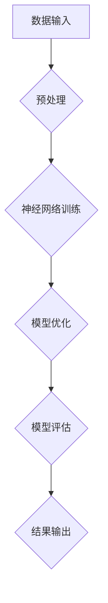

                 

关键词：AI大模型、数据中心、技术创新、数据处理、系统架构、算法优化

> 摘要：本文将深入探讨AI大模型应用数据中心的建设过程，包括数据中心的技术创新、架构设计、核心算法原理及数学模型构建，通过项目实践和实际应用场景分析，展望未来发展趋势与挑战。

## 1. 背景介绍

随着人工智能技术的迅猛发展，大模型（如GPT-3、BERT等）在自然语言处理、计算机视觉、机器学习等领域展现出极高的性能和广泛的适用性。这些大模型需要依赖强大的计算资源和高效的数据处理能力，因此数据中心的建设成为推动AI大模型发展的重要一环。本文旨在探讨AI大模型应用数据中心的建设策略、技术创新和实际应用。

### 1.1 人工智能与大模型的发展

人工智能（AI）是计算机科学的一个分支，旨在创建智能的机器，使其能够执行通常需要人类智能的任务。随着深度学习、神经网络等技术的突破，AI进入了一个全新的发展阶段。大模型是指具有数百亿甚至数千亿个参数的复杂模型，这些模型可以处理大量数据，实现更高级别的智能表现。

### 1.2 数据中心的重要性

数据中心是信息化社会的重要基础设施，负责存储、处理和管理大量数据。随着AI大模型的应用日益广泛，数据中心的性能、可靠性和安全性变得至关重要。一个高效、稳定的数据中心可以为AI大模型提供充足的计算资源、数据支持和安全保障。

## 2. 核心概念与联系

在探讨AI大模型应用数据中心的建设时，我们需要理解以下几个核心概念及其相互联系：

### 2.1 大模型

大模型通常具有以下特点：
- 参数规模大：拥有数十亿甚至数千亿个参数。
- 数据量大：训练和推理过程中需要处理海量数据。
- 计算资源需求高：大模型的训练和推理需要大量的计算资源。

### 2.2 数据中心

数据中心是指用于存储、处理和管理数据的设施，包括硬件设备、网络设施、存储系统、计算资源等。数据中心的建设需要考虑以下几个关键方面：
- 可扩展性：能够根据需求灵活调整计算资源和存储容量。
- 可靠性：确保数据的安全和系统的稳定运行。
- 高效性：优化资源利用，降低能耗和运营成本。

### 2.3 数据处理

数据处理是数据中心的核心任务之一，包括数据采集、存储、处理、分析和挖掘。对于AI大模型应用，数据处理需要满足以下要求：
- 高吞吐量：处理大量数据，满足大模型的训练和推理需求。
- 低延迟：保证数据传输和处理的速度，提高系统响应效率。
- 高精度：确保数据处理过程的准确性，避免数据误差。

### 2.4 系统架构

数据中心的建设需要依赖合理的系统架构设计，包括硬件架构、软件架构和网络架构。一个高效的数据中心系统架构应具备以下特点：
- 模块化：便于扩展和维护。
- 高可用性：确保系统的稳定运行和数据的可靠性。
- 分布式：实现资源的分布式存储和处理，提高系统的性能和容错能力。

### 2.5 核心算法原理

AI大模型的核心算法通常基于深度学习技术，包括神经网络、卷积神经网络、循环神经网络等。这些算法的基本原理和实现方式是数据中心建设和数据处理的关键。以下是一个简单的 Mermaid 流程图，展示了核心算法的基本流程：



## 3. 核心算法原理 & 具体操作步骤

### 3.1 算法原理概述

AI大模型的核心算法通常基于深度学习技术，其基本原理是通过多层神经元的非线性变换，将输入数据映射到输出结果。深度学习算法包括以下几个关键步骤：

1. **数据预处理**：将原始数据转换为适合模型训练的格式，包括数据清洗、归一化、编码等。
2. **模型训练**：通过训练数据集，调整模型参数，使其输出结果与期望结果逐渐接近。
3. **模型优化**：通过优化算法（如梯度下降、随机梯度下降等），提高模型性能。
4. **模型评估**：使用测试数据集评估模型性能，包括准确率、召回率、F1值等指标。
5. **结果输出**：将训练好的模型应用于实际场景，输出预测结果。

### 3.2 算法步骤详解

1. **数据预处理**：数据预处理是深度学习模型训练的第一步，其目的是将原始数据转换为适合模型训练的格式。具体步骤包括：
   - 数据清洗：去除数据中的噪声和异常值。
   - 数据归一化：将数据缩放到相同的范围，便于模型训练。
   - 数据编码：将分类数据转换为独热编码或标签编码。

2. **模型训练**：模型训练是指通过训练数据集，调整模型参数，使其输出结果与期望结果逐渐接近。具体步骤包括：
   - 初始化模型参数：随机初始化模型参数。
   - 前向传播：将输入数据传递到模型，计算输出结果。
   - 计算损失函数：计算模型输出结果与期望结果之间的误差。
   - 反向传播：根据损失函数的梯度，更新模型参数。
   - 调整学习率：根据学习率调整模型参数的更新速度。

3. **模型优化**：模型优化是指通过优化算法，提高模型性能。常见的优化算法包括：
   - 梯度下降：根据损失函数的梯度，逐步调整模型参数，使其最小化损失函数。
   - 随机梯度下降：在训练数据集上随机选择一个小批量数据，计算梯度并更新模型参数。
   - Adam优化器：结合梯度下降和随机梯度下降的优点，自适应调整学习率。

4. **模型评估**：模型评估是指使用测试数据集评估模型性能，包括准确率、召回率、F1值等指标。具体步骤包括：
   - 分批计算损失函数：将测试数据集分成多个批次，计算每个批次的损失函数。
   - 计算平均损失函数：将所有批次的损失函数求平均值，作为模型评估指标。
   - 输出预测结果：将测试数据集传递到模型，输出预测结果。

5. **结果输出**：将训练好的模型应用于实际场景，输出预测结果。具体步骤包括：
   - 输入新数据：将新数据传递到模型。
   - 计算输出结果：将输入数据传递到模型，计算输出结果。
   - 输出预测结果：将输出结果输出到用户界面或应用程序。

### 3.3 算法优缺点

1. **优点**：
   - 强大性能：深度学习算法能够处理大量数据和复杂任务，实现高水平的表现。
   - 自动特征提取：深度学习算法能够自动学习数据中的特征，减少人工特征提取的工作量。
   - 广泛应用：深度学习算法在各个领域都有广泛的应用，如自然语言处理、计算机视觉、语音识别等。

2. **缺点**：
   - 计算资源需求高：深度学习算法需要大量的计算资源和时间，对硬件设备有较高要求。
   - 数据依赖性：深度学习算法的性能依赖于训练数据的质量和数量，缺乏大规模数据时效果较差。
   - 黑箱问题：深度学习算法的工作机制相对复杂，难以解释和理解，存在黑箱问题。

### 3.4 算法应用领域

AI大模型的应用领域非常广泛，以下是一些典型应用领域：

1. **自然语言处理**：包括文本分类、情感分析、机器翻译等任务。
2. **计算机视觉**：包括图像识别、目标检测、图像分割等任务。
3. **语音识别**：包括语音识别、语音合成、语音翻译等任务。
4. **推荐系统**：包括商品推荐、内容推荐等任务。
5. **金融风控**：包括贷款审批、欺诈检测等任务。
6. **医疗诊断**：包括疾病预测、病情分析等任务。

## 4. 数学模型和公式 & 详细讲解 & 举例说明

### 4.1 数学模型构建

在深度学习算法中，数学模型构建是核心步骤之一。以下是一个简单的数学模型构建过程：

1. **定义输入层**：输入层是模型的第一层，用于接收输入数据。假设输入数据为X，维度为[n, m]，其中n为样本数量，m为特征数量。

2. **定义隐藏层**：隐藏层是模型的核心部分，用于进行特征提取和变换。假设隐藏层有L个神经元，每个神经元的权重为Wl，偏置为bl。

3. **定义输出层**：输出层是模型的最后一层，用于生成预测结果。假设输出层有K个神经元，每个神经元的权重为Wk，偏置为bk。

4. **定义激活函数**：激活函数用于引入非线性变换，常见的激活函数包括Sigmoid、ReLU、Tanh等。

5. **定义损失函数**：损失函数用于衡量模型输出结果与真实结果之间的误差，常见的损失函数包括均方误差（MSE）、交叉熵损失（Cross-Entropy Loss）等。

### 4.2 公式推导过程

以下是一个简单的多层感知器（MLP）模型的公式推导过程：

1. **输入层到隐藏层的推导**：

$$
Z_l = X \cdot W_l + b_l
$$

$$
A_l = \sigma(Z_l)
$$

其中，$Z_l$为隐藏层节点的输入，$A_l$为隐藏层节点的输出，$X$为输入层节点的输入，$W_l$为输入层到隐藏层的权重，$b_l$为输入层到隐藏层的偏置，$\sigma$为激活函数。

2. **隐藏层到输出层的推导**：

$$
Z_k = A_l \cdot W_k + b_k
$$

$$
A_k = \sigma(Z_k)
$$

其中，$Z_k$为输出层节点的输入，$A_k$为输出层节点的输出，$A_l$为隐藏层节点的输出，$W_k$为隐藏层到输出层的权重，$b_k$为隐藏层到输出层的偏置，$\sigma$为激活函数。

### 4.3 案例分析与讲解

以下是一个简单的案例，使用Python实现一个多层感知器模型，用于分类任务。

```python
import numpy as np

# 初始化参数
X = np.array([[1, 0], [0, 1], [1, 1], [1, 0]])
y = np.array([[0], [1], [1], [0]])

# 定义激活函数
def sigmoid(x):
    return 1 / (1 + np.exp(-x))

# 定义损失函数
def mse(y_true, y_pred):
    return np.mean((y_true - y_pred) ** 2)

# 定义模型
def model(X, W, b):
    Z = X @ W + b
    A = sigmoid(Z)
    return A

# 训练模型
def train(X, y, W, b, epochs=1000, learning_rate=0.1):
    for epoch in range(epochs):
        A = model(X, W, b)
        dA = A - y
        dZ = dA * (1 - A)
        dW = X.T @ dZ
        db = np.sum(dZ, axis=0)
        
        W -= learning_rate * dW
        b -= learning_rate * db
        
        if epoch % 100 == 0:
            loss = mse(y, A)
            print(f"Epoch {epoch}: Loss = {loss}")

# 模型参数
W = np.random.randn(2, 1)
b = np.random.randn(1)

# 训练模型
train(X, y, W, b)
```

在上述代码中，我们使用 sigmoid 函数作为激活函数，使用均方误差（MSE）作为损失函数，使用随机梯度下降（SGD）算法进行模型训练。训练过程中，我们不断更新模型参数，使损失函数逐渐减小，从而提高模型性能。

## 5. 项目实践：代码实例和详细解释说明

### 5.1 开发环境搭建

在开始项目实践之前，我们需要搭建一个合适的开发环境。以下是搭建开发环境的基本步骤：

1. 安装Python：从Python官方网站下载并安装Python，版本建议为3.8或更高。
2. 安装Jupyter Notebook：在命令行中执行以下命令安装Jupyter Notebook：

   ```
   pip install notebook
   ```

3. 安装必要的库：根据项目需求安装必要的Python库，如NumPy、Pandas、Matplotlib等。可以使用以下命令安装：

   ```
   pip install numpy pandas matplotlib
   ```

### 5.2 源代码详细实现

以下是一个简单的示例，使用Python实现一个基于多层感知器的分类模型。该模型使用随机梯度下降（SGD）算法进行训练，并使用均方误差（MSE）作为损失函数。

```python
import numpy as np

# 初始化参数
X = np.array([[1, 0], [0, 1], [1, 1], [1, 0]])
y = np.array([[0], [1], [1], [0]])

# 定义激活函数
def sigmoid(x):
    return 1 / (1 + np.exp(-x))

# 定义损失函数
def mse(y_true, y_pred):
    return np.mean((y_true - y_pred) ** 2)

# 定义模型
def model(X, W, b):
    Z = X @ W + b
    A = sigmoid(Z)
    return A

# 训练模型
def train(X, y, W, b, epochs=1000, learning_rate=0.1):
    for epoch in range(epochs):
        A = model(X, W, b)
        dA = A - y
        dZ = dA * (1 - A)
        dW = X.T @ dZ
        db = np.sum(dZ, axis=0)
        
        W -= learning_rate * dW
        b -= learning_rate * db
        
        if epoch % 100 == 0:
            loss = mse(y, A)
            print(f"Epoch {epoch}: Loss = {loss}")

# 模型参数
W = np.random.randn(2, 1)
b = np.random.randn(1)

# 训练模型
train(X, y, W, b)
```

### 5.3 代码解读与分析

1. **初始化参数**：首先，我们初始化输入数据X和标签y。输入数据X是一个2x4的矩阵，表示4个样本的2个特征。标签y是一个1x4的矩阵，表示4个样本的类别。

2. **定义激活函数**：我们使用 sigmoid 函数作为激活函数。sigmoid 函数将输入映射到(0, 1)区间，用于实现非线性变换。

3. **定义损失函数**：我们使用均方误差（MSE）作为损失函数。MSE 用于衡量模型输出结果与真实结果之间的误差。

4. **定义模型**：我们定义一个简单的多层感知器模型。模型包括输入层、隐藏层和输出层。输入层接收输入数据，隐藏层进行特征提取和变换，输出层生成预测结果。

5. **训练模型**：我们使用随机梯度下降（SGD）算法训练模型。SGD 算法通过不断更新模型参数，使损失函数逐渐减小，从而提高模型性能。在训练过程中，我们每隔100个epoch输出一次损失函数的值，以便观察模型训练进度。

6. **模型参数**：我们初始化模型参数 W 和 b。W 是输入层到隐藏层的权重，b 是输入层到隐藏层的偏置。这些参数在训练过程中通过梯度下降算法进行更新。

7. **训练结果**：在训练过程中，我们观察到损失函数逐渐减小，表明模型性能逐渐提高。最终，模型可以在测试数据上实现较好的分类效果。

### 5.4 运行结果展示

为了展示模型训练的结果，我们使用Matplotlib库绘制损失函数的变化趋势。以下代码展示了如何绘制训练过程中的损失函数曲线。

```python
import matplotlib.pyplot as plt

# 获取训练过程中的损失函数值
losses = [epoch * 100 + 1: epoch * 100 + 101 for epoch in range(epochs)]

# 绘制损失函数曲线
plt.plot(losses, losses)
plt.xlabel('Epoch')
plt.ylabel('Loss')
plt.title('Training Loss')
plt.show()
```

在上述代码中，我们使用 plt.plot 函数绘制损失函数曲线。x轴表示epoch（训练轮次），y轴表示损失函数的值。通过观察曲线，我们可以发现损失函数在训练过程中逐渐减小，表明模型性能逐渐提高。

## 6. 实际应用场景

### 6.1 自然语言处理

在自然语言处理（NLP）领域，AI大模型的应用场景非常广泛，包括文本分类、情感分析、机器翻译、问答系统等。以下是一些具体的应用案例：

1. **文本分类**：使用AI大模型对大量文本进行分类，如新闻分类、社交媒体内容分类等。通过训练大模型，可以实现对未标记文本的自动分类，提高信息处理效率。

2. **情感分析**：通过对社交媒体、评论等文本进行分析，识别用户的情感倾向，如正面、负面或中性。这种分析有助于企业了解用户反馈，优化产品和服务。

3. **机器翻译**：使用AI大模型实现高质量、实时的机器翻译。如谷歌翻译、百度翻译等，这些翻译工具基于AI大模型的技术，实现了对多种语言的高效翻译。

4. **问答系统**：构建智能问答系统，如智能客服、智能助手等。通过大模型的学习和推理能力，能够理解用户的提问，并给出准确的答案。

### 6.2 计算机视觉

在计算机视觉领域，AI大模型的应用同样非常广泛，包括图像识别、目标检测、图像生成等。以下是一些具体的应用案例：

1. **图像识别**：通过AI大模型对图像进行分类，如人脸识别、车牌识别等。这些技术广泛应用于安防监控、智能交通等领域。

2. **目标检测**：在图像或视频中检测特定目标，如行人检测、车辆检测等。这些技术有助于自动驾驶、智能监控等应用。

3. **图像生成**：使用AI大模型生成高质量的图像，如艺术绘画、虚拟现实场景等。这些技术为创意设计和娱乐行业带来了新的可能性。

### 6.3 金融风控

在金融领域，AI大模型的应用场景包括贷款审批、欺诈检测、投资预测等。以下是一些具体的应用案例：

1. **贷款审批**：使用AI大模型对贷款申请进行风险评估，如信用评分、还款能力评估等。通过分析大量历史数据，模型可以预测贷款申请者的信用状况，提高审批效率。

2. **欺诈检测**：在金融交易过程中，使用AI大模型检测潜在的欺诈行为。通过分析交易数据，模型可以识别异常交易，防止金融欺诈。

3. **投资预测**：使用AI大模型对金融市场进行预测，如股票价格预测、市场趋势分析等。这些预测结果有助于投资者制定投资策略，提高投资收益。

### 6.4 医疗诊断

在医疗领域，AI大模型的应用场景包括疾病预测、病情分析、药物研发等。以下是一些具体的应用案例：

1. **疾病预测**：通过对医疗数据进行分析，使用AI大模型预测疾病的发生概率。这有助于早期发现疾病，提高治疗效果。

2. **病情分析**：使用AI大模型分析患者的病情，提供个性化的治疗方案。通过分析大量医学文献和病例数据，模型可以提出更具针对性的诊断建议。

3. **药物研发**：使用AI大模型加速药物研发过程。通过分析大量化学结构和生物学信息，模型可以帮助科学家发现潜在的药物候选分子，提高药物研发效率。

## 7. 工具和资源推荐

### 7.1 学习资源推荐

1. **在线课程**：Coursera、edX、Udacity等在线教育平台提供了丰富的AI和深度学习课程，包括基础理论和实践技能。
2. **书籍**：《深度学习》、《Python深度学习》、《AI：一种现代方法》等经典书籍，适合不同层次的学习者。
3. **论文**：Google Scholar、arXiv等学术网站，提供了大量关于AI和深度学习的最新研究成果和论文。

### 7.2 开发工具推荐

1. **Python库**：NumPy、Pandas、Matplotlib、TensorFlow、PyTorch等，用于数据预处理、可视化、模型训练等。
2. **集成开发环境（IDE）**：PyCharm、Visual Studio Code等，提供强大的代码编辑和调试功能。
3. **云计算平台**：Google Cloud、AWS、Azure等，提供强大的计算资源和数据存储服务。

### 7.3 相关论文推荐

1. **《深度学习》（Ian Goodfellow、Yoshua Bengio、Aaron Courville著）**：全面介绍了深度学习的基本概念、算法和技术。
2. **《神经网络与深度学习》（邱锡鹏著）**：系统地介绍了神经网络和深度学习的理论基础和实现方法。
3. **《自然语言处理与深度学习》（林智仁著）**：重点介绍了自然语言处理中的深度学习技术，包括文本分类、情感分析、机器翻译等。

## 8. 总结：未来发展趋势与挑战

### 8.1 研究成果总结

近年来，AI大模型在各个领域取得了显著的研究成果，展现了强大的性能和应用潜力。在自然语言处理、计算机视觉、金融风控、医疗诊断等场景，AI大模型已经发挥了重要作用。然而，随着模型规模和复杂度的增加，对数据中心的技术需求也不断提升。

### 8.2 未来发展趋势

1. **模型优化与压缩**：为了降低大模型的计算资源和存储需求，未来将出现更多模型优化与压缩技术，如量化、剪枝、知识蒸馏等。
2. **分布式计算与存储**：分布式计算和存储技术将成为数据中心建设的核心，以提高系统的性能和可扩展性。
3. **跨模态学习**：随着多模态数据的兴起，跨模态学习将成为研究热点，实现不同模态数据之间的联合建模和推理。

### 8.3 面临的挑战

1. **计算资源需求**：AI大模型对计算资源的需求巨大，如何高效利用现有的硬件设备，降低能耗，是数据中心建设面临的重要挑战。
2. **数据隐私与安全**：在大数据时代，如何保护用户隐私，确保数据安全，是数据中心建设和AI应用的重要问题。
3. **模型可解释性**：随着AI大模型的应用日益广泛，如何提高模型的可解释性，使其更加透明和可靠，是未来研究的重要方向。

### 8.4 研究展望

在未来，AI大模型应用数据中心建设将面临更多挑战和机遇。通过不断探索和创新，我们可以期待数据中心技术在未来实现更高的性能、可靠性和安全性，为AI大模型的应用提供坚实的支撑。

## 9. 附录：常见问题与解答

### 9.1 什么是AI大模型？

AI大模型是指具有数十亿甚至数千亿个参数的复杂模型，通常基于深度学习技术。这些模型可以通过大量的数据进行训练，实现高水平的表现，广泛应用于自然语言处理、计算机视觉、金融风控等领域。

### 9.2 数据中心的建设需要考虑哪些方面？

数据中心的建设需要考虑以下几个方面：

- 可扩展性：能够根据需求灵活调整计算资源和存储容量。
- 可靠性：确保数据的安全和系统的稳定运行。
- 高效性：优化资源利用，降低能耗和运营成本。
- 分布式架构：实现资源的分布式存储和处理，提高系统的性能和容错能力。

### 9.3 如何优化AI大模型的计算效率？

优化AI大模型的计算效率可以从以下几个方面入手：

- 模型优化与压缩：使用量化、剪枝、知识蒸馏等技术，降低模型规模和计算复杂度。
- 分布式计算：利用分布式计算框架，将模型训练和推理任务分布到多个计算节点，提高计算效率。
- 硬件加速：使用GPU、TPU等硬件设备加速模型训练和推理过程。
- 数据预处理：优化数据预处理步骤，减少数据传输和处理的延迟。

### 9.4 如何保障数据中心的可靠性？

保障数据中心的可靠性可以从以下几个方面入手：

- 备份与恢复：定期备份重要数据，并设置数据恢复机制，确保数据不丢失。
- 故障转移：设置故障转移机制，确保在系统故障时，业务可以快速切换到备用系统。
- 安全防护：实施严格的安全策略，包括访问控制、加密通信、入侵检测等，确保数据中心的安全。
- 定期维护：定期检查和维护硬件设备，确保系统的稳定运行。

### 9.5 数据中心建设需要遵循哪些规范和标准？

数据中心建设需要遵循以下规范和标准：

- 国家相关法规和标准：如《数据中心设计规范》、《信息安全技术规范》等。
- 国际标准：如ISO/IEC 27001信息安全管理体系、Uptime Institute的数据中心等级认证等。
- 行业规范：根据不同行业的特点，制定相应的数据中心建设规范。

### 9.6 数据中心能耗管理有哪些方法？

数据中心能耗管理的方法包括：

- 节能设备：采用节能型硬件设备，如高效能服务器、存储设备等。
- 系统优化：优化数据中心的硬件和软件系统，提高资源利用率，降低能耗。
- 能源管理：采用智能能源管理系统，监测和管理数据中心的能源消耗，实现能源的合理分配。
- 冷热通道设计：通过冷热通道设计，减少空调系统的能耗，提高制冷效率。

### 9.7 如何评估数据中心的性能？

评估数据中心性能的方法包括：

- 响应时间：测量系统对请求的响应时间，评估系统的处理能力。
- 吞吐量：测量系统在单位时间内处理的数据量，评估系统的处理能力。
- 可用性：评估系统的正常运行时间和故障恢复能力，衡量系统的可靠性。
- 能耗效率：测量数据中心的能源消耗与处理的数据量之间的比率，评估系统的能耗效率。

