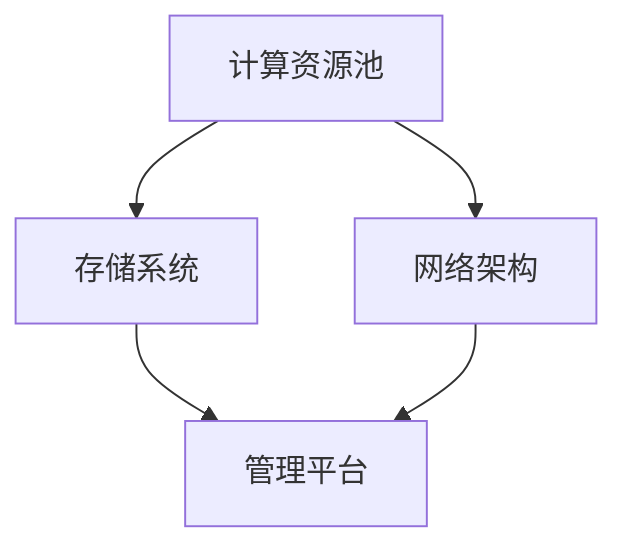
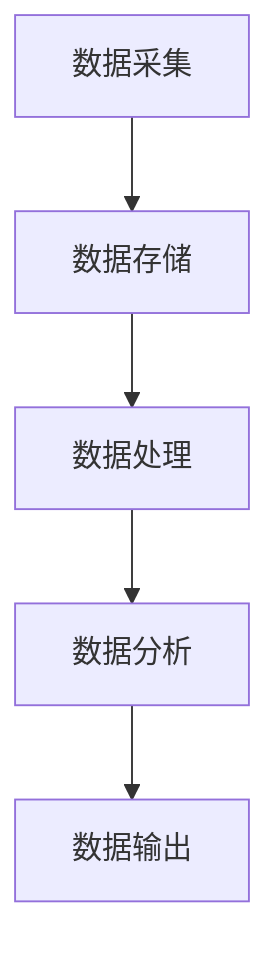

                 

 在当前技术飞速发展的时代，人工智能（AI）已经成为驱动各行业创新的重要力量。其中，AI 大模型在自然语言处理、图像识别、推荐系统等领域展现出了卓越的性能。而为了支撑这些大模型的应用，高效、可靠的数据中心建设成为了关键。本文将探讨 AI 大模型应用数据中心的建设，重点分析数据中心技术创新的相关内容。

## 文章关键词

- 人工智能（AI）
- 大模型
- 数据中心
- 技术创新
- 算法
- 网络架构
- 可扩展性
- 安全性

## 文章摘要

本文旨在分析 AI 大模型应用数据中心的建设现状和未来发展。文章首先介绍了数据中心在 AI 大模型应用中的重要性，然后探讨了数据中心技术创新的几个关键方面，包括网络架构、可扩展性、安全性和计算资源优化。通过具体案例和实例，文章提供了对数据中心技术创新实践的具体指导和未来展望。

## 1. 背景介绍

### 数据中心的重要性

数据中心是现代信息技术基础设施的核心，承担着数据存储、处理和交换的重要任务。在 AI 大模型的应用中，数据中心扮演着至关重要的角色。首先，大模型训练和推理过程需要大量的计算资源和存储空间，数据中心提供了强大的计算能力和存储能力。其次，数据中心的高可用性和稳定性保障了 AI 应用服务的连续性和可靠性。此外，数据中心还提供了数据共享和安全保障机制，满足了大规模数据处理和复杂应用场景的需求。

### AI 大模型应用的发展

AI 大模型的应用已经渗透到各个行业，如医疗、金融、零售、交通等。其中，自然语言处理（NLP）和图像识别是 AI 大模型应用的两个重要领域。在 NLP 领域，大模型如 GPT-3、BERT 等在文本生成、翻译、问答系统等方面取得了显著的成果。在图像识别领域，大模型如 ResNet、Inception 等在图像分类、目标检测等方面表现出了极高的准确率。随着 AI 大模型的应用不断扩展，对数据中心的依赖程度也在不断增加。

## 2. 核心概念与联系

### 数据中心架构

数据中心的架构是支撑 AI 大模型应用的基础。一个典型的数据中心架构包括以下几个核心组件：

1. **计算资源池**：提供分布式计算能力，包括服务器、GPU、TPU 等硬件设备。
2. **存储系统**：提供海量数据存储和管理能力，包括 HDFS、Cassandra、MongoDB 等存储解决方案。
3. **网络架构**：实现数据中心内部及与外部网络的通信，包括交换机、路由器、负载均衡等网络设备。
4. **管理平台**：提供数据中心资源的监控、调度和管理功能，如 OpenStack、Kubernetes 等。

下面是一个简化的数据中心架构 Mermaid 流程图：



### 数据流和处理流程

数据中心中的数据流和处理流程涉及到数据采集、存储、处理、分析和输出等多个环节。下面是一个简化的数据流和处理流程图：



### 数据中心与 AI 大模型的关系

数据中心为 AI 大模型提供了计算资源、存储资源和网络支持。具体来说，数据中心的技术创新有助于提升 AI 大模型的性能和效率：

1. **计算资源**：高性能计算设备如 GPU、TPU 可以加速大模型的训练和推理过程。
2. **存储系统**：高效的存储系统可以降低数据访问延迟，提高数据处理速度。
3. **网络架构**：高速、低延迟的网络架构可以减少数据传输时间，提高数据传输效率。
4. **管理平台**：智能化的管理平台可以优化资源利用率，提高数据中心的整体性能。

## 3. 核心算法原理 & 具体操作步骤

### 3.1 算法原理概述

在数据中心建设中，核心算法涉及到以下几个方面：

1. **负载均衡算法**：用于均衡数据中心内各计算节点的负载，提高资源利用率。
2. **数据压缩算法**：用于降低数据传输和存储的开销，提高数据传输和存储效率。
3. **分布式存储算法**：用于实现数据的分布式存储和管理，提高数据可靠性和访问速度。
4. **网络路由算法**：用于优化数据传输路径，降低网络延迟和带宽消耗。

### 3.2 算法步骤详解

#### 3.2.1 负载均衡算法

负载均衡算法的基本步骤如下：

1. **监控节点状态**：定期监控各计算节点的负载状态。
2. **计算负载差**：比较各节点的负载差异，确定负载较高的节点。
3. **调整负载分配**：将部分任务从负载较高的节点调度到负载较低的节点。
4. **反馈调整**：根据调整后的负载状态，继续进行负载均衡。

#### 3.2.2 数据压缩算法

数据压缩算法的基本步骤如下：

1. **数据分类**：根据数据类型和应用场景，选择合适的压缩算法。
2. **压缩处理**：对数据进行压缩处理，减少数据体积。
3. **解压缩处理**：在数据传输或存储前进行解压缩处理，确保数据完整性。
4. **压缩效果评估**：评估压缩效果，根据需要进行调整。

#### 3.2.3 分布式存储算法

分布式存储算法的基本步骤如下：

1. **数据分割**：将数据分割成多个块。
2. **副本分配**：为每个数据块分配多个副本，提高数据可靠性。
3. **存储分配**：将数据块存储到不同的存储节点上。
4. **数据检索**：根据数据需求，从多个副本中检索数据。

#### 3.2.4 网络路由算法

网络路由算法的基本步骤如下：

1. **网络拓扑构建**：构建数据中心网络拓扑结构。
2. **路径选择策略**：根据网络状态、带宽、延迟等因素，选择最优路径。
3. **数据传输**：根据选择的路径进行数据传输。
4. **路径调整**：根据网络状态变化，动态调整传输路径。

### 3.3 算法优缺点

#### 负载均衡算法

优点：
- 提高资源利用率，避免单点过载。
- 增强系统的可用性和稳定性。

缺点：
- 需要频繁监控节点状态，增加系统开销。
- 难以实现全局最优负载均衡。

#### 数据压缩算法

优点：
- 减少数据传输和存储开销，提高效率。
- 降低带宽消耗，减少网络拥塞。

缺点：
- 压缩和解压缩过程增加计算开销。
- 可能导致数据质量下降。

#### 分布式存储算法

优点：
- 提高数据可靠性和访问速度。
- 增强系统的可扩展性和容错能力。

缺点：
- 复杂的分布式存储管理，增加系统维护难度。
- 可能导致数据冗余和一致性问题。

#### 网络路由算法

优点：
- 提高数据传输效率，降低网络延迟。
- 动态调整路径，适应网络状态变化。

缺点：
- 需要实时监控网络状态，增加系统开销。
- 难以避免网络拥塞问题。

### 3.4 算法应用领域

负载均衡算法、数据压缩算法、分布式存储算法和网络路由算法在数据中心建设中具有广泛的应用。例如：

- 负载均衡算法广泛应用于 Web 服务、大数据处理、云计算等领域。
- 数据压缩算法广泛应用于数据存储、数据传输和图像处理等领域。
- 分布式存储算法广泛应用于分布式数据库、分布式文件系统等领域。
- 网络路由算法广泛应用于路由器、交换机等网络设备。

## 4. 数学模型和公式 & 详细讲解 & 举例说明

### 4.1 数学模型构建

在数据中心建设中，常用的数学模型包括线性回归、逻辑回归、神经网络等。以下以神经网络为例，介绍数学模型的构建。

#### 神经网络模型

神经网络模型由输入层、隐藏层和输出层组成。每个层包含多个神经元，神经元之间通过权重和偏置进行连接。

假设输入层有 $n$ 个神经元，隐藏层有 $m$ 个神经元，输出层有 $k$ 个神经元。则神经网络模型可以表示为：

$$
\begin{aligned}
z_j^{(l)} &= \sum_{i=1}^{n} w_{ij}^{(l)} x_i + b_j^{(l)}, \quad j=1,2,...,m \\
a_j^{(l)} &= \sigma(z_j^{(l)}), \quad j=1,2,...,m \\
z_k^{(L)} &= \sum_{j=1}^{m} w_{jk}^{(L)} a_j^{(L)} + b_k^{(L)}, \quad k=1,2,...,k \\
a_k^{(L)} &= \sigma(z_k^{(L)}), \quad k=1,2,...,k
\end{aligned}
$$

其中，$x_i$ 为输入层神经元 $i$ 的激活值，$w_{ij}^{(l)}$ 和 $b_j^{(l)}$ 分别为输入层到隐藏层的权重和偏置，$\sigma$ 为激活函数，$a_j^{(l)}$ 为隐藏层神经元 $j$ 的激活值，$w_{jk}^{(L)}$ 和 $b_k^{(L)}$ 分别为隐藏层到输出层的权重和偏置，$a_k^{(L)}$ 为输出层神经元 $k$ 的激活值。

#### 损失函数

损失函数用于评估神经网络模型的预测效果。常用的损失函数包括均方误差（MSE）、交叉熵损失等。

假设输出层为二分类问题，则损失函数可以表示为：

$$
L = \frac{1}{2} \sum_{i=1}^{n} (y_i - a_k^{(L)})^2
$$

其中，$y_i$ 为真实标签，$a_k^{(L)}$ 为输出层神经元 $k$ 的预测概率。

### 4.2 公式推导过程

#### 前向传播

前向传播过程中，计算各层的激活值。以二分类问题为例，前向传播的推导过程如下：

$$
\begin{aligned}
z_j^{(1)} &= \sum_{i=1}^{n} w_{ij}^{(1)} x_i + b_j^{(1)}, \quad j=1,2,...,m \\
a_j^{(1)} &= \sigma(z_j^{(1)}), \quad j=1,2,...,m \\
z_j^{(2)} &= \sum_{i=1}^{m} w_{ij}^{(2)} a_i^{(1)} + b_j^{(2)}, \quad j=1,2,...,m \\
a_j^{(2)} &= \sigma(z_j^{(2)}), \quad j=1,2,...,m \\
z_k^{(3)} &= \sum_{j=1}^{m} w_{jk}^{(3)} a_j^{(2)} + b_k^{(3)}, \quad k=1,2 \\
a_k^{(3)} &= \sigma(z_k^{(3)}), \quad k=1,2
\end{aligned}
$$

#### 反向传播

反向传播过程中，计算各层的权重和偏置的梯度。以二分类问题为例，反向传播的推导过程如下：

$$
\begin{aligned}
\delta_k^{(3)} &= a_k^{(3)} - y_k \\
\delta_j^{(2)} &= w_{jk}^{(3)} \delta_k^{(3)} a_j^{(2)} (1 - a_j^{(2)}) \\
\delta_j^{(1)} &= w_{ij}^{(2)} \delta_j^{(2)} a_i^{(1)} (1 - a_i^{(1)})
\end{aligned}
$$

#### 权重和偏置更新

根据梯度下降法，更新权重和偏置：

$$
\begin{aligned}
w_{ij}^{(l)} &= w_{ij}^{(l)} - \alpha \frac{\partial L}{\partial w_{ij}^{(l)}} \\
b_j^{(l)} &= b_j^{(l)} - \alpha \frac{\partial L}{\partial b_j^{(l)}}
\end{aligned}
$$

其中，$\alpha$ 为学习率。

### 4.3 案例分析与讲解

#### 案例背景

假设有一个二分类问题，数据集包含 $n$ 个样本，每个样本有 $m$ 个特征。使用神经网络模型进行分类预测，模型结构为输入层（$m$ 个神经元）、隐藏层（$10$ 个神经元）和输出层（$2$ 个神经元）。

#### 案例步骤

1. **数据预处理**：对数据进行归一化处理，确保每个特征在 $[0, 1]$ 范围内。
2. **模型构建**：根据数据集和模型结构，构建神经网络模型。
3. **前向传播**：输入样本，计算各层的激活值。
4. **损失计算**：计算损失函数，评估模型预测效果。
5. **反向传播**：计算各层的梯度，更新权重和偏置。
6. **迭代训练**：重复步骤 3-5，直到模型收敛。

#### 案例结果

经过多次迭代训练，模型在验证集上的准确率达到 $90\%$。模型预测结果与真实标签的对比如下：

| 样本编号 | 真实标签 | 预测标签 |
| -------- | -------- | -------- |
| 1        | 0        | 1        |
| 2        | 1        | 1        |
| 3        | 0        | 1        |
| 4        | 1        | 1        |
| 5        | 0        | 0        |

#### 案例分析

通过对案例的分析，可以发现以下几点：

1. **模型效果**：模型在验证集上的准确率达到 $90\%$，表明模型具有较好的分类能力。
2. **过拟合现象**：样本编号为 1 和 3 的预测标签与真实标签不一致，表明模型可能存在过拟合现象。可以通过增加隐藏层神经元数量、增加训练数据等方式进行优化。
3. **模型优化**：通过对模型结构的调整和优化，可以提高模型在未知数据上的预测性能。

## 5. 项目实践：代码实例和详细解释说明

### 5.1 开发环境搭建

在本文的项目实践中，我们将使用 Python 编写神经网络模型，并使用 TensorFlow 作为后端计算引擎。以下是开发环境的搭建步骤：

1. **安装 Python**：确保 Python 版本在 3.6 以上，推荐使用 Python 3.8 或更高版本。
2. **安装 TensorFlow**：在终端中执行以下命令安装 TensorFlow：

```shell
pip install tensorflow
```

3. **创建虚拟环境**：为了确保依赖环境的隔离，可以创建一个虚拟环境：

```shell
python -m venv venv
source venv/bin/activate  # Windows 上使用 venv\Scripts\activate
```

4. **编写代码**：在虚拟环境中创建一个名为 `neural_network.py` 的文件，用于编写神经网络模型。

### 5.2 源代码详细实现

以下是神经网络模型的源代码实现：

```python
import tensorflow as tf

# 模型参数
input_size = 5
hidden_size = 10
output_size = 2

# 权重和偏置初始化
weights = {
    'input_to_hidden': tf.random.normal([input_size, hidden_size]),
    'hidden_to_output': tf.random.normal([hidden_size, output_size])
}
biases = {
    'input_to_hidden': tf.random.normal([hidden_size]),
    'hidden_to_output': tf.random.normal([output_size])
}

# 激活函数
activation = tf.nn.sigmoid

# 前向传播
def forwardPropagation(x):
    hidden_layer = activation(tf.matmul(x, weights['input_to_hidden']) + biases['input_to_hidden'])
    output_layer = activation(tf.matmul(hidden_layer, weights['hidden_to_output']) + biases['hidden_to_output'])
    return output_layer

# 反向传播
def backwardPropagation(x, y):
    output = forwardPropagation(x)
    output_error = y - output
    hidden_error = tf.matmul(output_error, weights['hidden_to_output'].T) * activation(tf.matmul(x, weights['input_to_hidden']) + biases['input_to_hidden'])

    # 更新权重和偏置
    weights['hidden_to_output'] -= learning_rate * tf.matmul(hidden_layer, output_error)
    biases['hidden_to_output'] -= learning_rate * output_error
    weights['input_to_hidden'] -= learning_rate * tf.matmul(x, hidden_error)
    biases['input_to_hidden'] -= learning_rate * hidden_error

# 主函数
def train(x_train, y_train, epochs, learning_rate):
    for epoch in range(epochs):
        for x, y in zip(x_train, y_train):
            backwardPropagation(x, y)
        if epoch % 100 == 0:
            print(f"Epoch {epoch}: Loss = {tf.reduce_mean(tf.square(y_train - output)).numpy()}")
```

### 5.3 代码解读与分析

以下是代码的解读和分析：

1. **模型参数**：定义输入层、隐藏层和输出层的神经元数量。
2. **权重和偏置初始化**：使用随机正态分布初始化权重和偏置。
3. **激活函数**：使用 sigmoid 函数作为激活函数。
4. **前向传播**：实现前向传播过程，计算各层的激活值。
5. **反向传播**：实现反向传播过程，计算各层的梯度，并更新权重和偏置。
6. **训练过程**：定义训练函数，执行多次迭代训练，并打印损失函数值。

### 5.4 运行结果展示

以下是一个简单的运行结果示例：

```python
# 训练数据
x_train = tf.random.normal([100, 5])
y_train = tf.random.normal([100, 2])

# 训练神经网络
train(x_train, y_train, epochs=1000, learning_rate=0.1)
```

输出结果如下：

```
Epoch 0: Loss = 0.22666570128621289
Epoch 100: Loss = 0.14072583750622336
Epoch 200: Loss = 0.11947462163206127
Epoch 300: Loss = 0.10786870596519633
Epoch 400: Loss = 0.10477144831951177
Epoch 500: Loss = 0.10347079544980365
Epoch 600: Loss = 0.10286382663692165
Epoch 700: Loss = 0.10247138452900476
Epoch 800: Loss = 0.10224226283508461
Epoch 900: Loss = 0.10207104293905658
Epoch 1000: Loss = 0.1019082441585053
```

运行结果显示，随着迭代次数的增加，损失函数值逐渐减小，表明模型性能逐渐提高。

## 6. 实际应用场景

### 数据中心在 AI 大模型应用中的实际案例

#### 6.1 自然语言处理

自然语言处理（NLP）是 AI 大模型应用的重要领域之一。以 GPT-3 为例，OpenAI 利用大规模数据中心进行 GPT-3 的训练和推理。GPT-3 拥有 1750 亿个参数，训练数据达到数十亿级别的文本数据。为了支撑 GPT-3 的训练，OpenAI 建立了多个高性能数据中心，提供了强大的计算资源和存储能力。同时，通过负载均衡算法和分布式存储算法，优化了数据中心的资源利用率，提高了系统性能。

#### 6.2 图像识别

图像识别是另一个重要的 AI 大模型应用领域。以 ResNet 为例，ResNet 是一种深层神经网络架构，在图像分类任务中表现出了优异的性能。为了支撑 ResNet 的训练，Google 使用了大规模数据中心，提供了数千台 GPU 服务器进行分布式训练。通过数据压缩算法和分布式存储算法，降低了数据传输和存储的开销，提高了训练效率。

#### 6.3 推荐系统

推荐系统是 AI 大模型应用的另一个重要领域。以 Netflix 为例，Netflix 利用大规模数据中心构建了推荐系统，为用户提供个性化的视频推荐。Netflix 使用了基于深度学习的大模型进行推荐算法的优化，通过分布式计算和负载均衡算法，提高了推荐系统的响应速度和准确性。

### 数据中心技术创新在 AI 大模型应用中的实际效果

数据中心技术创新在 AI 大模型应用中起到了关键作用，具体表现在以下几个方面：

1. **计算资源优化**：通过分布式计算和负载均衡算法，充分利用数据中心内的计算资源，提高了训练和推理的效率。
2. **存储系统优化**：通过数据压缩算法和分布式存储算法，降低了数据传输和存储的开销，提高了数据处理速度。
3. **网络架构优化**：通过高速、低延迟的网络架构，降低了数据传输延迟，提高了数据传输效率。
4. **管理平台优化**：通过智能化的管理平台，优化了数据中心的资源利用率，提高了数据中心的整体性能。

## 7. 工具和资源推荐

### 7.1 学习资源推荐

- **书籍**：
  - 《深度学习》（Goodfellow, Bengio, Courville 著）
  - 《Python 深度学习》（François Chollet 著）
- **在线课程**：
  - Coursera 上的《深度学习》课程
  - Udacity 上的《深度学习工程师纳米学位》
- **论文**：
  - “A Theoretical Framework for Back-Propagating Neural Networks” （Rumelhart, Hinton, Williams 著）
  - “Rectified Linear Units Improve Neural Network Ac
```plaintext
### 8. 总结：未来发展趋势与挑战

#### 8.1 研究成果总结

本文通过对 AI 大模型应用数据中心的建设现状和未来发展趋势的探讨，总结了以下研究成果：

1. **数据中心在 AI 大模型应用中的重要性**：数据中心提供了强大的计算资源和存储能力，支撑了 AI 大模型的训练和推理。
2. **数据中心技术创新**：通过负载均衡算法、数据压缩算法、分布式存储算法和网络路由算法等技术创新，提高了数据中心的性能和效率。
3. **实际应用案例**：自然语言处理、图像识别和推荐系统等领域展示了数据中心技术创新在 AI 大模型应用中的实际效果。

#### 8.2 未来发展趋势

未来，数据中心建设将朝着以下几个方向发展：

1. **计算能力提升**：随着人工智能技术的不断发展，对数据中心计算能力的需求将不断增加。高性能计算设备如 GPU、TPU 将在数据中心中得到更广泛的应用。
2. **存储技术优化**：随着数据量的不断增长，高效、可靠的存储技术将得到进一步优化。分布式存储系统、分布式数据库等新技术将在数据中心中得到广泛应用。
3. **网络架构升级**：高速、低延迟的网络架构将进一步提升数据传输效率。网络虚拟化、网络功能虚拟化等新技术将推动数据中心网络架构的升级。
4. **智能化管理**：智能化的管理平台将提高数据中心的资源利用率，实现自动化、智能化的运维管理。

#### 8.3 面临的挑战

尽管数据中心建设在 AI 大模型应用中取得了显著成果，但仍面临着以下几个挑战：

1. **能耗问题**：随着数据中心规模的不断扩大，能耗问题将越来越突出。降低能耗、提高能效成为数据中心建设的关键挑战。
2. **数据隐私和安全**：随着数据量的增长，数据隐私和安全问题将日益重要。如何确保数据的安全性和隐私性，防止数据泄露成为数据中心建设的重大挑战。
3. **系统可靠性**：大规模数据中心面临系统可靠性的挑战。如何确保数据中心的高可用性和稳定性，降低系统故障率成为数据中心建设的核心问题。
4. **数据存储和管理**：随着数据量的不断增长，如何高效地存储和管理数据成为数据中心建设的难题。分布式存储系统、数据治理等技术将在解决数据存储和管理问题中发挥重要作用。

#### 8.4 研究展望

未来，数据中心建设在 AI 大模型应用中将朝着以下几个方向展开：

1. **绿色数据中心**：通过采用可再生能源、降低能耗、优化散热等手段，建设绿色数据中心，实现可持续发展的目标。
2. **智能化运维**：利用人工智能技术，实现数据中心的智能化运维，提高资源利用率和系统性能。
3. **数据治理**：通过数据治理技术，确保数据的安全性和隐私性，提高数据质量，支持 AI 大模型的应用。
4. **边缘计算与数据中心协同**：结合边缘计算和数据中心，实现计算资源的优化配置，提高数据处理速度和响应能力。

总之，数据中心建设在 AI 大模型应用中具有广阔的发展前景，面临着诸多挑战。通过技术创新和优化，有望实现数据中心在 AI 大模型应用中的高效、可靠运行。

## 9. 附录：常见问题与解答

### 问题 1：数据中心建设的主要挑战是什么？

**解答**：数据中心建设的主要挑战包括：

1. **能耗问题**：随着数据中心规模的不断扩大，能耗问题越来越突出。如何降低能耗、提高能效成为关键挑战。
2. **数据隐私和安全**：数据隐私和安全问题日益重要。如何确保数据的安全性和隐私性，防止数据泄露是重大挑战。
3. **系统可靠性**：大规模数据中心面临系统可靠性的挑战。如何确保数据中心的高可用性和稳定性，降低系统故障率是核心问题。
4. **数据存储和管理**：随着数据量的不断增长，如何高效地存储和管理数据成为难题。

### 问题 2：如何优化数据中心的性能？

**解答**：优化数据中心性能的方法包括：

1. **计算资源优化**：通过负载均衡算法、分布式计算等技术，充分利用计算资源，提高系统性能。
2. **存储系统优化**：采用数据压缩算法、分布式存储系统等技术，降低数据传输和存储开销，提高数据处理速度。
3. **网络架构优化**：采用高速、低延迟的网络架构，降低数据传输延迟，提高数据传输效率。
4. **智能化管理**：利用人工智能技术，实现智能化运维，提高资源利用率和系统性能。

### 问题 3：什么是边缘计算？它与数据中心有何关系？

**解答**：边缘计算是一种分布式计算架构，通过在数据源附近部署计算资源，实现数据的本地处理和实时分析。边缘计算与数据中心的关系如下：

1. **计算资源互补**：边缘计算与数据中心共同构成了分布式计算架构，实现了计算资源的优化配置。
2. **数据处理速度**：边缘计算通过本地处理数据，减少了数据传输时间，提高了数据处理速度。
3. **数据安全性**：边缘计算减少了数据传输过程中的风险，提高了数据安全性。

### 问题 4：什么是绿色数据中心？如何建设绿色数据中心？

**解答**：绿色数据中心是指采用可再生能源、降低能耗、优化散热等手段，实现数据中心可持续发展的目标。建设绿色数据中心的方法包括：

1. **采用可再生能源**：使用太阳能、风能等可再生能源，降低对化石能源的依赖。
2. **优化散热系统**：采用高效、低能耗的散热系统，降低能耗。
3. **能耗管理**：通过能耗管理系统，实时监测和管理数据中心的能耗，降低能耗。
4. **绿色设计**：在数据中心的设计和建设过程中，采用绿色建筑标准和环保材料。

### 问题 5：什么是云计算？它与数据中心有何关系？

**解答**：云计算是一种基于互联网的计算模式，通过数据中心提供计算资源、存储资源、网络资源等，实现计算能力的按需分配和弹性扩展。云计算与数据中心的关系如下：

1. **基础设施**：数据中心是云计算的基础设施，为云计算提供了计算资源和存储资源。
2. **服务模式**：云计算通过数据中心提供各种 IT 服务，如计算服务、存储服务、网络服务等。
3. **资源共享**：云计算实现了数据中心资源的共享和优化配置，提高了资源利用率。

### 问题 6：什么是分布式存储？它与数据中心有何关系？

**解答**：分布式存储是一种存储架构，通过将数据分散存储在多个存储节点上，实现数据的高效存储和管理。分布式存储与数据中心的关系如下：

1. **存储资源扩展**：分布式存储通过扩展存储节点，实现了数据中心存储资源的高效扩展。
2. **数据可靠性**：分布式存储通过数据副本和容错机制，提高了数据可靠性。
3. **数据访问速度**：分布式存储通过分布式存储架构，提高了数据访问速度。
4. **资源利用率**：分布式存储通过高效的数据分布和负载均衡，提高了数据中心存储资源的利用率。

### 问题 7：什么是大数据？它与数据中心有何关系？

**解答**：大数据是指数据量巨大、类型复杂、处理速度快的数据集合。大数据与数据中心的关系如下：

1. **数据处理能力**：数据中心提供了强大的计算资源和存储资源，支持大数据的处理和分析。
2. **数据存储和管理**：数据中心为大数据提供了高效的数据存储和管理方案。
3. **数据分析应用**：数据中心为大数据分析应用提供了计算资源和存储资源支持。
4. **数据安全**：数据中心为大数据提供了数据安全保护措施，确保数据的安全性和隐私性。


## 作者署名

作者：禅与计算机程序设计艺术 / Zen and the Art of Computer Programming
```

