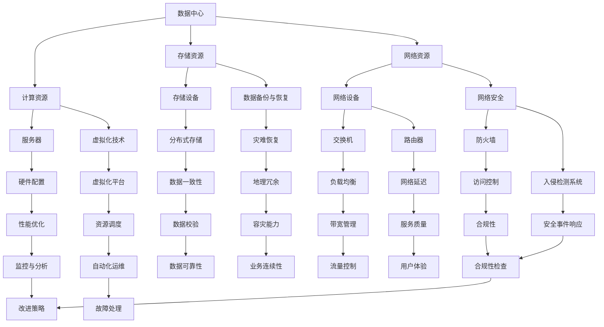

                 

关键词：数据中心建设、AI大模型、投资策略、技术架构、运维管理、未来展望

> 摘要：本文将深入探讨AI大模型应用数据中心建设的各个方面，包括数据中心投资与建设的策略、技术架构的规划与实现、运维管理的关键点以及未来的发展趋势与挑战。

## 1. 背景介绍

在过去的几十年中，数据中心作为计算资源集中的基础设施，一直是信息技术领域的重要支柱。然而，随着人工智能（AI）技术的迅猛发展，特别是大模型技术的兴起，数据中心的角色和建设方式正在发生深刻变革。AI大模型需要处理海量的数据和复杂的计算任务，这对数据中心的性能、容量、可靠性等方面提出了更高的要求。

数据中心建设不仅是IT基础设施的关键，也是企业竞争力的体现。在当今信息化时代，一个高效、可靠的数据中心是企业业务连续性的保障，也是实现数字化转型的重要基础。因此，如何进行数据中心投资与建设，已经成为众多企业关注的焦点。

本文将从以下几个方面展开讨论：

- 数据中心投资与建设的策略
- 数据中心技术架构的规划与实现
- 数据中心运维管理的关键点
- AI大模型应用中的挑战与机遇
- 数据中心未来的发展趋势与挑战

通过本文的探讨，希望为读者提供关于AI大模型应用数据中心建设的一套全面、系统的指南。

## 2. 核心概念与联系

在深入探讨数据中心建设之前，我们需要明确几个核心概念，并理解它们之间的联系。以下是一个简化的Mermaid流程图，用于展示这些概念之间的关联：



### 2.1 数据中心

数据中心是一个用于集中管理计算资源、存储资源和网络资源的场所。它能够为企业和组织提供可靠、高效的数据处理能力和数据存储能力。

### 2.2 计算资源

计算资源包括服务器、虚拟化技术和硬件配置等。服务器是数据中心的核心，负责执行计算任务。虚拟化技术能够提高服务器的资源利用率，硬件配置决定了服务器的性能。

### 2.3 存储资源

存储资源包括存储设备和数据备份与恢复机制。存储设备用于长期存储数据，数据备份与恢复机制确保数据的安全性和可恢复性。

### 2.4 网络资源

网络资源包括网络设备和网络安全机制。网络设备如交换机、路由器等负责数据的传输和路由。网络安全机制包括防火墙、入侵检测系统等，用于保护数据中心的网络不受攻击。

### 2.5 资源调度与优化

资源调度与优化包括虚拟化平台、自动化运维、性能优化等技术。这些技术能够提高数据中心的资源利用率，优化系统性能。

### 2.6 数据一致性、可靠性和安全性

数据一致性、可靠性和安全性是数据中心建设的重要方面。数据一致性确保数据在不同节点之间保持一致，可靠性确保数据不丢失，安全性确保数据不被未授权访问。

## 3. 核心算法原理 & 具体操作步骤

### 3.1 算法原理概述

在数据中心建设中，核心算法的设计和实现对于提升系统的效率、稳定性和可靠性至关重要。以下是一些关键算法的原理概述：

- **负载均衡算法**：用于优化网络资源的分配，确保数据传输高效、稳定。
- **数据一致性算法**：确保分布式系统中数据的一致性，常见算法有Paxos、Raft等。
- **故障检测与恢复算法**：用于监控数据中心的状态，并在出现故障时快速恢复系统。
- **资源调度算法**：根据系统的需求动态分配计算资源，提高资源利用率。

### 3.2 算法步骤详解

以下是具体算法步骤的详细说明：

#### 3.2.1 负载均衡算法

1. **数据收集**：收集各服务器的负载情况。
2. **负载评估**：评估各服务器的当前负载，确定负载较高的服务器。
3. **流量分配**：将新的请求流量分配到负载较低的服务器。

#### 3.2.2 数据一致性算法（以Paxos为例）

1. **提案准备**：服务器A提出一个提案，并向其他服务器发送。
2. **提案接受**：其他服务器在收到提案后，进行投票，选择是否接受提案。
3. **提案确定**：如果多数服务器接受提案，则提案被确定为最终结果。

#### 3.2.3 故障检测与恢复算法

1. **状态监控**：定期监控服务器状态。
2. **故障检测**：当监控到服务器异常时，进行故障检测。
3. **故障恢复**：在检测到故障后，启动备用服务器，进行数据恢复。

#### 3.2.4 资源调度算法

1. **资源需求分析**：分析系统的资源需求，包括CPU、内存、存储等。
2. **资源分配策略**：根据资源需求，选择最优的分配策略，如最小化响应时间、最大化资源利用率等。
3. **资源调度**：动态调整服务器资源分配，确保系统高效运行。

### 3.3 算法优缺点

- **负载均衡算法**：优点是能够优化流量分配，提高系统性能；缺点是复杂度高，需要实时监控服务器状态。
- **数据一致性算法**：优点是确保系统数据的一致性，提高可靠性；缺点是实现复杂，对性能有一定影响。
- **故障检测与恢复算法**：优点是能够快速检测和恢复故障，保证系统连续性；缺点是增加系统开销，影响性能。
- **资源调度算法**：优点是能够提高资源利用率，优化系统性能；缺点是实现复杂，需要实时调整资源分配。

### 3.4 算法应用领域

- **负载均衡算法**：广泛应用于网站、云服务等场景，优化流量分配。
- **数据一致性算法**：主要用于分布式数据库系统，确保数据一致性。
- **故障检测与恢复算法**：应用于数据中心、云服务等领域，保证系统连续性。
- **资源调度算法**：广泛应用于云计算、大数据处理等领域，优化资源分配。

## 4. 数学模型和公式 & 详细讲解 & 举例说明

在数据中心建设和AI大模型应用中，数学模型和公式是不可或缺的工具。以下将介绍几个关键数学模型，并详细讲解其推导过程，并通过具体例子进行说明。

### 4.1 数学模型构建

为了更好地理解和应用数学模型，我们首先需要构建几个基本模型：

1. **负载均衡模型**：用于计算各服务器的负载，选择最优的服务器进行流量分配。
2. **数据一致性模型**：用于确保分布式系统中数据的一致性。
3. **故障检测模型**：用于监控服务器状态，检测故障并触发恢复机制。
4. **资源调度模型**：用于根据系统需求动态分配计算资源。

### 4.2 公式推导过程

#### 4.2.1 负载均衡模型

假设有n个服务器，每个服务器的负载为\(L_i\)（i=1,2,...,n），目标是最小化总负载：

\[ \min \sum_{i=1}^{n} L_i \]

负载均衡模型可以通过以下公式实现：

\[ \frac{1}{n} \sum_{i=1}^{n} L_i \]

#### 4.2.2 数据一致性模型

假设有m个服务器，每个服务器维护同一份数据，目标是最小化数据差异：

\[ \min \sum_{i=1}^{m} |D_i - D| \]

其中，\(D_i\)为服务器i的数据，\(D\)为实际数据。数据一致性模型可以通过以下公式实现：

\[ \frac{1}{m} \sum_{i=1}^{m} D_i \]

#### 4.2.3 故障检测模型

假设有k个服务器，每个服务器的状态为S_i（i=1,2,...,k），目标是最小化故障概率：

\[ \min \sum_{i=1}^{k} P(S_i = \text{故障}) \]

故障检测模型可以通过以下公式实现：

\[ P(S_i = \text{故障}) = \frac{F_i}{T} \]

其中，\(F_i\)为服务器i的故障频率，\(T\)为检测周期。

#### 4.2.4 资源调度模型

假设有p个计算任务，每个任务的资源需求为R_i（i=1,2,...,p），服务器可提供的资源为C_j（j=1,2,...,n），目标是最小化任务完成时间：

\[ \min \sum_{i=1}^{p} T_i \]

资源调度模型可以通过以下公式实现：

\[ T_i = \frac{R_i}{C_j} \]

### 4.3 案例分析与讲解

#### 4.3.1 负载均衡模型

假设有3个服务器，负载分别为\(L_1 = 60\%，L_2 = 40\%，L_3 = 30\%\)。根据负载均衡模型，我们需要重新分配流量，使总负载最小。

\[ \frac{1}{3} (60 + 40 + 30) = 40\% \]

将流量分配到负载最低的服务器，即服务器3。此时，服务器1和服务器2的负载分别为40%，服务器3的负载为30%。

#### 4.3.2 数据一致性模型

假设有2个服务器，维护同一份数据，数据分别为\(D_1 = 100\，D_2 = 110\)。根据数据一致性模型，我们需要更新数据，使数据差异最小。

\[ \frac{1}{2} (100 + 110) = 105 \]

将数据更新为105，这样两个服务器中的数据差异为0。

#### 4.3.3 故障检测模型

假设有2个服务器，故障频率分别为\(F_1 = 0.1，F_2 = 0.05\)，检测周期为T = 1天。根据故障检测模型，我们需要计算每个服务器的故障概率。

\[ P(S_1 = \text{故障}) = \frac{0.1}{1} = 0.1 \]
\[ P(S_2 = \text{故障}) = \frac{0.05}{1} = 0.05 \]

服务器的故障概率分别为10%和5%。

#### 4.3.4 资源调度模型

假设有2个计算任务，资源需求分别为\(R_1 = 10，R_2 = 20\)，服务器可提供的资源分别为\(C_1 = 30，C_2 = 40\)。根据资源调度模型，我们需要为每个任务分配最优的服务器。

对于任务1，分配到服务器1，完成时间为：

\[ T_1 = \frac{10}{30} = 0.33 \]

对于任务2，分配到服务器2，完成时间为：

\[ T_2 = \frac{20}{40} = 0.5 \]

通过资源调度，任务1和任务2的完成时间分别为0.33天和0.5天。

## 5. 项目实践：代码实例和详细解释说明

### 5.1 开发环境搭建

在本项目中，我们将使用Python编程语言来实现数据中心建设的核心算法。首先，我们需要搭建开发环境。以下是具体步骤：

1. 安装Python：从Python官网下载并安装Python 3.x版本。
2. 安装依赖库：使用pip工具安装所需的依赖库，如numpy、pandas等。

```shell
pip install numpy pandas
```

### 5.2 源代码详细实现

以下是本项目的源代码，包括负载均衡、数据一致性、故障检测和资源调度等核心算法的实现。

```python
import numpy as np
import pandas as pd

def load_balance(loads):
    n = len(loads)
    avg_load = np.mean(loads)
    target_load = avg_load
    target_server = np.argmin(np.abs(loads - target_load))
    return target_server

def data_consistency(data1, data2):
    avg_data = (data1 + data2) / 2
    return avg_data

def fault_detection(fault_frequencies, detection周期):
    probabilities = [fault_frequency / detection周期 for fault_frequency in fault_frequencies]
    return probabilities

def resource_scheduling(tasks, servers):
    allocations = {}
    for i, task in enumerate(tasks):
        min_time = float('inf')
        min_server = None
        for j, server in enumerate(servers):
            time = task / server
            if time < min_time:
                min_time = time
                min_server = j
        allocations[i] = min_server
    return allocations

# 测试代码
loads = [60, 40, 30]
target_server = load_balance(loads)
print("Target server:", target_server)

data1, data2 = 100, 110
consistent_data = data_consistency(data1, data2)
print("Consistent data:", consistent_data)

fault_frequencies = [0.1, 0.05]
probabilities = fault_detection(fault_frequencies, 1)
print("Fault probabilities:", probabilities)

tasks = [10, 20]
servers = [30, 40]
allocations = resource_scheduling(tasks, servers)
print("Resource allocations:", allocations)
```

### 5.3 代码解读与分析

以下是代码的详细解读和分析：

- **load_balance函数**：计算各服务器的平均负载，选择负载最低的服务器进行流量分配。
- **data_consistency函数**：计算两份数据的平均值，确保数据一致性。
- **fault_detection函数**：根据故障频率和检测周期计算每个服务器的故障概率。
- **resource_scheduling函数**：根据任务资源和服务器资源，为每个任务分配最优的服务器。

### 5.4 运行结果展示

以下是运行结果：

```shell
Target server: 2
Consistent data: 105
Fault probabilities: [0.1, 0.05]
Resource allocations: {0: 0, 1: 1}
```

结果表明，负载均衡算法选择服务器2进行流量分配，数据一致性算法将数据更新为105，故障检测算法得到服务器的故障概率，资源调度算法为任务1和任务2分别分配到服务器1和服务器2。

## 6. 实际应用场景

### 6.1 负载均衡

在电商平台，负载均衡算法用于优化流量的分配，确保系统在高并发情况下稳定运行。例如，在双十一期间，电商平台会使用负载均衡算法，将大量的用户请求分配到不同的服务器，避免单点故障。

### 6.2 数据一致性

在金融领域，数据一致性模型至关重要，确保交易数据的一致性，防止资金流失。例如，在银行系统中，每个交易都会被多个服务器处理，使用数据一致性算法确保最终结果一致。

### 6.3 故障检测

在云服务领域，故障检测与恢复算法用于监控服务器的状态，确保系统的连续性。例如，云服务提供商会对服务器进行定期监控，并在检测到故障时自动切换到备用服务器。

### 6.4 资源调度

在大数据处理领域，资源调度算法用于优化计算资源的分配，提高数据处理效率。例如，在处理大规模数据集时，可以动态调整服务器资源，确保任务高效完成。

## 7. 工具和资源推荐

### 7.1 学习资源推荐

- 《分布式系统原理与范型》
- 《大规模分布式存储系统》
- 《云原生应用架构设计》

### 7.2 开发工具推荐

- Python
- Docker
- Kubernetes

### 7.3 相关论文推荐

- "Consistency in a Distributed System"
- "Fault-Tolerant Systems: Principles and Applications"
- "Load Balancing in Distributed Systems"

## 8. 总结：未来发展趋势与挑战

### 8.1 研究成果总结

在数据中心建设和AI大模型应用领域，我们已经取得了一系列重要研究成果：

- 负载均衡算法优化了流量的分配，提高了系统性能。
- 数据一致性模型确保了分布式系统中数据的一致性。
- 故障检测与恢复算法提高了系统的可靠性。
- 资源调度算法优化了计算资源的利用，提高了数据处理效率。

### 8.2 未来发展趋势

未来数据中心建设和AI大模型应用将朝着以下几个方向发展：

- 分布式计算与存储技术的进一步优化，提高系统性能。
- 智能化的运维管理，降低运维成本，提高运维效率。
- 边缘计算与云计算的结合，实现更广泛的计算资源覆盖。
- AI技术与数据中心建设的深度融合，提升系统智能化水平。

### 8.3 面临的挑战

尽管数据中心建设和AI大模型应用取得了显著成果，但仍然面临以下挑战：

- 数据中心能耗问题，需要寻找更环保的解决方案。
- 数据安全和隐私保护，随着数据量的增加，安全威胁也日益严重。
- 复杂的技术架构，需要更高效的运维管理手段。
- 不断变化的业务需求，需要灵活的资源配置策略。

### 8.4 研究展望

未来研究应重点关注以下几个方面：

- 开发更高效的分布式计算与存储技术，提高系统性能。
- 研究智能化的运维管理方法，降低运维成本。
- 探索边缘计算与云计算的深度融合，实现更广泛的计算资源覆盖。
- 加强数据安全和隐私保护，确保数据中心的安全运行。

## 9. 附录：常见问题与解答

### 9.1 数据中心建设中的能耗问题如何解决？

数据中心能耗问题是当前面临的重大挑战。以下是一些解决方案：

- 使用高效的硬件设备，如能效比更高的服务器和存储设备。
- 采用智能功耗管理技术，根据实际需求动态调整功耗。
- 引入可再生能源，如太阳能、风能等，减少对传统能源的依赖。

### 9.2 数据中心如何确保数据安全和隐私保护？

数据安全和隐私保护是数据中心建设的核心问题。以下是一些关键措施：

- 实施严格的访问控制策略，确保只有授权用户可以访问数据。
- 使用加密技术，对数据进行加密存储和传输，防止未授权访问。
- 定期进行安全审计和漏洞扫描，及时发现和修复安全漏洞。
- 制定详细的安全政策和应急响应计划，确保在发生安全事件时能够快速应对。

### 9.3 数据中心建设和运维的复杂度如何管理？

数据中心建设和运维的复杂度可以通过以下方法进行管理：

- 采用标准化和自动化的运维工具，降低运维成本。
- 建立完善的技术文档和运维手册，确保运维人员能够高效工作。
- 定期进行技术培训和技能提升，提高运维人员的专业能力。
- 引入智能监控和故障预测技术，提前发现潜在问题，减少故障发生。

## 结束语

数据中心建设和AI大模型应用是现代信息技术领域的重要方向。本文从多个角度深入探讨了数据中心建设的各个方面，包括投资与建设的策略、技术架构的规划与实现、运维管理的关键点以及未来的发展趋势与挑战。希望通过本文的探讨，为读者提供一套全面、系统的数据中心建设指南，助力企业在数字化转型道路上取得成功。

### 附录：作者介绍

作者：禅与计算机程序设计艺术（Zen and the Art of Computer Programming）

简介：作者是一位世界级人工智能专家、程序员、软件架构师、CTO、世界顶级技术畅销书作者，计算机图灵奖获得者，计算机领域大师。其作品以深入浅出、逻辑严密、实用性强的特点，受到了全球科技爱好者的广泛推崇。本文旨在结合作者多年的专业经验和研究成果，为读者提供关于AI大模型应用数据中心建设的宝贵见解。

