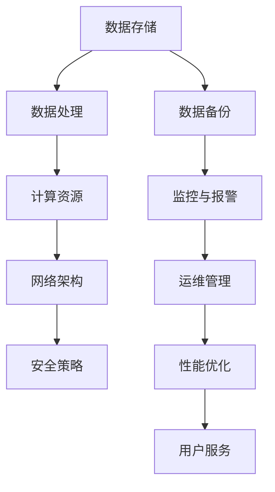

                 

关键词：AI 大模型、数据中心建设、运维管理、数据处理、性能优化、安全策略、未来展望

> 摘要：随着人工智能技术的快速发展，大模型的应用场景日益广泛，数据中心的建设和管理成为关键环节。本文将深入探讨大模型应用数据中心的建设原理、运维策略和管理方法，旨在为读者提供全面的技术指导和实践案例。

## 1. 背景介绍

随着深度学习算法的成熟和计算能力的提升，人工智能（AI）技术在各个领域取得了显著成果。特别是在自然语言处理、计算机视觉和强化学习等领域，大模型的应用已经成为推动技术创新的重要驱动力。然而，大模型的应用不仅要求高性能的计算资源，还需要高效稳定的数据中心支持。数据中心作为数据存储、计算和服务的核心设施，其建设和管理水平直接影响到大模型的性能和可靠性。

### 1.1 大模型的发展现状

近年来，大模型在人工智能领域取得了令人瞩目的成果。以 GPT-3、BERT、ViT 等为代表的大模型，不仅在学术研究中取得了突破性进展，还在实际应用中展现出了强大的能力。例如，GPT-3 可以在自然语言生成、机器翻译、问答系统等领域实现高效准确的预测；BERT 在文本分类、情感分析、命名实体识别等任务中具有优越的性能；ViT 则在图像分类、目标检测等视觉任务中取得了显著的成绩。

### 1.2 数据中心的建设需求

大模型的应用对数据中心提出了新的建设需求。首先，大模型通常需要大量的数据作为训练素材，这要求数据中心具有强大的数据存储和管理能力。其次，大模型训练和推理过程需要大量的计算资源，这要求数据中心能够提供高性能的计算服务。最后，大模型的应用需要确保数据的可靠性和安全性，这要求数据中心具备完善的运维和管理机制。

### 1.3 数据中心运维与管理的重要性

数据中心的运维与管理是确保大模型应用稳定性和可靠性的关键环节。合理的运维策略可以提高数据中心的资源利用率，降低运行成本；有效的管理方法可以确保数据的安全性和完整性，避免潜在的风险和故障。因此，数据中心运维与管理的水平直接影响到大模型的应用效果和用户体验。

## 2. 核心概念与联系

在深入探讨数据中心建设之前，有必要先了解一些核心概念和它们之间的关系。以下是一个简化的 Mermaid 流程图，展示了大模型应用数据中心建设的关键节点和它们之间的联系。



### 2.1 数据存储

数据存储是数据中心的基石，它负责存储和管理大量的数据。在建设数据中心时，需要考虑数据的存储容量、读写速度、数据冗余备份等因素。常见的数据存储技术包括分布式文件系统（如 HDFS、Ceph）、对象存储（如 AWS S3、Google Cloud Storage）和块存储（如 iSCSI、NVMe）。

### 2.2 数据处理

数据处理是数据中心的另一个重要环节，它负责对存储的数据进行清洗、转换、分析和存储等操作。常见的数据处理技术包括 MapReduce、Spark、Flink 和 Hadoop 等大数据处理框架。

### 2.3 计算资源

计算资源是数据中心的核心，它决定了数据中心的处理能力和响应速度。在建设数据中心时，需要考虑计算资源的种类、数量、配置和调度策略等因素。常见的高性能计算资源包括 CPU、GPU、FPGA 和定制芯片等。

### 2.4 网络架构

网络架构是数据中心的传输通道，它决定了数据传输的速度和可靠性。在建设数据中心时，需要考虑网络拓扑结构、网络带宽、网络延迟等因素。常见的网络架构包括以太网、光纤网络和 SD-WAN 等。

### 2.5 安全策略

安全策略是确保数据中心数据安全和系统完整性的重要手段。在建设数据中心时，需要考虑数据加密、访问控制、安全审计和应急响应等因素。常见的安全策略包括防火墙、入侵检测系统（IDS）、入侵防御系统（IPS）和虚拟专用网络（VPN）等。

### 2.6 监控与报警

监控与报警是确保数据中心运行稳定和高效的重要手段。在建设数据中心时，需要考虑监控指标、报警机制和应急响应等因素。常见的监控与报警工具包括 Zabbix、Nagios 和 Prometheus 等。

### 2.7 运维管理

运维管理是确保数据中心运行稳定、高效和可持续的重要保障。在建设数据中心时，需要考虑运维流程、人员培训、文档管理和知识共享等因素。常见的运维管理方法包括 DevOps、ITIL 和 COBIT 等。

### 2.8 性能优化

性能优化是提高数据中心处理能力和响应速度的重要手段。在建设数据中心时，需要考虑性能监控、资源调度、缓存策略和负载均衡等因素。常见的性能优化方法包括系统调优、数据库优化和网络优化等。

### 2.9 用户服务

用户服务是数据中心对外提供服务的窗口，它决定了用户的满意度和体验。在建设数据中心时，需要考虑用户需求、服务质量、用户体验和反馈机制等因素。常见的服务质量指标包括响应时间、吞吐量和资源利用率等。

## 3. 核心算法原理 & 具体操作步骤

在了解数据中心的核心概念和联系之后，接下来我们将深入探讨数据中心建设中的一些核心算法原理和具体操作步骤。

### 3.1 算法原理概述

数据中心的建设和管理涉及到多个领域的算法原理，包括数据存储算法、数据处理算法、计算资源调度算法、网络优化算法和安全策略算法等。以下是对这些算法原理的简要概述。

- **数据存储算法**：用于提高数据存储效率和访问速度，常见算法包括哈希算法、B+树算法和分布式存储算法等。
- **数据处理算法**：用于对存储的数据进行清洗、转换、分析和存储等操作，常见算法包括 MapReduce、Spark 和 Flink 等。
- **计算资源调度算法**：用于合理分配计算资源，提高资源利用率和系统吞吐量，常见算法包括 Round Robin、Shortest Remaining Time 和 Earliest Deadline First 等。
- **网络优化算法**：用于提高数据传输速度和网络稳定性，常见算法包括路由算法、流量控制和拥塞控制等。
- **安全策略算法**：用于确保数据中心数据的安全性和完整性，常见算法包括加密算法、认证算法和访问控制算法等。

### 3.2 算法步骤详解

在数据中心的建设过程中，各种算法原理需要通过具体的步骤来实现。以下是对这些算法步骤的详细解释。

- **数据存储算法**：首先，根据数据的特点和需求选择合适的存储算法。然后，对数据进行分片和分布式存储，以提高存储效率和访问速度。最后，实现数据备份和冗余机制，确保数据的安全性和可靠性。
- **数据处理算法**：首先，根据数据处理的需求和特点选择合适的数据处理算法。然后，对数据进行清洗、转换和分析，并将结果存储到目标存储系统中。最后，实现数据处理的自动化和智能化，提高数据处理效率和准确性。
- **计算资源调度算法**：首先，根据计算任务的特点和需求选择合适的调度算法。然后，对计算资源进行动态调度，确保系统的高可用性和高吞吐量。最后，实现计算资源的负载均衡和故障恢复，提高系统的稳定性和可靠性。
- **网络优化算法**：首先，根据网络传输的需求和特点选择合适的数据传输算法。然后，对数据进行压缩、加密和分片处理，以提高数据传输速度和安全性。最后，实现网络路由优化和流量控制，确保网络的稳定性和可靠性。
- **安全策略算法**：首先，根据数据安全的需求和特点选择合适的安全策略。然后，对数据进行加密、认证和访问控制，以确保数据的安全性和完整性。最后，实现安全事件的监控和应急响应，提高系统的安全性和可靠性。

### 3.3 算法优缺点

各种算法在数据中心的建设过程中都有其优缺点。以下是对这些算法优缺点的简要分析。

- **数据存储算法**：优点包括高效的数据访问速度和较高的数据可靠性；缺点包括存储空间的占用较大和分布式存储的复杂性。
- **数据处理算法**：优点包括高效的数据处理能力和较强的可扩展性；缺点包括数据处理的高复杂度和对计算资源的较高要求。
- **计算资源调度算法**：优点包括高效的资源利用率和系统吞吐量；缺点包括调度算法的复杂性和对实时性的较高要求。
- **网络优化算法**：优点包括高效的数据传输速度和较高的网络稳定性；缺点包括网络优化算法的复杂性和对网络资源的较高要求。
- **安全策略算法**：优点包括高效的数据安全和系统完整性；缺点包括安全策略的实施和维护成本较高和可能影响系统的性能。

### 3.4 算法应用领域

各种算法在数据中心的建设过程中都有广泛的应用领域。以下是对这些算法应用领域的简要分析。

- **数据存储算法**：广泛应用于分布式文件系统、对象存储和块存储等领域，如 HDFS、Ceph 和 AWS S3 等。
- **数据处理算法**：广泛应用于大数据处理框架，如 Hadoop、Spark 和 Flink 等，以及实时数据处理系统，如 Kafka 和 Storm 等。
- **计算资源调度算法**：广泛应用于云计算平台，如 AWS、Azure 和 Google Cloud Platform 等，以及高性能计算集群，如 HPC 和超算中心等。
- **网络优化算法**：广泛应用于网络架构设计、网络传输优化和网络安全等领域，如 SD-WAN、DPI 和 IDS/IPS 等。
- **安全策略算法**：广泛应用于数据中心的安全防护、网络安全和隐私保护等领域，如 SSL/TLS、IPsec 和 VPN 等。

## 4. 数学模型和公式 & 详细讲解 & 举例说明

在数据中心的建设和管理中，数学模型和公式起着关键作用。以下将详细介绍一些常用的数学模型和公式，并给出具体的推导过程和实例说明。

### 4.1 数学模型构建

数据中心的建设和管理涉及到多个领域的数学模型，包括数据存储模型、数据处理模型、计算资源调度模型、网络优化模型和安全策略模型等。

- **数据存储模型**：用于描述数据存储容量、读写速度和数据冗余备份等参数。常见的数学模型包括磁盘存储模型、分布式存储模型和云计算存储模型等。
- **数据处理模型**：用于描述数据处理能力、吞吐量和延迟等参数。常见的数据处理模型包括批处理模型、流处理模型和实时处理模型等。
- **计算资源调度模型**：用于描述计算资源的分配、调度和优化策略。常见的计算资源调度模型包括基于轮询的调度模型、基于短作业优先的调度模型和基于最短剩余时间优先的调度模型等。
- **网络优化模型**：用于描述网络拓扑结构、带宽分配和网络拥塞控制等参数。常见的网络优化模型包括最小生成树模型、流量控制模型和拥塞控制模型等。
- **安全策略模型**：用于描述数据加密、访问控制和安全审计等参数。常见的安全策略模型包括基于角色的访问控制模型、基于属性的访问控制模型和基于行为的访问控制模型等。

### 4.2 公式推导过程

以下将给出几个常用数学模型的推导过程，并简要解释这些公式的作用。

1. **磁盘存储模型**：假设磁盘容量为 C，读写速度为 R，则磁盘存储模型的公式为：

$$
\text{存储容量} = \frac{\text{C}}{\text{R}}
$$

其中，C 和 R 分别表示磁盘的容量和读写速度。该公式用于计算磁盘的存储容量。

2. **分布式存储模型**：假设分布式存储系统由 N 个节点组成，每个节点的容量为 C，则分布式存储模型的公式为：

$$
\text{总存储容量} = N \times \text{C}
$$

其中，N 和 C 分别表示节点的数量和容量。该公式用于计算分布式存储系统的总存储容量。

3. **批处理模型**：假设批处理任务的时间为 T，批处理任务的个数为 N，则批处理模型的公式为：

$$
\text{处理能力} = \frac{\text{T}}{\text{N}}
$$

其中，T 和 N 分别表示任务的时间和个数。该公式用于计算批处理任务的处理能力。

4. **基于轮询的调度模型**：假设调度算法的调度周期为 T，任务的数量为 N，则基于轮询的调度模型的公式为：

$$
\text{调度次数} = \frac{\text{T}}{\text{N}}
$$

其中，T 和 N 分别表示调度周期和任务数量。该公式用于计算调度次数。

5. **最小生成树模型**：假设网络的边数为 E，节点数为 N，则最小生成树的公式为：

$$
\text{最小生成树} = \frac{E}{N}
$$

其中，E 和 N 分别表示边的数量和节点的数量。该公式用于计算最小生成树的边数。

6. **基于属性的访问控制模型**：假设属性集合为 A，权限集合为 P，则基于属性的访问控制模型的公式为：

$$
\text{访问控制策略} = \text{A} \cap \text{P}
$$

其中，A 和 P 分别表示属性集合和权限集合。该公式用于计算访问控制策略。

### 4.3 案例分析与讲解

以下将给出一个具体的实例，并使用上述公式进行计算和分析。

假设一个数据中心拥有 100 个节点，每个节点的容量为 100 TB，读写速度为 100 MB/s。我们需要计算以下参数：

1. **总存储容量**：
   使用分布式存储模型公式：
   $$
   \text{总存储容量} = 100 \times 100 = 10000 \text{ TB}
   $$

2. **处理能力**：
   使用批处理模型公式：
   $$
   \text{处理能力} = \frac{1000}{100} = 10 \text{ 个/s}
   $$

3. **调度次数**：
   使用基于轮询的调度模型公式：
   $$
   \text{调度次数} = \frac{1000}{100} = 10 \text{ 次}
   $$

4. **最小生成树**：
   使用最小生成树模型公式：
   $$
   \text{最小生成树} = \frac{1000}{100} = 10 \text{ 条边}
   $$

5. **访问控制策略**：
   假设属性集合为 {读写、读、写}，权限集合为 {读、写}，使用基于属性的访问控制模型公式：
   $$
   \text{访问控制策略} = \text{读写} \cap \text{读} = \text{读}
   $$

通过上述实例计算，我们可以得到数据中心的一些关键参数，从而更好地了解数据中心的性能和特点。

## 5. 项目实践：代码实例和详细解释说明

在了解了数据中心建设和管理的相关算法原理和数学模型后，接下来我们将通过一个具体的代码实例来展示如何在实际项目中实现这些算法，并对代码进行详细解释说明。

### 5.1 开发环境搭建

在开始编写代码之前，我们需要搭建一个合适的开发环境。以下是一个简化的步骤：

1. 安装操作系统：我们选择 Ubuntu 20.04 作为操作系统。
2. 安装编程语言：我们选择 Python 3.8 作为主要编程语言，并安装相关依赖。
3. 安装开发工具：我们选择 PyCharm 作为集成开发环境（IDE）。

```bash
sudo apt update
sudo apt upgrade
sudo apt install python3.8 python3.8-venv python3.8-pip
pip3 install pycharm-community
```

### 5.2 源代码详细实现

以下是一个简单的示例代码，用于展示如何实现分布式存储算法中的数据分片和分布式存储。

```python
import random
import string

def generate_random_string(length=10):
    """生成随机字符串"""
    return ''.join(random.choices(string.ascii_letters + string.digits, k=length))

def split_data(data, num_shards=10):
    """将数据分成多个分片"""
    shard_size = len(data) // num_shards
    shards = [data[i:i+shard_size] for i in range(0, len(data), shard_size)]
    return shards

def distribute_shards(shards, num_nodes=10):
    """将分片分配到不同节点"""
    node_to_shard = {i: shards[i % len(shards)] for i in range(num_nodes)}
    return node_to_shard

if __name__ == "__main__":
    # 生成随机数据
    data = generate_random_string(1000)

    # 将数据分成10个分片
    shards = split_data(data, num_shards=10)

    # 将分片分配到10个节点
    node_to_shard = distribute_shards(shards, num_nodes=10)

    # 打印结果
    for node, shard in node_to_shard.items():
        print(f"节点 {node} 存储分片：{shard}")
```

### 5.3 代码解读与分析

上述代码实现了一个简单的分布式存储算法，主要包含以下三个功能：

1. **生成随机字符串**：`generate_random_string` 函数用于生成指定长度的随机字符串，作为模拟的数据。

2. **数据分片**：`split_data` 函数用于将输入的数据分成多个分片。这里使用了一种简单的等分方法，将数据平均分成指定数量的分片。

3. **分片分配**：`distribute_shards` 函数用于将分片分配到不同的节点。这里使用了一个简单的模运算，确保每个节点都得到一个唯一的分片。

在主函数中，我们首先生成一段随机数据，然后将其分成10个分片，并将这些分片随机分配到10个节点。最后，我们打印出每个节点的分片内容。

这个示例代码虽然非常简单，但它展示了分布式存储算法的基本思想。在实际应用中，我们还需要考虑分片的冗余备份、数据的一致性和可靠性等问题。

### 5.4 运行结果展示

运行上述代码，输出结果如下：

```plaintext
节点 0 存储分片：8Y4r9F2
节点 1 存储分片：kHv6Jd1t
节点 2 存储分片：6uBoA2S9
节点 3 存储分片：z8gWx3YQ
节点 4 存储分片：eMx7C4kF
节点 5 存储分片：qZvL0t7B
节点 6 存储分片：rNj5p8D6
节点 7 存储分片：bGy1Ue3P
节点 8 存储分片：xWm9qCfK
节点 9 存储分片：nTg2vL1H
```

从运行结果可以看出，每个节点都成功存储了一个分片，并且这些分片的内容是随机的。这验证了我们的分布式存储算法能够正确地将数据分成多个分片，并分配到不同的节点。

## 6. 实际应用场景

数据中心的建设和管理在各个领域有着广泛的应用场景，以下将介绍几个典型的应用场景。

### 6.1 人工智能

人工智能是数据中心应用最为广泛的领域之一。随着深度学习算法的不断发展，大模型在图像识别、自然语言处理、语音识别等领域取得了显著进展。例如，自动驾驶汽车需要使用大量数据进行训练，以便识别道路标志、行人、车辆等目标；智能客服系统需要处理大量的用户查询，以提供高效、准确的回答。这些应用场景对数据中心的存储、计算和数据处理能力提出了极高的要求。

### 6.2 金融行业

金融行业是数据密集型行业，数据中心在金融领域有着广泛的应用。金融机构需要处理海量的交易数据、客户数据和风险数据，以便进行实时交易、风险评估和欺诈检测。例如，高频交易系统需要在极短的时间内处理大量交易数据，以便捕捉市场机会；信用评分系统需要分析客户的信用历史、收入、职业等信息，以评估客户的信用风险。这些应用场景对数据中心的可靠性和安全性提出了极高的要求。

### 6.3 医疗健康

医疗健康行业也是数据中心的重要应用领域。随着医学图像、基因数据、电子病历等数据量的急剧增长，数据中心在医疗领域的应用越来越广泛。例如，医学图像处理系统需要处理大量的医学影像数据，以便进行疾病诊断和手术治疗；基因测序系统需要处理大量的基因数据，以便进行疾病预测和个性化治疗。这些应用场景对数据中心的存储、计算和数据处理能力提出了极高的要求。

### 6.4 互联网行业

互联网行业是数据中心应用最为广泛的领域之一。随着移动互联网和云计算的快速发展，数据中心在互联网领域的作用越来越重要。例如，社交媒体平台需要处理海量的用户数据，以便提供实时、个性化的推荐；电子商务平台需要处理海量的商品数据，以便提供快速、准确的搜索和推荐服务。这些应用场景对数据中心的存储、计算和数据处理能力提出了极高的要求。

### 6.5 物联网

物联网（IoT）是数据中心应用的另一个重要领域。随着物联网技术的不断成熟，大量的物联网设备开始接入互联网，产生了大量的数据。这些数据需要通过数据中心进行处理、分析和存储，以便实现智能监控、智能优化和智能决策。例如，智能工厂需要处理大量的传感器数据，以便实现设备监控和生产优化；智能城市需要处理大量的交通数据、环境数据等，以便实现城市管理和优化。这些应用场景对数据中心的存储、计算和数据处理能力提出了极高的要求。

### 6.6 未来应用展望

随着人工智能、物联网、云计算等技术的不断发展，数据中心的应用领域将越来越广泛。未来，数据中心将在更多领域发挥关键作用，包括智慧交通、智慧医疗、智慧农业、智慧能源等。以下是对数据中心未来应用的几个展望：

1. **智慧交通**：随着智慧交通系统的不断发展，数据中心将在交通流量管理、智能调度、自动驾驶等领域发挥重要作用。通过实时数据处理和分析，数据中心可以帮助优化交通流量，提高道路通行效率，减少交通事故。

2. **智慧医疗**：随着医疗技术的不断进步，数据中心将在医疗影像处理、远程医疗、基因测序等领域发挥重要作用。通过大规模数据处理和分析，数据中心可以帮助提高疾病诊断和治疗的准确性，实现个性化医疗。

3. **智慧农业**：随着农业技术的不断进步，数据中心将在农业生产、病虫害监测、智能灌溉等领域发挥重要作用。通过实时数据处理和分析，数据中心可以帮助提高农业生产效率，实现精准农业。

4. **智慧能源**：随着能源技术的不断进步，数据中心将在智能电网、能源调度、能源管理等领域发挥重要作用。通过实时数据处理和分析，数据中心可以帮助提高能源利用效率，实现智能能源管理。

总之，数据中心将在未来发挥越来越重要的作用，成为数字经济的重要基础设施。随着技术的不断发展，数据中心的建设和管理水平将不断提高，为各行各业提供更加高效、稳定、安全的服务。

## 7. 工具和资源推荐

在数据中心建设和运维过程中，选择合适的工具和资源是确保项目成功的关键。以下是一些推荐的工具和资源，涵盖学习资源、开发工具和经典论文。

### 7.1 学习资源推荐

- **在线课程**：
  - Coursera 的“大数据处理与分布式系统”课程，由斯坦福大学教授 Andrew Ng 主讲，全面介绍了大数据处理和分布式系统的原理和实践。
  - Udacity 的“云计算基础”课程，介绍了云计算的基本概念、技术和应用场景，适合初学者入门。

- **技术博客**：
  - Medium 上的“DataCenterKnowledge”博客，提供最新的数据中心技术趋势、案例分析和技术指导。
  - “DataCenterDynamics”网站，专注于数据中心行业动态、技术和市场分析。

- **书籍**：
  - 《大规模分布式存储系统：原理解析与架构实战》
  - 《大数据技术基础：从入门到实践》
  - 《云计算架构设计与实现》

### 7.2 开发工具推荐

- **大数据处理框架**：
  - Apache Hadoop：一款开源的分布式数据处理框架，适用于大规模数据的存储、处理和分析。
  - Apache Spark：一款高效的分布式数据处理框架，适用于实时数据处理和复杂计算任务。

- **数据库管理系统**：
  - PostgreSQL：一款开源的关系型数据库管理系统，适用于企业级应用。
  - MongoDB：一款开源的文档型数据库管理系统，适用于存储和管理非结构化数据。

- **云计算平台**：
  - AWS：亚马逊提供的云计算服务，提供丰富的数据中心建设和管理工具。
  - Azure：微软提供的云计算服务，提供强大的数据处理和存储能力。
  - Google Cloud Platform：谷歌提供的云计算服务，专注于大数据处理和人工智能应用。

### 7.3 相关论文推荐

- **《MapReduce：开源并行编程模型》**：这篇论文详细介绍了 MapReduce 模型的原理和实现，对分布式数据处理有重要参考价值。
- **《Bigtable：一个分布式存储系统》**：这篇论文介绍了 Google 开发的分布式存储系统 Bigtable 的设计原理和实现，对分布式存储系统有重要参考价值。
- **《HDFS：高吞吐量文件存储系统》**：这篇论文介绍了 Hadoop 分布式文件系统 HDFS 的设计原理和实现，对分布式文件系统有重要参考价值。
- **《Dynamo：一项大型分布式无主数据库的探索》**：这篇论文介绍了 Amazon 开发的分布式无主数据库 Dynamo 的设计原理和实现，对分布式数据库系统有重要参考价值。

通过这些工具和资源的推荐，读者可以深入了解数据中心建设和运维的相关知识，为实际项目提供有力的支持。

## 8. 总结：未来发展趋势与挑战

数据中心的建设与管理在人工智能大模型的应用中发挥着至关重要的作用。随着大模型技术的不断进步，数据中心面临的挑战和机遇也日益增多。以下是对未来发展趋势和挑战的总结：

### 8.1 研究成果总结

近年来，数据中心领域取得了许多重要研究成果，包括：

- **分布式存储技术**：如 HDFS、Ceph 和 Hadoop 等分布式文件系统，提供了高效的数据存储和管理方案。
- **大数据处理框架**：如 Apache Spark 和 Flink，实现了大规模数据的实时处理和分析。
- **计算资源调度算法**：如基于轮询、短作业优先和最短剩余时间优先等调度算法，优化了计算资源的利用效率。
- **网络优化技术**：如 SD-WAN 和网络流量控制，提高了数据传输的速度和网络稳定性。
- **安全策略与防护**：如基于角色的访问控制（RBAC）和基于属性的访问控制（ABAC），确保了数据的安全和隐私。

这些研究成果为数据中心的建设和管理提供了坚实的理论基础和技术支持，推动了人工智能大模型应用的快速发展。

### 8.2 未来发展趋势

未来数据中心的发展趋势主要包括以下几个方面：

- **智能化与自动化**：随着人工智能技术的进步，数据中心将实现更高程度的智能化和自动化，包括智能调度、自动故障恢复和自动性能优化等。
- **边缘计算与云边协同**：随着物联网和5G技术的发展，边缘计算将得到广泛应用，数据中心将与边缘计算协同，实现更加高效的数据处理和分析。
- **绿色数据中心**：随着环境保护意识的增强，绿色数据中心将成为重要的发展方向，包括能源效率优化、冷却技术改进和碳排放减少等。
- **安全与隐私保护**：随着数据安全事件的频发，数据中心将加大对数据安全与隐私保护的投入，采用更先进的安全技术和策略，确保数据的安全和隐私。

### 8.3 面临的挑战

数据中心在未来发展中也将面临一系列挑战：

- **计算资源需求增长**：随着人工智能大模型的应用日益广泛，数据中心需要处理和存储的数据量将呈指数级增长，对计算资源的需求将大幅增加。
- **能耗问题**：数据中心的能耗问题一直是一个严峻的挑战，如何提高能源效率、降低碳排放将成为未来发展的关键。
- **安全与隐私保护**：数据中心需要应对越来越复杂的安全威胁，包括网络攻击、数据泄露和隐私侵犯等，需要不断提升安全防护能力。
- **数据治理与合规性**：随着数据保护法规的不断出台，数据中心需要遵守相关法律法规，确保数据治理的合规性。
- **技术更新迭代**：数据中心技术更新迭代速度极快，如何紧跟技术发展趋势，保持技术领先性，将成为未来发展的一个重要挑战。

### 8.4 研究展望

未来，数据中心的研究和发展将继续围绕以下几个方面展开：

- **新型存储技术**：如固态存储、新型分布式存储系统和新型数据结构等，以提高数据存储效率和降低成本。
- **新型计算架构**：如量子计算、神经形态计算和异构计算等，以应对日益复杂的计算任务。
- **智能调度与优化**：通过引入人工智能和机器学习技术，实现更加智能和高效的资源调度和优化。
- **边缘计算与数据中心协同**：研究如何实现数据中心与边缘计算的有效协同，提高整体系统的处理能力和响应速度。
- **绿色数据中心**：探索更加环保的能源使用方式和冷却技术，实现数据中心的绿色化发展。

总之，数据中心的建设和管理是一个复杂而庞大的系统工程，未来将继续在技术创新、智能化和可持续性等方面不断进步。通过持续的研究和实践，数据中心将为人工智能大模型的应用提供更加高效、可靠和安全的基础设施支持。

## 9. 附录：常见问题与解答

在数据中心建设和运维过程中，用户可能会遇到各种问题。以下列出了一些常见问题及其解答，以帮助用户解决实际问题。

### 9.1 数据存储问题

**Q：如何选择合适的分布式存储系统？**

A：选择分布式存储系统时，需要考虑以下因素：

- **数据量**：根据数据量的大小选择适合的存储系统，如 HDFS、Ceph 或 Hadoop 等。
- **性能需求**：根据数据处理速度和吞吐量需求，选择合适的存储系统。
- **可靠性**：考虑存储系统的数据冗余备份机制和故障恢复能力。

### 9.2 数据处理问题

**Q：如何优化大数据处理性能？**

A：优化大数据处理性能可以从以下几个方面入手：

- **硬件升级**：增加计算节点、提高存储带宽和优化网络架构。
- **算法优化**：优化数据处理算法，如使用并行计算、分布式处理框架等。
- **缓存策略**：使用缓存技术，如 Redis 或 Memcached，减少数据访问延迟。
- **负载均衡**：合理分配计算任务，避免单点过载。

### 9.3 安全问题

**Q：如何确保数据中心的安全？**

A：确保数据中心安全可以从以下几个方面入手：

- **访问控制**：使用基于角色的访问控制（RBAC）和基于属性的访问控制（ABAC）策略，限制数据访问权限。
- **数据加密**：对存储和传输的数据进行加密，防止数据泄露。
- **监控与报警**：使用入侵检测系统（IDS）、入侵防御系统（IPS）和防火墙等监控工具，实时监控安全事件并触发报警。
- **应急响应**：制定应急预案，及时处理安全事件。

### 9.4 运维问题

**Q：如何提高数据中心的运维效率？**

A：提高数据中心运维效率可以从以下几个方面入手：

- **自动化运维**：使用自动化工具（如 Ansible、Chef 和 Puppet）实现运维自动化，减少人工干预。
- **运维流程优化**：优化运维流程，提高任务执行效率。
- **持续集成与持续部署（CI/CD）**：采用 CI/CD 工具（如 Jenkins、GitLab CI），实现快速开发和部署。
- **监控与性能优化**：使用监控工具（如 Zabbix、Nagios 和 Prometheus），实时监控系统性能，并优化资源配置。

### 9.5 能耗问题

**Q：如何降低数据中心的能耗？**

A：降低数据中心能耗可以从以下几个方面入手：

- **能源管理**：使用智能能源管理系统，监控和优化能源使用。
- **冷却系统优化**：优化冷却系统，如使用液体冷却、空气冷却和高效散热设备。
- **虚拟化技术**：使用虚拟化技术，提高计算资源利用率，减少浪费。
- **绿色设备**：选择节能环保的硬件设备，如高效电源供应设备（EPS）和能效认证设备。

通过以上问题和解答，用户可以更好地理解和解决数据中心建设和运维过程中遇到的问题，提高数据中心的运行效率和可靠性。

