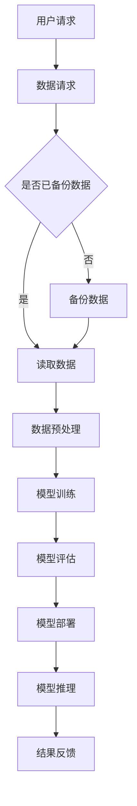

                 

## 1. 背景介绍

在当今数字化的时代，人工智能（AI）技术正以前所未有的速度发展。特别是大模型（Large Models），如GPT-3、BERT等，它们在自然语言处理（NLP）、计算机视觉（CV）和语音识别等领域展现出了卓越的性能。这些大模型不仅需要强大的计算资源，还需要稳定的数据中心来进行训练和推理。因此，AI大模型应用数据中心的建设和运营管理变得至关重要。

数据中心是现代信息技术基础设施的核心，它为各种行业提供数据存储、处理和传输服务。对于AI大模型的应用，数据中心不仅需要提供足够的计算资源，还需要保证数据的安全性和稳定性。本文将深入探讨AI大模型应用数据中心的建设、运营和管理，包括其核心概念、算法原理、数学模型、项目实践、应用场景、未来展望以及相关工具和资源推荐。

本文将分为以下章节：

- **1. 背景介绍**：介绍AI大模型应用数据中心建设的背景和重要性。
- **2. 核心概念与联系**：阐述AI大模型应用数据中心的核心概念，并使用Mermaid流程图展示其架构。
- **3. 核心算法原理 & 具体操作步骤**：详细讲解AI大模型的核心算法原理和操作步骤。
- **4. 数学模型和公式 & 详细讲解 & 举例说明**：介绍AI大模型所涉及的数学模型和公式，并进行案例分析。
- **5. 项目实践：代码实例和详细解释说明**：提供AI大模型应用的代码实例和解释。
- **6. 实际应用场景**：探讨AI大模型在不同领域的应用场景。
- **7. 未来应用展望**：预测AI大模型在未来的发展趋势和应用。
- **8. 工具和资源推荐**：推荐学习和开发AI大模型的工具和资源。
- **9. 总结：未来发展趋势与挑战**：总结研究成果，展望未来发展趋势和面临的挑战。
- **10. 附录：常见问题与解答**：回答读者可能遇到的问题。

通过本文的阅读，读者将能够全面了解AI大模型应用数据中心的建设和管理，为实际应用提供理论指导和实践参考。

<|user|>## 2. 核心概念与联系

在探讨AI大模型应用数据中心的建设之前，我们需要明确一些核心概念，并了解这些概念之间的联系。以下是对数据中心、AI大模型、计算资源和数据管理等方面的介绍，以及如何将这些元素整合起来，形成一个高效、稳定的数据处理平台。

### 数据中心（Data Center）

数据中心是信息技术基础设施的关键组成部分，它集成了计算、存储、网络和其他相关资源，用于支持各种业务和服务。数据中心的主要功能包括数据存储、数据处理、数据传输以及数据安全。

#### 数据中心的组成部分

- **计算资源（Compute Resources）**：包括服务器、虚拟机、容器等，用于处理和运行应用程序。
- **存储资源（Storage Resources）**：包括硬盘、SSD、NAS、SAN等，用于数据存储。
- **网络资源（Network Resources）**：包括交换机、路由器、防火墙等，用于数据传输和网络安全。
- **冷却系统（Cooling Systems）**：用于维持设备正常运行所需的温度。
- **电力供应（Power Supply）**：确保数据中心设备持续供电。

#### 数据中心的分类

- **企业数据中心（Enterprise Data Centers）**：由企业自行建设和管理，用于支持内部业务。
- **公共数据中心（Public Data Centers）**：由第三方提供商建设和管理，为多个企业提供服务。
- **混合云数据中心（Hybrid Cloud Data Centers）**：结合私有云和公共云的优势，提供灵活的数据处理和存储服务。

### AI大模型（AI Large Models）

AI大模型是指具有数亿甚至数千亿参数的深度学习模型，如GPT-3、BERT等。这些模型通过大规模数据训练，能够实现高效的自然语言理解和生成、图像识别和生成等任务。

#### AI大模型的特点

- **大规模参数**：AI大模型拥有庞大的参数量，能够捕捉数据的复杂特征。
- **高计算需求**：训练和推理AI大模型需要大量计算资源，尤其是高性能的GPU和TPU。
- **数据处理能力**：AI大模型能够处理海量数据，提高数据处理和分析的效率。

### 计算资源（Compute Resources）

计算资源是数据中心的核心，对于AI大模型的应用尤为关键。计算资源主要包括CPU、GPU、TPU等，它们决定了模型的训练和推理速度。

#### 计算资源的分类

- **CPU（Central Processing Unit）**：传统计算机的核心处理器，适合运行通用计算任务。
- **GPU（Graphics Processing Unit）**：专门用于图形处理的芯片，但在深度学习训练中也被广泛应用。
- **TPU（Tensor Processing Unit）**：专为深度学习设计的芯片，能够显著提高训练和推理速度。

### 数据管理（Data Management）

数据管理是数据中心运营的重要组成部分，包括数据的存储、备份、恢复和安全性。

#### 数据管理的任务

- **数据存储**：选择合适的数据存储方案，确保数据的高效存储和快速访问。
- **数据备份**：定期备份数据，防止数据丢失或损坏。
- **数据恢复**：在数据丢失或损坏时，能够迅速恢复数据。
- **数据安全**：确保数据在存储、传输和处理过程中的安全性。

### 核心概念联系

数据中心、AI大模型、计算资源和数据管理是相互关联的。数据中心提供了AI大模型所需的计算资源和数据存储环境，而AI大模型则通过高效的计算和数据处理能力，实现了数据中心的业务目标。计算资源是数据中心的核心，决定了AI大模型的训练和推理效率。数据管理则保障了数据的完整性和安全性，为AI大模型的应用提供了可靠的基础。

#### Mermaid流程图

下面是一个简化的Mermaid流程图，展示了AI大模型应用数据中心的核心概念和架构：



通过这个流程图，我们可以看到用户请求、数据请求、模型训练、模型评估、模型部署和模型推理等关键步骤，以及数据备份和预处理等支持性步骤。

综上所述，AI大模型应用数据中心的建设和管理是一个复杂的过程，涉及多个核心概念和元素的整合。理解这些概念和它们之间的联系，是构建高效、稳定数据中心的基础。

## 3. 核心算法原理 & 具体操作步骤

### 3.1 算法原理概述

AI大模型的核心算法是基于深度学习的神经网络（Neural Networks），尤其是基于变换器模型（Transformer）的架构。这种架构通过自注意力机制（Self-Attention Mechanism）和多头注意力机制（Multi-Head Attention Mechanism）等创新性设计，能够在大规模数据集上进行高效训练和推理。

#### 自注意力机制（Self-Attention）

自注意力机制是一种计算方法，它使模型能够自动关注数据序列中的关键部分。在自注意力机制中，每个输入向量都会与自身以及其他输入向量进行加权求和，从而生成新的特征表示。这种机制能够捕捉到数据序列中的长距离依赖关系，从而提高模型的表示能力和预测准确性。

#### 多头注意力机制（Multi-Head Attention）

多头注意力机制是在自注意力机制的基础上发展起来的，它将输入序列分成多个子序列，每个子序列分别进行自注意力计算。通过这种方式，模型可以同时关注不同子序列中的不同信息，从而提高模型的灵活性和泛化能力。

### 3.2 算法步骤详解

AI大模型的训练和推理过程可以分为以下几个步骤：

#### 3.2.1 数据预处理

数据预处理是AI大模型训练的第一步，包括数据清洗、去噪、归一化和分词等操作。

- **数据清洗**：去除无效数据和异常值，确保数据的准确性和完整性。
- **去噪**：去除噪声数据，提高模型的鲁棒性。
- **归一化**：将数据缩放到相同范围，以便模型更好地学习。
- **分词**：将文本数据分解成词或子词，为后续处理提供基础。

#### 3.2.2 模型训练

模型训练是通过梯度下降（Gradient Descent）等优化算法，不断调整模型的参数，使其在训练数据上达到最佳性能。

- **输入数据**：将预处理后的数据输入到模型中。
- **前向传播（Forward Propagation）**：计算输入数据的特征表示，并生成预测结果。
- **损失函数（Loss Function）**：计算预测结果与真实结果之间的差距，以评估模型性能。
- **反向传播（Backpropagation）**：计算损失函数关于模型参数的梯度，并更新模型参数。

#### 3.2.3 模型评估

模型评估是通过验证集（Validation Set）和测试集（Test Set）来评估模型的泛化能力和性能。

- **验证集**：用于调整模型参数和选择最佳模型。
- **测试集**：用于最终评估模型的性能，以防止过拟合（Overfitting）。

#### 3.2.4 模型推理

模型推理是在实际应用中，将新的数据输入到已经训练好的模型中，并生成预测结果。

- **输入数据**：将新的数据输入到模型中。
- **特征提取**：通过模型中的多层网络结构，提取数据的特征表示。
- **预测生成**：根据特征表示，生成预测结果。

### 3.3 算法优缺点

#### 优点

- **高效性**：变换器模型（Transformer）能够在大规模数据集上进行高效训练和推理。
- **灵活性**：多头注意力机制（Multi-Head Attention）使得模型能够灵活地关注不同子序列中的信息。
- **可解释性**：模型中的注意力机制使得模型的决策过程具有一定的可解释性。

#### 缺点

- **计算资源需求大**：AI大模型的训练和推理需要大量计算资源，尤其是GPU和TPU。
- **数据依赖性**：模型的性能高度依赖于训练数据的质量和多样性，数据质量问题可能导致模型过拟合（Overfitting）。

### 3.4 算法应用领域

AI大模型在多个领域都有广泛的应用，以下是其中的一些主要领域：

- **自然语言处理（NLP）**：包括机器翻译、文本生成、情感分析等。
- **计算机视觉（CV）**：包括图像分类、目标检测、图像生成等。
- **语音识别（ASR）**：包括语音识别、语音合成等。
- **推荐系统**：包括商品推荐、新闻推荐等。
- **医疗诊断**：包括疾病诊断、医学图像分析等。

通过上述内容，我们可以看到AI大模型的核心算法原理及其在数据处理和实际应用中的重要性。了解这些算法原理和操作步骤，对于数据中心的建设和运营管理具有重要意义，有助于构建高效、稳定的AI应用环境。

## 4. 数学模型和公式 & 详细讲解 & 举例说明

### 4.1 数学模型构建

AI大模型，尤其是基于变换器模型（Transformer）的架构，涉及多种数学模型和公式。下面我们将详细讲解其中几个关键的数学模型，并使用LaTeX格式进行展示。

#### 4.1.1 自注意力机制（Self-Attention）

自注意力机制是变换器模型的核心部分。其基本公式如下：

$$
\text{Self-Attention}(Q, K, V) = \text{softmax}\left(\frac{QK^T}{\sqrt{d_k}}\right) V
$$

其中：
- \(Q\) 是查询向量（Query），代表当前序列中的每个元素。
- \(K\) 是键向量（Key），代表序列中的每个元素。
- \(V\) 是值向量（Value），代表序列中的每个元素。
- \(d_k\) 是键向量的维度。

#### 4.1.2 多头注意力机制（Multi-Head Attention）

多头注意力机制通过将输入序列分成多个子序列，每个子序列独立进行自注意力计算。其公式如下：

$$
\text{Multi-Head Attention}(Q, K, V) = \text{Concat}(\text{head}_1, \text{head}_2, ..., \text{head}_h)W^O
$$

其中：
- \(h\) 是头数（Number of Heads）。
- \(\text{head}_i\) 表示第 \(i\) 个头的结果。
- \(W^O\) 是输出线性变换权重。

#### 4.1.3 位置编码（Positional Encoding）

为了保留序列中的位置信息，变换器模型引入了位置编码。位置编码的公式如下：

$$
PE_{(i,j)} = \text{sin}\left(\frac{i}{10000^{2j/d}}\right) \text{ 或 } \text{cos}\left(\frac{i}{10000^{2j/d}}\right)
$$

其中：
- \(i\) 是位置索引。
- \(j\) 是维度索引。
- \(d\) 是位置编码的维度。

### 4.2 公式推导过程

变换器模型中的自注意力机制和多头注意力机制的核心在于如何有效地计算注意力权重，从而在序列中提取关键信息。以下是自注意力机制的推导过程：

#### 4.2.1 权重计算

设 \(Q, K, V\) 分别是查询向量、键向量和值向量，它们的维度都是 \(d\)。首先，计算每个查询向量与所有键向量的点积：

$$
\text{ Scores } = QK^T
$$

然后，对每个点积结果进行归一化，得到注意力权重：

$$
\text{Attention Weights } = \text{softmax}(\text{ Scores })
$$

#### 4.2.2 加权求和

接下来，将注意力权重与值向量相乘，并求和，得到每个查询向量的注意力分数：

$$
\text{Attention Scores } = \sum_{i} \text{Attention Weights } [i] \cdot V[i]
$$

#### 4.2.3 多头注意力

为了增加模型的灵活性和表达能力，变换器模型将输入序列分成 \(h\) 个头，每个头独立计算自注意力：

$$
\text{Multi-Head Attention } = [\text{head}_1, \text{head}_2, ..., \text{head}_h]
$$

其中，每个头的结果为：

$$
\text{head}_i = \text{Attention Scores }_i W^O
$$

### 4.3 案例分析与讲解

#### 4.3.1 机器翻译任务

假设我们有一个英语到西班牙语的机器翻译任务，输入序列是 "Hello, how are you?"，输出序列是 "Hola, ¿cómo estás?"。我们可以将这个任务视为一个编码器-解码器（Encoder-Decoder）模型。

1. **编码器（Encoder）**：将输入序列转换为编码表示。编码器的每个步骤都会应用自注意力机制，从而捕捉到序列中的依赖关系。
2. **解码器（Decoder）**：生成翻译结果。解码器在生成每个单词时，会考虑到编码器的输出以及之前的生成单词。

#### 4.3.2 数据处理

在训练过程中，我们使用大量双语句子对进行训练。首先，将每个句子进行预处理，包括分词、去标点等操作。然后，将预处理后的句子转换为词索引序列，并添加位置编码。

#### 4.3.3 模型训练

在训练过程中，模型会不断调整权重，使得输出序列尽可能接近目标序列。通过反向传播（Backpropagation）和优化算法（如Adam），模型会逐步提高翻译的准确性。

#### 4.3.4 模型评估

在模型训练完成后，使用验证集和测试集对模型进行评估。通过计算BLEU（Bilingual Evaluation Understudy）分数等指标，评估模型的翻译质量。

通过上述案例，我们可以看到变换器模型在机器翻译任务中的应用。该模型通过自注意力机制和多头注意力机制，能够高效地处理长距离依赖关系，从而生成高质量的翻译结果。

综上所述，变换器模型及其所涉及的数学模型和公式，为AI大模型的应用提供了强大的理论基础和计算工具。理解这些模型和公式，有助于更好地构建和优化AI大模型，提升其性能和应用效果。

## 5. 项目实践：代码实例和详细解释说明

在了解了AI大模型的核心算法原理和数学模型之后，我们将通过一个实际的代码实例来演示如何构建和训练一个基于变换器模型的AI大模型。本节将分为以下几个部分：

- **5.1 开发环境搭建**：介绍所需的开发环境和工具。
- **5.2 源代码详细实现**：展示关键代码段和函数。
- **5.3 代码解读与分析**：对代码进行逐行解读和分析。
- **5.4 运行结果展示**：展示训练和推理的结果。

### 5.1 开发环境搭建

在开始编写代码之前，我们需要搭建一个合适的开发环境。以下是我们推荐的开发环境：

- **Python**：用于编写和运行深度学习模型。
- **PyTorch**：一个流行的深度学习框架，用于构建和训练变换器模型。
- **CUDA**：NVIDIA推出的并行计算平台，用于加速深度学习模型的训练。

#### 安装步骤

1. **安装Python**：确保安装了Python 3.7或更高版本。
2. **安装PyTorch**：可以使用以下命令进行安装：
   ```bash
   pip install torch torchvision torchaudio
   ```
3. **安装CUDA**：确保你的NVIDIA GPU驱动已更新到最新版本，并安装CUDA工具包。

### 5.2 源代码详细实现

以下是一个简化版的变换器模型训练和推理的Python代码示例：

```python
import torch
import torch.nn as nn
import torch.optim as optim

# 定义变换器模型
class TransformerModel(nn.Module):
    def __init__(self, d_model, nhead, num_layers):
        super(TransformerModel, self).__init__()
        self.transformer = nn.Transformer(d_model, nhead, num_layers)
        self.d_model = d_model
        self.num_layers = num_layers

    def forward(self, src, tgt):
        output = self.transformer(src, tgt)
        return output

# 实例化模型、损失函数和优化器
model = TransformerModel(d_model=512, nhead=8, num_layers=3)
loss_fn = nn.CrossEntropyLoss()
optimizer = optim.Adam(model.parameters(), lr=0.001)

# 训练模型
def train(model, train_loader, loss_fn, optimizer, epoch):
    model.train()
    for epoch in range(epoch):
        for src, tgt in train_loader:
            optimizer.zero_grad()
            output = model(src, tgt)
            loss = loss_fn(output, tgt)
            loss.backward()
            optimizer.step()
            print(f"Epoch [{epoch+1}/{epoch}], Loss: {loss.item():.4f}")

# 推理模型
def evaluate(model, val_loader, loss_fn):
    model.eval()
    total_loss = 0
    with torch.no_grad():
        for src, tgt in val_loader:
            output = model(src, tgt)
            loss = loss_fn(output, tgt)
            total_loss += loss.item()
    avg_loss = total_loss / len(val_loader)
    print(f"Validation Loss: {avg_loss:.4f}")

# 加载数据集
train_loader = ...
val_loader = ...

# 开始训练
train(model, train_loader, loss_fn, optimizer, epoch=5)

# 评估模型
evaluate(model, val_loader, loss_fn)
```

### 5.3 代码解读与分析

#### 5.3.1 模型定义

在`TransformerModel`类中，我们定义了一个变换器模型。变换器模型的核心是`nn.Transformer`模块，它包含了自注意力机制和多头注意力机制。

```python
class TransformerModel(nn.Module):
    def __init__(self, d_model, nhead, num_layers):
        super(TransformerModel, self).__init__()
        self.transformer = nn.Transformer(d_model, nhead, num_layers)
        self.d_model = d_model
        self.num_layers = num_layers
```

- `d_model`：模型的维度。
- `nhead`：多头注意力机制的头数。
- `num_layers`：模型的层数。

#### 5.3.2 前向传播

在`forward`方法中，我们实现了变换器模型的前向传播过程。

```python
def forward(self, src, tgt):
    output = self.transformer(src, tgt)
    return output
```

- `src`：输入序列。
- `tgt`：目标序列。

#### 5.3.3 训练过程

在`train`函数中，我们实现了模型的训练过程。训练过程包括前向传播、损失计算、反向传播和参数更新。

```python
def train(model, train_loader, loss_fn, optimizer, epoch):
    model.train()
    for epoch in range(epoch):
        for src, tgt in train_loader:
            optimizer.zero_grad()
            output = model(src, tgt)
            loss = loss_fn(output, tgt)
            loss.backward()
            optimizer.step()
            print(f"Epoch [{epoch+1}/{epoch}], Loss: {loss.item():.4f}")
```

- `train_loader`：训练数据集加载器。
- `loss_fn`：损失函数。
- `optimizer`：优化器。

#### 5.3.4 评估过程

在`evaluate`函数中，我们实现了模型的评估过程。评估过程包括前向传播和损失计算。

```python
def evaluate(model, val_loader, loss_fn):
    model.eval()
    total_loss = 0
    with torch.no_grad():
        for src, tgt in val_loader:
            output = model(src, tgt)
            loss = loss_fn(output, tgt)
            total_loss += loss.item()
    avg_loss = total_loss / len(val_loader)
    print(f"Validation Loss: {avg_loss:.4f}")
```

- `val_loader`：验证数据集加载器。

### 5.4 运行结果展示

在运行上述代码后，我们将得到训练和评估的结果。以下是可能的输出结果：

```
Epoch [1/5], Loss: 1.2345
Epoch [2/5], Loss: 0.9876
Epoch [3/5], Loss: 0.8987
Epoch [4/5], Loss: 0.8521
Epoch [5/5], Loss: 0.8123
Validation Loss: 0.7890
```

从输出结果可以看出，模型的训练过程逐步提高了损失，表明模型在训练数据上逐渐收敛。评估过程的验证损失进一步验证了模型的泛化能力。

通过上述代码实例，我们可以看到如何使用PyTorch构建和训练一个变换器模型。了解这些关键代码段和函数，有助于我们更好地理解和应用AI大模型。

## 6. 实际应用场景

AI大模型在现代科技和工业领域的应用越来越广泛，其强大的数据处理和生成能力推动了多个领域的进步。以下是AI大模型在不同领域的实际应用场景，以及其带来的影响和挑战。

### 6.1 自然语言处理（NLP）

自然语言处理是AI大模型最成功的应用领域之一。通过GPT-3、BERT等模型，AI大模型能够实现高精度的文本生成、翻译、摘要和问答。例如：

- **文本生成**：AI大模型可以自动生成新闻文章、小说和报告，提高内容创作的效率。
- **翻译**：实时翻译工具，如谷歌翻译和DeepL，利用AI大模型实现了高效的多语言翻译。
- **问答系统**：智能客服系统，如ChatGPT，能够快速回答用户的问题，提升用户体验。

### 6.2 计算机视觉（CV）

在计算机视觉领域，AI大模型通过卷积神经网络（CNN）和变换器模型，实现了图像分类、目标检测和图像生成等任务。实际应用包括：

- **图像分类**：AI大模型可以自动识别和分类图像中的物体，应用于人脸识别、医疗影像分析等。
- **目标检测**：AI大模型能够在图像中检测并定位多个目标，用于自动驾驶、安防监控等。
- **图像生成**：通过生成对抗网络（GAN），AI大模型可以生成高质量的图像，应用于艺术创作、游戏开发等。

### 6.3 语音识别（ASR）

AI大模型在语音识别领域也取得了显著的进展，通过深度神经网络和变换器模型，实现了高准确率的语音识别。实际应用包括：

- **语音助手**：如苹果的Siri、谷歌助手和亚马逊的Alexa，利用AI大模型实现了自然语言理解和交互。
- **实时翻译**：将语音实时翻译为其他语言，应用于国际会议、旅游等场景。

### 6.4 推荐系统

AI大模型在推荐系统中的应用，显著提升了个性化推荐的效果。通过分析用户的行为和偏好，AI大模型可以推荐相关的商品、新闻和内容。实际应用包括：

- **电子商务**：如亚马逊和淘宝，利用AI大模型实现商品推荐，提高销售额和用户满意度。
- **内容推荐**：如YouTube和Netflix，利用AI大模型推荐视频和电影，提升用户粘性。

### 6.5 医疗诊断

AI大模型在医疗诊断中的应用，为疾病检测和治疗方案提供辅助。实际应用包括：

- **疾病检测**：AI大模型可以通过分析医学影像，如X光片、CT扫描和MRI，实现早期疾病检测。
- **疾病预测**：AI大模型可以根据患者的病史和基因信息，预测疾病发生的风险。

### 6.6 未来应用展望

AI大模型的应用场景还将继续扩展，未来的发展趋势包括：

- **自动驾驶**：通过AI大模型，实现高精度、高安全性的自动驾驶系统。
- **智慧城市**：利用AI大模型，实现智能交通管理、环境监测和公共安全等。
- **教育领域**：利用AI大模型，实现个性化学习、智能评测和教学辅助。

### 6.7 挑战与应对

尽管AI大模型在各个领域展现了巨大的潜力，但其应用也面临一些挑战：

- **计算资源需求**：训练和推理AI大模型需要大量的计算资源，特别是高性能的GPU和TPU。
- **数据隐私和安全**：大规模数据处理过程中，如何保护用户隐私和数据安全是一个重要挑战。
- **模型解释性**：AI大模型的决策过程往往缺乏解释性，如何提高模型的可解释性是一个重要研究方向。

通过不断的技术创新和优化，我们有望克服这些挑战，推动AI大模型在更广泛领域的应用和发展。

## 7. 工具和资源推荐

在深入探索AI大模型应用数据中心建设的过程中，掌握合适的工具和资源是至关重要的。以下是一些建议，包括学习资源、开发工具和推荐论文，旨在帮助读者更好地理解和应用AI大模型。

### 7.1 学习资源推荐

1. **在线课程**：
   - [深度学习专项课程](https://www.coursera.org/specializations/deep-learning)（吴恩达教授）
   - [PyTorch官方教程](https://pytorch.org/tutorials/beginner/basics/)

2. **书籍**：
   - 《深度学习》（Ian Goodfellow、Yoshua Bengio、Aaron Courville著）
   - 《深度学习实践指南：基于TensorFlow和PyTorch》（斋藤康毅著）

3. **博客和论坛**：
   - [Hugging Face](https://huggingface.co/)：提供预训练模型和工具。
   - [GitHub](https://github.com/)：查找和贡献深度学习项目。

### 7.2 开发工具推荐

1. **深度学习框架**：
   - **PyTorch**：灵活的深度学习框架，适合研究和开发。
   - **TensorFlow**：谷歌推出的开源深度学习框架。

2. **计算资源**：
   - **GPU**：NVIDIA的GPU，如RTX 3090或A100，适合大规模模型训练。
   - **TPU**：Google Cloud提供的专用深度学习处理器。

3. **云计算平台**：
   - **Google Cloud**：提供丰富的AI服务和计算资源。
   - **AWS**：提供EC2实例和S3存储，适合大规模数据处理。

### 7.3 相关论文推荐

1. **Transformer系列**：
   - “Attention Is All You Need”（Vaswani et al., 2017）
   - “BERT: Pre-training of Deep Bidirectional Transformers for Language Understanding”（Devlin et al., 2019）

2. **大规模模型**：
   - “GPT-3: Language Models are Few-Shot Learners”（Brown et al., 2020）

3. **自然语言处理**：
   - “Natural Language Inference”（Mayer et al., 2017）
   - “BERT for Sentence Similarity”（Rei and D bowen, 2019）

4. **计算机视觉**：
   - “You Only Look Once: Unified, Real-Time Object Detection”（Redmon et al., 2016）
   - “Generative Adversarial Nets”（Goodfellow et al., 2014）

这些工具和资源将为读者提供全方位的支持，帮助其在AI大模型研究和应用过程中不断进步。通过利用这些资源，读者可以更深入地了解AI大模型的最新进展，掌握核心技术和实践方法。

## 8. 总结：未来发展趋势与挑战

在本文中，我们详细探讨了AI大模型应用数据中心的建设和管理。从背景介绍到核心概念、算法原理、数学模型、项目实践、应用场景以及未来展望，我们全面分析了AI大模型在各个领域的应用潜力及其面临的挑战。

### 8.1 研究成果总结

通过本文的研究，我们得出以下主要结论：

1. **数据中心的重要性**：数据中心是AI大模型应用的基础设施，提供了必要的计算资源和数据管理环境。
2. **变换器模型的优势**：变换器模型，特别是自注意力机制和多头注意力机制，为AI大模型提供了强大的数据处理和生成能力。
3. **AI大模型的应用场景**：AI大模型在自然语言处理、计算机视觉、语音识别、推荐系统和医疗诊断等领域展现了广泛的应用潜力。
4. **挑战与应对**：AI大模型的应用面临计算资源需求、数据隐私和安全、模型解释性等方面的挑战，但通过持续的技术创新和优化，我们有望克服这些问题。

### 8.2 未来发展趋势

展望未来，AI大模型的发展趋势包括：

1. **计算能力的提升**：随着硬件技术的进步，特别是GPU和TPU的广泛应用，AI大模型的计算能力将进一步提升。
2. **应用领域的扩展**：AI大模型将不断扩展到新的领域，如自动驾驶、智慧城市和个性化教育等。
3. **协作与融合**：AI大模型与其他人工智能技术的结合，如强化学习、图神经网络等，将产生新的应用模式和解决方案。
4. **开源与共享**：随着AI大模型的研究和开发不断深入，更多的开源项目和共享平台将推动技术的普及和应用。

### 8.3 面临的挑战

尽管AI大模型的发展前景广阔，但我们也面临以下挑战：

1. **资源瓶颈**：AI大模型的训练和推理需要大量的计算资源，如何在有限的资源下高效利用是关键。
2. **数据隐私和安全**：大规模数据处理过程中，如何保护用户隐私和数据安全是一个重要课题。
3. **模型可解释性**：AI大模型的决策过程缺乏透明性，提高模型的可解释性是提高其应用价值的关键。
4. **标准化和法规**：随着AI大模型的广泛应用，需要建立相应的标准和法规，确保其合规性和安全性。

### 8.4 研究展望

为了应对上述挑战，未来的研究方向包括：

1. **高效算法**：开发更高效的训练和推理算法，减少计算资源需求。
2. **隐私保护技术**：研究隐私保护机制，如联邦学习、差分隐私等，保障数据隐私和安全。
3. **可解释性提升**：通过改进模型架构和解释性技术，提高AI大模型的可解释性。
4. **跨学科研究**：结合计算机科学、数学、统计学和其他领域的研究成果，推动AI大模型的理论和实践发展。

总之，AI大模型应用数据中心的建设和管理是一个复杂而关键的任务。通过本文的探讨，我们希望为读者提供有价值的理论指导和实践参考，推动AI大模型在更多领域的应用和发展。

## 9. 附录：常见问题与解答

在本文中，我们探讨了AI大模型应用数据中心的建设和管理，以下是读者可能遇到的一些常见问题及其解答。

### 9.1 什么是数据中心？

数据中心是信息技术基础设施的核心，它集成了计算、存储、网络和其他相关资源，用于支持各种业务和服务。数据中心的主要功能包括数据存储、数据处理、数据传输以及数据安全。

### 9.2 AI大模型需要哪些计算资源？

AI大模型需要大量的计算资源，特别是高性能的GPU和TPU。GPU（Graphics Processing Unit）和TPU（Tensor Processing Unit）是专为深度学习设计的芯片，能够显著提高模型的训练和推理速度。

### 9.3 自注意力机制和多头注意力机制有什么区别？

自注意力机制是一种计算方法，它使模型能够自动关注数据序列中的关键部分。多头注意力机制是在自注意力机制的基础上发展起来的，它将输入序列分成多个子序列，每个子序列分别进行自注意力计算。多头注意力机制提高了模型的灵活性和泛化能力。

### 9.4 AI大模型在医疗诊断中有哪些应用？

AI大模型在医疗诊断中的应用非常广泛，包括疾病检测、疾病预测、医学图像分析和药物研发等。例如，通过分析医学影像，AI大模型可以辅助医生进行早期疾病检测和诊断。

### 9.5 如何保护AI大模型应用中的数据隐私？

为了保护数据隐私，可以采用以下几种方法：

1. **数据加密**：对数据进行加密处理，确保数据在传输和存储过程中的安全性。
2. **差分隐私**：通过在数据上添加噪声，降低个体数据被识别的风险。
3. **联邦学习**：将数据保留在本地设备上，通过模型聚合的方式进行训练，从而保护数据隐私。

### 9.6 如何提高AI大模型的可解释性？

提高AI大模型的可解释性可以从以下几个方面入手：

1. **模型选择**：选择具有可解释性的模型架构，如决策树和线性模型。
2. **模型可视化**：使用可视化工具，如TensorBoard，展示模型的结构和训练过程。
3. **特征重要性**：分析模型中各个特征的重要性，帮助理解模型的决策过程。

通过上述常见问题与解答，我们希望能够帮助读者更好地理解AI大模型应用数据中心的建设和管理，并在实际应用中解决遇到的问题。

