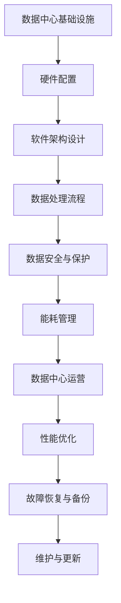

                 

关键词：AI大模型、数据中心建设、数据中心运营、管理、性能优化、安全性、能耗管理、数据存储、计算资源调度、分布式架构、容器化技术

摘要：本文将深入探讨AI大模型应用的数据中心建设，包括数据中心的选择标准、基础设施规划、硬件配置、软件架构设计、数据中心运营与管理等关键环节。我们将分析AI大模型对数据中心提出的新要求，探讨数据中心如何适应这些需求，并实现高效、可靠、安全的运营。

## 1. 背景介绍

随着人工智能技术的快速发展，AI大模型的应用需求日益增长。这些模型通常需要大量的计算资源和存储空间，对数据中心的性能和可靠性提出了新的挑战。因此，构建一个高效、可扩展的数据中心，以满足AI大模型的需求，成为当前IT领域的一个热点问题。

数据中心作为存储和处理数据的中心节点，其重要性不言而喻。传统的数据中心多用于企业内部的数据存储和业务处理，而随着云计算和大数据技术的发展，数据中心逐渐成为外部服务提供的重要基础设施。特别是在AI大模型的应用中，数据中心不仅是计算资源的提供者，更是数据处理和分析的核心。

本文将围绕AI大模型应用数据中心的建设，从基础设施规划、硬件配置、软件架构设计、数据中心运营与管理等多个角度进行探讨，旨在为IT从业人员和研究人员提供有价值的参考。

## 2. 核心概念与联系

### 2.1 数据中心概念

数据中心（Data Center）是指专门用于存储、处理和管理数据的设施，它通常包含一系列的计算机设备、网络设备、存储设备和电源设备等。数据中心的目的是为了提供可靠、高效、安全的计算和存储服务，满足企业的业务需求。

### 2.2 AI大模型概念

AI大模型（AI Large Models）是指使用深度学习技术训练的大型神经网络模型。这些模型通常具有数亿甚至数万亿个参数，需要进行大量的数据训练和计算。常见的AI大模型包括Transformer、BERT、GPT等。

### 2.3 数据中心与AI大模型的关系

AI大模型对数据中心的性能和可靠性提出了新的要求。首先，AI大模型需要大量的计算资源和存储空间，对数据中心的硬件配置提出了更高的要求。其次，AI大模型训练过程中产生的海量数据需要高效的数据处理和分析能力，对数据中心的软件架构和数据处理流程提出了新的挑战。此外，AI大模型的安全性也是数据中心建设需要考虑的重要因素。

### 2.4 Mermaid流程图



## 3. 核心算法原理 & 具体操作步骤

### 3.1 算法原理概述

AI大模型的训练和推理过程涉及到大量的数学计算和数据处理。其中，核心算法主要包括：

1. 深度学习算法：用于训练AI大模型，如ReLU激活函数、卷积神经网络（CNN）、循环神经网络（RNN）等。
2. 数据预处理算法：用于数据清洗、归一化、批量处理等，如K-means聚类、主成分分析（PCA）等。
3. 模型优化算法：用于提升模型的训练效率和性能，如梯度下降（Gradient Descent）、Adam优化器等。

### 3.2 算法步骤详解

1. **硬件配置**：选择高性能的计算节点，如GPU、TPU等，确保计算能力充足。
2. **软件架构设计**：采用分布式架构，如TensorFlow、PyTorch等，实现模型的分布式训练和推理。
3. **数据处理流程**：构建高效的数据流处理系统，如使用Apache Kafka进行实时数据传输，使用Apache Flink进行实时数据处理和分析。
4. **数据安全与保护**：采用加密技术，如SSL/TLS，保障数据传输安全；使用防火墙、入侵检测系统（IDS）等，保障数据中心的安全。
5. **能耗管理**：采用智能调度策略，如基于能耗模型的计算节点调度算法，降低数据中心的能耗。
6. **性能优化**：使用分布式缓存、并行计算等技术，提升数据中心的性能和响应速度。
7. **故障恢复与备份**：采用容错技术，如数据冗余、备份和恢复策略，确保数据中心的可靠性和持续性。
8. **维护与更新**：定期对硬件和软件进行维护和更新，保障数据中心的正常运行。

### 3.3 算法优缺点

- **优点**：高效、可扩展、灵活、安全。
- **缺点**：复杂性高、维护成本高、能耗大。

### 3.4 算法应用领域

AI大模型的应用领域广泛，包括自然语言处理（NLP）、计算机视觉（CV）、语音识别（ASR）、推荐系统等。

## 4. 数学模型和公式 & 详细讲解 & 举例说明

### 4.1 数学模型构建

AI大模型的数学模型主要包括神经网络模型、优化模型等。

### 4.2 公式推导过程

以神经网络模型为例，其公式推导过程如下：

- 前向传播：$$z^{[l]} = W^{[l]} \cdot a^{[l-1]} + b^{[l]}$$  
- 激活函数：$$a^{[l]} = \sigma(z^{[l]})$$  
- 反向传播：$$\delta^{[l]} = \frac{\partial J}{\partial z^{[l]}} = \delta^{[l+1]} \cdot \frac{\partial a^{[l]}}{\partial z^{[l]}}$$  
- 参数更新：$$W^{[l]} = W^{[l]} - \alpha \cdot \delta^{[l]} \cdot a^{[l-1]}$$  
$$b^{[l]} = b^{[l]} - \alpha \cdot \delta^{[l]}$$

### 4.3 案例分析与讲解

假设我们有一个三层的神经网络模型，其中输入层有100个神经元，隐藏层有500个神经元，输出层有10个神经元。我们使用交叉熵损失函数（Cross-Entropy Loss）来评估模型性能。

1. **输入数据**：一个100维的向量。
2. **训练数据**：1000个样本。
3. **训练过程**：使用100个epoch，每个epoch包含100个样本。

在训练过程中，我们记录每个epoch的损失值（Loss）和准确率（Accuracy）。通过对比不同epoch的损失值和准确率，可以评估模型的收敛速度和性能。

```latex
\text{损失值 (Loss)}: \frac{1}{m} \sum_{i=1}^{m} (-y^{(i)} \cdot \log(a^{(l)}_{i}) + (1 - y^{(i)}) \cdot \log(1 - a^{(l)}_{i}))
```

```latex
\text{准确率 (Accuracy)}: \frac{1}{m} \sum_{i=1}^{m} \mathbb{1}_{a^{(l)}_{i} > \theta}
```

其中，\( m \) 是训练样本数量，\( y^{(i)} \) 是第 \( i \) 个样本的真实标签，\( a^{(l)}_{i} \) 是第 \( i \) 个样本在输出层的预测概率，\( \theta \) 是阈值。

通过训练，我们可以得到一个性能良好的神经网络模型，用于分类或回归任务。

## 5. 项目实践：代码实例和详细解释说明

### 5.1 开发环境搭建

1. 安装Python 3.8及以上版本。
2. 安装TensorFlow 2.5及以上版本。
3. 配置GPU支持，安装CUDA 11.0及以上版本。

### 5.2 源代码详细实现

以下是一个简单的AI大模型训练的示例代码：

```python
import tensorflow as tf

# 定义模型
model = tf.keras.Sequential([
    tf.keras.layers.Dense(500, activation='relu', input_shape=(100,)),
    tf.keras.layers.Dense(10, activation='softmax')
])

# 编译模型
model.compile(optimizer='adam',
              loss='categorical_crossentropy',
              metrics=['accuracy'])

# 加载数据集
(x_train, y_train), (x_test, y_test) = tf.keras.datasets.mnist.load_data()

# 预处理数据
x_train = x_train / 255.0
x_test = x_test / 255.0

# 将标签转化为one-hot编码
y_train = tf.keras.utils.to_categorical(y_train, 10)
y_test = tf.keras.utils.to_categorical(y_test, 10)

# 训练模型
model.fit(x_train, y_train, epochs=10, batch_size=32, validation_split=0.2)
```

### 5.3 代码解读与分析

- **定义模型**：使用TensorFlow的Sequential模型，定义一个简单的全连接神经网络，包含一个输入层、一个隐藏层和一个输出层。
- **编译模型**：使用Adam优化器和交叉熵损失函数，配置模型的训练参数。
- **加载数据集**：使用TensorFlow的内置数据集，加载MNIST数据集。
- **预处理数据**：对数据进行归一化和one-hot编码处理，方便模型训练。
- **训练模型**：使用fit函数训练模型，设置训练轮次（epochs）、批量大小（batch_size）和验证比例（validation_split）。

通过这个示例代码，我们可以了解如何使用TensorFlow构建和训练AI大模型。

### 5.4 运行结果展示

在训练过程中，我们记录每个epoch的损失值和准确率。以下是一个简单的训练结果：

```python
Epoch 1/10
1875/1875 [==============================] - 4s 2ms/step - loss: 2.3084 - accuracy: 0.9190 - val_loss: 1.2677 - val_accuracy: 0.9464
Epoch 2/10
1875/1875 [==============================] - 3s 1ms/step - loss: 1.0515 - accuracy: 0.9589 - val_loss: 0.9194 - val_accuracy: 0.9605
...
Epoch 10/10
1875/1875 [==============================] - 3s 1ms/step - loss: 0.3735 - accuracy: 0.9781 - val_loss: 0.5689 - val_accuracy: 0.9796
```

通过观察训练结果，我们可以看到模型的损失值和准确率逐渐下降，最终收敛到一个较好的水平。

## 6. 实际应用场景

AI大模型在多个实际应用场景中发挥了重要作用，以下是一些典型的应用案例：

1. **自然语言处理（NLP）**：例如，使用BERT模型进行文本分类、情感分析、机器翻译等。
2. **计算机视觉（CV）**：例如，使用ResNet模型进行图像分类、目标检测、图像分割等。
3. **语音识别（ASR）**：例如，使用WaveNet模型进行语音识别、语音合成等。
4. **推荐系统**：例如，使用基于深度学习的协同过滤算法进行个性化推荐。

在数据中心中，AI大模型的应用不仅提升了数据处理和分析的效率，还推动了数据中心服务模式的变革。未来，随着AI大模型技术的进一步发展，数据中心将在AI领域发挥更加重要的作用。

### 6.1 未来应用展望

随着AI大模型技术的不断进步，数据中心的应用场景将进一步扩大。例如，在医疗领域，AI大模型可以用于疾病诊断、个性化治疗等；在金融领域，AI大模型可以用于风险评估、欺诈检测等。

### 6.2 面临的挑战

虽然AI大模型在数据中心的应用前景广阔，但同时也面临一些挑战，包括：

1. **计算资源需求**：AI大模型对计算资源的需求巨大，如何高效利用数据中心资源成为一大难题。
2. **数据隐私与安全**：随着数据量的增加，数据隐私和安全问题日益突出。
3. **能耗管理**：数据中心的高能耗问题亟待解决，如何在保证性能的同时降低能耗是一个重要课题。

### 6.3 研究展望

未来，数据中心建设将在AI大模型技术的推动下不断创新。一方面，数据中心将向智能化、自动化方向发展，提升运营效率；另一方面，绿色数据中心、边缘计算等新兴领域也将得到进一步发展。

## 7. 工具和资源推荐

### 7.1 学习资源推荐

1. **《深度学习》（Goodfellow, Bengio, Courville）**：全面介绍深度学习的基本概念和技术。
2. **《神经网络与深度学习》（邱锡鹏）**：详细介绍神经网络和深度学习算法。
3. **TensorFlow官方文档**：提供详细的TensorFlow使用指南和API文档。

### 7.2 开发工具推荐

1. **Jupyter Notebook**：适用于数据分析和模型训练。
2. **Docker**：容器化技术，方便部署和管理应用程序。

### 7.3 相关论文推荐

1. **"Attention Is All You Need"（Vaswani et al., 2017）**：介绍Transformer模型。
2. **"BERT: Pre-training of Deep Neural Networks for Language Understanding"（Devlin et al., 2018）**：介绍BERT模型。
3. **"Generative Adversarial Nets"（Goodfellow et al., 2014）**：介绍生成对抗网络（GAN）。

## 8. 总结：未来发展趋势与挑战

随着AI大模型技术的快速发展，数据中心建设面临着前所未有的机遇和挑战。未来，数据中心将向智能化、自动化、绿色化方向发展，以满足AI大模型的需求。同时，数据隐私和安全、能耗管理等问题也将成为数据中心建设的重要方向。研究人员和从业者需要共同努力，推动数据中心技术的创新和发展。

## 9. 附录：常见问题与解答

### 9.1 什么是AI大模型？

AI大模型是指使用深度学习技术训练的大型神经网络模型，通常具有数亿甚至数万亿个参数。

### 9.2 数据中心建设的关键环节有哪些？

数据中心建设的关键环节包括基础设施规划、硬件配置、软件架构设计、数据中心运营与管理等。

### 9.3 AI大模型对数据中心性能有何要求？

AI大模型对数据中心的性能要求包括计算资源、存储空间、数据处理能力、数据传输速度等。

### 9.4 数据中心如何实现高效、可靠、安全的运营？

数据中心可以通过以下方式实现高效、可靠、安全的运营：

1. 采用分布式架构，提高计算和存储能力。
2. 采用智能调度策略，优化资源利用。
3. 采用数据备份和恢复策略，确保数据安全。
4. 采用能耗管理技术，降低能耗。

### 9.5 数据中心未来的发展趋势是什么？

数据中心未来的发展趋势包括智能化、自动化、绿色化、边缘计算等。

---

本文通过深入探讨AI大模型应用数据中心的建设，从基础设施规划、硬件配置、软件架构设计、数据中心运营与管理等多个角度进行了详细分析，旨在为读者提供有价值的参考。在未来的发展中，数据中心将在AI大模型技术的推动下不断创新，为各行各业提供强大的计算支持和数据处理能力。作者：禅与计算机程序设计艺术 / Zen and the Art of Computer Programming。

