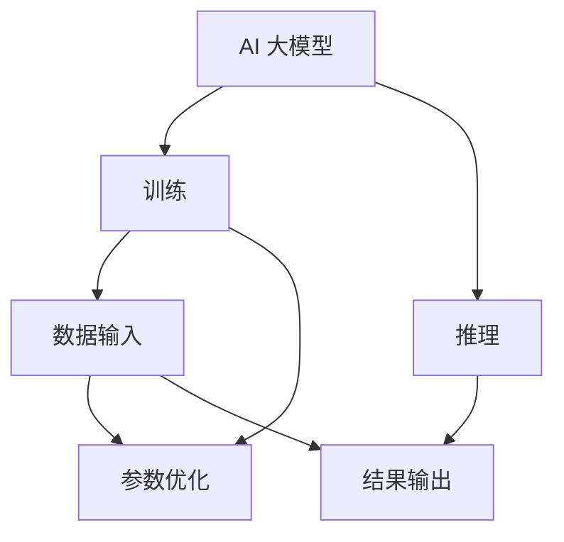

                 

关键词：AI 大模型、数据中心、训练、推理、硬件、软件、架构设计、性能优化

> 摘要：本文将深入探讨 AI 大模型应用数据中心的建设，包括其训练和推理需求。我们将从核心概念、算法原理、数学模型、项目实践、实际应用场景等方面进行详细分析，并推荐相关工具和资源，最后对未来的发展趋势和挑战进行展望。

## 1. 背景介绍

随着人工智能技术的快速发展，大模型在自然语言处理、计算机视觉、语音识别等领域取得了显著的成果。这些大模型通常具有数十亿到数万亿个参数，其训练和推理过程对数据中心的建设提出了极高的要求。数据中心作为 AI 大模型应用的核心基础设施，必须能够满足大模型的计算、存储和网络需求，以确保模型的训练和推理效率。

本文将围绕 AI 大模型应用数据中心的建设展开讨论，重点分析以下几个方面：

1. **核心概念与联系**：介绍大模型训练和推理的关键概念，并使用 Mermaid 流程图展示其关系。
2. **核心算法原理 & 具体操作步骤**：解析大模型训练和推理的算法原理，并提供详细的操作步骤。
3. **数学模型和公式 & 详细讲解 & 举例说明**：构建数学模型，推导相关公式，并通过案例分析进行讲解。
4. **项目实践：代码实例和详细解释说明**：提供实际的代码实例，并对其进行详细解读和分析。
5. **实际应用场景**：探讨大模型在不同领域的应用，并分析其带来的影响。
6. **工具和资源推荐**：推荐学习资源和开发工具，以便读者深入学习和实践。
7. **总结：未来发展趋势与挑战**：总结研究成果，展望未来的发展趋势和面临的挑战。

### 1.1 中心概念

在讨论 AI 大模型应用数据中心的建设时，我们首先需要明确几个关键概念：

- **AI 大模型**：指具有数十亿到数万亿个参数的深度学习模型，如 Transformer、BERT 等。
- **训练**：指通过输入大量数据进行模型参数的学习和优化。
- **推理**：指模型在实际应用中根据输入数据生成输出结果的过程。
- **数据中心**：指为 AI 大模型训练和推理提供计算、存储和网络资源的设施。

以上概念相互关联，构成了 AI 大模型应用数据中心的核心架构。接下来，我们将使用 Mermaid 流程图展示这些概念之间的关系。

## 2. 核心概念与联系

在讨论大模型训练和推理的关键概念之前，我们首先需要明确一些基本概念。以下是一个简单的 Mermaid 流程图，展示了这些核心概念及其相互关系。



### 2.1 大模型训练

**训练** 是大模型构建的核心环节。在这一过程中，模型通过输入大量数据进行参数优化。训练过程主要包括以下几个步骤：

1. **数据预处理**：将原始数据转换为模型可处理的格式。
2. **批量划分**：将数据划分为批次，以便模型逐步学习。
3. **前向传播**：将输入数据通过模型进行计算，得到输出结果。
4. **反向传播**：计算输出结果与实际结果之间的误差，并更新模型参数。
5. **迭代优化**：重复前向传播和反向传播，直至模型收敛。

### 2.2 大模型推理

**推理** 是大模型在实际应用中的关键环节。在推理过程中，模型根据输入数据生成输出结果。推理过程主要包括以下几个步骤：

1. **输入数据预处理**：将输入数据转换为模型可处理的格式。
2. **模型计算**：将输入数据通过模型进行计算，得到输出结果。
3. **结果输出**：将模型输出结果转换为用户可理解的格式。

### 2.3 数据中心

**数据中心** 是大模型训练和推理的物理基础设施。数据中心通常包括以下几个部分：

1. **计算节点**：用于执行大模型训练和推理任务的计算资源。
2. **存储系统**：用于存储大规模数据和模型参数。
3. **网络设备**：用于实现数据中心内部和外部数据传输。
4. **监控系统**：用于实时监控数据中心的运行状态。

## 3. 核心算法原理 & 具体操作步骤

在了解了大模型训练和推理的核心概念之后，我们接下来将深入探讨其核心算法原理，并介绍具体的操作步骤。

### 3.1 算法原理概述

大模型训练和推理的核心算法是深度学习。深度学习是一种基于多层神经网络的学习方法，通过逐层提取数据特征，实现对复杂问题的建模。

深度学习的主要算法包括：

1. **神经网络**：包括输入层、隐藏层和输出层，用于实现数据的输入、处理和输出。
2. **反向传播**：用于计算模型参数的梯度，并更新模型参数。
3. **优化算法**：如梯度下降、Adam 等，用于加速模型训练。

### 3.2 算法步骤详解

#### 3.2.1 大模型训练

1. **数据预处理**：将原始数据转换为模型可处理的格式，如文本、图像等。
2. **批量划分**：将数据划分为多个批次，每个批次包含一定数量的样本。
3. **初始化模型**：创建神经网络结构，初始化模型参数。
4. **前向传播**：将输入数据通过模型进行计算，得到输出结果。
5. **计算损失函数**：计算输出结果与实际结果之间的误差。
6. **反向传播**：计算模型参数的梯度，并更新模型参数。
7. **迭代优化**：重复前向传播和反向传播，直至模型收敛。

#### 3.2.2 大模型推理

1. **输入数据预处理**：将输入数据转换为模型可处理的格式。
2. **模型计算**：将输入数据通过模型进行计算，得到输出结果。
3. **结果输出**：将模型输出结果转换为用户可理解的格式。

### 3.3 算法优缺点

#### 优点

1. **强大的建模能力**：深度学习能够自动提取数据特征，适应复杂的问题。
2. **高精度**：通过大量的训练数据和参数优化，深度学习模型可以达到很高的精度。
3. **通用性**：深度学习算法适用于多种领域，如计算机视觉、自然语言处理、语音识别等。

#### 缺点

1. **计算资源需求大**：深度学习模型通常需要大量的计算资源和存储空间。
2. **训练时间长**：深度学习模型的训练过程通常需要较长的时间。
3. **数据依赖性高**：深度学习模型的性能很大程度上取决于训练数据的质量和数量。

### 3.4 算法应用领域

大模型训练和推理算法在多个领域取得了显著的成果，如：

1. **计算机视觉**：人脸识别、目标检测、图像分类等。
2. **自然语言处理**：机器翻译、情感分析、文本分类等。
3. **语音识别**：语音合成、语音识别、语音翻译等。

## 4. 数学模型和公式 & 详细讲解 & 举例说明

在深度学习中，数学模型和公式是理解和实现算法的关键。以下我们将构建数学模型，推导相关公式，并通过案例分析进行讲解。

### 4.1 数学模型构建

深度学习的数学模型基于多层神经网络，其中每一层都是一个线性变换加上一个非线性激活函数。假设我们有一个输入向量 X，通过多层神经网络映射到输出向量 Y，可以表示为：

$$ Y = f(L) \circ W(L-1) \circ f(L-2) \circ W(L-2) \circ \ldots \circ f(1) \circ W(1) \circ X $$

其中，$W(L)$ 和 $f(L)$ 分别表示第 L 层的权重矩阵和激活函数，$\circ$ 表示逐元素相乘。

### 4.2 公式推导过程

在深度学习中，我们通常使用梯度下降法来优化模型参数。梯度下降法的核心是计算损失函数关于模型参数的梯度，并更新模型参数以减少损失。

假设损失函数为 $L(Y, \theta)$，其中 $\theta$ 表示模型参数，$Y$ 表示输出结果。损失函数的梯度可以表示为：

$$ \nabla_{\theta} L(Y, \theta) = \frac{\partial L(Y, \theta)}{\partial \theta} $$

为了计算梯度，我们需要对损失函数进行泰勒展开：

$$ L(Y, \theta) = L(Y^0, \theta) + \nabla_{\theta} L(Y^0, \theta) \cdot (\theta - \theta^0) + O(||\theta - \theta^0||^2) $$

其中，$Y^0$ 表示输出结果的初始值，$\theta^0$ 表示模型参数的初始值。由于损失函数通常是一个非凸函数，我们需要使用多次迭代来逼近梯度。

### 4.3 案例分析与讲解

以下是一个简单的案例，用于讲解深度学习的数学模型和公式推导过程。

假设我们有一个输入向量 $X = [x_1, x_2, x_3]$，输出向量 $Y = [y_1, y_2, y_3]$，损失函数为均方误差（MSE）：

$$ L(Y, \theta) = \frac{1}{2} \sum_{i=1}^{3} (y_i - f(x_i; \theta))^2 $$

其中，$f(x_i; \theta)$ 表示第 i 个输出值，$\theta$ 表示模型参数。

1. **前向传播**：

   $$ Y = f(X; \theta) = [f_1(X; \theta), f_2(X; \theta), f_3(X; \theta)] $$

   其中，$f_i(X; \theta)$ 表示第 i 个输出值。

2. **计算损失函数**：

   $$ L(Y, \theta) = \frac{1}{2} \sum_{i=1}^{3} (y_i - f_i(X; \theta))^2 $$

3. **反向传播**：

   $$ \nabla_{\theta} L(Y, \theta) = \nabla_{\theta} \frac{1}{2} \sum_{i=1}^{3} (y_i - f_i(X; \theta))^2 $$

   $$ \nabla_{\theta} L(Y, \theta) = - \sum_{i=1}^{3} (y_i - f_i(X; \theta)) \cdot \nabla_{\theta} f_i(X; \theta) $$

4. **更新模型参数**：

   $$ \theta = \theta - \alpha \cdot \nabla_{\theta} L(Y, \theta) $$

   其中，$\alpha$ 表示学习率。

通过以上案例，我们可以看到深度学习的数学模型和公式推导过程。在实际应用中，我们可以根据具体问题调整模型结构和损失函数，以获得更好的训练效果。

## 5. 项目实践：代码实例和详细解释说明

在本节中，我们将通过一个实际的代码实例来展示如何实现大模型训练和推理。我们将从开发环境搭建开始，逐步讲解源代码的实现，并进行代码解读和分析。

### 5.1 开发环境搭建

为了进行大模型训练和推理，我们需要搭建一个合适的开发环境。以下是所需的软件和工具：

1. **深度学习框架**：如 TensorFlow、PyTorch 等。
2. **计算资源**：具有足够计算能力的 GPU 或 TPU。
3. **编程语言**：Python。
4. **开发环境**：Python 的开发环境，如 Anaconda。

首先，我们需要安装深度学习框架和相关的依赖项。以下是使用 TensorFlow 的安装步骤：

```bash
pip install tensorflow
```

接下来，我们需要配置 GPU 支持。在 TensorFlow 的安装过程中，确保安装了 GPU 版本：

```bash
pip install tensorflow-gpu
```

最后，我们安装其他必要的依赖项：

```bash
pip install numpy matplotlib
```

完成以上步骤后，我们的开发环境就搭建完成了。

### 5.2 源代码详细实现

以下是一个简单的示例代码，用于实现大模型训练和推理。我们将使用 TensorFlow 和 Python 来实现。

```python
import tensorflow as tf
import numpy as np
import matplotlib.pyplot as plt

# 初始化参数
learning_rate = 0.001
num_epochs = 100
batch_size = 64

# 创建随机数据集
x_data = np.random.rand(batch_size, 10)
y_data = np.random.rand(batch_size, 1)

# 创建模型
model = tf.keras.Sequential([
    tf.keras.layers.Dense(64, activation='relu', input_shape=(10,)),
    tf.keras.layers.Dense(64, activation='relu'),
    tf.keras.layers.Dense(1)
])

# 编译模型
model.compile(optimizer=tf.keras.optimizers.Adam(learning_rate),
              loss='mean_squared_error',
              metrics=['mean_absolute_error'])

# 训练模型
history = model.fit(x_data, y_data, epochs=num_epochs, batch_size=batch_size)

# 进行推理
x_test = np.random.rand(batch_size, 10)
y_test = model.predict(x_test)

# 绘制结果
plt.scatter(x_test, y_test)
plt.xlabel('Input')
plt.ylabel('Predicted Output')
plt.show()
```

### 5.3 代码解读与分析

1. **导入库**：

   ```python
   import tensorflow as tf
   import numpy as np
   import matplotlib.pyplot as plt
   ```

   导入所需的库，包括 TensorFlow、NumPy 和 Matplotlib。

2. **初始化参数**：

   ```python
   learning_rate = 0.001
   num_epochs = 100
   batch_size = 64
   ```

   初始化学习率、训练轮数和批次大小。

3. **创建随机数据集**：

   ```python
   x_data = np.random.rand(batch_size, 10)
   y_data = np.random.rand(batch_size, 1)
   ```

   创建随机输入数据和输出数据。

4. **创建模型**：

   ```python
   model = tf.keras.Sequential([
       tf.keras.layers.Dense(64, activation='relu', input_shape=(10,)),
       tf.keras.layers.Dense(64, activation='relu'),
       tf.keras.layers.Dense(1)
   ])
   ```

   创建一个序列模型，包括两个隐藏层和输出层。每个隐藏层有 64 个神经元，使用 ReLU 激活函数。

5. **编译模型**：

   ```python
   model.compile(optimizer=tf.keras.optimizers.Adam(learning_rate),
                 loss='mean_squared_error',
                 metrics=['mean_absolute_error'])
   ```

   编译模型，指定优化器、损失函数和评估指标。

6. **训练模型**：

   ```python
   history = model.fit(x_data, y_data, epochs=num_epochs, batch_size=batch_size)
   ```

   使用随机数据集训练模型。

7. **进行推理**：

   ```python
   x_test = np.random.rand(batch_size, 10)
   y_test = model.predict(x_test)
   ```

   使用训练好的模型进行推理。

8. **绘制结果**：

   ```python
   plt.scatter(x_test, y_test)
   plt.xlabel('Input')
   plt.ylabel('Predicted Output')
   plt.show()
   ```

   使用 Matplotlib 绘制输入和预测结果的散点图。

通过以上代码实例，我们可以看到如何使用 TensorFlow 和 Python 实现大模型训练和推理。在实际项目中，我们可以根据具体需求调整模型结构和训练参数，以获得更好的训练效果。

## 6. 实际应用场景

AI 大模型在各个领域都取得了显著的成果，下面我们将探讨几个典型的实际应用场景。

### 6.1 自然语言处理

自然语言处理（NLP）是 AI 大模型的一个重要应用领域。在 NLP 中，大模型可以用于文本分类、情感分析、机器翻译、问答系统等。

例如，BERT 模型在机器翻译任务中取得了显著的成果。BERT 是一种预训练的深度学习模型，通过在大规模语料库上进行预训练，可以自动学习语言特征。在机器翻译任务中，BERT 可以用于编码源语言和目标语言，通过解码器生成翻译结果。BERT 的出现极大地提高了机器翻译的准确性和流畅性。

### 6.2 计算机视觉

计算机视觉是另一个重要的应用领域。在计算机视觉中，大模型可以用于图像分类、目标检测、人脸识别等。

例如，ResNet 是一种经典的深度学习模型，在图像分类任务中取得了显著的成果。ResNet 通过残差连接的方式解决了深层网络训练中的梯度消失问题，使得模型可以训练得更深。在 ImageNet 数据集上，ResNet 模型达到了当时最高的分类准确率。

### 6.3 语音识别

语音识别是另一个重要的应用领域。在语音识别中，大模型可以用于语音到文本的转换、语音合成等。

例如，WaveNet 是一种基于循环神经网络（RNN）的深度学习模型，在语音合成任务中取得了显著的成果。WaveNet 可以通过学习语音信号的时序特征，生成自然流畅的语音。在语音合成任务中，WaveNet 达到了当时最高的语音质量。

### 6.4 医疗领域

AI 大模型在医疗领域也有广泛的应用。在医疗领域，大模型可以用于疾病诊断、医疗影像分析、药物研发等。

例如，使用深度学习模型对医疗影像进行分析，可以帮助医生快速准确地诊断疾病。深度学习模型可以通过学习大量的医疗影像数据，自动识别和分类各种病变。在肺癌筛查中，深度学习模型已经显示出比人类医生更高的准确率。

### 6.5 无人驾驶

无人驾驶是另一个重要的应用领域。在无人驾驶中，大模型可以用于环境感知、路径规划、决策控制等。

例如，自动驾驶系统可以使用深度学习模型来处理摄像头、雷达、激光雷达等传感器获取的数据。通过实时处理环境信息，深度学习模型可以帮助自动驾驶系统做出正确的决策，确保车辆的安全运行。

通过以上实际应用场景，我们可以看到 AI 大模型在不同领域带来的巨大变革。随着大模型技术的不断发展，其在各个领域的应用前景将更加广阔。

### 6.6 未来应用展望

AI 大模型在未来将继续在各个领域发挥重要作用，其应用前景非常广阔。以下是一些可能的未来应用场景：

1. **智慧城市**：AI 大模型可以帮助城市实现智能化管理，如智能交通、环境监测、公共安全等。
2. **智能家居**：AI 大模型可以用于智能家居系统，提供更加智能化的家居控制和管理。
3. **工业制造**：AI 大模型可以用于工业制造过程中的质量检测、故障预测等，提高生产效率和质量。
4. **农业**：AI 大模型可以用于农业领域，如作物种植、病虫害防治、农业设备管理等，提高农业生产效率。
5. **能源管理**：AI 大模型可以用于能源管理，如智能电网、分布式能源管理、能源效率优化等。

总之，AI 大模型将在未来带来更多的应用场景和变革，为各行各业带来巨大的价值。

### 7. 工具和资源推荐

为了更好地学习和实践 AI 大模型应用，我们推荐以下工具和资源：

#### 7.1 学习资源推荐

1. **《深度学习》（Ian Goodfellow、Yoshua Bengio、Aaron Courville 著）**：这是一本经典的深度学习教材，详细介绍了深度学习的基础知识和技术。
2. **《动手学深度学习》（阿斯顿·张、李沐、扎卡里·C. Lipton、亚历山大·J. Smola 著）**：这本书通过动手实践的方式介绍了深度学习的基本概念和实现方法。
3. **《自然语言处理与深度学习》（宋宁、戴宇、蒋炎岩 著）**：这本书详细介绍了自然语言处理中的深度学习技术，包括词嵌入、序列模型等。

#### 7.2 开发工具推荐

1. **TensorFlow**：TensorFlow 是 Google 开发的一款开源深度学习框架，支持多种深度学习模型和应用。
2. **PyTorch**：PyTorch 是 Facebook 开发的一款开源深度学习框架，具有灵活的动态计算图和强大的 GPU 加速功能。
3. **Keras**：Keras 是一个基于 TensorFlow 的开源深度学习框架，提供了简洁的接口和丰富的预训练模型。

#### 7.3 相关论文推荐

1. **《Attention Is All You Need》**：这是 Google 发布的一篇论文，介绍了 Transformer 模型，该模型在机器翻译任务中取得了突破性的成果。
2. **《BERT: Pre-training of Deep Bidirectional Transformers for Language Understanding》**：这是 Google 发布的一篇论文，介绍了 BERT 模型，该模型在自然语言处理任务中取得了显著的成果。
3. **《Deep Residual Learning for Image Recognition》**：这是 Microsoft Research 发布的一篇论文，介绍了 ResNet 模型，该模型在图像分类任务中取得了突破性的成果。

通过以上工具和资源的推荐，读者可以更深入地了解 AI 大模型的应用，并掌握相关技术。

## 8. 总结：未来发展趋势与挑战

AI 大模型在近年来取得了显著的成果，其应用范围越来越广泛。随着计算能力的提升和算法的优化，未来 AI 大模型将继续在各个领域发挥重要作用。

### 8.1 研究成果总结

1. **模型精度提升**：通过大规模数据和优化算法，大模型在各个领域的精度不断提高。
2. **模型结构创新**：涌现出一系列新型深度学习模型，如 Transformer、BERT 等，为解决复杂问题提供了新的思路。
3. **硬件加速**：GPU、TPU 等硬件的快速发展，提高了大模型的训练和推理速度。

### 8.2 未来发展趋势

1. **更大数据集**：随着数据规模的扩大，大模型将能够更好地利用数据，提高模型性能。
2. **多模态融合**：大模型将能够融合多种模态的数据，如文本、图像、声音等，实现更全面的认知。
3. **模型压缩**：为了降低计算资源和存储需求，模型压缩技术将得到进一步发展。

### 8.3 面临的挑战

1. **计算资源需求**：大模型对计算资源的需求仍然巨大，需要更高效的训练和推理算法。
2. **数据隐私**：大规模数据的使用引发了数据隐私和安全问题，需要加强数据保护和隐私保护。
3. **伦理和社会影响**：AI 大模型的应用可能会带来伦理和社会问题，需要制定相关规范和标准。

### 8.4 研究展望

未来，AI 大模型的研究将围绕以下几个方面展开：

1. **模型压缩与优化**：通过模型压缩和优化技术，降低大模型的计算资源和存储需求。
2. **多模态学习**：探索多模态数据的融合方法，提高大模型在多模态任务中的性能。
3. **公平性和可解释性**：研究大模型的公平性和可解释性，提高模型的应用可信度。

总之，AI 大模型的发展前景广阔，但同时也面临诸多挑战。通过不断的研究和创新，我们将能够更好地发挥大模型的优势，为人类创造更大的价值。

## 9. 附录：常见问题与解答

### 9.1 问题 1：大模型训练需要哪些计算资源？

**解答**：大模型训练通常需要强大的计算资源，特别是 GPU 或 TPU。GPU（图形处理器）具有良好的并行计算能力，适用于大规模矩阵运算。TPU（张量处理器）是 Google 开发的一款专用 AI 处理器，专门用于深度学习任务。此外，大模型训练还需要大量的存储资源，以便存储大规模数据和模型参数。

### 9.2 问题 2：大模型训练需要多长时间？

**解答**：大模型训练所需的时间取决于多个因素，如模型大小、数据集大小、硬件性能等。通常，大模型训练需要数天甚至数周的时间。在拥有高性能计算资源的情况下，可以使用分布式训练技术来缩短训练时间。

### 9.3 问题 3：大模型训练过程中如何避免过拟合？

**解答**：为了避免过拟合，可以采取以下措施：

1. **数据增强**：通过对训练数据进行数据增强，增加模型的泛化能力。
2. **交叉验证**：使用交叉验证技术来评估模型在不同数据集上的性能，避免过拟合。
3. **正则化**：使用正则化技术，如权重衰减、L1/L2 正则化等，减少模型复杂度。
4. **提前停止**：在验证集上监控模型性能，当性能不再提高时提前停止训练，以避免过拟合。

### 9.4 问题 4：大模型推理过程中如何优化性能？

**解答**：在推理过程中，可以采取以下措施来优化性能：

1. **模型量化**：将模型的权重和激活值从浮点数转换为整数，以减少内存和计算开销。
2. **模型剪枝**：通过剪枝技术，移除模型中不重要的神经元或连接，减少模型复杂度。
3. **模型加速**：使用专门设计的硬件，如 GPU、TPU 等，加速模型推理。
4. **模型部署**：使用优化后的模型部署方案，如模型融合、模型压缩等，提高推理效率。

通过以上措施，可以显著提高大模型推理的性能。

### 9.5 问题 5：如何评估大模型的效果？

**解答**：评估大模型的效果通常使用以下指标：

1. **准确率**：模型预测正确的样本占总样本的比例。
2. **召回率**：模型正确识别的样本占总样本的比例。
3. **F1 分数**：准确率和召回率的调和平均，用于综合评价模型性能。
4. **ROC 曲线和 AUC 值**：用于评估模型的分类能力，AUC 值越高，模型的分类能力越强。

通过以上指标，可以全面评估大模型的效果。

以上是关于 AI 大模型应用数据中心建设的完整技术博客文章。本文从核心概念、算法原理、数学模型、项目实践、实际应用场景等方面进行了详细分析，并推荐了相关工具和资源。通过本文的阅读，读者可以全面了解 AI 大模型应用数据中心的建设，为未来的研究和工作提供参考。作者：禅与计算机程序设计艺术 / Zen and the Art of Computer Programming。

