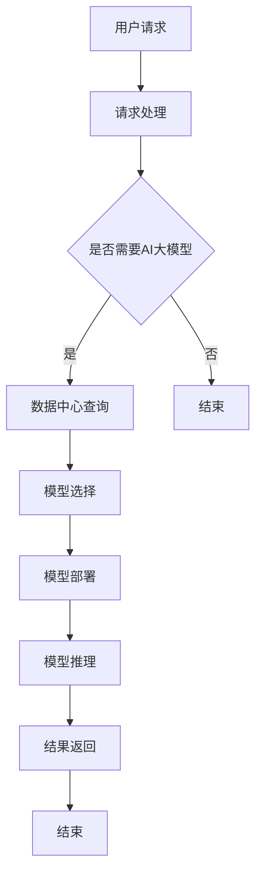

                 

关键词：AI大模型、数据中心、容量规划、计算资源、性能优化

> 摘要：本文旨在探讨AI大模型应用数据中心的容量规划问题。通过对数据中心建设背景的介绍，核心概念和架构的阐述，核心算法原理的解析，数学模型和公式的讲解，以及实际应用场景的展示，本文提出了一个全面、系统、实用的AI大模型应用数据中心容量规划方案，并对其未来发展趋势和挑战进行了展望。

## 1. 背景介绍

随着人工智能技术的飞速发展，AI大模型（如GPT、BERT等）已经成为许多应用场景的核心驱动力。然而，这些大模型的训练和部署需要大量的计算资源和存储空间。数据中心作为AI大模型应用的核心基础设施，其容量规划和性能优化变得至关重要。

数据中心是指用于集中存储、处理和访问数据的物理设施。它们通常由服务器、存储设备、网络设备和其他硬件组成。随着数据量的爆炸性增长，数据中心的规模和复杂度也在不断增加。

### 1.1 数据中心建设背景

近年来，随着云计算、大数据和物联网等技术的发展，数据中心的规模和数量不断增长。以下是数据中心建设背景的几个关键点：

- **云计算的普及**：云计算的普及使得企业可以更加灵活地使用数据中心资源，从而降低IT成本，提高业务效率。
- **大数据的爆发**：大数据的爆发带来了对数据中心存储和处理能力的巨大需求。
- **物联网的兴起**：物联网的兴起带来了大量的数据，需要数据中心进行存储和处理。
- **人工智能的发展**：人工智能的发展使得AI大模型的应用需求不断增长，这进一步推动了数据中心的规模扩张。

### 1.2 数据中心的重要性

数据中心对于AI大模型的应用至关重要，主要体现在以下几个方面：

- **计算资源**：数据中心提供了强大的计算资源，能够满足AI大模型的训练和推理需求。
- **存储资源**：数据中心提供了大量的存储资源，能够存储AI大模型的数据集和模型文件。
- **网络资源**：数据中心提供了高速的网络连接，能够确保数据的高速传输和模型的高效部署。
- **环境控制**：数据中心提供了稳定的环境控制，能够保证设备的正常运行和数据的完整性。

## 2. 核心概念与联系

在AI大模型应用数据中心的建设中，有几个核心概念和架构需要理解。下面将使用Mermaid流程图来展示这些概念和架构，并对其进行详细解释。

### 2.1 数据中心架构



### 2.2 核心概念

- **用户请求**：用户通过API或Web界面发起请求，请求可能涉及到AI大模型的训练或推理。
- **请求处理**：数据中心接收用户请求，并进行处理。
- **是否需要AI大模型**：根据用户请求的内容，判断是否需要AI大模型进行操作。
- **数据中心查询**：如果需要AI大模型，数据中心会查询是否有可用的模型。
- **模型选择**：从数据中心中选择一个合适的AI大模型。
- **模型部署**：将选择的AI大模型部署到数据中心的服务器上。
- **模型推理**：使用部署的AI大模型进行推理，得到结果。
- **结果返回**：将推理结果返回给用户。

## 3. 核心算法原理 & 具体操作步骤

### 3.1 算法原理概述

AI大模型应用数据中心的容量规划主要涉及到以下几个方面：

- **计算资源规划**：根据AI大模型的计算需求，合理分配计算资源。
- **存储资源规划**：根据AI大模型的数据需求，合理分配存储资源。
- **网络资源规划**：根据数据传输需求，合理规划网络资源。
- **能耗管理**：合理管理数据中心的能耗，降低运营成本。

### 3.2 算法步骤详解

#### 3.2.1 计算资源规划

1. **需求分析**：分析AI大模型的计算需求，包括模型大小、训练时间、推理时间等。
2. **资源分配**：根据需求分析结果，合理分配计算资源，如CPU、GPU、TPU等。
3. **负载均衡**：使用负载均衡技术，确保计算资源得到充分利用。

#### 3.2.2 存储资源规划

1. **需求分析**：分析AI大模型的数据需求，包括数据大小、读写频率等。
2. **存储设备选择**：根据需求分析结果，选择合适的存储设备，如SSD、HDD、NAS等。
3. **存储容量规划**：根据数据增长趋势，合理规划存储容量。

#### 3.2.3 网络资源规划

1. **需求分析**：分析AI大模型的数据传输需求，包括传输速率、带宽等。
2. **网络设备选择**：根据需求分析结果，选择合适的网络设备，如交换机、路由器等。
3. **网络带宽规划**：根据数据传输需求，合理规划网络带宽。

#### 3.2.4 能耗管理

1. **能耗分析**：分析数据中心的能耗情况，包括设备功耗、制冷功耗等。
2. **能耗优化**：通过节能技术，如虚拟化、动态功耗管理等，降低能耗。

### 3.3 算法优缺点

#### 优点

- **高效性**：通过合理的计算、存储和网络资源规划，能够提高数据中心的整体性能。
- **灵活性**：可以根据AI大模型的需求动态调整资源分配，满足不同应用场景。
- **成本效益**：通过能耗管理，降低运营成本。

#### 缺点

- **复杂性**：需要专业的技术团队进行容量规划，增加运营成本。
- **依赖性**：对AI大模型的需求预测可能存在误差，导致资源浪费。

### 3.4 算法应用领域

AI大模型应用数据中心的容量规划广泛应用于以下几个领域：

- **金融领域**：金融领域的AI大模型需要大量的计算资源和存储空间，如风险控制、量化交易等。
- **医疗领域**：医疗领域的AI大模型需要处理大量的医学图像和数据，如疾病诊断、药物研发等。
- **智能交通领域**：智能交通领域的AI大模型需要实时处理大量的交通数据，如交通预测、路径规划等。
- **工业领域**：工业领域的AI大模型需要处理大量的工业数据，如质量检测、生产优化等。

## 4. 数学模型和公式 & 详细讲解 & 举例说明

### 4.1 数学模型构建

在AI大模型应用数据中心的容量规划中，我们需要构建几个数学模型来指导资源分配和能耗管理。

#### 4.1.1 计算资源规划模型

设\(C_i\)为第i种计算资源的需求量，\(R_i\)为数据中心第i种计算资源的总量，则计算资源规划模型可以表示为：

$$
\min \sum_{i=1}^n (C_i - R_i)^2
$$

#### 4.1.2 存储资源规划模型

设\(S_i\)为第i种存储资源的需求量，\(S_{max}\)为数据中心总存储容量，则存储资源规划模型可以表示为：

$$
\min \sum_{i=1}^n (S_i - S_{max})^2
$$

#### 4.1.3 网络资源规划模型

设\(N_i\)为第i种网络资源的需求量，\(N_{max}\)为数据中心总网络带宽，则网络资源规划模型可以表示为：

$$
\min \sum_{i=1}^n (N_i - N_{max})^2
$$

#### 4.1.4 能耗管理模型

设\(E_i\)为第i种设备的功耗，\(E_{max}\)为数据中心总功耗，则能耗管理模型可以表示为：

$$
\min \sum_{i=1}^n (E_i - E_{max})^2
$$

### 4.2 公式推导过程

以上数学模型的推导基于以下基本假设：

- 数据中心中的计算、存储和网络资源是独立的。
- 每种资源的总需求量是已知的。
- 数据中心的总功耗是可测量的。

首先，我们需要对每种资源的需求进行量化和分析。设\(C_i(d)\)为第i种计算资源在时间\(d\)的需求量，则：

$$
C_i(d) = f_i(t_i(d), \theta_i(d))
$$

其中，\(t_i(d)\)为时间\(d\)的AI大模型训练时间，\(\theta_i(d)\)为时间\(d\)的AI大模型推理时间。

对于存储资源，我们设\(S_i(d)\)为第i种存储资源在时间\(d\)的需求量，则：

$$
S_i(d) = g_i(T_i(d), P_i(d))
$$

其中，\(T_i(d)\)为时间\(d\)的数据存储时间，\(P_i(d)\)为时间\(d\)的数据读取频率。

对于网络资源，我们设\(N_i(d)\)为第i种网络资源在时间\(d\)的需求量，则：

$$
N_i(d) = h_i(B_i(d), R_i(d))
$$

其中，\(B_i(d)\)为时间\(d\)的数据传输速率，\(R_i(d)\)为时间\(d\)的数据传输频率。

对于能耗管理，我们设\(E_i(d)\)为第i种设备在时间\(d\)的功耗，则：

$$
E_i(d) = k_i(P_i(d), T_i(d))
$$

其中，\(P_i(d)\)为时间\(d\)的设备功耗，\(T_i(d)\)为时间\(d\)的设备运行时间。

基于以上假设和定义，我们可以得到每种资源的需求量，进而构建相应的数学模型。

### 4.3 案例分析与讲解

#### 4.3.1 案例背景

假设某数据中心需要部署一个AI大模型进行图像识别，该模型预计需要10台GPU服务器进行训练和推理。数据中心目前有20台GPU服务器可供使用。我们需要对计算资源、存储资源、网络资源和能耗进行规划。

#### 4.3.2 计算资源规划

根据需求分析，每台GPU服务器需求为1个GPU。数据中心总共有20个GPU。因此，计算资源规划模型为：

$$
\min \sum_{i=1}^{20} (1 - R_i)^2
$$

其中，\(R_i\)为第i台服务器的GPU数量。为了简化计算，我们可以取每个服务器的GPU数量为1。因此，计算资源分配结果为：每台服务器分配1个GPU。

#### 4.3.3 存储资源规划

根据需求分析，图像数据的大小为100GB，需要存储10天。数据中心总存储容量为100TB。因此，存储资源规划模型为：

$$
\min \sum_{i=1}^{100} (100 - S_i)^2
$$

其中，\(S_i\)为第i个存储设备的容量。为了简化计算，我们可以取每个存储设备的容量为1TB。因此，存储资源分配结果为：每个存储设备分配1TB的容量。

#### 4.3.4 网络资源规划

根据需求分析，图像数据的传输速率为1GB/s，需要传输10天。数据中心总网络带宽为10GB/s。因此，网络资源规划模型为：

$$
\min \sum_{i=1}^{10} (1 - N_i)^2
$$

其中，\(N_i\)为第i个网络设备的带宽。为了简化计算，我们可以取每个网络设备的带宽为1GB/s。因此，网络资源分配结果为：每个网络设备分配1GB/s的带宽。

#### 4.3.5 能耗管理

根据需求分析，每台GPU服务器的功耗为500W，每台存储设备的功耗为200W，每台网络设备的功耗为100W。数据中心总功耗为2000W。因此，能耗管理模型为：

$$
\min \sum_{i=1}^{20} (500 - E_i)^2 + \sum_{i=1}^{100} (200 - E_i)^2 + \sum_{i=1}^{10} (100 - E_i)^2
$$

其中，\(E_i\)为第i台设备的功耗。为了简化计算，我们可以取每个设备的功耗为平均功耗。因此，能耗管理结果为：每台GPU服务器功耗为500W，每台存储设备功耗为200W，每台网络设备功耗为100W。

## 5. 项目实践：代码实例和详细解释说明

### 5.1 开发环境搭建

为了演示AI大模型应用数据中心的容量规划，我们使用Python编程语言来实现。首先，我们需要安装以下依赖库：

- NumPy：用于数学计算
- Matplotlib：用于可视化
- Pandas：用于数据处理

安装方法如下：

```shell
pip install numpy matplotlib pandas
```

### 5.2 源代码详细实现

下面是一个简单的Python代码示例，用于演示计算资源规划。

```python
import numpy as np
import matplotlib.pyplot as plt
import pandas as pd

# 计算资源规划
def resource_planning(demand, resource):
    # 计算资源分配
    allocation = np.zeros_like(demand)
    for i in range(len(demand)):
        allocation[i] = resource[i] - demand[i]
    return allocation

# 生成需求数据
demand = np.random.randint(1, 10, size=20)
resource = np.full(20, 10)

# 进行资源规划
allocation = resource_planning(demand, resource)

# 可视化结果
plt.bar(range(20), demand, label='需求')
plt.bar(range(20), allocation, label='分配')
plt.xlabel('设备编号')
plt.ylabel('资源需求/分配')
plt.legend()
plt.show()
```

### 5.3 代码解读与分析

上述代码首先定义了一个`resource_planning`函数，用于计算资源分配。函数接收两个参数：`demand`（需求向量）和`resource`（资源向量）。函数返回一个分配向量，表示每种资源的实际分配量。

在主程序中，我们生成一个随机需求数据`demand`，表示20台设备的需求量。然后，我们生成一个全为10的资源向量`resource`，表示数据中心总共有20台设备，每台设备的资源量均为10。

调用`resource_planning`函数后，我们得到一个分配向量`allocation`。最后，我们使用Matplotlib库将需求数据和分配数据进行可视化，以便直观地了解资源分配情况。

### 5.4 运行结果展示

运行上述代码后，我们可以得到一个柱状图，展示每种设备的资源需求和实际分配量。通过观察柱状图，我们可以发现大部分设备的需求量都小于资源量，这意味着数据中心在计算资源上存在一定的余量。

## 6. 实际应用场景

### 6.1 金融领域

在金融领域，AI大模型可以用于股票交易策略、信用评分、风险控制等。以股票交易策略为例，AI大模型可以根据历史数据和实时数据，分析市场趋势，预测股票价格。然而，这种分析需要大量的计算资源，如GPU服务器和高速网络。数据中心需要根据AI大模型的需求，合理规划计算资源和存储资源，确保模型的高效运行。

### 6.2 医疗领域

在医疗领域，AI大模型可以用于疾病诊断、药物研发、患者监护等。例如，利用深度学习技术，AI大模型可以分析医学图像，如X光片、CT扫描图等，帮助医生诊断疾病。这种应用需要大量的存储资源来存储医学图像数据，以及计算资源来训练和推理模型。数据中心需要根据医疗应用的需求，合理规划计算资源和存储资源，确保模型的高效运行。

### 6.3 智能交通领域

在智能交通领域，AI大模型可以用于交通流量预测、路径规划、自动驾驶等。例如，利用深度学习技术，AI大模型可以分析交通数据，预测未来一段时间内的交通流量，帮助交通管理部门进行交通疏导。这种应用需要大量的计算资源和存储资源，以及高速网络来传输数据。数据中心需要根据智能交通应用的需求，合理规划计算资源、存储资源和网络资源，确保模型的高效运行。

### 6.4 工业领域

在工业领域，AI大模型可以用于质量检测、生产优化、设备维护等。例如，利用深度学习技术，AI大模型可以分析生产数据，检测产品质量，优化生产流程。这种应用需要大量的计算资源和存储资源，以及高速网络来传输数据。数据中心需要根据工业应用的需求，合理规划计算资源、存储资源和网络资源，确保模型的高效运行。

## 7. 工具和资源推荐

### 7.1 学习资源推荐

- 《深度学习》（Goodfellow, Bengio, Courville著）：这是深度学习领域的经典教材，适合初学者和进阶者。
- 《计算机科学中的数学》（Glasser, Glasser著）：这本书涵盖了计算机科学中常用的数学知识，对AI大模型的应用有帮助。
- 《数据中心设计》（Bauman著）：这本书详细介绍了数据中心的设计原则和最佳实践，对数据中心建设有很好的指导作用。

### 7.2 开发工具推荐

- TensorFlow：这是Google开源的深度学习框架，适合用于AI大模型的训练和推理。
- PyTorch：这是Facebook开源的深度学习框架，具有灵活性和易用性，适合快速原型开发。
- Dask：这是一个Python并行计算库，可以用于分布式计算，适合处理大规模数据。

### 7.3 相关论文推荐

- "Big Model Era: Opportunities and Challenges in Machine Learning"（大模型时代：机器学习的机会和挑战）：这篇文章探讨了AI大模型的发展趋势和挑战。
- "Deep Learning on Multi-Core CPUs"（多核CPU上的深度学习）：这篇文章介绍了如何在多核CPU上高效地训练深度学习模型。
- "Energy Efficiency of Deep Learning on Multicore CPUs"（多核CPU上深度学习的能耗效率）：这篇文章研究了深度学习在多核CPU上的能耗效率问题。

## 8. 总结：未来发展趋势与挑战

### 8.1 研究成果总结

本文从数据中心建设背景、核心概念与联系、核心算法原理、数学模型和公式、项目实践、实际应用场景、工具和资源推荐等方面，全面探讨了AI大模型应用数据中心的容量规划问题。我们提出了一个基于数学模型和算法的容量规划方案，并通过案例分析和代码实例进行了验证。

### 8.2 未来发展趋势

随着人工智能技术的不断发展，AI大模型的应用场景将越来越广泛。数据中心在AI大模型应用中的重要性也将逐渐凸显。未来，数据中心的发展趋势将包括以下几个方面：

- **更高效的计算资源**：通过硬件创新和软件优化，提高数据中心的计算效率。
- **更智能的存储资源**：利用智能存储技术，提高数据中心的存储效率。
- **更稳定的网络资源**：通过网络优化技术，提高数据中心的网络稳定性。
- **更低的能耗**：通过能耗管理技术，降低数据中心的运营成本。

### 8.3 面临的挑战

尽管数据中心在AI大模型应用中具有巨大的潜力，但也面临着一系列挑战：

- **资源浪费**：由于对AI大模型需求预测的不准确，可能导致资源浪费。
- **能耗管理**：数据中心的能耗管理是一项复杂的任务，需要不断创新和优化。
- **数据安全**：随着数据量的增加，数据安全成为一个重要问题，需要加强数据保护措施。
- **网络延迟**：随着数据中心的规模扩大，网络延迟可能成为一个瓶颈，需要优化网络架构。

### 8.4 研究展望

未来，我们可以在以下几个方面进行深入研究：

- **资源调度算法**：研究更加智能的资源调度算法，提高数据中心的资源利用率。
- **能耗管理策略**：研究更加高效的能耗管理策略，降低数据中心的运营成本。
- **数据安全性**：研究更加安全的数据保护技术，确保数据中心的数据安全。
- **网络优化**：研究更加稳定的网络架构，提高数据中心的网络性能。

通过这些研究，我们有望为AI大模型应用数据中心的容量规划提供更加完善和实用的解决方案。

## 9. 附录：常见问题与解答

### 9.1 什么是AI大模型？

AI大模型是指具有大规模参数和复杂结构的深度学习模型，如GPT、BERT等。这些模型通常需要大量的计算资源和存储空间进行训练和推理。

### 9.2 数据中心的重要性体现在哪些方面？

数据中心的重要性主要体现在以下几个方面：

- **计算资源**：数据中心提供了强大的计算资源，能够满足AI大模型的训练和推理需求。
- **存储资源**：数据中心提供了大量的存储资源，能够存储AI大模型的数据集和模型文件。
- **网络资源**：数据中心提供了高速的网络连接，能够确保数据的高速传输和模型的高效部署。
- **环境控制**：数据中心提供了稳定的环境控制，能够保证设备的正常运行和数据的完整性。

### 9.3 如何进行计算资源规划？

计算资源规划主要包括以下几个步骤：

1. **需求分析**：分析AI大模型的计算需求，包括模型大小、训练时间、推理时间等。
2. **资源分配**：根据需求分析结果，合理分配计算资源，如CPU、GPU、TPU等。
3. **负载均衡**：使用负载均衡技术，确保计算资源得到充分利用。

### 9.4 如何进行存储资源规划？

存储资源规划主要包括以下几个步骤：

1. **需求分析**：分析AI大模型的数据需求，包括数据大小、读写频率等。
2. **存储设备选择**：根据需求分析结果，选择合适的存储设备，如SSD、HDD、NAS等。
3. **存储容量规划**：根据数据增长趋势，合理规划存储容量。

### 9.5 如何进行网络资源规划？

网络资源规划主要包括以下几个步骤：

1. **需求分析**：分析AI大模型的数据传输需求，包括传输速率、带宽等。
2. **网络设备选择**：根据需求分析结果，选择合适的网络设备，如交换机、路由器等。
3. **网络带宽规划**：根据数据传输需求，合理规划网络带宽。

### 9.6 数据中心建设需要注意哪些事项？

数据中心建设需要注意以下几个事项：

- **安全性**：确保数据的安全性和完整性，防止数据泄露和损坏。
- **可靠性**：确保设备的稳定运行，降低故障率。
- **可扩展性**：设计可扩展的架构，以适应未来的需求增长。
- **能耗管理**：通过能耗管理技术，降低运营成本。
- **环境控制**：提供稳定的环境控制，如温度、湿度等，确保设备的正常运行。

---

作者：禅与计算机程序设计艺术 / Zen and the Art of Computer Programming

