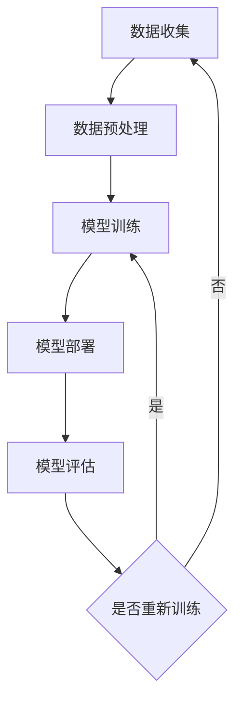

                 

关键词：AI大模型，数据中心，数据管理，架构设计，性能优化，安全性，数据分析，分布式系统

> 摘要：随着人工智能技术的飞速发展，AI大模型的应用需求不断增长。本文将深入探讨AI大模型在数据中心中的数据管理架构，包括核心概念、算法原理、数学模型以及项目实践等多个方面，为AI大模型的应用提供有力的技术支持和理论指导。

## 1. 背景介绍

在当今的信息时代，数据中心已经成为企业和组织的关键基础设施。随着大数据、云计算和人工智能技术的普及，数据中心的重要性愈发突出。AI大模型，作为一种能够处理和生成大量数据的强大工具，已经成为提升数据中心智能化水平的关键因素。本文将围绕AI大模型在数据中心中的应用，探讨其数据管理架构的设计和优化。

### 1.1 AI大模型的发展

AI大模型，尤其是深度学习模型，近年来取得了显著的进展。得益于计算能力的提升和海量数据的积累，AI大模型在各种任务中表现出了卓越的能力，包括图像识别、自然语言处理、推荐系统等。然而，这些模型的训练和部署对数据管理提出了更高的要求。

### 1.2 数据中心的发展

数据中心作为数据存储、处理和分发的重要场所，其规模和复杂性不断增加。传统的数据中心架构已经难以满足AI大模型的需求。为了充分利用AI大模型的优势，数据中心需要进行相应的架构调整和优化。

### 1.3 数据管理的重要性

数据管理是数据中心的基石。一个高效、可靠的数据管理架构对于AI大模型的性能和安全性至关重要。本文将详细探讨数据管理架构的设计原则、关键技术以及实现方法。

## 2. 核心概念与联系

### 2.1 数据中心架构概述

数据中心的架构通常包括硬件基础设施、软件系统、网络架构和安全管理等多个方面。在本文中，我们重点关注与数据管理相关的架构组件。

### 2.2 AI大模型数据处理流程

AI大模型的数据处理流程主要包括数据收集、数据预处理、模型训练、模型部署和模型评估等环节。这些环节相互关联，共同构成了AI大模型的数据管理架构。

### 2.3 Mermaid 流程图

以下是一个简化的Mermaid流程图，展示了AI大模型在数据中心中的数据处理流程：



## 3. 核心算法原理 & 具体操作步骤

### 3.1 算法原理概述

AI大模型的核心算法通常是基于深度学习的神经网络。神经网络通过多层非线性变换，将输入数据映射到输出结果。具体来说，AI大模型的训练过程包括以下几个步骤：

1. **初始化参数**：随机初始化网络的权重和偏置。
2. **前向传播**：将输入数据通过网络层，计算输出结果。
3. **计算损失**：计算输出结果与真实值之间的差异，即损失。
4. **反向传播**：根据损失，调整网络的权重和偏置。
5. **迭代优化**：重复上述步骤，直到模型收敛。

### 3.2 算法步骤详解

1. **初始化参数**：

   初始化权重和偏置是神经网络训练的重要步骤。常用的初始化方法包括随机初始化、高斯初始化等。

2. **前向传播**：

   前向传播是神经网络处理数据的基本过程。输入数据通过网络的每一层，经过非线性变换，最终得到输出结果。

3. **计算损失**：

   损失函数用于衡量输出结果与真实值之间的差距。常用的损失函数包括均方误差（MSE）、交叉熵（CE）等。

4. **反向传播**：

   反向传播是神经网络训练的核心步骤。通过计算梯度，调整网络的权重和偏置，从而减小损失。

5. **迭代优化**：

   通过多次迭代优化，使得模型在训练数据上逐渐收敛，达到较好的性能。

### 3.3 算法优缺点

1. **优点**：

   - **强大的表示能力**：神经网络可以自动提取特征，适应各种复杂的数据分布。
   - **灵活的架构**：神经网络可以设计成多层结构，适合处理大规模数据。
   - **高效的训练**：现代深度学习框架提供了高效的训练算法，可以快速收敛。

2. **缺点**：

   - **计算资源需求大**：深度学习模型通常需要大量的计算资源，对硬件要求较高。
   - **数据依赖性强**：深度学习模型的性能依赖于大量标注数据，数据质量和数量直接影响模型效果。
   - **解释性不足**：神经网络模型往往被视为“黑盒”，难以解释其内部工作机制。

### 3.4 算法应用领域

AI大模型在数据中心的应用涵盖了多个领域，包括：

- **图像识别**：广泛应用于人脸识别、车牌识别等场景。
- **自然语言处理**：包括机器翻译、情感分析、文本生成等。
- **推荐系统**：用于电商、社交网络等平台的个性化推荐。
- **预测分析**：应用于金融市场、天气预测等领域的预测分析。

## 4. 数学模型和公式 & 详细讲解 & 举例说明

### 4.1 数学模型构建

AI大模型的核心是神经网络，其数学模型可以表示为：

$$
y = f(\text{activation}(W \cdot x + b))
$$

其中，$y$ 是输出结果，$f$ 是激活函数，$W$ 是权重矩阵，$x$ 是输入向量，$b$ 是偏置。

### 4.2 公式推导过程

以下是一个简化的神经网络前向传播和反向传播的推导过程：

1. **前向传播**：

   $$ 
   z_l = W_l \cdot a_{l-1} + b_l \\
   a_l = f(z_l)
   $$

2. **反向传播**：

   $$ 
   \delta_l = \frac{\partial L}{\partial z_l} \cdot \frac{\partial f}{\partial z_l} \\
   \delta_{l-1} = \delta_l \cdot W_{l-1}
   $$

### 4.3 案例分析与讲解

假设我们有一个简单的神经网络，包含两层神经元，用于对二进制数据进行分类。输入数据为 $x = (1, 0)$，目标输出为 $y = (0, 1)$。我们使用以下参数进行训练：

$$ 
W_1 = \begin{bmatrix} 0.1 & 0.2 \\ 0.3 & 0.4 \end{bmatrix}, \quad b_1 = \begin{bmatrix} 0.1 \\ 0.2 \end{bmatrix} \\
W_2 = \begin{bmatrix} 0.1 & 0.3 \\ 0.2 & 0.4 \end{bmatrix}, \quad b_2 = \begin{bmatrix} 0.1 \\ 0.2 \end{bmatrix}
$$

我们使用ReLU函数作为激活函数。以下是前向传播的过程：

$$ 
z_1 = W_1 \cdot x + b_1 = \begin{bmatrix} 0.1 & 0.2 \\ 0.3 & 0.4 \end{bmatrix} \cdot \begin{bmatrix} 1 \\ 0 \end{bmatrix} + \begin{bmatrix} 0.1 \\ 0.2 \end{bmatrix} = \begin{bmatrix} 0.3 \\ 0.5 \end{bmatrix} \\
a_1 = \text{ReLU}(z_1) = \begin{bmatrix} 0.3 \\ 0.5 \end{bmatrix} \\
z_2 = W_2 \cdot a_1 + b_2 = \begin{bmatrix} 0.1 & 0.3 \\ 0.2 & 0.4 \end{bmatrix} \cdot \begin{bmatrix} 0.3 \\ 0.5 \end{bmatrix} + \begin{bmatrix} 0.1 \\ 0.2 \end{bmatrix} = \begin{bmatrix} 0.2 \\ 0.4 \end{bmatrix} \\
a_2 = \text{ReLU}(z_2) = \begin{bmatrix} 0.2 \\ 0.4 \end{bmatrix}
$$

假设我们的损失函数为均方误差（MSE），目标输出为 $y = (0, 1)$，实际输出为 $a_2 = (0.2, 0.4)$。计算损失：

$$ 
L = \frac{1}{2} \sum_{i=1}^2 (y_i - a_{2i})^2 = \frac{1}{2} \cdot (0 - 0.2)^2 + (1 - 0.4)^2 = 0.18
$$

接下来进行反向传播，计算梯度：

$$ 
\delta_2 = \frac{\partial L}{\partial z_2} \cdot \frac{\partial \text{ReLU}}{\partial z_2} = (y - a_2) \cdot \text{ReLU'}(z_2) = \begin{bmatrix} -0.2 & -0.6 \end{bmatrix} \\
\delta_1 = \delta_2 \cdot W_{2}^{T} = \begin{bmatrix} -0.2 & -0.6 \end{bmatrix} \cdot \begin{bmatrix} 0.1 & 0.3 \\ 0.2 & 0.4 \end{bmatrix}^{T} = \begin{bmatrix} -0.04 & -0.18 \\ -0.06 & -0.24 \end{bmatrix}
$$

更新权重和偏置：

$$ 
W_1 = W_1 - \alpha \cdot \delta_1 \cdot a_1^{T} = \begin{bmatrix} 0.1 & 0.2 \\ 0.3 & 0.4 \end{bmatrix} - 0.1 \cdot \begin{bmatrix} -0.04 & -0.18 \\ -0.06 & -0.24 \end{bmatrix} \cdot \begin{bmatrix} 0.3 \\ 0.5 \end{bmatrix} = \begin{bmatrix} 0.06 & 0.28 \\ 0.21 & 0.32 \end{bmatrix} \\
b_1 = b_1 - \alpha \cdot \delta_1 = \begin{bmatrix} 0.1 \\ 0.2 \end{bmatrix} - 0.1 \cdot \begin{bmatrix} -0.04 & -0.18 \\ -0.06 & -0.24 \end{bmatrix} = \begin{bmatrix} 0.14 \\ 0.26 \end{bmatrix} \\
W_2 = W_2 - \alpha \cdot \delta_2 \cdot a_1^{T} = \begin{bmatrix} 0.1 & 0.3 \\ 0.2 & 0.4 \end{bmatrix} - 0.1 \cdot \begin{bmatrix} -0.2 & -0.6 \end{bmatrix} \cdot \begin{bmatrix} 0.3 \\ 0.5 \end{bmatrix} = \begin{bmatrix} 0.22 & 0.12 \\ 0.24 & 0.32 \end{bmatrix} \\
b_2 = b_2 - \alpha \cdot \delta_2 = \begin{bmatrix} 0.1 \\ 0.2 \end{bmatrix} - 0.1 \cdot \begin{bmatrix} -0.2 & -0.6 \end{bmatrix} = \begin{bmatrix} 0.3 \\ 0.4 \end{bmatrix}
$$

通过多次迭代优化，模型将逐渐收敛，达到较好的性能。

## 5. 项目实践：代码实例和详细解释说明

### 5.1 开发环境搭建

为了实践AI大模型在数据中心的数据管理架构，我们需要搭建一个合适的开发环境。以下是所需的软件和硬件环境：

- **硬件环境**：至少需要一台配置为Intel i7及以上处理器的计算机，8GB及以上内存，以及一块能够支持深度学习加速的显卡（如NVIDIA GPU）。
- **软件环境**：安装Python 3.7及以上版本，TensorFlow 2.0及以上版本，以及相关依赖库（如NumPy、Pandas等）。

### 5.2 源代码详细实现

以下是一个简单的AI大模型项目实例，使用TensorFlow实现了一个基于神经网络的手写数字识别模型：

```python
import tensorflow as tf
from tensorflow.keras import layers

# 数据集加载和预处理
mnist = tf.keras.datasets.mnist
(x_train, y_train), (x_test, y_test) = mnist.load_data()
x_train, x_test = x_train / 255.0, x_test / 255.0
x_train = x_train.reshape(-1, 28, 28)
x_test = x_test.reshape(-1, 28, 28)

# 模型构建
model = tf.keras.Sequential([
    layers.Conv2D(32, (3, 3), activation='relu', input_shape=(28, 28, 1)),
    layers.MaxPooling2D((2, 2)),
    layers.Flatten(),
    layers.Dense(128, activation='relu'),
    layers.Dense(10, activation='softmax')
])

# 模型编译
model.compile(optimizer='adam',
              loss='sparse_categorical_crossentropy',
              metrics=['accuracy'])

# 模型训练
model.fit(x_train, y_train, epochs=5)

# 模型评估
test_loss, test_acc = model.evaluate(x_test, y_test, verbose=2)
print(f'\nTest accuracy: {test_acc:.4f}')
```

### 5.3 代码解读与分析

- **数据集加载和预处理**：我们使用TensorFlow内置的MNIST手写数字数据集。首先将图像数据归一化到0-1范围内，然后将其调整为批量形式，以便模型训练。

- **模型构建**：我们构建了一个简单的卷积神经网络，包括两个卷积层、一个最大池化层、一个全连接层以及一个softmax输出层。卷积层用于提取图像特征，全连接层用于分类。

- **模型编译**：我们使用Adam优化器和稀疏分类交叉熵损失函数编译模型。Adam优化器是一种高效的梯度下降算法，交叉熵损失函数用于衡量模型的分类性能。

- **模型训练**：我们使用训练集对模型进行5个周期的训练。每个周期包括前向传播、计算损失、反向传播和更新参数的过程。

- **模型评估**：我们使用测试集评估模型的性能。测试集上的准确率表明了模型的泛化能力。

通过这个简单的实例，我们可以看到如何使用TensorFlow构建和训练一个AI大模型。在实际项目中，我们还需要考虑数据预处理、模型调优、性能优化等多个方面。

## 6. 实际应用场景

### 6.1 数据中心安全监控

在数据中心中，安全监控是一个关键应用场景。通过部署AI大模型，可以对网络流量、系统日志等数据进行实时分析，识别潜在的安全威胁。

### 6.2 数据中心性能优化

AI大模型可以帮助数据中心进行性能优化。通过对历史数据进行分析，模型可以预测系统的负载情况，并提供相应的优化建议。

### 6.3 数据中心能源管理

AI大模型可以用于数据中心能源管理。通过对能耗数据进行实时分析，模型可以优化设备的运行状态，降低能源消耗。

### 6.4 未来应用展望

随着AI大模型技术的不断成熟，其在数据中心的应用场景将更加广泛。未来，AI大模型可能会在数据中心的管理、运营、优化等多个方面发挥重要作用。

## 7. 工具和资源推荐

### 7.1 学习资源推荐

- 《深度学习》（Goodfellow, Bengio, Courville著）：深度学习领域的经典教材，适合初学者和进阶者。
- 《动手学深度学习》（阿斯顿·张著）：结合Python实践，深入讲解深度学习的基本原理和应用。

### 7.2 开发工具推荐

- TensorFlow：Google开源的深度学习框架，支持多种神经网络架构和优化算法。
- PyTorch：Facebook开源的深度学习框架，具有灵活的动态图模型。

### 7.3 相关论文推荐

- "Deep Learning for Data Centers"：探讨了深度学习在数据中心中的应用和挑战。
- "Energy Efficient Data Centers"：分析了数据中心能源管理的问题和解决方案。

## 8. 总结：未来发展趋势与挑战

### 8.1 研究成果总结

本文围绕AI大模型在数据中心的应用，探讨了数据管理架构的设计和优化。通过核心算法原理、数学模型和项目实践等多个方面，我们总结了AI大模型在数据中心中的优势和挑战。

### 8.2 未来发展趋势

随着AI技术的不断进步，AI大模型在数据中心的应用前景广阔。未来，AI大模型将更加深入地融入数据中心的管理、运营和优化，为数据中心带来更高的效率和安全性。

### 8.3 面临的挑战

尽管AI大模型在数据中心的应用具有巨大潜力，但也面临着诸多挑战，包括计算资源需求、数据依赖性、解释性不足等。解决这些挑战需要进一步的研究和创新。

### 8.4 研究展望

未来，我们期待在AI大模型的数据管理架构方面取得更多突破，包括优化算法、提高解释性、降低计算成本等。通过持续的研究和实践，AI大模型将为数据中心带来更多的价值。

## 9. 附录：常见问题与解答

### 9.1 AI大模型需要大量的计算资源吗？

是的，AI大模型通常需要大量的计算资源，尤其是训练过程中。这包括高性能的CPU和GPU，以及高效的数据处理和存储系统。随着计算能力的提升，训练AI大模型所需的时间和资源正在逐步减少。

### 9.2 AI大模型是否适用于所有数据中心应用场景？

AI大模型在某些应用场景中表现出色，但在其他场景中可能并不适用。例如，在实时性要求高的场景中，AI大模型的响应速度可能无法满足需求。因此，在选择AI大模型时，需要根据具体应用场景进行综合考虑。

### 9.3 如何保证AI大模型的安全性？

为了保证AI大模型的安全性，需要在数据采集、处理和存储等各个环节进行严格的控制和保护。此外，还需要定期进行安全评估和更新，以应对潜在的安全威胁。

## 结语

AI大模型在数据中心的应用具有广阔的前景，但同时也面临诸多挑战。通过深入探讨数据管理架构的设计和优化，本文为AI大模型的应用提供了有力的技术支持和理论指导。我们期待在未来的研究和实践中，能够进一步推动AI大模型在数据中心的应用和发展。

