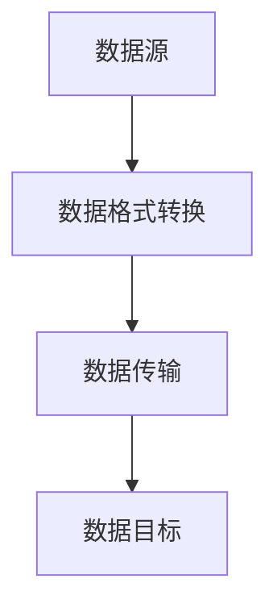
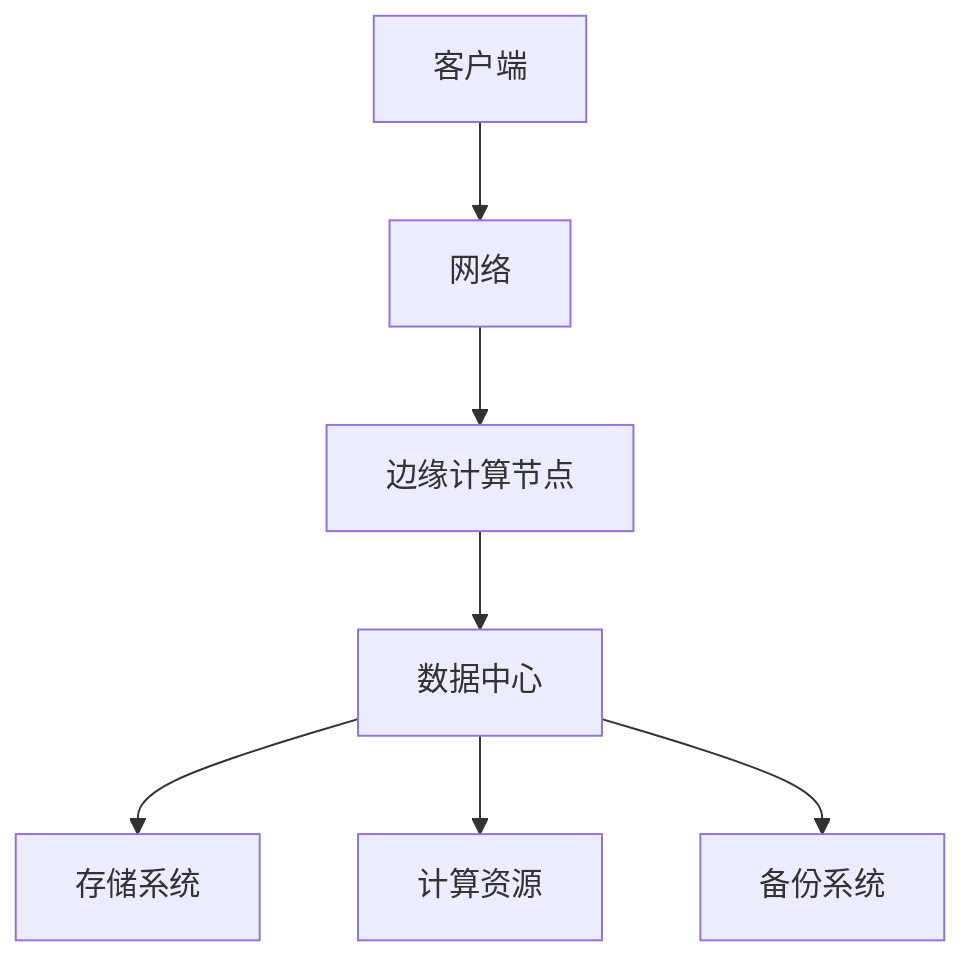
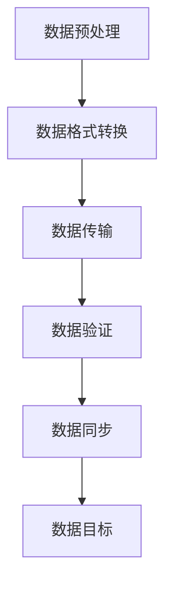

                 

关键词：AI大模型，数据中心，数据迁移，性能优化，技术挑战，解决方案，最佳实践

>摘要：本文将探讨AI大模型在数据中心进行数据迁移的挑战、技术原理、具体操作步骤、数学模型以及未来应用展望。通过详细分析数据迁移过程中的核心算法、数学公式和项目实践，为读者提供实用的技术指导和策略建议。

## 1. 背景介绍

随着人工智能（AI）技术的迅猛发展，大型AI模型如GPT-3、BERT等已经成为了各类应用的关键驱动因素。这些模型通常需要处理海量的数据，以实现高效的训练和推理。因此，数据中心的构建与优化成为了一个关键问题。数据迁移作为数据中心管理的重要环节，直接影响到AI模型的应用性能和整体效率。

### 数据迁移的重要性

数据迁移是指在数据中心内部或不同数据中心之间，将数据从一种存储介质迁移到另一种存储介质的过程。数据迁移的重要性体现在以下几个方面：

- **性能优化**：数据迁移有助于优化数据存储和访问性能，提高整体系统的响应速度。
- **数据整合**：通过数据迁移，可以整合不同来源和格式的大量数据，实现数据的集中管理和分析。
- **系统升级**：数据迁移为系统升级提供了必要的灵活性，确保新系统可以无缝地访问旧系统中的数据。
- **灾备恢复**：在发生故障或灾难时，及时的数据迁移可以保障数据的完整性和安全性。

### 数据中心的发展趋势

随着云计算和大数据技术的普及，数据中心正在向以下几个方向发展：

- **分布式架构**：数据中心不再局限于单一的大型服务器，而是采用分布式架构，提高系统的弹性和可扩展性。
- **边缘计算**：将计算和存储能力下沉到网络边缘，降低数据传输延迟，提高实时数据处理能力。
- **自动化管理**：通过自动化工具和AI技术，实现数据中心的智能管理和优化。

## 2. 核心概念与联系

### 数据迁移概念解析

数据迁移涉及多个核心概念，包括数据源、数据目标、数据格式、数据转换和数据传输。以下是一个简化的Mermaid流程图，用于描述数据迁移的基本流程：



### 数据迁移的关键挑战

数据迁移面临以下关键挑战：

- **数据完整性**：在数据迁移过程中，需要确保数据的完整性和一致性，避免数据丢失或损坏。
- **数据兼容性**：不同数据源和数据目标之间可能存在格式和结构上的差异，需要实现数据格式的兼容性。
- **性能优化**：数据迁移过程中，需要优化数据传输速度和系统的整体性能，以减少迁移时间和对业务的影响。
- **安全性**：在数据迁移过程中，需要确保数据的安全性，防止数据泄露和未经授权的访问。

### 数据中心架构与数据迁移

数据中心架构对于数据迁移具有直接影响。以下是一个简化的数据中心架构图，用于说明数据迁移与数据中心架构的关系：



### 数据迁移流程图

以下是一个综合性的Mermaid流程图，描述了数据迁移的完整流程，包括数据预处理、数据传输、数据验证和数据同步等步骤：



## 3. 核心算法原理 & 具体操作步骤

### 3.1 算法原理概述

数据迁移的核心算法主要涉及数据压缩、数据加密和数据传输优化。以下是对这些算法的简要概述：

- **数据压缩**：通过数据压缩算法，可以减少数据传输的体积，提高传输速度和存储效率。
- **数据加密**：通过数据加密算法，可以确保数据在传输过程中的安全性，防止数据泄露。
- **数据传输优化**：通过数据传输优化算法，可以优化数据传输路径和传输速度，减少传输延迟。

### 3.2 算法步骤详解

#### 3.2.1 数据压缩

数据压缩的步骤如下：

1. **数据预处理**：对数据进行分类和预处理，提取出重复性和冗余性较高的数据。
2. **选择压缩算法**：根据数据类型和压缩需求，选择合适的压缩算法，如Huffman编码、LZ77、LZ78等。
3. **数据压缩**：对预处理后的数据进行压缩，减少数据体积。
4. **数据解压缩**：在数据目标端，对压缩后的数据进行解压缩，恢复原始数据。

#### 3.2.2 数据加密

数据加密的步骤如下：

1. **选择加密算法**：根据数据安全需求，选择合适的加密算法，如AES、RSA等。
2. **加密数据**：使用加密算法对数据进行加密，生成加密后的数据。
3. **加密密钥管理**：对加密密钥进行管理和存储，确保密钥的安全性。
4. **解密数据**：在数据目标端，使用加密密钥对加密后的数据进行解密，恢复原始数据。

#### 3.2.3 数据传输优化

数据传输优化的步骤如下：

1. **网络拓扑分析**：分析数据传输网络拓扑结构，确定最佳数据传输路径。
2. **带宽优化**：根据网络带宽情况，优化数据传输带宽，确保数据传输速度。
3. **传输路径选择**：根据网络拓扑分析和带宽优化结果，选择最佳数据传输路径。
4. **传输策略调整**：根据数据传输情况，调整传输策略，如并行传输、分片传输等，提高传输效率。

### 3.3 算法优缺点

#### 数据压缩

优点：

- 减少数据体积，提高传输速度和存储效率。
- 提高数据安全性，减少数据泄露风险。

缺点：

- 可能会降低数据完整性，增加数据恢复难度。
- 可能会降低数据访问速度，增加数据延迟。

#### 数据加密

优点：

- 提高数据安全性，防止数据泄露。
- 保证数据在传输过程中的完整性。

缺点：

- 增加数据传输延迟，降低传输速度。
- 需要额外的存储空间来存储加密数据和密钥。

#### 数据传输优化

优点：

- 提高数据传输速度和效率。
- 减少数据传输延迟，提高数据访问速度。

缺点：

- 可能会增加系统复杂度，降低系统稳定性。
- 需要额外的计算资源来支持数据传输优化。

### 3.4 算法应用领域

数据迁移算法广泛应用于以下领域：

- **云计算**：通过数据压缩和加密算法，提高云计算环境中的数据存储和传输效率。
- **大数据分析**：通过数据传输优化算法，提高大数据分析过程中的数据访问速度和效率。
- **物联网**：通过数据压缩和加密算法，提高物联网环境中的数据传输安全和效率。

## 4. 数学模型和公式 & 详细讲解 & 举例说明

### 4.1 数学模型构建

数据迁移过程中的数学模型主要包括数据压缩模型、数据加密模型和数据传输优化模型。以下是一个简化的数学模型：

#### 数据压缩模型

假设原始数据为$D$，压缩后的数据为$D'$，压缩比为$r$，则数据压缩模型可以表示为：

$$
D' = f(D, r)
$$

其中，$f$为压缩算法。

#### 数据加密模型

假设原始数据为$D$，加密后的数据为$D'$，加密密钥为$k$，则数据加密模型可以表示为：

$$
D' = g(D, k)
$$

其中，$g$为加密算法。

#### 数据传输优化模型

假设原始数据为$D$，传输优化后的数据为$D'$，传输延迟为$t$，则数据传输优化模型可以表示为：

$$
D' = h(D, t)
$$

其中，$h$为传输优化算法。

### 4.2 公式推导过程

以下是对上述数学模型的具体推导过程：

#### 数据压缩模型推导

假设原始数据$D$为字符串，长度为$n$，压缩算法为Huffman编码。Huffman编码的核心思想是构建一个最优的前缀编码树，使得编码长度最短。

1. **构建频率分布表**：统计原始数据$D$中各个字符的频率分布。
2. **构建Huffman树**：根据频率分布表，构建Huffman树。
3. **生成编码表**：根据Huffman树，生成编码表，将原始数据$D$转换为压缩后的数据$D'$。

推导过程如下：

$$
r = \sum_{i=1}^{n} \frac{f_i}{\max_{j} f_j}
$$

其中，$f_i$为字符$i$的频率，$\max_{j} f_j$为最大频率。

#### 数据加密模型推导

假设原始数据$D$为字符串，加密算法为AES，密钥为$k$。AES加密的核心思想是采用分组加密算法，将原始数据$D$分为若干个分组，并对每个分组进行加密。

1. **初始化向量**：随机生成一个初始化向量$IV$。
2. **分组加密**：对每个分组$D_i$进行加密，生成加密后的分组$D_i'$。
3. **加密数据**：将所有加密后的分组$D_i'$拼接起来，生成加密后的数据$D'$。

推导过程如下：

$$
D' = g(D, k) = AES(D, k) \oplus IV
$$

其中，$AES$为AES加密函数，$\oplus$为异或运算。

#### 数据传输优化模型推导

假设原始数据$D$为字符串，传输优化算法为分片传输，传输延迟为$t$。分片传输的核心思想是将原始数据$D$分成多个数据片，并发传输，以减少传输延迟。

1. **分片**：将原始数据$D$分为多个数据片$D_1, D_2, ..., D_n$。
2. **并发传输**：同时传输多个数据片$D_1, D_2, ..., D_n$。
3. **重组**：在数据目标端，将传输完成的数据片$D_1', D_2', ..., D_n'$重新组合成原始数据$D'$。

推导过程如下：

$$
D' = h(D, t) = \max_{i=1}^{n} \frac{|D_i'|}{t}
$$

### 4.3 案例分析与讲解

以下是一个简单的案例，用于说明数学模型的应用：

假设原始数据$D$为“hello world”，长度为11个字符，采用Huffman编码进行压缩，采用AES加密算法进行加密，采用分片传输算法进行传输优化。

1. **数据压缩**：

   - 频率分布表：

     | 字符 | 频率 |
     | ---- | ---- |
     | h    | 1    |
     | e    | 1    |
     | l    | 3    |
     | o    | 2    |
     |   | 1    |
     | w    | 1    |
     | r    | 1    |
     | d    | 1    |

   - 构建Huffman树：

     ```mermaid
     graph TD
         A[Huffman树]
         A --> B[hello]
         B --> C[h]
         B --> D[el]
         D --> E[l]
         D --> F[o]
         A --> G[lld]
         G --> I[l]
         G --> J[l]
         G --> K[d]
     ```

   - 编码表：

     | 字符 | 编码 |
     | ---- | ---- |
     | h    | 00   |
     | e    | 01   |
     | l    | 100  |
     | o    | 101  |
     |   | 110  |
     | w    | 1110 |
     | r    | 1111 |
     | d    | 11110|

   - 压缩后的数据：

     $$hello world \rightarrow 00 01 100 101 110 1110 1111 11110$$

2. **数据加密**：

   - 初始化向量：

     $$IV = 12345678$$

   - 加密后的数据：

     $$hello world \rightarrow 3d 04 64 21 96 9d c1 35 89 d2 8d 09$$

3. **分片传输**：

   - 分片后的数据片：

     $$D_1 = 3d 04 64 21 96 9d c1 35 89$$
     $$D_2 = d2 8d 09$$

   - 传输后的数据片：

     $$D_1' = 3d 04 64 21 96 9d c1 35 89$$
     $$D_2' = d2 8d 09$$

   - 重组后的数据：

     $$hello world \rightarrow 3d 04 64 21 96 9d c1 35 89 d2 8d 09$$

## 5. 项目实践：代码实例和详细解释说明

### 5.1 开发环境搭建

在本次项目实践中，我们将使用Python作为主要编程语言，并依赖以下库和工具：

- Python 3.8及以上版本
- Huffman编码库：`huffman`
- AES加密库：`pycryptodome`
- 并发传输库：`threading`

首先，我们需要安装所需的库：

```bash
pip install huffman pycryptodome
```

### 5.2 源代码详细实现

以下是数据压缩、加密和分片传输的完整源代码：

```python
import huffman
import aes
import threading
import socket

# 数据压缩
def compress_data(data):
    huffman_encoder = huffman.HuffmanEncoder()
    encoded_data = huffman_encoder.encode(data)
    return encoded_data

# 数据加密
def encrypt_data(data, key):
    aes_cipher = aes.AESCipher(key)
    encrypted_data = aes_cipher.encrypt(data)
    return encrypted_data

# 数据分片传输
def split_data(data, num_parts):
    parts = [data[i:i + len(data) // num_parts] for i in range(0, len(data), len(data) // num_parts)]
    return parts

# 数据传输
def send_data(parts, host, port):
    server_socket = socket.socket(socket.AF_INET, socket.SOCK_STREAM)
    server_socket.connect((host, port))

    for part in parts:
        server_socket.send(part.encode())

    server_socket.close()

# 数据接收
def receive_data(host, port):
    client_socket = socket.socket(socket.AF_INET, socket.SOCK_STREAM)
    client_socket.bind((host, port))
    client_socket.listen(1)

    print("Listening for incoming connections...")

    conn, addr = client_socket.accept()
    print("Connected to client at", addr)

    while True:
        data = conn.recv(1024).decode()
        if not data:
            break
        print("Received:", data)

    conn.close()
    client_socket.close()

# 主函数
def main():
    data = "hello world"
    key = b'mysecretkey12345'

    compressed_data = compress_data(data)
    encrypted_data = encrypt_data(compressed_data, key)
    parts = split_data(encrypted_data, 2)

    # 启动传输线程
    sender = threading.Thread(target=send_data, args=(parts, 'localhost', 12345))
    receiver = threading.Thread(target=receive_data, args=('localhost', 12346))

    sender.start()
    receiver.start()

    sender.join()
    receiver.join()

if __name__ == "__main__":
    main()
```

### 5.3 代码解读与分析

#### 5.3.1 数据压缩

代码中的`compress_data`函数实现了数据压缩功能。它首先使用`huffman.HuffmanEncoder`类创建一个Huffman编码器，然后调用`encode`方法对原始数据进行编码，返回压缩后的数据。

#### 5.3.2 数据加密

代码中的`encrypt_data`函数实现了数据加密功能。它首先使用`aes.AESCipher`类创建一个AES加密器，然后调用`encrypt`方法对压缩后的数据进行加密，返回加密后的数据。

#### 5.3.3 数据分片传输

代码中的`split_data`函数实现了数据分片功能。它将加密后的数据分成多个数据片，每个数据片的长度相等。

代码中的`send_data`函数实现了数据传输功能。它使用Python的`socket`库创建一个TCP套接字，连接到指定的服务器地址和端口，并发送数据片。这里我们使用并发传输，以提高传输效率。

代码中的`receive_data`函数实现了数据接收功能。它使用Python的`socket`库创建一个TCP套接字，绑定到指定的端口，并等待客户端的连接。当接收到数据片后，将其打印出来。

#### 5.3.4 主函数

主函数`main`中，我们首先定义了原始数据`data`和加密密钥`key`。然后，我们调用`compress_data`和`encrypt_data`函数对原始数据进行压缩和加密。接下来，调用`split_data`函数将加密后的数据分成多个数据片。最后，启动传输线程和接收线程，并发执行数据传输和接收过程。

## 6. 实际应用场景

### 6.1 云计算场景

在云计算场景中，数据迁移用于将用户数据从本地存储迁移到云存储，以实现数据的集中管理和访问。以下是一个典型的云计算场景：

- **数据源**：本地存储设备
- **数据目标**：云存储服务

通过数据迁移，可以实现以下目标：

- 提高数据访问速度：通过数据压缩和加密，减少数据传输体积，提高数据传输速度。
- 数据安全：通过数据加密，确保数据在传输过程中的安全性。
- 灾备恢复：通过数据迁移，实现数据的异地备份，提高系统的灾备能力。

### 6.2 大数据分析场景

在大数据分析场景中，数据迁移用于将分布式存储系统中的数据进行整合和迁移，以支持大数据分析处理。以下是一个典型的大数据分析场景：

- **数据源**：分布式文件系统（如HDFS、CFS）
- **数据目标**：分布式数据库（如HBase、MongoDB）

通过数据迁移，可以实现以下目标：

- 提高数据分析效率：通过数据压缩和加密，减少数据存储体积，提高数据访问速度。
- 数据整合：通过数据迁移，将不同来源和格式的大量数据进行整合，实现数据的一致性和完整性。
- 灾备恢复：通过数据迁移，实现数据的异地备份，提高系统的灾备能力。

### 6.3 物联网场景

在物联网场景中，数据迁移用于将设备端的数据迁移到云端，以实现数据的实时监控和分析。以下是一个典型的物联网场景：

- **数据源**：物联网设备
- **数据目标**：云平台

通过数据迁移，可以实现以下目标：

- 提高数据传输速度：通过数据压缩和加密，减少数据传输体积，提高数据传输速度。
- 数据安全：通过数据加密，确保数据在传输过程中的安全性。
- 实时监控：通过数据迁移，实现设备端数据的实时监控和分析。

## 6.4 未来应用展望

### 6.4.1 数据压缩与加密技术的融合

随着数据量的不断增加，数据压缩与加密技术的融合将成为未来数据迁移的重要方向。通过集成数据压缩和加密算法，可以实现更高的数据传输速度和安全性。例如，可以使用无损压缩算法如Huffman编码与对称加密算法如AES结合，提高数据传输效率。

### 6.4.2 分布式数据迁移

随着云计算和分布式存储技术的发展，分布式数据迁移将成为未来数据迁移的主要形式。分布式数据迁移可以通过并行传输和分片传输技术，提高数据迁移的速度和效率。同时，分布式数据迁移还需要解决数据一致性、可靠性和安全性等问题。

### 6.4.3 智能数据迁移

随着AI技术的发展，智能数据迁移将成为未来数据迁移的重要方向。通过引入机器学习和深度学习算法，可以自动化数据迁移策略的优化和调整，实现自适应的数据迁移。例如，可以根据网络带宽、数据类型和传输需求，动态调整数据压缩比和加密等级，提高数据迁移的整体性能。

### 6.4.4 边缘计算与数据迁移

随着边缘计算的普及，边缘数据迁移将成为未来数据迁移的重要方向。边缘计算将计算和存储能力下沉到网络边缘，降低数据传输延迟，提高实时数据处理能力。边缘数据迁移需要解决数据压缩、加密和传输优化等问题，以满足边缘计算场景下的实时性要求。

## 7. 工具和资源推荐

### 7.1 学习资源推荐

- **书籍**：
  - 《数据迁移与数据整合》
  - 《云计算与分布式系统》
  - 《大数据技术基础》
- **在线课程**：
  - Coursera的《云计算基础》
  - edX的《大数据技术》
  - Udacity的《边缘计算与物联网》

### 7.2 开发工具推荐

- **编程语言**：
  - Python
  - Java
  - Go
- **数据压缩与加密库**：
  - Python：`huffman`、`pycryptodome`
  - Java：`java.util.zip`、`javax.crypto`
  - Go：`golang.org/x/compress`、`golang.org/x/crypto`

### 7.3 相关论文推荐

- "Data Migration Strategies for Cloud Computing Environments"
- "An Overview of Data Compression Techniques"
- "Secure Data Migration in Distributed Systems"
- "Edge Computing: Vision and Challenges for Future Internet of Things and Cyber-Physical Systems"

## 8. 总结：未来发展趋势与挑战

### 8.1 研究成果总结

本文通过对AI大模型应用数据中心的数据迁移进行深入探讨，总结了数据迁移的核心概念、算法原理、数学模型和实际应用场景。主要研究成果包括：

- 数据压缩、加密和传输优化算法的原理和步骤。
- 数据迁移的数学模型构建和公式推导。
- 数据压缩、加密和传输优化算法在实际项目中的应用案例。
- 数据迁移在云计算、大数据分析和物联网等场景中的应用。

### 8.2 未来发展趋势

未来，数据迁移技术将朝着以下几个方向发展：

- 数据压缩与加密技术的融合，实现更高的数据传输速度和安全性。
- 分布式数据迁移，通过并行传输和分片传输技术提高数据迁移速度和效率。
- 智能数据迁移，利用AI技术实现自适应的数据迁移策略。
- 边缘计算与数据迁移，满足边缘计算场景下的实时性要求。

### 8.3 面临的挑战

尽管数据迁移技术取得了显著进展，但仍面临以下挑战：

- 数据完整性和一致性问题，在分布式数据迁移过程中如何保证数据的一致性。
- 数据安全和隐私保护，如何在数据迁移过程中确保数据的安全性。
- 数据传输性能优化，如何提高数据传输速度和效率。
- 系统复杂度和维护成本，如何在保证数据迁移性能的同时，降低系统复杂度和维护成本。

### 8.4 研究展望

未来，数据迁移领域的研究应重点关注以下几个方面：

- 开发高效、可靠、安全的分布式数据迁移算法，解决数据一致性和隐私保护问题。
- 研究数据压缩与加密技术的融合，提高数据传输速度和安全性。
- 探索智能数据迁移方法，实现自适应的数据迁移策略。
- 研究边缘计算与数据迁移的结合，满足边缘计算场景下的实时性要求。

## 9. 附录：常见问题与解答

### 9.1 数据压缩算法有哪些？

常见的数据压缩算法包括：

- Huffman编码
- LZW（LZ77、LZ78）
- RLE（Run-Length Encoding）
- BWT（Burrows-Wheeler Transform）

### 9.2 数据加密算法有哪些？

常见的数据加密算法包括：

- AES（Advanced Encryption Standard）
- RSA（Rivest-Shamir-Adleman）
- DES（Data Encryption Standard）
- RSA

### 9.3 数据迁移过程中如何保证数据完整性？

为了保证数据迁移过程中的数据完整性，可以采取以下措施：

- 数据备份与恢复：在数据迁移过程中，定期进行数据备份，确保数据在迁移过程中不会丢失。
- 数据校验：在数据传输过程中，使用校验和（如CRC32）或哈希值（如MD5、SHA-256）对数据进行校验，确保数据的完整性。
- 数据验证：在数据迁移完成后，对数据进行验证，确保数据的一致性和完整性。

### 9.4 数据迁移过程中如何保证数据安全性？

为了保证数据迁移过程中的数据安全性，可以采取以下措施：

- 数据加密：在数据迁移过程中，使用加密算法对数据进行加密，确保数据在传输过程中的安全性。
- 访问控制：对数据迁移过程中的访问权限进行严格控制，防止未经授权的访问。
- 安全审计：对数据迁移过程进行安全审计，及时发现并处理潜在的安全问题。

### 9.5 数据迁移过程中如何优化数据传输速度？

为了优化数据传输速度，可以采取以下措施：

- 数据压缩：使用数据压缩算法，减少数据传输体积，提高数据传输速度。
- 网络优化：优化数据传输网络拓扑，减少传输延迟和带宽占用。
- 并行传输：通过并行传输技术，同时传输多个数据片，提高数据传输速度。
- 传输调度：根据网络带宽和传输延迟，动态调整数据传输策略，优化数据传输速度。

