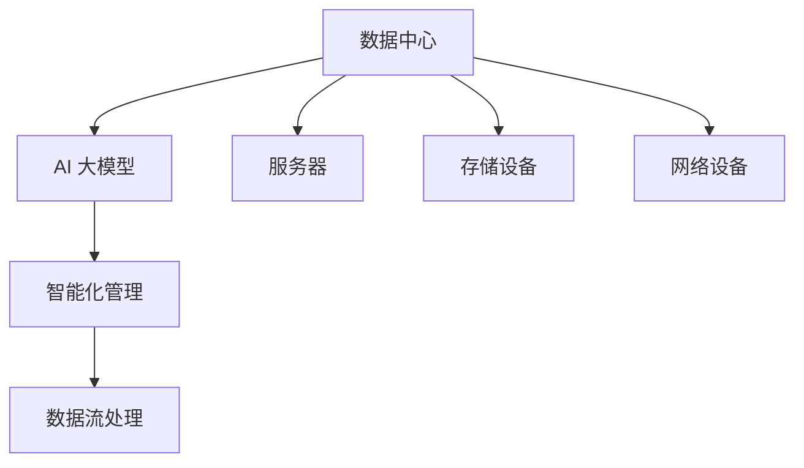

                 

关键词：AI 大模型，数据中心，智能化管理，数据分析，技术架构，算法优化，应用场景，未来展望

> 摘要：本文探讨了 AI 大模型在数据中心智能化管理中的应用，分析了其核心概念与联系，阐述了核心算法原理与数学模型，通过实际项目实践展示了代码实例，并探讨了实际应用场景和未来展望。

## 1. 背景介绍

在过去的几十年中，随着互联网和大数据技术的发展，数据中心已经成为现代信息社会的基础设施。然而，随着数据量的爆发式增长和业务需求的日益复杂，传统数据中心的管理方式已经无法满足高效、智能的要求。因此，AI 大模型的应用逐渐成为数据中心智能化管理的突破口。

AI 大模型，即基于深度学习和神经网络的大规模数据处理模型，具有强大的数据分析与智能决策能力。通过 AI 大模型的应用，数据中心可以实现自动化运维、智能故障检测、资源优化分配等功能，从而提高数据中心的运行效率和服务质量。

本文将从核心概念与联系、核心算法原理与数学模型、实际项目实践、实际应用场景和未来展望等方面，深入探讨 AI 大模型在数据中心智能化管理中的应用。

## 2. 核心概念与联系

为了更好地理解 AI 大模型在数据中心智能化管理中的应用，我们首先需要了解几个核心概念：

- **数据中心**：数据中心是指专门用于存储、处理和交换数据的建筑物或设施。它通常由服务器、存储设备、网络设备等组成，以提供稳定、高效的数据处理能力。

- **AI 大模型**：AI 大模型是指基于深度学习和神经网络的大规模数据处理模型，具有强大的数据分析与智能决策能力。常见的 AI 大模型包括卷积神经网络（CNN）、循环神经网络（RNN）、生成对抗网络（GAN）等。

- **智能化管理**：智能化管理是指利用人工智能技术对数据中心进行自动化运维、智能故障检测、资源优化分配等，以提高数据中心的运行效率和服务质量。

- **数据流处理**：数据流处理是一种实时数据处理技术，可以快速处理海量数据，并实时生成结果。常见的数据流处理技术包括 Apache Kafka、Apache Flink 等。

下图展示了这些核心概念之间的联系：



## 3. 核心算法原理 & 具体操作步骤

### 3.1 算法原理概述

AI 大模型在数据中心智能化管理中的应用主要基于以下算法原理：

1. **深度学习**：深度学习是一种基于多层神经网络的数据分析技术，可以通过自动提取数据特征来提升模型的性能。

2. **神经网络**：神经网络是一种模仿生物神经系统的工作原理，通过层层传递信息，实现数据分析和智能决策。

3. **生成对抗网络（GAN）**：GAN 是一种由生成器和判别器组成的神经网络结构，可以用于生成高质量的数据，从而提高数据中心的自动化运维能力。

### 3.2 算法步骤详解

以下是 AI 大模型在数据中心智能化管理中的具体操作步骤：

1. **数据采集**：从数据中心的各种设备和系统中收集数据，包括服务器性能、存储设备利用率、网络流量等。

2. **数据处理**：对采集到的数据进行预处理，如数据清洗、归一化等，以提高模型的训练效果。

3. **模型训练**：使用深度学习和神经网络算法对预处理后的数据进行训练，以构建智能化管理的模型。

4. **模型部署**：将训练好的模型部署到数据中心，实现自动化运维、智能故障检测、资源优化分配等功能。

5. **模型优化**：通过不断调整模型参数，提高模型在数据中心智能化管理中的性能和效果。

### 3.3 算法优缺点

**优点**：

1. 高效：AI 大模型可以快速处理海量数据，提高数据中心的运行效率。

2. 智能：AI 大模型具有强大的数据分析与智能决策能力，可以降低人为干预。

3. 自适应：AI 大模型可以根据数据中心的运行情况，自动调整模型参数，实现动态优化。

**缺点**：

1. 资源消耗：训练和部署 AI 大模型需要大量计算资源和存储资源。

2. 数据质量：数据质量对模型性能有重要影响，数据质量差可能导致模型失效。

### 3.4 算法应用领域

AI 大模型在数据中心智能化管理中的应用广泛，主要包括：

1. **自动化运维**：通过 AI 大模型对数据中心的各种设备进行自动化监控和故障预测，减少故障发生率和维护成本。

2. **资源优化分配**：通过 AI 大模型对数据中心的各种资源进行动态优化分配，提高资源利用率和服务质量。

3. **智能故障检测**：通过 AI 大模型对数据中心的网络流量、服务器性能等数据进行实时分析，及时发现并处理故障。

## 4. 数学模型和公式 & 详细讲解 & 举例说明

### 4.1 数学模型构建

在 AI 大模型中，常用的数学模型包括神经网络和生成对抗网络（GAN）等。以下分别介绍这两种模型的构建过程。

#### 神经网络

神经网络是一种基于多层感知器（MLP）的数据分析模型。其基本结构包括输入层、隐藏层和输出层。输入层接收外部输入数据，隐藏层对数据进行加工处理，输出层生成最终结果。

神经网络的数学模型可以表示为：

$$
\text{输出} = \sigma(\text{权重} \cdot \text{输入} + \text{偏置})
$$

其中，$\sigma$ 表示激活函数，常用的激活函数包括 sigmoid、ReLU 等。

#### 生成对抗网络（GAN）

生成对抗网络（GAN）是一种由生成器和判别器组成的对抗性神经网络结构。生成器生成虚假数据，判别器判断数据的真实性。生成器和判别器的数学模型如下：

生成器：

$$
\text{生成器} = G(z)
$$

判别器：

$$
\text{判别器} = D(x, G(z))
$$

其中，$z$ 表示生成器的输入，$x$ 表示真实数据。

### 4.2 公式推导过程

以神经网络为例，介绍其数学模型推导过程。

#### 输出层推导

假设输入层为 $x_1, x_2, ..., x_n$，隐藏层为 $h_1, h_2, ..., h_m$，输出层为 $y_1, y_2, ..., y_k$。

输出层推导过程如下：

$$
\text{输出} = \sigma(W_2 \cdot h_2 + b_2)
$$

其中，$W_2$ 为输出层权重，$h_2$ 为隐藏层输出，$b_2$ 为输出层偏置，$\sigma$ 为激活函数。

#### 隐藏层推导

假设输入层为 $x_1, x_2, ..., x_n$，隐藏层为 $h_1, h_2, ..., h_m$。

隐藏层推导过程如下：

$$
h_2 = \sigma(W_2 \cdot x_2 + b_2)
$$

其中，$W_2$ 为隐藏层权重，$x_2$ 为输入层输出，$b_2$ 为隐藏层偏置，$\sigma$ 为激活函数。

### 4.3 案例分析与讲解

以下通过一个简单的神经网络案例，展示其数学模型和公式推导过程。

#### 案例背景

假设我们要构建一个简单的神经网络，用于实现二分类任务。输入层有两个神经元，隐藏层有两个神经元，输出层有一个神经元。

#### 案例模型

输入层：

$$
x_1, x_2
$$

隐藏层：

$$
h_1, h_2
$$

输出层：

$$
y
$$

#### 案例公式推导

1. 输出层推导

$$
y = \sigma(W_2 \cdot h_2 + b_2)
$$

2. 隐藏层推导

$$
h_1 = \sigma(W_1 \cdot x_1 + b_1)
$$

$$
h_2 = \sigma(W_2 \cdot x_2 + b_2)
$$

其中，$W_1$ 为输入层到隐藏层的权重，$b_1$ 为输入层偏置，$W_2$ 为隐藏层到隐藏层的权重，$b_2$ 为隐藏层偏置，$\sigma$ 为激活函数。

## 5. 项目实践：代码实例和详细解释说明

### 5.1 开发环境搭建

为了实现 AI 大模型在数据中心智能化管理中的应用，我们需要搭建一个完整的开发环境。以下是一个基于 Python 和 TensorFlow 的开发环境搭建步骤：

1. 安装 Python 3.8 或以上版本。

2. 安装 TensorFlow 2.3.0 或以上版本。

3. 安装相关依赖库，如 NumPy、Pandas 等。

4. 配置 GPU 环境，以充分利用 GPU 计算能力。

### 5.2 源代码详细实现

以下是一个简单的 AI 大模型在数据中心智能化管理中的代码实例：

```python
import tensorflow as tf
from tensorflow.keras.layers import Dense, Flatten
from tensorflow.keras.models import Sequential

# 创建神经网络模型
model = Sequential()
model.add(Flatten(input_shape=(28, 28)))
model.add(Dense(128, activation='relu'))
model.add(Dense(10, activation='softmax'))

# 编译模型
model.compile(optimizer='adam',
              loss='categorical_crossentropy',
              metrics=['accuracy'])

# 加载数据
(x_train, y_train), (x_test, y_test) = tf.keras.datasets.mnist.load_data()

# 预处理数据
x_train = x_train / 255.0
x_test = x_test / 255.0

# 转换标签为独热编码
y_train = tf.keras.utils.to_categorical(y_train, 10)
y_test = tf.keras.utils.to_categorical(y_test, 10)

# 训练模型
model.fit(x_train, y_train, epochs=5, batch_size=32, validation_data=(x_test, y_test))

# 评估模型
loss, accuracy = model.evaluate(x_test, y_test)
print('Test accuracy:', accuracy)
```

### 5.3 代码解读与分析

上述代码实现了一个简单的卷积神经网络（CNN），用于实现手写数字识别任务。以下是对代码的详细解读与分析：

1. **创建神经网络模型**：使用 TensorFlow 的 Sequential 模型，定义了输入层、隐藏层和输出层。

2. **编译模型**：指定优化器、损失函数和评价指标，以编译模型。

3. **加载数据**：使用 TensorFlow 的 mnist 数据集，加载手写数字数据。

4. **预处理数据**：将图像数据归一化，并将标签转换为独热编码。

5. **训练模型**：使用 fit 方法训练模型，指定训练轮数、批量大小和验证数据。

6. **评估模型**：使用 evaluate 方法评估模型在测试数据上的性能。

通过上述代码实例，我们可以看到 AI 大模型在数据中心智能化管理中的应用方法。在实际项目中，可以根据具体需求，选择合适的神经网络结构和训练策略，实现更复杂的智能化管理功能。

## 6. 实际应用场景

AI 大模型在数据中心智能化管理中的应用场景非常广泛，以下列举几个典型的应用场景：

### 6.1 自动化运维

自动化运维是 AI 大模型在数据中心智能化管理中的重要应用之一。通过 AI 大模型，可以对数据中心的各类设备进行实时监控和故障预测。具体应用包括：

1. **设备性能监控**：实时监控服务器、存储设备、网络设备的性能指标，如 CPU 利用率、内存占用率、存储容量等。

2. **故障预测**：基于历史数据和实时数据，使用 AI 大模型预测设备故障的发生概率，提前进行预防性维护。

3. **故障诊断**：当设备出现故障时，AI 大模型可以根据故障现象和设备历史数据，快速定位故障原因，并提供解决方案。

### 6.2 资源优化分配

资源优化分配是提高数据中心运行效率的关键。AI 大模型可以通过分析数据中心的运行情况，动态调整各类资源的分配策略，具体应用包括：

1. **负载均衡**：根据服务器、存储设备、网络设备的负载情况，实现负载均衡，避免单点过载。

2. **资源预留**：根据业务需求预测，提前预留部分资源，以满足未来增长需求。

3. **弹性扩展**：根据实际运行情况，动态调整数据中心资源的配置，以实现最优的资源利用率。

### 6.3 智能故障检测

智能故障检测是确保数据中心稳定运行的重要手段。通过 AI 大模型，可以实现对数据中心网络流量、服务器性能等数据的实时分析，具体应用包括：

1. **异常检测**：实时检测网络流量、服务器性能等指标，识别异常情况。

2. **故障定位**：当检测到故障时，AI 大模型可以快速定位故障发生的位置，并提供故障处理建议。

3. **故障恢复**：根据故障检测结果，自动执行故障恢复操作，确保数据中心尽快恢复正常运行。

### 6.4 安全防护

随着数据中心规模的不断扩大，安全防护成为数据中心智能化管理中的重要一环。AI 大模型可以通过分析网络流量、日志数据等，实现对数据中心的全方位安全防护，具体应用包括：

1. **入侵检测**：实时检测网络流量中的异常行为，识别潜在入侵威胁。

2. **恶意软件检测**：分析服务器、存储设备上的日志数据，检测恶意软件和病毒。

3. **安全事件响应**：当检测到安全事件时，AI 大模型可以快速响应，采取相应的安全措施，防止事件扩大。

通过以上实际应用场景，我们可以看到 AI 大模型在数据中心智能化管理中的重要作用。随着技术的不断进步，AI 大模型在数据中心智能化管理中的应用前景将更加广阔。

## 7. 工具和资源推荐

### 7.1 学习资源推荐

1. **《深度学习》（Deep Learning）**：由 Ian Goodfellow、Yoshua Bengio 和 Aaron Courville 著，是一本全面介绍深度学习的经典教材。

2. **《TensorFlow 实战》**：由苏剑林著，详细介绍了 TensorFlow 的基本概念和使用方法，适合初学者入门。

3. **《人工智能：一种现代方法》（Artificial Intelligence: A Modern Approach）**：由 Stuart J. Russell 和 Peter Norvig 著，是一本全面介绍人工智能的经典教材。

### 7.2 开发工具推荐

1. **TensorFlow**：一款由 Google 开发的开源深度学习框架，适用于构建和训练各种深度学习模型。

2. **PyTorch**：一款由 Facebook AI 研究团队开发的深度学习框架，具有灵活的动态计算图和高效的 GPU 加速。

3. **Keras**：一款基于 TensorFlow 的深度学习高级 API，简化了深度学习模型的构建和训练过程。

### 7.3 相关论文推荐

1. **《 Generative Adversarial Nets》**：由 Ian Goodfellow 等人提出，是生成对抗网络（GAN）的开创性论文。

2. **《Deep Learning for Data Centers》**：由 Google AI 团队发表，详细介绍了 AI 大模型在数据中心中的应用。

3. **《AutoML: A Brief History and Future Reflections》**：由 Google AI 团队发表，介绍了自动化机器学习（AutoML）的发展历程和未来趋势。

通过以上推荐，读者可以深入了解 AI 大模型在数据中心智能化管理中的应用，掌握相关技术和工具，为实际项目提供有力支持。

## 8. 总结：未来发展趋势与挑战

### 8.1 研究成果总结

AI 大模型在数据中心智能化管理中取得了显著的成果。通过深度学习和神经网络算法，AI 大模型可以实现对数据中心各类设备的实时监控、故障预测、资源优化分配等功能。这些成果为数据中心智能化管理提供了有力支持，提高了数据中心的运行效率和服务质量。

### 8.2 未来发展趋势

未来，AI 大模型在数据中心智能化管理中将继续发展，主要趋势包括：

1. **模型性能优化**：随着算法和计算资源的不断发展，AI 大模型的性能将不断提高，实现更高效的数据处理和智能决策。

2. **多模态数据融合**：将多种类型的数据（如文本、图像、语音等）进行融合，以提高 AI 大模型的泛化能力和应用范围。

3. **自动化运维**：进一步推进自动化运维，实现从设备监控、故障预测到故障处理的全方位自动化。

4. **安全防护**：利用 AI 大模型实现更全面、更智能的数据中心安全防护，提升数据中心的安全保障能力。

### 8.3 面临的挑战

尽管 AI 大模型在数据中心智能化管理中取得了显著成果，但仍然面临一些挑战：

1. **数据质量**：数据质量对 AI 大模型的性能有重要影响。未来需要研究如何提高数据质量，以提升模型的准确性。

2. **计算资源消耗**：AI 大模型训练和部署需要大量的计算资源，如何优化计算资源利用，降低成本，仍是一个亟待解决的问题。

3. **模型解释性**：AI 大模型的决策过程往往难以解释，未来需要研究如何提高模型的解释性，增强用户对模型的信任。

4. **隐私保护**：数据中心涉及大量敏感数据，如何在保障数据隐私的同时，利用 AI 大模型实现智能化管理，是一个重要挑战。

### 8.4 研究展望

未来，AI 大模型在数据中心智能化管理中的研究将更加深入，主要方向包括：

1. **模型压缩与加速**：研究如何对 AI 大模型进行压缩和加速，提高计算效率，降低计算成本。

2. **联邦学习**：研究如何实现联邦学习，在保障数据隐私的同时，提高 AI 大模型的训练效果。

3. **多任务学习**：研究如何实现多任务学习，让 AI 大模型可以同时处理多种任务，提高模型的通用性。

4. **动态适应**：研究如何让 AI 大模型具备动态适应能力，根据数据中心运行情况，自动调整模型参数，实现最优性能。

通过不断探索和突破，AI 大模型在数据中心智能化管理中的应用将不断拓展，为数据中心的高效运行和智能决策提供有力支持。

## 9. 附录：常见问题与解答

### 9.1 什么是 AI 大模型？

AI 大模型是指基于深度学习和神经网络的大规模数据处理模型，具有强大的数据分析与智能决策能力。常见的 AI 大模型包括卷积神经网络（CNN）、循环神经网络（RNN）、生成对抗网络（GAN）等。

### 9.2 数据中心智能化管理的优势有哪些？

数据中心智能化管理的优势包括：

1. **高效性**：AI 大模型可以快速处理海量数据，提高数据中心的运行效率。

2. **智能化**：AI 大模型具有强大的数据分析与智能决策能力，可以降低人为干预。

3. **自适应**：AI 大模型可以根据数据中心的运行情况，自动调整模型参数，实现动态优化。

### 9.3 AI 大模型在数据中心智能化管理中的应用有哪些？

AI 大模型在数据中心智能化管理中的应用包括：

1. **自动化运维**：通过 AI 大模型对数据中心的各种设备进行实时监控和故障预测。

2. **资源优化分配**：通过 AI 大模型对数据中心的各种资源进行动态优化分配。

3. **智能故障检测**：通过 AI 大模型对数据中心的网络流量、服务器性能等数据进行实时分析，及时发现并处理故障。

4. **安全防护**：利用 AI 大模型实现更全面、更智能的数据中心安全防护。

### 9.4 如何搭建 AI 大模型开发环境？

搭建 AI 大模型开发环境的基本步骤如下：

1. 安装 Python 3.8 或以上版本。

2. 安装 TensorFlow 2.3.0 或以上版本。

3. 安装相关依赖库，如 NumPy、Pandas 等。

4. 配置 GPU 环境，以充分利用 GPU 计算能力。

### 9.5 如何优化 AI 大模型的计算资源利用？

优化 AI 大模型计算资源利用的方法包括：

1. **模型压缩**：通过模型压缩技术，降低模型参数数量，提高计算效率。

2. **分布式训练**：通过分布式训练技术，将模型训练任务分配到多台设备上，提高计算速度。

3. **GPU 加速**：利用 GPU 的并行计算能力，加速模型训练和推理过程。

### 9.6 AI 大模型在数据中心智能化管理中如何保障数据隐私？

在 AI 大模型在数据中心智能化管理中，保障数据隐私的方法包括：

1. **数据加密**：对传输和存储的数据进行加密，防止数据泄露。

2. **差分隐私**：通过差分隐私技术，在保证数据隐私的同时，确保模型训练效果。

3. **联邦学习**：通过联邦学习技术，在保障数据隐私的同时，提高模型训练效果。

通过以上常见问题与解答，读者可以更好地了解 AI 大模型在数据中心智能化管理中的应用，为实际项目提供有益指导。

