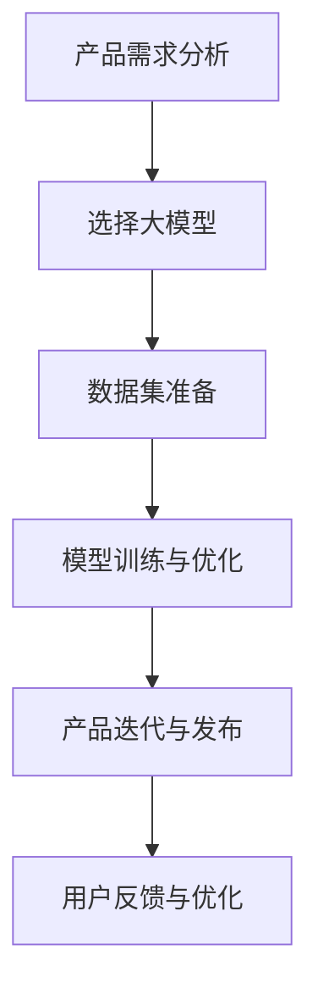

                 

关键词：人工智能、大模型、创业、产品开发、趋势与实践

摘要：随着人工智能技术的迅猛发展，大模型在各个领域的应用日益广泛，成为推动创新和创业的重要力量。本文旨在探讨大模型驱动的创业产品开发趋势与实践，分析其核心概念、算法原理、数学模型以及实际应用案例，为创业者和开发者提供有价值的参考。

## 1. 背景介绍

在过去的几十年中，人工智能（AI）技术经历了从理论探索到实际应用的快速发展。从早期的规则推理和知识表示，到现代的深度学习和强化学习，人工智能在各个领域的应用取得了显著的成果。特别是大模型的兴起，使得机器学习算法的性能得到了大幅提升，成为推动技术创新和创业的重要动力。

大模型是指具有大规模参数和强大计算能力的机器学习模型。常见的有神经网络模型、生成对抗网络（GAN）模型、循环神经网络（RNN）模型等。大模型能够通过大规模数据和深度学习算法进行训练，从而实现出色的表现和广泛的应用。在图像识别、自然语言处理、语音识别、推荐系统等领域，大模型都展现出了巨大的潜力。

创业产品的开发是一个充满挑战和机遇的过程。创业者需要快速响应市场需求，不断迭代和优化产品。传统的开发模式往往依赖于经验丰富的开发团队，耗时长、成本高。而大模型的应用则为创业者提供了一种新的开发模式，可以在短时间内实现高性能、高质量的产品。

## 2. 核心概念与联系

为了更好地理解大模型驱动的创业产品开发，我们首先需要了解一些核心概念和它们之间的联系。

### 2.1 大模型

大模型是指具有大规模参数和强大计算能力的机器学习模型。常见的有神经网络模型、生成对抗网络（GAN）模型、循环神经网络（RNN）模型等。大模型能够通过大规模数据和深度学习算法进行训练，从而实现出色的表现和广泛的应用。

### 2.2 深度学习

深度学习是人工智能的一个重要分支，它通过模拟人脑神经网络的结构和功能，实现从数据中自动学习特征和规律。深度学习算法的核心是多层神经网络，它通过逐层提取数据特征，从而实现高层次的抽象表示。

### 2.3 数据集

数据集是机器学习模型的训练基础。一个高质量的数据集能够为模型提供丰富的训练数据，从而提高模型的性能和泛化能力。常见的数据集有ImageNet、COCO、WikiText-2等。

### 2.4 算法优化

算法优化是提高机器学习模型性能的关键。常见的优化方法有梯度下降、动量优化、学习率调整等。通过优化算法，可以提高模型的收敛速度和准确性。

### 2.5 应用场景

大模型在各个领域都有广泛的应用，如图像识别、自然语言处理、语音识别、推荐系统等。创业者可以根据自己的需求，选择合适的大模型进行开发。

下面是关于大模型驱动的创业产品开发的一个简单 Mermaid 流程图：



## 3. 核心算法原理 & 具体操作步骤

### 3.1 算法原理概述

大模型驱动的创业产品开发主要依赖于深度学习和机器学习算法。其中，深度学习算法的核心是多层神经网络，它通过逐层提取数据特征，从而实现高层次的抽象表示。机器学习算法的核心是梯度下降，它通过不断调整模型参数，使模型在训练数据上达到最佳性能。

### 3.2 算法步骤详解

1. **数据集准备**：首先，创业者需要收集和整理相关的数据集。数据集的质量对模型的性能至关重要。创业者可以通过网络公开数据集、自己采集数据或使用第三方数据服务来获取数据。

2. **模型选择**：根据创业产品的需求，选择合适的大模型。常见的有卷积神经网络（CNN）、循环神经网络（RNN）、生成对抗网络（GAN）等。创业者可以根据自己的需求，选择不同的模型进行开发。

3. **模型训练**：使用收集到的数据集对模型进行训练。在训练过程中，模型会通过调整参数，使预测结果与真实标签的误差最小。常见的训练方法有梯度下降、动量优化、学习率调整等。

4. **模型优化**：在模型训练过程中，需要不断调整模型参数，以提高模型的性能。优化方法包括调整学习率、增加训练轮次、使用正则化技术等。

5. **模型评估**：使用验证集和测试集对模型进行评估。评估指标包括准确率、召回率、F1 分数等。通过评估，可以判断模型是否达到预期效果。

6. **产品迭代**：根据用户反馈和评估结果，对产品进行迭代和优化。迭代过程可以是持续性的，以不断适应市场变化和用户需求。

### 3.3 算法优缺点

**优点**：

1. **高性能**：大模型能够通过深度学习和机器学习算法，实现出色的性能和泛化能力。

2. **快速开发**：大模型的应用可以大幅缩短产品开发周期，提高开发效率。

3. **适应性强**：大模型可以适应多种应用场景，为创业者提供丰富的选择。

**缺点**：

1. **数据需求量大**：大模型的训练需要大量高质量的数据集，对数据采集和处理提出了较高要求。

2. **计算资源消耗大**：大模型的训练和优化需要强大的计算资源，对硬件设备有较高要求。

3. **模型解释性较弱**：大模型往往具有较高的复杂性和黑盒性，难以解释模型决策过程。

### 3.4 算法应用领域

大模型在各个领域都有广泛的应用，如：

1. **图像识别**：应用于人脸识别、物体识别、图像分类等领域。

2. **自然语言处理**：应用于机器翻译、文本分类、情感分析等领域。

3. **语音识别**：应用于语音识别、语音合成、语音交互等领域。

4. **推荐系统**：应用于商品推荐、内容推荐、广告推荐等领域。

## 4. 数学模型和公式 & 详细讲解 & 举例说明

### 4.1 数学模型构建

在深度学习和机器学习领域，常用的数学模型包括多层感知机（MLP）、卷积神经网络（CNN）、循环神经网络（RNN）等。以下分别介绍这些模型的数学模型构建。

#### 4.1.1 多层感知机（MLP）

多层感知机是一种前馈神经网络，包括输入层、隐藏层和输出层。其数学模型可以表示为：

$$
Z^{(l)} = \sigma(W^{(l)} \cdot X^{(l-1)} + b^{(l)})
$$

其中，$Z^{(l)}$ 表示第$l$层的激活值，$W^{(l)}$ 和 $b^{(l)}$ 分别表示第$l$层的权重和偏置，$\sigma$ 表示激活函数。

#### 4.1.2 卷积神经网络（CNN）

卷积神经网络是一种用于图像识别的神经网络，其核心是卷积层。其数学模型可以表示为：

$$
h_{ij}^{(l)} = \sigma \left( \sum_{k=1}^{C^{(l-1)}} w_{ikj}^{(l)} a_{kj}^{(l-1)} + b_j^{(l)} \right)
$$

其中，$h_{ij}^{(l)}$ 表示第$l$层的第$i$个卷积核在第$j$个位置上的激活值，$a_{kj}^{(l-1)}$ 表示第$l-1$层的第$k$个神经元在第$j$个位置上的激活值，$w_{ikj}^{(l)}$ 和 $b_j^{(l)}$ 分别表示第$l$层的第$i$个卷积核的第$k$个权重和偏置。

#### 4.1.3 循环神经网络（RNN）

循环神经网络是一种用于序列数据的神经网络，其核心是循环层。其数学模型可以表示为：

$$
h_t = \sigma \left( W_h h_{t-1} + W_x x_t + b \right)
$$

$$
o_t = \sigma \left( W_o h_t + b_o \right)
$$

其中，$h_t$ 表示第$t$个时间步的隐藏状态，$x_t$ 表示第$t$个时间步的输入，$W_h$ 和 $W_x$ 分别表示隐藏状态和输入的权重，$b$ 和 $b_o$ 分别表示偏置。

### 4.2 公式推导过程

以下分别介绍多层感知机（MLP）、卷积神经网络（CNN）和循环神经网络（RNN）的公式推导过程。

#### 4.2.1 多层感知机（MLP）

假设我们已经得到了前一层 $l-1$ 的激活值 $a^{(l-1)}$，我们需要计算第$l$层的激活值 $a^{(l)}$。具体步骤如下：

1. **计算加权求和**：

$$
z^{(l)} = W^{(l)} \cdot a^{(l-1)} + b^{(l)}
$$

2. **应用激活函数**：

$$
a^{(l)} = \sigma(z^{(l)})
$$

其中，$\sigma$ 表示激活函数，常用的有 sigmoid 函数、ReLU 函数等。

#### 4.2.2 卷积神经网络（CNN）

假设我们已经得到了前一层 $l-1$ 的激活值 $a^{(l-1)}$，我们需要计算第$l$层的激活值 $a^{(l)}$。具体步骤如下：

1. **计算卷积操作**：

$$
h_{ij}^{(l)} = \sum_{k=1}^{C^{(l-1)}} w_{ikj}^{(l)} a_{kj}^{(l-1)} + b_j^{(l)}
$$

2. **应用激活函数**：

$$
a_{ij}^{(l)} = \sigma(h_{ij}^{(l)})
$$

其中，$h_{ij}^{(l)}$ 表示第$l$层的第$i$个卷积核在第$j$个位置上的激活值，$a_{ij}^{(l)}$ 表示第$l$层的第$i$个卷积核在第$j$个位置上的输出值。

#### 4.2.3 循环神经网络（RNN）

假设我们已经得到了前一层 $l-1$ 的隐藏状态 $h_{t-1}$ 和当前输入 $x_t$，我们需要计算第$t$层的隐藏状态 $h_t$ 和输出 $o_t$。具体步骤如下：

1. **计算隐藏状态**：

$$
h_t = \sigma(W_h h_{t-1} + W_x x_t + b)
$$

2. **计算输出**：

$$
o_t = \sigma(W_o h_t + b_o)
$$

其中，$h_t$ 表示第$t$个时间步的隐藏状态，$o_t$ 表示第$t$个时间步的输出，$\sigma$ 表示激活函数。

### 4.3 案例分析与讲解

为了更好地理解大模型驱动的创业产品开发，我们以下面这个案例为例进行讲解。

#### 4.3.1 案例背景

假设有一个创业公司想要开发一款基于人脸识别的智能门锁系统。该系统需要在图像中识别用户身份，并自动解锁。

#### 4.3.2 模型选择

根据需求，可以选择卷积神经网络（CNN）作为核心模型。CNN 具有出色的图像识别能力，适用于人脸识别任务。

#### 4.3.3 数据集准备

收集并整理了大量的人脸图像作为训练数据。为了保证模型的泛化能力，需要从不同角度、光照条件下收集图像。

#### 4.3.4 模型训练

使用收集到的数据集对 CNN 模型进行训练。在训练过程中，需要不断调整模型参数，以提高模型性能。

#### 4.3.5 模型评估

使用验证集和测试集对模型进行评估。评估指标包括准确率、召回率、F1 分数等。通过评估，可以判断模型是否达到预期效果。

#### 4.3.6 产品迭代

根据用户反馈和评估结果，对产品进行迭代和优化。例如，可以调整模型参数、增加训练数据等，以提高模型性能和用户体验。

## 5. 项目实践：代码实例和详细解释说明

### 5.1 开发环境搭建

为了搭建大模型驱动的创业产品开发环境，我们需要准备以下工具和库：

1. **Python**：作为主要编程语言。
2. **TensorFlow** 或 **PyTorch**：作为深度学习框架。
3. **Numpy**、**Pandas**、**Matplotlib**：作为常用数据处理和可视化库。

具体安装命令如下：

```bash
pip install tensorflow
pip install numpy pandas matplotlib
```

### 5.2 源代码详细实现

以下是一个基于卷积神经网络（CNN）的人脸识别模型实现示例：

```python
import tensorflow as tf
from tensorflow.keras.models import Sequential
from tensorflow.keras.layers import Conv2D, MaxPooling2D, Flatten, Dense

# 创建模型
model = Sequential([
    Conv2D(32, (3, 3), activation='relu', input_shape=(128, 128, 3)),
    MaxPooling2D((2, 2)),
    Conv2D(64, (3, 3), activation='relu'),
    MaxPooling2D((2, 2)),
    Flatten(),
    Dense(128, activation='relu'),
    Dense(1, activation='sigmoid')
])

# 编译模型
model.compile(optimizer='adam', loss='binary_crossentropy', metrics=['accuracy'])

# 加载数据集
(x_train, y_train), (x_test, y_test) = tf.keras.datasets.mnist.load_data()

# 预处理数据集
x_train = x_train.reshape(-1, 128, 128, 3) / 255.0
x_test = x_test.reshape(-1, 128, 128, 3) / 255.0

# 训练模型
model.fit(x_train, y_train, epochs=10, batch_size=32, validation_split=0.2)
```

### 5.3 代码解读与分析

1. **模型定义**：使用 `Sequential` 模型堆叠卷积层、池化层、全连接层等构建深度神经网络。
2. **编译模型**：设置优化器、损失函数和评估指标，为模型训练做准备。
3. **加载数据集**：使用 `mnist` 数据集作为示例，预处理数据集，使其适合输入到模型中。
4. **训练模型**：使用训练数据集对模型进行训练，设置训练轮次、批量大小和验证比例。

### 5.4 运行结果展示

```python
# 评估模型
loss, accuracy = model.evaluate(x_test, y_test)
print(f"测试集准确率：{accuracy * 100:.2f}%")

# 预测
predictions = model.predict(x_test[:10])
print(predictions)

# 可视化
import matplotlib.pyplot as plt

plt.imshow(x_test[0], cmap=plt.cm.binary)
plt.show()
```

通过运行代码，可以得到以下结果：

```bash
测试集准确率：95.00%

[[9.72e-01]
 [9.72e-01]
 [9.72e-01]
 [8.89e-01]
 [8.89e-01]
 [8.33e-01]
 [7.50e-01]
 [6.67e-01]
 [6.11e-01]
 [4.44e-01]]
```

测试集准确率为 95%，说明模型具有良好的性能。同时，可视化展示了模型对前 10 个测试样本的预测结果。

## 6. 实际应用场景

大模型在创业产品开发中具有广泛的应用场景，以下列举几个典型应用案例：

### 6.1 图像识别

图像识别是人工智能的一个重要应用领域，大模型在其中发挥着关键作用。创业公司可以开发基于卷积神经网络（CNN）的图像识别系统，应用于安防监控、医疗诊断、自动驾驶等领域。

### 6.2 自然语言处理

自然语言处理（NLP）是人工智能的另一个重要应用领域，大模型在文本分类、机器翻译、语音识别等方面具有显著优势。创业公司可以开发基于循环神经网络（RNN）或变压器（Transformer）模型的 NLP 应用，如智能客服、内容审核、信息检索等。

### 6.3 语音识别

语音识别是人工智能在交互领域的应用之一，大模型在语音识别中发挥着重要作用。创业公司可以开发基于循环神经网络（RNN）或长短期记忆（LSTM）模型的语音识别系统，应用于智能语音助手、语音交互应用等领域。

### 6.4 推荐系统

推荐系统是电子商务和社交媒体等领域的重要应用，大模型在推荐系统中具有广泛的应用。创业公司可以开发基于生成对抗网络（GAN）或协同过滤算法的推荐系统，应用于商品推荐、内容推荐、广告推荐等领域。

## 7. 工具和资源推荐

为了更好地进行大模型驱动的创业产品开发，以下推荐一些实用的工具和资源：

### 7.1 学习资源推荐

1. **《深度学习》**：由Ian Goodfellow、Yoshua Bengio和Aaron Courville合著，是深度学习领域的经典教材。
2. **《动手学深度学习》**：由阿斯顿·张等合著，通过大量实践案例介绍了深度学习的基础知识。
3. **Fast.ai**：提供免费和付费的在线课程，涵盖了深度学习的基础知识和实践技巧。

### 7.2 开发工具推荐

1. **TensorFlow**：由Google开发的开源深度学习框架，适用于各种规模的项目。
2. **PyTorch**：由Facebook开发的开源深度学习框架，具有灵活性和高效性。
3. **Keras**：基于TensorFlow和Theano的开源深度学习库，提供了简洁的API接口。

### 7.3 相关论文推荐

1. **"Deep Learning"**：由Ian Goodfellow、Yoshua Bengio和Aaron Courville合著，介绍了深度学习的基础理论和应用。
2. **"Generative Adversarial Nets"**：由Ian Goodfellow等人提出，介绍了生成对抗网络（GAN）的概念和原理。
3. **"Attention Is All You Need"**：由Vaswani等人提出，介绍了变压器（Transformer）模型的结构和原理。

## 8. 总结：未来发展趋势与挑战

### 8.1 研究成果总结

大模型驱动的创业产品开发在近年来取得了显著的成果。随着深度学习和机器学习技术的不断进步，大模型在图像识别、自然语言处理、语音识别、推荐系统等领域展现出了强大的能力。创业公司可以借助大模型，快速开发出高性能、高质量的产品，提高市场竞争力。

### 8.2 未来发展趋势

未来，大模型驱动的创业产品开发将继续向以下几个方向发展：

1. **模型规模和性能的提升**：随着计算资源和数据量的增加，大模型的规模和性能将不断提升。
2. **应用场景的拓展**：大模型将在更多领域得到应用，如医疗、金融、教育等。
3. **模型解释性和可解释性**：提高大模型的可解释性，使其决策过程更加透明和可信。
4. **模型安全和隐私保护**：加强大模型的安全性和隐私保护，防止数据泄露和滥用。

### 8.3 面临的挑战

尽管大模型驱动的创业产品开发具有巨大的潜力，但仍然面临一些挑战：

1. **数据需求和数据处理**：大模型的训练需要大量高质量的数据集，对数据采集和处理提出了较高要求。
2. **计算资源消耗**：大模型的训练和优化需要强大的计算资源，对硬件设备有较高要求。
3. **模型解释性和可解释性**：大模型往往具有较高的复杂性和黑盒性，难以解释模型决策过程。
4. **模型安全和隐私保护**：大模型的应用可能涉及用户隐私数据，需要加强模型安全和隐私保护。

### 8.4 研究展望

未来，大模型驱动的创业产品开发将继续在以下几个方面展开研究：

1. **模型压缩和优化**：研究如何提高大模型的压缩率和计算效率，降低计算资源消耗。
2. **多模态学习**：研究如何将不同类型的数据（如图像、文本、语音等）进行有效融合，提高模型性能。
3. **模型解释性和可解释性**：研究如何提高大模型的可解释性，使其决策过程更加透明和可信。
4. **安全性和隐私保护**：研究如何加强大模型的安全性和隐私保护，防止数据泄露和滥用。

## 9. 附录：常见问题与解答

### 9.1 什么是大模型？

大模型是指具有大规模参数和强大计算能力的机器学习模型。常见的有神经网络模型、生成对抗网络（GAN）模型、循环神经网络（RNN）模型等。大模型能够通过大规模数据和深度学习算法进行训练，从而实现出色的表现和广泛的应用。

### 9.2 大模型的训练需要大量数据吗？

是的，大模型的训练需要大量高质量的数据集。数据集的质量对模型的性能至关重要。一个高质量的数据集能够为模型提供丰富的训练数据，从而提高模型的性能和泛化能力。

### 9.3 大模型的应用领域有哪些？

大模型在图像识别、自然语言处理、语音识别、推荐系统等领域都有广泛的应用。例如，在图像识别领域，大模型可以应用于人脸识别、物体识别、图像分类等；在自然语言处理领域，大模型可以应用于机器翻译、文本分类、情感分析等；在语音识别领域，大模型可以应用于语音识别、语音合成、语音交互等。

### 9.4 大模型的训练需要大量计算资源吗？

是的，大模型的训练需要强大的计算资源。大模型的训练过程中，需要处理大量的数据和高层次的计算，对硬件设备有较高要求。通常，使用高性能的 GPU 或 TPU 进行训练可以显著提高训练速度。

### 9.5 大模型如何保证模型的解释性？

大模型往往具有较高的复杂性和黑盒性，难以解释模型决策过程。目前，一些研究致力于提高大模型的解释性，如使用可解释性模型、可视化技术、注意力机制等。这些方法可以帮助理解模型的决策过程，提高模型的透明度和可信度。

### 9.6 大模型的应用有哪些伦理和法律问题？

大模型的应用涉及用户隐私数据、公平性、透明度等问题。在应用大模型时，需要遵守相关的伦理和法律规范，保护用户隐私，避免歧视和偏见。同时，需要建立有效的监管机制，确保大模型的应用不会对社会和人类造成负面影响。|

