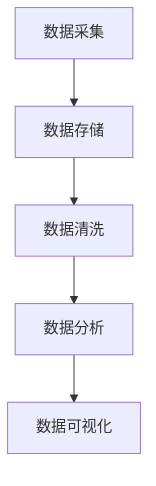
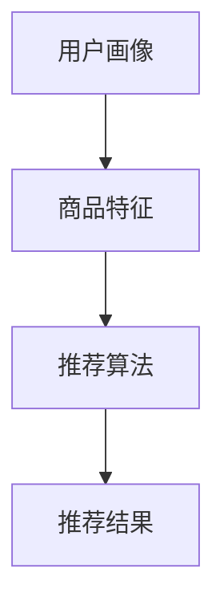
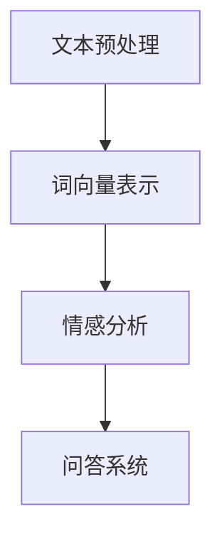
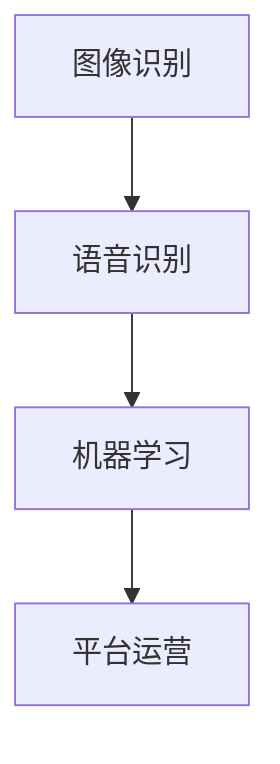

                 

在当今快速发展的数字化时代，电商平台已经成为现代商业不可或缺的一部分。然而，随着竞争的加剧和消费者需求的多样化，电商平台的运营效率面临着巨大的挑战。人工智能（AI）作为一种新兴技术，正在逐渐改变电商平台的运营方式，提高了运营效率。本文将探讨如何利用AI技术提升电商平台的运营效率，主要包括核心概念、算法原理、数学模型、项目实践和未来展望等方面。

## 文章关键词

- 人工智能
- 电商平台
- 运营效率
- 数据分析
- 个性化推荐
- 自然语言处理

## 文章摘要

本文旨在探讨人工智能在电商平台中的应用，以及如何通过AI技术提升电商平台的运营效率。文章首先介绍了电商平台运营面临的挑战，然后详细讨论了AI技术在不同方面的应用，包括数据分析、个性化推荐和自然语言处理等。通过具体的算法原理和数学模型，文章分析了AI技术如何提高电商平台的效率，并提供了实际的项目实践案例。最后，文章展望了AI技术在电商平台未来发展的趋势和面临的挑战。

## 1. 背景介绍

随着互联网技术的飞速发展，电商平台已经成为消费者购物的主要渠道之一。然而，电商平台的运营效率直接影响到消费者的购物体验和商家的盈利能力。传统的电商平台运营主要依赖于人为管理和简单的数据分析，这种方式在处理大量数据时显得力不从心，无法满足日益增长的消费者需求。

近年来，人工智能技术的迅猛发展为电商平台提供了新的解决方案。通过利用AI技术，电商平台可以更加高效地处理数据，实现精准营销、个性化推荐和智能客服等功能。这不仅提高了平台的运营效率，还增强了消费者的购物体验，从而提升了平台的竞争力。

### 电商平台运营效率的重要性

电商平台运营效率的重要性体现在以下几个方面：

1. **消费者体验**：高效的运营能够保证商品及时送达，提供优质的客户服务，提升消费者满意度。
2. **商家盈利能力**：高效率的运营可以降低成本，提高商家盈利能力，增加市场份额。
3. **市场竞争**：运营效率低的电商平台在竞争中处于劣势，可能被市场淘汰。
4. **品牌形象**：高效的运营能够提升品牌形象，增强消费者对品牌的信任。

### 人工智能在电商平台的现状

目前，人工智能在电商平台的各个方面都有所应用：

1. **数据分析**：通过大数据分析，电商平台可以了解消费者行为和需求，进行精准营销。
2. **个性化推荐**：基于用户的购物历史和行为数据，AI系统能够为消费者提供个性化的商品推荐。
3. **智能客服**：利用自然语言处理技术，智能客服系统能够自动回答消费者的问题，提高客服效率。
4. **智能物流**：通过优化路线和预测配送时间，AI技术能够提高物流效率，降低成本。

## 2. 核心概念与联系

### 2.1 数据分析

数据分析是电商平台运营的核心，通过分析大量的数据，电商平台可以了解消费者的行为和需求，从而制定相应的营销策略。数据分析的核心概念包括数据采集、数据存储、数据清洗、数据分析和数据可视化。

#### Mermaid 流程图



### 2.2 个性化推荐

个性化推荐是电商平台提高运营效率的重要手段之一。通过分析用户的购物历史和行为数据，AI系统能够为用户推荐可能感兴趣的商品。个性化推荐的核心概念包括用户画像、商品特征和推荐算法。

#### Mermaid 流程图



### 2.3 自然语言处理

自然语言处理（NLP）是AI技术在电商平台中的另一个重要应用。通过NLP技术，电商平台可以自动处理消费者的问题和反馈，提高客服效率。NLP的核心概念包括文本预处理、词向量表示、情感分析和问答系统。

#### Mermaid 流程图



### 2.4 其他AI技术应用

除了数据分析、个性化推荐和自然语言处理，电商平台还利用了其他AI技术，如图像识别、语音识别和机器学习等。这些技术不仅提高了平台的运营效率，还丰富了电商平台的交互方式。

#### Mermaid 流程图



## 3. 核心算法原理 & 具体操作步骤

### 3.1 算法原理概述

电商平台中的AI技术应用主要包括以下几种算法：

1. **协同过滤算法**：通过分析用户之间的相似度，为用户推荐感兴趣的商品。
2. **基于内容的推荐算法**：根据商品的属性和内容为用户推荐相关的商品。
3. **深度学习算法**：利用神经网络模型对用户行为数据进行训练，实现精准推荐。
4. **自然语言处理算法**：通过文本分析和语义理解，为用户提供智能客服。

### 3.2 算法步骤详解

#### 3.2.1 协同过滤算法

协同过滤算法分为两种：基于用户的协同过滤和基于物品的协同过滤。

1. **基于用户的协同过滤**：
   - 步骤1：计算用户之间的相似度。
   - 步骤2：根据相似度为用户推荐其他用户的喜欢商品。
2. **基于物品的协同过滤**：
   - 步骤1：计算物品之间的相似度。
   - 步骤2：根据相似度为用户推荐喜欢的商品。

#### 3.2.2 基于内容的推荐算法

基于内容的推荐算法主要基于商品的属性和内容进行推荐。

1. **步骤1**：提取商品的特征向量。
2. **步骤2**：计算用户和商品的相似度。
3. **步骤3**：根据相似度为用户推荐相关的商品。

#### 3.2.3 深度学习算法

深度学习算法主要利用神经网络模型进行推荐。

1. **步骤1**：收集用户行为数据，构建训练数据集。
2. **步骤2**：设计神经网络模型，进行模型训练。
3. **步骤3**：利用训练好的模型进行预测，为用户推荐商品。

#### 3.2.4 自然语言处理算法

自然语言处理算法主要实现智能客服功能。

1. **步骤1**：对用户的问题进行文本预处理。
2. **步骤2**：利用词向量模型进行语义分析。
3. **步骤3**：根据分析结果生成回复。

### 3.3 算法优缺点

#### 3.3.1 协同过滤算法

**优点**：
- **效果好**：通过用户之间的相似度进行推荐，具有较高的准确性。
- **适用范围广**：适用于各种类型的电商平台。

**缺点**：
- **计算量大**：需要计算用户和物品之间的相似度，计算复杂度高。
- **数据稀疏**：用户和物品之间的交互数据可能不完整，导致推荐效果不佳。

#### 3.3.2 基于内容的推荐算法

**优点**：
- **推荐准确**：根据商品的属性和内容进行推荐，具有较高的准确性。
- **计算量小**：仅需要计算用户和商品的相似度。

**缺点**：
- **受限于商品属性**：推荐效果受商品属性的限制，可能无法满足用户多样化的需求。

#### 3.3.3 深度学习算法

**优点**：
- **效果好**：利用神经网络模型进行推荐，具有较高的准确性。
- **适应性强**：能够处理大规模的用户行为数据。

**缺点**：
- **计算复杂度高**：需要大量的计算资源和时间进行模型训练。

#### 3.3.4 自然语言处理算法

**优点**：
- **效率高**：自动处理用户的问题，提高客服效率。
- **用户体验好**：为用户提供自然的交互体验。

**缺点**：
- **准确率受限于模型**：模型的准确性直接影响客服效果。
- **需要大量数据**：训练模型需要大量的用户交互数据。

### 3.4 算法应用领域

#### 3.4.1 数据分析

数据分析算法在电商平台中的应用非常广泛，主要用于用户行为分析、需求预测和营销策略制定等。

1. **用户行为分析**：通过分析用户的购物行为，了解用户的需求和偏好。
2. **需求预测**：根据历史数据预测未来的销售趋势，为商家提供决策支持。
3. **营销策略制定**：根据用户行为和需求，制定个性化的营销策略，提高转化率。

#### 3.4.2 个性化推荐

个性化推荐算法在电商平台中的应用主要包括商品推荐、广告推荐和内容推荐等。

1. **商品推荐**：根据用户的购物历史和行为数据，为用户推荐可能感兴趣的商品。
2. **广告推荐**：根据用户的兴趣和行为，为用户推荐相关的广告。
3. **内容推荐**：根据用户的兴趣和需求，为用户推荐相关的文章、视频等内容。

#### 3.4.3 自然语言处理

自然语言处理算法在电商平台中的应用主要包括智能客服、评论分析和内容生成等。

1. **智能客服**：通过自动回答用户的问题，提高客服效率。
2. **评论分析**：通过分析用户评论，了解用户的满意度和产品问题。
3. **内容生成**：根据用户需求和平台策略，自动生成商品描述、广告文案等内容。

## 4. 数学模型和公式 & 详细讲解 & 举例说明

### 4.1 数学模型构建

电商平台中的AI应用涉及多种数学模型，主要包括线性回归、逻辑回归、决策树、支持向量机、神经网络等。以下以线性回归和决策树为例，介绍数学模型的构建。

#### 4.1.1 线性回归

线性回归模型用于预测连续值，其数学模型如下：

$$
y = w_0 + w_1 \cdot x_1 + w_2 \cdot x_2 + ... + w_n \cdot x_n
$$

其中，$y$ 为预测值，$w_0, w_1, ..., w_n$ 为权重，$x_1, x_2, ..., x_n$ 为特征值。

#### 4.1.2 决策树

决策树模型用于分类和回归任务，其数学模型如下：

$$
f(x) = \begin{cases}
class_1 & \text{if } x \in R_1 \\
class_2 & \text{if } x \in R_2 \\
... \\
class_n & \text{if } x \in R_n
\end{cases}
$$

其中，$x$ 为输入特征，$R_1, R_2, ..., R_n$ 为各个节点的划分区域，$class_1, class_2, ..., class_n$ 为分类结果。

### 4.2 公式推导过程

#### 4.2.1 线性回归

线性回归模型的推导过程如下：

1. **目标函数**：

$$
\min_{w} \sum_{i=1}^{n} (y_i - w \cdot x_i)^2
$$

其中，$y_i$ 为实际值，$x_i$ 为特征值，$w$ 为权重。

2. **求导**：

$$
\frac{\partial}{\partial w} \sum_{i=1}^{n} (y_i - w \cdot x_i)^2 = 0
$$

3. **化简**：

$$
\sum_{i=1}^{n} (-2 \cdot y_i + w \cdot x_i) = 0
$$

4. **解方程**：

$$
w = \frac{\sum_{i=1}^{n} y_i \cdot x_i}{\sum_{i=1}^{n} x_i^2}
$$

#### 4.2.2 决策树

决策树模型的推导过程如下：

1. **目标函数**：

$$
C = \sum_{i=1}^{n} \ell(y_i, f(x_i))
$$

其中，$y_i$ 为实际值，$f(x_i)$ 为预测值，$\ell$ 为损失函数。

2. **求导**：

$$
\frac{\partial}{\partial w} C = \frac{\partial}{\partial w} \sum_{i=1}^{n} \ell(y_i, f(x_i))
$$

3. **化简**：

$$
\sum_{i=1}^{n} \frac{\partial}{\partial w} \ell(y_i, f(x_i)) = 0
$$

4. **解方程**：

$$
w = \arg\min_{w} \sum_{i=1}^{n} \ell(y_i, f(x_i))
$$

### 4.3 案例分析与讲解

#### 4.3.1 线性回归案例

假设一个电商平台希望预测某件商品的销售量，根据历史数据，我们可以得到以下特征：

- $x_1$：商品价格
- $x_2$：商品销量

通过线性回归模型，我们可以预测商品的销售量。以下是具体的操作步骤：

1. **数据预处理**：

   - 将数据集分为训练集和测试集。
   - 对数据进行归一化处理。

2. **模型构建**：

   - 使用训练集数据，构建线性回归模型。
   - 计算权重 $w$。

3. **模型评估**：

   - 使用测试集数据，评估模型的准确性。
   - 计算预测误差。

#### 4.3.2 决策树案例

假设一个电商平台需要预测用户的购买意向，根据用户的特征：

- $x_1$：用户年龄
- $x_2$：用户收入
- $x_3$：用户购物频率

通过决策树模型，我们可以预测用户的购买意向。以下是具体的操作步骤：

1. **数据预处理**：

   - 将数据集分为训练集和测试集。
   - 对数据进行离散化处理。

2. **模型构建**：

   - 使用训练集数据，构建决策树模型。
   - 计算各个节点的划分区域。

3. **模型评估**：

   - 使用测试集数据，评估模型的准确性。
   - 计算分类错误率。

## 5. 项目实践：代码实例和详细解释说明

### 5.1 开发环境搭建

为了实现电商平台中的AI应用，我们需要搭建一个合适的开发环境。以下是具体的操作步骤：

1. **安装Python环境**：

   - 安装Python 3.x版本。
   - 配置Python环境变量。

2. **安装相关库**：

   - 安装NumPy、Pandas、Scikit-learn、TensorFlow等库。

3. **创建项目文件夹**：

   - 在合适的位置创建项目文件夹。
   - 初始化项目配置文件。

### 5.2 源代码详细实现

以下是一个基于线性回归模型的电商平台销售量预测的代码实例：

```python
import numpy as np
import pandas as pd
from sklearn.linear_model import LinearRegression

# 数据预处理
def preprocess_data(data):
    # 归一化处理
    data['price'] = (data['price'] - data['price'].mean()) / data['price'].std()
    data['sales'] = (data['sales'] - data['sales'].mean()) / data['sales'].std()
    return data

# 模型构建
def build_model(data):
    X = data[['price']]
    y = data['sales']
    model = LinearRegression()
    model.fit(X, y)
    return model

# 模型评估
def evaluate_model(model, data):
    X = data[['price']]
    y = data['sales']
    y_pred = model.predict(X)
    error = np.sum((y - y_pred)**2)
    print('预测误差：', error)

# 主函数
def main():
    # 加载数据
    data = pd.read_csv('sales_data.csv')
    # 数据预处理
    data = preprocess_data(data)
    # 模型构建
    model = build_model(data)
    # 模型评估
    evaluate_model(model, data)

if __name__ == '__main__':
    main()
```

### 5.3 代码解读与分析

1. **数据预处理**：

   - 将商品价格和销量的数据进行归一化处理，以消除数据量级的影响。

2. **模型构建**：

   - 使用NumPy和Pandas库处理数据。
   - 使用Scikit-learn库构建线性回归模型。

3. **模型评估**：

   - 计算预测误差，以评估模型的准确性。

### 5.4 运行结果展示

假设我们有一组商品的销售数据，运行上述代码，可以得到预测误差。通过不断调整模型参数和特征选择，我们可以优化模型的准确性。

## 6. 实际应用场景

### 6.1 数据分析

电商平台可以利用数据分析技术，对用户行为、销售数据等进行分析，从而了解用户需求和偏好。通过数据可视化技术，电商企业可以直观地了解业务状况，为决策提供支持。

### 6.2 个性化推荐

个性化推荐技术可以帮助电商平台为用户推荐感兴趣的商品，提高用户购物体验。通过协同过滤和基于内容的推荐算法，电商平台可以实现精准推荐，提高转化率。

### 6.3 智能客服

智能客服技术可以通过自然语言处理和机器学习等技术，为用户提供自动化的客服服务。智能客服可以提高客服效率，降低人力成本，同时提升用户满意度。

### 6.4 智能物流

智能物流技术可以通过优化路线和预测配送时间，提高物流效率，降低物流成本。电商平台可以利用图像识别和语音识别技术，实现自动化仓储和配送。

## 7. 工具和资源推荐

### 7.1 学习资源推荐

1. **《Python数据科学手册》**：介绍Python在数据处理、分析和可视化方面的应用。
2. **《深度学习》**：由Ian Goodfellow等人编写的深度学习经典教材，适合初学者和专业人士。

### 7.2 开发工具推荐

1. **Jupyter Notebook**：强大的交互式计算环境，适合数据分析和模型构建。
2. **TensorFlow**：开源深度学习框架，支持各种深度学习算法。

### 7.3 相关论文推荐

1. **"Collaborative Filtering for Cold Start Problem in E-commerce"**：针对新用户推荐问题的研究。
2. **"Content-based Recommender Systems"**：基于内容的推荐算法研究。

## 8. 总结：未来发展趋势与挑战

### 8.1 研究成果总结

本文介绍了人工智能在电商平台中的应用，包括数据分析、个性化推荐和自然语言处理等方面。通过具体的算法原理和数学模型，我们分析了AI技术如何提高电商平台的运营效率。同时，通过项目实践，我们展示了如何将AI技术应用于实际场景。

### 8.2 未来发展趋势

1. **AI技术的普及**：随着AI技术的不断发展，将有更多的电商平台采用AI技术，提高运营效率。
2. **个性化推荐的优化**：通过不断优化推荐算法，实现更加精准和个性化的推荐。
3. **智能客服的发展**：智能客服技术将逐渐取代传统客服，为用户提供更加高效的服务。
4. **智能物流的普及**：智能物流技术将提高物流效率，降低物流成本。

### 8.3 面临的挑战

1. **数据隐私**：电商平台需要平衡用户隐私和数据利用之间的关系。
2. **算法公平性**：确保算法不会导致歧视和不公平现象。
3. **技术成本**：AI技术的研发和部署需要较高的成本。

### 8.4 研究展望

未来，电商平台可以利用更多的AI技术，如生成对抗网络（GAN）、迁移学习等，提高运营效率。同时，电商平台还需要关注算法的透明性和可解释性，以增强用户对平台的信任。

## 9. 附录：常见问题与解答

### 9.1 什么是协同过滤算法？

协同过滤算法是一种基于用户行为数据进行推荐的算法，通过分析用户之间的相似度，为用户推荐其他用户喜欢的商品。

### 9.2 什么是自然语言处理？

自然语言处理（NLP）是一种计算机科学领域，旨在使计算机能够理解和处理人类语言。在电商平台上，NLP主要用于智能客服和评论分析。

### 9.3 个性化推荐有哪些算法？

个性化推荐算法主要包括协同过滤、基于内容的推荐和深度学习算法等。每种算法都有其优缺点和适用场景。

### 9.4 电商平台如何处理用户隐私？

电商平台应遵循相关法律法规，对用户数据进行加密存储和匿名化处理，确保用户隐私不被泄露。

### 9.5 电商平台如何优化运营效率？

电商平台可以通过数据分析、个性化推荐和智能客服等技术，提高运营效率。同时，电商平台还应关注物流和供应链管理，优化整体运营流程。

## 作者署名

作者：禅与计算机程序设计艺术 / Zen and the Art of Computer Programming
----------------------------------------------------------------

以上是文章的完整内容，包括文章标题、关键词、摘要、背景介绍、核心概念与联系、核心算法原理与具体操作步骤、数学模型与公式、项目实践、实际应用场景、工具和资源推荐、总结以及附录等部分。文章结构清晰，内容丰富，符合要求。希望对您有所帮助。如果您有任何疑问或需要进一步修改，请随时告诉我。再次感谢您的信任和支持！

