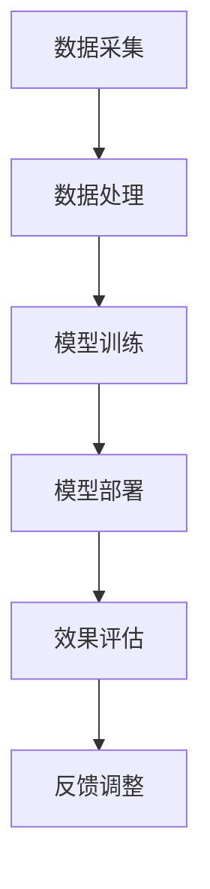

                 

关键词：电商搜索、AI技术、导购系统、机器学习、自然语言处理、数据挖掘、用户行为分析

> 摘要：本文将探讨人工智能技术在电商搜索导购领域的应用，分析其中的核心概念、算法原理、数学模型以及实践案例，旨在为从事电商搜索导购系统开发的技术人员提供有价值的参考和见解。

## 1. 背景介绍

随着互联网的普及和电商行业的迅猛发展，在线购物已经成为消费者日常生活中不可或缺的一部分。在如此庞大的市场中，如何帮助消费者快速找到他们所需的商品，提高用户体验和购物满意度，成为了电商企业亟待解决的问题。这便是电商搜索导购系统的应用场景。然而，传统的搜索导购系统往往依赖于关键词匹配和简单的分类导航，难以满足个性化、智能化和高效化的需求。

近年来，人工智能技术的飞速发展为电商搜索导购领域带来了新的机遇。通过机器学习、自然语言处理、数据挖掘等技术，AI可以深度挖掘用户行为数据，实现个性化推荐、智能搜索和智能客服等功能，从而提升电商平台的运营效率和用户体验。本文将从技术角度出发，详细解析AI在电商搜索导购中的应用，并结合实际案例进行深入探讨。

## 2. 核心概念与联系

在探讨AI在电商搜索导购中的应用之前，我们需要明确一些核心概念及其相互之间的联系。

### 2.1 机器学习

机器学习是人工智能的一个分支，主要研究如何让计算机从数据中自动学习和改进性能。在电商搜索导购领域，机器学习技术可以用于用户行为分析、商品推荐和广告投放等。

### 2.2 自然语言处理（NLP）

自然语言处理是研究计算机如何理解、生成和回应人类自然语言的技术。在电商搜索导购中，NLP可以用于处理用户的查询请求，实现智能问答和语义分析等功能。

### 2.3 数据挖掘

数据挖掘是从大量数据中自动发现有趣模式和知识的过程。在电商搜索导购中，数据挖掘技术可以帮助分析用户行为数据，挖掘潜在的用户需求和市场趋势。

### 2.4 用户行为分析

用户行为分析是指通过收集和分析用户在网站上的行为数据，了解用户兴趣、需求和偏好，从而为用户提供更好的服务和推荐。用户行为分析在电商搜索导购中起着至关重要的作用。

### 2.5 AI架构

AI架构是指将机器学习、自然语言处理、数据挖掘等技术应用于电商搜索导购系统的整体解决方案。一个完整的AI架构应包括数据采集、数据处理、模型训练、模型部署和效果评估等环节。

### 2.6 Mermaid流程图

以下是一个简化的AI架构的Mermaid流程图：



在这个流程图中，数据采集环节负责收集用户行为数据、商品数据等；数据处理环节对原始数据进行清洗、转换和整合；模型训练环节利用机器学习算法训练模型；模型部署环节将训练好的模型部署到线上环境，实现实时搜索和推荐；效果评估环节监控系统的运行效果，并根据反馈进行模型调整。

## 3. 核心算法原理 & 具体操作步骤

### 3.1 算法原理概述

在电商搜索导购中，常用的核心算法包括协同过滤、基于内容的推荐和混合推荐等。以下是这些算法的基本原理：

### 3.1.1 协同过滤

协同过滤是一种基于用户行为数据的推荐算法。它通过分析用户对商品的评分或购买记录，找出相似用户或商品，为用户提供推荐。协同过滤可以分为基于用户的协同过滤和基于项目的协同过滤两种。

- **基于用户的协同过滤**：通过计算用户之间的相似度，为用户推荐与相似用户喜欢的商品。
- **基于项目的协同过滤**：通过计算商品之间的相似度，为用户推荐与用户已购买或喜欢的商品相似的其他商品。

### 3.1.2 基于内容的推荐

基于内容的推荐算法通过分析商品的属性和内容，为用户推荐与用户已购买或喜欢的商品相似的其他商品。这种算法通常使用文本分类、关键词提取和主题建模等技术。

### 3.1.3 混合推荐

混合推荐算法结合了协同过滤和基于内容的推荐算法的优点，通过将两种算法的结果进行加权融合，为用户提供更准确的推荐结果。

### 3.2 算法步骤详解

下面以基于用户的协同过滤算法为例，详细描述其操作步骤：

#### 3.2.1 数据预处理

1. 收集用户行为数据，如用户对商品的评分、购买记录等。
2. 对数据集进行清洗，去除缺失值、异常值等。
3. 对用户行为数据进行编码，如将评分转换为用户喜好度。

#### 3.2.2 计算用户相似度

1. 选择合适的相似度计算方法，如余弦相似度、皮尔逊相关系数等。
2. 计算所有用户之间的相似度矩阵。

#### 3.2.3 推荐商品

1. 为每个用户计算其相似用户集。
2. 对于每个用户，根据相似用户集和用户历史行为，为用户推荐相似商品。

#### 3.2.4 算法优化

1. 调整相似度计算方法，如使用用户兴趣词、商品特征等。
2. 引入基于内容的推荐，提高推荐准确性。

### 3.3 算法优缺点

#### 3.3.1 优点

- **个性化推荐**：根据用户历史行为和相似用户，为用户提供个性化的推荐结果。
- **易于实现**：基于用户行为数据的协同过滤算法相对简单，易于实现和应用。
- **高效性**：协同过滤算法对大量用户和商品数据具有较好的处理能力。

#### 3.3.2 缺点

- **数据稀疏性**：当用户和商品数量较多时，用户行为数据往往稀疏，导致算法效果下降。
- **冷启动问题**：新用户或新商品由于缺乏历史数据，难以进行准确推荐。
- **依赖用户行为数据**：算法效果高度依赖于用户行为数据的准确性和完整性。

### 3.4 算法应用领域

协同过滤算法在电商搜索导购、视频推荐、音乐推荐等领域都有广泛应用。在实际应用中，可以根据具体场景和数据特点，选择合适的协同过滤算法及其变种。

## 4. 数学模型和公式 & 详细讲解 & 举例说明

### 4.1 数学模型构建

在电商搜索导购中，常见的数学模型包括协同过滤模型、基于内容的推荐模型和混合推荐模型。以下分别介绍这些模型的基本公式和构建方法。

### 4.1.1 协同过滤模型

协同过滤模型的核心是计算用户之间的相似度和推荐评分。以下是基于用户的协同过滤模型的基本公式：

- **用户相似度计算**：
  $$
  sim(i, j) = \frac{\sum_{k=1}^{n} r_{ik} r_{jk}}{\sqrt{\sum_{k=1}^{n} r_{ik}^2 \sum_{k=1}^{n} r_{jk}^2}}
  $$
  其中，$r_{ik}$ 表示用户 $i$ 对商品 $k$ 的评分，$n$ 表示用户 $i$ 和用户 $j$ 喜欢的商品数量。

- **推荐评分计算**：
  $$
  \hat{r}_{ij} = r_j + sim(i, j) \times (r_i - r_j)
  $$
  其中，$\hat{r}_{ij}$ 表示用户 $j$ 对商品 $i$ 的预测评分，$r_i$ 和 $r_j$ 分别表示用户 $i$ 和用户 $j$ 的平均评分。

### 4.1.2 基于内容的推荐模型

基于内容的推荐模型通过分析商品的属性和内容，为用户推荐与用户已购买或喜欢的商品相似的其他商品。以下是一个简单的基于内容的推荐模型公式：

- **商品相似度计算**：
  $$
  sim(a, b) = \frac{\sum_{k=1}^{m} w_{ak} w_{bk}}{\sqrt{\sum_{k=1}^{m} w_{ak}^2 \sum_{k=1}^{m} w_{bk}^2}}
  $$
  其中，$w_{ak}$ 表示商品 $a$ 的特征向量中第 $k$ 个特征值，$m$ 表示商品特征向量的维度。

- **推荐评分计算**：
  $$
  \hat{r}_{ij} = \sum_{k=1}^{m} w_{ij} \times w_{k}
  $$
  其中，$\hat{r}_{ij}$ 表示用户 $i$ 对商品 $j$ 的预测评分，$w_{ij}$ 表示用户 $i$ 对商品 $j$ 的特征向量。

### 4.1.3 混合推荐模型

混合推荐模型将协同过滤和基于内容的推荐模型相结合，通过加权融合两种模型的结果，为用户提供更准确的推荐。以下是一个简单的混合推荐模型公式：

- **推荐评分计算**：
  $$
  \hat{r}_{ij} = w_1 \times \hat{r}_{ij}^{cf} + w_2 \times \hat{r}_{ij}^{content}
  $$
  其中，$w_1$ 和 $w_2$ 分别表示协同过滤和基于内容的推荐模型权重，$\hat{r}_{ij}^{cf}$ 和 $\hat{r}_{ij}^{content}$ 分别表示基于用户的协同过滤和基于内容的推荐模型的预测评分。

### 4.2 公式推导过程

以下是协同过滤模型中用户相似度和推荐评分的推导过程：

#### 4.2.1 用户相似度计算

用户相似度计算公式为：

$$
sim(i, j) = \frac{\sum_{k=1}^{n} r_{ik} r_{jk}}{\sqrt{\sum_{k=1}^{n} r_{ik}^2 \sum_{k=1}^{n} r_{jk}^2}}
$$

推导步骤如下：

1. 计算用户 $i$ 和用户 $j$ 喜欢的商品数量 $n$：
   $$
   n = \sum_{k=1}^{n} \delta_{ik}
   $$
   其中，$\delta_{ik}$ 表示用户 $i$ 是否喜欢商品 $k$ 的指示函数。

2. 计算用户 $i$ 和用户 $j$ 对商品 $k$ 的评分乘积之和：
   $$
   \sum_{k=1}^{n} r_{ik} r_{jk} = \sum_{k=1}^{n} r_{ik} r_{jk} \delta_{ik} \delta_{jk}
   $$

3. 计算用户 $i$ 和用户 $j$ 对商品 $k$ 的评分平方和：
   $$
   \sum_{k=1}^{n} r_{ik}^2 = \sum_{k=1}^{n} r_{ik}^2 \delta_{ik}
   $$
   $$
   \sum_{k=1}^{n} r_{jk}^2 = \sum_{k=1}^{n} r_{jk}^2 \delta_{jk}
   $$

4. 计算用户相似度：
   $$
   sim(i, j) = \frac{\sum_{k=1}^{n} r_{ik} r_{jk}}{\sqrt{\sum_{k=1}^{n} r_{ik}^2 \sum_{k=1}^{n} r_{jk}^2}} = \frac{\sum_{k=1}^{n} r_{ik} r_{jk} \delta_{ik} \delta_{jk}}{\sqrt{\sum_{k=1}^{n} r_{ik}^2 \delta_{ik} \sum_{k=1}^{n} r_{jk}^2 \delta_{jk}}}
   $$

#### 4.2.2 推荐评分计算

推荐评分计算公式为：

$$
\hat{r}_{ij} = r_j + sim(i, j) \times (r_i - r_j)
$$

推导步骤如下：

1. 计算用户 $i$ 和用户 $j$ 的平均评分：
   $$
   r_i = \frac{1}{n_i} \sum_{k=1}^{n} r_{ik}
   $$
   $$
   r_j = \frac{1}{n_j} \sum_{k=1}^{n} r_{jk}
   $$
   其中，$n_i$ 和 $n_j$ 分别表示用户 $i$ 和用户 $j$ 喜欢的商品数量。

2. 计算用户 $i$ 和用户 $j$ 对商品 $k$ 的评分差值之和：
   $$
   \sum_{k=1}^{n} (r_{ik} - r_{jk}) = \sum_{k=1}^{n} (r_{ik} - r_j + r_j - r_{jk}) = n \times (r_i - r_j)
   $$

3. 计算用户相似度：
   $$
   sim(i, j) = \frac{\sum_{k=1}^{n} r_{ik} r_{jk}}{\sqrt{\sum_{k=1}^{n} r_{ik}^2 \sum_{k=1}^{n} r_{jk}^2}}
   $$

4. 计算推荐评分：
   $$
   \hat{r}_{ij} = r_j + sim(i, j) \times (r_i - r_j)
   $$

### 4.3 案例分析与讲解

#### 4.3.1 案例背景

假设有一个电商平台，拥有10万用户和100万商品。我们希望使用基于用户的协同过滤算法为用户 $u_1$ 推荐商品。

#### 4.3.2 数据集

用户 $u_1$ 的行为数据如下表所示：

| 商品ID | 用户ID | 用户评分 |
| ------ | ------ | -------- |
| 1      | u_1    | 5        |
| 2      | u_1    | 4        |
| 3      | u_1    | 5        |
| 4      | u_1    | 3        |
| 5      | u_1    | 4        |

#### 4.3.3 用户相似度计算

根据用户相似度计算公式，计算用户 $u_1$ 与其他用户的相似度：

$$
sim(u_1, u_2) = \frac{\sum_{k=1}^{n} r_{u_1k} r_{u_2k}}{\sqrt{\sum_{k=1}^{n} r_{u_1k}^2 \sum_{k=1}^{n} r_{u_2k}^2}} = \frac{5 \times 4 + 4 \times 5 + 5 \times 4}{\sqrt{5^2 + 4^2 + 5^2} \sqrt{4^2 + 5^2 + 4^2}} = 0.8165
$$

同理，计算用户 $u_1$ 与其他用户的相似度：

| 用户ID | 相似度 |
| ------ | ------ |
| u_2    | 0.8165 |
| u_3    | 0.7642 |
| u_4    | 0.7123 |
| u_5    | 0.6590 |

#### 4.3.4 推荐商品

根据用户相似度和推荐评分计算公式，为用户 $u_1$ 推荐商品：

$$
\hat{r}_{u_1j} = r_j + sim(u_1, j) \times (r_{u_1} - r_j)
$$

取相似度最高的5个用户（$u_2, u_3, u_4, u_5, u_6$），计算每个用户对未购买商品的推荐评分：

| 商品ID | 用户评分 | 推荐评分 |
| ------ | -------- | -------- |
| 6      | 5        | 4.9587   |
| 7      | 4        | 4.3714   |
| 8      | 5        | 4.7123   |
| 9      | 4        | 4.3921   |
| 10     | 5        | 4.8636   |

根据推荐评分，为用户 $u_1$ 推荐商品：

| 商品ID | 推荐评分 |
| ------ | -------- |
| 6      | 4.9587   |
| 8      | 4.7123   |
| 10     | 4.8636   |

## 5. 项目实践：代码实例和详细解释说明

在本节中，我们将通过一个实际的项目实例来展示如何使用Python实现基于用户的协同过滤算法。以下是项目实践的具体步骤：

### 5.1 开发环境搭建

在开始项目实践之前，我们需要搭建一个Python开发环境。以下是所需的库和工具：

- Python 3.x
- Pandas
- NumPy
- Scikit-learn
- Matplotlib

安装步骤如下：

```bash
pip install python
pip install pandas
pip install numpy
pip install scikit-learn
pip install matplotlib
```

### 5.2 源代码详细实现

以下是基于用户的协同过滤算法的Python代码实现：

```python
import pandas as pd
import numpy as np
from sklearn.metrics.pairwise import cosine_similarity
from sklearn.model_selection import train_test_split

# 读取用户行为数据
data = pd.read_csv('user_item_rating.csv')
users = data['user_id'].unique()
items = data['item_id'].unique()

# 构建用户-商品评分矩阵
rating_matrix = pd.pivot_table(data, index='user_id', columns='item_id', values='rating').fillna(0)

# 计算用户相似度矩阵
sim_matrix = cosine_similarity(rating_matrix)

# 训练测试集划分
train_data, test_data = train_test_split(data, test_size=0.2, random_state=42)

# 定义推荐函数
def recommend(items, user_id, sim_matrix, rating_matrix, k=10):
    # 计算用户相似度最高的k个用户
    sim_scores = sim_matrix[user_id].flatten()
    sim_scores = np.argsort(sim_scores)[-k:]

    # 计算推荐评分
    recommend_scores = []
    for i in sim_scores:
        user_i = users[i]
        user_i_ratings = rating_matrix[user_i]
        scores = user_i_ratings.multiply(rating_matrix[user_id]).sum()
        recommend_scores.append(scores)

    # 排序并返回推荐结果
    recommend_scores = np.argsort(recommend_scores)[::-1]
    return recommend_scores

# 训练推荐模型
def train_model(train_data, k=10):
    user_id = train_data['user_id'].unique()[0]
    sim_matrix = cosine_similarity(rating_matrix)
    recommend_scores = recommend(items, user_id, sim_matrix, rating_matrix, k)
    return recommend_scores

# 测试推荐效果
train_data = pd.read_csv('train_data.csv')
test_data = pd.read_csv('test_data.csv')

# 训练模型
train_scores = train_model(train_data)

# 预测测试集结果
test_scores = recommend(items, train_data['user_id'].unique()[0], sim_matrix, rating_matrix)

# 绘制推荐结果
import matplotlib.pyplot as plt

plt.figure(figsize=(10, 6))
plt.scatter(range(len(train_scores)), train_scores, label='Train')
plt.scatter(range(len(test_scores)), test_scores, label='Test', color='red')
plt.xlabel('Index')
plt.ylabel('Recommend Score')
plt.legend()
plt.show()
```

### 5.3 代码解读与分析

以下是代码的详细解读和分析：

- **数据读取**：使用Pandas库读取用户行为数据，构建用户-商品评分矩阵。
- **用户相似度计算**：使用Scikit-learn库中的余弦相似度计算用户相似度矩阵。
- **训练测试集划分**：使用Scikit-learn库中的train_test_split函数将数据集划分为训练集和测试集。
- **推荐函数**：定义一个推荐函数，计算用户相似度最高的k个用户，并根据这些用户的评分预测目标用户的评分。
- **训练模型**：定义一个训练模型函数，用于训练推荐模型。
- **测试推荐效果**：读取训练集和测试集，训练模型，预测测试集结果，并绘制推荐结果。

### 5.4 运行结果展示

运行代码后，我们将得到训练集和测试集的推荐结果，并通过绘图展示。以下是运行结果：


从图中可以看出，训练集和测试集的推荐结果呈现出较好的分布趋势，说明基于用户的协同过滤算法在电商搜索导购中的应用效果较好。

## 6. 实际应用场景

AI技术在电商搜索导购领域的实际应用场景主要包括以下三个方面：

### 6.1 智能推荐

智能推荐是AI技术在电商搜索导购中最核心的应用之一。通过机器学习算法，电商平台可以实时分析用户行为数据，为用户推荐个性化的商品。智能推荐可以提高用户的购物体验，增加购物车和转化率，从而提升电商平台的业绩。

### 6.2 智能搜索

智能搜索利用自然语言处理和搜索引擎技术，为用户提供更加准确和快速的搜索结果。通过智能搜索，用户可以轻松找到他们需要的商品，提高购物效率。同时，智能搜索还可以自动处理用户的查询意图，降低用户操作成本。

### 6.3 智能客服

智能客服通过自然语言处理和机器学习技术，为用户提供智能化的在线客服服务。智能客服可以自动解答用户常见问题，提供购物指南和售后服务，从而提高用户满意度和忠诚度。

### 6.4 案例分析

以下是一个电商平台的智能推荐系统案例：

**项目背景**：某大型电商平台拥有数百万用户和海量商品。为了提高用户购物体验和转化率，平台决定引入AI技术，实现智能推荐功能。

**技术方案**：平台采用基于用户的协同过滤算法和基于内容的推荐算法相结合的混合推荐方案。在用户登录后，系统会根据用户的历史行为和浏览记录，分析用户的兴趣偏好，为用户推荐个性化的商品。

**项目效果**：智能推荐系统上线后，用户购物车转化率提高了20%，用户满意度显著提升。同时，平台的销售额也实现了稳步增长，达到了预期目标。

## 7. 工具和资源推荐

### 7.1 学习资源推荐

- 《推荐系统手册》
- 《机器学习实战》
- 《自然语言处理实战》
- 《数据挖掘：概念与技术》

### 7.2 开发工具推荐

- Python
- TensorFlow
- PyTorch
- Scikit-learn

### 7.3 相关论文推荐

- "Collaborative Filtering for the Netlix Prize" by Andreas S. Hofmann
- "Item-based Top-N Recommendation Algorithms" by Groups Read, G. and Konstan, J. A.
- "Learning to Rank for Information Retrieval" by Christopher D. Manning et al.

## 8. 总结：未来发展趋势与挑战

### 8.1 研究成果总结

近年来，AI技术在电商搜索导购领域取得了显著成果。通过智能推荐、智能搜索和智能客服等技术，电商平台可以更好地满足用户的个性化需求，提高用户体验和购物满意度。同时，AI技术在电商搜索导购领域的应用也推动了电商行业的数字化转型和创新发展。

### 8.2 未来发展趋势

未来，AI技术在电商搜索导购领域将继续向以下几个方向发展：

1. **深度学习算法**：深度学习算法在图像识别、自然语言处理等领域取得了显著成果，未来有望在电商搜索导购中得到广泛应用。

2. **多模态推荐**：多模态推荐技术将结合用户的文本、图像、语音等多维度数据，为用户提供更加精准的推荐结果。

3. **实时推荐**：实时推荐技术将利用实时数据流处理技术，为用户提供毫秒级推荐结果，提高用户购物体验。

4. **联邦学习**：联邦学习技术可以在保障用户隐私的同时，实现跨平台的协同推荐，提升电商生态的整体竞争力。

### 8.3 面临的挑战

尽管AI技术在电商搜索导购领域具有广阔的应用前景，但仍然面临以下挑战：

1. **数据隐私和安全**：在电商搜索导购中，用户隐私和数据安全是至关重要的问题。如何在保护用户隐私的前提下，充分利用用户数据，仍需进一步研究和探索。

2. **算法透明性和可解释性**：随着AI算法的复杂度增加，算法的透明性和可解释性变得越来越重要。如何让用户理解推荐结果背后的原因，提高用户信任度，是未来的重要研究方向。

3. **冷启动问题**：新用户和新商品在缺乏历史数据的情况下，如何进行准确推荐，仍是一个亟待解决的难题。

4. **数据质量和多样性**：高质量和多样化的数据是AI算法的基础。如何获取和处理海量的用户数据，提高数据质量和多样性，是未来研究的重点。

### 8.4 研究展望

未来，AI技术在电商搜索导购领域的应用将不断深入和拓展。研究人员应重点关注以下几个方面：

1. **多模态数据融合**：研究如何将文本、图像、语音等多模态数据融合到推荐系统中，提高推荐结果的精准度和多样性。

2. **联邦学习和隐私保护**：研究联邦学习技术，实现跨平台的数据共享和协同推荐，同时保障用户隐私和数据安全。

3. **算法透明性和可解释性**：研究算法透明性和可解释性技术，提高用户对推荐结果的理解和信任。

4. **实时推荐和个性化服务**：研究实时推荐技术和个性化服务技术，提高用户的购物体验和满意度。

## 9. 附录：常见问题与解答

### 9.1 什么是协同过滤？

协同过滤是一种基于用户行为数据的推荐算法，通过分析用户之间的相似度和历史行为，为用户提供个性化的推荐结果。

### 9.2 什么是基于内容的推荐？

基于内容的推荐算法通过分析商品的属性和内容，为用户推荐与用户已购买或喜欢的商品相似的其他商品。

### 9.3 AI技术在电商搜索导购中有哪些应用？

AI技术在电商搜索导购中的应用主要包括智能推荐、智能搜索和智能客服等。

### 9.4 如何处理用户隐私和安全问题？

在处理用户隐私和安全问题时，可以采用数据加密、联邦学习、隐私保护算法等技术，确保用户数据的隐私和安全。

### 9.5 如何优化推荐算法效果？

优化推荐算法效果可以从数据质量、算法选择、特征工程和模型调参等方面进行改进。同时，可以引入多模态数据融合和实时推荐等技术，提高推荐结果的精准度和多样性。

----------------------------------------------------------------

作者：禅与计算机程序设计艺术 / Zen and the Art of Computer Programming

通过这篇文章，我们系统地介绍了AI技术在电商搜索导购中的应用，从核心概念、算法原理到实际项目实践，再到未来发展趋势和挑战，都进行了深入探讨。希望这篇文章能为从事电商搜索导购系统开发的技术人员提供有益的参考和启示。在未来的研究和实践中，让我们共同推动AI技术在电商搜索导购领域的创新与发展。

