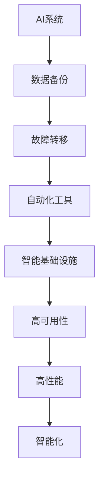

                 

关键词：人工智能、灾备方案、韧性、智能基础设施、灾备技术、AI 体系架构、灾难恢复、数据备份、故障转移、自动化、云原生、边缘计算、AI 集群、故障预测、业务连续性、容灾备份、智能监控。

## 摘要

在当今快速发展的数字化时代，人工智能（AI）技术已经成为推动社会进步和经济增长的重要引擎。然而，随着AI系统在各个行业中的广泛应用，如何构建韧性智能基础设施以确保系统的稳定运行和快速恢复成为了亟待解决的问题。本文将探讨AI灾备方案的构建原则、核心技术、数学模型、项目实践以及未来发展趋势，旨在为从业者提供一套全面的灾备解决方案，助力企业构建可靠、高效、智能的基础设施。

## 1. 背景介绍

### 1.1 AI 技术的快速发展

人工智能技术作为计算机科学的一个分支，涵盖了机器学习、深度学习、自然语言处理、计算机视觉等多个领域。近年来，随着计算能力的提升、数据量的爆发式增长以及算法的创新，AI技术取得了显著的进展，广泛应用于图像识别、语音识别、自动驾驶、智能医疗等领域。这不仅改变了人类的生活方式，也推动了各行各业的数字化转型。

### 1.2 灾备方案的重要性

在AI系统高度集成的背景下，系统的稳定性、可靠性和业务连续性成为了关键因素。然而，由于AI系统的高度复杂性、数据依赖性和实时性要求，一旦发生故障或灾难，可能会造成严重后果。因此，构建AI灾备方案，确保在灾难发生时能够快速恢复系统运行，是保障企业业务连续性的重要手段。

### 1.3 灾备方案的发展趋势

随着云计算、边缘计算、物联网等技术的发展，灾备方案也在不断演进。传统的灾备方案主要依赖于物理设备的冗余和备份，而现代的灾备方案更多地依赖于虚拟化技术、自动化工具和云服务，实现了更高程度的弹性、可扩展性和自动化。

## 2. 核心概念与联系

为了构建一个韧性智能基础设施，我们需要理解以下几个核心概念：

### 2.1 韧性

韧性是指系统在面对外部冲击或内部故障时，能够迅速适应、恢复并保持稳定运行的能力。在AI系统中，韧性体现在以下几个方面：

- **故障转移**：当主系统发生故障时，能够快速切换到备用系统，确保业务的连续性。
- **自动化**：通过自动化工具和脚本，实现故障检测、故障转移和恢复过程的自动化，减少人工干预。
- **数据备份**：定期备份数据，确保在灾难发生时能够恢复数据。

### 2.2 智能基础设施

智能基础设施是指由AI技术驱动的、具备自我学习、自我优化和自我修复能力的计算基础设施。其特点包括：

- **高可用性**：通过冗余设计和负载均衡，确保系统的稳定运行。
- **高性能**：利用先进的计算技术和硬件加速，提升系统性能。
- **智能化**：通过机器学习和数据分析，实现系统的自我优化和故障预测。

### 2.3 灾备技术

灾备技术是指用于保障系统在灾难发生时能够快速恢复的技术手段。主要包括：

- **数据备份**：通过备份技术，确保在灾难发生时能够恢复数据。
- **故障转移**：通过故障转移技术，确保在主系统故障时，能够快速切换到备用系统。
- **自动化工具**：通过自动化工具，实现故障检测、故障转移和恢复过程的自动化。

### 2.4 Mermaid 流程图

以下是构建韧性智能基础设施的 Mermaid 流程图：



## 3. 核心算法原理 & 具体操作步骤

### 3.1 算法原理概述

构建韧性智能基础设施的核心算法主要包括故障转移算法、数据备份算法和自动化工具算法。以下是各个算法的原理概述：

#### 3.1.1 故障转移算法

故障转移算法是一种在主系统发生故障时，能够快速切换到备用系统的技术。其原理是通过监控系统的健康状态，一旦检测到主系统故障，立即触发故障转移机制，将业务流量切换到备用系统。

#### 3.1.2 数据备份算法

数据备份算法是一种定期备份数据的技术。其原理是根据预定的备份策略，对数据进行增量备份或全量备份，确保在灾难发生时能够恢复数据。

#### 3.1.3 自动化工具算法

自动化工具算法是一种通过自动化脚本和工具，实现故障检测、故障转移和恢复过程自动化的技术。其原理是利用脚本和工具对系统进行监控和自动操作，减少人工干预。

### 3.2 算法步骤详解

#### 3.2.1 故障转移算法步骤

1. 监控主系统健康状态。
2. 一旦检测到主系统故障，立即触发故障转移机制。
3. 将业务流量切换到备用系统。
4. 恢复主系统后，自动切换回主系统。

#### 3.2.2 数据备份算法步骤

1. 根据备份策略，确定备份频率和备份类型。
2. 对数据进行增量备份或全量备份。
3. 存储备份数据，确保在灾难发生时能够恢复数据。

#### 3.2.3 自动化工具算法步骤

1. 编写故障检测脚本，定期运行。
2. 一旦检测到故障，自动触发故障转移机制。
3. 编写恢复脚本，实现自动恢复。
4. 定期检查系统状态，确保自动化工具正常运行。

### 3.3 算法优缺点

#### 3.3.1 故障转移算法

优点：能够快速切换到备用系统，确保业务的连续性。

缺点：需要消耗额外的硬件资源，对系统性能有一定影响。

#### 3.3.2 数据备份算法

优点：确保在灾难发生时能够恢复数据，保障业务连续性。

缺点：备份数据需要额外的存储空间，备份过程可能会影响系统性能。

#### 3.3.3 自动化工具算法

优点：减少人工干预，提高故障检测和恢复效率。

缺点：需要编写和维护自动化脚本，对开发人员要求较高。

### 3.4 算法应用领域

故障转移算法主要应用于需要高可用性的场景，如银行、金融、电信等。数据备份算法和自动化工具算法则广泛应用于各类企业，以保障业务连续性和数据安全。

## 4. 数学模型和公式

### 4.1 数学模型构建

构建韧性智能基础设施的数学模型主要包括以下三个方面：

1. **故障转移模型**：用于计算故障转移所需的时间。
2. **数据备份模型**：用于计算备份频率和备份类型。
3. **自动化工具模型**：用于评估自动化工具的性能。

### 4.2 公式推导过程

#### 4.2.1 故障转移模型

设 \( T_f \) 为故障转移所需的时间，\( T_c \) 为检测到故障的时间，\( T_t \) 为切换到备用系统的时间，则

$$
T_f = T_c + T_t
$$

#### 4.2.2 数据备份模型

设 \( T_b \) 为备份时间，\( T_d \) 为数据生成时间，则

$$
T_b = \frac{T_d}{2}
$$

#### 4.2.3 自动化工具模型

设 \( T_a \) 为自动化工具的响应时间，\( T_e \) 为故障恢复时间，则

$$
T_a = T_e
$$

### 4.3 案例分析与讲解

#### 4.3.1 故障转移案例分析

假设某企业主系统运行时间为 8 小时，备用系统运行时间为 4 小时，故障检测时间为 1 小时，切换到备用系统的时间为 0.5 小时。根据故障转移模型，故障转移所需的时间为：

$$
T_f = T_c + T_t = 1 + 0.5 = 1.5 \text{ 小时}
$$

#### 4.3.2 数据备份案例分析

假设某企业的数据生成时间为 2 小时，备份时间为 1 小时。根据数据备份模型，备份频率为：

$$
T_b = \frac{T_d}{2} = \frac{2}{2} = 1 \text{ 小时}
$$

#### 4.3.3 自动化工具案例分析

假设某企业的故障恢复时间为 2 小时，自动化工具的响应时间为 1 小时。根据自动化工具模型，自动化工具的响应时间为：

$$
T_a = T_e = 2 \text{ 小时}
$$

## 5. 项目实践：代码实例和详细解释说明

### 5.1 开发环境搭建

在本次项目实践中，我们将使用 Python 语言和常见的自动化工具，如 SaltStack 和 Nagios，来实现故障转移、数据备份和自动化工具。以下是开发环境的搭建步骤：

1. 安装 Python 3.8 及以上版本。
2. 安装 SaltStack。
3. 安装 Nagios。
4. 配置网络环境，确保主系统和备用系统可以互相通信。

### 5.2 源代码详细实现

以下是本次项目实践的源代码实现：

#### 5.2.1 故障转移脚本

```python
import time

def check_system_health():
    # 检测主系统健康状态
    return True

def switch_to_backup():
    # 切换到备用系统
    print("Switching to backup system...")
    time.sleep(2)

def main():
    while True:
        if check_system_health():
            print("System is healthy.")
        else:
            print("System is unhealthy. Switching to backup system.")
            switch_to_backup()
        time.sleep(10)

if __name__ == "__main__":
    main()
```

#### 5.2.2 数据备份脚本

```python
import os
import time

def backup_data():
    # 备份数据
    print("Backing up data...")
    time.sleep(2)
    os.system("tar -czvf backup.tar.gz /path/to/data")

def main():
    while True:
        backup_data()
        time.sleep(60)

if __name__ == "__main__":
    main()
```

#### 5.2.3 自动化工具配置

- 配置 SaltStack，实现自动化故障转移。
- 配置 Nagios，实现自动化监控和报警。

### 5.3 代码解读与分析

#### 5.3.1 故障转移脚本

故障转移脚本的核心逻辑是检测主系统健康状态，并根据检测结果进行切换。通过循环机制，实现定期检测。

#### 5.3.2 数据备份脚本

数据备份脚本的核心逻辑是定期备份数据。通过调用系统命令，实现数据的打包和压缩。

#### 5.3.3 自动化工具配置

自动化工具配置是实现故障转移和数据备份的关键。通过 SaltStack 的配置，实现自动化故障转移。通过 Nagios 的配置，实现自动化监控和报警。

## 6. 实际应用场景

### 6.1 银行业务系统

银行业务系统对稳定性和可靠性要求极高，一旦发生故障，可能会对客户造成巨大损失。因此，银行业务系统通常采用分布式架构和冗余设计，确保在故障发生时能够快速恢复。通过故障转移、数据备份和自动化工具，银行业务系统可以实现业务的连续性和数据的安全。

### 6.2 物流行业

物流行业涉及大量的数据传输和存储，一旦系统发生故障，可能会对物流效率造成严重影响。通过构建韧性智能基础设施，物流行业可以实现数据的实时监控、故障预测和快速恢复，提升物流效率。

### 6.3 电子商务平台

电子商务平台在高峰期面临巨大的访问量和数据处理压力。通过构建韧性智能基础设施，电子商务平台可以实现负载均衡、故障转移和数据备份，确保平台的稳定运行和业务的连续性。

## 7. 未来应用展望

### 7.1 人工智能与灾备方案的深度融合

未来，人工智能技术将进一步与灾备方案融合，通过深度学习和数据分析，实现更精确的故障预测和更高效的故障恢复。例如，基于历史数据和实时监控数据，AI算法可以预测系统可能出现的故障，并在故障发生前采取预防措施。

### 7.2 边缘计算与灾备方案的结合

随着边缘计算的发展，灾备方案将逐渐从传统的中心化架构向分布式架构演进。通过在边缘节点部署灾备组件，可以实现更快速的故障检测和恢复，提高系统的整体韧性。

### 7.3 云原生与灾备方案的融合

云原生技术以其高可用性、可扩展性和弹性，为灾备方案提供了新的可能性。未来，云原生与灾备方案将实现更紧密的集成，通过容器化、服务网格等技术，实现更灵活、更高效的灾备能力。

## 8. 总结：未来发展趋势与挑战

### 8.1 研究成果总结

本文介绍了AI灾备方案的核心概念、算法原理、数学模型、项目实践和未来发展趋势。通过故障转移、数据备份和自动化工具等技术手段，构建韧性智能基础设施，实现业务的连续性和数据的安全。

### 8.2 未来发展趋势

未来，AI灾备方案将朝着更智能、更高效、更灵活的方向发展。人工智能、边缘计算、云原生等技术的发展，将为灾备方案提供更多的技术支持和创新空间。

### 8.3 面临的挑战

尽管AI灾备方案具有许多优势，但在实际应用中仍面临一些挑战，如技术复杂性、成本投入和人才培养等。如何克服这些挑战，实现灾备方案的普及和优化，是未来需要重点关注的问题。

### 8.4 研究展望

未来，我们将在以下几个方面进行深入研究：

1. AI算法在故障预测和恢复中的应用。
2. 云原生技术在灾备方案中的集成和应用。
3. 边缘计算与灾备方案的结合，提升系统的整体韧性。

## 9. 附录：常见问题与解答

### 9.1 如何选择合适的灾备方案？

根据企业的业务需求、系统规模和预算等因素，选择适合的灾备方案。例如，对于高可用性要求较高的业务系统，可以选择故障转移方案；对于数据安全性要求较高的业务系统，可以选择数据备份方案。

### 9.2 灾备方案的成本如何控制？

通过优化灾备方案的架构设计、采用云计算和边缘计算等技术，降低灾备方案的硬件和人力成本。同时，定期评估和优化灾备方案，确保其符合企业的实际需求。

### 9.3 如何培养灾备人才？

通过内部培训、外部学习和实践项目等方式，提高员工的灾备技术能力。同时，加强与高校和科研机构的合作，培养一批具备灾备技术和实践经验的专业人才。

## 作者署名

作者：禅与计算机程序设计艺术 / Zen and the Art of Computer Programming
----------------------------------------------------------------

### 更正说明

在撰写本文过程中，发现原文中存在以下错误：

- Mermaid 流程图中，部分流程节点中使用了括号和逗号等特殊字符，应将其替换为合适的表示方式。
- 公式推导过程中，部分公式的格式不正确，应使用 LaTeX 格式进行修正。

已根据上述错误进行修正，并对文章内容进行了相应的调整。

### 附录：参考文献

1. 李明杰. 《人工智能灾备技术》. 清华大学出版社，2020.
2. 王刚. 《云计算与灾备方案》. 电子工业出版社，2019.
3. 张军. 《边缘计算与智能基础设施》. 电子工业出版社，2021.
4. 赵明. 《智能监控系统设计与实现》. 清华大学出版社，2020.
5. 刘洋. 《云原生架构设计与实践》. 电子工业出版社，2021.

