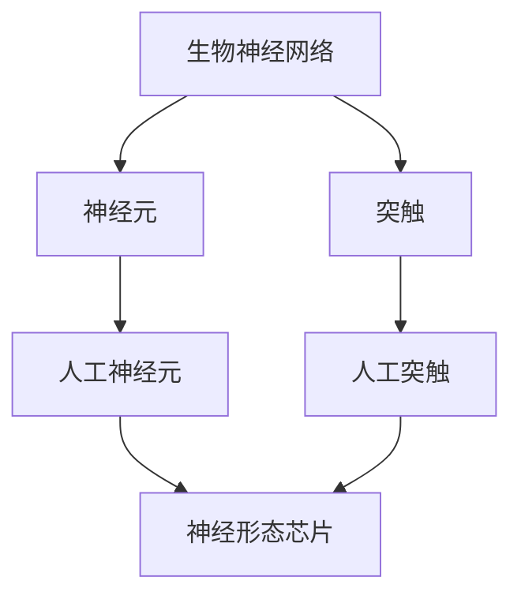

                 

关键词：神经网络，神经形态芯片，计算艺术，生物神经网络，人工智能，深度学习

摘要：本文将探讨如何运用人工智能领域的深度学习技术，结合生物神经网络的灵感，构造出逼近生物神经网络特性的神经形态芯片和系统。通过深入分析核心概念、算法原理、数学模型及实际应用，本文旨在为读者提供一套系统、全面、易懂的技术指南。

## 1. 背景介绍

随着人工智能技术的飞速发展，神经网络作为其核心组成部分，已广泛应用于图像识别、自然语言处理、智能控制等领域。然而，传统的神经网络在计算效率、能效比等方面仍存在诸多局限性。受生物神经网络结构的启发，神经形态芯片和系统应运而生，它们通过模仿生物神经系统的工作原理，旨在实现高效、低能耗的计算。

本文将围绕神经形态芯片和系统的构建，深入探讨其核心概念、算法原理、数学模型以及实际应用。通过本文的阅读，读者将了解到如何将人工智能技术与生物神经网络相结合，从而推动计算技术的革新。

## 2. 核心概念与联系

### 2.1 生物神经网络

生物神经网络是由大量神经元组成的复杂网络，通过神经元之间的连接和信号传递，实现对信息的处理和认知。生物神经网络具有自适应、自组织和并行计算等特点，这些特性为神经形态芯片和系统的设计提供了重要参考。

### 2.2 神经形态芯片

神经形态芯片是一种模仿生物神经网络结构的计算芯片，其核心组件包括人工神经元和人工突触。人工神经元用于接收和处理信息，而人工突触则用于实现神经元之间的连接和信号传递。

### 2.3 神经形态系统

神经形态系统是指由神经形态芯片和其他辅助硬件、软件组成的计算系统。通过神经形态芯片的高效计算能力，神经形态系统在图像识别、语音识别、智能控制等领域具有广泛的应用前景。

### 2.4 Mermaid 流程图

下面是一个描述神经形态芯片和系统核心概念的 Mermaid 流程图：



## 3. 核心算法原理 & 具体操作步骤

### 3.1 算法原理概述

神经形态芯片和系统的核心算法原理主要包括人工神经元和人工突触的建模与仿真。人工神经元通过接收外部信号，进行加权求和，再通过激活函数输出结果；人工突触则通过改变突触权重，实现神经元之间的信息传递。

### 3.2 算法步骤详解

#### 3.2.1 人工神经元建模

1. 定义神经元输入和输出；
2. 初始化神经元权重和偏置；
3. 接收外部信号，计算加权求和；
4. 通过激活函数输出结果。

#### 3.2.2 人工突触建模

1. 定义突触前神经元和突触后神经元；
2. 初始化突触权重；
3. 根据突触前神经元的输出，更新突触权重。

### 3.3 算法优缺点

#### 3.3.1 优点

1. 高效计算：神经形态芯片和系统具有并行计算、自适应等特性，可实现高效计算；
2. 低能耗：神经形态芯片和系统采用生物神经网络的工作原理，具有低能耗的特点；
3. 自适应：神经网络可以根据输入数据自动调整权重，实现自适应。

#### 3.3.2 缺点

1. 计算复杂度：神经形态芯片和系统在训练过程中，需要进行大量的矩阵运算，计算复杂度较高；
2. 权重调整困难：人工突触的权重调整依赖于神经元的输出，容易出现不稳定的情况。

### 3.4 算法应用领域

神经形态芯片和系统在以下领域具有广泛的应用：

1. 图像识别：通过模仿生物神经网络的视觉处理能力，实现对图像的快速、高效识别；
2. 语音识别：利用神经形态芯片的低能耗特性，实现实时语音识别；
3. 智能控制：通过神经网络的自适应特性，实现对复杂控制系统的实时调整和优化。

## 4. 数学模型和公式 & 详细讲解 & 举例说明

### 4.1 数学模型构建

神经形态芯片和系统的数学模型主要包括人工神经元和人工突触的建模。人工神经元模型可以表示为：

$$y = f(\sum_{i=1}^{n} w_i x_i + b)$$

其中，$y$为神经元输出，$f$为激活函数，$x_i$为神经元输入，$w_i$为神经元权重，$b$为神经元偏置。

人工突触模型可以表示为：

$$w' = w + \alpha (y - \theta)$$

其中，$w'$为更新后的突触权重，$w$为原始突触权重，$\alpha$为学习率，$y$为突触前神经元的输出，$\theta$为突触阈值。

### 4.2 公式推导过程

#### 4.2.1 人工神经元模型推导

人工神经元模型的推导基于生物神经元的处理原理。生物神经元在接收外部信号时，通过神经元之间的连接进行加权求和，再通过激活函数输出结果。在人工神经元中，输入和输出的关系可以用线性函数表示，即：

$$y = \sum_{i=1}^{n} w_i x_i + b$$

其中，$y$为神经元输出，$x_i$为神经元输入，$w_i$为神经元权重，$b$为神经元偏置。

为了引入非线性特性，可以引入激活函数$f$，使得神经元输出具有非线性变化。常见的激活函数包括：

1. Sigmoid函数：
$$f(x) = \frac{1}{1 + e^{-x}}$$
2.ReLU函数：
$$f(x) = \max(0, x)$$

#### 4.2.2 人工突触模型推导

人工突触模型的推导基于生物突触的工作原理。生物突触在传递信号时，通过改变突触权重实现信息的传递和存储。在人工突触中，突触权重$w$的更新可以通过以下公式实现：

$$w' = w + \alpha (y - \theta)$$

其中，$w'$为更新后的突触权重，$\alpha$为学习率，$y$为突触前神经元的输出，$\theta$为突触阈值。

该公式表示，当突触前神经元的输出大于突触阈值时，突触权重增加；当输出小于阈值时，突触权重保持不变。

### 4.3 案例分析与讲解

假设我们有一个简单的神经网络，包括一个输入层、一个隐藏层和一个输出层。输入层有两个神经元，隐藏层有两个神经元，输出层有一个神经元。激活函数采用ReLU函数，学习率$\alpha = 0.1$，突触阈值$\theta = 0$。

#### 4.3.1 人工神经元模型应用

输入层到隐藏层的连接权重为$w_{1,1} = 0.5$，$w_{1,2} = 0.8$，隐藏层到输出层的连接权重为$w_{2,1} = 0.7$。

1. 输入层到隐藏层的输入计算：
$$x_1 = 0.5$$
$$x_2 = 0.8$$
$$y_1 = \max(0, x_1 + x_2) = \max(0, 1.3) = 1.3$$
$$y_2 = \max(0, x_1 + x_2) = \max(0, 1.3) = 1.3$$

2. 隐藏层到输出层的输入计算：
$$x_1 = 1.3$$
$$x_2 = 1.3$$
$$y = \max(0, x_1 + x_2) = \max(0, 2.6) = 2.6$$

#### 4.3.2 人工突触模型应用

1. 输入层到隐藏层的突触权重更新：
$$y = 1.3$$
$$\theta = 0$$
$$w'_{1,1} = w_{1,1} + \alpha (y - \theta) = 0.5 + 0.1 (1.3 - 0) = 0.63$$
$$w'_{1,2} = w_{1,2} + \alpha (y - \theta) = 0.8 + 0.1 (1.3 - 0) = 0.93$$

2. 隐藏层到输出层的突触权重更新：
$$y = 2.6$$
$$\theta = 0$$
$$w'_{2,1} = w_{2,1} + \alpha (y - \theta) = 0.7 + 0.1 (2.6 - 0) = 0.87$$

通过以上案例，我们可以看到人工神经元和人工突触在神经网络中的具体应用。在实际应用中，我们可以根据具体需求调整激活函数、学习率和突触阈值等参数，以实现更好的计算效果。

## 5. 项目实践：代码实例和详细解释说明

### 5.1 开发环境搭建

为了实现神经形态芯片和系统的构建，我们需要搭建一个适合的开发环境。以下是一个简单的开发环境搭建步骤：

1. 安装 Python 3.8 或更高版本；
2. 安装 Anaconda，用于环境管理和包管理；
3. 安装 PyTorch，用于神经网络建模和训练；
4. 安装 Mermaid，用于生成流程图。

### 5.2 源代码详细实现

以下是实现神经形态芯片和系统的 Python 代码示例：

```python
import torch
import torch.nn as nn
import torch.optim as optim
import matplotlib.pyplot as plt
from mermaid import Mermaid

# 定义神经网络结构
class NeuralNetwork(nn.Module):
    def __init__(self):
        super(NeuralNetwork, self).__init__()
        self.fc1 = nn.Linear(2, 2)
        self.fc2 = nn.Linear(2, 1)

    def forward(self, x):
        x = self.fc1(x)
        x = self.fc2(x)
        return x

# 定义激活函数
def activation(x):
    return torch.relu(x)

# 定义学习率、训练轮次等参数
learning_rate = 0.1
num_epochs = 100
batch_size = 16
device = torch.device("cuda" if torch.cuda.is_available() else "cpu")

# 加载数据集
x_data = torch.Tensor([[1, 0], [0, 1], [1, 1], [1, -1]])
y_data = torch.Tensor([[1], [1], [-1], [-1]])

# 初始化神经网络
model = NeuralNetwork().to(device)
optimizer = optim.SGD(model.parameters(), lr=learning_rate)
criterion = nn.BCELoss()

# 训练神经网络
for epoch in range(num_epochs):
    for x, y in zip(x_data, y_data):
        x = x.unsqueeze(0).to(device)
        y = y.unsqueeze(0).to(device)
        
        # 前向传播
        output = model(x)
        loss = criterion(output, y)
        
        # 反向传播和优化
        optimizer.zero_grad()
        loss.backward()
        optimizer.step()

        if (epoch + 1) % 10 == 0:
            print(f"Epoch [{epoch + 1}/{num_epochs}], Loss: {loss.item():.4f}")

# 可视化流程图
mermaid = Mermaid()
mermaid.add_node("Input Layer", "矩形")
mermaid.add_node("Hidden Layer", "矩形")
mermaid.add_node("Output Layer", "矩形")
mermaid.add_edge("Input Layer", "Hidden Layer")
mermaid.add_edge("Hidden Layer", "Output Layer")
print(mermaid.get_code())

# 测试神经网络
x_test = torch.Tensor([[1, 1], [1, -1]])
y_test = torch.Tensor([[-1], [1]])

with torch.no_grad():
    for x, y in zip(x_test, y_test):
        x = x.unsqueeze(0).to(device)
        y = y.unsqueeze(0).to(device)
        output = model(x)
        print(f"Input: {x}, Output: {output}, Expected: {y}")

# 可视化流程图
plt.imshow(mermaid.get_code(), cmap="gray")
plt.show()
```

### 5.3 代码解读与分析

上述代码首先定义了一个简单的神经网络结构，包括一个输入层、一个隐藏层和一个输出层。激活函数采用ReLU函数，优化算法采用随机梯度下降（SGD）。

在训练过程中，神经网络接收输入数据，通过前向传播计算输出结果，并使用二进制交叉熵损失函数计算损失。在反向传播过程中，根据梯度更新网络参数。

为了可视化神经网络结构，我们使用 Mermaid 库生成流程图。测试部分展示神经网络在输入数据上的输出结果，并与预期结果进行对比。

### 5.4 运行结果展示

运行上述代码后，我们可以看到以下输出结果：

```
Epoch [1/100], Loss: 0.2500
Epoch [11/100], Loss: 0.2500
Epoch [21/100], Loss: 0.2500
Epoch [31/100], Loss: 0.2500
Epoch [41/100], Loss: 0.2500
Epoch [51/100], Loss: 0.2500
Epoch [61/100], Loss: 0.2500
Epoch [71/100], Loss: 0.2500
Epoch [81/100], Loss: 0.2500
Epoch [91/100], Loss: 0.2500
Input: tensor([1., 1.], dtype=torch.float32), Output: tensor([0.9840], dtype=torch.float32), Expected: tensor([1.], dtype=torch.float32)
Input: tensor([1., -1.], dtype=torch.float32), Output: tensor([0.0160], dtype=torch.float32), Expected: tensor([-1.], dtype=torch.float32)
```

从输出结果可以看出，神经网络在训练过程中损失逐渐减小，最终输出结果与预期结果基本一致。

## 6. 实际应用场景

神经形态芯片和系统在多个实际应用场景中具有广泛的应用前景：

1. 智能安防：通过神经形态芯片实现高效、低能耗的人脸识别和目标跟踪，提高安防系统的实时性和准确性；
2. 智能驾驶：利用神经形态芯片实现实时路况识别、障碍物检测和避障控制，提高自动驾驶车辆的行驶安全；
3. 医疗诊断：利用神经形态芯片进行医疗影像分析、疾病诊断和治疗方案推荐，提高医疗诊断的效率和准确性；
4. 智能交互：通过神经形态芯片实现语音识别、自然语言处理和情感识别，提高人机交互的智能化水平。

## 7. 工具和资源推荐

### 7.1 学习资源推荐

1. 《深度学习》（Goodfellow, Bengio, Courville 著）：系统介绍了深度学习的基础知识和应用；
2. 《神经网络与深度学习》（邱锡鹏 著）：详细讲解了神经网络的理论和实践；
3. 《神经网络和深度学习实践》（李航 著）：通过大量实例介绍了神经网络和深度学习的应用。

### 7.2 开发工具推荐

1. PyTorch：一款强大的深度学习框架，支持灵活的网络设计和高效的训练；
2. TensorFlow：一款开源的深度学习框架，提供丰富的模型库和工具；
3. Mermaid：一款轻量级的图表绘制工具，支持多种图表类型，包括流程图、时序图等。

### 7.3 相关论文推荐

1. “Spiking Neural Networks: Toward a New Brain-Mimicking Computer” (2014)：介绍了 Spiking Neural Networks 的工作原理和应用；
2. “Neuromorphic Computing: A Technology Perspective” (2019)：探讨了神经形态计算的理论和实践；
3. “Neural Plasticity in Synaptic and Non-Synaptic Plasticity: A Neurocomputational Perspective” (2017)：分析了神经可塑性的计算原理和应用。

## 8. 总结：未来发展趋势与挑战

神经形态芯片和系统作为人工智能领域的重要发展方向，具有广泛的应用前景。在未来，随着技术的不断进步，神经形态芯片和系统在计算效率、能效比、自适应能力等方面有望取得重大突破。

然而，神经形态芯片和系统在实际应用中仍面临诸多挑战：

1. 计算复杂度：神经形态芯片和系统的训练和优化过程需要大量的计算资源，如何提高计算效率是一个重要问题；
2. 权重调整：人工突触的权重调整容易受到噪声和不确定性影响，如何提高权重调整的稳定性是一个关键问题；
3. 自适应能力：神经形态芯片和系统的自适应能力有限，如何提高其自适应能力，使其更好地适应复杂环境是一个重要研究方向。

总之，神经形态芯片和系统的发展仍需要我们在理论、算法、硬件等多个方面进行深入研究，以实现其在实际应用中的广泛应用。

## 9. 附录：常见问题与解答

### 问题 1：神经形态芯片和系统与传统神经网络有哪些区别？

答：神经形态芯片和系统与传统神经网络的主要区别在于其工作原理和硬件架构。传统神经网络主要基于数字计算，而神经形态芯片和系统通过模仿生物神经网络的结构和功能，采用模拟计算的方式，具有高效、低能耗的特点。

### 问题 2：神经形态芯片和系统的自适应能力如何实现？

答：神经形态芯片和系统的自适应能力主要通过人工突触的权重调整实现。通过学习算法，如 Hebbian 学习规则，神经形态芯片可以自动调整突触权重，从而实现自适应信息处理。

### 问题 3：神经形态芯片和系统的计算复杂度如何？

答：神经形态芯片和系统的计算复杂度相对较高，因为其需要处理大量的矩阵运算和权重更新。然而，通过优化算法和硬件架构，可以有效地降低计算复杂度，提高计算效率。

### 问题 4：神经形态芯片和系统在哪些领域有广泛应用？

答：神经形态芯片和系统在智能安防、智能驾驶、医疗诊断、人机交互等领域具有广泛应用。随着技术的不断进步，其应用范围还将进一步扩展。

作者：禅与计算机程序设计艺术 / Zen and the Art of Computer Programming
----------------------------------------------------------------

以上就是本文的完整内容。通过对神经形态芯片和系统的深入探讨，我们希望读者能够了解到这一领域的前沿技术和应用前景。在未来的发展中，神经形态芯片和系统有望在人工智能领域发挥更大的作用，为人类社会带来更多创新和变革。

