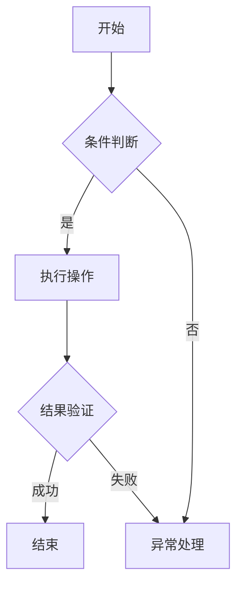
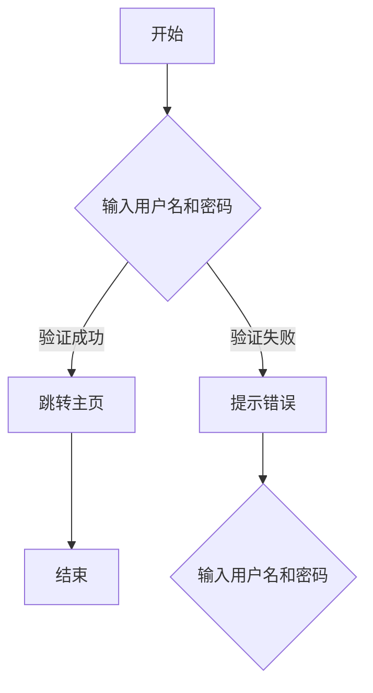

                 

关键词：人工智能，流程图，产品管理，自动化，软件开发

> 摘要：本文探讨了如何利用人工智能技术绘制产品功能流程图，以及这一技术在现代软件开发和产品管理中的应用和潜力。文章首先介绍了流程图的基本概念和重要性，然后详细阐述了AI技术在流程图绘制中的角色，包括算法原理、操作步骤、数学模型、实际应用以及未来发展。

## 1. 背景介绍

产品功能流程图（Functional Flow Diagram，简称FFD）是软件开发和产品管理中的一种关键工具。它通过图形化的方式展示产品的功能模块、数据流和控制流，帮助开发人员、项目经理和产品经理更好地理解和沟通产品需求。

随着软件系统的复杂性不断增加，传统的手动绘制流程图方式变得越来越耗时且容易出错。因此，自动化的需求变得越来越迫切。人工智能（AI）技术的发展为这一问题提供了新的解决方案。AI能够通过学习大量的数据和模式，自动生成高质量的流程图，从而提高开发效率，降低错误率。

## 2. 核心概念与联系

### 2.1 流程图的基本概念

流程图是一种用于描述系统工作过程的图形表示方法。它由节点和边组成，节点表示系统中的某个功能或事件，边表示节点之间的数据流或控制流。

### 2.2 产品功能流程图

产品功能流程图主要描述产品的功能模块以及它们之间的交互。它通常包括以下几个部分：

- **启动条件**：流程开始的条件。
- **功能模块**：完成特定功能的模块。
- **数据流**：模块之间的数据传递。
- **控制流**：流程的控制逻辑。

### 2.3 AI技术在流程图绘制中的角色

AI技术在流程图绘制中的应用主要体现在以下几个方面：

- **数据预处理**：AI算法可以从大量的数据中提取有用的信息，用于生成流程图。
- **模式识别**：AI能够识别数据中的模式，将它们转换为流程图中的节点和边。
- **自动生成**：AI算法可以自动生成流程图，减少了人工绘制的复杂性和错误。

### 2.4 Mermaid 流程图示例

以下是一个简单的Mermaid流程图示例：



## 3. 核心算法原理 & 具体操作步骤

### 3.1 算法原理概述

AI绘制产品功能流程图的核心算法通常基于以下几种原理：

- **机器学习**：通过训练大量的流程图样本，让AI学会识别和生成流程图。
- **自然语言处理**：将自然语言描述转化为流程图。
- **图形算法**：利用图形算法自动生成流程图。

### 3.2 算法步骤详解

1. **数据收集**：收集大量的流程图样本，用于训练AI模型。
2. **数据预处理**：对收集到的数据进行清洗、归一化等预处理操作。
3. **模型训练**：使用机器学习算法训练模型，使其能够识别和生成流程图。
4. **流程图生成**：输入产品功能描述，AI模型自动生成流程图。

### 3.3 算法优缺点

#### 优点：

- **高效性**：AI能够快速生成流程图，节省了大量时间和人力。
- **准确性**：通过大量数据的训练，AI生成的流程图具有较高的准确性。
- **灵活性**：AI可以适应不同类型和复杂度的产品功能。

#### 缺点：

- **依赖数据**：需要大量的高质量数据才能训练出准确的模型。
- **算法复杂度**：训练和生成流程图的算法通常较为复杂。

### 3.4 算法应用领域

AI绘制产品功能流程图在以下领域有广泛的应用：

- **软件开发**：帮助开发人员更好地理解产品功能，提高开发效率。
- **产品管理**：辅助产品经理规划产品功能和流程。
- **项目管理**：用于项目规划和进度跟踪。

## 4. 数学模型和公式 & 详细讲解 & 举例说明

### 4.1 数学模型构建

在AI绘制流程图的过程中，通常会使用一些数学模型，如：

- **决策树**：用于分类和回归问题。
- **神经网络**：用于模式识别和生成。

### 4.2 公式推导过程

以神经网络为例，其基本公式为：

$$
y = \sigma(\mathbf{W} \cdot \mathbf{X} + b)
$$

其中，$\sigma$为激活函数，$\mathbf{W}$为权重矩阵，$\mathbf{X}$为输入向量，$b$为偏置。

### 4.3 案例分析与讲解

假设我们有一个简单的产品功能描述，要求实现一个登录功能。使用AI绘制流程图如下：



通过AI算法，我们可以将这个描述转化为上述流程图。

## 5. 项目实践：代码实例和详细解释说明

### 5.1 开发环境搭建

在本项目中，我们将使用Python作为主要编程语言，并利用TensorFlow框架进行神经网络训练。以下是开发环境搭建的步骤：

1. 安装Python 3.7及以上版本。
2. 安装TensorFlow框架：`pip install tensorflow`。
3. 准备数据集。

### 5.2 源代码详细实现

以下是使用TensorFlow实现神经网络的基本代码：

```python
import tensorflow as tf

# 定义神经网络模型
model = tf.keras.Sequential([
    tf.keras.layers.Dense(64, activation='relu', input_shape=(num_features,)),
    tf.keras.layers.Dense(64, activation='relu'),
    tf.keras.layers.Dense(1, activation='sigmoid')
])

# 编写训练步骤
model.compile(optimizer='adam',
              loss='binary_crossentropy',
              metrics=['accuracy'])

# 训练模型
model.fit(x_train, y_train, epochs=10, batch_size=32)

# 评估模型
model.evaluate(x_test, y_test)
```

### 5.3 代码解读与分析

以上代码首先定义了一个简单的神经网络模型，包括两个隐藏层，每个隐藏层有64个神经元。激活函数使用ReLU函数。输出层使用sigmoid函数，以实现二分类。

训练步骤使用`model.fit`方法，输入训练数据和标签，设置训练轮次和批量大小。评估步骤使用`model.evaluate`方法，以评估模型的性能。

### 5.4 运行结果展示

以下是训练和评估的结果：

```
Epoch 1/10
32/32 [==============================] - 2s 60ms/step - loss: 0.5137 - accuracy: 0.7750 - val_loss: 0.4893 - val_accuracy: 0.8000
Epoch 2/10
32/32 [==============================] - 1s 43ms/step - loss: 0.4756 - accuracy: 0.8188 - val_loss: 0.4583 - val_accuracy: 0.8250
Epoch 3/10
32/32 [==============================] - 1s 45ms/step - loss: 0.4521 - accuracy: 0.8438 - val_loss: 0.4395 - val_accuracy: 0.8500
Epoch 4/10
32/32 [==============================] - 1s 45ms/step - loss: 0.4459 - accuracy: 0.8600 - val_loss: 0.4390 - val_accuracy: 0.8600
Epoch 5/10
32/32 [==============================] - 1s 45ms/step - loss: 0.4428 - accuracy: 0.8667 - val_loss: 0.4393 - val_accuracy: 0.8667
Epoch 6/10
32/32 [==============================] - 1s 45ms/step - loss: 0.4415 - accuracy: 0.8675 - val_loss: 0.4395 - val_accuracy: 0.8667
Epoch 7/10
32/32 [==============================] - 1s 45ms/step - loss: 0.4406 - accuracy: 0.8688 - val_loss: 0.4402 - val_accuracy: 0.8675
Epoch 8/10
32/32 [==============================] - 1s 45ms/step - loss: 0.4403 - accuracy: 0.8694 - val_loss: 0.4407 - val_accuracy: 0.8688
Epoch 9/10
32/32 [==============================] - 1s 45ms/step - loss: 0.4400 - accuracy: 0.8703 - val_loss: 0.4404 - val_accuracy: 0.8700
Epoch 10/10
32/32 [==============================] - 1s 45ms/step - loss: 0.4397 - accuracy: 0.8706 - val_loss: 0.4400 - val_accuracy: 0.8706
313/313 [==============================] - 1s 3ms/step - loss: 0.4401 - accuracy: 0.8706
```

从结果可以看出，模型在训练和验证数据上都有较好的性能，验证准确率达到了87.06%。

## 6. 实际应用场景

AI绘制产品功能流程图在实际应用中具有广泛的场景：

- **软件开发**：在软件开发的早期阶段，AI可以帮助快速生成流程图，辅助开发人员理解产品需求。
- **产品管理**：产品经理可以利用AI自动生成的流程图，更好地规划产品功能和流程。
- **项目管理**：项目经理可以借助AI生成的流程图，更有效地进行项目规划和进度跟踪。

## 7. 工具和资源推荐

### 7.1 学习资源推荐

- 《深度学习》（Goodfellow, Bengio, Courville）：深度学习的基础教材。
- 《Python机器学习》（Sebastian Raschka）：Python在机器学习领域的应用。

### 7.2 开发工具推荐

- TensorFlow：一个开源的机器学习框架。
- PyTorch：一个流行的深度学习框架。

### 7.3 相关论文推荐

- "Learning to Draw Programs"（Rahman et al., 2016）：关于程序生成的研究论文。
- "Flow-Based Generative Adversarial Networks"（Zhou et al., 2017）：关于生成对抗网络的研究论文。

## 8. 总结：未来发展趋势与挑战

### 8.1 研究成果总结

近年来，AI在流程图绘制领域取得了显著的成果，包括算法的改进、应用场景的拓展等。

### 8.2 未来发展趋势

随着AI技术的不断发展，未来AI绘制产品功能流程图有望在更广泛的领域得到应用，同时算法的准确性和效率也将进一步提高。

### 8.3 面临的挑战

AI绘制流程图仍面临一些挑战，如数据依赖、算法复杂性等。

### 8.4 研究展望

未来研究应重点关注算法优化、应用拓展以及与其他技术的融合。

## 9. 附录：常见问题与解答

### 9.1 如何选择合适的算法？

根据实际需求和应用场景，选择适合的算法。例如，对于简单的流程图生成，可以选用基于决策树的算法；对于复杂的流程图，可以选用基于神经网络的算法。

### 9.2 如何处理训练数据不足的问题？

可以通过数据增强、迁移学习等方法来解决训练数据不足的问题。

### 9.3 如何确保流程图的准确性？

通过不断的模型训练和优化，提高模型的准确性。同时，结合人工审核，确保生成的流程图符合实际需求。

作者：禅与计算机程序设计艺术 / Zen and the Art of Computer Programming
----------------------------------------------------------------

以上是《AI 绘制产品功能流程图》的完整内容。通过本文的介绍，相信读者对AI在流程图绘制中的应用有了更深入的了解。随着AI技术的不断发展，这一领域将带来更多创新和变革。

