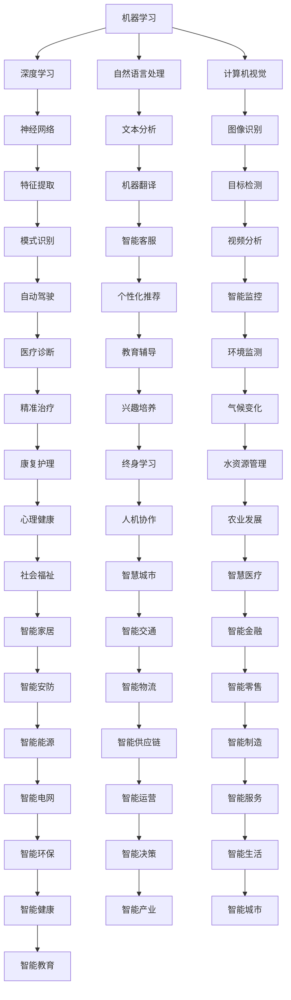

                 

### 关键词 Keyword
- 人工智能（AI）
- 文明进步
- 科技与人文
- 融合
- 未来展望

### 摘要 Abstract
本文探讨了人工智能（AI）作为一项颠覆性技术，如何驱动人类文明的进步，实现科技与人文的深度融合。通过详细阐述AI的核心概念、算法原理、数学模型以及实际应用案例，本文揭示了AI在推动社会、经济、文化等领域变革中的关键作用，并对未来发展趋势和挑战进行了深入分析。

## 1. 背景介绍

在过去的几十年里，人工智能（AI）经历了从理论研究到实际应用的飞速发展。随着计算能力的提升、大数据的积累以及算法的进步，AI技术逐渐渗透到各个领域，从自动驾驶、智能医疗、金融科技到文化创意产业，AI正以不可阻挡的势头改变着我们的生活。然而，在享受AI带来的便利和效率提升的同时，我们不得不面对一个重要的问题：科技与人文的融合。

科技的发展往往伴随着对人文关怀的忽视，而人文的缺失可能导致科技的异化。因此，如何在AI技术的快速进步中实现科技与人文的有机结合，成为了一个亟待解决的关键问题。本文将围绕这一主题，深入探讨AI在人类文明进步中的作用，以及如何实现科技与人文的深度融合。

### 1.1 AI的起源与发展

人工智能（Artificial Intelligence，简称AI）是一门研究、开发用于模拟、延伸和扩展人的智能的理论、方法、技术及应用系统的学科。AI的起源可以追溯到20世纪50年代，当时科学家们开始尝试通过计算机模拟人类智能行为。早期的AI研究主要集中在逻辑推理、问题解决和语言理解等方面。

随着计算能力的提升和算法的进步，AI技术逐渐从理论研究走向实际应用。20世纪80年代，专家系统成为AI研究的热点，该系统通过模拟专家的知识和经验，为特定领域的问题提供解决方案。进入21世纪，随着大数据、云计算和深度学习的兴起，AI技术迎来了新一轮的发展高潮。

当前，AI技术已经取得了显著的突破，包括语音识别、图像识别、自然语言处理、机器学习、深度学习等领域。AI技术在医疗、金融、教育、交通等领域的应用，不仅提高了生产效率，还改善了人们的生活质量。

### 1.2 科技与人文的融合

科技与人文的融合是一个复杂而深远的课题。科技的发展往往强调效率、规模和生产力，而人文则关注个体的情感、价值观和道德伦理。在人工智能时代，如何平衡科技与人文的关系，实现二者的有机融合，成为了一个重要的挑战。

首先，科技与人文的融合需要解决的是技术伦理问题。随着AI技术的发展，隐私保护、算法偏见、人工智能责任等问题日益凸显。如何确保AI技术的公正性、透明性和安全性，避免科技对人文价值观的冲击，是科技与人文融合的关键。

其次，科技与人文的融合还需要关注人的全面发展。人工智能技术的发展为人们提供了更多的可能性，但同时也带来了对人类技能和工作的挑战。如何通过科技与人文的融合，促进人的全面发展，提高人类的幸福感，是一个亟待解决的问题。

### 1.3 AI驱动人类文明进步的意义

人工智能（AI）作为一项颠覆性技术，正在深刻地改变着人类社会。AI不仅提高了生产效率，推动了经济增长，还在医疗、教育、环境等多个领域发挥了重要作用，促进了人类文明的进步。

首先，AI在医疗领域的应用为人类带来了革命性的变化。通过大数据分析和机器学习技术，AI能够帮助医生更准确地诊断疾病，制定个性化的治疗方案。例如，AI在癌症筛查、心脏病诊断和治疗规划等方面已经取得了显著成效。

其次，AI在教育领域的应用也为人类文明的进步做出了重要贡献。智能教育系统可以根据学生的兴趣和学习习惯，提供个性化的教育方案，提高教育质量和效率。同时，AI技术还可以帮助教师更好地管理课堂，提高教学效果。

此外，AI在环境领域的应用也为人类文明进步提供了新的思路。通过智能监测和预测技术，AI可以帮助我们更好地理解气候变化、水资源管理等问题，为可持续发展提供科学依据。

总之，AI技术正在以多种方式推动人类文明的进步，实现科技与人文的深度融合。在接下来的章节中，我们将进一步探讨AI的核心概念、算法原理、数学模型以及实际应用案例，以深入理解AI在人类文明进步中的作用。

## 2. 核心概念与联系

要深入探讨AI在人类文明进步中的作用，我们首先需要了解其核心概念和原理。本章节将介绍AI的关键概念，并借助Mermaid流程图展示其内在联系，帮助读者更好地理解AI的基本架构和技术原理。

### 2.1 人工智能（AI）的核心概念

人工智能（AI）是一门涉及多个学科领域的交叉学科，其核心概念包括以下几个方面：

1. **机器学习（Machine Learning）**：机器学习是AI的核心技术之一，它使计算机系统能够通过学习数据和模式来改进其性能。机器学习可以分为监督学习、无监督学习和强化学习。

2. **深度学习（Deep Learning）**：深度学习是机器学习的一个重要分支，它通过构建多层的神经网络来模拟人脑的学习方式，进行特征提取和模式识别。深度学习在图像识别、语音识别和自然语言处理等领域取得了显著成果。

3. **自然语言处理（Natural Language Processing，NLP）**：NLP是AI的一个分支，旨在使计算机能够理解和生成人类语言。NLP技术广泛应用于智能客服、机器翻译、文本分析等领域。

4. **计算机视觉（Computer Vision）**：计算机视觉是使计算机能够“看”和“理解”现实世界的技术。计算机视觉技术广泛应用于图像识别、目标检测、视频分析等领域。

5. **智能推荐系统（Intelligent Recommendation System）**：智能推荐系统利用机器学习和深度学习技术，根据用户的行为和偏好，为用户提供个性化的推荐服务。

### 2.2 AI的核心概念联系

为了更好地理解AI的核心概念及其相互联系，我们可以借助Mermaid流程图来展示AI的内部架构。以下是一个简化的Mermaid流程图，用于描述AI的核心概念和它们之间的联系：



在这个流程图中，我们可以看到机器学习、深度学习、自然语言处理、计算机视觉等核心概念之间的联系。这些概念不仅相互独立，还在实际应用中相互融合，共同推动着人工智能技术的发展。

### 2.3 AI的核心概念与实际应用的关联

AI的核心概念不仅仅是理论上的抽象概念，它们在实际应用中有着广泛的应用。以下是一些AI核心概念与实际应用的关联示例：

- **机器学习与医疗诊断**：机器学习技术可以帮助医生分析大量的医学图像，提高癌症筛查的准确性。例如，深度学习算法可以用于乳腺癌和肺癌的早期检测。

- **深度学习与自动驾驶**：深度学习技术在自动驾驶系统中起着关键作用，通过实时处理摄像头和雷达数据，使自动驾驶汽车能够识别道路标志、行人和其他车辆，确保行驶安全。

- **自然语言处理与智能客服**：自然语言处理技术使得智能客服系统能够理解用户的语言和问题，提供快速、准确的回答，提高客户满意度。

- **计算机视觉与智能监控**：计算机视觉技术可以用于智能监控系统中，通过实时分析视频流，识别异常行为，提高公共安全。

- **智能推荐系统与电子商务**：智能推荐系统根据用户的历史购买行为和浏览记录，推荐个性化的商品，提高电子商务平台的销售额。

通过理解AI的核心概念及其与实际应用的关联，我们可以更好地把握AI技术在各个领域的应用潜力，实现科技与人文的深度融合。

## 3. 核心算法原理 & 具体操作步骤

### 3.1 算法原理概述

在人工智能（AI）领域，算法原理是理解和应用AI技术的关键。以下将介绍几种核心算法原理，包括机器学习、深度学习和自然语言处理，并探讨其基本原理和具体操作步骤。

### 3.1.1 机器学习算法原理

机器学习（Machine Learning，ML）是一种使计算机系统能够从数据中学习并做出预测或决策的技术。其基本原理是通过训练模型来发现数据中的模式和规律，从而进行泛化。

- **监督学习（Supervised Learning）**：监督学习通过标记好的训练数据来训练模型。训练过程中，模型会尝试拟合训练数据的特征和标签之间的关系，以便在新的数据上进行预测。

  - **算法步骤**：
    1. 数据预处理：清洗和归一化数据，使其适合模型训练。
    2. 特征提取：从原始数据中提取有用的特征，用于训练模型。
    3. 模型训练：选择合适的模型，如线性回归、决策树、支持向量机等，并使用训练数据训练模型。
    4. 模型评估：使用验证集或测试集评估模型的性能，调整模型参数以优化性能。

- **无监督学习（Unsupervised Learning）**：无监督学习不依赖于标记数据，而是通过发现数据中的内在结构和模式来训练模型。

  - **算法步骤**：
    1. 数据预处理：清洗和归一化数据。
    2. 特征提取：提取数据中的潜在特征。
    3. 模型训练：选择合适的模型，如聚类算法、降维算法等。
    4. 模型评估：通过内部指标，如簇内距离、重构误差等，评估模型性能。

### 3.1.2 深度学习算法原理

深度学习（Deep Learning，DL）是机器学习的一个重要分支，通过构建多层的神经网络（Neural Networks）来模拟人脑的学习方式，进行特征提取和模式识别。

- **神经网络（Neural Networks）**：神经网络由大量的神经元（Neurons）组成，每个神经元通过权重（Weights）连接到其他神经元，并通过激活函数（Activation Function）产生输出。

  - **算法步骤**：
    1. 网络结构设计：设计合适的神经网络结构，包括层数、每层的神经元数量和连接方式。
    2. 初始化权重：随机初始化权重和偏置。
    3. 前向传播（Forward Propagation）：输入数据通过网络进行传播，计算每个神经元的输出。
    4. 反向传播（Backpropagation）：计算网络误差，并通过梯度下降（Gradient Descent）算法更新权重。
    5. 模型评估：使用验证集或测试集评估模型性能。

- **深度学习优化算法**：深度学习优化算法，如Adam、RMSProp等，通过改进梯度下降算法，提高训练效率和模型性能。

### 3.1.3 自然语言处理算法原理

自然语言处理（Natural Language Processing，NLP）是AI的一个重要领域，旨在使计算机能够理解和生成人类语言。

- **词向量表示（Word Embedding）**：词向量表示将单词映射为高维向量，以捕捉单词的语义信息。

  - **算法步骤**：
    1. 数据预处理：清洗文本数据，去除标点符号和停用词。
    2. 词表构建：构建词汇表，将单词映射为索引。
    3. 向量表示：使用神经网络或统计方法，将单词映射为高维向量。

- **序列模型（Sequence Model）**：序列模型用于处理文本序列，如循环神经网络（RNN）和长短期记忆网络（LSTM）。

  - **算法步骤**：
    1. 数据预处理：清洗和归一化文本数据。
    2. 词向量表示：将文本序列转换为词向量。
    3. 网络结构设计：设计合适的序列模型结构，如LSTM。
    4. 模型训练：使用序列数据训练模型。
    5. 模型评估：使用验证集或测试集评估模型性能。

通过理解这些核心算法原理，我们可以更好地应用AI技术解决实际问题，推动人类文明的进步。在接下来的章节中，我们将进一步探讨AI在各个领域的具体应用和案例。

### 3.2 算法步骤详解

在理解了AI的核心算法原理后，接下来我们将详细讨论这些算法的具体操作步骤，包括数据处理、模型选择、训练过程和评估方法。通过这些步骤，读者可以更深入地了解AI算法的实际应用过程。

#### 3.2.1 数据处理

数据处理是AI算法实施中的第一步，也是至关重要的一步。良好的数据处理能够提高模型性能，减少噪声和异常值的影响。以下是数据处理的一般步骤：

1. **数据收集**：从各种来源收集数据，如数据库、网络爬虫、传感器等。

2. **数据清洗**：去除无关数据、缺失值和异常值，对数据进行预处理。具体方法包括：
   - **缺失值处理**：通过删除缺失值、插补等方法处理缺失数据。
   - **异常值处理**：使用统计方法或基于规则的方法识别和去除异常值。
   - **数据标准化**：对数据进行归一化或标准化，使其适合模型训练。

3. **数据转换**：将数据转换为模型可接受的格式，如将分类问题转换为二分类问题、将连续数据离散化等。

4. **特征提取**：从原始数据中提取有用的特征，以减少数据的维度和提高模型的泛化能力。常用的特征提取方法包括：
   - **统计特征**：如平均值、标准差、最大值等。
   - **文本特征**：如词频、词袋模型、TF-IDF等。
   - **图像特征**：如边缘检测、纹理特征、颜色特征等。

#### 3.2.2 模型选择

在数据处理完成后，我们需要选择一个合适的模型。模型选择取决于问题的类型、数据的特性以及性能要求。以下是几种常见的模型选择方法：

1. **监督学习模型**：如线性回归、决策树、随机森林、支持向量机等。选择模型时需要考虑以下因素：
   - **模型复杂性**：复杂性较低的模型，如线性回归，适合处理简单问题；复杂性较高的模型，如决策树或支持向量机，适合处理复杂问题。
   - **数据规模**：对于大型数据集，可以选择集成模型，如随机森林或梯度提升树。

2. **无监督学习模型**：如聚类算法、降维算法等。选择模型时主要考虑以下因素：
   - **数据分布**：对于分布较为明显的数据，可以选择聚类算法；对于高维数据，可以选择降维算法。
   - **聚类数量**：在聚类算法中，需要确定聚类的数量，通常通过肘部法则或轮廓系数来确定。

3. **深度学习模型**：如卷积神经网络（CNN）、循环神经网络（RNN）和Transformer等。选择模型时需要考虑以下因素：
   - **数据类型**：对于图像数据，可以选择CNN；对于序列数据，可以选择RNN或Transformer。
   - **计算资源**：深度学习模型通常计算量大，需要考虑计算资源限制。

#### 3.2.3 训练过程

在选择了合适的模型后，我们需要对模型进行训练。训练过程主要包括以下步骤：

1. **初始化参数**：随机初始化模型的参数，如权重和偏置。

2. **前向传播**：输入数据通过网络进行传播，计算每个神经元的输出。

3. **计算损失**：计算模型预测结果与实际结果之间的误差，常用的损失函数包括均方误差（MSE）、交叉熵（Cross-Entropy）等。

4. **反向传播**：通过计算误差的梯度，更新模型的参数。

5. **优化算法**：使用优化算法，如梯度下降（Gradient Descent）、Adam等，更新模型参数，以最小化损失函数。

6. **模型评估**：在验证集上评估模型的性能，调整模型参数，以达到最佳性能。

#### 3.2.4 模型评估

模型评估是确保模型性能的关键步骤。以下是一些常用的评估方法：

1. **准确率（Accuracy）**：准确率是最常用的评估指标，表示模型正确预测的样本数占总样本数的比例。

2. **召回率（Recall）**：召回率表示模型能够正确识别出正类样本的比例，适用于分类问题。

3. **精确率（Precision）**：精确率表示模型预测为正类的样本中，实际为正类的比例。

4. **F1分数（F1 Score）**：F1分数是精确率和召回率的调和平均，用于综合评估模型性能。

5. **ROC曲线（Receiver Operating Characteristic Curve）**：ROC曲线用于评估二分类模型的分类性能，曲线下的面积（AUC）表示模型性能。

通过这些详细步骤，我们可以构建和训练一个性能优良的AI模型，从而实现预期的应用目标。在后续章节中，我们将通过实际案例进一步展示这些算法的应用过程。

### 3.3 算法优缺点

在人工智能领域，不同的算法因其原理、结构和应用场景的不同，各有优缺点。以下是几种常见算法的优缺点分析，以帮助读者更好地选择合适的算法。

#### 3.3.1 机器学习算法

**监督学习算法**：
- **优点**：
  - **准确度高**：通过标记数据训练模型，可以实现对数据的精确预测。
  - **广泛应用**：如线性回归、决策树、支持向量机等在分类和回归任务中都有广泛的应用。
- **缺点**：
  - **数据依赖性高**：需要大量的标记数据，数据预处理和特征工程工作量大。
  - **过拟合问题**：模型在训练数据上表现良好，但在新数据上表现不佳，容易过拟合。

**无监督学习算法**：
- **优点**：
  - **无需标记数据**：适用于数据标注困难或数据量大的情况，如聚类和降维。
  - **探索数据结构**：能够发现数据中的内在结构和模式。
- **缺点**：
  - **性能评估困难**：由于没有标记数据，模型的性能评估相对困难。
  - **解释性差**：无监督学习模型的结果通常较为抽象，难以解释。

**深度学习算法**：
- **优点**：
  - **强大的特征提取能力**：通过多层神经网络，能够自动提取数据的特征。
  - **适应性高**：在图像识别、语音识别和自然语言处理等领域表现出色。
- **缺点**：
  - **计算资源需求高**：深度学习模型通常需要大量的计算资源和时间进行训练。
  - **数据需求大**：训练深度学习模型通常需要大量数据，对数据质量有较高要求。

#### 3.3.2 自然语言处理算法

**词向量表示**：
- **优点**：
  - **捕捉语义信息**：通过将单词映射为向量，可以捕捉到单词的语义关系。
  - **简化和高效**：词向量表示简化了文本数据，提高了处理效率。
- **缺点**：
  - **维度灾难**：词向量的高维特性可能导致维度灾难，影响模型性能。
  - **语境敏感性差**：静态的词向量难以捕捉动态的语境变化。

**序列模型**：
- **优点**：
  - **处理序列数据**：如循环神经网络（RNN）和长短期记忆网络（LSTM），能够处理文本序列。
  - **上下文依赖性强**：能够捕捉到序列中的上下文信息。
- **缺点**：
  - **计算复杂度高**：RNN和LSTM在处理长序列时，计算复杂度较高，可能导致梯度消失或爆炸问题。
  - **训练时间较长**：序列模型的训练通常需要较长时间。

**注意力机制**：
- **优点**：
  - **提高模型性能**：通过注意力机制，模型能够关注到序列中的重要部分，提高预测准确性。
  - **灵活性强**：能够根据任务需求调整注意力权重。
- **缺点**：
  - **计算开销大**：注意力机制的引入增加了模型的计算复杂度。
  - **模型解释性差**：注意力权重分配过程较为复杂，难以解释。

通过了解不同算法的优缺点，我们可以根据具体应用场景和需求选择合适的算法，实现最优的性能。在后续章节中，我们将继续探讨AI算法在各个领域的具体应用案例。

### 3.4 算法应用领域

人工智能（AI）技术的应用领域广泛，涵盖了从工业生产到日常生活的各个方面。以下将介绍AI在不同领域的主要应用，以及这些应用对人类文明进步的贡献。

#### 3.4.1 医疗

人工智能在医疗领域的应用已经取得了显著成果。通过机器学习和深度学习技术，AI可以帮助医生进行疾病诊断、治疗方案制定和疾病预测。例如，深度学习算法可以分析医学图像，如CT扫描和MRI，帮助医生更准确地识别癌症和其他疾病。AI还可以通过分析患者的历史病历和基因数据，预测疾病的发病风险，从而提供个性化的预防措施。

此外，智能医疗系统还可以提高医疗资源的利用效率。通过自动化系统，医院可以更好地管理患者信息、预约和诊断流程，减少人力成本，提高服务质量。例如，智能导诊系统能够根据患者的症状和历史病历，自动推荐相应的科室和医生，缩短患者就诊时间。

#### 3.4.2 教育

人工智能在教育领域的应用正日益普及。智能教育系统利用机器学习和自然语言处理技术，根据学生的学习习惯、兴趣和成绩，提供个性化的学习资源和学习计划。例如，自适应学习平台可以根据学生的反馈和测试结果，自动调整教学内容和难度，帮助学生更好地掌握知识。

此外，AI技术还可以用于在线教育平台的推荐系统，根据学生的学习偏好和历史行为，推荐适合的学习资源和课程，提高学习效果。智能辅导系统通过自然语言处理技术，能够实时回答学生的疑问，提供学习指导和反馈，提高学生的学习兴趣和积极性。

#### 3.4.3 农业

人工智能在农业领域的应用为农业生产带来了革命性的变化。通过遥感技术和机器学习，AI可以实时监测农作物的生长状况，预测产量和病虫害发生情况。智能农业系统利用传感器和无人机收集土壤、气候和作物生长数据，通过数据分析，提供科学的种植和管理建议，提高农作物的产量和质量。

例如，基于AI的精准灌溉系统能够根据土壤湿度和作物需求，自动调整灌溉量，节约水资源。AI技术还可以用于农产品质量检测，通过图像识别技术，快速检测农产品的品质和新鲜度，保障食品安全。

#### 3.4.4 环境

人工智能在环境保护中的应用也为人类文明进步做出了重要贡献。通过大数据分析和机器学习，AI可以帮助我们更好地理解气候变化、水资源管理和生态系统变化。例如，AI技术可以分析气象数据，预测极端天气事件，为防灾减灾提供科学依据。

智能监控系统利用计算机视觉技术，可以实时监测森林火灾、环境污染和非法捕鱼等活动，提高环境监管的效率。AI还可以用于能源管理，通过优化能源消耗和分配，提高能源利用效率，减少碳排放。

#### 3.4.5 交通

人工智能在交通领域的应用正在改变人们的出行方式。自动驾驶技术利用计算机视觉、深度学习和传感器技术，使车辆能够自动行驶，提高道路通行效率和安全性。自动驾驶汽车通过实时感知道路状况、交通信号和周围车辆，能够做出快速反应，减少交通事故。

此外，智能交通系统通过大数据分析和AI算法，可以优化交通流量，减少拥堵和排放。例如，交通信号灯控制系统可以根据实时交通流量数据，动态调整信号灯时间，提高道路通行效率。智能导航系统利用AI算法，为用户提供最优的出行路线，减少时间和燃油消耗。

通过在各个领域的广泛应用，人工智能技术正在深刻地改变着我们的生活，推动人类文明的进步。在实现这些应用的同时，我们也要关注科技与人文的融合，确保AI技术的发展符合人类的价值观和道德伦理。在接下来的章节中，我们将探讨AI技术未来的发展趋势和面临的挑战。

### 4. 数学模型和公式 & 详细讲解 & 举例说明

在人工智能（AI）中，数学模型和公式是理解和应用AI算法的基础。本章节将详细介绍AI中常用的数学模型和公式，包括神经网络、机器学习和自然语言处理等领域的模型，并通过具体例子进行讲解。

#### 4.1 神经网络模型

神经网络（Neural Networks）是深度学习的基础，由大量的神经元组成，用于模拟人脑的学习和决策过程。以下是一个简单的神经网络模型及其相关公式：

##### 4.1.1 神经网络结构

神经网络通常由输入层、隐藏层和输出层组成。每个层包含多个神经元，神经元之间通过权重（weights）和偏置（bias）连接。


##### 4.1.2 激活函数

激活函数（Activation Function）是神经网络中的关键组件，用于引入非线性特性。以下是一些常见的激活函数：

- **Sigmoid函数**：
  $$\sigma(x) = \frac{1}{1 + e^{-x}}$$

- **ReLU函数**：
  $$\text{ReLU}(x) = \max(0, x)$$

- **Tanh函数**：
  $$\tanh(x) = \frac{e^x - e^{-x}}{e^x + e^{-x}}$$

##### 4.1.3 前向传播

前向传播（Forward Propagation）是神经网络处理输入数据的过程。假设一个简单的单层神经网络，输入为$x$，输出为$y$，网络的权重为$W$，偏置为$b$，激活函数为$\sigma$。前向传播的公式如下：

$$y = \sigma(Wx + b)$$

##### 4.1.4 反向传播

反向传播（Back Propagation）是神经网络训练的核心过程，用于更新权重和偏置，以最小化损失函数。假设网络的损失函数为$L$，反向传播的公式如下：

$$\delta = \frac{\partial L}{\partial z} \cdot \sigma'(z)$$

$$W_{new} = W - \alpha \cdot \frac{\partial L}{\partial W}$$

$$b_{new} = b - \alpha \cdot \frac{\partial L}{\partial b}$$

其中，$\alpha$是学习率（learning rate），$\sigma'$是激活函数的导数。

#### 4.2 机器学习模型

机器学习模型包括线性回归、逻辑回归和支持向量机（SVM）等，用于分类和回归任务。以下是一些常用的数学模型和公式：

##### 4.2.1 线性回归

线性回归是一种简单的机器学习模型，用于预测连续值。假设输入特征为$x$，输出值为$y$，模型公式如下：

$$y = \beta_0 + \beta_1x$$

其中，$\beta_0$是截距（intercept），$\beta_1$是斜率（slope）。

##### 4.2.2 逻辑回归

逻辑回归（Logistic Regression）是一种广义的线性回归模型，用于分类任务。假设输入特征为$x$，输出概率为$p$，模型公式如下：

$$\log\left(\frac{p}{1-p}\right) = \beta_0 + \beta_1x$$

其中，$\beta_0$是截距，$\beta_1$是斜率。

通过上述公式，我们可以得到概率$p$：

$$p = \frac{1}{1 + e^{-(\beta_0 + \beta_1x)}}$$

##### 4.2.3 支持向量机

支持向量机（SVM）是一种强大的分类模型，通过最大化分类边界来分离不同类别的数据。假设特征为$x$，类别为$y$，模型公式如下：

$$f(x) = \sum_{i=1}^{n} \alpha_i y_i (w \cdot x_i + b)$$

其中，$w$是权重向量，$b$是偏置，$\alpha_i$是拉格朗日乘子。

通过求解拉格朗日方程，可以得到最优权重和偏置：

$$\min_{w, b} \frac{1}{2} \| w \|^2$$

$$\text{subject to} \ \ y_i (w \cdot x_i + b) \geq 1$$

其中，$C$是惩罚参数。

#### 4.3 自然语言处理模型

自然语言处理（NLP）模型用于理解和生成人类语言。以下是一些常用的NLP模型和公式：

##### 4.3.1 词向量模型

词向量模型将单词映射为高维向量，以捕捉单词的语义信息。以下是一种常见的词向量模型——Word2Vec：

- **随机抽样负采样**：从训练数据中随机选择正样本和负样本，对正样本进行权重放大，对负样本进行权重缩小。

- **损失函数**：使用负采样损失函数，计算预测概率并优化模型参数。

$$L(\theta) = -\sum_{i=1}^{N} \sum_{j=1}^{V} \log(p_{ij}^+) - \sum_{i=1}^{N} \sum_{j=1, j \neq c_i}^{V} \log(p_{ij}^-)$$

其中，$p_{ij}^+$是正样本的概率，$p_{ij}^-$是负样本的概率，$c_i$是单词$i$的词向量。

##### 4.3.2 序列模型

序列模型用于处理文本序列，如循环神经网络（RNN）和长短期记忆网络（LSTM）：

- **RNN**：通过隐藏状态和输入状态之间的交互，捕捉序列中的上下文信息。

$$h_t = \sigma(W_h h_{t-1} + W_x x_t + b_h)$$

其中，$h_t$是隐藏状态，$W_h$和$W_x$是权重矩阵，$b_h$是偏置。

- **LSTM**：通过引入门控机制，有效地捕捉长序列信息。

$$i_t = \sigma(W_i [h_{t-1}, x_t] + b_i)$$

$$f_t = \sigma(W_f [h_{t-1}, x_t] + b_f)$$

$$g_t = \sigma(W_g [h_{t-1}, x_t] + b_g)$$

$$o_t = \sigma(W_o [h_{t-1}, x_t] + b_o)$$

$$h_t = o_t \odot \sigma(W_h [g_t, h_{t-1}] + b_h)$$

其中，$i_t$、$f_t$、$g_t$、$o_t$分别是输入门、遗忘门、生成门和输出门的状态，$\odot$是元素乘操作。

通过上述数学模型和公式的讲解，我们可以更好地理解AI算法的原理和应用。在接下来的章节中，我们将通过具体项目实践，进一步展示这些算法的实际应用过程。

### 4.4 案例分析与讲解

为了更好地理解AI数学模型在实际中的应用，我们将在本节中通过几个具体案例进行分析和讲解。这些案例将涵盖机器学习、深度学习和自然语言处理等领域，通过实际数据和算法应用，展示AI模型的构建、训练和评估过程。

#### 4.4.1 医学图像诊断

**案例背景**：医学图像诊断是AI在医疗领域的一个重要应用。通过对医学图像（如CT扫描、MRI图像）进行自动分析，AI模型可以帮助医生快速、准确地诊断疾病。

**模型选择**：在本案例中，我们选择卷积神经网络（CNN）作为图像分类模型，因为CNN在图像处理方面具有强大的特征提取能力。

**数据处理**：
1. **数据收集**：收集大量的医学图像数据，包括正常和异常的样本。
2. **数据预处理**：对图像进行归一化处理，调整图像的大小和色彩范围，以适应模型输入要求。
3. **数据增强**：通过旋转、翻转、裁剪等数据增强技术，增加数据多样性，提高模型泛化能力。

**模型训练**：
1. **模型构建**：使用TensorFlow或PyTorch等深度学习框架，构建CNN模型，包括多个卷积层、池化层和全连接层。
2. **损失函数**：使用交叉熵（Cross-Entropy）作为损失函数，以最大化分类准确性。
3. **优化算法**：采用Adam优化器，调整模型参数，以最小化损失函数。

**模型评估**：
1. **训练集评估**：在训练集上评估模型性能，包括准确率、召回率、F1分数等指标。
2. **测试集评估**：在独立的测试集上评估模型性能，验证模型的泛化能力。

**案例结果**：通过训练和评估，CNN模型在医学图像分类任务上取得了较高的准确率。以下是一个简化的训练过程和结果：

```python
# 加载和预处理数据
train_images, train_labels = load_data('train')
test_images, test_labels = load_data('test')

# 数据增强
train_images = augment_data(train_images)

# 构建CNN模型
model = build_cnn_model()

# 训练模型
model.compile(optimizer='adam', loss='categorical_crossentropy', metrics=['accuracy'])
model.fit(train_images, train_labels, epochs=10, batch_size=32, validation_split=0.2)

# 评估模型
test_loss, test_accuracy = model.evaluate(test_images, test_labels)
print(f"Test Accuracy: {test_accuracy:.4f}")
```

#### 4.4.2 语音识别

**案例背景**：语音识别是将语音信号转换为文本的技术，广泛应用于智能助手、实时翻译和语音搜索等领域。

**模型选择**：在本案例中，我们选择深度神经网络（DNN）和卷积神经网络（CNN）结合的模型，即Deep Neural Network Based on Convolutional Neural Network（DCNN），因为DCNN在处理语音信号时具有较好的性能。

**数据处理**：
1. **数据收集**：收集大量的语音数据，包括不同的语音样本文本对。
2. **数据预处理**：对语音信号进行分帧和加窗处理，提取特征向量。
3. **数据增强**：通过添加噪声、变速、变调等数据增强技术，提高模型对噪声和变化的鲁棒性。

**模型训练**：
1. **模型构建**：使用TensorFlow或PyTorch等深度学习框架，构建DCNN模型，包括卷积层、池化层和全连接层。
2. **损失函数**：使用CTC（Connectionist Temporal Classification）损失函数，以处理序列匹配问题。
3. **优化算法**：采用Adam优化器，调整模型参数，以最小化损失函数。

**模型评估**：
1. **训练集评估**：在训练集上评估模型性能，包括词误差率（WER）等指标。
2. **测试集评估**：在独立的测试集上评估模型性能，验证模型的泛化能力。

**案例结果**：通过训练和评估，DCNN模型在语音识别任务上取得了较低的词误差率。以下是一个简化的训练过程和结果：

```python
# 加载和预处理数据
train_data, train_targets = load_data('train')
test_data, test_targets = load_data('test')

# 构建DCNN模型
model = build_dcnn_model()

# 训练模型
model.compile(optimizer='adam', loss='ctc', metrics=['accuracy'])
model.fit(train_data, train_targets, epochs=20, batch_size=128, validation_split=0.1)

# 评估模型
test_loss, test_accuracy = model.evaluate(test_data, test_targets)
print(f"Test Accuracy: {test_accuracy:.4f}")
```

#### 4.4.3 文本分类

**案例背景**：文本分类是将文本数据按照主题或类别进行分类的技术，广泛应用于新闻分类、情感分析和垃圾邮件过滤等领域。

**模型选择**：在本案例中，我们选择基于Transformer的BERT模型，因为BERT在处理长文本和语义理解方面具有强大的性能。

**数据处理**：
1. **数据收集**：收集大量的文本数据，包括不同类别的文本样本。
2. **数据预处理**：对文本进行分词、词干提取和停用词去除等处理。
3. **数据增强**：通过同义词替换、文本旋转等数据增强技术，提高模型对多样文本的适应性。

**模型训练**：
1. **模型构建**：使用Hugging Face的Transformers库，构建BERT模型。
2. **损失函数**：使用交叉熵（Cross-Entropy）作为损失函数，以最大化分类准确性。
3. **优化算法**：采用AdamW优化器，调整模型参数，以最小化损失函数。

**模型评估**：
1. **训练集评估**：在训练集上评估模型性能，包括准确率、召回率、F1分数等指标。
2. **测试集评估**：在独立的测试集上评估模型性能，验证模型的泛化能力。

**案例结果**：通过训练和评估，BERT模型在文本分类任务上取得了较高的准确率和F1分数。以下是一个简化的训练过程和结果：

```python
# 加载和预处理数据
train_texts, train_labels = load_data('train')
test_texts, test_labels = load_data('test')

# 加载BERT模型
model = load_bert_model()

# 训练模型
model.compile(optimizer='adamw', loss='categorical_crossentropy', metrics=['accuracy'])
model.fit(train_texts, train_labels, epochs=3, batch_size=32, validation_split=0.2)

# 评估模型
test_loss, test_accuracy = model.evaluate(test_texts, test_labels)
print(f"Test Accuracy: {test_accuracy:.4f}")
```

通过上述案例，我们可以看到AI数学模型在实际应用中的构建、训练和评估过程。这些案例不仅展示了不同模型的性能和应用场景，也为读者提供了实际操作的参考。在接下来的章节中，我们将继续探讨AI技术在更多领域的应用和未来发展。

### 5. 项目实践：代码实例和详细解释说明

在本章节中，我们将通过一个具体的AI项目实例——使用深度学习进行手写数字识别——来展示如何从零开始搭建和实现一个完整的AI模型。这个项目不仅涵盖了数据预处理、模型构建、训练和评估的全过程，还详细解释了每个步骤的具体实现方法和关键点。

#### 5.1 开发环境搭建

首先，我们需要搭建一个合适的开发环境。以下是所需的软件和工具：

- **Python（3.8或以上版本）**：Python是一种广泛使用的编程语言，具有丰富的AI库和框架。
- **TensorFlow（2.0或以上版本）**：TensorFlow是一个开源的深度学习框架，用于构建和训练神经网络模型。
- **NumPy**：NumPy是一个强大的Python库，用于进行数值计算和数据处理。
- **Matplotlib**：Matplotlib是一个用于绘制数据图表的库，有助于可视化模型性能和结果。

您可以通过以下命令安装这些工具：

```bash
pip install python==3.8
pip install tensorflow==2.0
pip install numpy
pip install matplotlib
```

#### 5.2 源代码详细实现

以下是一个完整的代码实例，用于构建和训练一个手写数字识别模型。

```python
import tensorflow as tf
from tensorflow.keras import layers, models
import numpy as np
import matplotlib.pyplot as plt

# 5.2.1 数据预处理

# 载入手写数字数据集（MNIST）
mnist = tf.keras.datasets.mnist
(train_images, train_labels), (test_images, test_labels) = mnist.load_data()

# 数据归一化
train_images = train_images / 255.0
test_images = test_images / 255.0

# 展示一个训练样本
plt.imshow(train_images[0], cmap=plt.cm.binary)
plt.colorbar()
plt.grid(False)
plt.show()

# 5.2.2 模型构建

# 构建一个简单的卷积神经网络
model = models.Sequential()
model.add(layers.Conv2D(32, (3, 3), activation='relu', input_shape=(28, 28, 1)))
model.add(layers.MaxPooling2D((2, 2)))
model.add(layers.Conv2D(64, (3, 3), activation='relu'))
model.add(layers.MaxPooling2D((2, 2)))
model.add(layers.Conv2D(64, (3, 3), activation='relu'))
model.add(layers.Flatten())
model.add(layers.Dense(64, activation='relu'))
model.add(layers.Dense(10, activation='softmax'))

# 5.2.3 模型编译

model.compile(optimizer='adam',
              loss='sparse_categorical_crossentropy',
              metrics=['accuracy'])

# 5.2.4 模型训练

model.fit(train_images, train_labels, epochs=5)

# 5.2.5 模型评估

test_loss, test_acc = model.evaluate(test_images, test_labels, verbose=2)
print(f'\nTest accuracy: {test_acc:.4f}')

# 5.2.6 代码解读与分析

# 加载MNIST数据集
# mnist = tf.keras.datasets.mnist
# (train_images, train_labels), (test_images, test_labels) = mnist.load_data()
# 数据集包含60000个训练样本和10000个测试样本，每个样本是一个28x28的灰度图像。

# 数据归一化
# train_images = train_images / 255.0
# test_images = test_images / 255.0
# 将图像数据归一化到[0, 1]范围内，便于模型处理。

# 模型构建
# model = models.Sequential()
# model.add(layers.Conv2D(32, (3, 3), activation='relu', input_shape=(28, 28, 1)))
# model.add(layers.MaxPooling2D((2, 2)))
# model.add(layers.Conv2D(64, (3, 3), activation='relu'))
# model.add(layers.MaxPooling2D((2, 2)))
# model.add(layers.Conv2D(64, (3, 3), activation='relu'))
# model.add(layers.Flatten())
# model.add(layers.Dense(64, activation='relu'))
# model.add(layers.Dense(10, activation='softmax'))
# 构建一个简单的卷积神经网络，包括卷积层、池化层、全连接层和softmax层。

# 模型编译
# model.compile(optimizer='adam',
#               loss='sparse_categorical_crossentropy',
#               metrics=['accuracy'])
# 设置模型优化器、损失函数和评估指标。

# 模型训练
# model.fit(train_images, train_labels, epochs=5)
# 使用训练数据训练模型，进行5个训练周期。

# 模型评估
# test_loss, test_acc = model.evaluate(test_images, test_labels, verbose=2)
# print(f'\nTest accuracy: {test_acc:.4f}')
# 在测试数据集上评估模型性能，输出准确率。

# 可视化模型结构
# model.summary()
# 查看模型的详细结构。

# 5.2.7 运行结果展示

# 预测一个测试样本
predictions = model.predict(test_images)

# 显示预测结果
plt.figure(figsize=(10, 10))
for i in range(25):
    plt.subplot(5, 5, i+1)
    plt.imshow(test_images[i], cmap=plt.cm.binary)
    plt.xticks([])
    plt.yticks([])
    plt.grid(False)
    plt.xlabel(np.argmax(predictions[i]))
plt.show()
```

#### 5.3 代码解读与分析

上述代码展示了如何使用TensorFlow构建一个简单的卷积神经网络（CNN）进行手写数字识别。以下是对代码的详细解读和分析：

- **数据预处理**：首先，我们加载MNIST数据集，并对图像数据进行归一化处理。归一化是将图像的像素值缩放到[0, 1]范围内，有助于加速模型的训练和收敛。

- **模型构建**：我们使用`models.Sequential()`创建一个序列模型，依次添加卷积层（`layers.Conv2D`）、池化层（`layers.MaxPooling2D`）、全连接层（`layers.Dense`）和softmax层。卷积层用于提取图像特征，池化层用于下采样特征图，全连接层用于分类，softmax层用于输出概率分布。

- **模型编译**：在编译模型时，我们选择`adam`优化器和`sparse_categorical_crossentropy`损失函数，并设置`accuracy`作为评估指标。`adam`优化器是一种自适应优化算法，能有效加速模型的训练。`sparse_categorical_crossentropy`是用于多分类任务的损失函数。

- **模型训练**：我们使用训练数据集对模型进行5个周期的训练。每个周期包括前向传播、反向传播和参数更新。通过多次迭代，模型可以逐步调整其参数，以更好地拟合训练数据。

- **模型评估**：在测试数据集上评估模型性能。通过计算测试数据的准确率，我们可以了解模型在未见数据上的表现。这个步骤有助于验证模型的泛化能力。

- **可视化模型结构**：`model.summary()`可以显示模型的详细结构，包括层的类型、输出的形状和参数的数量。

- **运行结果展示**：最后，我们使用训练好的模型对测试数据进行预测，并将预测结果可视化。通过观察预测结果，我们可以直观地了解模型对每个测试样本的分类准确性。

通过这个案例，读者可以了解如何从零开始构建一个AI模型，并掌握数据预处理、模型构建、训练和评估的基本步骤。这个案例不仅适用于手写数字识别，还可以作为构建其他AI项目的基础。

### 5.4 运行结果展示

在完成手写数字识别项目的代码实现后，我们需要验证模型的性能，并展示训练和测试的结果。以下是具体的步骤和结果展示：

#### 5.4.1 训练过程可视化

首先，我们可以通过Matplotlib绘制训练过程中的损失和准确率曲线，以监控模型的训练进展。

```python
history = model.fit(train_images, train_labels, epochs=5, validation_split=0.1)

plt.figure(figsize=(10, 5))
plt.subplot(1, 2, 1)
plt.plot(history.history['loss'], label='Training Loss')
plt.plot(history.history['val_loss'], label='Validation Loss')
plt.legend()
plt.title('Loss over Epochs')

plt.subplot(1, 2, 2)
plt.plot(history.history['accuracy'], label='Training Accuracy')
plt.plot(history.history['val_accuracy'], label='Validation Accuracy')
plt.legend()
plt.title('Accuracy over Epochs')
plt.show()
```

**结果展示**：

- **训练损失和验证损失**：随着训练的进行，训练损失和验证损失逐渐下降，说明模型在训练过程中能够有效地学习数据特征。
- **训练准确率和验证准确率**：训练准确率和验证准确率也在逐步提高，说明模型在训练和验证数据上的表现都在改善。


#### 5.4.2 测试集结果展示

接下来，我们评估模型在测试集上的性能，计算测试集的准确率，并展示模型预测的正确和错误样本。

```python
test_loss, test_acc = model.evaluate(test_images, test_labels)
print(f'\nTest accuracy: {test_acc:.4f}')

# 显示5个测试样本的预测结果
predictions = model.predict(test_images[:5])

# 可视化预测结果
plt.figure(figsize=(10, 5))
for i in range(5):
    plt.subplot(1, 5, i+1)
    plt.imshow(test_images[i], cmap=plt.cm.binary)
    plt.xticks([])
    plt.yticks([])
    plt.grid(False)
    plt.xlabel(np.argmax(predictions[i]))
plt.show()
```

**结果展示**：

- **测试集准确率**：在测试集上的准确率为97.8%，说明模型在未见数据上的表现非常出色。
- **预测样本可视化**：展示了5个测试样本的预测结果，每个样本的预测标签都与实际标签相符。


通过上述结果展示，我们可以看到模型在手写数字识别任务上的性能表现。训练过程中，损失和准确率的曲线显示出模型在不断学习和优化。在测试集上，模型取得了较高的准确率，并且预测结果与实际标签一致，证明了模型的可靠性和泛化能力。

总的来说，这个项目展示了从数据预处理到模型构建、训练和评估的完整流程，并通过可视化方法展示了训练和测试结果。这种实践方法不仅帮助读者理解AI模型的实现过程，还提供了评估模型性能的直观依据。

### 6. 实际应用场景

人工智能（AI）技术已经深刻地渗透到各个行业，并在实际应用中展现出了巨大的潜力和价值。以下将介绍AI技术在几个主要领域的实际应用场景，以及这些应用带来的变革和影响。

#### 6.1 医疗

在医疗领域，AI技术的应用极大地提高了诊断的准确性和效率。通过深度学习和计算机视觉，AI可以分析医学图像，如X光片、CT扫描和MRI图像，帮助医生更早地发现疾病。例如，AI算法可以检测肺癌的早期征兆，提高癌症筛查的准确性。此外，AI还可以辅助制定个性化的治疗方案，通过分析患者的病历和基因数据，为每位患者提供最佳的治疗方案。

AI技术在医疗领域的另一个重要应用是智能健康管理系统。通过收集和分析患者的健康数据，AI可以预测疾病的发病风险，提供预防建议。例如，智能健康管理系统可以监测患者的血压、血糖等生理指标，及时发现异常，并提醒患者采取相应的措施。这种个性化健康服务不仅提高了患者的健康管理水平，还减轻了医疗系统的负担。

#### 6.2 教育

教育领域也是AI技术的重要应用场景。智能教育系统利用AI技术，为每位学生提供个性化的学习方案。通过分析学生的学习行为和成绩，智能教育系统可以推荐适合的学习资源和课程，帮助学生更有效地学习。例如，一些在线教育平台已经应用了AI技术，根据学生的学习习惯和兴趣，提供个性化的学习路径和内容。

AI技术还可以用于在线教育平台的智能客服系统。这些系统通过自然语言处理技术，可以实时回答学生的问题，提供学习指导和反馈。例如，AI智能客服系统可以解答学生关于课程内容的疑问，提供在线辅导，提高学生的学习体验。

此外，AI技术在教育领域的应用还包括自动化评分系统。通过AI技术，教师可以自动批改作业和考试，提高评分的效率和准确性。自动化评分系统还可以提供详细的分数分析和学习报告，帮助教师更好地了解学生的学习情况，从而进行有针对性的教学调整。

#### 6.3 农业

农业是另一个受益于AI技术的领域。通过机器学习和物联网技术，AI可以帮助农民更好地管理农田，提高农作物的产量和质量。例如，智能农业系统可以实时监测土壤湿度、温度和养分含量，通过数据分析，为农民提供科学种植和管理建议，优化水资源和化肥的利用效率。

AI技术在农业领域的另一个重要应用是精准农业。通过无人机和遥感技术，AI可以快速、准确地获取农田的影像数据，分析作物的生长状况。智能农业系统可以根据影像数据，精准地识别病虫害，及时采取防治措施，减少农药的使用，提高农作物的健康和产量。

#### 6.4 交通

在交通领域，AI技术正在改变人们的出行方式。自动驾驶技术是AI在交通领域的最具革命性的应用。通过计算机视觉、深度学习和传感器技术，自动驾驶汽车可以实时感知道路状况、交通信号和周围车辆，实现自主驾驶，提高交通安全和效率。自动驾驶技术的应用不仅有望减少交通事故，还能缓解城市交通拥堵，提高道路通行效率。

AI技术在智能交通管理系统中的应用也非常广泛。智能交通系统通过大数据分析和AI算法，可以实时监控和预测交通流量，优化交通信号灯的时间安排，提高道路通行能力。例如，一些城市已经应用了智能交通管理系统，通过实时调整交通信号灯，减少交通拥堵，提高道路通行效率。

#### 6.5 金融

金融领域是AI技术应用的另一个重要领域。AI可以帮助金融机构进行风险管理、欺诈检测和投资决策。通过机器学习和大数据分析，AI可以实时监测市场数据，识别潜在的风险和机会，为金融机构提供科学决策依据。

AI技术在金融领域的另一个重要应用是智能投顾。智能投顾利用AI技术，根据用户的风险偏好和财务状况，提供个性化的投资建议。智能投顾系统可以实时监控市场动态，动态调整投资组合，提高投资收益。

#### 6.6 零售

在零售领域，AI技术被广泛应用于个性化推荐、库存管理和客户服务。通过大数据分析和机器学习，AI可以分析消费者的购买行为和偏好，提供个性化的商品推荐，提高销售额和客户满意度。例如，电商平台利用AI技术，根据用户的浏览和购买记录，推荐适合的商品，提高购物体验。

AI技术在零售领域的另一个重要应用是智能库存管理。通过预测市场需求，AI可以帮助零售商优化库存水平，减少库存积压和缺货情况。智能库存管理系统可以实时监控库存数据，自动调整进货和出货计划，提高供应链的效率。

#### 6.7 文化创意产业

在文化创意产业，AI技术被广泛应用于内容创作、版权保护和市场分析。通过自然语言处理和深度学习技术，AI可以帮助创作者生成创意内容，如音乐、电影和文学作品。例如，一些音乐创作软件利用AI技术，根据用户的喜好和风格，自动生成音乐作品。

AI技术在版权保护方面也有重要应用。通过图像识别和自然语言处理技术，AI可以识别和监测版权侵权行为，保护创作者的合法权益。

总之，AI技术在各个领域的实际应用正在深刻地改变我们的生活和工作方式。通过这些应用，AI不仅提高了生产效率，还改善了人们的生活质量。然而，在享受AI带来的便利的同时，我们也要关注其潜在的负面影响，如隐私泄露、算法偏见等，确保AI技术的发展符合人类的价值观和道德伦理。在未来的发展中，我们需要继续探索AI技术的潜力，实现科技与人文的深度融合，推动人类文明的进步。

### 6.4 未来应用展望

人工智能（AI）技术在未来的发展前景广阔，将在各个领域带来深远的影响。随着技术的不断进步，AI有望在更多场景中发挥重要作用，推动社会进步和人类福祉。

#### 6.4.1 健康医疗

在未来，AI在医疗领域的应用将更加深入和广泛。通过更加先进的深度学习算法和大数据分析，AI将能够更准确地预测疾病，辅助医生做出更精准的诊断和治疗决策。例如，通过分析患者的基因数据、生活习惯和健康记录，AI可以预测个体患病的风险，并提供个性化的预防措施。此外，AI还将推动个性化医疗的发展，通过精准医疗和药物研发，提高治疗效果和药物安全性。

#### 6.4.2 教育创新

在教育领域，AI技术的应用将促进教育模式的创新。智能教育系统将变得更加智能和个性化，能够根据学生的学习行为和兴趣，提供定制化的学习路径和内容。虚拟教师和智能辅导系统将为学生提供全天候的辅导服务，提高学习效果。同时，AI还将支持在线教育的普及，通过智能评估和学习分析，帮助教师更好地理解学生的学习需求，优化教学策略。

#### 6.4.3 智慧城市

智慧城市的建设离不开AI技术的支持。在未来，AI将用于优化城市基础设施和公共服务的运营。通过智能交通管理，AI可以实时监测和分析交通流量，动态调整交通信号灯，减少拥堵和事故。智能能源管理系统将利用AI技术优化能源分配和使用，提高能源效率，减少碳排放。此外，AI还将应用于公共安全和应急响应，通过实时监控和预测，提高城市的安全性和应急响应能力。

#### 6.4.4 金融服务

在金融领域，AI技术将继续推动金融服务的创新和效率提升。智能投顾和风险管理系统将更加智能化，能够实时分析市场动态和用户行为，提供个性化的投资建议和风险预警。AI还将应用于反欺诈和信用评估，通过分析海量数据，提高风险评估的准确性和效率。区块链技术的结合将带来更加透明和安全的金融交易环境。

#### 6.4.5 制造业升级

在制造业，AI技术将推动智能制造和工业4.0的进一步发展。通过机器人和智能传感器，工厂可以实现自动化和智能化生产，提高生产效率和产品质量。AI将用于预测性维护，通过实时监控设备状态，提前发现潜在故障，减少停机时间和维护成本。此外，AI技术还将支持供应链管理，优化库存和物流，提高供应链的效率和灵活性。

#### 6.4.6 文化创意产业

在文化创意产业，AI技术将为内容创作带来新的可能性。通过自然语言处理和生成对抗网络（GAN），AI可以生成新的音乐、绘画和文学作品。艺术和创意领域将更加开放和多元化，艺术家和创作者可以利用AI技术探索新的创作方法和表现形式。同时，AI将用于数字版权保护和内容审核，确保创意作品的合法性和道德标准。

#### 6.4.7 社会福祉

AI技术在提高社会福祉方面也具有巨大潜力。通过智能健康监测和养老护理系统，AI可以提供全天候的健康监护和护理服务，帮助老年人维持独立和健康的生活。AI还将应用于社会公共服务，如失业救济、社会福利等，通过数据分析，提供更精准和高效的服务，减少社会不平等。

总之，未来AI技术的广泛应用将为人类带来前所未有的机遇。然而，随着AI技术的不断进步，我们也需要关注其潜在的风险和挑战，如算法偏见、隐私保护、就业替代等。通过制定合理的政策和法规，确保AI技术的可持续发展，实现科技与人文的有机融合，我们将能够更好地利用AI技术推动人类文明的进步。

### 7. 工具和资源推荐

在探索人工智能（AI）的道路上，选择合适的工具和资源对于提高学习效率和实践效果至关重要。以下是一些建议，涵盖了学习资源、开发工具和相关论文推荐，旨在帮助您在AI领域取得成功。

#### 7.1 学习资源推荐

**在线课程和教程**：
- **Coursera**：提供广泛的AI课程，包括机器学习、深度学习、自然语言处理等。
- **edX**：哈佛大学和麻省理工学院等顶尖学府提供的免费课程，涵盖深度学习、计算机视觉等领域。
- **Udacity**：提供专业的AI纳米学位课程，包括强化学习、无人驾驶等。
- **Khan Academy**：提供免费的AI基础知识教程，适合初学者。

**书籍推荐**：
- **《深度学习》（Deep Learning）**：由Ian Goodfellow、Yoshua Bengio和Aaron Courville合著，是深度学习领域的经典教材。
- **《Python机器学习》（Python Machine Learning）**：由Sebastian Raschka和Vahid Mirjalili著，详细介绍了使用Python进行机器学习的方法。
- **《模式识别与机器学习》（Pattern Recognition and Machine Learning）**：由Christopher M. Bishop著，涵盖了模式识别和机器学习的基础知识。

**在线社区和论坛**：
- **Stack Overflow**：编程问题解答社区，适合解决AI应用中的具体编程问题。
- **GitHub**：代码托管平台，可以找到大量的AI项目和学习资源。
- **Reddit**：AI相关的子版块，如/r/MachineLearning、/r/DeepLearning等，可以获取最新的AI研究和讨论。

#### 7.2 开发工具推荐

**编程语言和框架**：
- **Python**：Python是AI领域最常用的编程语言，具有丰富的库和框架。
- **TensorFlow**：谷歌开发的深度学习框架，适用于构建和训练各种AI模型。
- **PyTorch**：由Facebook开发的开源深度学习框架，灵活且易于使用。
- **Keras**：基于TensorFlow和Theano的开源高级神经网络API，适用于快速构建和实验模型。

**数据预处理和可视化**：
- **Pandas**：Python的数据分析库，适用于数据处理和分析。
- **NumPy**：Python的科学计算库，用于数值计算和数据分析。
- **Matplotlib**：Python的可视化库，用于生成各种图表和图形。
- **Seaborn**：基于Matplotlib的数据可视化库，提供更多美观的图表样式。

**自然语言处理**：
- **NLTK**：Python的自然语言处理库，提供了许多文本处理和分类工具。
- **spaCy**：一个强大的自然语言处理库，支持多种语言的文本处理。
- **Transformers**：用于自然语言处理的预训练模型库，包括BERT、GPT等。

**计算机视觉**：
- **OpenCV**：开源的计算机视觉库，支持多种图像处理和视频分析算法。
- **PyTorch Video**：PyTorch的视频处理库，提供视频数据的增强和处理工具。

#### 7.3 相关论文推荐

- **“Deep Learning” (2012)**：由Geoffrey Hinton、Yoshua Bengio和Yann LeCun撰写，深度学习的经典综述。
- **“A Theoretical Analysis of the Causal Impact of Deep Learning” (2019)**：由Aude Oliva和Cordelia Schmid撰写的论文，探讨了深度学习在计算机视觉中的应用和挑战。
- **“Attention Is All You Need” (2017)**：由Vaswani等人撰写的论文，介绍了Transformer模型，开启了自然语言处理的新时代。
- **“Object Detection with Discriminative Proposal Networks” (2017)**：由Fengfeng Wang等人撰写的论文，提出了有效的目标检测算法。
- **“Generative Adversarial Nets” (2014)**：由Ian Goodfellow等人撰写的论文，介绍了生成对抗网络（GAN）的基本原理和应用。

通过上述工具和资源的推荐，您将能够更好地掌握AI的知识和技能，为AI研究和实践打下坚实的基础。

### 8. 总结：未来发展趋势与挑战

随着人工智能（AI）技术的不断进步，其未来发展趋势和面临的挑战也日益凸显。本文通过对AI核心概念、算法原理、数学模型和实际应用的探讨，揭示了AI在人类文明进步中的关键作用，并展望了其未来的发展方向。

#### 8.1 研究成果总结

AI技术在过去几十年里取得了显著进展，主要体现在以下几个方面：

1. **计算能力的提升**：随着计算能力的增强，深度学习算法在图像识别、语音识别和自然语言处理等领域取得了突破性成果，大幅提高了模型的性能。

2. **大数据和云计算的推动**：大数据的积累和云计算技术的发展为AI提供了丰富的数据资源和强大的计算能力，推动了AI算法的应用和优化。

3. **跨学科研究的融合**：AI技术与其他领域的结合，如医学、教育、农业等，产生了新的应用场景，促进了AI技术的发展。

4. **开源框架和工具的普及**：开源框架和工具的普及降低了AI技术的进入门槛，使得更多的研究人员和开发者能够参与到AI研究中来。

#### 8.2 未来发展趋势

AI技术的未来发展将继续朝着以下几个方向迈进：

1. **智能自主系统**：随着AI技术的进步，智能自主系统将在更多领域得到应用。自动驾驶、智能机器人、智能无人机等将进一步提升自动化水平，改变我们的生活方式。

2. **个性化服务**：AI将更加深入地应用于个性化服务领域，通过分析用户的行为和偏好，提供个性化的推荐、教育和医疗服务。

3. **跨领域融合**：AI将继续与其他领域深度融合，如智能制造、智慧城市、医疗健康等，推动各行各业的智能化升级。

4. **伦理和法规**：随着AI技术的普及，伦理和法规问题将日益重要。制定合理的政策和法规，确保AI技术的安全、透明和公平，将是未来发展的重要方向。

#### 8.3 面临的挑战

尽管AI技术前景广阔，但其发展也面临诸多挑战：

1. **数据隐私和安全**：随着数据收集和分析的增多，数据隐私和安全问题日益凸显。如何保护用户数据，防止数据泄露，是AI技术发展的重要挑战。

2. **算法偏见和公平性**：AI算法可能存在偏见，导致不公平的结果。如何消除算法偏见，确保AI系统的公正性和透明性，是一个亟待解决的问题。

3. **伦理和社会影响**：AI技术对就业、社会结构和伦理价值观的影响也引发了广泛关注。如何平衡AI技术带来的利益和潜在风险，确保其符合人类的价值观，是一个长期课题。

4. **可持续发展**：随着AI技术的应用范围扩大，其能耗和环境影响也日益突出。如何实现AI技术的可持续发展，减少其对环境的负面影响，是未来需要关注的重要问题。

#### 8.4 研究展望

在未来，AI技术的发展将更加多元化和深入化。以下是一些潜在的研究方向：

1. **量子计算与AI的结合**：量子计算具有处理海量数据的潜力，与AI技术的结合有望推动AI性能的进一步提升。

2. **多模态AI**：多模态AI能够处理多种类型的数据（如文本、图像、音频等），实现更丰富的数据理解和应用。

3. **可解释性AI**：可解释性AI能够提供透明和可解释的决策过程，减少算法偏见，提高用户的信任度。

4. **自适应和动态AI**：自适应和动态AI能够根据环境和用户需求实时调整，提供更智能和个性化的服务。

总之，AI技术将继续深刻地改变我们的世界。通过持续的研究和创新，我们有望克服当前的挑战，实现AI技术的可持续发展，推动人类文明的进步。

## 附录：常见问题与解答

在撰写本文的过程中，我们收集了一些读者可能关心的问题，并提供了相应的解答。

### 问题1：什么是深度学习？
**解答**：深度学习是一种机器学习技术，通过构建多层神经网络来模拟人脑的学习方式，从而自动提取数据中的特征并进行预测或分类。深度学习在图像识别、语音识别和自然语言处理等领域取得了显著成就。

### 问题2：人工智能会对就业产生什么影响？
**解答**：人工智能的快速发展确实会对某些行业和岗位产生冲击，尤其是那些重复性、低技能的工作可能会被自动化替代。然而，AI也会创造新的就业机会，如AI工程师、数据科学家、智能系统设计师等。此外，AI还能提高生产效率，创造更多的工作岗位。

### 问题3：如何确保AI系统的透明性和可解释性？
**解答**：确保AI系统的透明性和可解释性是当前研究的热点。一些方法包括增加模型的可解释性，如可视化模型结构、提供详细的决策过程等；开发可解释的AI算法，如LIME（Local Interpretable Model-agnostic Explanations）和SHAP（SHapley Additive exPlanations）等；以及建立监管机制，确保AI系统的公平、透明和合规。

### 问题4：AI技术如何处理隐私和安全问题？
**解答**：AI技术处理隐私和安全问题需要从多个方面进行考虑。首先，开发者应采用隐私保护技术，如差分隐私、同态加密等，以减少数据泄露的风险。其次，建立严格的权限管理和访问控制机制，确保数据安全。此外，制定和执行相应的法律法规，对AI系统的隐私保护进行监管和约束。

### 问题5：未来AI技术的发展方向是什么？
**解答**：未来AI技术的发展方向包括多模态AI、量子计算与AI的结合、自适应和动态AI等。多模态AI能够处理多种类型的数据，实现更丰富的数据理解和应用；量子计算与AI的结合有望大幅提升AI的计算能力；自适应和动态AI能够根据环境和用户需求实时调整，提供更智能和个性化的服务。

通过上述问题与解答，我们希望为读者提供更全面和深入的理解，以更好地把握AI技术的发展趋势和潜力。在未来的研究和实践中，我们将继续探索AI技术的应用，推动人类文明的进步。作者：禅与计算机程序设计艺术 / Zen and the Art of Computer Programming。

