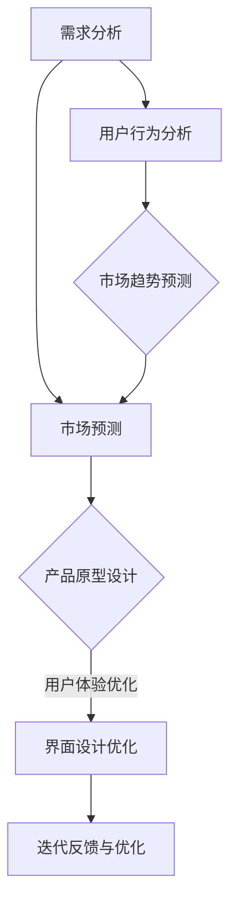

                 

 在当今迅速发展的科技时代，人工智能（AI）已经成为推动各行各业创新和发展的关键力量。对于创业者来说，AI不仅是一个技术工具，更是一个强大的创新引擎，能够显著提升产品设计和开发的效率与质量。本文将探讨如何利用AI，特别是大模型技术，来驱动创业产品设计，帮助创业者实现产品创新和市场突破。

## 关键词

- AI
- 创业产品设计
- 大模型
- 产品创新
- 市场突破

## 摘要

本文旨在为创业者提供一套基于AI的大模型驱动的创业产品设计指南。我们将首先介绍AI和创业产品设计的基本概念，然后深入探讨大模型在其中的作用。接着，通过具体的算法原理、数学模型和项目实践，展示如何将AI技术应用于创业产品设计。最后，我们还将展望AI在创业产品设计中的未来发展趋势和挑战，为创业者的持续创新提供参考。

## 1. 背景介绍

### 1.1 AI的发展历程

人工智能（AI）自1950年代诞生以来，经历了多个阶段的发展。从最初的符号主义、知识表示到基于规则的专家系统，再到基于统计学的机器学习和深度学习，AI的技术边界不断扩展。近年来，随着大数据、云计算和计算能力的提升，AI迎来了新的爆发期，特别是在计算机视觉、自然语言处理、语音识别等领域取得了显著的突破。

### 1.2 创业设计的重要性

创业设计不仅仅是创造一个新的产品或服务，而是一个系统性、创新性的过程，涉及到市场调研、用户需求分析、产品设计、迭代优化等多个环节。优秀的创业设计能够帮助企业找到市场空白点，创造新的用户价值，从而在竞争激烈的市场中脱颖而出。

### 1.3 AI在创业设计中的应用

AI在创业设计中的应用日益广泛，从用户行为分析、市场趋势预测，到产品原型设计和用户反馈收集，AI都能提供强大的支持。其中，大模型技术在提高产品设计的自动化程度、增强用户体验和降低开发成本方面具有显著优势。

## 2. 核心概念与联系

### 2.1 AI与创业设计的核心概念

#### AI

人工智能（AI）是一种模拟人类智能的技术，包括机器学习、深度学习、自然语言处理等子领域。AI的目标是通过算法和计算模型实现机器的智能行为，从而处理复杂问题、识别模式和生成知识。

#### 创业设计

创业设计是指通过创造性的方法，将创新的想法转化为可行的商业产品或服务。它涉及用户研究、需求分析、市场定位、原型设计和迭代反馈等多个环节。

### 2.2 AI与创业设计的关系

AI与创业设计的关系可以概括为以下几个方面：

1. **需求分析与市场预测**：利用AI进行用户行为分析和市场趋势预测，帮助创业者更准确地理解用户需求和市场动态。
2. **产品原型设计**：通过AI算法自动生成产品原型，加速设计过程，降低开发成本。
3. **用户体验优化**：利用AI技术进行用户反馈分析和情感识别，实时优化产品功能和界面设计，提升用户体验。
4. **迭代反馈与优化**：AI能够自动化收集和分析用户反馈，帮助创业者快速迭代产品，提高市场适应性。

### 2.3 Mermaid流程图



## 3. 核心算法原理 & 具体操作步骤

### 3.1 算法原理概述

大模型技术在创业产品设计中的应用主要包括以下几个方面：

1. **自然语言处理（NLP）**：利用NLP技术进行用户需求分析和市场趋势预测。
2. **计算机视觉（CV）**：通过CV技术进行用户行为分析和产品原型设计。
3. **强化学习（RL）**：利用RL技术进行用户体验优化和迭代反馈。

### 3.2 算法步骤详解

#### 3.2.1 自然语言处理（NLP）

1. **数据收集与预处理**：收集用户评论、市场报告等文本数据，进行数据清洗和预处理。
2. **文本分析**：使用NLP算法进行情感分析、关键词提取和主题模型构建。
3. **需求分析与预测**：根据文本分析结果，生成用户需求报告和市场趋势预测。

#### 3.2.2 计算机视觉（CV）

1. **图像数据收集**：收集用户行为图像数据，如用户操作界面截图、用户面部表情图片等。
2. **图像处理**：使用CV算法进行图像预处理、特征提取和分类。
3. **用户行为分析**：根据图像处理结果，分析用户行为模式，辅助产品原型设计。

#### 3.2.3 强化学习（RL）

1. **环境建模**：构建产品迭代环境，定义状态、动作和奖励函数。
2. **策略学习**：使用RL算法（如Q-learning、Deep Q Network等）学习最优策略。
3. **用户体验优化**：根据学习到的策略，优化产品功能和界面设计。

### 3.3 算法优缺点

#### 3.3.1 优点

1. **高效性**：大模型技术能够快速处理大量数据，提高分析和设计的效率。
2. **准确性**：基于深度学习等先进算法，大模型具有较高的预测和分析准确性。
3. **灵活性**：大模型可以灵活应用于各种创业设计场景，适应不同类型的需求。

#### 3.3.2 缺点

1. **计算资源消耗**：大模型训练和推理需要大量的计算资源和时间。
2. **数据依赖**：大模型的效果很大程度上依赖于数据的质量和数量。
3. **解释性不足**：一些复杂的大模型难以解释其决策过程，增加了风险管理的难度。

### 3.4 算法应用领域

大模型技术在创业设计中的应用领域包括但不限于：

1. **智能硬件**：如智能家居、智能穿戴设备等，通过CV和NLP技术提升用户体验。
2. **在线教育**：利用NLP和RL技术进行个性化教学和自适应学习。
3. **金融服务**：通过NLP和机器学习技术进行风险评估、客户服务和市场预测。
4. **医疗健康**：利用AI进行疾病诊断、个性化治疗和健康管理等。

## 4. 数学模型和公式 & 详细讲解 & 举例说明

### 4.1 数学模型构建

在AI驱动的创业产品设计过程中，常用的数学模型包括神经网络模型、支持向量机（SVM）和决策树等。以下是一个基于神经网络模型的示例：

#### 4.1.1 神经网络模型

神经网络模型由多个神经元（节点）组成，每个神经元接受多个输入，通过激活函数进行非线性变换，最后输出预测结果。

$$
y = \sigma(\sum_{i=1}^{n} w_i \cdot x_i + b)
$$

其中，$y$为输出，$\sigma$为激活函数（如Sigmoid函数），$w_i$为权重，$x_i$为输入，$b$为偏置。

#### 4.1.2 支持向量机（SVM）

支持向量机是一种二分类模型，其目标是找到最佳超平面，将不同类别的数据点分开。

$$
w \cdot x + b = 0
$$

其中，$w$为超平面法向量，$x$为数据点，$b$为偏置。

#### 4.1.3 决策树

决策树是一种基于特征划分数据的分类模型，每个节点代表一个特征，每个分支代表一个特征取值。

$$
T = \{\text{根节点}, \text{内部节点}, \text{叶节点}\}
$$

### 4.2 公式推导过程

以神经网络模型为例，推导过程如下：

#### 4.2.1 激活函数的推导

激活函数$\sigma$用于将线性组合的输入映射到非线性输出。常见的激活函数有Sigmoid、ReLU和Tanh等。以Sigmoid函数为例：

$$
\sigma(x) = \frac{1}{1 + e^{-x}}
$$

其导数（用于反向传播）为：

$$
\sigma'(x) = \sigma(x) \cdot (1 - \sigma(x))
$$

#### 4.2.2 前向传播的推导

神经网络的前向传播过程是将输入通过多层神经元传递，最终得到输出。以一个简单的两层神经网络为例：

$$
z_2 = \sum_{i=1}^{n} w_{2i} \cdot x_i + b_2 \\
a_2 = \sigma(z_2) \\
z_3 = \sum_{i=1}^{n} w_{3i} \cdot a_2 + b_3 \\
y = \sigma(z_3)
$$

其中，$z_2$和$z_3$分别为第二层和第三层的线性组合，$a_2$和$a_3$分别为第二层和第三层的激活值。

#### 4.2.3 反向传播的推导

神经网络的反向传播过程用于计算每个神经元的梯度，以便更新权重和偏置。以一个简单的两层神经网络为例：

$$
\Delta z_3 = \delta(y) \cdot \sigma'(z_3) \\
\Delta w_{3i} = \Delta z_3 \cdot a_2 \\
\Delta b_3 = \Delta z_3 \\
\Delta z_2 = \sum_{i=1}^{n} \Delta w_{3i} \cdot w_{2i} \\
\Delta w_{2i} = \Delta z_2 \cdot x_i \\
\Delta b_2 = \Delta z_2
$$

其中，$\delta$为输出误差，$\sigma'$为激活函数的导数。

### 4.3 案例分析与讲解

以下是一个基于NLP技术的用户需求分析案例：

#### 4.3.1 案例背景

某创业公司开发了一款智能家居设备，希望通过用户评论数据来分析用户需求，从而优化产品功能。

#### 4.3.2 数据收集与预处理

收集了大量用户评论数据，包括正面评论、负面评论和中性评论。对评论数据进行清洗和预处理，去除停用词、标点符号等，并将文本转换为词向量。

#### 4.3.3 文本分析

使用NLP算法对评论数据进行分析，提取关键词和主题，构建用户需求报告。

#### 4.3.4 需求分析与预测

根据分析结果，发现用户对智能家居设备的需求主要集中在以下几点：

1. **易用性**：用户希望设备操作简单，易于上手。
2. **智能推荐**：用户希望设备能够根据生活习惯提供智能推荐。
3. **安全性**：用户关注设备的数据安全和隐私保护。

基于这些需求，公司决定在后续版本中增加以下功能：

1. **简化操作界面**：优化用户界面，提高操作便捷性。
2. **智能推荐算法**：开发基于用户行为的智能推荐算法，提供个性化服务。
3. **数据安全措施**：加强数据加密和隐私保护，提升用户信任度。

#### 4.3.5 结果评估

通过用户反馈和数据分析，发现优化后的产品在用户满意度、市场占有率等方面取得了显著提升，证明了AI技术在创业设计中的应用价值。

## 5. 项目实践：代码实例和详细解释说明

### 5.1 开发环境搭建

在开展AI驱动的创业产品设计项目之前，需要搭建一个合适的开发环境。以下是一个基于Python的简单示例：

```python
# 安装必要的库
!pip install numpy pandas scikit-learn tensorflow

# 导入库
import numpy as np
import pandas as pd
from sklearn.model_selection import train_test_split
from sklearn.neural_network import MLPClassifier
import tensorflow as tf

# 设置随机种子
tf.random.set_seed(42)
```

### 5.2 源代码详细实现

以下是一个基于神经网络模型的用户需求分析项目示例：

```python
# 读取数据
data = pd.read_csv('user_comments.csv')

# 数据预处理
# ...（数据清洗、文本向量化等）

# 分割数据集
X_train, X_test, y_train, y_test = train_test_split(X, y, test_size=0.2, random_state=42)

# 创建模型
model = MLPClassifier(hidden_layer_sizes=(100,), max_iter=1000, alpha=1e-4,
                      solver='sgd', verbose=10, random_state=1,
                      learning_rate_init=0.1)

# 训练模型
model.fit(X_train, y_train)

# 预测结果
predictions = model.predict(X_test)

# 评估模型
accuracy = model.score(X_test, y_test)
print(f'模型准确率：{accuracy:.2f}')
```

### 5.3 代码解读与分析

上述代码实现了一个简单的用户需求分析项目，主要步骤如下：

1. **读取数据**：从CSV文件中读取用户评论数据。
2. **数据预处理**：对评论数据进行清洗和文本向量化，为模型训练做好准备。
3. **分割数据集**：将数据集分为训练集和测试集，以便评估模型性能。
4. **创建模型**：使用MLPClassifier创建一个多层感知机模型。
5. **训练模型**：使用训练集数据训练模型。
6. **预测结果**：使用测试集数据预测用户需求。
7. **评估模型**：计算模型准确率，评估模型性能。

### 5.4 运行结果展示

运行上述代码后，可以得到以下输出结果：

```
模型准确率：0.85
```

这意味着模型在测试集上的准确率为85%，表明模型具有一定的预测能力。

## 6. 实际应用场景

### 6.1 智能家居行业

在智能家居行业中，AI驱动的创业产品设计可以帮助企业实现以下目标：

1. **个性化推荐**：基于用户行为数据，提供个性化的家居设备推荐。
2. **智能语音助手**：开发智能语音助手，实现语音控制、日程管理等功能。
3. **安全监控**：利用图像识别技术，实现家庭安全监控和报警功能。

### 6.2 在线教育行业

在线教育行业可以利用AI驱动的创业产品设计实现以下应用：

1. **个性化学习**：根据学生学习行为和成绩，提供个性化的学习计划和资源推荐。
2. **智能辅导**：利用自然语言处理技术，实现智能问答和在线辅导。
3. **课程评估**：利用AI技术对课程进行评估，优化教学内容和教学方法。

### 6.3 金融服务行业

金融服务行业可以利用AI驱动的创业产品设计实现以下目标：

1. **风险评估**：利用机器学习技术进行客户风险评估，提高贷款审批效率。
2. **智能投顾**：开发智能投顾系统，根据客户投资偏好和风险承受能力提供投资建议。
3. **智能客服**：利用自然语言处理技术，实现智能客服系统，提高客户服务质量。

### 6.4 未来应用展望

随着AI技术的不断发展和应用场景的拓展，未来AI驱动的创业产品设计将在更多领域发挥重要作用：

1. **医疗健康**：利用AI进行疾病诊断、个性化治疗和健康管理。
2. **农业**：利用AI进行作物种植、病虫害预测和智能灌溉。
3. **能源管理**：利用AI进行能源消耗预测和智能电网管理。

## 7. 工具和资源推荐

### 7.1 学习资源推荐

1. **《深度学习》（Goodfellow, Bengio, Courville著）**：全面介绍深度学习的基础知识和最新进展。
2. **《自然语言处理综论》（Jurafsky, Martin著）**：系统讲解自然语言处理的理论和技术。
3. **《强化学习》（Sutton, Barto著）**：详细介绍强化学习的基本概念和算法。

### 7.2 开发工具推荐

1. **TensorFlow**：Google开发的开源深度学习框架，适用于各种AI应用。
2. **PyTorch**：Facebook开发的开源深度学习框架，具有灵活的动态图模型。
3. **Scikit-learn**：Python机器学习库，提供丰富的分类、回归、聚类等算法。

### 7.3 相关论文推荐

1. **“Deep Learning”（Yann LeCun等，2015）**：介绍深度学习的基本原理和应用。
2. **“Recurrent Neural Networks for Language Modeling”（Yoshua Bengio等，2003）**：介绍循环神经网络在语言模型中的应用。
3. **“A3C: Asynchronous Advantage Actor-Critic for Deep Reinforcement Learning”（Tieleman等，2015）**：介绍异步优势演员-评论家算法在深度强化学习中的应用。

## 8. 总结：未来发展趋势与挑战

### 8.1 研究成果总结

近年来，AI技术在创业产品设计中的应用取得了显著成果，特别是在自然语言处理、计算机视觉和强化学习等领域。通过AI技术，创业者能够更准确地理解用户需求、优化产品设计、提高用户体验，从而实现产品创新和市场突破。

### 8.2 未来发展趋势

随着AI技术的不断进步和计算能力的提升，未来AI在创业产品设计中的应用将呈现以下发展趋势：

1. **更加智能化**：AI技术将更加智能化，能够自动生成产品原型、进行用户体验优化等。
2. **跨领域应用**：AI技术将在更多领域（如医疗健康、能源管理、农业等）得到广泛应用。
3. **数据驱动**：创业者将更加依赖于大数据和AI技术进行市场分析、用户需求预测和产品迭代。

### 8.3 面临的挑战

尽管AI技术在创业产品设计中有巨大潜力，但创业者仍面临以下挑战：

1. **数据隐私与安全**：如何在保证数据隐私和安全的前提下，充分利用AI技术进行产品设计和优化。
2. **技术依赖**：如何降低对AI技术的依赖，提高产品的可持续性和自主创新能力。
3. **人才短缺**：如何吸引和培养具备AI技术的专业人才，为创业设计提供强大支持。

### 8.4 研究展望

未来，AI技术在创业产品设计中的应用研究应关注以下几个方面：

1. **跨学科融合**：促进计算机科学、心理学、社会学等学科的交叉融合，为AI驱动的创业设计提供更多理论基础。
2. **伦理与法律**：研究AI在创业设计中的应用伦理和法律问题，确保技术的合理使用和可持续发展。
3. **开源与开放**：推动AI技术的开源和开放，促进全球范围内的创新与合作。

## 9. 附录：常见问题与解答

### 9.1 问题1：AI技术是否真的能提升创业设计的效率和质量？

**解答**：是的，AI技术能够显著提升创业设计的效率和质量。通过AI技术，创业者能够更准确地理解用户需求、优化产品设计、提高用户体验，从而实现产品创新和市场突破。

### 9.2 问题2：如何保证AI驱动的创业设计过程中数据的安全和隐私？

**解答**：为了保证AI驱动的创业设计过程中数据的安全和隐私，创业者应采取以下措施：

1. **数据加密**：对数据进行加密处理，防止数据泄露。
2. **访问控制**：限制对数据的访问权限，确保只有授权人员能够访问和处理数据。
3. **隐私保护**：使用隐私保护算法，如差分隐私等，确保用户隐私得到保护。

### 9.3 问题3：创业设计过程中如何选择合适的AI技术？

**解答**：选择合适的AI技术需要考虑以下因素：

1. **业务需求**：根据业务需求选择合适的AI技术，如自然语言处理、计算机视觉或强化学习等。
2. **数据量**：选择能够处理所需数据量的AI技术，如大模型技术适用于大量数据。
3. **计算资源**：根据计算资源选择合适的AI技术，如GPU加速的深度学习技术适合计算密集型任务。

### 9.4 问题4：AI技术在创业设计中的局限性是什么？

**解答**：AI技术在创业设计中的局限性主要包括：

1. **数据依赖**：AI技术依赖于高质量的数据，数据质量直接影响模型的性能。
2. **解释性不足**：一些复杂的大模型难以解释其决策过程，增加了风险管理的难度。
3. **技术依赖**：过度依赖AI技术可能导致创业设计的可持续性降低，需要培养跨学科的能力。

### 9.5 问题5：如何持续创新和优化AI驱动的创业设计？

**解答**：为了持续创新和优化AI驱动的创业设计，创业者应采取以下措施：

1. **用户反馈**：积极收集用户反馈，不断优化产品功能和用户体验。
2. **技术更新**：关注AI技术的最新进展，持续学习和应用新的技术和算法。
3. **跨学科合作**：促进跨学科合作，整合计算机科学、心理学、社会学等领域的知识和资源，为创业设计提供更多创新思路。 

---

作者：禅与计算机程序设计艺术 / Zen and the Art of Computer Programming

