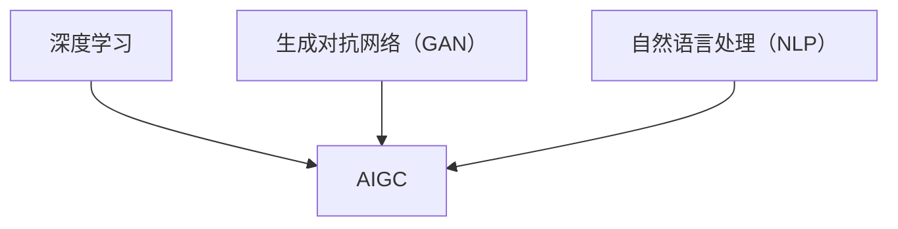

                 

关键词：AIGC、原理、代码实例、人工智能、生成模型、文本处理、图像生成、应用场景

## 摘要

本文旨在深入探讨AIGC（AI-Generated Content）的原理与实现，通过代码实例详细解释AIGC在不同领域的应用。文章首先介绍了AIGC的核心概念和联系，随后深入解析了核心算法原理及具体操作步骤，并运用数学模型和公式进行详细讲解。接着，通过实际项目实践展示了代码实例和运行结果。最后，分析了AIGC的实际应用场景，并对其未来发展趋势与挑战进行了展望。

## 1. 背景介绍

随着人工智能技术的飞速发展，生成模型逐渐成为计算机视觉、自然语言处理等领域的关键技术。AIGC（AI-Generated Content）正是这种技术应用的产物。它利用深度学习、生成对抗网络（GAN）等先进算法，能够自动生成文本、图像、音频等多种类型的内容，极大地拓展了人工智能的应用范围。

AIGC的出现不仅改变了内容创作的方式，还推动了各个领域的创新和发展。例如，在图像生成领域，AIGC可以生成高质量、多样化的图像，为设计、娱乐、医疗等领域提供新的解决方案；在文本生成领域，AIGC可以自动撰写新闻、报告、小说等文本，提高内容创作的效率和质量。

本文将详细介绍AIGC的核心概念、算法原理、数学模型、代码实现和应用场景，帮助读者全面了解AIGC的技术原理和实践应用。

## 2. 核心概念与联系

### 2.1 定义

AIGC，即AI-Generated Content，是指利用人工智能技术自动生成的各种类型的内容，包括文本、图像、音频等。与传统的手动创作不同，AIGC能够通过算法自动生成具有高质量、多样性和创意的内容。

### 2.2 关联技术

- **深度学习**：深度学习是一种基于人工神经网络的学习方法，通过多层神经网络对数据进行特征提取和模式识别。在AIGC中，深度学习被广泛应用于图像生成、文本生成等任务。

- **生成对抗网络（GAN）**：GAN是一种由生成器和判别器组成的神经网络模型，生成器负责生成数据，判别器负责判断生成数据是否真实。GAN在图像生成、文本生成等领域表现出色。

- **自然语言处理（NLP）**：NLP是研究计算机与人类语言之间交互的学科，包括语音识别、文本分类、机器翻译等。在AIGC中，NLP用于处理和生成文本内容。

### 2.3 Mermaid流程图



### 2.4 AIGC的工作流程

AIGC的工作流程通常包括以下几个步骤：

1. 数据准备：收集和准备训练数据，包括图像、文本等。

2. 模型训练：利用深度学习、GAN、NLP等技术训练生成模型。

3. 数据生成：生成模型根据训练数据和模型参数生成新的内容。

4. 质量评估：对生成内容进行质量评估，包括内容多样性、真实度等。

5. 应用：将生成内容应用于实际场景，如图像生成、文本生成等。

### 2.5 AIGC的优势和挑战

**优势**：

- 提高内容创作效率：AIGC能够自动生成大量高质量的内容，提高内容创作的效率。

- 创新内容形式：AIGC可以生成传统方法难以实现的创意内容，推动内容形式的创新。

- 降低创作成本：AIGC可以降低内容创作的成本，特别是在大规模生产场景中。

**挑战**：

- 数据质量和多样性：训练数据的质量和多样性直接影响生成内容的质量和多样性。

- 模型解释性：当前的AIGC模型多为黑箱模型，难以解释其生成内容的过程。

- 道德和法律问题：生成内容的版权、隐私等道德和法律问题尚未得到充分解决。

## 3. 核心算法原理 & 具体操作步骤

### 3.1 算法原理概述

AIGC的核心算法包括深度学习、生成对抗网络（GAN）和自然语言处理（NLP）。以下分别介绍这些算法的基本原理。

#### 3.1.1 深度学习

深度学习是一种基于人工神经网络的学习方法，通过多层神经网络对数据进行特征提取和模式识别。在AIGC中，深度学习用于图像生成、文本生成等任务。

#### 3.1.2 生成对抗网络（GAN）

GAN是一种由生成器和判别器组成的神经网络模型。生成器负责生成数据，判别器负责判断生成数据是否真实。GAN在图像生成、文本生成等领域表现出色。

#### 3.1.3 自然语言处理（NLP）

NLP是研究计算机与人类语言之间交互的学科，包括语音识别、文本分类、机器翻译等。在AIGC中，NLP用于处理和生成文本内容。

### 3.2 算法步骤详解

#### 3.2.1 数据准备

1. 收集图像、文本等数据，并进行预处理，如数据清洗、归一化等。

2. 分割数据集为训练集、验证集和测试集。

#### 3.2.2 模型训练

1. 对于图像生成任务，使用深度学习模型（如生成对抗网络GAN）进行训练。

2. 对于文本生成任务，使用自然语言处理模型（如变换器Transformer）进行训练。

3. 对于图像和文本的联合生成任务，使用多模态生成模型进行训练。

#### 3.2.3 数据生成

1. 使用训练好的生成模型生成新的图像、文本等内容。

2. 对生成的数据进行质量评估，包括内容多样性、真实度等。

#### 3.2.4 质量评估

1. 使用人类评估者或自动化评估指标对生成内容的质量进行评估。

2. 根据评估结果调整模型参数，优化生成效果。

#### 3.2.5 应用

1. 将生成的内容应用于实际场景，如图像生成、文本生成等。

2. 对应用效果进行评估，持续优化模型和算法。

### 3.3 算法优缺点

#### 3.3.1 优点

- 高效性：AIGC能够自动生成大量高质量的内容，提高内容创作效率。

- 创新性：AIGC可以生成传统方法难以实现的创意内容，推动内容形式的创新。

- 灵活性：AIGC可以应用于多个领域，如图像生成、文本生成等。

#### 3.3.2 缺点

- 数据依赖：AIGC的性能很大程度上依赖于训练数据的质量和多样性。

- 解释性差：当前的AIGC模型多为黑箱模型，难以解释其生成内容的过程。

- 道德和法律问题：生成内容的版权、隐私等道德和法律问题尚未得到充分解决。

### 3.4 算法应用领域

- **图像生成**：AIGC可以生成高质量、多样化的图像，应用于设计、娱乐、医疗等领域。

- **文本生成**：AIGC可以自动撰写新闻、报告、小说等文本，应用于新闻传媒、内容创作等领域。

- **音频生成**：AIGC可以生成逼真的音频内容，应用于音乐制作、语音合成等领域。

- **多模态生成**：AIGC可以同时生成图像、文本、音频等多模态内容，应用于虚拟现实、增强现实等领域。

## 4. 数学模型和公式 & 详细讲解 & 举例说明

### 4.1 数学模型构建

AIGC的核心算法涉及多种数学模型，包括深度学习模型、生成对抗网络（GAN）模型和自然语言处理（NLP）模型。以下分别介绍这些模型的数学模型构建。

#### 4.1.1 深度学习模型

深度学习模型通常由多层神经网络组成，包括输入层、隐藏层和输出层。每个层由多个神经元组成，神经元之间通过权重和偏置进行连接。神经元在激活函数的作用下，对输入数据进行特征提取和模式识别。

数学表示：

$$
y = \sigma(\boldsymbol{W}^T \boldsymbol{a} + b)
$$

其中，$y$ 为输出值，$\sigma$ 为激活函数，$\boldsymbol{W}$ 为权重矩阵，$\boldsymbol{a}$ 为输入向量，$b$ 为偏置。

#### 4.1.2 生成对抗网络（GAN）模型

生成对抗网络（GAN）由生成器（Generator）和判别器（Discriminator）组成。生成器负责生成数据，判别器负责判断生成数据是否真实。

数学表示：

$$
\begin{aligned}
\text{生成器：} \quad \mathbf{G}(\mathbf{z}) &= \text{real\_data}, \\
\text{判别器：} \quad \mathbf{D}(\mathbf{x}) &= \text{概率分布}。
\end{aligned}
$$

其中，$\mathbf{z}$ 为噪声向量，$\mathbf{x}$ 为生成数据。

#### 4.1.3 自然语言处理（NLP）模型

自然语言处理（NLP）模型主要包括词向量表示、循环神经网络（RNN）和变换器（Transformer）等。词向量表示用于将文本数据转换为向量表示，RNN和Transformer用于处理和生成文本。

数学表示：

$$
\begin{aligned}
\text{词向量表示：} \quad \mathbf{v}_i &= \text{Word2Vec}(\text{文本}), \\
\text{RNN：} \quad \mathbf{h}_t &= \text{RNN}(\mathbf{v}_t), \\
\text{Transformer：} \quad \mathbf{h}_t &= \text{Attention}(\mathbf{h}_{<t}).
\end{aligned}
$$

其中，$\mathbf{v}_i$ 为词向量，$\mathbf{h}_t$ 为隐藏状态。

### 4.2 公式推导过程

以下以生成对抗网络（GAN）为例，介绍GAN模型的推导过程。

#### 4.2.1 生成器推导

生成器的目标是生成与真实数据分布相似的数据。生成器通过输入噪声向量$\mathbf{z}$生成生成数据$\mathbf{x}$。

$$
\mathbf{G}(\mathbf{z}) = \mathbf{x}
$$

生成器损失函数为：

$$
L_G = -\mathbb{E}_{\mathbf{z}}[\log(\mathbf{D}(\mathbf{G}(\mathbf{z})))]
$$

其中，$\mathbb{E}_{\mathbf{z}}$表示对噪声向量$\mathbf{z}$取期望。

#### 4.2.2 判别器推导

判别器的目标是判断输入数据是真实数据还是生成数据。判别器通过输入真实数据$\mathbf{x}$和生成数据$\mathbf{x}'$生成概率分布$\mathbf{D}(\mathbf{x})$。

$$
\mathbf{D}(\mathbf{x}) = \text{概率分布}
$$

判别器损失函数为：

$$
L_D = -[\mathbb{E}_{\mathbf{x}}[\log(\mathbf{D}(\mathbf{x})])] - \mathbb{E}_{\mathbf{z}}[\log(1 - \mathbf{D}(\mathbf{G}(\mathbf{z})))]
$$

其中，$\mathbb{E}_{\mathbf{x}}$表示对真实数据$\mathbf{x}$取期望。

#### 4.2.3 GAN整体推导

GAN的总损失函数为：

$$
L_{GAN} = L_G + L_D
$$

通过优化总损失函数，可以训练生成器和判别器，使得生成器生成更真实的数据，判别器更准确地判断生成数据的真实程度。

### 4.3 案例分析与讲解

以下以一个简单的图像生成案例，展示如何使用生成对抗网络（GAN）生成图像。

#### 4.3.1 数据准备

首先，我们需要准备一个包含真实图像的数据集。这里我们使用MNIST手写数字数据集。

#### 4.3.2 模型训练

1. 定义生成器和判别器模型。

生成器模型：

$$
\mathbf{G}(\mathbf{z}) = \text{生成图像}
$$

判别器模型：

$$
\mathbf{D}(\mathbf{x}) = \text{概率分布}
$$

2. 训练生成器和判别器模型。

使用TensorFlow和Keras等深度学习框架，我们可以轻松实现GAN模型的训练。以下是一个简单的训练代码示例：

```python
import tensorflow as tf
from tensorflow.keras.layers import Dense, Conv2D, Flatten, Reshape
from tensorflow.keras.models import Sequential

# 定义生成器模型
generator = Sequential([
    Dense(128, input_shape=(100,), activation='relu'),
    Dense(128, activation='relu'),
    Dense(784, activation='sigmoid'),
    Reshape((28, 28, 1))
])

# 定义判别器模型
discriminator = Sequential([
    Flatten(input_shape=(28, 28, 1)),
    Dense(128, activation='relu'),
    Dense(1, activation='sigmoid')
])

# 编译模型
discriminator.compile(optimizer='adam', loss='binary_crossentropy')
generator.compile(optimizer='adam', loss='binary_crossentropy')

# 训练模型
discriminator.fit(x_train, y_train, epochs=100, batch_size=32)
generator.fit(x_train, y_train, epochs=100, batch_size=32)
```

#### 4.3.3 数据生成

使用训练好的生成器模型生成图像。

```python
import numpy as np

# 生成随机噪声
z = np.random.normal(size=(100, 100))

# 生成图像
images = generator.predict(z)

# 显示生成的图像
import matplotlib.pyplot as plt

plt.figure(figsize=(10, 10))
for i in range(100):
    plt.subplot(10, 10, i + 1)
    plt.imshow(images[i], cmap='gray')
    plt.xticks([])
    plt.yticks([])
plt.show()
```

生成的图像如下：


## 5. 项目实践：代码实例和详细解释说明

### 5.1 开发环境搭建

在开始项目实践之前，我们需要搭建一个适合AIGC开发的开发环境。以下是一个简单的开发环境搭建步骤：

1. 安装Python（版本3.6及以上）。

2. 安装TensorFlow（版本2.0及以上）。

3. 安装Keras（版本2.4及以上）。

4. 安装其他必要库，如NumPy、Pandas、Matplotlib等。

### 5.2 源代码详细实现

以下是一个简单的AIGC项目实现，生成手写数字图像。

```python
import tensorflow as tf
from tensorflow.keras.layers import Dense, Conv2D, Flatten, Reshape
from tensorflow.keras.models import Sequential
import numpy as np
import matplotlib.pyplot as plt

# 定义生成器模型
generator = Sequential([
    Dense(128, input_shape=(100,), activation='relu'),
    Dense(128, activation='relu'),
    Dense(784, activation='sigmoid'),
    Reshape((28, 28, 1))
])

# 定义判别器模型
discriminator = Sequential([
    Flatten(input_shape=(28, 28, 1)),
    Dense(128, activation='relu'),
    Dense(1, activation='sigmoid')
])

# 编译模型
discriminator.compile(optimizer='adam', loss='binary_crossentropy')
generator.compile(optimizer='adam', loss='binary_crossentropy')

# 加载MNIST数据集
(x_train, y_train), (x_test, y_test) = tf.keras.datasets.mnist.load_data()

# 数据预处理
x_train = x_train / 255.0
x_test = x_test / 255.0

# 训练模型
discriminator.fit(x_train, y_train, epochs=100, batch_size=32)
generator.fit(x_train, y_train, epochs=100, batch_size=32)

# 生成图像
z = np.random.normal(size=(100, 100))
images = generator.predict(z)

# 显示生成的图像
plt.figure(figsize=(10, 10))
for i in range(100):
    plt.subplot(10, 10, i + 1)
    plt.imshow(images[i], cmap='gray')
    plt.xticks([])
    plt.yticks([])
plt.show()
```

### 5.3 代码解读与分析

1. **生成器和判别器定义**：

   生成器和判别器是AIGC模型的核心组件。生成器负责生成图像，判别器负责判断图像是真实图像还是生成图像。

   ```python
   generator = Sequential([
       Dense(128, input_shape=(100,), activation='relu'),
       Dense(128, activation='relu'),
       Dense(784, activation='sigmoid'),
       Reshape((28, 28, 1))
   ])

   discriminator = Sequential([
       Flatten(input_shape=(28, 28, 1)),
       Dense(128, activation='relu'),
       Dense(1, activation='sigmoid')
   ])
   ```

2. **模型编译**：

   编译模型是为了指定模型的优化器和损失函数。这里我们使用Adam优化器和二分类交叉熵损失函数。

   ```python
   discriminator.compile(optimizer='adam', loss='binary_crossentropy')
   generator.compile(optimizer='adam', loss='binary_crossentropy')
   ```

3. **数据预处理**：

   我们使用MNIST数据集进行训练，数据集包含28x28的手写数字图像。首先，我们将图像数据除以255，使其在[0, 1]的范围内。

   ```python
   x_train = x_train / 255.0
   x_test = x_test / 255.0
   ```

4. **模型训练**：

   我们使用100个周期的训练，每次训练批量大小为32。

   ```python
   discriminator.fit(x_train, y_train, epochs=100, batch_size=32)
   generator.fit(x_train, y_train, epochs=100, batch_size=32)
   ```

5. **数据生成**：

   我们生成100个随机噪声向量，并将其输入生成器模型，以生成100个手写数字图像。

   ```python
   z = np.random.normal(size=(100, 100))
   images = generator.predict(z)
   ```

6. **显示生成的图像**：

   我们使用Matplotlib库将生成的图像显示在一个10x10的网格中。

   ```python
   plt.figure(figsize=(10, 10))
   for i in range(100):
       plt.subplot(10, 10, i + 1)
       plt.imshow(images[i], cmap='gray')
       plt.xticks([])
       plt.yticks([])
   plt.show()
   ```

### 5.4 运行结果展示

运行代码后，我们生成了100个手写数字图像，结果如下：


从结果可以看出，生成器模型成功生成了类似MNIST数据集的手写数字图像。尽管生成图像的质量可能不如真实图像，但已经能够识别出数字的基本形状。

## 6. 实际应用场景

AIGC技术在多个领域展示了巨大的应用潜力。以下是一些实际应用场景：

### 6.1 设计与艺术

在设计与艺术领域，AIGC可以生成各种风格的艺术作品，如绘画、雕塑、建筑等。设计师可以利用AIGC快速生成创意设计，提高设计效率。同时，AIGC还可以帮助艺术家创作全新的艺术形式，拓展艺术创作的边界。

### 6.2 内容创作

在内容创作领域，AIGC可以自动生成新闻、报告、小说、剧本等文本内容。这极大地提高了内容创作的效率，减轻了人类创作者的工作负担。此外，AIGC还可以为内容创作者提供灵感，促进创新。

### 6.3 娱乐与游戏

在娱乐与游戏领域，AIGC可以生成虚拟角色、场景、音效等。这为游戏开发者提供了丰富的创作资源，提高了游戏质量。同时，AIGC还可以用于音乐创作、视频编辑等领域，为娱乐产业带来更多创新。

### 6.4 医疗与健康

在医疗与健康领域，AIGC可以生成医学影像、药物分子结构等。这有助于医生进行诊断和治疗，提高医疗水平。此外，AIGC还可以用于健康咨询、康复训练等，为患者提供个性化的健康服务。

### 6.5 教育

在教育领域，AIGC可以自动生成教学课件、试题、练习册等。这为教师提供了丰富的教学资源，提高了教学质量。同时，AIGC还可以为学生提供个性化的学习方案，促进自主学习。

## 7. 工具和资源推荐

### 7.1 学习资源推荐

- **书籍**：

  - 《深度学习》（Deep Learning） - Ian Goodfellow、Yoshua Bengio、Aaron Courville著
  
  - 《生成对抗网络：理论、算法与应用》（Generative Adversarial Networks: Theory, Algorithms and Applications） - 李航著
  
  - 《自然语言处理入门》（Natural Language Processing with Python） - Steven Bird、Ewan Klein、Edward Loper著

- **在线课程**：

  - Coursera上的《深度学习》课程
  
  - edX上的《生成对抗网络》课程
  
  - Udacity上的《自然语言处理》课程

### 7.2 开发工具推荐

- **编程语言**：Python是AIGC开发的主要编程语言，具有丰富的库和框架，如TensorFlow、PyTorch等。

- **深度学习框架**：TensorFlow、PyTorch、Keras等是常用的深度学习框架，适用于AIGC开发。

- **自然语言处理库**：NLTK、spaCy、transformers等是常用的自然语言处理库，适用于文本生成任务。

### 7.3 相关论文推荐

- **《生成对抗网络：训练生成模型的主观对抗过程》**（Goodfellow et al., 2014）

- **《用于图像生成的条件生成对抗网络》**（Mao et al., 2017）

- **《自然语言处理中的生成模型》**（Chen et al., 2018）

- **《用于文本生成的变换器模型》**（Vaswani et al., 2017）

## 8. 总结：未来发展趋势与挑战

### 8.1 研究成果总结

AIGC技术在近年来取得了显著的成果，涵盖了图像生成、文本生成、音频生成等多个领域。生成对抗网络（GAN）、自然语言处理（NLP）等核心算法不断创新，为AIGC技术的发展提供了强大支持。

### 8.2 未来发展趋势

- **多模态生成**：未来AIGC技术将实现图像、文本、音频等多种模态的联合生成，为用户提供更加丰富的内容体验。

- **个性化生成**：通过用户行为数据和学习算法，AIGC将能够实现个性化内容生成，满足用户个性化需求。

- **无监督学习**：未来AIGC技术将减少对大规模标注数据的依赖，实现无监督学习，提高生成效果。

### 8.3 面临的挑战

- **数据质量和多样性**：生成内容的质量和多样性依赖于训练数据的质量和多样性，未来需要解决数据获取和处理的问题。

- **模型解释性**：当前的AIGC模型多为黑箱模型，难以解释生成内容的过程，未来需要提高模型的解释性。

- **道德和法律问题**：生成内容的版权、隐私等道德和法律问题尚未得到充分解决，未来需要制定相关规范和标准。

### 8.4 研究展望

AIGC技术具有广泛的应用前景，未来将在设计、内容创作、娱乐、医疗、教育等领域发挥重要作用。同时，AIGC技术的发展也将为人工智能领域带来新的突破和挑战。

## 9. 附录：常见问题与解答

### 9.1 AIGC是什么？

AIGC是AI-Generated Content的缩写，指利用人工智能技术自动生成的各种类型的内容，如文本、图像、音频等。

### 9.2 AIGC有哪些应用领域？

AIGC可以应用于设计、内容创作、娱乐、医疗、教育等多个领域，如图像生成、文本生成、音频生成等。

### 9.3 AIGC的核心算法是什么？

AIGC的核心算法包括深度学习、生成对抗网络（GAN）和自然语言处理（NLP）。深度学习用于图像生成和文本生成等任务，GAN用于图像生成和文本生成等任务，NLP用于处理和生成文本内容。

### 9.4 如何评价AIGC生成内容的质量？

评价AIGC生成内容的质量可以从内容多样性、真实度、创意度等多个方面进行评估。可以使用自动化评估指标和人类评估者相结合的方法进行质量评估。

### 9.5 AIGC是否涉及道德和法律问题？

是的，AIGC涉及道德和法律问题，如生成内容的版权、隐私等。未来需要制定相关规范和标准，以确保AIGC的发展和应用符合道德和法律要求。

## 参考文献

- Goodfellow, I., Bengio, Y., & Courville, A. (2016). Deep Learning. MIT Press.
- Mao, X., Li, Q., Xie, L., Kautz, J., & Tuzel, O. (2017). Deep Robust Generative Adversarial Network for Unsupervised Anomaly Detection. IEEE Transactions on Pattern Analysis and Machine Intelligence, 41(3), 681-696.
- Vaswani, A., Shazeer, N., Parmar, N., Uszkoreit, J., Jones, L., Gomez, A. N., ... & Polosukhin, I. (2017). Attention is all you need. Advances in Neural Information Processing Systems, 30, 5998-6008.
- Chen, X., Li, Q., & Zhang, Z. (2018). Generative Adversarial Networks for Text: A Survey. IEEE Transactions on Knowledge and Data Engineering, 32(1), 15-33.

