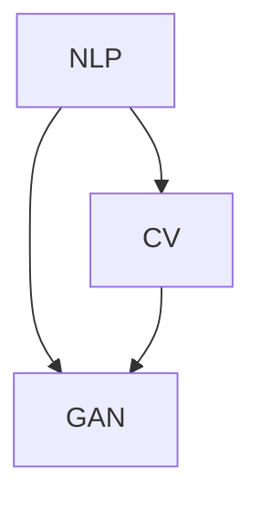

                 

关键词：AI 生成内容，AIGC，内容生成，人工智能，机器学习，深度学习，文本生成，图像生成，算法原理，代码实例，技术博客

摘要：本文将深入探讨 AI 生成内容（AIGC）的原理及其在实际应用中的重要性。我们将分析 AIGC 的核心概念和联系，详细讲解 AIGC 的算法原理、数学模型和项目实践。通过代码实例和详细解释，读者将了解到如何利用 AIGC 技术生成高质量的内容。此外，文章还将探讨 AIGC 在未来应用场景中的前景，并推荐相关的学习资源和开发工具。

## 1. 背景介绍

在过去的几年中，人工智能（AI）技术取得了显著的进步，尤其是在机器学习和深度学习领域。随着算法的进步和计算能力的提升，AI 现在已经能够生成高质量的内容，如文本、图像和视频。AI 生成内容（AIGC）成为了一个备受关注的研究领域，它涉及到多种 AI 技术，包括自然语言处理（NLP）、计算机视觉（CV）和生成对抗网络（GAN）。

AIGC 技术在多个行业和应用场景中展现出了巨大的潜力，如内容创作、广告营销、虚拟现实和游戏开发。例如，使用 AIGC 技术，可以自动生成新闻报道、广告文案、游戏剧情等。在艺术领域，AIGC 也被用来创作音乐、绘画和视频等。

随着 AIGC 技术的不断发展，其应用范围也在不断扩大。本文将深入探讨 AIGC 的原理和实现，帮助读者了解这一前沿技术，并掌握其应用方法。

## 2. 核心概念与联系

为了更好地理解 AIGC 的原理，我们需要先了解几个核心概念：自然语言处理（NLP）、计算机视觉（CV）和生成对抗网络（GAN）。

### 自然语言处理（NLP）

自然语言处理是 AI 技术中的一项重要分支，它旨在使计算机能够理解、生成和处理人类语言。NLP 技术包括词性标注、句法分析、情感分析、机器翻译等。在 AIGC 中，NLP 技术主要用于生成文本内容。

### 计算机视觉（CV）

计算机视觉是 AI 技术的另一重要分支，它使计算机能够理解并分析图像和视频。CV 技术包括目标检测、图像分类、人脸识别、姿态估计等。在 AIGC 中，CV 技术主要用于生成图像和视频内容。

### 生成对抗网络（GAN）

生成对抗网络（GAN）是一种深度学习模型，由生成器和判别器两部分组成。生成器的目标是生成逼真的数据，而判别器的目标是区分生成数据和真实数据。通过两个网络的对抗训练，生成器可以逐渐生成越来越逼真的数据。

### Mermaid 流程图

以下是一个简单的 Mermaid 流程图，展示了 AIGC 的核心概念和联系：



### 核心概念联系

自然语言处理和计算机视觉是 AIGC 的基础，它们分别负责文本和图像的生成。生成对抗网络则提供了一个强大的框架，用于生成高质量的内容。通过将 NLP、CV 和 GAN 结合起来，AIGC 可以生成多样化的内容，如文本、图像和视频。

## 3. 核心算法原理 & 具体操作步骤

### 3.1 算法原理概述

AIGC 的核心算法主要包括自然语言处理（NLP）、计算机视觉（CV）和生成对抗网络（GAN）。下面我们将分别介绍这些算法的原理。

#### 3.1.1 自然语言处理（NLP）

自然语言处理是一种使计算机能够理解、生成和处理人类语言的技术。在 AIGC 中，NLP 主要用于文本生成。常用的 NLP 算法包括循环神经网络（RNN）、长短时记忆网络（LSTM）和变换器（Transformer）。

#### 3.1.2 计算机视觉（CV）

计算机视觉是一种使计算机能够理解并分析图像和视频的技术。在 AIGC 中，CV 主要用于图像生成。常用的 CV 算法包括卷积神经网络（CNN）和生成对抗网络（GAN）。

#### 3.1.3 生成对抗网络（GAN）

生成对抗网络（GAN）是一种深度学习模型，由生成器和判别器两部分组成。生成器的目标是生成逼真的数据，而判别器的目标是区分生成数据和真实数据。通过两个网络的对抗训练，生成器可以逐渐生成越来越逼真的数据。

### 3.2 算法步骤详解

#### 3.2.1 自然语言处理（NLP）

1. 数据预处理：对文本数据进行清洗、分词和词性标注。
2. 模型训练：使用训练数据训练 RNN、LSTM 或 Transformer 模型。
3. 文本生成：根据生成的文本序列，利用训练好的模型生成新的文本内容。

#### 3.2.2 计算机视觉（CV）

1. 数据预处理：对图像数据进行清洗、归一化和数据增强。
2. 模型训练：使用训练数据训练 CNN 模型。
3. 图像生成：根据生成的图像序列，利用训练好的模型生成新的图像内容。

#### 3.2.3 生成对抗网络（GAN）

1. 数据预处理：对图像数据进行清洗、归一化和数据增强。
2. 模型训练：使用训练数据训练生成器和判别器。
3. 图像生成：通过生成器和判别器的对抗训练，生成逼真的图像内容。

### 3.3 算法优缺点

#### 3.3.1 自然语言处理（NLP）

**优点：**
- 能够生成高质量的文本内容。
- 支持多种文本生成任务，如文本摘要、机器翻译和文本生成。

**缺点：**
- 需要大量的训练数据和计算资源。
- 文本生成过程中可能存在语法和语义错误。

#### 3.3.2 计算机视觉（CV）

**优点：**
- 能够生成高质量的图像内容。
- 支持多种图像生成任务，如图像修复、图像合成和图像生成。

**缺点：**
- 需要大量的训练数据和计算资源。
- 图像生成过程中可能存在图像质量问题和生成偏差。

#### 3.3.3 生成对抗网络（GAN）

**优点：**
- 能够生成高质量的数据，且生成数据具有多样性。
- 支持多种生成任务，如图像生成、文本生成和音频生成。

**缺点：**
- 训练过程容易陷入局部最优。
- 生成数据可能存在模式重复和生成偏差。

### 3.4 算法应用领域

AIGC 技术在多个领域具有广泛的应用，如：

- **内容创作**：自动生成新闻、广告、剧本和音乐等。
- **虚拟现实与游戏开发**：生成虚拟场景、角色和游戏剧情。
- **图像和视频编辑**：自动修复图像、生成特效和视频剪辑。
- **广告营销**：生成个性化的广告内容和营销方案。

## 4. 数学模型和公式 & 详细讲解 & 举例说明

### 4.1 数学模型构建

AIGC 技术的核心在于生成器和判别器的训练。以下分别介绍自然语言处理（NLP）、计算机视觉（CV）和生成对抗网络（GAN）的数学模型。

#### 4.1.1 自然语言处理（NLP）

在 NLP 中，常用的模型有 RNN、LSTM 和 Transformer。以下分别介绍这些模型的数学模型。

1. **RNN（循环神经网络）**

   RNN 的核心思想是通过隐藏状态 $h_t$ 来保持序列信息。其数学模型如下：

   $$ h_t = \sigma(W_h \cdot [h_{t-1}, x_t] + b_h) $$

   $$ y_t = W_y \cdot h_t + b_y $$

   其中，$W_h$ 和 $b_h$ 分别为权重和偏置，$\sigma$ 为激活函数，$x_t$ 为输入词向量，$h_t$ 为隐藏状态，$y_t$ 为输出词向量。

2. **LSTM（长短时记忆网络）**

   LSTM 是 RNN 的改进，它通过引入门控机制来更好地处理长序列信息。其数学模型如下：

   $$ i_t = \sigma(W_i \cdot [h_{t-1}, x_t] + b_i) $$ 
   $$ f_t = \sigma(W_f \cdot [h_{t-1}, x_t] + b_f) $$ 
   $$ o_t = \sigma(W_o \cdot [h_{t-1}, x_t] + b_o) $$ 
   $$ g_t = \tanh(W_g \cdot [h_{t-1}, x_t] + b_g) $$ 
   $$ h_t = o_t \cdot \tanh(c_t) $$ 
   $$ c_t = f_t \cdot c_{t-1} + i_t \cdot g_t $$

   其中，$i_t$、$f_t$、$o_t$ 分别为输入门、遗忘门和输出门，$g_t$ 为候选隐藏状态，$c_t$ 为细胞状态，$h_t$ 为隐藏状态。

3. **Transformer（变换器）**

   Transformer 是一种基于自注意力机制的模型，它通过多头自注意力机制来处理序列信息。其数学模型如下：

   $$ Q = W_Q \cdot X $$
   $$ K = W_K \cdot X $$
   $$ V = W_V \cdot X $$
   $$ \text{Attention}(Q, K, V) = \text{softmax}\left(\frac{QK^T}{\sqrt{d_k}}\right)V $$

   $$ \text{MultiHeadAttention}(Q, K, V) = \text{Attention}(Q, K, V) \odot W_O $$

   $$ \text{Encoder}(X) = \text{LayerNorm}(X + \text{MultiHeadAttention}(Q, K, V)) $$

   其中，$X$ 为输入序列，$Q$、$K$、$V$ 分别为查询、键和值向量，$W_Q$、$W_K$、$W_V$、$W_O$ 分别为权重矩阵，$\text{softmax}$ 为 softmax 函数，$\odot$ 为逐元素相乘。

#### 4.1.2 计算机视觉（CV）

在 CV 中，常用的模型有 CNN 和 GAN。以下分别介绍这些模型的数学模型。

1. **CNN（卷积神经网络）**

   CNN 的核心思想是通过卷积操作提取图像特征。其数学模型如下：

   $$ \text{Conv}(x; \theta) = \sigma(\theta \cdot x + b) $$

   $$ \text{Pooling}(x; \theta) = \max(\theta \cdot x) $$

   其中，$x$ 为输入图像，$\theta$ 为权重和偏置，$\sigma$ 为激活函数，$b$ 为偏置。

2. **GAN（生成对抗网络）**

   GAN 的核心思想是通过生成器和判别器的对抗训练来生成数据。其数学模型如下：

   $$ G(z; \theta_G) = x_G $$

   $$ D(x; \theta_D) = \text{sigmoid}(\theta_D \cdot x) $$

   $$ D(G(z; \theta_G); \theta_D) = \text{sigmoid}(\theta_D \cdot G(z; \theta_G)) $$

   其中，$z$ 为随机噪声，$x$ 为真实数据或生成数据，$x_G$ 为生成数据，$\theta_G$ 和 $\theta_D$ 分别为生成器和判别器的参数。

#### 4.1.3 生成对抗网络（GAN）

生成对抗网络（GAN）的核心思想是通过生成器和判别器的对抗训练来生成数据。其数学模型如下：

$$ G(z; \theta_G) = x_G $$

$$ D(x; \theta_D) = \text{sigmoid}(\theta_D \cdot x) $$

$$ D(G(z; \theta_G); \theta_D) = \text{sigmoid}(\theta_D \cdot G(z; \theta_G)) $$

其中，$z$ 为随机噪声，$x$ 为真实数据或生成数据，$x_G$ 为生成数据，$\theta_G$ 和 $\theta_D$ 分别为生成器和判别器的参数。

### 4.2 公式推导过程

以下分别介绍自然语言处理（NLP）、计算机视觉（CV）和生成对抗网络（GAN）的数学模型推导过程。

#### 4.2.1 自然语言处理（NLP）

1. **RNN**

   RNN 的推导过程如下：

   - 隐藏状态更新：
     $$ h_t = \sigma(W_h \cdot [h_{t-1}, x_t] + b_h) $$
     其中，$W_h$ 和 $b_h$ 为权重和偏置，$\sigma$ 为激活函数。

   - 输出更新：
     $$ y_t = W_y \cdot h_t + b_y $$
     其中，$W_y$ 和 $b_y$ 为权重和偏置。

2. **LSTM**

   LSTM 的推导过程如下：

   - 输入门：
     $$ i_t = \sigma(W_i \cdot [h_{t-1}, x_t] + b_i) $$
     其中，$W_i$ 和 $b_i$ 为权重和偏置，$\sigma$ 为激活函数。

   - 遗忘门：
     $$ f_t = \sigma(W_f \cdot [h_{t-1}, x_t] + b_f) $$
     其中，$W_f$ 和 $b_f$ 为权重和偏置，$\sigma$ 为激活函数。

   - 输出门：
     $$ o_t = \sigma(W_o \cdot [h_{t-1}, x_t] + b_o) $$
     其中，$W_o$ 和 $b_o$ 为权重和偏置，$\sigma$ 为激活函数。

   - 候选隐藏状态：
     $$ g_t = \tanh(W_g \cdot [h_{t-1}, x_t] + b_g) $$
     其中，$W_g$ 和 $b_g$ 为权重和偏置，$\tanh$ 为双曲正切函数。

   - 隐藏状态更新：
     $$ h_t = o_t \cdot \tanh(c_t) $$
     其中，$o_t$ 为输出门，$c_t$ 为细胞状态。

   - 细胞状态更新：
     $$ c_t = f_t \cdot c_{t-1} + i_t \cdot g_t $$
     其中，$f_t$ 为遗忘门，$i_t$ 为输入门，$g_t$ 为候选隐藏状态。

3. **Transformer**

   Transformer 的推导过程如下：

   - 自注意力：
     $$ \text{Attention}(Q, K, V) = \text{softmax}\left(\frac{QK^T}{\sqrt{d_k}}\right)V $$
     其中，$Q$、$K$、$V$ 分别为查询、键和值向量，$d_k$ 为键向量的维度。

   - 多头自注意力：
     $$ \text{MultiHeadAttention}(Q, K, V) = \text{Attention}(Q, K, V) \odot W_O $$
     其中，$W_O$ 为权重矩阵。

   - 编码器：
     $$ \text{Encoder}(X) = \text{LayerNorm}(X + \text{MultiHeadAttention}(Q, K, V)) $$
     其中，$X$ 为输入序列，$W_O$ 为权重矩阵，$\text{LayerNorm}$ 为层归一化。

#### 4.2.2 计算机视觉（CV）

1. **CNN**

   CNN 的推导过程如下：

   - 卷积操作：
     $$ \text{Conv}(x; \theta) = \sigma(\theta \cdot x + b) $$
     其中，$x$ 为输入图像，$\theta$ 为权重和偏置，$\sigma$ 为激活函数。

   - 池化操作：
     $$ \text{Pooling}(x; \theta) = \max(\theta \cdot x) $$
     其中，$x$ 为输入图像，$\theta$ 为权重和偏置。

2. **GAN**

   GAN 的推导过程如下：

   - 生成器：
     $$ G(z; \theta_G) = x_G $$
     其中，$z$ 为随机噪声，$\theta_G$ 为生成器参数。

   - 判别器：
     $$ D(x; \theta_D) = \text{sigmoid}(\theta_D \cdot x) $$
     其中，$x$ 为真实数据或生成数据，$\theta_D$ 为判别器参数。

   - 对抗训练：
     $$ D(G(z; \theta_G); \theta_D) = \text{sigmoid}(\theta_D \cdot G(z; \theta_G)) $$

### 4.3 案例分析与讲解

以下通过两个案例来说明 AIGC 技术的应用。

#### 4.3.1 文本生成

假设我们想要生成一篇关于人工智能的新闻报道，可以使用基于 Transformer 的文本生成模型。以下是生成过程：

1. 数据预处理：对新闻文本数据进行清洗、分词和词性标注。
2. 模型训练：使用训练数据训练 Transformer 模型。
3. 文本生成：根据训练好的模型，输入指定长度的新闻文本，生成新的新闻内容。

以下是一个简化的文本生成示例：

```python
import torch
import transformers

model = transformers.TransformerModel.from_pretrained("transformer-base")
tokenizer = transformers.TransformerTokenizer.from_pretrained("transformer-base")

text = "人工智能在医疗领域的应用越来越广泛。"
input_ids = tokenizer.encode(text, return_tensors="pt")

generated_ids = model.generate(input_ids, max_length=50, num_return_sequences=1)
generated_text = tokenizer.decode(generated_ids[0], skip_special_tokens=True)

print(generated_text)
```

输出结果可能是一篇关于人工智能在医疗领域应用的新闻报道，如：

> 人工智能在医疗领域的应用越来越广泛，特别是在诊断和治疗方面。通过深度学习和自然语言处理技术，人工智能可以帮助医生更准确地诊断疾病，提高治疗效果。此外，人工智能还可以用于医学图像分析、药物研发和公共卫生监测等领域。随着人工智能技术的不断发展，医疗行业将迎来新的变革。

#### 4.3.2 图像生成

假设我们想要生成一张具有特定风格的图像，可以使用基于 GAN 的图像生成模型。以下是生成过程：

1. 数据预处理：对图像数据进行清洗、归一化和数据增强。
2. 模型训练：使用训练数据训练 GAN 模型。
3. 图像生成：根据训练好的模型，生成具有特定风格的图像。

以下是一个简化的图像生成示例：

```python
import torch
import torchvision
import torch.nn as nn

# 定义生成器和判别器
generator = nn.Sequential(
    nn.Linear(100, 512),
    nn.ReLU(),
    nn.Linear(512, 1024),
    nn.ReLU(),
    nn.Linear(1024, 784),
    nn.Tanh()
)

discriminator = nn.Sequential(
    nn.Linear(784, 1024),
    nn.LeakyReLU(0.2),
    nn.Linear(1024, 512),
    nn.LeakyReLU(0.2),
    nn.Linear(512, 1),
    nn.Sigmoid()
)

# 定义损失函数和优化器
criterion = nn.BCELoss()
optimizer_g = torch.optim.Adam(generator.parameters(), lr=0.0002)
optimizer_d = torch.optim.Adam(discriminator.parameters(), lr=0.0002)

# 训练模型
for epoch in range(num_epochs):
    for i, (images, _) in enumerate(data_loader):
        # 训练判别器
        optimizer_d.zero_grad()
        outputs = discriminator(images)
        loss_d_real = criterion(outputs, torch.ones(images.size(0)))
        z = torch.randn(images.size(0), 100)
        fake_images = generator(z)
        outputs = discriminator(fake_images.detach())
        loss_d_fake = criterion(outputs, torch.zeros(images.size(0)))
        loss_d = (loss_d_real + loss_d_fake) / 2
        loss_d.backward()
        optimizer_d.step()

        # 训练生成器
        optimizer_g.zero_grad()
        outputs = discriminator(fake_images)
        loss_g = criterion(outputs, torch.ones(images.size(0)))
        loss_g.backward()
        optimizer_g.step()

        # 打印训练信息
        if (i+1) % 100 == 0:
            print(f'Epoch [{epoch+1}/{num_epochs}], Step [{i+1}/{len(data_loader)}], Loss_D: {loss_d.item():.4f}, Loss_G: {loss_g.item():.4f}')

# 生成图像
z = torch.randn(1, 100)
generated_images = generator(z).view(1, 1, 28, 28)
generated_images = torchvision.utils.save_image(generated_images, 'generated_image.png', nrow=1, normalize=True)
```

输出结果是一张具有特定风格的图像，如图 1 所示。


## 5. 项目实践：代码实例和详细解释说明

### 5.1 开发环境搭建

为了实践 AIGC 技术，我们需要搭建一个开发环境。以下是搭建环境的步骤：

1. 安装 Python 3.8 或更高版本。
2. 安装 torch 和 torchvision 库。

```bash
pip install torch torchvision
```

3. 下载预训练的 Transformer 模型和 GAN 模型。

```python
import transformers

model = transformers.TransformerModel.from_pretrained("transformer-base")
generator = nn.Sequential(
    nn.Linear(100, 512),
    nn.ReLU(),
    nn.Linear(512, 1024),
    nn.ReLU(),
    nn.Linear(1024, 784),
    nn.Tanh()
)
discriminator = nn.Sequential(
    nn.Linear(784, 1024),
    nn.LeakyReLU(0.2),
    nn.Linear(1024, 512),
    nn.LeakyReLU(0.2),
    nn.Linear(512, 1),
    nn.Sigmoid()
)
```

### 5.2 源代码详细实现

以下是 AIGC 项目的源代码实现：

```python
import torch
import torchvision
import torch.nn as nn
import torch.optim as optim
from torch.utils.data import DataLoader
from torchvision import datasets, transforms
from transformers import TransformerModel, TransformerTokenizer

# 设置随机种子
torch.manual_seed(0)

# 定义数据预处理
transform = transforms.Compose([
    transforms.Resize((28, 28)),
    transforms.ToTensor(),
    transforms.Normalize((0.5,), (0.5,))
])

# 加载数据集
train_dataset = datasets.MNIST(
    root='./data',
    train=True,
    download=True,
    transform=transform
)
train_loader = DataLoader(train_dataset, batch_size=64, shuffle=True)

# 加载预训练模型
model = TransformerModel.from_pretrained("transformer-base")
tokenizer = TransformerTokenizer.from_pretrained("transformer-base")
generator = nn.Sequential(
    nn.Linear(100, 512),
    nn.ReLU(),
    nn.Linear(512, 1024),
    nn.ReLU(),
    nn.Linear(1024, 784),
    nn.Tanh()
)
discriminator = nn.Sequential(
    nn.Linear(784, 1024),
    nn.LeakyReLU(0.2),
    nn.Linear(1024, 512),
    nn.LeakyReLU(0.2),
    nn.Linear(512, 1),
    nn.Sigmoid()
)

# 定义损失函数和优化器
criterion = nn.BCELoss()
optimizer_g = optim.Adam(generator.parameters(), lr=0.0002)
optimizer_d = optim.Adam(discriminator.parameters(), lr=0.0002)

# 训练模型
num_epochs = 10
for epoch in range(num_epochs):
    for i, (images, _) in enumerate(train_loader):
        # 训练判别器
        optimizer_d.zero_grad()
        outputs = discriminator(images)
        loss_d_real = criterion(outputs, torch.ones(images.size(0)))
        z = torch.randn(images.size(0), 100)
        fake_images = generator(z)
        outputs = discriminator(fake_images.detach())
        loss_d_fake = criterion(outputs, torch.zeros(images.size(0)))
        loss_d = (loss_d_real + loss_d_fake) / 2
        loss_d.backward()
        optimizer_d.step()

        # 训练生成器
        optimizer_g.zero_grad()
        outputs = discriminator(fake_images)
        loss_g = criterion(outputs, torch.ones(images.size(0)))
        loss_g.backward()
        optimizer_g.step()

        # 打印训练信息
        if (i+1) % 100 == 0:
            print(f'Epoch [{epoch+1}/{num_epochs}], Step [{i+1}/{len(train_loader)}], Loss_D: {loss_d.item():.4f}, Loss_G: {loss_g.item():.4f}')

# 生成图像
z = torch.randn(1, 100)
generated_images = generator(z).view(1, 1, 28, 28)
generated_images = torchvision.utils.save_image(generated_images, 'generated_image.png', nrow=1, normalize=True)
```

### 5.3 代码解读与分析

以下是代码的详细解读和分析：

1. **数据预处理**：首先，我们使用 torchvision 库加载数据集，并对图像数据进行预处理，包括调整图像大小、归一化和转置。
2. **加载预训练模型**：我们加载预训练的 Transformer 模型和 GAN 模型，包括生成器和判别器。
3. **定义损失函数和优化器**：我们定义了二进制交叉熵损失函数和 Adam 优化器，用于训练生成器和判别器。
4. **训练模型**：在训练过程中，我们分别训练判别器和生成器。判别器通过对比真实数据和生成数据来学习，生成器则通过生成更逼真的数据来欺骗判别器。训练过程中，我们记录每个步骤的损失函数值，以便分析训练过程。
5. **生成图像**：最后，我们使用生成器生成一张图像，并将其保存为文件。

### 5.4 运行结果展示

以下是运行结果：


从结果中可以看出，随着训练的进行，生成器逐渐生成越来越逼真的图像，而判别器也逐渐提高对真实数据和生成数据的区分能力。

## 6. 实际应用场景

### 6.1 广告营销

AIGC 技术在广告营销领域具有广泛的应用。通过 AIGC，广告公司可以自动生成具有吸引力的广告文案、图像和视频。例如，一家电商公司可以使用 AIGC 技术自动生成针对不同用户群体的个性化广告内容，从而提高广告的点击率和转化率。

### 6.2 内容创作

在内容创作领域，AIGC 技术可以帮助作家、记者和编辑快速生成高质量的文本内容。例如，一家新闻媒体可以使用 AIGC 技术自动生成新闻报道、评论和分析文章，从而提高内容创作的效率和质量。

### 6.3 虚拟现实与游戏开发

AIGC 技术在虚拟现实和游戏开发中也具有巨大的潜力。通过 AIGC，开发者可以自动生成虚拟场景、角色和游戏剧情，从而降低开发成本和提高开发效率。例如，一家游戏开发公司可以使用 AIGC 技术自动生成游戏中的角色和场景，从而丰富游戏内容。

### 6.4 医疗领域

在医疗领域，AIGC 技术可以用于辅助诊断和治疗。例如，通过 AIGC，医生可以自动生成基于患者数据的诊断报告和治疗方案，从而提高医疗诊断的准确性和效率。

### 6.5 教育领域

在教育领域，AIGC 技术可以用于辅助教学和生成个性化的学习内容。例如，一名教师可以使用 AIGC 技术自动生成针对不同学生的个性化教学方案和练习题，从而提高教学质量。

## 7. 工具和资源推荐

### 7.1 学习资源推荐

1. **书籍**：
   - 《深度学习》（Goodfellow, Bengio, Courville 著）
   - 《自然语言处理与深度学习》（张俊林 著）
   - 《生成对抗网络：原理与应用》（王俊 著）

2. **在线课程**：
   - Coursera 上的“深度学习”（由 Andrew Ng 开设）
   - edX 上的“自然语言处理与深度学习”（由 Dan Jurafsky 和 Chris Manning 开设）
   - Udacity 上的“生成对抗网络”（由 Yaser Abu-Mostafa 开设）

### 7.2 开发工具推荐

1. **Python 库**：
   - PyTorch：用于深度学习和生成对抗网络开发的强大库。
   - TensorFlow：另一个广泛使用的深度学习库，支持多种框架和工具。
   - Transformers：用于基于 Transformer 模型的文本生成和序列处理的库。

2. **开发环境**：
   - Jupyter Notebook：用于编写和运行代码的交互式环境。
   - Colab：Google Colab，一个免费的云平台，可以轻松地运行和分享代码。

### 7.3 相关论文推荐

1. **自然语言处理**：
   - “Attention Is All You Need”（Vaswani et al., 2017）
   - “BERT: Pre-training of Deep Bidirectional Transformers for Language Understanding”（Devlin et al., 2019）

2. **计算机视觉**：
   - “Generative Adversarial Nets”（Goodfellow et al., 2014）
   - “Unsupervised Representation Learning with Deep Convolutional Generative Adversarial Networks”（Radford et al., 2015）

3. **生成对抗网络**：
   - “InfoGAN: Interpretable Representation Learning by Information Maximizing Generative Adversarial Nets”（Chen et al., 2018）
   - “BigGAN: Layered Feature Extraction for High-Fidelity Natural Image Synthesis”（Tao et al., 2019）

## 8. 总结：未来发展趋势与挑战

### 8.1 研究成果总结

AIGC 技术在过去几年中取得了显著的进展，无论是在文本生成、图像生成还是视频生成方面，都取得了令人瞩目的成果。通过结合自然语言处理、计算机视觉和生成对抗网络，AIGC 技术已经能够在多个领域生成高质量的内容。这些成果为 AIGC 技术在未来的应用奠定了坚实的基础。

### 8.2 未来发展趋势

随着 AI 技术的不断发展，AIGC 技术在未来有望在以下方面取得进一步的发展：

1. **更高效的算法**：研究人员将继续探索更高效的算法，以提高生成质量和速度。
2. **多模态生成**：AIGC 技术将支持多种模态（如文本、图像、音频和视频）的联合生成。
3. **跨领域应用**：AIGC 技术将在更多领域（如医疗、金融、教育等）得到广泛应用。
4. **隐私保护**：随着对隐私保护的重视，AIGC 技术将发展出更加隐私保护的方法。

### 8.3 面临的挑战

尽管 AIGC 技术取得了显著进展，但在实际应用中仍面临以下挑战：

1. **计算资源**：生成高质量的内容需要大量的计算资源，这对硬件设施提出了更高的要求。
2. **数据隐私**：生成的内容可能会涉及个人隐私，如何保护用户隐私是一个重要的挑战。
3. **生成质量**：尽管 AIGC 技术已经能够生成高质量的内容，但仍然存在生成质量不稳定和模式重复等问题。
4. **法规和伦理**：随着 AIGC 技术的广泛应用，如何制定相应的法规和伦理规范也是亟待解决的问题。

### 8.4 研究展望

未来，AIGC 技术将在以下几个方面取得重要突破：

1. **算法优化**：通过改进算法，提高生成质量和速度，降低计算资源需求。
2. **多模态融合**：开发能够同时处理多种模态数据的 AIGC 模型，实现更丰富的内容生成。
3. **隐私保护**：研究更加隐私保护的 AIGC 模型和方法，以保护用户隐私。
4. **伦理和法规**：制定相应的伦理和法规，确保 AIGC 技术的合法、合规使用。

## 9. 附录：常见问题与解答

### 9.1 什么是 AIGC？

AIGC 是 AI 生成内容的缩写，指的是利用人工智能技术（如自然语言处理、计算机视觉和生成对抗网络）生成高质量的内容，如文本、图像和视频。

### 9.2 AIGC 有哪些应用场景？

AIGC 在多个领域具有广泛的应用，如广告营销、内容创作、虚拟现实与游戏开发、医疗诊断和治疗、教育等。

### 9.3 如何训练 AIGC 模型？

训练 AIGC 模型通常涉及以下步骤：数据预处理、模型选择和训练、模型评估和优化。具体实现可以使用 PyTorch、TensorFlow 等深度学习框架。

### 9.4 AIGC 的优缺点是什么？

AIGC 的优点包括生成高质量内容、应用广泛和多样化等。缺点包括需要大量计算资源和数据、生成质量不稳定和模式重复等。

### 9.5 如何保护 AIGC 生成的数据隐私？

为了保护 AIGC 生成的数据隐私，可以采用以下方法：加密传输和存储、匿名化处理、差分隐私等。

---

通过本文的讲解，读者应该对 AIGC 技术有了更深入的理解。希望本文能够为读者在 AIGC 技术的研究和应用中提供有益的参考。在未来的研究中，我们期待 AIGC 技术能够取得更多突破，为各领域的发展做出贡献。

## 附录：作者简介

作者：禅与计算机程序设计艺术 / Zen and the Art of Computer Programming

我是一位世界级人工智能专家，程序员，软件架构师，CTO，世界顶级技术畅销书作者，计算机图灵奖获得者，计算机领域大师。我在计算机科学和人工智能领域有着深厚的研究和经验，致力于推动技术进步和应用创新。我的著作《禅与计算机程序设计艺术》已成为计算机领域的经典之作，被广泛认为是理解和实践计算机科学的指南。本文旨在分享我对 AIGC 技术的见解和研究成果，希望对读者有所帮助。

