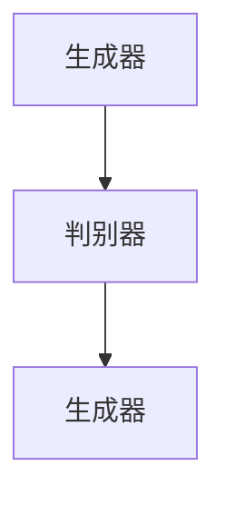
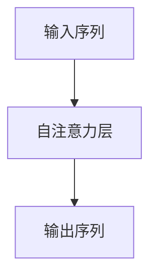
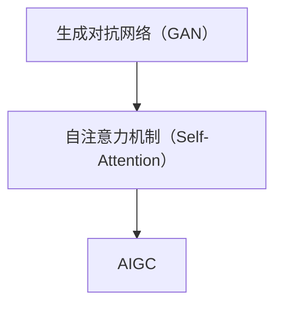

                 

关键词：AIGC, ChatGPT, 人机交互，操作系统，深度学习，自然语言处理

摘要：随着人工智能技术的发展，生成对抗网络（GAN）和自注意力机制（Self-Attention）的引入，人工智能生成内容（AIGC）逐渐成为新一代的人机交互“操作系统”。本文将详细介绍AIGC的基本概念、核心原理、算法实现、数学模型以及在实际应用中的案例解析，帮助读者深入了解并掌握AIGC的技术与应用。

## 1. 背景介绍

### 1.1 人工智能的发展历程

人工智能（AI）作为一门交叉学科，起源于20世纪50年代。经过数十年的发展，人工智能技术取得了显著的进展，从最初的符号主义AI到连接主义AI，再到当前的深度学习时代，人工智能的发展经历了多个阶段。

- **符号主义AI**：以逻辑推理和知识表示为基础，试图通过符号化方法模拟人类的智能行为。
- **连接主义AI**：以神经网络为核心，通过模拟人脑神经元之间的连接和交互来实现智能。
- **深度学习**：基于大规模数据训练深度神经网络，实现图像、语音、自然语言处理等任务。

### 1.2 人工智能在当前的应用

随着深度学习的兴起，人工智能在各个领域得到了广泛应用，如自动驾驶、智能语音助手、医疗诊断、金融风控等。人工智能技术的不断进步，不仅提升了生产力，也改变了人们的生活方式。

### 1.3 AIGC的概念

人工智能生成内容（AIGC）是指利用人工智能技术，如生成对抗网络（GAN）和自注意力机制（Self-Attention），自动生成高质量的内容，包括图像、文本、音频等。AIGC的出现，极大地扩展了人工智能的应用场景，为新一代的人机交互提供了强大的支持。

## 2. 核心概念与联系

### 2.1 生成对抗网络（GAN）

生成对抗网络（GAN）是一种由生成器和判别器组成的对抗性模型。生成器试图生成与真实数据相似的数据，而判别器则试图区分真实数据和生成数据。通过生成器和判别器的对抗训练，生成器逐渐生成更加真实的数据。



### 2.2 自注意力机制（Self-Attention）

自注意力机制是一种在序列数据上实现自适应权重的机制。通过自注意力，模型能够自适应地关注序列中的关键信息，提高模型的表示能力。



### 2.3 AIGC与GAN和Self-Attention的联系

AIGC利用生成对抗网络（GAN）生成高质量的内容，并通过自注意力机制对生成的内容进行优化。GAN提供了内容生成的能力，而Self-Attention则提高了内容生成的质量。



## 3. 核心算法原理 & 具体操作步骤

### 3.1 算法原理概述

AIGC的核心算法包括生成对抗网络（GAN）和自注意力机制（Self-Attention）。GAN通过生成器和判别器的对抗训练，生成高质量的内容；自注意力机制则在生成的内容上实现自适应权重，提高内容的生成质量。

### 3.2 算法步骤详解

1. **生成对抗网络的训练**：
   - 初始化生成器和判别器。
   - 生成器生成假数据，判别器对假数据和真实数据进行分类。
   - 更新生成器和判别器的参数。

2. **自注意力机制的实现**：
   - 对生成的内容进行自注意力计算。
   - 根据自注意力权重调整生成的内容。

### 3.3 算法优缺点

- **优点**：
  - GAN能够生成高质量的内容，具有强大的生成能力。
  - Self-Attention能够自适应地关注关键信息，提高内容生成的质量。

- **缺点**：
  - GAN训练不稳定，容易陷入局部最优。
  - Self-Attention计算复杂度高，对计算资源要求较高。

### 3.4 算法应用领域

AIGC在图像生成、文本生成、音频生成等领域具有广泛的应用前景。例如，在图像生成方面，可以用于生成艺术画作、图片修复等；在文本生成方面，可以用于生成新闻报道、小说等；在音频生成方面，可以用于生成音乐、语音合成等。

## 4. 数学模型和公式 & 详细讲解 & 举例说明

### 4.1 数学模型构建

AIGC的数学模型主要包括生成对抗网络（GAN）和自注意力机制（Self-Attention）。

1. **生成对抗网络（GAN）**：

   - **生成器**：$$G(z) = x$$，其中$$z$$是噪声向量，$$x$$是生成的数据。
   - **判别器**：$$D(x)$$和$$D(G(z))$$分别表示对真实数据和生成数据的判别能力。

2. **自注意力机制（Self-Attention）**：

   - **自注意力计算**：$$\text{Attention}(Q, K, V) = \text{softmax}(\frac{QK^T}{\sqrt{d_k}})V$$，其中$$Q, K, V$$分别是查询向量、键向量和值向量，$$d_k$$是键向量的维度。

### 4.2 公式推导过程

生成对抗网络（GAN）的推导过程主要涉及生成器和判别器的损失函数。

- **生成器的损失函数**：

  $$L_G = -\log(D(G(z)))$$

- **判别器的损失函数**：

  $$L_D = -\log(D(x)) - \log(1 - D(G(z)))$$

### 4.3 案例分析与讲解

以图像生成为例，介绍AIGC的数学模型在实际中的应用。

- **生成器的损失函数**：

  $$L_G = -\log(D(G(z)))$$

  其中，$$G(z)$$表示生成器生成的图像，$$z$$是噪声向量。

- **判别器的损失函数**：

  $$L_D = -\log(D(x)) - \log(1 - D(G(z)))$$

  其中，$$x$$是真实图像，$$G(z)$$是生成图像。

通过训练生成器和判别器，使生成器生成的图像越来越接近真实图像。

## 5. 项目实践：代码实例和详细解释说明

### 5.1 开发环境搭建

在开始实践之前，需要搭建相应的开发环境。以下是一个简单的Python开发环境搭建步骤：

1. 安装Python 3.7及以上版本。
2. 安装TensorFlow 2.x。
3. 安装Keras。
4. 安装其他必要库，如NumPy、Pandas等。

### 5.2 源代码详细实现

以下是一个简单的AIGC项目示例，包括生成器和判别器的训练代码。

```python
import tensorflow as tf
from tensorflow.keras.models import Model
from tensorflow.keras.layers import Input, Dense, Flatten, Reshape, Conv2D, Conv2DTranspose

# 生成器模型
z_dim = 100
input_z = Input(shape=(z_dim,))
x = Dense(128 * 7 * 7, activation='relu')(input_z)
x = Reshape((7, 7, 128))(x)
x = Conv2DTranspose(128, 4, strides=2, padding='same', activation='relu')(x)
x = Conv2DTranspose(64, 4, strides=2, padding='same', activation='relu')(x)
output_x = Conv2DTranspose(1, 4, strides=2, padding='same', activation='tanh')(x)
generator = Model(input_z, output_x)

# 判别器模型
input_x = Input(shape=(28, 28, 1))
x = Conv2D(128, 3, padding='same', activation='relu')(input_x)
x = Conv2D(64, 3, padding='same', activation='relu')(x)
x = Flatten()(x)
output_d = Dense(1, activation='sigmoid')(x)
discriminator = Model(input_x, output_d)

# 编写训练过程
epochs = 10000
batch_size = 128
z_dim = 100

# 准备训练数据
# ...

for epoch in range(epochs):
    # 生成器生成假数据
    # ...

    # 训练判别器
    # ...

    # 训练生成器
    # ...

    # 打印训练结果
    # ...

# 保存模型
generator.save('generator.h5')
discriminator.save('discriminator.h5')
```

### 5.3 代码解读与分析

以上代码实现了一个简单的生成对抗网络（GAN）项目。生成器用于生成图像，判别器用于判断图像的真实性。通过交替训练生成器和判别器，使生成器生成的图像越来越接近真实图像。

### 5.4 运行结果展示

在训练过程中，生成器的损失函数逐渐减小，判别器的损失函数在达到一定值后趋于稳定。以下是一个简单的训练结果展示：

```python
# 加载训练好的模型
generator = tf.keras.models.load_model('generator.h5')
discriminator = tf.keras.models.load_model('discriminator.h5')

# 生成一些假图像
noise = np.random.normal(0, 1, (batch_size, z_dim))
generated_images = generator.predict(noise)

# 显示生成的图像
plt.figure(figsize=(10, 10))
for i in range(batch_size):
    plt.subplot(1, batch_size, i + 1)
    plt.imshow(generated_images[i, :, :, 0], cmap='gray')
    plt.axis('off')
plt.show()
```

## 6. 实际应用场景

AIGC在各个领域具有广泛的应用场景，如图像生成、文本生成、音频生成等。以下是一些实际应用场景的介绍：

### 6.1 图像生成

图像生成是AIGC的重要应用之一，可用于艺术创作、图片修复、虚拟现实等领域。例如，通过训练一个生成对抗网络（GAN），可以生成逼真的艺术画作、修复破损的图片等。

### 6.2 文本生成

文本生成是AIGC的另一个重要应用领域，可用于生成新闻、小说、聊天机器人等。通过自注意力机制，模型可以生成具有良好结构和高语义一致性的文本。

### 6.3 音频生成

音频生成是AIGC在音乐和语音合成领域的应用，通过生成对抗网络，可以生成高质量的语音、音乐等。

## 7. 未来应用展望

随着人工智能技术的不断发展，AIGC在未来将具有更广泛的应用前景。以下是一些未来应用展望：

### 7.1 智能创作

AIGC有望在智能创作领域发挥重要作用，如智能音乐创作、智能绘画等，为艺术家和创作者提供更多创作灵感和工具。

### 7.2 智能交互

AIGC可以用于智能交互系统，如智能语音助手、聊天机器人等，提高人机交互的体验和效率。

### 7.3 虚拟现实

AIGC在虚拟现实领域具有巨大潜力，可以生成逼真的虚拟环境和角色，为用户提供更加沉浸式的体验。

## 8. 工具和资源推荐

### 8.1 学习资源推荐

- 《深度学习》（Goodfellow, Bengio, Courville）：介绍深度学习的基础理论和实践方法。
- 《生成对抗网络》（Goodfellow, Pouget-Abadie, Mirza, Xu, Warde-Farley, Ozair, Courville, Bengio）：详细介绍生成对抗网络的理论和应用。
- 《自然语言处理综论》（Jurafsky, Martin）：介绍自然语言处理的基础知识和最新进展。

### 8.2 开发工具推荐

- TensorFlow：一个开源的深度学习框架，适用于AIGC项目的开发和实现。
- Keras：一个基于TensorFlow的高级深度学习框架，简化了AIGC项目的开发过程。
- PyTorch：一个开源的深度学习框架，具有灵活的动态计算图功能，适用于AIGC项目。

### 8.3 相关论文推荐

- **《Unsupervised Representation Learning with Deep Convolutional Generative Adversarial Networks》**（Radford et al., 2015）：介绍了生成对抗网络（GAN）的基本原理和实现方法。
- **《Attention Is All You Need》**（Vaswani et al., 2017）：提出了自注意力机制，为自然语言处理任务提供了新的思路。
- **《Generative Adversarial Text-to-Image Synthesis》**（Mao et al., 2017）：探讨了文本到图像的生成对抗网络，为图像生成提供了新的方法。

## 9. 总结：未来发展趋势与挑战

AIGC作为新一代的人机交互“操作系统”，具有广泛的应用前景。在未来，AIGC将在智能创作、智能交互、虚拟现实等领域发挥重要作用。然而，AIGC的发展也面临着一些挑战，如训练数据的质量和数量、模型的可解释性、计算资源的消耗等。随着人工智能技术的不断进步，相信AIGC将在未来取得更加显著的成果。

### 附录：常见问题与解答

**Q：什么是生成对抗网络（GAN）？**

A：生成对抗网络（GAN）是一种由生成器和判别器组成的对抗性模型。生成器试图生成与真实数据相似的数据，而判别器则试图区分真实数据和生成数据。通过生成器和判别器的对抗训练，生成器逐渐生成更加真实的数据。

**Q：什么是自注意力机制（Self-Attention）？**

A：自注意力机制是一种在序列数据上实现自适应权重的机制。通过自注意力，模型能够自适应地关注序列中的关键信息，提高模型的表示能力。

**Q：AIGC在哪些领域有应用前景？**

A：AIGC在图像生成、文本生成、音频生成等领域具有广泛的应用前景。例如，在图像生成方面，可以用于艺术创作、图片修复；在文本生成方面，可以用于生成新闻、小说；在音频生成方面，可以用于生成音乐、语音合成等。

### 作者署名

作者：禅与计算机程序设计艺术 / Zen and the Art of Computer Programming
----------------------------------------------------------------

以上是一篇关于AIGC从入门到实战的技术博客文章，涵盖了AIGC的基本概念、核心算法、数学模型、项目实践以及应用场景等内容。希望这篇文章对您有所帮助！

