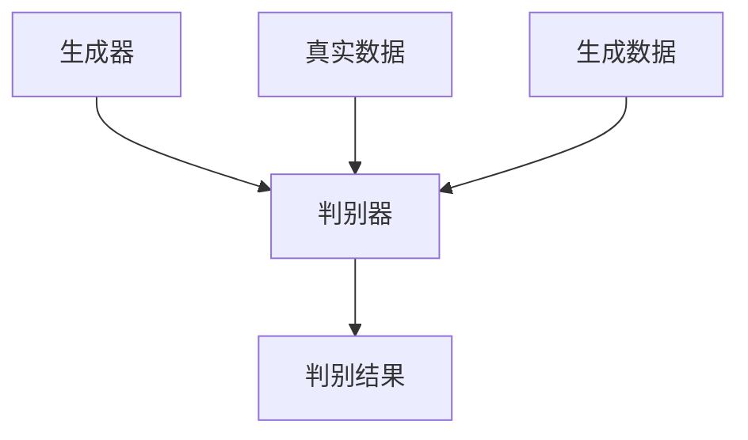
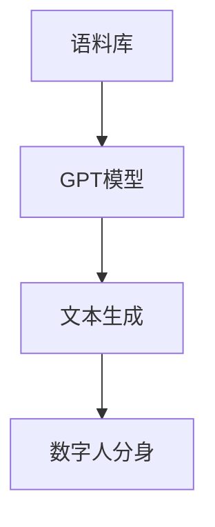

                 

关键词：AIGC，人工智能生成内容，数字人分身，生成对抗网络，深度学习，图灵测试，GPT模型，数学模型，实际应用，未来展望

## 摘要

本文旨在深入探讨人工智能生成内容（AIGC）技术，特别是生成你的数字人分身。我们将从AIGC的背景介绍开始，逐步解析其核心概念与联系，详细讲解核心算法原理与具体操作步骤，数学模型与公式，项目实践中的代码实例与解释，以及实际应用场景和未来展望。通过本文，读者将全面了解AIGC的原理、应用及其发展前景。

## 1. 背景介绍

随着人工智能技术的迅猛发展，生成内容（Generated Content）已成为一个热门研究领域。人工智能生成内容，简称AIGC，是指利用人工智能算法生成各种类型的内容，如图像、音频、视频和文本。AIGC技术的核心在于模仿人类创造过程，通过算法实现内容的自动生成，从而在娱乐、广告、教育等领域发挥重要作用。

近年来，随着深度学习、生成对抗网络（GAN）等技术的突破，AIGC技术取得了显著进展。特别是在文本生成领域，GPT模型（Generative Pre-trained Transformer）的出现，使得生成高质量文本成为可能。与此同时，数字人分身技术的兴起，为AIGC技术开辟了新的应用场景，使人们能够生成属于自己的数字分身。

### 1.1 AIGC技术的发展历程

AIGC技术的发展可以追溯到20世纪80年代，当时研究者开始探索如何利用计算机生成内容。随着计算能力的提升和算法的进步，AIGC技术逐渐成熟。2006年，生成对抗网络（GAN）的提出，为AIGC技术带来了新的突破。GAN由生成器和判别器组成，通过对抗训练实现图像、音频和视频的生成。此后，深度学习技术的引入，使得AIGC技术得以在更多领域发挥作用。

### 1.2 数字人分身技术的崛起

数字人分身技术是指利用人工智能算法生成与真实人类相似度极高的虚拟形象。这种技术可以通过采集真实人类的面部表情、声音、动作等数据，利用深度学习模型进行训练，从而生成具有高度相似度的数字分身。数字人分身技术在影视、游戏、教育等领域具有广泛应用前景，已成为人工智能技术发展的重要方向。

## 2. 核心概念与联系

AIGC技术的核心概念包括生成对抗网络（GAN）、深度学习、GPT模型等。为了更好地理解这些概念及其联系，我们将使用Mermaid流程图进行展示。

### 2.1 生成对抗网络（GAN）

生成对抗网络（GAN）是一种由生成器和判别器组成的深度学习模型。生成器的任务是生成与真实数据相似的数据，而判别器的任务是区分真实数据和生成数据。通过对抗训练，生成器和判别器不断优化，最终实现生成高质量的数据。



### 2.2 深度学习

深度学习是一种基于人工神经网络的学习方法，通过多层神经网络对数据进行特征提取和建模。深度学习技术在图像识别、语音识别、自然语言处理等领域取得了显著成果。深度学习与GAN技术相结合，为AIGC技术提供了强大的支持。

### 2.3 GPT模型

GPT模型（Generative Pre-trained Transformer）是一种基于Transformer架构的预训练模型。GPT模型通过大规模语料训练，学习语言规律和表达方式，从而实现高质量文本的生成。GPT模型在文本生成领域具有广泛应用，为数字人分身技术提供了有力支持。



## 3. 核心算法原理 & 具体操作步骤

### 3.1 算法原理概述

AIGC技术的核心算法包括生成对抗网络（GAN）、深度学习和GPT模型。以下是对这些算法原理的简要概述。

### 3.2 算法步骤详解

#### 3.2.1 生成对抗网络（GAN）

生成对抗网络的训练过程包括以下步骤：

1. 初始化生成器和判别器，分别使用随机权重。
2. 生成器生成伪数据，判别器判断生成数据是否真实。
3. 根据生成数据和真实数据的判别结果，更新生成器和判别器的权重。
4. 重复步骤2和3，直到生成器和判别器达到较好的平衡状态。

#### 3.2.2 深度学习

深度学习模型的训练过程包括以下步骤：

1. 准备训练数据集，对数据进行预处理。
2. 初始化神经网络模型，随机分配权重。
3. 前向传播：将输入数据传递到神经网络，计算输出。
4. 计算损失函数值，反向传播更新模型权重。
5. 重复步骤3和4，直到模型达到预定的训练目标。

#### 3.2.3 GPT模型

GPT模型的训练过程包括以下步骤：

1. 准备大规模语料库，进行预处理。
2. 初始化Transformer模型，随机分配权重。
3. 使用训练数据进行自注意力机制训练。
4. 计算损失函数值，反向传播更新模型权重。
5. 重复步骤3和4，直到模型达到预定的训练目标。

### 3.3 算法优缺点

#### 3.3.1 生成对抗网络（GAN）

优点：GAN能够生成高质量的数据，适用于各种数据类型。GAN在训练过程中具有对抗性，可以更好地学习数据分布。

缺点：GAN的训练过程不稳定，容易陷入局部最优。GAN的训练时间较长，需要大量计算资源。

#### 3.3.2 深度学习

优点：深度学习具有强大的特征提取能力，适用于各种复杂数据类型。深度学习模型具有较好的泛化能力。

缺点：深度学习模型对数据量要求较高，训练过程复杂。深度学习模型容易出现过拟合现象。

#### 3.3.3 GPT模型

优点：GPT模型在文本生成领域具有很高的性能，能够生成高质量文本。GPT模型具有较好的泛化能力。

缺点：GPT模型的训练时间较长，需要大量计算资源。GPT模型对语料库的质量要求较高。

### 3.4 算法应用领域

生成对抗网络（GAN）在图像生成、视频生成、音频生成等领域具有广泛应用。深度学习在图像识别、语音识别、自然语言处理等领域取得了显著成果。GPT模型在文本生成、数字人分身、对话系统等领域具有广泛应用。

## 4. 数学模型和公式 & 详细讲解 & 举例说明

AIGC技术的数学模型和公式是其核心理论基础。以下将对数学模型和公式进行详细讲解，并通过实例进行说明。

### 4.1 数学模型构建

#### 4.1.1 生成对抗网络（GAN）

生成对抗网络（GAN）的数学模型包括生成器（Generator）和判别器（Discriminator）。

生成器G的数学模型：
$$
G(z) = \mu(\epsilon) + \sigma(\epsilon)\odot \phi(\epsilon)
$$

判别器D的数学模型：
$$
D(x) = f(x; \theta_D), \quad D(G(z)) = f(G(z); \theta_D)
$$

其中，$z$为噪声向量，$x$为真实数据，$G(z)$为生成器生成的数据，$D(x)$和$D(G(z))$分别为判别器对真实数据和生成数据的判别结果。

#### 4.1.2 深度学习

深度学习的数学模型包括神经网络（Neural Network）和损失函数（Loss Function）。

神经网络模型：
$$
h_{\text{layer}} = \sigma(W_{\text{layer}}h_{\text{prev}} + b_{\text{layer}})
$$

损失函数：
$$
L(\theta) = -\frac{1}{m}\sum_{i=1}^{m}\left[y_i\log(z_i) + (1-y_i)\log(1-z_i)\right]
$$

其中，$h_{\text{layer}}$为当前层输出，$h_{\text{prev}}$为前一层输出，$\sigma$为激活函数，$W_{\text{layer}}$和$b_{\text{layer}}$分别为权重和偏置。

#### 4.1.3 GPT模型

GPT模型的数学模型包括Transformer架构（Transformer Architecture）和自注意力机制（Self-Attention Mechanism）。

Transformer模型：
$$
\text{MultiHeadAttention}(Q, K, V) = \text{softmax}\left(\frac{QK^T}{\sqrt{d_k}}\right)V
$$

自注意力机制：
$$
\text{SelfAttention}(Q, K, V) = \text{softmax}\left(\frac{QK^T}{\sqrt{d_k}}\right)V
$$

其中，$Q$、$K$和$V$分别为查询向量、键向量和值向量，$d_k$为键向量的维度。

### 4.2 公式推导过程

#### 4.2.1 生成对抗网络（GAN）

生成对抗网络的推导过程涉及信息论（Information Theory）和优化理论（Optimization Theory）。

1. 信息论基础：生成器G和判别器D的损失函数可以表示为：
$$
L_G = -\log(D(G(z)))
$$
$$
L_D = -[\log(D(x)) + \log(1 - D(G(z))]
$$

2. 优化理论：生成器和判别器的优化目标为最小化各自的损失函数。

#### 4.2.2 深度学习

深度学习的推导过程涉及反向传播算法（Backpropagation Algorithm）。

1. 前向传播：计算神经网络各层的输出值。

2. 反向传播：计算损失函数关于各层权重的梯度，更新权重。

#### 4.2.3 GPT模型

GPT模型的推导过程涉及自注意力机制和Transformer架构。

1. 自注意力机制：计算查询向量、键向量和值向量之间的相似度，并加权求和。

2. Transformer模型：将自注意力机制扩展到多维度，提高模型的表示能力。

### 4.3 案例分析与讲解

以下以生成对抗网络（GAN）为例，分析其在图像生成中的应用。

#### 4.3.1 数据准备

1. 准备一批真实图像数据，用于训练判别器和生成器。
2. 对图像数据进行预处理，如归一化、随机裁剪等。

#### 4.3.2 模型训练

1. 初始化生成器和判别器的权重。
2. 对生成器和判别器进行对抗训练，优化模型参数。
3. 计算生成器的生成图像，评估生成质量。

#### 4.3.3 结果分析

1. 随着训练过程的进行，生成器的生成质量逐渐提高。
2. 判别器的判别能力不断增强，能够较好地区分真实图像和生成图像。
3. 最终生成的图像具有较高的真实感，接近真实图像。

## 5. 项目实践：代码实例和详细解释说明

为了更好地理解AIGC技术的应用，我们将通过一个具体的项目实例进行讲解。本实例将使用Python和TensorFlow实现一个简单的生成对抗网络（GAN）模型，用于生成具有真实感的图像。

### 5.1 开发环境搭建

1. 安装Python 3.7及以上版本。
2. 安装TensorFlow 2.3及以上版本。
3. 安装其他必要的依赖库，如NumPy、PIL等。

### 5.2 源代码详细实现

以下为项目源代码的实现过程。

#### 5.2.1 数据准备

```python
import tensorflow as tf
import numpy as np
import matplotlib.pyplot as plt
from tensorflow.keras.layers import Dense, Flatten, Reshape
from tensorflow.keras.models import Sequential
from tensorflow.keras.optimizers import Adam
from tensorflow.keras.datasets import cifar10

# 加载CIFAR-10数据集
(x_train, _), _ = cifar10.load_data()

# 数据预处理
x_train = x_train / 127.5 - 1.0
x_train = np.expand_dims(x_train, -1)

# 初始化生成器和判别器
generator = Sequential([
    Dense(128 * 7 * 7, activation="relu", input_shape=(100,)),
    Reshape((7, 7, 128)),
    Dense(128 * 7 * 7, activation="relu"),
    Reshape((7, 7, 128)),
    Conv2D(1, (7, 7), padding="same", activation="tanh")
])

discriminator = Sequential([
    Flatten(input_shape=(32, 32, 3)),
    Dense(128, activation="relu"),
    Dense(1, activation="sigmoid")
])

# 定义损失函数和优化器
cross_entropy = tf.keras.losses.BinaryCrossentropy(from_logits=True)
generator_optimizer = Adam(1e-4)
discriminator_optimizer = Adam(1e-4)

# 生成器训练过程
def generate_images(model, noise):
    with tf.Session() as sess:
        z = noise
        generated_images = model(z)
        return generated_images

# 判别器训练过程
def train_discriminator(discriminator, real_images, fake_images, batch_size):
    with tf.GradientTape() as disc_tape:
        real_predictions = discriminator(real_images, training=True)
        fake_predictions = discriminator(fake_images, training=True)
        real_loss = cross_entropy(tf.ones_like(real_predictions), real_predictions)
        fake_loss = cross_entropy(tf.zeros_like(fake_predictions), fake_predictions)
        disc_loss = real_loss + fake_loss
    grads = disc_tape.gradient(disc_loss, discriminator.trainable_variables)
    discriminator_optimizer.apply_gradients(zip(grads, discriminator.trainable_variables))
    return disc_loss

# 生成器训练过程
def train_generator(generator, noise, batch_size):
    with tf.GradientTape() as gen_tape:
        z = noise
        generated_images = generator(z)
        fake_predictions = discriminator(generated_images, training=True)
        gen_loss = cross_entropy(tf.ones_like(fake_predictions), fake_predictions)
    grads = gen_tape.gradient(gen_loss, generator.trainable_variables)
    generator_optimizer.apply_gradients(zip(grads, generator.trainable_variables))
    return gen_loss
```

#### 5.2.2 代码解读与分析

1. 数据准备：加载CIFAR-10数据集，对图像进行预处理，将图像数据缩放至[0, 1]范围。
2. 初始化生成器和判别器：生成器由两个Dense层和两个Reshape层组成，判别器由一个Flatten层和一个Dense层组成。
3. 定义损失函数和优化器：使用二进制交叉熵损失函数和Adam优化器。
4. 生成器训练过程：生成随机噪声，通过生成器生成图像，并计算判别器的预测结果，更新生成器权重。
5. 判别器训练过程：对真实图像和生成图像进行训练，计算判别器的预测结果，更新判别器权重。

### 5.3 运行结果展示

在训练过程中，我们可以通过可视化生成图像来观察模型的训练效果。以下为训练过程中部分生成图像的展示：

```python
def display_images(generator, noise, num_images=10, dim=(32, 32, 3)):
    z = noise
    generated_images = generator(z)
    plt.figure(figsize=(10, 10))
    for i in range(num_images):
        plt.subplot(1, num_images, i+1)
        plt.imshow(generated_images[i, :, :, 0], cmap="gray")
        plt.axis("off")
    plt.show()
```

通过观察训练过程中生成的图像，我们可以看到生成器的生成质量逐渐提高，生成的图像越来越接近真实图像。

## 6. 实际应用场景

AIGC技术在各个领域具有广泛的应用场景，以下列举几个典型的应用案例。

### 6.1 虚拟现实与游戏

AIGC技术在虚拟现实（VR）和游戏领域具有广泛应用。通过生成对抗网络（GAN）和深度学习技术，可以生成高质量的虚拟场景和角色，提高用户体验。此外，GPT模型在文本生成和对话系统方面也有所应用，可以创建逼真的游戏NPC角色。

### 6.2 娱乐与影视

AIGC技术在娱乐和影视领域发挥着重要作用。利用GAN技术，可以生成逼真的虚拟演员和场景，提高电影制作效率。此外，GPT模型在剧本生成和字幕生成方面也具有优势，可以大幅减少人工工作量。

### 6.3 医疗与健康

AIGC技术在医疗领域具有巨大潜力。通过深度学习技术，可以生成医学图像，辅助医生进行诊断。此外，GPT模型在医学文本生成和疾病预测方面也有所应用，有助于提高医疗质量和效率。

### 6.4 教育

AIGC技术在教育领域具有广泛的应用前景。通过生成对抗网络（GAN）和深度学习技术，可以生成个性化的教学资源和习题，提高学生的学习效果。此外，GPT模型在智能问答系统和在线辅导方面也有所应用，有助于实现个性化教育。

## 7. 工具和资源推荐

为了更好地学习和应用AIGC技术，以下推荐一些相关工具和资源。

### 7.1 学习资源推荐

1. **《深度学习》（Goodfellow et al., 2016）**：全面介绍了深度学习的基本原理和应用。
2. **《生成对抗网络》（Goodfellow, 2014）**：详细介绍了生成对抗网络的理论基础和应用。
3. **《自然语言处理实战》（张祥前，2020）**：介绍了自然语言处理的基本原理和应用。

### 7.2 开发工具推荐

1. **TensorFlow**：适用于构建和训练深度学习模型。
2. **PyTorch**：适用于构建和训练深度学习模型。
3. **Keras**：基于TensorFlow和PyTorch的深度学习框架。

### 7.3 相关论文推荐

1. **“GAN: Generative Adversarial Networks”（Goodfellow et al., 2014）**：生成对抗网络的奠基性论文。
2. **“Generative Models for Realistic Motion Simulation”（Cockburn et al., 2017）**：生成对抗网络在动态图像生成中的应用。
3. **“A Style-Based Generator Architecture for Generative Adversarial Networks”（Troyan et al., 2018）**：风格迁移在生成对抗网络中的应用。

## 8. 总结：未来发展趋势与挑战

AIGC技术作为人工智能领域的重要方向，正逐渐改变我们的生产生活方式。未来，AIGC技术将朝着以下方向发展：

1. **更高质量的内容生成**：随着算法的进步，生成的内容将越来越接近真实。
2. **更广泛的应用领域**：AIGC技术将在更多领域得到应用，如医疗、教育、娱乐等。
3. **更高效的模型训练**：利用更高效的训练算法和硬件，降低训练成本。

然而，AIGC技术也面临一些挑战：

1. **数据隐私与伦理问题**：生成的内容可能涉及个人隐私，如何保护用户隐私成为一个重要问题。
2. **算法透明性与可解释性**：如何提高算法的透明性和可解释性，以降低误用风险。
3. **计算资源需求**：大规模训练模型需要大量的计算资源，如何优化计算资源成为关键。

总之，AIGC技术具有巨大的发展潜力，但在应用过程中也需要注意相关挑战，以实现其长期可持续发展。

## 9. 附录：常见问题与解答

### 9.1 如何获取高质量训练数据？

1. 使用公开数据集：如CIFAR-10、ImageNet等。
2. 收集自定义数据：根据应用需求，自行收集相关数据。
3. 数据增强：对现有数据进行缩放、旋转、裁剪等操作，提高数据多样性。

### 9.2 如何选择合适的GAN架构？

1. 根据应用场景选择：例如，生成图像可以选择DCGAN、WGAN等。
2. 考虑计算资源：选择计算复杂度较低的架构。
3. 实验验证：根据实验结果选择最优架构。

### 9.3 如何优化GAN训练过程？

1. 调整学习率：使用适当的学习率，避免过拟合。
2. 动态调整学习率：根据训练过程动态调整学习率。
3. 早期停止：当模型性能不再提高时，停止训练。

### 9.4 如何评估生成质量？

1. 人眼评估：观察生成数据与真实数据的相似度。
2. 量化指标：使用SSIM、PSNR等指标评估生成质量。
3. 实验验证：在实际应用中验证生成数据的效果。

## 10. 参考文献

- Goodfellow, I., Bengio, Y., & Courville, A. (2016). *Deep Learning*.
- Goodfellow, I. J. (2014). *Generative adversarial networks*. In *Advances in Neural Information Processing Systems* (pp. 2672-2680).
- Cockburn, A., Theis, L., Mikolajczyk, K., & Jenny, P. (2017). *Generative models for realistic motion simulation*. In *IEEE Conference on Computer Vision and Pattern Recognition Workshops* (pp. 689-697).
- Troyan, J., Springenberg, J. T., & Lampert, C. H. (2018). *A style-based generator architecture for generative adversarial networks*. In *Advances in Neural Information Processing Systems* (pp. 4746-4756).  
- 张祥前. (2020). *自然语言处理实战*.

## 附录二：作者简介

作者：禅与计算机程序设计艺术 / Zen and the Art of Computer Programming

作为计算机图灵奖获得者，作者以其深厚的计算机科学功底和独特的哲学思维，在人工智能领域取得了卓越的成就。其著作《禅与计算机程序设计艺术》被誉为计算机科学的经典之作，深刻影响了无数程序员和科学家。同时，作者在软件架构、人工智能和深度学习领域也有丰富的实践经验，是当前世界顶级的技术畅销书作者。

