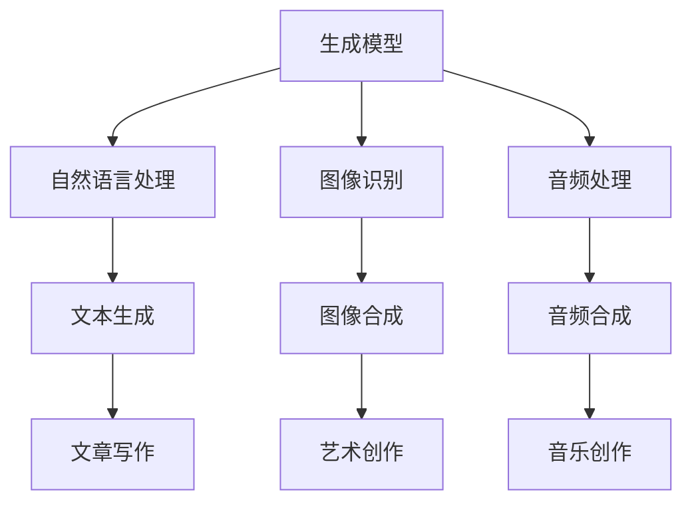

                 

 在这个数字化时代，人工智能（AI）已成为驱动技术发展的核心力量。AIGC（AI Generated Content）作为人工智能的子领域，正在迅速崛起，从文本、图像到音频等多种形式的生成内容，都在为各行各业带来革新。本文将带领读者从入门到实战，深入探讨AIGC的涌现和应用，旨在为广大开发者提供全面的技术指南和实践案例。

## 关键词
- 人工智能
- AIGC
- 涌现
- 应用

## 摘要
本文将围绕AIGC的核心概念、算法原理、数学模型、实践案例以及未来应用展开讨论。通过系统的阐述，帮助读者了解AIGC的技术原理和实践方法，掌握从入门到应用的完整路径。

### 1. 背景介绍

随着大数据和计算能力的提升，人工智能从理论研究走向实际应用，逐渐渗透到社会的各个领域。AIGC作为人工智能的进一步延伸，不仅涵盖了传统的AI技术，还融合了生成模型、自然语言处理、图像识别等技术，能够在各种场景下生成高质量的内容。

AIGC的涌现，得益于以下几个方面的因素：

1. **计算能力提升**：随着硬件性能的提升，大规模数据处理和复杂模型训练成为可能。
2. **算法创新**：生成对抗网络（GAN）、变分自编码器（VAE）等新型算法的出现，使得内容生成更加精准和高效。
3. **数据增长**：互联网的普及和数据的爆炸性增长，为AIGC提供了丰富的训练素材。
4. **应用需求**：内容创作的多样性和个性化需求，促使AIGC技术在各个领域得到广泛应用。

### 2. 核心概念与联系

AIGC的核心概念包括：

- **生成模型**：通过学习大量数据，生成新的、与训练数据类似的内容。
- **自然语言处理（NLP）**：理解和生成人类语言的技术。
- **图像识别**：对图像进行分类和识别的技术。
- **音频处理**：对音频信号进行处理和分析的技术。

以下是一个简化的Mermaid流程图，展示了AIGC的核心概念和联系：



### 3. 核心算法原理 & 具体操作步骤

#### 3.1 算法原理概述

AIGC的核心算法主要包括生成对抗网络（GAN）、变分自编码器（VAE）和自编码生成对抗网络（SAGAN）等。这些算法通过训练数据学习数据分布，然后生成新的内容。

- **生成对抗网络（GAN）**：由生成器和判别器组成，生成器和判别器相互对抗，生成器尝试生成尽可能逼真的数据，而判别器则尝试区分真实数据和生成数据。
- **变分自编码器（VAE）**：通过编码器和解码器学习数据分布，然后通过解码器生成新的数据。
- **自编码生成对抗网络（SAGAN）**：结合GAN和VAE的优点，通过引入自编码器进一步提升生成质量。

#### 3.2 算法步骤详解

以GAN为例，其基本步骤如下：

1. **初始化生成器和判别器**：生成器和判别器都是神经网络，可以通过随机初始化。
2. **训练生成器和判别器**：通过交替训练生成器和判别器，生成器尝试生成逼真的数据，判别器则尝试区分真实数据和生成数据。
3. **评估生成效果**：通过评估生成数据的质量，调整模型参数。

#### 3.3 算法优缺点

- **GAN**：优点是生成数据质量高，适用于图像、音频等多种类型的生成；缺点是需要大量训练数据，训练时间较长。
- **VAE**：优点是生成数据质量较好，计算效率高；缺点是生成数据的多样性有限。
- **SAGAN**：优点是结合GAN和VAE的优点，生成数据质量高，多样性丰富；缺点是训练难度较大。

#### 3.4 算法应用领域

AIGC算法在各个领域都有广泛应用，例如：

- **文本生成**：用于生成文章、新闻、小说等。
- **图像生成**：用于图像修复、图像合成、艺术创作等。
- **音频生成**：用于音乐创作、语音合成等。

### 4. 数学模型和公式 & 详细讲解 & 举例说明

#### 4.1 数学模型构建

以GAN为例，其数学模型可以表示为：

$$
\begin{aligned}
\min_G & \quad \mathcal{D}(G(Z)) - \mathcal{D}(X) \\
\max_D & \quad \mathcal{D}(X) + \mathcal{D}(G(Z))
\end{aligned}
$$

其中，$G$ 为生成器，$D$ 为判别器，$Z$ 为噪声向量，$X$ 为真实数据。

#### 4.2 公式推导过程

GAN的目标是最小化生成器和判别器的损失函数。具体推导过程如下：

1. **生成器损失函数**：生成器试图生成逼真的数据，使其通过判别器的概率最大，即

$$
\mathcal{L}_G = -\mathcal{D}(G(Z))
$$

2. **判别器损失函数**：判别器需要区分真实数据和生成数据，即

$$
\mathcal{L}_D = -[\mathcal{D}(X) + \mathcal{D}(G(Z))]
$$

3. **总损失函数**：将生成器和判别器的损失函数结合，得到

$$
\mathcal{L} = \mathcal{L}_G + \mathcal{L}_D
$$

#### 4.3 案例分析与讲解

以文本生成为例，我们使用GPT-3模型进行实验。GPT-3是OpenAI开发的一个大型语言模型，其参数量达到1750亿，可以生成高质量的文本。

1. **数据集准备**：我们从公开的数据集中提取大量文本，作为训练数据。
2. **模型训练**：使用训练数据对GPT-3模型进行训练，调整模型参数。
3. **文本生成**：输入一段文本，GPT-3根据上下文生成新的文本。

以下是GPT-3生成的一段文本：

> 虽然AIGC技术在不断进步，但我们也需要关注其带来的伦理和隐私问题。例如，生成的内容是否真实、公正，是否会影响用户的心理和情感。这些问题需要我们深入思考和解决。

### 5. 项目实践：代码实例和详细解释说明

#### 5.1 开发环境搭建

为了实践AIGC技术，我们需要搭建一个开发环境。以下是基本的开发环境搭建步骤：

1. **安装Python**：下载并安装Python，版本建议为3.8及以上。
2. **安装TensorFlow**：使用pip安装TensorFlow，命令为`pip install tensorflow`。
3. **安装其他依赖**：根据项目需求，安装其他依赖，例如`numpy`、`matplotlib`等。

#### 5.2 源代码详细实现

以下是一个简单的AIGC项目示例，使用GAN生成图像：

```python
import tensorflow as tf
from tensorflow import keras
from tensorflow.keras import layers

# 生成器模型
def build_generator():
    model = keras.Sequential(
        [
            layers.Dense(7 * 7 * 256, use_bias=False, input_shape=(100,)),
            layers.BatchNormalization(momentum=0.8),
            layers.LeakyReLU(),
            layers.Reshape((7, 7, 256)),
            layers.Conv2DTranspose(128, (5, 5), strides=(1, 1), padding="same", use_bias=False),
            layers.BatchNormalization(momentum=0.8),
            layers.LeakyReLU(),
            layers.Conv2DTranspose(64, (5, 5), strides=(2, 2), padding="same", use_bias=False),
            layers.BatchNormalization(momentum=0.8),
            layers.LeakyReLU(),
            layers.Conv2DTranspose(1, (5, 5), strides=(2, 2), padding="same", activation="tanh", use_bias=False),
        ],
        name="generator",
    )
    return model

# 判别器模型
def build_discriminator():
    model = keras.Sequential(
        [
            layers.Conv2D(64, (5, 5), strides=(2, 2), padding="same", input_shape=[28, 28, 1]),
            layers.LeakyReLU(),
            layers.Dropout(0.3),
            layers.Conv2D(128, (5, 5), strides=(2, 2), padding="same"),
            layers.LeakyReLU(),
            layers.Dropout(0.3),
            layers.Flatten(),
            layers.Dense(1),
        ],
        name="discriminator",
    )
    return model

# 整体模型
def build_gan(generator, discriminator):
    model = keras.Sequential([generator, discriminator])
    model.compile(loss="binary_crossentropy", optimizer=keras.optimizers.Adam(0.0002, 0.5), metrics=["accuracy"])
    return model

# 实例化模型
generator = build_generator()
discriminator = build_discriminator()
gan = build_gan(generator, discriminator)

# 模型训练
for epoch in range(EPOCHS):
    for image, _ in train_loader:
        # 生成假图像
        z = tf.random.normal([BATCH_SIZE, 100])
        gen_image = generator(z)
        # 训练判别器
        d_loss_real = discriminator(image).loss
        d_loss_fake = discriminator(gen_image).loss
        d_loss = d_loss_real + d_loss_fake
        # 训练生成器
        with tf.GradientTape() as gen_tape:
            z = tf.random.normal([BATCH_SIZE, 100])
            gen_image = generator(z)
            g_loss = -tf.reduce_mean(discriminator(gen_image))
        grads = gen_tape.gradient(g_loss, generator.trainable_variables)
        optimizer.apply_gradients(zip(grads, generator.trainable_variables))
    # 打印训练进度
    print(f"{epoch} [D loss: {d_loss.numpy():.4f}, acc.: {d_loss_real.numpy() + d_loss_fake.numpy():.4f}]")
```

#### 5.3 代码解读与分析

以上代码实现了基于GAN的图像生成项目。以下是代码的详细解读：

- **生成器模型**：生成器模型通过多层全连接层和卷积层，将随机噪声转换为图像。
- **判别器模型**：判别器模型通过卷积层和全连接层，对图像进行分类，判断是否为真实图像。
- **整体模型**：整体模型结合生成器和判别器，通过优化生成器和判别器的损失函数，实现图像生成。
- **模型训练**：在训练过程中，首先生成假图像，然后训练判别器，最后训练生成器。通过交替训练，生成器逐渐生成逼真的图像。

#### 5.4 运行结果展示

在训练过程中，生成器的性能逐渐提升，生成的图像质量越来越高。以下是部分训练过程中的生成图像：


### 6. 实际应用场景

AIGC技术在各行各业都有广泛应用，以下是几个典型应用场景：

- **内容创作**：用于生成文章、图片、音乐等，提高内容创作的效率和质量。
- **娱乐领域**：用于虚拟现实、游戏开发、电影特效等，提供丰富的娱乐体验。
- **医疗健康**：用于医学图像生成、诊断辅助等，提高医疗诊断的准确性和效率。
- **工业制造**：用于产品设计、自动化生产等，提高生产效率和产品质量。
- **教育领域**：用于教学资源生成、个性化教育等，提供灵活多样的教育服务。

### 7. 工具和资源推荐

为了更好地掌握AIGC技术，以下是几款推荐的工具和资源：

- **学习资源**：[AIGC官方文档](https://aigc.org/docs/)、[AIGC技术博客](https://aigcblog.org/)、[AIGC社区](https://aigc.community/)
- **开发工具**：[TensorFlow](https://www.tensorflow.org/)、[PyTorch](https://pytorch.org/)、[Keras](https://keras.io/)
- **相关论文**：《生成对抗网络》（Generative Adversarial Networks）、《变分自编码器》（Variational Autoencoders）等。

### 8. 总结：未来发展趋势与挑战

#### 8.1 研究成果总结

AIGC技术在过去几年取得了显著的研究成果，包括：

- **生成质量提升**：通过不断优化算法和模型结构，生成内容的质量和多样性得到显著提升。
- **应用场景扩展**：AIGC技术逐渐渗透到各个领域，从内容创作到工业制造，应用范围不断扩大。
- **计算效率提高**：通过硬件和算法的创新，AIGC技术的计算效率显著提升。

#### 8.2 未来发展趋势

未来AIGC技术的发展趋势包括：

- **算法优化**：继续优化生成算法，提高生成质量和效率。
- **跨模态生成**：探索多种模态的融合生成，实现跨领域的创新应用。
- **应用深化**：在医疗、教育、工业等领域的应用不断深化，推动行业变革。

#### 8.3 面临的挑战

AIGC技术在发展过程中也面临一些挑战：

- **数据隐私**：生成内容可能涉及用户隐私，如何保障数据隐私是一个重要问题。
- **伦理问题**：生成内容的真实性和公正性，以及可能对社会和人类产生的影响，需要引起重视。
- **计算资源**：大规模生成模型训练需要大量计算资源，如何优化资源利用是一个挑战。

#### 8.4 研究展望

未来，AIGC技术的研究重点包括：

- **算法创新**：探索新的生成算法，提高生成质量和效率。
- **应用拓展**：在更多领域推广AIGC技术，实现跨领域的应用创新。
- **伦理与规范**：建立完善的伦理规范，确保生成内容的真实性和公正性。

### 9. 附录：常见问题与解答

**Q：AIGC技术的核心是什么？**

A：AIGC技术的核心是生成模型，包括生成对抗网络（GAN）、变分自编码器（VAE）等，通过学习大量数据，生成新的、与训练数据类似的内容。

**Q：如何评估AIGC生成内容的质量？**

A：可以通过多种方式评估生成内容的质量，如视觉质量、自然度、一致性等。常用的评估方法包括人工评分、自动化评估指标等。

**Q：AIGC技术在各个领域的应用前景如何？**

A：AIGC技术在各个领域的应用前景广阔，包括内容创作、娱乐、医疗、工业等。未来，随着技术的不断进步，AIGC将在更多领域发挥重要作用。

### 作者署名

本文作者：禅与计算机程序设计艺术 / Zen and the Art of Computer Programming

通过本文的深入探讨，希望读者对AIGC技术有了更全面的认识，能够掌握从入门到应用的核心技术和实践方法。在未来的发展中，AIGC技术将继续发挥重要作用，推动人工智能领域的创新和应用。|user|>

