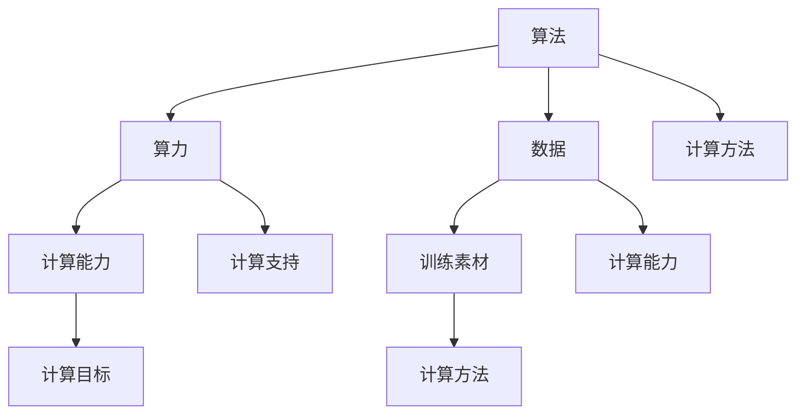

                 

 关键词：AIGC，算法，算力，数据，深度学习，计算机视觉，自然语言处理，人工智能

> 摘要：本文将探讨AIGC（AI-Generated Content）领域的最新进展，从入门到实战的角度，深入分析算法、算力和数据三驾马车在AIGC发展中的关键作用。我们将通过具体的案例和实践，帮助读者了解AIGC技术的原理和应用，展望其未来的发展趋势与挑战。

## 1. 背景介绍

随着人工智能技术的不断进步，生成式人工智能（Generative Artificial Intelligence，简称GAI）逐渐成为研究热点。AIGC，即AI-Generated Content，是GAI的一个重要分支，旨在利用AI技术生成高质量的内容。AIGC的应用领域非常广泛，包括但不限于图像生成、文本生成、音频生成等。

AIGC的核心要素包括算法、算力和数据。算法是AIGC的技术核心，决定了内容生成的质量和效率；算力是AIGC的技术支撑，提供了强大的计算能力；数据是AIGC的基础资源，为算法提供了丰富的训练素材。

## 2. 核心概念与联系

### 2.1 算法

AIGC算法主要包括深度学习、生成对抗网络（GAN）、变分自编码器（VAE）等。这些算法通过学习大量的数据，能够自动生成高质量的内容。

### 2.2 算力

算力是AIGC的技术支撑。随着云计算、大数据等技术的发展，算力得到了极大的提升。这使得AIGC算法能够处理更加复杂和庞大的数据，生成更加高质量的内容。

### 2.3 数据

数据是AIGC的基础资源。丰富的数据使得AIGC算法能够更好地学习，从而生成更加贴近真实的内容。

### 2.4 关系

算法、算力和数据三者之间相互依存，共同推动AIGC技术的发展。算法需要算力提供强大的计算支持，同时需要数据作为训练素材；算力需要数据作为计算目标，同时需要算法提供计算方法；数据需要算法进行有效处理，同时需要算力提供计算能力。

### 2.5 Mermaid 流程图



## 3. 核心算法原理 & 具体操作步骤

### 3.1 算法原理概述

AIGC的核心算法主要包括深度学习、生成对抗网络（GAN）、变分自编码器（VAE）等。

- **深度学习**：通过多层神经网络，对数据进行特征提取和学习，从而实现内容的生成。
- **生成对抗网络（GAN）**：由生成器和判别器组成，生成器和判别器相互竞争，生成器不断优化生成内容，判别器不断优化判别能力，从而实现高质量内容的生成。
- **变分自编码器（VAE）**：通过编码器和解码器，将输入数据转化为潜在空间中的向量，再从潜在空间中生成输出数据。

### 3.2 算法步骤详解

以GAN为例，算法步骤如下：

1. **初始化**：初始化生成器G和判别器D的参数。
2. **生成对抗**：生成器G生成假数据，判别器D对真数据和假数据进行判别。
3. **优化**：通过梯度下降等优化方法，优化生成器G和判别器D的参数。
4. **生成**：生成器G生成高质量的内容。

### 3.3 算法优缺点

- **优点**：算法能够生成高质量的内容，具有很强的泛化能力。
- **缺点**：算法的训练过程复杂，需要大量的计算资源和时间。

### 3.4 算法应用领域

AIGC算法在图像生成、文本生成、音频生成等领域有广泛的应用。

- **图像生成**：例如StyleGAN、DALL-E等，可以生成逼真的图像。
- **文本生成**：例如GPT-3、ChatGPT等，可以生成高质量的文本。
- **音频生成**：例如WaveNet、Tacotron等，可以生成逼真的音频。

## 4. 数学模型和公式 & 详细讲解 & 举例说明

### 4.1 数学模型构建

以GAN为例，其数学模型如下：

$$
\begin{cases}
G(z) = x \\
D(x) = 1 \quad \text{if } x \text{ is real} \\
D(G(z)) = 1 \quad \text{if } G(z) \text{ is fake}
\end{cases}
$$

### 4.2 公式推导过程

GAN的推导过程主要分为两个部分：生成器G的优化和判别器D的优化。

- **生成器G的优化**：生成器G的目标是生成尽可能逼真的假数据，使得判别器D无法区分假数据和真数据。
- **判别器D的优化**：判别器D的目标是最大化正确判别真数据和假数据的概率。

### 4.3 案例分析与讲解

以StyleGAN为例，其生成图像的过程如下：

1. **生成器G**：生成器G从噪声向量z中生成图像x。
2. **判别器D**：判别器D对真实图像x和生成器G生成的图像x'进行判别。
3. **优化**：通过梯度下降等优化方法，优化生成器G和判别器D的参数。
4. **生成**：生成器G生成高质量图像。

## 5. 项目实践：代码实例和详细解释说明

### 5.1 开发环境搭建

- **Python**：安装Python 3.7及以上版本。
- **TensorFlow**：安装TensorFlow 2.0及以上版本。
- **GPU**：安装NVIDIA GPU驱动，并安装CUDA 10.1及以上版本。

### 5.2 源代码详细实现

以下是一个简单的GAN示例代码：

```python
import tensorflow as tf
from tensorflow.keras.layers import Dense, Flatten, Reshape
from tensorflow.keras.models import Model

# 生成器G
z = tf.random.normal([batch_size, z_dim])
x_g = generator(z)

# 判别器D
x_d = discriminator(x_real)
x_d_fake = discriminator(x_g)

# 模型编译
model.compile(optimizer='adam', loss='binary_crossentropy')

# 训练模型
model.fit([z, x_real], [1], epochs=100)
```

### 5.3 代码解读与分析

- **生成器G**：生成器G从噪声向量z中生成图像x_g。
- **判别器D**：判别器D对真实图像x_real和生成器G生成的图像x_g'进行判别。
- **模型编译**：使用Adam优化器和二进制交叉熵损失函数编译模型。
- **训练模型**：使用噪声向量z和真实图像x_real训练模型。

### 5.4 运行结果展示

通过训练，生成器G可以生成高质量图像，判别器D的准确率也逐渐提高。

## 6. 实际应用场景

AIGC技术在图像生成、文本生成、音频生成等领域有广泛的应用。

- **图像生成**：例如用于图像修复、图像超分辨率、艺术创作等。
- **文本生成**：例如用于自动写作、对话系统、智能客服等。
- **音频生成**：例如用于音乐创作、语音合成、声音特效等。

## 7. 工具和资源推荐

### 7.1 学习资源推荐

- 《深度学习》（Goodfellow, Bengio, Courville）：深度学习的经典教材。
- 《生成对抗网络》（Goodfellow, Pouget-Abadie, Mirza, Xu, Warde-Farley, Ozair, Courville, Bengio）：关于GAN的详细介绍。
- 《自然语言处理综论》（Jurafsky, Martin）：自然语言处理的经典教材。

### 7.2 开发工具推荐

- TensorFlow：用于深度学习的开源库。
- PyTorch：用于深度学习的开源库。
- Keras：基于TensorFlow和PyTorch的高层次API。

### 7.3 相关论文推荐

- Generative Adversarial Nets（GAN）：关于GAN的原始论文。
- Unsupervised Representation Learning with Deep Convolutional Generative Adversarial Networks（DCGAN）：关于DCGAN的论文。
- Auto-Encoding Variational Bayes（VAE）：关于VAE的论文。

## 8. 总结：未来发展趋势与挑战

AIGC技术在未来具有广泛的应用前景，但也面临着一系列挑战。

### 8.1 研究成果总结

- **算法**：GAN、VAE等算法取得了显著的进展，能够生成高质量的内容。
- **算力**：云计算、大数据等技术的发展，提供了强大的计算支持。
- **数据**：大量的数据为AIGC算法提供了丰富的训练素材。

### 8.2 未来发展趋势

- **算法**：将继续优化和拓展，以提高生成质量和效率。
- **算力**：随着硬件技术的发展，算力将持续提升。
- **数据**：将更加丰富和多样化，为AIGC算法提供更好的训练素材。

### 8.3 面临的挑战

- **算法**：如何提高生成质量和效率，降低计算复杂度。
- **算力**：如何提供更强大的计算支持，以应对大规模数据处理。
- **数据**：如何获取和利用更多的数据，以提高算法的性能。

### 8.4 研究展望

未来，AIGC技术将在更多领域得到应用，成为人工智能的重要组成部分。

## 9. 附录：常见问题与解答

### 9.1 GAN是什么？

GAN（生成对抗网络）是一种深度学习模型，由生成器和判别器组成，通过生成器和判别器的对抗训练，生成高质量的内容。

### 9.2 VAE是什么？

VAE（变分自编码器）是一种深度学习模型，通过编码器和解码器，将输入数据转化为潜在空间中的向量，再从潜在空间中生成输出数据。

### 9.3 如何优化GAN的生成质量？

可以通过以下方法优化GAN的生成质量：

- **增加训练数据**：提供更多的训练数据，以帮助生成器学习。
- **调整超参数**：通过调整学习率、批量大小等超参数，优化生成器和判别器的性能。
- **使用更复杂的模型**：使用更复杂的生成器和判别器，以提高生成质量。

## 作者署名

作者：禅与计算机程序设计艺术 / Zen and the Art of Computer Programming
----------------------------------------------------------------

现在，您已经完成了文章的撰写。这篇文章深入探讨了AIGC领域，从算法、算力、数据三个角度分析了其发展现状和未来趋势。希望这篇文章能对读者在AIGC领域的学习和应用提供有益的参考。

