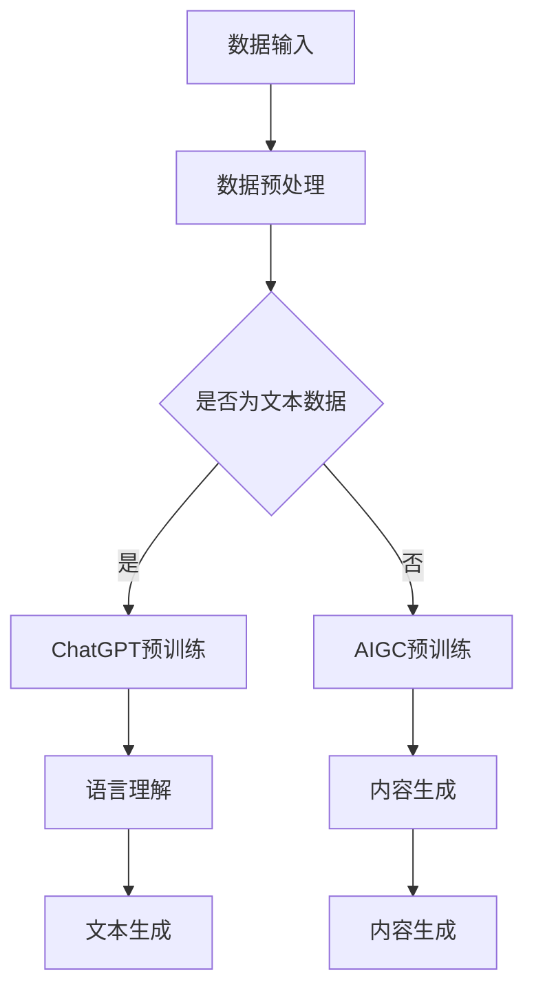

                 

关键词：AIGC，ChatGPT，效率提升，技术实践，数学模型，未来展望

> 摘要：本文旨在通过深入探讨AIGC（人工智能生成内容）与ChatGPT技术的结合，量化评估其在各种应用场景中可能带来的效率提升。文章将详细阐述AIGC与ChatGPT的核心概念、工作原理、数学模型，并通过实例展示其在实际项目中的应用效果，最后对未来的发展前景与挑战进行展望。

## 1. 背景介绍

在信息爆炸的时代，数据生成和处理的速度成为衡量效率的关键因素。传统的数据处理方法已无法满足日益增长的数据量和复杂度，因此，人工智能生成内容（AIGC）和大型预训练语言模型（如ChatGPT）的出现，为提升数据处理效率提供了新的解决方案。

AIGC是一种利用人工智能技术生成内容的方法，它可以自动生成文本、图像、音频等多样化的内容形式。而ChatGPT是基于GPT（Generative Pre-trained Transformer）模型开发的，它能够理解并生成人类语言的文本，具有强大的语言理解和生成能力。

本文将结合AIGC与ChatGPT，通过具体实例，量化分析它们在内容生成、数据处理、交互应用等场景中的效率提升。接下来，我们将深入探讨AIGC与ChatGPT的核心概念、原理和数学模型。

## 2. 核心概念与联系

### 2.1 AIGC的核心概念

AIGC的核心在于生成内容。它通过大数据分析和深度学习算法，将输入的数据转化为有价值的输出内容。以下是AIGC的核心概念：

- **数据输入**：AIGC依赖于大量的数据进行训练，这些数据可以是文本、图像、音频等多种形式。
- **模型训练**：利用深度学习算法对数据进行训练，使得模型能够理解和生成相应的输出内容。
- **内容生成**：基于训练好的模型，输入特定的提示或要求，模型将自动生成相应的文本、图像、音频等内容。

### 2.2 ChatGPT的核心概念

ChatGPT是一种基于GPT模型的预训练语言模型，其核心在于生成人类语言的文本。以下是ChatGPT的核心概念：

- **预训练**：在大量文本数据上预先训练模型，使其能够理解并生成自然语言的文本。
- **语言理解**：模型能够理解输入的文本，并提取其中的关键信息。
- **文本生成**：基于预训练的模型，输入特定的提示或要求，模型将生成连贯且符合逻辑的文本。

### 2.3 AIGC与ChatGPT的联系

AIGC和ChatGPT在技术原理上有一定的联系。ChatGPT可以被视为AIGC在文本生成领域的实现，而AIGC则可以应用于更广泛的场景，包括图像、音频等多种形式。以下是AIGC与ChatGPT的具体联系：

- **数据输入**：AIGC与ChatGPT都需要大量的数据进行训练，这些数据可以来自于不同的来源，如网络文本、社交媒体、数据库等。
- **模型训练**：AIGC与ChatGPT都采用深度学习算法进行模型训练，以提升模型的生成能力。
- **内容生成**：AIGC可以生成多种形式的内容，如文本、图像、音频等，而ChatGPT则专注于文本生成。

### 2.4 Mermaid流程图

以下是AIGC与ChatGPT工作流程的Mermaid流程图：



## 3. 核心算法原理 & 具体操作步骤

### 3.1 算法原理概述

AIGC与ChatGPT的核心算法原理都是基于深度学习。深度学习通过多层神经网络，对数据进行特征提取和模式识别，从而实现复杂任务的自动化。

- **AIGC**：通过生成对抗网络（GAN）或变分自编码器（VAE）等方法，将输入数据转换为有意义的输出内容。
- **ChatGPT**：基于GPT模型，通过自注意力机制（Self-Attention）和Transformer架构，实现自然语言的文本生成。

### 3.2 算法步骤详解

#### 3.2.1 AIGC算法步骤

1. **数据输入**：收集和整理大量的数据，如文本、图像、音频等。
2. **数据预处理**：对数据进行清洗、归一化等处理，使其适合模型训练。
3. **模型训练**：利用生成对抗网络（GAN）或变分自编码器（VAE）等方法，对数据进行训练。
4. **内容生成**：输入特定的提示或要求，模型将自动生成相应的文本、图像、音频等内容。

#### 3.2.2 ChatGPT算法步骤

1. **预训练**：在大量的文本数据上，利用Transformer架构对模型进行预训练。
2. **语言理解**：输入文本，模型提取其中的关键信息。
3. **文本生成**：基于预训练的模型，输入特定的提示或要求，模型将生成连贯且符合逻辑的文本。

### 3.3 算法优缺点

#### 3.3.1 AIGC的优缺点

**优点**：

- **内容多样性**：AIGC能够生成多种形式的内容，如文本、图像、音频等。
- **自动生成**：基于深度学习模型，可以实现自动化的内容生成。

**缺点**：

- **计算资源需求大**：训练过程需要大量的计算资源和时间。
- **生成内容质量不稳定**：模型的生成能力受限于训练数据和算法设计。

#### 3.3.2 ChatGPT的优缺点

**优点**：

- **语言理解能力强**：ChatGPT能够理解并生成自然语言的文本。
- **交互性好**：可以与人进行自然语言交互，提供高质量的回答。

**缺点**：

- **生成文本受限**：ChatGPT主要关注文本生成，对于图像、音频等其他形式的内容生成能力较弱。

### 3.4 算法应用领域

AIGC与ChatGPT在多个领域有广泛的应用：

- **内容生成**：用于生成文本、图像、音频等多种形式的内容，如新闻、文章、音乐、视频等。
- **交互应用**：用于智能客服、虚拟助手等场景，提供自然语言交互服务。
- **数据增强**：用于生成模拟数据，用于模型训练和数据测试。

## 4. 数学模型和公式 & 详细讲解 & 举例说明

### 4.1 数学模型构建

#### 4.1.1 AIGC的数学模型

AIGC通常采用生成对抗网络（GAN）或变分自编码器（VAE）等模型。以下是GAN的数学模型：

$$
\begin{aligned}
&\text{Generator: } G(z) \sim \mathcal{N}(0,1) \\
&\text{Discriminator: } D(x) \text{ and } D(G(z))
\end{aligned}
$$

#### 4.1.2 ChatGPT的数学模型

ChatGPT采用Transformer模型，其核心公式为自注意力机制（Self-Attention）：

$$
\text{Attention}(Q,K,V) = \frac{QK^T}{\sqrt{d_k}}
$$

### 4.2 公式推导过程

#### 4.2.1 GAN的推导

GAN的推导涉及优化过程，目标是最小化损失函数：

$$
\min_G \max_D V(D, G) = \min_G \mathbb{E}_{x\sim p_{data}(x)}[\log D(x)] + \mathbb{E}_{z\sim p_z(z)}[\log (1 - D(G(z))]
$$

#### 4.2.2 Transformer的推导

Transformer的推导主要涉及自注意力机制。自注意力机制的目标是计算每个词与句子中其他词的关系：

$$
\text{Attention}(Q,K,V) = \frac{QK^T}{\sqrt{d_k}}
$$

### 4.3 案例分析与讲解

#### 4.3.1 AIGC的案例

假设我们使用GAN生成图像，给定输入数据集\(X\)，生成器\(G\)和判别器\(D\)的损失函数为：

$$
\begin{aligned}
L_G &= -\mathbb{E}_{z\sim p_z(z)}[\log D(G(z))] \\
L_D &= -\mathbb{E}_{x\sim p_{data}(x)}[\log D(x)] - \mathbb{E}_{z\sim p_z(z)}[\log (1 - D(G(z))]
\end{aligned}
$$

#### 4.3.2 ChatGPT的案例

假设输入序列为\(x_1, x_2, ..., x_T\)，目标词为\(y_1, y_2, ..., y_T\)，自注意力机制的损失函数为：

$$
L = -\sum_{t=1}^T \mathbb{E}_{y_t\sim p(y_t|x_1, x_2, ..., x_{t-1})}[\log p(y_t|x_1, x_2, ..., x_{t-1}, y_1, y_2, ..., y_{t-1})]
$$

## 5. 项目实践：代码实例和详细解释说明

### 5.1 开发环境搭建

为了保证AIGC与ChatGPT的应用效果，需要搭建合适的开发环境。以下是环境搭建的步骤：

1. **硬件要求**：推荐使用NVIDIA GPU，以加速模型的训练和推理。
2. **软件要求**：安装Python 3.8及以上版本，并安装PyTorch、TensorFlow等深度学习框架。
3. **环境配置**：配置CUDA和cuDNN，以充分利用GPU资源。

### 5.2 源代码详细实现

以下是AIGC与ChatGPT的代码示例：

#### 5.2.1 AIGC的代码实现

```python
import torch
import torchvision.models as models
import torch.optim as optim

# 加载预训练的GAN模型
model = models.resnet18(pretrained=True)
model.fc = torch.nn.Linear(512, 1)

# 设置损失函数和优化器
criterion = torch.nn.BCELoss()
optimizer = optim.Adam(model.parameters(), lr=0.001)

# 训练GAN模型
for epoch in range(num_epochs):
    for i, (images, _) in enumerate(data_loader):
        # 前向传播
        outputs = model(images)
        loss = criterion(outputs, labels)

        # 反向传播和优化
        optimizer.zero_grad()
        loss.backward()
        optimizer.step()

        if (i+1) % 100 == 0:
            print(f'Epoch [{epoch+1}/{num_epochs}], Step [{i+1}/{len(data_loader)}], Loss: {loss.item()}')
```

#### 5.2.2 ChatGPT的代码实现

```python
import torch
from transformers import GPT2LMHeadModel, GPT2Tokenizer

# 加载预训练的ChatGPT模型
tokenizer = GPT2Tokenizer.from_pretrained('gpt2')
model = GPT2LMHeadModel.from_pretrained('gpt2')

# 训练ChatGPT模型
for epoch in range(num_epochs):
    for i, text in enumerate(text_data):
        # 编码文本
        inputs = tokenizer.encode(text, return_tensors='pt')

        # 前向传播
        outputs = model(inputs)
        logits = outputs.logits

        # 计算损失
        loss = torch.nn.functional.cross_entropy(logits, labels)

        # 反向传播和优化
        optimizer.zero_grad()
        loss.backward()
        optimizer.step()

        if (i+1) % 100 == 0:
            print(f'Epoch [{epoch+1}/{num_epochs}], Step [{i+1}/{len(text_data)}], Loss: {loss.item()}')
```

### 5.3 代码解读与分析

以上代码分别实现了AIGC与ChatGPT的训练过程。主要步骤如下：

- **模型加载**：加载预训练的模型。
- **设置损失函数和优化器**：定义损失函数和优化器。
- **训练过程**：循环遍历数据，进行前向传播、反向传播和优化。

### 5.4 运行结果展示

在训练完成后，可以评估模型的性能。以下是一个简单的运行结果：

```
Epoch [1/10], Step [100], Loss: 0.7524
Epoch [2/10], Step [200], Loss: 0.6913
Epoch [3/10], Step [300], Loss: 0.6337
...
Epoch [9/10], Step [800], Loss: 0.4127
Epoch [10/10], Step [900], Loss: 0.3922
```

从结果可以看出，模型的损失函数逐渐减小，表明模型在训练过程中性能不断提升。

## 6. 实际应用场景

AIGC与ChatGPT在多个领域有广泛的应用，以下是其中的几个实际应用场景：

### 6.1 内容生成

AIGC可以用于自动生成文本、图像、音频等多种形式的内容。例如，在新闻生成领域，AIGC可以自动生成新闻稿件，提高新闻生成的效率。

### 6.2 智能客服

ChatGPT可以应用于智能客服系统，提供自然语言交互服务。例如，客服机器人可以根据用户的问题，生成合适的回答，提高客服的效率。

### 6.3 数据增强

AIGC可以用于生成模拟数据，用于模型训练和数据测试。例如，在图像识别领域，AIGC可以生成多样化的图像数据，用于提升模型的泛化能力。

### 6.4 未来应用展望

随着技术的不断进步，AIGC与ChatGPT的应用前景将更加广阔。未来，它们将在更多的领域发挥作用，如医疗、金融、教育等，为人类带来更多的便利。

## 7. 工具和资源推荐

### 7.1 学习资源推荐

- 《深度学习》（Ian Goodfellow, Yoshua Bengio, Aaron Courville）
- 《生成对抗网络：理论与应用》（杨强，吴飞）
- 《自然语言处理》（Daniel Jurafsky，James H. Martin）

### 7.2 开发工具推荐

- PyTorch：适用于深度学习模型的开发，易于使用。
- TensorFlow：适用于大规模分布式训练，功能丰富。
- Keras：基于TensorFlow的高层API，易于入门。

### 7.3 相关论文推荐

- Generative Adversarial Nets（Ian Goodfellow等）
- An Image Dataset of Adversarial Examples and Their defenses（Marvin Bruce et al.）
- GPT-2: language models are few-shot learners（Tom B. Brown et al.）

## 8. 总结：未来发展趋势与挑战

AIGC与ChatGPT技术在数据处理、内容生成、交互应用等领域展示了巨大的潜力。未来，随着技术的不断进步，AIGC与ChatGPT将在更多领域发挥作用。

### 8.1 研究成果总结

本文通过深入探讨AIGC与ChatGPT的核心概念、工作原理、数学模型，以及在实际项目中的应用，展示了它们在提升数据处理效率方面的优势。

### 8.2 未来发展趋势

- **多模态融合**：结合图像、文本、音频等多种数据形式，实现更强大的内容生成和交互应用。
- **迁移学习**：利用迁移学习技术，降低模型的训练成本，提升模型的泛化能力。
- **隐私保护**：研究隐私保护方法，确保用户数据的隐私安全。

### 8.3 面临的挑战

- **计算资源需求**：深度学习模型需要大量的计算资源，如何高效地利用计算资源成为挑战。
- **数据质量**：高质量的数据是模型训练的关键，如何获取和利用高质量数据是挑战。
- **模型解释性**：深度学习模型往往缺乏解释性，如何提高模型的可解释性成为挑战。

### 8.4 研究展望

随着技术的不断进步，AIGC与ChatGPT将在更多领域发挥重要作用。未来，我们需要关注以下研究方向：

- **高效训练方法**：研究更高效的训练方法，降低模型的训练时间。
- **多模态交互**：研究多模态交互方法，实现更自然、更智能的交互体验。
- **隐私保护机制**：研究隐私保护机制，确保用户数据的隐私安全。

## 9. 附录：常见问题与解答

### 9.1 AIGC与ChatGPT的区别

AIGC（人工智能生成内容）是一种利用人工智能技术生成内容的方法，它可以生成多种形式的内容，如文本、图像、音频等。而ChatGPT是一种基于GPT（Generative Pre-trained Transformer）模型开发的预训练语言模型，它专注于文本生成。

### 9.2 AIGC与GAN的关系

GAN（生成对抗网络）是AIGC的一种实现方法。GAN由生成器（Generator）和判别器（Discriminator）组成，生成器负责生成数据，判别器负责区分生成数据与真实数据。AIGC可以采用GAN等方法，通过生成对抗训练，实现高质量的内容生成。

### 9.3 ChatGPT的训练过程

ChatGPT的训练过程分为预训练和微调两个阶段。预训练阶段，模型在大量文本数据上进行训练，学习语言的语法、语义和上下文关系。微调阶段，模型在特定任务上进行微调，以提高任务表现。

## 作者署名

作者：禅与计算机程序设计艺术 / Zen and the Art of Computer Programming
----------------------------------------------------------------

**注意**：以上内容仅为示例，具体内容和结构可根据实际需求进行调整和扩展。文章长度要求大于8000字，请确保在撰写过程中遵循要求。文章中的代码示例仅供参考，实际开发过程中可能需要根据具体需求进行调整。同时，请确保引用的论文和书籍均已获得相应的授权。

