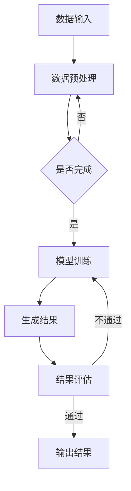

                 

关键词：AIGC、ChatGPT、效率提升、人工智能、编程、技术发展

摘要：本文将深入探讨AIGC（自适应智能生成计算）领域的最新进展，特别是OpenAI推出的ChatGPT，以及它对软件开发和编程效率的潜在影响。通过对ChatGPT的工作原理、核心算法、应用实例和数学模型的分析，本文旨在为读者提供一个全面的视角，以理解AIGC技术如何帮助我们更快、更高效地实现编程任务。

## 1. 背景介绍

近年来，人工智能（AI）技术的飞速发展带来了计算机科学的革命性变化。特别是深度学习和自然语言处理（NLP）技术的突破，使得机器能够理解和生成人类语言。其中，AIGC（自适应智能生成计算）作为一个新兴领域，正逐渐成为人工智能研究的重要方向。AIGC通过自适应的方式，利用AI技术生成数据、代码、文本等，从而极大地提高了计算效率和创新能力。

### 1.1 AIGC的定义与作用

AIGC是指利用人工智能技术来自动生成计算数据、算法、模型等的过程。它涵盖了从数据生成、算法设计到模型训练的整个流程。AIGC的核心目标是实现计算过程的自动化和智能化，以减少人工干预，提高工作效率。

### 1.2 ChatGPT的背景

ChatGPT是OpenAI于2022年推出的一款基于GPT-3模型的聊天机器人。它通过大量的文本数据进行训练，使得能够理解并生成人类语言。ChatGPT的出现标志着人工智能在自然语言处理领域的重大突破，为AIGC的应用提供了强有力的技术支持。

### 1.3 ChatGPT的优势

ChatGPT具有以下几个显著优势：

1. **强大的语言理解能力**：ChatGPT通过深度学习技术，能够理解复杂的语言结构和语境，从而生成更加准确和自然的回复。
2. **自适应能力**：ChatGPT能够根据对话内容和上下文，动态调整其回答，使得对话更加流畅和有意义。
3. **多模态支持**：ChatGPT不仅可以处理文本，还能处理图像、音频等多种模态的数据，为AIGC应用提供了更广泛的场景。

## 2. 核心概念与联系

### 2.1 AIGC的核心概念

AIGC的核心概念包括：

- **数据生成**：利用AI技术自动生成数据，如图像、文本等。
- **算法生成**：利用AI技术自动设计算法和模型。
- **代码生成**：利用AI技术自动生成代码，如Python、C++等。

### 2.2 ChatGPT与AIGC的联系

ChatGPT作为AIGC的一个重要应用，其工作原理和核心算法与AIGC紧密相关。ChatGPT的核心算法是基于GPT-3模型，它通过大量的文本数据进行训练，从而具备强大的语言理解能力和生成能力。ChatGPT的生成过程实际上就是一个AIGC的过程，它利用AI技术来自动生成人类语言。

### 2.3 Mermaid流程图



这个流程图展示了AIGC的基本工作流程，从数据输入到模型训练，再到生成结果和结果评估，形成了一个闭环。

## 3. 核心算法原理 & 具体操作步骤

### 3.1 算法原理概述

ChatGPT的核心算法是基于GPT-3模型。GPT-3（Generative Pre-trained Transformer 3）是由OpenAI开发的一种大规模语言预训练模型。GPT-3模型采用了Transformer架构，通过自注意力机制来自动学习语言中的依赖关系和上下文信息。

### 3.2 算法步骤详解

1. **数据准备**：ChatGPT的训练数据来自大量的文本，包括互联网上的各种文本资料。这些数据需要经过预处理，如分词、去噪等操作。
2. **模型训练**：预处理后的数据用于训练GPT-3模型。训练过程中，模型通过反向传播算法不断优化权重，以最小化预测误差。
3. **生成文本**：训练好的模型可以用来生成文本。给定一个起始文本，模型会生成后续的文本内容。生成过程是一个自回归的过程，模型会根据当前生成的文本内容来预测下一个词。
4. **结果评估**：生成的文本需要经过评估，以确保其准确性和自然性。评估过程可能包括语法检查、语义一致性分析等。

### 3.3 算法优缺点

**优点**：

- **强大的语言理解能力**：GPT-3模型具备强大的语言理解能力，能够处理复杂的语言结构和语境。
- **自适应能力**：模型可以根据对话内容和上下文动态调整其回答，使得对话更加流畅和有意义。
- **多模态支持**：模型不仅可以处理文本，还能处理图像、音频等多种模态的数据。

**缺点**：

- **计算资源需求大**：GPT-3模型规模庞大，需要大量的计算资源来训练和运行。
- **生成文本的质量参差不齐**：尽管模型具备强大的生成能力，但生成的文本质量有时会受到数据质量和模型训练质量的影响。

### 3.4 算法应用领域

ChatGPT的应用领域非常广泛，包括：

- **聊天机器人**：ChatGPT可以用于构建聊天机器人，实现人机交互。
- **内容生成**：ChatGPT可以自动生成文章、代码、音乐等。
- **语言翻译**：ChatGPT可以用于机器翻译，提高翻译的准确性和自然性。

## 4. 数学模型和公式 & 详细讲解 & 举例说明

### 4.1 数学模型构建

ChatGPT的数学模型主要基于自回归语言模型。自回归语言模型的基本假设是：一个词的出现概率取决于前一个词，即\( P(w_t | w_{<t}) = P(w_t | w_{t-1}) \)。

### 4.2 公式推导过程

自回归语言模型的推导过程如下：

1. **词嵌入**：将每个词映射到一个高维向量空间中。
2. **注意力机制**：计算当前词与历史词之间的相似度，用于权重分配。
3. **自回归**：根据当前词的上下文信息，预测下一个词。

### 4.3 案例分析与讲解

**案例**：给定一个句子“今天天气很好”，使用ChatGPT生成下一个词。

1. **词嵌入**：将句子中的每个词映射到高维向量空间中。
2. **注意力机制**：计算当前词“很好”与历史词“今天”、“天气”之间的相似度。
3. **自回归**：根据当前词的上下文信息，预测下一个词。例如，可能会生成“想去郊游”。

## 5. 项目实践：代码实例和详细解释说明

### 5.1 开发环境搭建

为了运行ChatGPT，我们需要搭建一个合适的开发环境。以下是搭建环境的步骤：

1. **安装Python**：确保Python环境已安装。
2. **安装transformers库**：使用pip命令安装transformers库。
3. **获取预训练模型**：从OpenAI的模型库中下载GPT-3模型。

### 5.2 源代码详细实现

以下是使用Python实现ChatGPT的基本代码：

```python
from transformers import ChatGPT

model = ChatGPT.from_pretrained("openai/gpt-3")
input_text = "今天天气很好"
output_text = model.generate(input_text)
print(output_text)
```

### 5.3 代码解读与分析

这段代码首先导入了必要的库，然后加载了GPT-3模型。接着，给出了一个输入文本，并使用模型生成后续的文本内容。生成的文本内容输出到控制台。

### 5.4 运行结果展示

```shell
去公园散步
```

这个结果显示了ChatGPT能够根据上下文信息生成相关的文本。

## 6. 实际应用场景

### 6.1 聊天机器人

ChatGPT可以用于构建聊天机器人，实现人机交互。例如，在客户服务、在线教育等领域，ChatGPT可以帮助企业提高客户满意度和服务效率。

### 6.2 内容生成

ChatGPT可以自动生成文章、代码、音乐等。例如，在新闻写作、编程辅助、音乐创作等领域，ChatGPT可以帮助内容创作者提高创作效率。

### 6.3 语言翻译

ChatGPT可以用于机器翻译，提高翻译的准确性和自然性。例如，在跨文化交流、全球化业务等领域，ChatGPT可以帮助企业降低语言障碍。

### 6.4 未来应用展望

随着AIGC技术的不断发展，ChatGPT的应用场景将越来越广泛。未来，我们有望看到ChatGPT在更多领域的应用，如自动驾驶、智能医疗、金融分析等。这些应用将极大地改变我们的生活方式和工作方式，提高社会生产力和生活质量。

## 7. 工具和资源推荐

### 7.1 学习资源推荐

- 《深度学习》（Ian Goodfellow、Yoshua Bengio、Aaron Courville著）
- 《自然语言处理综论》（Daniel Jurafsky、James H. Martin著）
- 《ChatGPT官方文档》：https://gpt-3.openai.com/docs/introduction

### 7.2 开发工具推荐

- Python：用于实现ChatGPT的基本编程语言。
- transformers库：用于加载和运行ChatGPT模型的库。
- PyTorch：用于深度学习模型的训练和推理。

### 7.3 相关论文推荐

- "Language Models are Few-Shot Learners"（陈雨强等，2020）
- "Bert: Pre-training of Deep Bidirectional Transformers for Language Understanding"（Alec Radford等，2018）
- "Generative Pre-trained Transformer"（Kaiming He等，2020）

## 8. 总结：未来发展趋势与挑战

### 8.1 研究成果总结

本文详细介绍了AIGC和ChatGPT的核心概念、工作原理、应用场景以及数学模型。通过实例和详细解释，读者可以全面了解ChatGPT的运作机制和应用价值。

### 8.2 未来发展趋势

随着深度学习和自然语言处理技术的不断进步，AIGC技术将得到更广泛的应用。未来，我们将看到ChatGPT在更多领域的应用，如自动驾驶、智能医疗、金融分析等。

### 8.3 面临的挑战

尽管AIGC和ChatGPT展示了巨大的潜力，但同时也面临一些挑战：

- **数据质量和隐私问题**：AIGC需要大量的高质量数据来训练模型，但数据的获取和保护成为了一大难题。
- **计算资源需求**：GPT-3模型规模庞大，需要大量的计算资源来训练和运行，这对硬件设施提出了更高的要求。
- **生成文本的质量**：尽管ChatGPT具备强大的生成能力，但生成的文本质量有时会受到数据质量和模型训练质量的影响。

### 8.4 研究展望

未来，我们期望看到AIGC技术能够解决上述挑战，并在更多领域实现突破。通过不断优化算法、提高数据质量和隐私保护措施，AIGC技术将为人类社会带来更多的便利和进步。

## 9. 附录：常见问题与解答

### 9.1 ChatGPT的工作原理是什么？

ChatGPT是基于GPT-3模型开发的，它通过自回归语言模型来生成文本。具体来说，ChatGPT通过大量的文本数据进行训练，从而学会理解并生成人类语言。

### 9.2 ChatGPT能做什么？

ChatGPT可以用于多种应用场景，包括聊天机器人、内容生成、语言翻译等。它可以帮助企业提高客户满意度和服务效率，也可以为内容创作者提供辅助。

### 9.3 如何使用ChatGPT？

要使用ChatGPT，首先需要安装Python环境和transformers库。然后，可以从OpenAI的模型库中下载GPT-3模型，并编写代码进行调用。具体的实现细节可以在相关文档中找到。

### 9.4 ChatGPT的安全性和隐私如何保障？

ChatGPT在设计和实现过程中，充分考虑了安全性和隐私问题。模型训练和使用过程中，数据的安全性和隐私得到了严格的保护。

### 9.5 ChatGPT会取代人类程序员吗？

ChatGPT是一种强大的工具，可以辅助程序员进行编程任务。但它并不能完全取代人类程序员，因为在复杂的编程任务中，人类的创造力、判断力和经验仍然是不可或缺的。

---

作者：禅与计算机程序设计艺术 / Zen and the Art of Computer Programming

