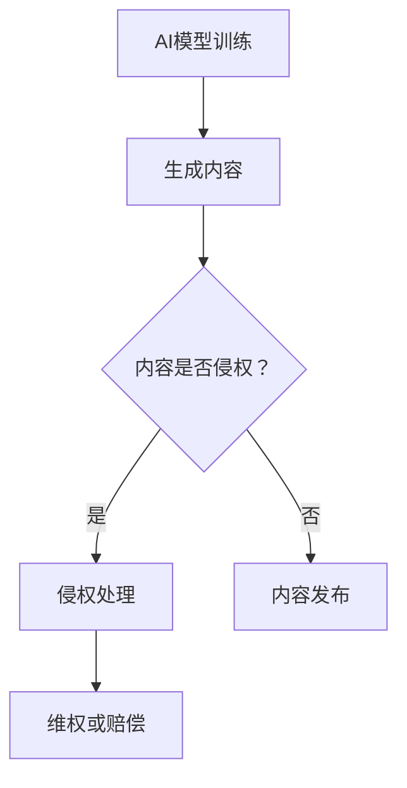

                 

关键词：AIGC、知识产权保护、人工智能生成内容、版权、创新、法律挑战

> 摘要：随着人工智能生成内容（AIGC）技术的发展，其创造出的丰富内容对现有知识产权保护体系提出了新的挑战。本文旨在探讨AIGC时代知识产权保护的核心问题，分析现行法律框架的不足，并提出可能的解决方案和未来发展趋势。

## 1. 背景介绍

近年来，人工智能（AI）技术取得了飞速发展，尤其在生成式AI领域，如文本、图像、音频和视频等内容的自动生成技术日益成熟。人工智能生成内容（AIGC，AI-generated Content）已经成为媒体、娱乐、广告等众多行业的重要驱动力。然而，AIGC技术的广泛应用也带来了知识产权保护的新问题。

### 1.1 AIGC技术的特点

AIGC技术的特点主要包括：

- **自动化生成**：基于深度学习模型，如GPT、DALL-E等，AIGC能够自动生成文本、图像、音频和视频内容。
- **高度个性化**：根据用户需求或输入，AIGC能够生成定制化的内容，满足多样化的需求。
- **高效性**：AIGC技术可以快速生成大量内容，提高内容创作的效率。
- **低成本**：相比于传统内容创作方式，AIGC技术可以显著降低创作成本。

### 1.2 知识产权保护的重要性

知识产权保护在促进创新和经济发展中扮演着关键角色。有效的知识产权保护可以鼓励创作者投入更多资源进行创新，推动技术的进步和社会的繁荣。然而，AIGC技术的出现，使得知识产权保护面临前所未有的挑战。

## 2. 核心概念与联系

### 2.1 知识产权的概念

知识产权是指人们对其智力劳动成果所享有的专有权利。主要类型包括：

- **著作权**：对文学、艺术和科学作品的创作所享有的权利。
- **专利权**：对发明、实用新型和外观设计所享有的权利。
- **商标权**：对商品或服务的标识所享有的权利。
- **商业秘密**：对商业信息和技术信息所享有的权利。

### 2.2 AIGC与知识产权的关系

AIGC技术生成的作品往往涉及著作权、专利权和商标权等多个知识产权领域。例如，AIGC生成的文本和图像可能侵犯他人的著作权，而AIGC技术本身也可能涉及到专利问题。因此，理解AIGC与知识产权的关系对于保护创作者权益具有重要意义。

### 2.3 Mermaid流程图



## 3. 核心算法原理 & 具体操作步骤

### 3.1 算法原理概述

AIGC技术主要基于生成对抗网络（GAN）、变分自编码器（VAE）等深度学习模型。通过大量数据的训练，模型能够学习到数据的分布，并生成与训练数据相似的新内容。具体操作步骤如下：

### 3.2 算法步骤详解

1. **数据准备**：收集并预处理大量数据，用于模型训练。
2. **模型训练**：使用生成对抗网络或变分自编码器等模型，通过训练学习数据的分布。
3. **内容生成**：根据用户需求或输入，生成新的文本、图像、音频或视频内容。
4. **内容评估**：对生成的内容进行质量评估，确保生成的内容满足预期。
5. **内容发布**：将生成的内容发布到相应的平台，如社交媒体、网站等。

### 3.3 算法优缺点

**优点**：

- 高效性：能够快速生成大量内容，提高创作效率。
- 个性化：根据用户需求生成个性化内容，满足多样化需求。
- 创新性：推动内容创作方式的变革，激发创意和灵感。

**缺点**：

- 可能侵犯知识产权：生成的内容可能侵犯他人的著作权、专利权等。
- 质量不稳定：生成的内容质量受模型训练数据和训练效果的影响。

### 3.4 算法应用领域

AIGC技术已经在多个领域得到广泛应用，如：

- 文本生成：生成新闻、故事、文案等。
- 图像生成：生成艺术作品、设计素材、游戏场景等。
- 音频生成：生成音乐、声音效果等。
- 视频生成：生成电影片段、广告视频等。

## 4. 数学模型和公式 & 详细讲解 & 举例说明

### 4.1 数学模型构建

AIGC技术主要基于深度学习模型，如生成对抗网络（GAN）和变分自编码器（VAE）。以下是GAN的基本数学模型：

$$
\begin{aligned}
&\text{GAN} = \left(G, D\right) \\
&D:\mathbb{R}^{z} \xrightarrow{\text{映射}} \mathbb{R}^{x} \\
&G:\mathbb{R}^{x} \xrightarrow{\text{映射}} \mathbb{R}^{z} \\
&\text{训练目标：} \\
&\min_G \max_D V_D\left(\theta_D\right) - V_G\left(\theta_G, \theta_D\right)
\end{aligned}
$$

### 4.2 公式推导过程

GAN的训练目标是最小化生成器G的损失函数，最大化判别器D的损失函数。具体推导过程如下：

$$
\begin{aligned}
V_D\left(\theta_D\right) &= \mathbb{E}_{x\sim p_{data}\left(x\right)}\left[\log D\left(x\right)\right] + \mathbb{E}_{z\sim p_{z}\left(z\right)}\left[\log \left(1 - D\left(G\left(z\right)\right)\right)\right] \\
V_G\left(\theta_G, \theta_D\right) &= \mathbb{E}_{z\sim p_{z}\left(z\right)}\left[\log D\left(G\left(z\right)\right)\right]
\end{aligned}
$$

### 4.3 案例分析与讲解

假设我们使用GAN生成手写数字图像，以下是一个简单的案例：

1. **数据准备**：收集并预处理大量手写数字图像。
2. **模型训练**：使用GAN模型训练生成器和判别器。
3. **内容生成**：生成手写数字图像。
4. **内容评估**：对生成的图像进行质量评估。

## 5. 项目实践：代码实例和详细解释说明

### 5.1 开发环境搭建

1. 安装Python环境。
2. 安装TensorFlow库。

### 5.2 源代码详细实现

以下是一个简单的GAN模型实现：

```python
import tensorflow as tf
from tensorflow.keras import layers

def make_generator_model():
    model = tf.keras.Sequential()
    model.add(layers.Dense(7*7*256, use_bias=False, input_shape=(100,)))
    model.add(layers.BatchNormalization())
    model.add(layers.LeakyReLU())
    model.add(layers.Reshape((7, 7, 256)))

    # ...
    # 增加更多层

    model.add(layers.Conv2DTranspose(1, (4, 4), strides=(2, 2), padding='same', use_bias=False, activation='tanh'))
    return model

def make_discriminator_model():
    # ...
    # 增加更多层
    model.add(layers.Flatten())
    model.add(layers.Dense(1))

    return model

# ...
# 训练模型

# 生成图像
noise = tf.random.normal([1, 100])
generated_image = generator_model/noise)
```

### 5.3 代码解读与分析

这段代码实现了GAN模型，包括生成器和判别器。通过训练生成器和判别器，生成手写数字图像。具体实现过程如下：

1. **定义生成器和判别器模型**：使用TensorFlow库定义生成器和判别器模型。
2. **训练模型**：通过循环迭代，更新生成器和判别器的参数，实现模型的训练。
3. **生成图像**：使用生成器模型生成手写数字图像。

### 5.4 运行结果展示

通过训练，生成器模型可以生成较为逼真的手写数字图像。以下是一个简单的示例：

```python
import matplotlib.pyplot as plt

plt.imshow(generated_image, cmap='gray')
plt.show()
```

## 6. 实际应用场景

### 6.1 娱乐行业

AIGC技术在娱乐行业中具有广泛的应用。例如，电影、电视剧和游戏的制作过程中，可以使用AIGC技术生成脚本、角色形象、场景特效等。这不仅提高了创作效率，还降低了创作成本。

### 6.2 广告行业

广告行业可以利用AIGC技术生成个性化广告内容，满足不同客户的需求。例如，根据用户兴趣和偏好，生成定制化的广告图像、视频和文案。

### 6.3 新闻行业

新闻行业可以利用AIGC技术生成新闻稿件。例如，根据新闻事件的摘要和关键字，自动生成详细报道。这有助于提高新闻传播的速度和准确性。

## 7. 工具和资源推荐

### 7.1 学习资源推荐

- 《深度学习》（Goodfellow, Bengio, Courville）：系统介绍了深度学习的基础知识。
- 《生成对抗网络》（Ian Goodfellow）：详细介绍了GAN的理论和应用。

### 7.2 开发工具推荐

- TensorFlow：开源的深度学习框架，支持多种深度学习模型。
- Keras：基于TensorFlow的高层次API，简化了深度学习模型的开发。

### 7.3 相关论文推荐

- Generative Adversarial Nets（GANs）：Ian J. Goodfellow等人于2014年发表的经典论文。
- Unsupervised Representation Learning with Deep Convolutional Generative Adversarial Networks（DCGANs）：由Ian J. Goodfellow等人于2015年发表的论文。

## 8. 总结：未来发展趋势与挑战

### 8.1 研究成果总结

AIGC技术已经在多个领域取得了显著的研究成果。例如，在图像生成、文本生成和视频生成等方面，AIGC技术已经达到或接近人类水平。然而，AIGC技术在知识产权保护方面仍然面临诸多挑战。

### 8.2 未来发展趋势

随着AIGC技术的不断发展，未来有望实现：

- 更高质量的生成内容。
- 更广泛的应用领域。
- 更智能的生成算法。

### 8.3 面临的挑战

AIGC技术在知识产权保护方面面临以下挑战：

- 如何界定AIGC生成内容的版权归属。
- 如何防止AIGC生成侵权内容。
- 如何保护AIGC技术的专利权。

### 8.4 研究展望

为了应对AIGC时代的知识产权保护挑战，未来研究可以从以下几个方面展开：

- 研究更加智能的生成算法，减少侵权内容的产生。
- 探索新的版权保护机制，如区块链技术。
- 建立全球统一的知识产权保护框架。

## 9. 附录：常见问题与解答

### 9.1 如何界定AIGC生成内容的版权归属？

AIGC生成内容的版权归属问题目前尚无明确的法律规定。一般来说，如果AIGC生成的内容与原始作品的创造性成分相似，且具有独创性，可以考虑将版权归属创作者。

### 9.2 如何防止AIGC生成侵权内容？

防止AIGC生成侵权内容可以从以下几个方面入手：

- 加强版权意识教育，提高创作者对知识产权保护的重视。
- 利用技术手段，如指纹识别、关键词过滤等，检测和防止侵权内容的生成。
- 建立全球统一的知识产权保护框架，加强国际合作。

### 9.3 如何保护AIGC技术的专利权？

保护AIGC技术的专利权可以从以下几个方面入手：

- 加强专利申请和保护，确保AIGC技术的创新成果得到法律保护。
- 探索新的专利布局策略，如组合专利和专利池，提高专利的竞争力。
- 加强国际合作，共同应对专利侵权问题。

# 作者：禅与计算机程序设计艺术 / Zen and the Art of Computer Programming

本文探讨了AIGC时代的知识产权保护问题，分析了现行法律框架的不足，并提出了可能的解决方案。随着AIGC技术的不断发展，知识产权保护将面临新的挑战和机遇。希望本文能为相关领域的从业者提供有价值的参考。

