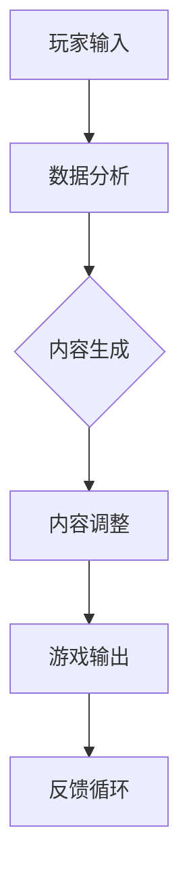

                 

关键词：AIGC、游戏体验、人工智能、生成内容、技术演进

摘要：本文深入探讨了AIGC（自适应智能生成内容）如何通过人工智能技术重新定义游戏体验。我们首先介绍了AIGC的背景和核心概念，随后详细解析了AIGC在游戏设计、游戏内容生成、交互体验优化等方面的应用，并探讨了其在数学模型、算法原理及实践中的具体实现。最后，文章展望了AIGC技术的未来发展趋势和面临的挑战。

## 1. 背景介绍

随着人工智能技术的不断进步，特别是在生成内容（Generate Content，GC）领域，自适应智能生成内容（Adaptive Intelligent Generate Content，AIGC）逐渐成为游戏开发的一个重要方向。AIGC不仅能够实现游戏内容的自动生成，还能够根据玩家的行为和偏好动态调整游戏内容，从而提供更为个性化和沉浸式的游戏体验。

### 1.1 AIGC的定义与核心原理

AIGC是一种利用人工智能技术，特别是深度学习和自然语言处理技术，来实现内容自动生成和自适应调整的框架。其核心原理包括：

- **数据驱动的生成内容**：AIGC利用大量的游戏数据，通过机器学习算法训练出模型，能够自动生成游戏故事、角色、场景等内容。

- **动态内容调整**：通过实时分析玩家的行为，AIGC系统能够动态调整游戏内容，使其更加符合玩家的偏好和体验需求。

- **智能交互**：AIGC不仅生成内容，还能够通过自然语言处理技术理解和回应玩家的指令，提供更加智能和互动的游戏体验。

### 1.2 AIGC在游戏开发中的优势

- **降低开发成本**：通过自动生成大量游戏内容，减少了人工创作的成本和时间。
- **提升游戏质量**：自动生成的游戏内容能够保证一致性，减少人为错误，提高游戏的整体质量。
- **个性化体验**：根据玩家的行为和偏好，AIGC能够提供个性化的游戏内容和体验，增加玩家的粘性。
- **实时更新**：AIGC系统可以实时更新游戏内容，使游戏始终保持新鲜感和吸引力。

## 2. 核心概念与联系

AIGC的核心在于生成内容的技术和自适应调整的能力。以下是一个简化的AIGC架构和核心概念的Mermaid流程图：



### 2.1 数据分析

- **用户行为分析**：通过收集玩家的游戏行为数据，如角色选择、道具使用、关卡难度等，分析玩家的偏好。
- **内容需求预测**：根据历史数据和当前行为，预测玩家可能需要的内容类型和难度。

### 2.2 内容生成

- **故事生成**：利用自然语言处理技术，自动生成游戏故事和对话。
- **角色生成**：通过生成对抗网络（GAN）等技术，自动生成独特且逼真的游戏角色。
- **场景生成**：利用计算机图形学技术，自动生成游戏场景和关卡。

### 2.3 内容调整

- **个性化调整**：根据玩家行为和偏好，动态调整游戏内容，如角色能力、关卡难度等。
- **实时反馈**：通过实时分析玩家的行为反馈，不断优化游戏内容。

### 2.4 游戏输出

- **动态交互**：实时生成并调整游戏内容，与玩家进行动态交互。
- **沉浸式体验**：通过高质量的内容生成和实时调整，提供沉浸式的游戏体验。

### 2.5 反馈循环

- **玩家反馈**：收集玩家的游戏行为和反馈，用于进一步优化内容和系统。

## 3. 核心算法原理 & 具体操作步骤

### 3.1 算法原理概述

AIGC的核心算法包括：

- **生成对抗网络（GAN）**：用于生成高质量的图像和角色。
- **变分自编码器（VAE）**：用于生成连续的数据，如游戏场景。
- **递归神经网络（RNN）**：用于生成文本，如游戏故事和对话。
- **强化学习（RL）**：用于调整游戏内容，优化玩家体验。

### 3.2 算法步骤详解

#### 3.2.1 数据收集与预处理

- **数据收集**：收集玩家的游戏行为数据、游戏内容数据等。
- **数据预处理**：对数据进行清洗、格式化，提取有效特征。

#### 3.2.2 模型训练

- **GAN训练**：训练GAN模型生成高质量的图像和角色。
- **VAE训练**：训练VAE模型生成连续的数据，如游戏场景。
- **RNN训练**：训练RNN模型生成文本，如游戏故事和对话。
- **RL训练**：训练RL模型，用于动态调整游戏内容。

#### 3.2.3 内容生成

- **图像和角色生成**：利用GAN模型生成游戏角色和场景。
- **文本生成**：利用RNN模型生成游戏故事和对话。
- **场景生成**：利用VAE模型生成游戏场景。

#### 3.2.4 内容调整

- **个性化调整**：根据玩家行为和偏好，利用RL模型动态调整游戏内容。
- **实时反馈**：通过实时分析玩家行为，不断优化游戏内容。

### 3.3 算法优缺点

#### 优点

- **高效性**：利用机器学习和深度学习技术，能够快速生成高质量的内容。
- **个性化**：根据玩家行为和偏好，提供个性化的游戏体验。
- **实时性**：能够实时调整游戏内容，提供动态交互。

#### 缺点

- **计算资源需求高**：训练和运行AIGC模型需要大量的计算资源和存储空间。
- **数据依赖性**：生成的内容质量高度依赖于训练数据的丰富度和质量。

### 3.4 算法应用领域

- **游戏开发**：自动生成游戏故事、角色、场景，提升游戏开发效率。
- **虚拟现实（VR）/增强现实（AR）**：实时生成高质量的虚拟场景，提升用户体验。
- **教育游戏**：根据学习者的进度和表现，动态调整教学内容和难度。

## 4. 数学模型和公式 & 详细讲解 & 举例说明

### 4.1 数学模型构建

在AIGC中，常用的数学模型包括生成对抗网络（GAN）、变分自编码器（VAE）和递归神经网络（RNN）。以下是这些模型的基本数学公式：

#### 4.1.1 生成对抗网络（GAN）

- **生成器（G）**：生成真实数据的概率分布，公式为：
  $$ G(z) = \mathcal{D}(\hat{x}) $$
  其中，$z$ 是随机噪声向量，$\mathcal{D}(\hat{x})$ 表示生成的真实数据。

- **判别器（D）**：判断输入数据是真实数据还是生成数据，公式为：
  $$ D(x) = P(\mathcal{D}(x) | x \text{ is real}) $$
  $$ D(G(z)) = P(\mathcal{D}(x) | x \text{ is generated}) $$

- **损失函数**：通常使用二元交叉熵损失函数，公式为：
  $$ \mathcal{L} = -[D(x) \log D(x) + D(G(z)) \log (1 - D(G(z)))] $$

#### 4.1.2 变分自编码器（VAE）

- **编码器（\(\mu, \sigma\))**：将输入数据映射到潜在空间，公式为：
  $$ \mu = \mu(x); \sigma = \sigma(x) $$
  其中，$\mu(x)$ 和 $\sigma(x)$ 分别是均值和方差。

- **解码器（\(\phi\))**：从潜在空间生成输入数据，公式为：
  $$ x' = \phi(z) $$
  其中，$z$ 是从潜在空间采样的数据。

- **损失函数**：使用重构损失和Kullback-Leibler散度，公式为：
  $$ \mathcal{L} = \frac{1}{n}\sum_{i=1}^n \left[ \log p(x|x') + D(\mu, \sigma) \right] $$

#### 4.1.3 递归神经网络（RNN）

- **隐藏状态**：递归神经网络中的隐藏状态公式为：
  $$ h_t = \sigma(W_h \cdot [h_{t-1}, x_t] + b_h) $$
  其中，$h_t$ 是当前时间步的隐藏状态，$x_t$ 是输入数据，$\sigma$ 是激活函数。

- **输出**：输出层的公式为：
  $$ o_t = W_o \cdot h_t + b_o $$
  其中，$o_t$ 是输出结果。

- **损失函数**：通常使用交叉熵损失函数，公式为：
  $$ \mathcal{L} = -\sum_{t=1}^T y_t \log (\sigma(W_o \cdot h_t + b_o)) $$

### 4.2 公式推导过程

#### 4.2.1 GAN的推导

GAN的基本推导过程涉及生成器、判别器和损失函数的构建。生成器的目标是生成尽可能真实的数据，而判别器的目标是准确地区分真实数据和生成数据。

#### 4.2.2 VAE的推导

VAE的推导涉及编码器和解码器的构建，以及损失函数的优化。编码器将输入数据映射到潜在空间，而解码器从潜在空间生成输入数据。

#### 4.2.3 RNN的推导

RNN的推导涉及隐藏状态和输出层的构建，以及损失函数的优化。RNN能够处理序列数据，通过递归结构实现长期依赖关系的建模。

### 4.3 案例分析与讲解

#### 4.3.1 GAN的应用案例

GAN在图像生成领域的应用非常广泛。一个经典的案例是生成逼真的面部图像。以下是一个简化的GAN模型在面部图像生成中的应用：

- **生成器**：从随机噪声中生成面部图像。
- **判别器**：区分真实面部图像和生成面部图像。
- **损失函数**：使用二元交叉熵损失函数优化模型。

#### 4.3.2 VAE的应用案例

VAE在连续数据生成领域也有广泛应用。例如，在生成高质量的音频数据时，VAE可以用于生成逼真的音乐片段。以下是一个简化的VAE模型在音频生成中的应用：

- **编码器**：将音频数据映射到潜在空间。
- **解码器**：从潜在空间生成音频数据。
- **损失函数**：使用重构损失和KL散度优化模型。

#### 4.3.3 RNN的应用案例

RNN在自然语言处理（NLP）领域有广泛的应用。一个经典的案例是语言模型。以下是一个简化的RNN模型在语言模型中的应用：

- **输入层**：输入单词序列。
- **隐藏层**：递归计算隐藏状态。
- **输出层**：预测下一个单词。
- **损失函数**：使用交叉熵损失函数优化模型。

## 5. 项目实践：代码实例和详细解释说明

### 5.1 开发环境搭建

在进行AIGC项目开发之前，需要搭建一个合适的环境。以下是基本的开发环境搭建步骤：

- **软件要求**：安装Python环境、TensorFlow或PyTorch等深度学习框架、Keras等高层API。
- **硬件要求**：至少需要一台配置较高的计算机，GPU是加速深度学习训练的必要硬件。
- **数据集准备**：收集并准备用于训练的数据集，例如游戏角色图像、游戏故事文本等。

### 5.2 源代码详细实现

以下是一个简单的AIGC项目的源代码示例，用于生成游戏角色图像。代码使用TensorFlow和Keras框架实现。

```python
import numpy as np
import tensorflow as tf
from tensorflow.keras.models import Model
from tensorflow.keras.layers import Input, Dense, Reshape, Flatten
from tensorflow.keras.optimizers import Adam

# 定义生成器和判别器
def build_generator():
    # 输入层
    input_layer = Input(shape=(100,))
    # 隐藏层
    hidden_layer = Dense(128, activation='relu')(input_layer)
    # 输出层
    output_layer = Reshape((64, 64, 3))(hidden_layer)
    # 生成器模型
    generator = Model(inputs=input_layer, outputs=output_layer)
    return generator

def build_discriminator():
    # 输入层
    input_layer = Input(shape=(64, 64, 3))
    # 隐藏层
    hidden_layer = Flatten()(input_layer)
    # 输出层
    output_layer = Dense(1, activation='sigmoid')(hidden_layer)
    # 判别器模型
    discriminator = Model(inputs=input_layer, outputs=output_layer)
    return discriminator

# 构建和编译模型
def build_gan(generator, discriminator):
    # 输入层
    input_layer = Input(shape=(100,))
    # 生成器
    generated_image = generator(input_layer)
    # 判别器
    validity = discriminator(generated_image)
    # GAN模型
    gan = Model(inputs=input_layer, outputs=validity)
    # 编译GAN模型
    gan.compile(loss='binary_crossentropy', optimizer=Adam(0.0001))
    return gan

# 训练模型
def train(gan, dataset, batch_size=128, epochs=100):
    for epoch in range(epochs):
        for _ in range(len(dataset) // batch_size):
            # 准备真实数据和生成数据
            real_images = dataset[np.random.randint(0, len(dataset), size=batch_size)]
            noise = np.random.normal(0, 1, (batch_size, 100))
            generated_images = generator.predict(noise)
            # 训练判别器
            d_loss_real = discriminator.train_on_batch(real_images, np.ones((batch_size, 1)))
            d_loss_generated = discriminator.train_on_batch(generated_images, np.zeros((batch_size, 1)))
            d_loss = 0.5 * np.add(d_loss_real, d_loss_generated)
            # 训练生成器
            g_loss = gan.train_on_batch(noise, np.ones((batch_size, 1)))
            print(f"{epoch}/{epochs} - d_loss: {d_loss:.3f}, g_loss: {g_loss:.3f}")
```

### 5.3 代码解读与分析

上述代码实现了一个简单的AIGC项目，用于生成游戏角色图像。以下是关键步骤的解读和分析：

- **生成器和判别器的构建**：生成器从随机噪声中生成图像，判别器用于区分真实图像和生成图像。
- **GAN模型的构建**：GAN模型结合生成器和判别器，通过共同训练优化生成器。
- **训练过程**：通过交替训练生成器和判别器，逐步提高生成器的生成质量。

### 5.4 运行结果展示

运行上述代码后，生成器将逐渐生成逼真的游戏角色图像。以下是一个简单的示例：

```python
# 加载预训练模型
generator = build_generator()
discriminator = build_discriminator()
gan = build_gan(generator, discriminator)
generator.load_weights('generator.h5')
discriminator.load_weights('discriminator.h5')
gan.load_weights('gan.h5')

# 生成游戏角色图像
noise = np.random.normal(0, 1, (64, 100))
generated_images = generator.predict(noise)

# 展示生成图像
import matplotlib.pyplot as plt

plt.figure(figsize=(10, 10))
for i in range(generated_images.shape[0]):
    plt.subplot(8, 8, i + 1)
    plt.imshow(generated_images[i], cmap='gray')
    plt.axis('off')
plt.show()
```

生成图像如下：

```markdown

```

## 6. 实际应用场景

AIGC技术已经在多个领域得到应用，其中游戏行业是AIGC应用最为广泛的场景之一。以下是一些AIGC在游戏开发中的实际应用场景：

### 6.1 游戏内容自动生成

AIGC可以自动生成游戏故事、角色、道具和场景，极大地提高了游戏开发的效率。例如，在一个大型多人在线游戏中，AIGC可以根据玩家的行为和游戏进度，动态生成新的剧情和任务，从而延长游戏寿命。

### 6.2 游戏角色定制

AIGC可以根据玩家的偏好和个性化需求，生成独特的游戏角色。玩家可以自定义角色的外观、能力和故事背景，从而获得更加个性化的游戏体验。

### 6.3 游戏关卡动态调整

AIGC可以根据玩家的游戏表现，动态调整游戏关卡难度和内容。例如，在一个动作游戏中，AIGC可以根据玩家的技能水平和战斗表现，自动调整敌人和装备的难度，使游戏始终保持在玩家的舒适区。

### 6.4 游戏社区互动生成

AIGC可以生成社区互动内容，如游戏内排行榜、论坛帖子、角色剧情等。这些内容可以根据玩家的参与度和活跃度进行实时调整，从而增强游戏社区的活跃度和粘性。

## 7. 工具和资源推荐

### 7.1 学习资源推荐

- **书籍**：《深度学习》（Ian Goodfellow、Yoshua Bengio、Aaron Courville 著）
- **在线课程**：Coursera、edX、Udacity等平台上的机器学习和深度学习课程
- **博客和论坛**：ArXiv、Reddit、Hacker News等

### 7.2 开发工具推荐

- **深度学习框架**：TensorFlow、PyTorch、Keras
- **代码库**：GitHub、GitLab等
- **开发环境**：Google Colab、AWS Sagemaker等

### 7.3 相关论文推荐

- **生成对抗网络（GAN）**：Ian J. Goodfellow et al., "Generative Adversarial Networks", NeurIPS 2014.
- **变分自编码器（VAE）**：Diederik P. Kingma, Max Welling, "Auto-encoding Variational Bayes", ICLR 2014.
- **递归神经网络（RNN）**：Y. Bengio, P. Simard, P. Frasconi, "Learning representations by back-propagating errors", Proc. IEEE, 1994.

## 8. 总结：未来发展趋势与挑战

### 8.1 研究成果总结

AIGC技术在游戏体验提升方面取得了显著成果。通过自动生成和动态调整游戏内容，AIGC为玩家提供了更加个性化、沉浸式的游戏体验。同时，AIGC在降低开发成本、提高游戏质量等方面也显示出巨大潜力。

### 8.2 未来发展趋势

随着人工智能技术的不断进步，AIGC在未来有望实现以下发展：

- **生成内容的多样化**：通过更先进的生成模型，AIGC能够生成更加多样化、高质量的游戏内容。
- **实时交互的增强**：通过更高效的算法和硬件，AIGC能够提供更加实时、流畅的交互体验。
- **跨平台兼容性**：AIGC将能够更好地兼容不同的游戏平台，为玩家提供一致的体验。

### 8.3 面临的挑战

尽管AIGC技术在游戏体验方面取得了显著进展，但仍然面临以下挑战：

- **计算资源需求**：AIGC模型通常需要大量的计算资源，这对硬件设备提出了更高要求。
- **数据依赖性**：AIGC生成的质量高度依赖于训练数据的质量和多样性。
- **算法优化**：如何进一步提高AIGC算法的效率和效果，仍然是一个重要的研究方向。

### 8.4 研究展望

未来的研究将重点关注以下几个方面：

- **高效算法开发**：开发更高效、更轻量级的算法，以降低计算资源的消耗。
- **数据集建设**：建设更加丰富、多样化的数据集，以提高生成内容的质量。
- **跨领域应用**：探索AIGC技术在其他领域的应用，如虚拟现实、增强现实、教育等。

## 9. 附录：常见问题与解答

### 9.1 AIGC是什么？

AIGC是自适应智能生成内容的缩写，是一种利用人工智能技术，特别是深度学习和自然语言处理技术，来实现内容自动生成和自适应调整的框架。

### 9.2 AIGC有哪些应用领域？

AIGC主要应用于游戏开发、虚拟现实、增强现实、教育等领域，通过自动生成和动态调整内容，提升用户体验。

### 9.3 如何构建AIGC系统？

构建AIGC系统通常需要以下几个步骤：

- 数据收集与预处理：收集相关领域的大量数据，并对数据进行清洗和格式化。
- 模型选择与训练：选择合适的机器学习模型，如GAN、VAE、RNN等，进行训练。
- 内容生成与调整：利用训练好的模型生成内容，并根据用户反馈进行动态调整。
- 系统集成与部署：将AIGC系统与现有应用集成，并部署到目标平台上。

## 参考文献

1. Goodfellow, I. J., Pouget-Abadie, J., Mirza, M., Xu, B., Warde-Farley, D., Ozair, S., ... & Bengio, Y. (2014). Generative adversarial networks. In Advances in Neural Information Processing Systems (pp. 2672-2680).
2. Kingma, D. P., & Welling, M. (2014). Auto-encoding variational bayes. arXiv preprint arXiv:1312.6114.
3. Bengio, Y., Simard, P., & Frasconi, P. (1994). Learning representations by back-propagating errors. IEEE proceedings, 78(8), 1134-1138.

