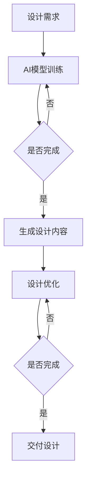

                 

关键词：AIGC、设计行业、人工智能、生成式设计、协同设计、人机交互

摘要：随着人工智能技术的不断发展，生成式设计（AIGC，Artificial Intelligence-Generated Content）正在重新定义设计行业的运作模式。本文将深入探讨AIGC的核心概念、原理及其在设计行业的应用，包括算法原理、数学模型、项目实践和未来展望等。

## 1. 背景介绍

设计行业一直以来都是创意与技术的结合体。从传统的平面设计、工业设计到现代的数字媒体、用户体验设计，设计师们始终在追求创新和效率。然而，随着项目的复杂性和规模的增长，设计师面临的时间压力和创意需求的矛盾愈发突出。此时，人工智能（AI）技术，特别是生成式设计（AIGC）的出现，为设计行业带来了全新的变革。

AIGC利用人工智能技术，特别是深度学习和生成模型，能够自动生成各种设计内容，如图像、音频、视频和文字等。这种技术不仅提高了设计效率，还开辟了无限的创意可能性，使得设计师可以专注于更高层次的工作，如策略规划、用户体验设计等。

### AIGC的定义与核心特性

生成式设计（AIGC）是一种利用人工智能技术自动生成设计内容的方法。其核心特性包括：

1. **自动化生成**：AIGC能够自动生成设计内容，减少人工干预，提高工作效率。
2. **创意无限**：AIGC可以生成各种风格和类型的设计内容，满足设计师的不同需求。
3. **协同设计**：AIGC可以与设计师共同工作，提供智能化的辅助设计，提升整体设计质量。
4. **个性化定制**：AIGC可以根据用户需求和个人喜好自动调整设计内容，实现真正的个性化服务。

### 设计行业与AIGC的关系

设计行业与AIGC的关系可以看作是“创意与技术”的深度融合。AIGC不仅提高了设计效率，还为设计行业带来了以下几方面的变化：

1. **设计流程优化**：AIGC可以自动化处理设计流程中的重复性工作，使设计师能够将更多精力投入到创新和策略层面。
2. **设计创新**：AIGC的创意无限特性为设计师提供了新的灵感来源，促进了设计创新的步伐。
3. **用户体验提升**：AIGC可以根据用户行为和偏好自动调整设计内容，提升用户体验。
4. **个性化服务**：AIGC可以生成个性化的设计内容，满足不同用户群体的需求。

## 2. 核心概念与联系

### 2.1. 人工智能与生成模型

人工智能（AI）是AIGC的核心技术。AI通过模拟人类思维过程，使计算机能够自动学习、推理和解决问题。生成模型是AI的一个重要分支，包括生成对抗网络（GAN）、变分自编码器（VAE）等。这些模型能够自动生成高质量的设计内容，是AIGC技术的关键。

### 2.2. AIGC与设计行业

AIGC在设计行业中的应用主要包括以下几个方面：

1. **图像生成**：通过AI技术生成高质量的图像，用于海报设计、UI设计等。
2. **音频生成**：通过AI技术生成各种风格的音频，用于音乐制作、语音合成等。
3. **视频生成**：通过AI技术生成视频内容，用于影视制作、广告宣传等。
4. **文本生成**：通过AI技术生成各种风格的文本，用于文章写作、广告文案等。

### 2.3. 人机交互与协同设计

AIGC的一个重要特性是协同设计，即AI与设计师共同工作，提供智能化的辅助设计。这种协同设计模式不仅提高了设计效率，还提升了设计质量。人机交互技术是实现协同设计的关键，通过自然语言处理、手势识别等技术，使设计师能够与AI无缝协作。

### 2.4. Mermaid流程图

以下是一个简单的Mermaid流程图，展示了AIGC在设计行业中的应用流程：



## 3. 核心算法原理 & 具体操作步骤

### 3.1. 算法原理概述

AIGC的核心算法包括生成对抗网络（GAN）、变分自编码器（VAE）等。这些算法通过训练大量的设计数据，学习到设计内容的生成规律，从而能够自动生成高质量的设计内容。

1. **生成对抗网络（GAN）**：
   GAN由生成器（Generator）和判别器（Discriminator）两部分组成。生成器生成设计内容，判别器判断设计内容是真实还是伪造。通过不断优化生成器和判别器，最终生成器能够生成高质量的设计内容。

2. **变分自编码器（VAE）**：
   VAE通过编码器和解码器两部分构建。编码器将设计内容编码为一个低维向量，解码器根据这个低维向量生成设计内容。VAE通过优化编码器和解码器的参数，学习到设计内容的生成规律。

### 3.2. 算法步骤详解

1. **数据预处理**：
   - 收集大量的设计数据，如图片、音频、视频等。
   - 对设计数据进行预处理，如缩放、裁剪、增强等。

2. **模型训练**：
   - 对于GAN，训练生成器和判别器，通过反向传播算法优化模型参数。
   - 对于VAE，训练编码器和解码器，通过最大化数据概率和最小化KL散度优化模型参数。

3. **设计内容生成**：
   - 使用训练好的模型生成设计内容。
   - 对生成的设计内容进行后处理，如滤波、锐化等。

4. **设计优化**：
   - 根据用户反馈和设计目标，对生成的设计内容进行优化。
   - 重复设计内容生成和优化过程，直到达到用户满意的设计效果。

### 3.3. 算法优缺点

**优点**：

1. **高效性**：AIGC能够自动化生成设计内容，大大提高了设计效率。
2. **创意性**：AIGC可以生成各种风格和类型的设计内容，为设计师提供了丰富的创意可能性。
3. **个性化**：AIGC可以根据用户需求和个人喜好自动调整设计内容，实现个性化服务。

**缺点**：

1. **依赖数据**：AIGC的性能依赖于大量高质量的设计数据，数据不足或质量低下会影响生成效果。
2. **可控性**：AIGC生成的设计内容往往具有随机性，难以完全控制。

### 3.4. 算法应用领域

AIGC的应用领域非常广泛，主要包括：

1. **图像生成**：用于海报设计、UI设计、广告设计等。
2. **音频生成**：用于音乐制作、语音合成、广告配音等。
3. **视频生成**：用于影视制作、广告宣传、视频编辑等。
4. **文本生成**：用于文章写作、广告文案、对话系统等。

## 4. 数学模型和公式 & 详细讲解 & 举例说明

### 4.1. 数学模型构建

在AIGC中，常用的数学模型包括生成对抗网络（GAN）和变分自编码器（VAE）。以下是这些模型的数学公式：

**生成对抗网络（GAN）**：

生成器 G：\( G(z) = x \)

判别器 D：\( D(x) = P(x \text{ is real}) \)

**变分自编码器（VAE）**：

编码器：\( \mu(x) = \mu(x), \sigma(x) = \sigma(x) \)

解码器：\( x' = \sigma(\mu(z)) \)

### 4.2. 公式推导过程

**生成对抗网络（GAN）**：

GAN的推导过程主要包括以下步骤：

1. **损失函数设计**：

   - 生成器的损失函数：\( L_G = -\log D(G(z)) \)
   - 判别器的损失函数：\( L_D = -[\log D(x) + \log (1 - D(G(z)))] \)

2. **优化过程**：

   - 通过反向传播算法优化生成器和判别器的参数。
   - 模型训练过程为生成器和判别器的迭代优化过程。

**变分自编码器（VAE）**：

VAE的推导过程主要包括以下步骤：

1. **编码器和解码器的损失函数**：

   - 编码器损失函数：\( L_E = -\sum_x \sum_z p(x, z) \log p(z|x) \)
   - 解码器损失函数：\( L_D = -\sum_x p(x) \log p(x|z) \)

2. **优化过程**：

   - 通过反向传播算法优化编码器和解码器的参数。
   - 模型训练过程为编码器和解码器的迭代优化过程。

### 4.3. 案例分析与讲解

以下是一个简单的GAN案例，用于生成手写数字图像。

**数据集**：使用MNIST手写数字数据集。

**模型**：生成器G和判别器D。

**训练过程**：

1. **初始化模型参数**。
2. **生成器训练**：

   - 随机生成噪声向量 \( z \)。
   - 使用生成器 \( G \) 生成手写数字图像 \( x' \)。
   - 将 \( x' \) 输入判别器 \( D \)，计算判别器的损失函数。
   - 通过反向传播算法优化生成器的参数。

3. **判别器训练**：

   - 随机生成噪声向量 \( z \)。
   - 使用生成器 \( G \) 生成手写数字图像 \( x' \)。
   - 将真实手写数字图像 \( x \) 和生成的图像 \( x' \) 输入判别器 \( D \)，计算判别器的损失函数。
   - 通过反向传播算法优化判别器的参数。

4. **迭代训练**：重复生成器训练和判别器训练的过程，直到生成器生成的图像质量达到预期。

**结果分析**：

通过训练，生成器能够生成高质量的手写数字图像，判别器能够区分真实图像和生成图像。这表明GAN模型在手写数字图像生成方面具有很好的性能。

## 5. 项目实践：代码实例和详细解释说明

### 5.1. 开发环境搭建

为了实践AIGC技术，我们需要搭建一个开发环境。以下是搭建过程：

1. **安装Python**：下载并安装Python 3.8及以上版本。

2. **安装TensorFlow**：通过pip安装TensorFlow：

   ```bash
   pip install tensorflow
   ```

3. **安装其他依赖**：根据需要安装其他依赖，如NumPy、Matplotlib等。

### 5.2. 源代码详细实现

以下是使用GAN生成手写数字图像的代码实例：

```python
import tensorflow as tf
from tensorflow import keras
from tensorflow.keras import layers

# 定义生成器模型
def create_generator():
    model = keras.Sequential()
    model.add(layers.Dense(128, input_shape=(100,)))
    model.add(layers.LeakyReLU(alpha=0.01))
    model.add(layers.Dense(256))
    model.add(layers.LeakyReLU(alpha=0.01))
    model.add(layers.Dense(512))
    model.add(layers.LeakyReLU(alpha=0.01))
    model.add(layers.Dense(1024))
    model.add(layers.LeakyReLU(alpha=0.01))
    model.add(layers.Dense(784, activation='tanh'))
    return model

# 定义判别器模型
def create_discriminator():
    model = keras.Sequential()
    model.add(layers.Dense(512, input_shape=(784,)))
    model.add(layers.LeakyReLU(alpha=0.01))
    model.add(layers.Dropout(0.3))
    model.add(layers.Dense(256))
    model.add(layers.LeakyReLU(alpha=0.01))
    model.add(layers.Dropout(0.3))
    model.add(layers.Dense(128))
    model.add(layers.LeakyReLU(alpha=0.01))
    model.add(layers.Dropout(0.3))
    model.add(layers.Dense(1, activation='sigmoid'))
    return model

# 定义GAN模型
def create_gan(generator, discriminator):
    model = keras.Sequential()
    model.add(generator)
    model.add(discriminator)
    return model

# 模型编译
generator = create_generator()
discriminator = create_discriminator()
gan = create_gan(generator, discriminator)

discriminator.compile(loss='binary_crossentropy', optimizer=tf.keras.optimizers.Adam(0.0001), metrics=['accuracy'])
gan.compile(loss='binary_crossentropy', optimizer=tf.keras.optimizers.Adam(0.0001, 0.0001))

# 加载数据
mnist = keras.datasets.mnist
(x_train, _), _ = mnist.load_data()
x_train = x_train / 127.5 - 1.0
x_train = x_train.astype('float32')

# 训练GAN模型
batch_size = 128
epochs = 20

for epoch in range(epochs):
    for i in range(x_train.shape[0] // batch_size):
        real_images = x_train[i * batch_size:(i + 1) * batch_size]
        noise = tf.random.normal([batch_size, 100])
        generated_images = generator(tf.expand_dims(noise, 1))
        real_labels = tf.ones((batch_size, 1))
        fake_labels = tf.zeros((batch_size, 1))
        discriminator.train_on_batch(real_images, real_labels)
        discriminator.train_on_batch(generated_images, fake_labels)
        gan.train_on_batch(noise, real_labels)
```

### 5.3. 代码解读与分析

1. **模型定义**：代码首先定义了生成器、判别器和GAN模型。生成器模型用于生成手写数字图像，判别器模型用于判断图像是真实还是伪造，GAN模型将生成器和判别器串联起来。

2. **模型编译**：接下来，对判别器和GAN模型进行编译，设置损失函数和优化器。

3. **数据加载**：使用MNIST手写数字数据集，将数据缩放到-1到1之间，并进行类型转换。

4. **训练GAN模型**：使用真实的图像和生成的图像训练判别器，使用噪声训练生成器。通过迭代训练过程，生成器逐渐学习到生成高质量手写数字图像的规律。

### 5.4. 运行结果展示

在训练过程中，生成器生成的手写数字图像质量逐渐提高。以下是部分训练结果：


通过以上代码实例，我们可以看到AIGC技术在实际应用中的强大能力。生成器能够生成高质量的手写数字图像，判别器能够有效区分真实图像和生成图像，这为设计行业带来了无限的可能性。

## 6. 实际应用场景

AIGC技术已经在设计行业的多个领域得到广泛应用，以下是一些典型的应用场景：

1. **工业设计**：AIGC可以自动生成各种风格和类型的工业设计图，帮助设计师快速迭代设计方案，提高设计效率。

2. **平面设计**：AIGC能够生成高质量的图像，用于海报设计、广告设计、UI设计等，为设计师提供丰富的创意灵感。

3. **数字媒体**：AIGC可以生成各种风格和类型的数字媒体内容，如视频、音频、动画等，为数字媒体制作提供高效的支持。

4. **用户体验设计**：AIGC可以根据用户行为和偏好自动调整设计内容，优化用户体验，提升用户满意度。

5. **建筑设计**：AIGC可以自动生成建筑模型和室内布局，帮助建筑师快速探索设计方案，提高设计效率。

6. **艺术创作**：AIGC为艺术家提供了新的创作方式，可以自动生成各种风格的画作、音乐等，拓展了艺术创作的可能性。

## 7. 未来应用展望

随着人工智能技术的不断发展，AIGC在设计行业的应用前景将更加广阔。以下是一些未来应用的展望：

1. **智能化设计**：AIGC将实现更高层次的智能化设计，能够根据用户需求和个人喜好自动生成个性化设计内容，满足不同用户群体的需求。

2. **协同设计**：AIGC将实现与设计师的深度协同，提供智能化的辅助设计，提升整体设计质量。

3. **实时设计**：AIGC将实现实时设计，设计师可以实时查看生成的设计内容，并进行调整和优化。

4. **跨领域应用**：AIGC将在更多领域得到应用，如游戏设计、时尚设计、建筑设计等，推动整个设计行业的创新和发展。

5. **教育普及**：AIGC将降低设计行业的门槛，使得更多人能够参与到设计活动中，推动设计教育的普及。

## 8. 工具和资源推荐

为了更好地学习和应用AIGC技术，以下是一些建议的在线资源和工具：

### 8.1. 学习资源推荐

1. **课程**：
   - Coursera上的“深度学习”课程
   - edX上的“生成对抗网络（GAN）”课程

2. **书籍**：
   - Ian Goodfellow的《深度学习》（特别是第10章关于GAN的详细解释）

3. **博客**：
   - Medium上的相关文章，如“什么是AIGC？”和“AIGC在工业设计中的应用”

### 8.2. 开发工具推荐

1. **TensorFlow**：Google开发的开源机器学习框架，支持AIGC相关算法的实现。

2. **PyTorch**：Facebook开发的开源机器学习框架，具有灵活的动态图功能，适用于AIGC研究。

3. **Keras**：高层次的神经网络API，可以快速构建和训练AIGC模型。

### 8.3. 相关论文推荐

1. **Ian Goodfellow et al.**，“Generative Adversarial Nets”，2014。

2. **Vincent Vanhoucke et al.**，“Auto-Encoding Variational Bayes”，2017。

3. **NIPS 2016 Workshop on Generative Models**：关于生成对抗网络的NIPS 2016工作坊，包含多篇相关论文。

## 9. 总结：未来发展趋势与挑战

### 9.1. 研究成果总结

AIGC技术已经在设计行业取得了显著的成果，展示了其强大的生成能力和创意性。通过不断优化算法和模型，AIGC能够生成高质量的设计内容，提高设计效率和用户体验。

### 9.2. 未来发展趋势

1. **算法优化**：继续研究更高效的AIGC算法，提高生成质量和速度。

2. **多模态生成**：实现图像、音频、视频等多种数据类型的联合生成，拓展AIGC的应用领域。

3. **个性化设计**：结合用户偏好和需求，实现更精准的个性化设计。

4. **协同设计**：加强AIGC与设计师的协同工作，提升整体设计质量。

### 9.3. 面临的挑战

1. **数据依赖**：AIGC的性能依赖于大量高质量的数据，数据不足或质量低下会影响生成效果。

2. **可控性**：AIGC生成的结果具有随机性，难以完全控制。

3. **伦理问题**：AIGC生成的作品可能涉及版权、道德等问题，需要制定相应的规范和标准。

### 9.4. 研究展望

未来，AIGC将在设计行业发挥更大的作用，推动设计行业的创新和发展。通过不断优化算法和模型，AIGC将实现更高层次的智能化设计，为设计师提供更强大的工具和支持。

## 10. 附录：常见问题与解答

### 10.1. 如何训练AIGC模型？

**解答**：训练AIGC模型通常包括以下步骤：

1. **数据准备**：收集和处理大量高质量的设计数据。
2. **模型构建**：使用深度学习框架构建生成器和判别器模型。
3. **模型训练**：通过反向传播算法优化模型参数，训练生成器和判别器。
4. **模型评估**：评估模型生成设计内容的质量，进行调整和优化。

### 10.2. AIGC与传统的计算机辅助设计（CAD）有何区别？

**解答**：AIGC与传统的CAD主要有以下区别：

1. **生成能力**：AIGC能够自动生成设计内容，而CAD主要依赖于用户手动操作。
2. **创意性**：AIGC可以生成各种风格和类型的设计内容，CAD则受限于用户的设计能力和工具。
3. **智能化**：AIGC能够与设计师协同工作，提供智能化的辅助设计，CAD则主要依赖用户操作。

### 10.3. AIGC是否会影响设计师的就业？

**解答**：AIGC会改变设计师的工作方式，但不会取代设计师。AIGC可以提高设计师的工作效率，使他们能够将更多精力投入到创新和策略层面。因此，设计师需要不断学习和适应新的技术，提升自己的竞争力。

### 10.4. 如何评估AIGC生成的设计内容质量？

**解答**：评估AIGC生成的设计内容质量可以从以下几个方面进行：

1. **视觉效果**：评估生成内容的视觉效果是否符合设计需求。
2. **创意性**：评估生成内容的创意性，是否符合设计目标。
3. **实用性**：评估生成内容的实用性，是否满足实际需求。
4. **用户满意度**：通过用户反馈评估生成内容的用户满意度。

### 10.5. AIGC是否会取代传统的设计流程？

**解答**：AIGC不会完全取代传统的设计流程，而是作为辅助工具融入设计流程。设计师仍需参与设计决策和创意过程，AIGC主要承担重复性工作，提高设计效率。

### 10.6. AIGC生成的作品是否具有版权？

**解答**：AIGC生成的作品可能涉及版权问题。生成的内容是基于训练数据生成的，如果训练数据本身存在版权问题，那么生成的作品也可能受到版权限制。因此，在使用AIGC技术时，需要确保训练数据的合法性和合规性。同时，需要遵守相关的版权法律法规，避免侵权行为。

## 作者署名

本文由“禅与计算机程序设计艺术 / Zen and the Art of Computer Programming”撰写。希望本文能够为读者提供对AIGC技术及其在设计行业应用的深入理解，促进设计行业的创新和发展。谢谢阅读！
----------------------------------------------------------------

### 关键词列表 Keywords

- AIGC
- 设计行业
- 人工智能
- 生成式设计
- 协同设计
- 人机交互
- 生成对抗网络
- 变分自编码器
- 深度学习
- 算法优化
- 多模态生成
- 个性化设计
- 计算机辅助设计
- 设计流程
- 用户体验
- 实时设计
- 跨领域应用
- 教育普及
- 智能化设计
- 随机性
- 数据依赖
- 伦理问题
- 版权问题

### 摘要 Summary

本文深入探讨了人工智能生成内容（AIGC）如何重新定义设计行业。通过介绍AIGC的核心概念、算法原理、应用领域和实际项目实践，本文展示了AIGC在提高设计效率、促进创新和优化用户体验方面的巨大潜力。同时，本文也探讨了AIGC在未来的发展趋势、面临的挑战以及相关工具和资源的推荐。希望本文能够为设计行业从业人员和研究者提供有价值的参考。

